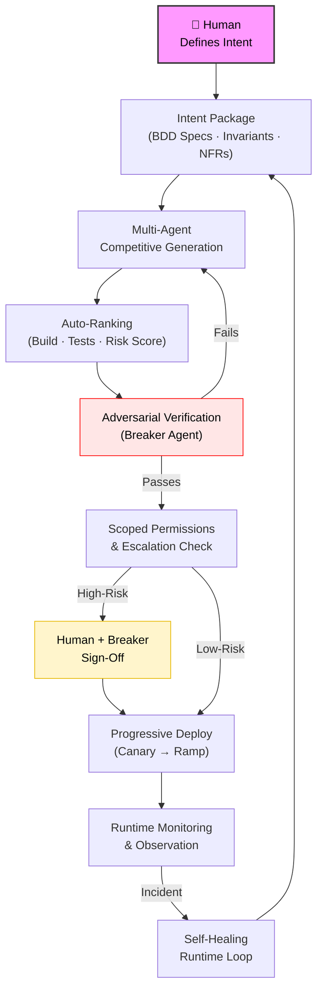
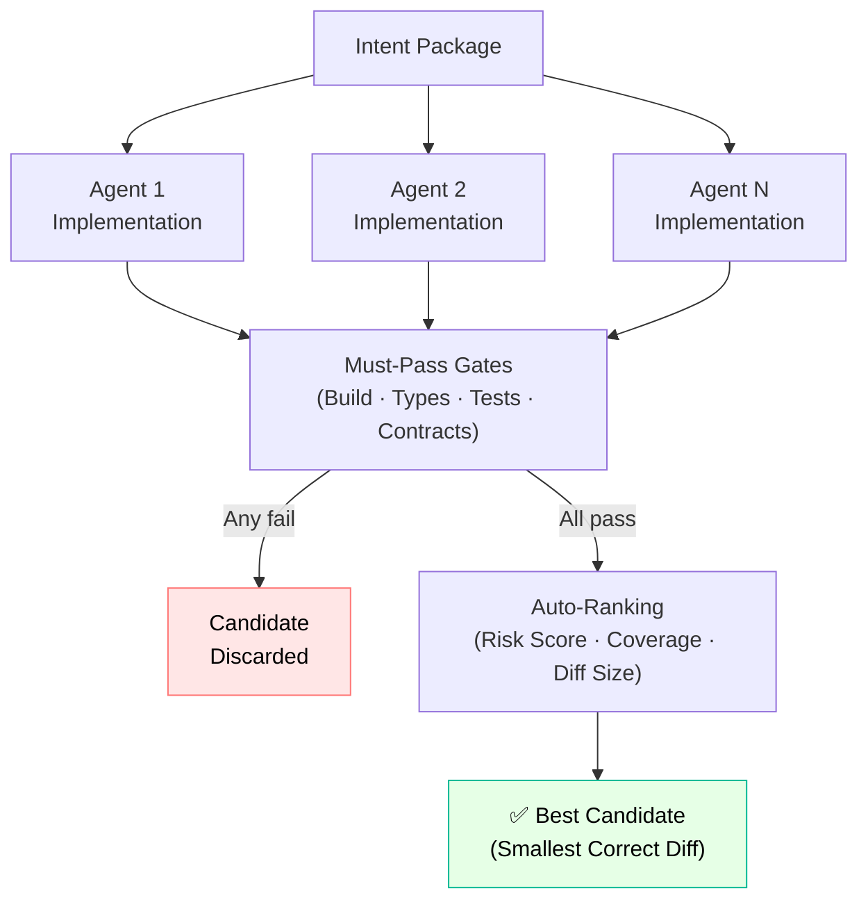
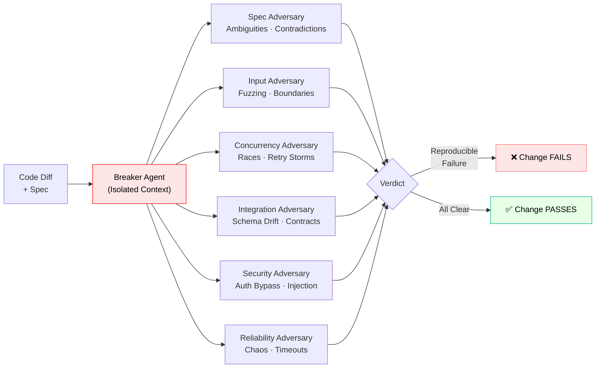
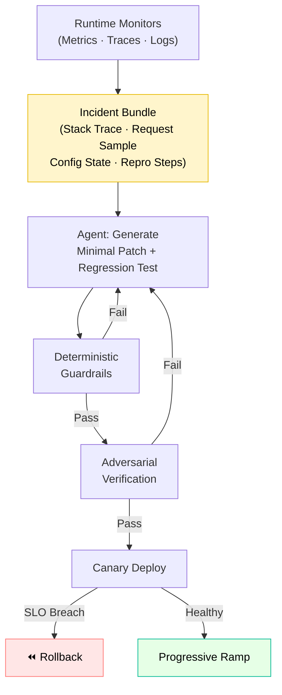

⸻

title: “AI-Native SDLC: A Proposal for Inference-Speed, Rock-Solid Software”
slug: “ai-native-sdlc-proposal”
description: “A blueprint for an AI-native software development lifecycle built on intent-first specs, multi-agent competition, deterministic guardrails, adversarial verification, and continuous validation.”
author: “Max”
site: “rmax.ai”
section: “research”
type: “proposal”
status: “draft”
date: “2026-03-03”
tags:
	•	ai-native
	•	sdlc
	•	agents
	•	verification
	•	reliability
	•	engineering

⸻

AI-Native SDLC

A Proposal for Inference-Speed, Rock-Solid Software

Executive Summary

As software generation accelerates to inference speed, traditional SDLC patterns become the bottleneck. Code review does not scale to autonomous agents. Manual QA does not scale to continuous generation. The solution is not fewer controls — it is better controls.

This proposal outlines a bullet-proof AI-native SDLC in which humans define intent and architecture, while agents generate, verify, and refine code inside deterministic, adversarial guardrails. Reliability emerges from layered constraints — not trust in a single model.

The goal: eliminate review bottlenecks without sacrificing correctness, security, or operational stability.

⸻

The Core Shift: Humans Own Intent, Not Implementation

In an AI-native lifecycle:
	•	Humans define what must be true.
	•	Agents compete to implement how it becomes true.
	•	Deterministic systems verify compliance.
	•	Independent adversaries attack changes.
	•	Runtime systems monitor and auto-correct.

Code is no longer the source of truth.
The Intent Package is.

⸻

1. Intent-First Specifications

The source of truth is a structured, versioned intent document written in natural language but compiled into machine-verifiable artifacts.

Each change requires:
	•	BDD acceptance scenarios (happy path + boundary + failure + abuse)
	•	Explicit invariants (what must never break)
	•	Edge cases (nulls, empties, retries, concurrency, skew)
	•	Non-functional constraints (latency, memory, idempotency, consistency model)
	•	Observability requirements (logs, metrics, traces)
	•	Risk tags (auth, DB, payments, PII, infra, etc.)

Every clause must be traceable to:
	•	Tests
	•	Contract assertions
	•	Code paths

If it is not specified, it is undefined behavior.

This removes ambiguity before generation begins.

⸻

2. Multi-Agent Competitive Generation

Instead of a single agent implementation, multiple agents generate independent candidates.

Each candidate must output:
	•	Code diff
	•	New/updated tests
	•	Contract coverage map (spec clause → assertion)
	•	Risk notes
	•	Dependency changes
	•	Migration steps (if any)

Auto-ranking selects the best candidate based on objective signals:

Must-pass gates:
	•	Build
	•	Type checks
	•	Unit + integration tests
	•	Contract tests

Risk scoring:
	•	Surface area expansion
	•	Sensitive module touches
	•	Public API changes
	•	Cyclomatic complexity increase

Optimization signals:
	•	Smallest correct diff
	•	Highest spec coverage
	•	Performance stability

The system rewards minimal, correct change.

Consensus is irrelevant. Verifiable correctness wins.

⸻

3. Deterministic Guardrails

All subjective judgment is replaced by deterministic constraints wherever possible.

Mandatory layers:
	•	Static typing and schema validation
	•	API compatibility checks
	•	DB migration validation
	•	Lint rules encoding architecture constraints
	•	Reproducible builds
	•	Dependency and supply-chain scanning (SBOM)
	•	Stable JSON tool contracts
	•	Structured error codes

Agents do not decide if code is acceptable.
Tooling does.

⸻

4. Adversarial Verification

Every change is attacked by an independent breaker agent with no shared reasoning context.

Isolation is mandatory:
	•	Breaker sees only spec + diff.
	•	Separate context window.
	•	Separate scoring incentives.
	•	Separate toolchain.

Breaker strategies:

Spec adversary:
	•	Ambiguities
	•	Missing cases
	•	Contradictions

Input adversary:
	•	Fuzzing
	•	Boundary values
	•	Encoding attacks

Concurrency adversary:
	•	Race conditions
	•	Retry storms
	•	Duplicate events

Integration adversary:
	•	Schema drift
	•	Contract mismatch
	•	Backward incompatibility

Security adversary:
	•	Auth bypass
	•	Injection vectors
	•	Secret leakage

Reliability adversary:
	•	Chaos testing
	•	Timeout handling
	•	Graceful degradation

If breaker finds a reproducible failure, the change fails.

⸻

5. Scoped Permissions and Escalation

Agents operate under least privilege.

Default:
	•	Read-only repository
	•	Write access only to target module + tests + docs

Automatic escalation required for:
	•	Authentication/authorization
	•	Payments
	•	Database migrations
	•	Infra changes
	•	Cryptography
	•	PII handling

High-risk changes require human + breaker sign-off.

No agent can silently refactor the system.

⸻

6. Self-Healing Runtime Loop

Post-deploy, runtime monitors feed structured incident bundles into a bounded remediation lane.

Bundle includes:
	•	Stack traces
	•	Request samples (redacted)
	•	Config state
	•	Deployment hash
	•	Repro instructions (if derivable)

Agent flow:
	1.	Generate minimal patch.
	2.	Add regression test reproducing incident.
	3.	Pass full deterministic guardrails.
	4.	Pass breaker.
	5.	Deploy via canary.

Rollback is always allowed.
Forward auto-fixes are constrained and audited.

Self-healing does not bypass verification.

⸻

7. Continuous Observation and Progressive Delivery

CI/CD becomes a governor, not just a pipeline.

Deployment only proceeds if:
	•	Full test suite passes
	•	Guardrails pass
	•	Breaker passes
	•	Risk policy satisfied

Release discipline:
	•	Canary rollout
	•	Progressive percentage ramp
	•	Automated rollback on SLO breach
	•	Synthetic checks mapped to BDD scenarios
	•	Error-budget-aware gating
	•	Drift detection between environments

Verification continues after deploy.

⸻

Swiss-Cheese Reliability

Reliability does not rely on one perfect system.
It relies on multiple independent layers that fail differently:

Layer	Failure Type Caught
Intent Spec	Wrong requirements
Guardrails	Structural violations
Tests	Behavioral defects
Breaker	Adversarial edge cases
Permissions	Blast radius mistakes
Runtime Monitoring	Unknown unknowns

Each layer compensates for weaknesses in others.

```mermaid
flowchart LR
    Change["Incoming\nChange"] --> L1

    subgraph L1["Layer 1: Intent Spec"]
        IS["Catches: Wrong requirements\nMissing edge cases"]
    end

    subgraph L2["Layer 2: Deterministic Guardrails"]
        DG["Catches: Type errors\nSchema violations · Build failures"]
    end

    subgraph L3["Layer 3: Tests"]
        TS["Catches: Behavioral defects\nRegression failures"]
    end

    subgraph L4["Layer 4: Breaker Agent"]
        BA["Catches: Adversarial edge cases\nConcurrency · Security · Integration"]
    end

    subgraph L5["Layer 5: Permissions"]
        PM["Catches: Blast radius mistakes\nUnauthorized scope expansion"]
    end

    subgraph L6["Layer 6: Runtime Monitoring"]
        RM["Catches: Unknown unknowns\nProduction-only failure modes"]
    end

    L1 --> L2 --> L3 --> L4 --> L5 --> L6 --> Prod["✅ Production"]

    style L4 fill:#ffe6e6,stroke:#ff0000,color:black
    style Prod fill:#e6ffe6,stroke:#00b894,color:black
```

⸻

Example: Idempotent Webhook Handling

Intent:
	•	Duplicate events must not double-charge.
	•	System must tolerate retries and reordering.

Generation:
	•	3 implementations: cache-based, DB-unique-constraint, event-sourced.

Ranking:
	•	DB unique constraint + upsert is smallest correct diff.

Breaker:
	•	Simulates duplicate concurrent delivery.
	•	Verifies restart scenarios.
	•	Fails cache-based approach.

Escalation:
	•	DB migration triggers human review.

Deployment:
	•	Canary with synthetic duplicate event replay.
	•	Monitored for consistency metrics.

⸻

Example: Multi-Tenant Authorization Leak

Intent:
	•	No cross-tenant data leakage under malformed filters.

Generation:
	•	Filter logic passes unit tests.

Breaker:
	•	Fuzzes query parameters.
	•	Discovers empty-tenant fallback edge case.

Spec updated:
	•	Missing tenant must 400-fail.

Regenerated patch:
	•	Passes adversarial run.

No human code review required.

⸻

Why This Works

This model eliminates traditional bottlenecks because:
	•	Humans review intent, not implementation details.
	•	Deterministic tools replace subjective review.
	•	Adversarial isolation reduces shared blind spots.
	•	Permissions prevent catastrophic refactors.
	•	Runtime validation closes the loop.

The system scales with inference speed because every step is automated, replayable, and auditable.

⸻

Research Directions
	1.	Formal invariants integration (TLA+, Alloy for critical flows)
	2.	Trace-driven verification (replay production traffic as acceptance tests)
	3.	Economic scoring models for verification agents
	4.	Cryptographic provenance of agent actions
	5.	Spec-to-code coverage metrics

⸻

Closing

AI will generate code faster than humans can review it.
The bottleneck must move from people to systems.

The future SDLC is not lighter-weight.
It is more structured, more adversarial, and more deterministic.

Trust becomes optional.
Verification becomes mandatory.

“Trust, but verify.”