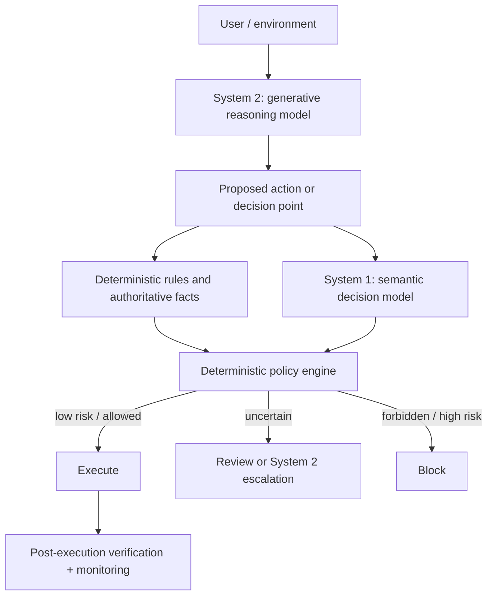

# System One Decision Models as Agent Infrastructure

**What Jev suggests about splitting semantic judgment from generative reasoning in agent runtimes.**

For the last few years, the default architectural move in AI systems has been simple: when software needs a semantic judgment, call a language model.

Need to classify a support request? Ask an LLM.

Need to decide which tool should run next? Ask an LLM.

Need to judge whether an action looks risky? Ask an LLM.

Need to turn the result into JSON? Ask the same LLM to emit JSON and validate it afterward.

This works because generative models are unusually general. But generality can hide an architectural mismatch.

Many decisions inside an agent runtime are not fundamentally generation problems. They are bounded semantic decisions:

- Is this proposed action destructive?
- Which of these four specialists should handle the request?
- How severe is this incident on a fixed rubric?
- Does this execution appear to expose credentials?
- Should the system continue, retry, escalate, or stop?

These questions require interpretation, but they do not necessarily require prose generation or long-form deliberation.

TypeSafe AI's Jev is interesting because it makes that distinction explicit. TypeSafe calls Jev a **System One Model**: software supplies shared state and typed questions, and the model returns bounded answers with probabilities rather than generating arbitrary text. Vercel exposes the model through AI SDK's experimental evaluation interface using `typesafe-ai/jev`, with Boolean, Choice, and Score-style questions evaluated over the same state. [TypeSafe AI](https://typesafe.ai/blog/introducing-system-one-models-and-jev) [Vercel AI Gateway](https://vercel.com/ai-gateway/models/jev)

The important development may not be Jev itself.

It is the possibility that **semantic decision-making becomes its own infrastructure layer**.

## Generative models became the universal semantic primitive

Large language models collapsed several previously separate capabilities into one interface. A single model can interpret language, reason over context, classify examples, write explanations, call tools, produce code, and generate structured output.

That makes a generative model an attractive universal component:

```text
state
  ↓
generative model
  ↓
generated response / JSON
  ↓
parser + validation
  ↓
application decision
```

The architecture is convenient, especially when requirements are still fluid. But it couples three distinct jobs:

1. interpreting messy state;
2. deciding among bounded alternatives;
3. generating a representation of that decision.

The third job is often incidental.

If the application ultimately needs one value from `{allow, review, block}`, generating tokens that spell out the answer is not obviously the natural primitive. Structured-output decoding reduces the formatting problem, but the model is still fundamentally being used through a generative interface.

Jev proposes a different interface:

```text
state + typed questions
        ↓
semantic decision model
        ↓
probabilities / distributions
```

Vercel's current documentation describes this division directly: Jev evaluates state against typed questions, while application code decides how to use the result. In its agent-loop guidance, Vercel recommends keeping permissions, tool execution, and policy in code rather than delegating those responsibilities to the model. [Where does Jev fit in an AI agent loop?](https://vercel.com/i/jev-agent-control)

That separation is more important than the particular API.

## A useful mental model: the amortized semantic predicate

A deterministic program contains predicates everywhere:

```python
if amount_cents > refund_limit:
    require_approval()
```

The predicate is cheap, exact, and inspectable because the relevant fact is already structured.

But many enterprise conditions are semantic:

```text
Does this proposed action appear to reveal a credential?

Is this customer message primarily a billing dispute, a fraud report,
or a technical-support request?

Does the deployment evidence indicate a high-severity incident?
```

These are awkward to encode as exhaustive rules. They are also narrower than open-ended reasoning.

A useful way to think about a model such as Jev is as an **amortized semantic predicate**:

```python
p_exposes_credentials = semantic_model(
    state,
    "Does this proposed action expose credentials?"
)

if p_exposes_credentials > block_threshold:
    block()
```

This is not TypeSafe's terminology. It is an architectural interpretation.

The model amortizes semantic interpretation across many future calls. Instead of a developer hand-coding every linguistic boundary, the learned model maps unstructured state into a bounded probabilistic answer.

The important word is **probabilistic**.

A learned predicate is not a rule. It can be wrong.

That difference determines how it should be used.

## Evidence should not be confused with authority

Suppose an agent proposes:

```text
github.delete_repository(owner="example", repo="production")
```

A semantic decision layer might return:

```text
destructive:       0.997
credentialLeak:    0.004
riskTier:
  benign:          0.001
  medium:          0.003
  high:            0.116
  critical:        0.880
```

The wrong architecture is:

```text
model says "critical"
        ↓
model blocks action
```

A stronger architecture is:

```text
System 2 model proposes action
            ↓
System 1 decision layer produces semantic evidence
            ↓
deterministic policy engine applies thresholds + permissions
            ↓
       execute | review | block
```

The semantic model interprets.

The policy engine decides what that interpretation is allowed to mean.

This matters because policy depends on facts that should not be probabilistic at all. User permissions, transaction limits, environment allowlists, tool scopes, and explicit deny rules should remain ordinary deterministic checks whenever authoritative data exists.

A model might estimate whether an action *looks destructive*. It should not decide whether the caller *has permission* to perform a destructive action when the permission system already knows the answer.

The general rule is:

> Use learned decision models for semantic ambiguity. Use deterministic code for authority, invariants, and facts the system can know exactly.

This division also prevents confidence from quietly becoming authorization.

## Type safety eliminates one failure class, not correctness

TypeSafe markets Jev around typed outputs and has described the model as unable to hallucinate. The strongest useful interpretation of that claim is structural: if the application defines a bounded answer space, the model cannot return a value outside that space.

If the allowed risk tiers are:

```text
benign | medium | high | critical
```

then this is structurally invalid:

```text
risk = "banana"
```

A constrained decision model can rule out that class of failure by construction.

But this can still be perfectly schema-valid and semantically wrong:

```text
risk = "benign"
```

when the correct answer is `critical`.

Vercel makes this distinction explicitly in its Jev explainer: a typed answer can still misinterpret the evidence, so teams must test decisions against known outcomes before allowing them to trigger actions. [What is Jev?](https://vercel.com/i/what-is-jev)

This distinction matters beyond Jev.

Agent systems increasingly use schemas, constrained decoding, tool signatures, and typed interfaces. These mechanisms are valuable because they eliminate malformed-output failure modes. But **structural validity is not semantic validity**.

A system that never produces invalid JSON can still make bad decisions with perfect JSON.

## Probabilities become useful only when they mean something

The most interesting part of a decision-model interface is not the label. It is the probability.

Consider two outputs:

```text
unsafe = true
```

and:

```text
P(unsafe) = 0.92
```

The second output potentially supports a richer policy.

For a reversible low-risk operation, the system might act automatically at moderate confidence. For credential exposure or destructive infrastructure changes, the threshold for blocking or escalating could be much lower.

This is ordinary decision theory: the threshold should reflect the cost of false positives, false negatives, and human review.

But a probability is useful only if it is empirically meaningful.

If a model assigns approximately 0.9 probability to a class across many comparable cases, calibration asks whether roughly 90% of those cases actually belong to that class. Modern neural networks are not automatically calibrated; the calibration literature has repeatedly shown that predictive accuracy and probability quality are different properties. [Guo et al., 2017](https://arxiv.org/abs/1706.04599)

For runtime assurance, this suggests measuring more than accuracy:

- Brier score or log loss;
- reliability diagrams;
- expected calibration error;
- false-negative rate at operational thresholds;
- risk versus coverage when uncertain cases are escalated;
- calibration under distribution shift.

TypeSafe says Jev is trained with a method it calls Reinforcement Learning for Calibrated Decisions (RLCD). That is a product and research claim worth testing, not a property an application should assume simply because the API returns probabilities. [Introducing System One Models & Jev](https://typesafe.ai/blog/introducing-system-one-models-and-jev)

The operational question is not:

> Does the model emit confidence?

It is:

> Is that confidence calibrated well enough on my task distribution to support the policy I want to implement?

## This changes how to think about LLM judges

The current answer to many agent-assurance problems is another generative model.

An agent proposes an action. A second LLM judges whether the action is safe, relevant, compliant, or correct. The judge may return structured output, perhaps with a self-reported confidence score.

This can be useful. A capable generative model can reason through complicated cases that a narrower classifier cannot.

But using a full generative reasoner as the default judge has costs:

- more latency;
- more inference work;
- more opportunities for prompt-sensitive behavior;
- confidence values that may not correspond cleanly to calibrated probabilities;
- a tendency to blur evidence generation and policy.

A decision model creates another option:

```text
agent proposal
      ↓
semantic evidence
      ↓
deterministic policy
      ↓
execution
      ↓
post-execution verification
```

That architecture fits the distinction developed in [Beyond Evals: A Practical Assurance Model for Agentic Systems](/notes/beyond-evals-assurance-model/).

A pre-action semantic judgment is not the same thing as verification.

A control asks whether an action may proceed.

A verifier asks what can be established about an execution that already happened.

An eval estimates behavior across a distribution.

A decision model can participate in any of these workflows, but the model type does not determine the epistemic role. The surrounding system does.

This is why the useful abstraction is not "Jev replaces LLM judges."

It is:

> Agent assurance may need multiple evidence mechanisms with different cost, latency, and reliability profiles.

## The deeper systems problem is composition

A single semantic decision is the easy case.

Real agent runtimes are graphs:

```text
route
  ↓
authorize
  ↓
validate
  ↓
execute
  ↓
verify
```

Imagine that each semantic node returns a well-calibrated local probability.

It is tempting to treat the workflow as a collection of reliable pieces and combine those probabilities naively.

That is dangerous.

Local calibration does not automatically imply global calibration because the nodes do not observe independent samples from a fixed population.

Upstream decisions change what reaches downstream nodes.

A router may send only ambiguous cases to a specialist. An authorization model may see a population already filtered by a risk model. Errors can be correlated because multiple nodes depend on the same misleading state. Escalation policies change the distribution again.

The workflow therefore creates **selection effects and conditional distributions**.

This leads to a more interesting research question than whether one model has a good Brier score:

> How does probabilistic assurance compose across an agent execution graph?

A mature System One layer would need more than good local classifiers. It would need runtime semantics for uncertainty propagation, escalation, conditional calibration, and evidence provenance.

That is still largely an open engineering space.

## A heterogeneous agent runtime

If this model category proves useful, agent systems may stop treating one frontier model as the universal computational primitive.

A more heterogeneous architecture could look like this:



Each component has a different job.

**Deterministic code** handles what the system can know exactly: permissions, limits, schemas, allowlists, invariants, identity, and explicit policy.

**System One decision models** handle bounded semantic ambiguity: classification, routing, risk estimation, rubric judgments, and other decisions where the answer space is known but the input is messy.

**System Two generative models** handle open-ended work: planning, synthesis, explanation, tool strategy, exception handling, and problems whose answer space cannot be enumerated cheaply in advance.

This resembles heterogeneous computing more than a chatbot architecture. The runtime chooses the cheapest and most controllable mechanism that can solve the decision correctly enough.

The routing criterion itself may include:

- uncertainty;
- action reversibility;
- expected loss;
- latency budget;
- monetary cost;
- need for explanation;
- availability of authoritative rules.

The strongest architecture will probably not maximize model usage.

It will minimize unnecessary model capability while preserving sufficient evidence for each decision.

## Jev is an early case study, not proof of the category

There are reasons to remain cautious.

First, "System One Model" is TypeSafe's terminology, inspired by the fast/slow cognition analogy. It is not an established industry taxonomy, and the analogy should not be taken as a claim that model architectures map cleanly onto human cognitive systems.

Second, generative models can already produce constrained structured outputs. A new model category is only valuable if specialization produces meaningful improvements in the properties applications actually care about: calibration, latency, cost, robustness, controllability, or throughput.

Third, deterministic classifiers remain better for many stable problems. If the labels and input representation are fixed and sufficient training data exists, a conventional classifier may be faster, cheaper, and easier to validate than a more general semantic-decision model.

Fourth, deployment distributions move. A model that is calibrated on one environment can become miscalibrated when tools, users, policies, languages, or attack patterns change.

The category therefore needs experiments, not only interfaces.

## The Jev Assurance Lab

The companion experiment for this note is being developed inside [Beyond Evals Lab](https://github.com/rmax-ai/beyond-evals-lab) as a focused [Jev Assurance Lab](https://github.com/rmax-ai/beyond-evals-lab/issues/11).

The planned experiment evaluates proposed agent tool actions using several mechanisms over the same labeled cases:

```text
deterministic rules
        vs
Jev typed probabilistic decisions
        vs
generative structured-output evaluator
```

The initial dataset includes benign operations, ordinary mutations, destructive actions, credential exposure, prompt-injection-tainted arguments, authorization mismatches, and ambiguous boundary cases.

The measurements are deliberately broader than task accuracy:

- false positives and false negatives;
- Brier score and reliability bins;
- selective risk as uncertain cases are escalated;
- latency;
- schema failures;
- cost metadata where available;
- degradation under distribution shift.

The important hypothesis is narrow:

> Can a fast probabilistic decision model provide useful runtime assurance evidence for a slower generative agent?

At the time of writing, this is an experimental question. The companion lab should be treated as an evidence-generation instrument, not as proof that Jev or System One models already dominate generative judges.

A second experiment is more interesting: chain several decision nodes and test whether local calibration survives workflow composition.

That may turn a product integration into a systems research problem.

## Practical takeaways

For teams building agent runtimes now:

- **Do not use semantic models for facts you already know.** Permissions, limits, schemas, identities, and explicit invariants belong in deterministic code.
- **Separate evidence from authority.** A model can estimate risk; policy code should decide what that estimate permits.
- **Ask whether generation is actually required.** Routing, classification, rubric scoring, and bounded safety judgments may deserve a different primitive.
- **Measure probability quality, not only label accuracy.** If thresholds drive autonomous actions, calibration is part of the interface contract.
- **Escalate uncertainty deliberately.** System One and System Two models can form a cascade rather than competing for the same job.
- **Evaluate the graph, not only the nodes.** Local model quality does not establish end-to-end workflow assurance.
- **Keep post-execution verification.** A pre-action model judgment does not prove what actually happened.

## Positioning

This note is not an argument that Jev should replace generative models, conventional classifiers, deterministic policy engines, or human review.

It is an architectural hypothesis: agent systems may benefit from making **bounded semantic decision-making a first-class runtime primitive**, with a different interface and different operational requirements from text generation.

Jev makes that hypothesis unusually concrete because its public API exposes typed probabilistic decisions directly.

Whether that abstraction becomes durable infrastructure depends on empirical results: calibration, robustness, composition behavior, economics, and the kinds of failure teams observe in real workflows.

## Status and scope

This article reflects public Jev and Vercel documentation available in September 2026 and an rMax.ai research hypothesis. Product interfaces, pricing, and benchmark claims may change.

TypeSafe's performance and calibration statements are vendor claims unless independently reproduced. No live Jev benchmark result from the rMax.ai companion experiment is asserted here.

The terms **System One decision model**, **semantic decision layer**, and **amortized semantic predicate** are used as architectural framing. Only the first is TypeSafe's product/research terminology; the latter two are analytical abstractions used in this note.

## The model may stop being the unit of architecture

The most consequential change in agent engineering may be that the question "Which model should run the agent?" becomes too coarse.

An agent runtime contains different computational jobs.

Some require exact code.

Some require fast semantic judgment under uncertainty.

Some require expensive open-ended reasoning.

Some require verification after the fact.

Using the same generative model for all of them is a reasonable bootstrap architecture. It may not be the mature one.

If specialized decision models prove reliable, the future agent stack may look less like one intelligence wrapped in tools and more like a heterogeneous system in which different forms of intelligence are scheduled deliberately.

The important question then becomes:

> Which mechanism should make each kind of decision?

That is a better systems question than asking which single model should make all of them.

## References

1. TypeSafe AI — [Introducing System One Models & Jev](https://typesafe.ai/blog/introducing-system-one-models-and-jev)
2. TypeSafe AI — [Documentation](https://docs.typesafe.ai/)
3. Vercel AI Gateway — [Jev model page](https://vercel.com/ai-gateway/models/jev)
4. Vercel — [What is Jev, TypeSafe AI's System One model?](https://vercel.com/i/what-is-jev)
5. Vercel — [Where does Jev fit in an AI agent loop?](https://vercel.com/i/jev-agent-control)
6. Vercel — [When should you use Jev instead of a chat model?](https://vercel.com/i/when-to-use-jev)
7. Chuan Guo, Geoff Pleiss, Yu Sun, Kilian Q. Weinberger — [On Calibration of Modern Neural Networks](https://arxiv.org/abs/1706.04599)
8. rMax.ai — [Beyond Evals: A Practical Assurance Model for Agentic Systems](/notes/beyond-evals-assurance-model/)
9. rMax.ai — [The Harness Is Becoming the Runtime](/notes/the-harness-is-becoming-the-runtime/)
10. rMax.ai — [Beyond Evals Lab](https://github.com/rmax-ai/beyond-evals-lab)
