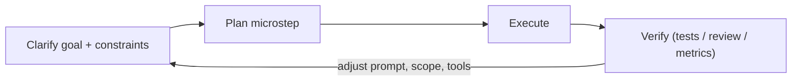
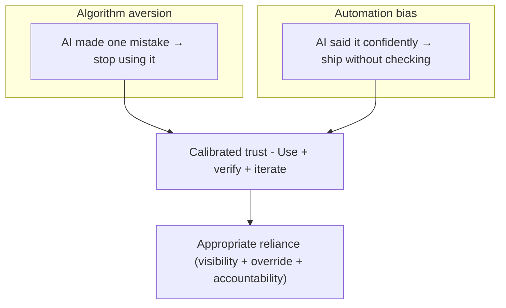
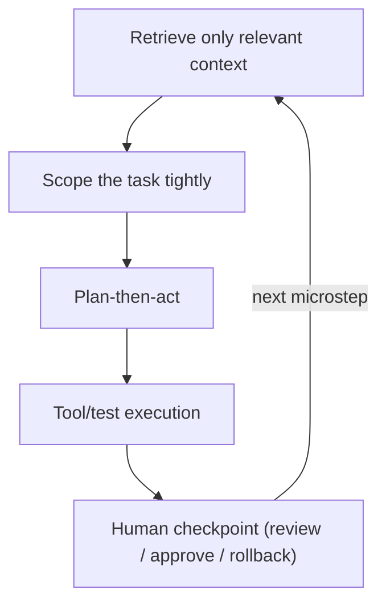

# Trust, Patience, and the Craft of Working With Modern Agentic AI

One important skill I think is missing from most AI discussions is patience. AI today is not a child. It’s more like a chaotic teenager: extremely capable, overconfident, eager to act, and perfectly willing to run in circles for 10 hours if it believes that’s what it should be doing. It can walk, it can sprint, but it doesn’t yet reliably understand why.

What I see often is people asking one question, getting a mediocre answer, and immediately concluding that “AI doesn’t work.” In reality, they haven’t learned how to work with it. You need to learn how to speak to your AI, how to steer it, and how to be empathic with how it reasons. That means giving it the right tools, the right skills, the right context, and sometimes other sub-agents or specialists so it can actually succeed at the goal.

This forces a rethink from first principles: system design, constraints, environments, feedback loops. Not everyone can shift their mindset overnight and honestly, neither can most of us. I’ve been working with AI assistants for about four years, and going full agent-driven for the last year. I haven’t written a full functionality on my own in a long time. At this point, I trust AI more than I trust myself. That level of trust doesn’t come for free. It takes time, repetition, and letting go of ego.

The paradox is that state of the art AI is often more knowledgeable and more skilled than any individual engineer, while simultaneously making incredibly stupid mistakes. It needs hand-holding. It needs babysitting. And that tension is exactly where the new craft is forming. Modern AI agents like ChatGPT, Claude, Copilot, and Databricks Assistant exhibit a paradoxical duality: they are astonishingly capable yet unreliably overconfident. The emerging skillset for developers isn’t just about prompt writing or tool use—it’s about calibrated trust, iterative workflow design, and patient systems thinking.

## 1. The "Overconfident Junior Dev" Mental Model

Multiple practitioners—including [Simon Willison][simonwillison] and [Addy Osmani][addyosmani]—recommend treating LLMs like *overconfident junior engineers*. They’re fast, prolific, and dangerously plausible:

*   **Superficial fixes**: AI often proposes shallow solutions that miss root causes.
*   **Code churn**: GitHub studies show higher rework rates for AI-generated commits within weeks.
*   **Reinforced bad design**: Without guidance, agents replicate existing flaws or anti-patterns.

> “AI writes code with complete conviction—including bugs or nonsense. So I treat it like a junior dev: I review, test, and iterate.” — Addy Osmani

## 2. Why Patience Matters: Workflows, Not Wishes

Trust in AI isn't binary—it's a *calibration loop* ([Lee & See, 2004][1]). When developers abandon tools after one mistake ("algorithm aversion") or blindly accept outputs ("automation bias"), they fail to build durable workflows.

Patience manifests not as waiting, but as *designing the loop*:

*   **Upfront planning**: Write specs *with* the model before code generation.
*   **Incremental prompting**: Break work into microtasks with tight boundaries.
*   **Feedback cycles**: Integrate test suites, manual reviews, and alternate-model critiques.
*   **Version control as “savepoints”**: Frequent commits allow easy rollback from bad AI branches.

> “It’s like doing waterfall in 15 minutes.” — Les Orchard on LLM planning with AI.

## 3. Agentic Work Is Systems Work

Agent behavior is shaped by context and constraints. Even with "Projects" features that ingest full repositories, weak scoping leads to erratic output. Best results come when humans stay responsible for orchestration, QA, and interpretation.

Key workflow primitives include:

*   **Plan-then-act**: Force the agent to articulate its plan before writing code.
*   **Retrieval/injection of context**: Manually selecting the relevant files reduces hallucination risks.
*   **Post-task verification**: Don't trust the output; trust the test suite that verifies the output.
*   **Task-based isolation**: Give agents one job at a time.

Teams using these design patterns report faster throughput on repetitive or boilerplate code, better onboarding via shared context generation, and more scalable debugging, especially with agents cross-reviewing each other.

## 4. Calibrated Trust in Human-AI Teams

Academic literature gives language to what engineers feel:

*   **Automation Bias**: Trusting faulty outputs without scrutiny ([Skitka et al., 1999][3]).
*   **Algorithm Aversion**: Discarding AI tools entirely after small failures ([Dietvorst et al., 2015][7]).
*   **Calibrated Trust**: Balancing reliance with oversight, enabled by transparency, test coverage, and human agency ([Lee & See, 2004][1]).

> “Even improved proficiency doesn’t remove automation bias. What does? Accountability.” — RAND

In IT operations and programming alike, lack of visibility and override ability leads to *complacency*, *alert fatigue*, or *failure to detect AI mistakes in time*.

## 5. The Paradox: LLMs Make You Both Faster and Sloppier

Productivity evidence is mixed but clear on the trade-offs:

*   **Speed vs. Quality**: [OpenAI and GitHub’s own data][5] suggest that Copilot accelerates small tasks but increases review load.
*   **The 90/10 Rule**: Engineers using advanced models report it writes ~90% of code—but only in environments with rigorous testing and stepwise planning.
*   **Verification is Mandatory**: Enterprise guides emphasize code reviews, test harnesses, and usage analytics as non-negotiables in AI pair programming.

## Recommendations for Engineers

Build the following into your AI-agent loop:

1.  **Spec-first conversation**: Prompt the AI to ask *you* for constraints and edge cases.
2.  **Microsteps only**: One bug fix, one function, one change at a time.
3.  **Always review and test**: Either via automated CI or secondary AI critic agents.
4.  **Control structure**: Use version checkpoints, budget limits (time, tokens, retries), and enforce explicit stopping rules.

---

> "Even a master needs a worthy opponent. In this case, it's your own overconfident AI apprentice." — Adapted from Go proverb

## Bibliography & Further Reading

*   **Lee & See (2004)**, “Trust in Automation: Designing for Appropriate Reliance.” Core model of calibrated trust and reliance dynamics. ([SAGE Journals][1])
*   **Bainbridge (1983)**, “Ironies of Automation.” Why automating the easy parts increases the human’s burden at the hard edges. ([ScienceDirect][2])
*   **Skitka et al. (1999)**, “Does automation bias decision-making?” Evidence for over-reliance on automated recommendations. ([ScienceDirect][3])
*   **Dietvorst, Simmons, & Massey (2015)**, “Algorithm aversion.” Evidence for premature rejection after observing errors. ([PubMed][7])
*   **Peng et al. (2023)**, "The Impact of AI on Developer Productivity: Evidence from GitHub Copilot" ([arXiv][5])
*   Osmani, A. (2026). *My LLM Workflow Going into 2026*. [addyosmani.com][addyosmani]
*   ShiftMag. *Treat Your AI Assistant Like an Overconfident Junior Developer*. [shiftmag.dev][shiftmag]

[simonwillison]: https://simonwillison.net
[addyosmani]: https://addyosmani.com
[shiftmag]: https://shiftmag.dev
[1]: https://journals.sagepub.com/doi/10.1518/hfes.46.1.50_30392?utm_source=chatgpt.com "Trust in Automation: Designing for Appropriate Reliance"
[2]: https://www.sciencedirect.com/science/article/pii/0005109883900468?utm_source=chatgpt.com "Ironies of automation"
[3]: https://www.sciencedirect.com/science/article/pii/S1071581999902525?utm_source=chatgpt.com "Does automation bias decision-making?"
[4]: https://www.semanticscholar.org/paper/A-model-for-types-and-levels-of-human-interaction-Parasuraman-Sheridan/14ae6f2231e09e226b99002aa04b5c70f3c59f2b?utm_source=chatgpt.com "A model for types and levels of human interaction with ..."
[5]: https://arxiv.org/abs/2302.06590?utm_source=chatgpt.com "The Impact of AI on Developer Productivity: Evidence from GitHub Copilot"
[6]: https://dl.acm.org/doi/10.1145/3703155?utm_source=chatgpt.com "A Survey on Hallucination in Large Language Models"
[7]: https://pubmed.ncbi.nlm.nih.gov/25401381/?utm_source=chatgpt.com "people erroneously avoid algorithms after seeing them err"
[8]: https://dl.acm.org/doi/10.1145/3613905.3636319?utm_source=chatgpt.com "Trust and Reliance in Evolving Human-AI Workflows (TREW)"
