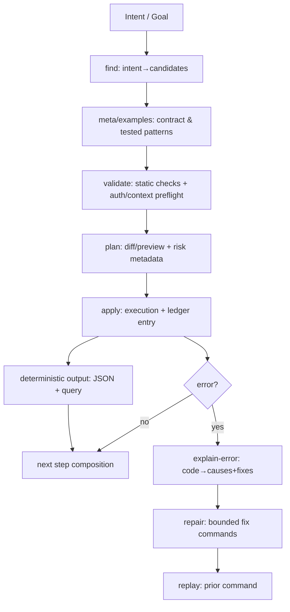

# Designing Agent-Oriented CLIs That Teach Themselves

## Abstract
Many production CLIs were designed around a human workflow: read help text, consult docs, infer hidden state, and interpret error strings. Agents can drive these CLIs, but the interaction is often brittle: scraping, guesswork, and trial-and-error against live systems.

An agent-oriented CLI treats the CLI surface as a versioned, machine-readable system: discoverable by intent, introspectable by contract, safe to probe via deterministic preflight, and replayable with provenance. The result is not “smarter parsing,” but a CLI that supports robust loops: discovery → validation → planning → execution → deterministic output extraction → bounded repair.

## Context
Operational CLIs (cloud, orchestration, security) grew around a human mental model: memorize nouns and verbs, read examples, interpret errors, and infer state from side effects. Agents invert the pressure:

- They need **structured discovery**, not prose-first manuals.
- They need to separate **preflight** from **execution** to avoid unsafe probing.
- They need **deterministic outputs** for downstream steps (not regex scraping).
- They need **bounded repair paths** that are executable (not “go read docs”).

If you want agents to operate infrastructure autonomously, the CLI stops being “text I/O with side effects” and becomes a **self-describing control plane** with explicit safety rails.

## Core thesis
Design the CLI as a **contract registry + discovery engine + safety layer + provenance system**.

In practice:

- Every command is a **versioned contract** with machine-readable schemas, side effects, permissions, idempotency notes, and failure modes.
- The CLI provides consistent primitives (`find`, `meta`, `examples`, `validate`, `plan`, `apply`, `explain-error`, `replay`) that make agent loops reliable.
- Outputs are deterministic and queryable (JSON plus stable selectors), so agents can compose actions without brittle parsing.
- Errors are stable (codes) and include bounded remediation hints that can be executed and audited.

## Mechanism / model
An agent-oriented CLI works because it makes the CLI surface **operationally inspectable** and **procedurally replayable**.

### The command as a contract
A command is not just syntax. It is a contract with:

- **Input schema**: flags, types, constraints, defaults, examples.
- **Execution semantics**: side effects, idempotency, eventual consistency notes.
- **Auth/context requirements**: scopes/roles, required context keys, tenancy.
- **Output schema**: stable fields, IDs, and query paths.
- **Failure schema**: stable error codes, typed details, suggested fixes.

### The loop: discover → preflight → execute → extract → learn → repair

### Deterministic output extraction is first-class
The CLI should support:

- `--format json` (or equivalent) everywhere.
- A stable query mechanism (`--query <path>` or a JSONPath-like selector).
- Explicit “primary identifiers” (resource IDs) that are guaranteed present on success.

This is what enables agents to chain steps without ad-hoc parsing.

### Provenance via an execution ledger
To make autonomy auditable and repairable, the CLI should maintain an append-only ledger of:

- The resolved command contract version
- Inputs (after defaults), normalized
- Context snapshot references (not secrets)
- Plan summary / diff
- Output summary (IDs)
- Error codes and remediation steps attempted

The ledger enables `replay`, supports incident review, and helps prevent “silent drift” in agent behavior.

## Concrete examples

### Example 1 — Provision a VM with HTTPS exposed and return the public IP
**Goal**: “Create a VM, open port 443, tag it, and return the public IP.”

#### Discovery
The agent starts with intent search rather than guessing nouns:

- `cloudctl find "create vm https open 443"`
  - Returns ranked candidates (e.g., `compute vm create`, `network firewall rule create`) with brief machine-readable reasoning (matched intents, required permissions, side effects category).

Then it introspects the top candidate:

- `cloudctl meta compute vm create --json`
  - Required flags, accepted values, defaults
  - Declared side effects (creates VM, allocates NIC, may allocate public IP)
  - Required scopes/roles and required context keys (subscription/project, region)
  - Idempotency notes (name uniqueness, retry behavior)
  - Output schema (resource ID, public IP field presence rules)
  - Failure codes (quota exceeded, auth scope missing, invalid image, region unavailable)

Optionally, it pulls executable, version-tested examples:

- `cloudctl examples compute vm create --tag https`

#### Validation / plan / apply
Preflight (no side effects):

- `cloudctl validate compute vm create --name web-1 --image ubuntu-22 --size s2 --tags env=dev,app=web --expose 443/tcp`

Preview a stable plan:

- `cloudctl plan compute vm create --name web-1 --image ubuntu-22 --size s2 --tags env=dev,app=web --expose 443/tcp --format json`
  - Produces a diff-like plan (resources to create/modify), risk metadata (public exposure), and expected identifiers.

Execute with deterministic output:

- `cloudctl apply compute vm create --name web-1 --image ubuntu-22 --size s2 --tags env=dev,app=web --expose 443/tcp --format json`

#### Deterministic output extraction
Instead of scraping human output, the agent extracts the IP by a declared query path:

- `cloudctl compute vm show --name web-1 --format json --query publicIp`

If the contract states `publicIp` may be delayed (eventual consistency), the CLI can provide a bounded wait primitive (or the agent can implement bounded polling) using the same schema:

- `cloudctl compute vm show --name web-1 --format json --query provisioningState`
- `cloudctl compute vm show --name web-1 --format json --query publicIp`

#### What the agent learns
- The intent phrase “https open 443” maps to **two contracts**: VM provisioning and exposure/firewall configuration; the CLI’s ranking and meta reduce guesswork.
- The contract’s output guarantees tell the agent whether `publicIp` is immediate, delayed, or absent unless an “allocate public IP” flag is set.
- The plan output provides a reusable template (inputs + expected outputs) for future runs and for replay/audit.

---

### Example 2 — Automatic repair after an auth failure
**Goal**: Execute a command; repair deterministically if it fails.

#### Discovery
The agent attempts the obvious command, but the CLI is designed to teach through structured failure:

- `cloudctl storage bucket create --name rmax-logs`

#### Validation / plan / apply
A more agent-safe pattern is to preflight first:

- `cloudctl validate storage bucket create --name rmax-logs`
  - Checks naming rules, required context, and auth scopes without creating anything.

If `validate` is skipped or still insufficient (because auth is evaluated at execution), the execution returns a structured error payload:

- `error.code = AUTH_SCOPE_MISSING`
- `error.details = { missingScopes: ["storage.write"], currentScopes: ["compute.read"], context: { subscription: null } }`
- `error.fixes = [`
  - `{ cmd: "cloudctl auth login --scope storage.write", effect: "adds scope", risk: "interactive" }`
  - `{ cmd: "cloudctl context set --subscription <id>", effect: "sets required context", risk: "low" }`
  `]`

The agent asks for expanded explanation in machine-readable form:

- `cloudctl explain-error AUTH_SCOPE_MISSING --format json`
  - Provides root causes, required preconditions, and fix ordering constraints.

The agent applies the first bounded remediation step (subject to policy):

- `cloudctl auth login --scope storage.write`

Then it replays the prior command verbatim from the ledger:

- `cloudctl replay last`

#### Deterministic output extraction
On success, the agent extracts the canonical bucket identifier:

- `cloudctl storage bucket show --name rmax-logs --format json --query id`

Because replay is ledger-backed, the agent can also extract the result directly:

- `cloudctl ledger last --format json --query output.resourceId`

#### What the agent learns
- “Auth failed” is not a string; it is a **stable error code** with typed details and bounded fix commands.
- Remediation is composable: the agent can attempt the least risky fix first (set context), then escalate (interactive login), while staying within policy.
- Replay reduces drift: the repaired run is the same contract invocation, not a retyped approximation.

---

### Example 3 — Rotate an API key without knowing the product surface
**Goal**: “Rotate API key for service X.”

#### Discovery
The agent does not know where key rotation lives:

- `cloudctl find "rotate api key service principal"`
  - Returns candidates across IAM, service config, and secrets systems.

Choose a likely contract and introspect it:

- `cloudctl meta iam key rotate --json`
  - Inputs: principal identifier, rotation mode, disable-old schedule, propagation notes
  - Side effects: creates new credential material, updates binding, schedules revocation
  - Output schema: newKeyId, oldKeyId, effectiveAt, revokesAt
  - Failure codes: principal not found, policy denies rotation, propagation incomplete

Pull a tested example:

- `cloudctl examples iam key rotate --principal svc-x`

#### Validation / plan / apply
Preflight:

- `cloudctl validate iam key rotate --principal svc-x --disable-old-in 24h`

Plan:

- `cloudctl plan iam key rotate --principal svc-x --disable-old-in 24h --format json`
  - Shows the rotation timeline and expected affected systems.

Apply:

- `cloudctl apply iam key rotate --principal svc-x --disable-old-in 24h --format json`

#### Deterministic output extraction
Extract the new key identifier deterministically:

- `cloudctl ledger last --format json --query output.newKeyId`

Then verify downstream usage with a contract that declares how to check deployments:

- `cloudctl validate service deploy --name svc-x --uses-key <newKeyId>`

If verification fails due to drift, the error returns structured remediation:

- `error.code = CONFIG_DRIFT`
- `error.details = { expectedKeyId: "<newKeyId>", observedKeyId: "<oldKeyId>", locations: ["env:SVC_X_KEY_ID", "secret:svc-x/api-key"] }`
- `error.fixes = [`
  - `{ cmd: "cloudctl service config set --name svc-x --key-id <newKeyId>" }`
  - `{ cmd: "cloudctl secrets rotate-binding --service svc-x --key-id <newKeyId>" }`
  `]`

The agent chooses fixes based on policy (which systems it is allowed to modify) and re-validates.

#### What the agent learns
- “Rotate key” is often a multi-system operation; the contract captures propagation and verification expectations.
- Drift is detectable and actionable because errors report where the mismatch lives and provide bounded fix commands.
- Verification is a first-class contract, not an ad-hoc health check.

## Trade-offs & failure modes
- **Contract maintenance cost**: Versioned schemas, examples, and error catalogs must stay in sync with backend behavior. If contracts drift, agents will fail confidently.
- **Preflight mismatch**: `validate` and `plan` are only as safe as their backend checks. If preflight does not match execution semantics, agents will oscillate.
- **Over-broad remediation hints**: Executable “fixes” are powerful. Without policy scoping and risk tagging, agents may apply unsafe changes.
- **Hidden global state**: Ambient context (subscription/project), cached tokens, and mutable defaults make replay non-deterministic.
- **Output instability**: Field renames, format changes, or partial success without stable identifiers break composition.
- **Ledger liability**: Provenance logs can become a security liability if they capture secrets. Store references and redacted summaries, not raw credentials.

## Practical takeaways
- Treat each command as a **versioned contract** (input/output/error schemas + semantics), not just syntax.
- Make `find`, `meta`, `examples`, `validate`, `plan`, `apply`, `explain-error`, and `replay` consistent across the CLI.
- Require deterministic outputs everywhere: `--format json` + stable `--query` paths, with guaranteed identifiers on success.
- Design errors as stable codes with typed details and bounded, policy-aware remediation hints.
- Add an execution ledger early; without provenance, autonomous operation is hard to debug, audit, or trust.

## Positioning note
Agent-oriented CLI design does not replace SDKs, APIs, or UIs. It makes the CLI a reliable automation substrate with explicit contracts and safety primitives, suitable for both humans and agents. The differentiator is not “agents can run commands,” but that the CLI surface is intentionally structured for discovery, composition, repair, and replay.

## Status & scope disclaimer
This note is a personal lab artifact. It is exploratory: it proposes an interface shape and operational primitives that are feasible in well-instrumented systems, but not universally present today. Treat it as a design model to adapt to your environment, not as authoritative guidance.

### Related

- [Agent Execution Contracts: Unifying Specification, Testing, and Labor](../agent-execution-contracts/) (Implements)
- [The Software Replacement Age: Architecting for a Low-Cost Generation World](../the-software-replacement-age/) (Implements)
