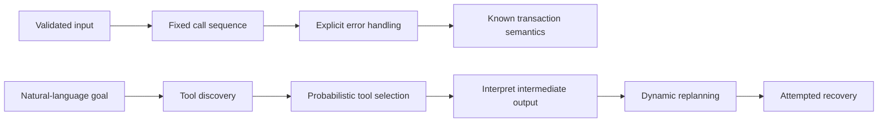
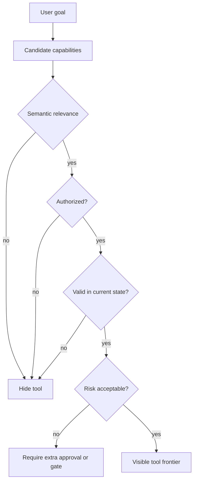
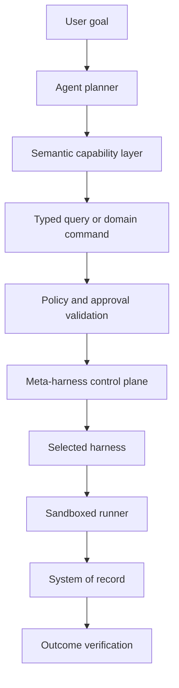

# Agents Are Repeating the Service Complexity Crisis

## Abstract

Enterprise agent platforms are accumulating tools faster than they are developing coherent abstractions. The common explanation is that models choose the wrong tool, lose the thread, or fail to recover from intermediate errors. This note makes a narrower claim: many of those failures begin below the model, at the capability surface itself. [Steve Yegge's service critique](https://yegge.ai/listings/services-and-complexity) is useful again here. Poor service boundaries once forced software clients to reconstruct business logic through deep call graphs. Agent systems repeat the same mistake, except the client-side orchestration is now regenerated probabilistically at inference time. [MCP](https://modelcontextprotocol.io/specification/2025-06-18/architecture) improves connectivity, and meta-harnesses such as [Databricks Omnigent](https://www.databricks.com/blog/introducing-omnigent-meta-harness-combine-control-and-share-your-agents) improve runtime control, but neither substitutes for good service design. Durable agent architecture needs both a semantic capability layer and an execution control plane.

## Context and motivation

Enterprise agent systems are moving from isolated assistants toward operational runtimes with access to search, tickets, codebases, shells, databases, SaaS tools, internal APIs, and deployment systems. That expansion is happening along two fronts at once.

First, capability catalogs are growing quickly because protocols such as MCP make new integrations easier to publish and reuse. Second, organizations are starting to run several harnesses in parallel, which creates a second orchestration problem above the tools themselves.

This note is necessary because those two forms of growth are often discussed as model-quality problems. In practice, a large share of the instability comes from exposing implementation-shaped operations to a planner that must rediscover workflow semantics on each run.

## Core thesis

Agent systems are repeating the earlier service complexity crisis: they expose too many low-level operations and then expect models to reconstruct coherent workflows at runtime.

The durable fix has two parts:

1. Reduce semantic complexity with better capability design.
2. Govern execution complexity with a meta-harness or control plane.

MCP helps with connectivity. Meta-harnesses help with runtime governance. Neither automatically repairs a fragmented agent-facing service surface.

## Mechanism: why the same complexity returns in agent systems

Yegge's service lesson is often flattened into a simple rule: expose everything through an API. That reading misses the real problem. Exposing a method over the network does not create a coherent platform if the boundary still leaks implementation detail.

Suppose a system needs to open a customer account. A coherent capability might be:

```text
open_customer_account
```

A fragmented capability surface might instead expose:

```text
create_person
create_contact_record
assign_customer_identifier
create_billing_profile
attach_default_terms
create_account_ledger
activate_customer
```

The second version appears more composable, but it exports sequencing, validation, retries, compensation, and business rules to the caller. A conventional software client can encode that orchestration deterministically. An agent must infer it in flight.

Caption: Conventional service clients encode orchestration ahead of time; agent clients reconstruct it during execution.



In an agentic system, the planner must decide which operations are relevant, which are safe at the current workflow state, and what to do when only part of the sequence succeeds. That is not simple tool use. It is runtime reconstruction of distributed business logic.

The deeper the tool trajectory, the larger the failure surface:

- more network round trips;
- more intermediate outputs in context;
- more opportunities for invalid arguments;
- more partial mutations;
- more authorization decisions;
- more planning drift; and
- more difficult debugging and replay.

## Tool explosion is also an abstraction problem

Tool explosion is often described as a prompt-budget problem. Large catalogs consume tokens and degrade selection quality. That is true but incomplete.

Large catalogs also create an abstraction problem. Tools overlap semantically, become valid only at certain workflow states, and vary in granularity. Research in 2026 points in the same direction. [Repantis et al.](https://arxiv.org/abs/2605.24660) found that adaptive tool shortlists can preserve coverage while materially reducing the visible choice set.[3](https://arxiv.org/abs/2605.24660) [ToolChoiceConfusion](https://arxiv.org/abs/2606.06284) makes a complementary point: semantic relevance alone is not enough, because many tools are related to a task while still being unnecessary or premature at a given step.[4](https://arxiv.org/abs/2606.06284)

The stronger architectural lesson is simple:

> An agent should not see every available capability merely because the platform can expose it.

Tool discovery should account for at least four dimensions:

1. Semantic relevance.
2. Authorization.
3. Causal validity at the current workflow state.
4. Risk.

Caption: Tool retrieval should narrow the visible action space using workflow state and policy, not just semantic similarity.



This is more than ordinary tool retrieval. It is planning over a governed capability graph.

## More atomic tools are not automatically more composable

Agent-platform teams often respond to unreliable tools by making them smaller. Narrower tools can be easier to describe, test, and authorize, but excessive atomization recreates the teller-call pattern that damaged earlier distributed systems.

An expense workflow is a good example:

```text
create_expense
attach_receipt
assign_cost_center
submit_for_approval
```

If these four calls collectively represent one business state transition, exposing them separately still leaves the agent responsible for partial failure, duplication, and recovery. A better abstraction may be:

```text
submit_expense_report
```

That command can validate the whole request, enforce idempotency, and execute inside a transaction or durable workflow.

The useful rule is:

> When several calls collectively represent one business state transition, composition should usually occur behind the capability boundary.

The agent should express intent. Deterministic software should own the transaction.

## Reads and writes should be asymmetric

The opposite failure is returning too much data. A generic read tool may return full records when the agent needs only a few fields, forcing the model to project, filter, and join inside its context. That wastes tokens, increases distraction, weakens data minimization, and expands prompt-injection exposure.

Reads benefit from declarative flexibility. Writes benefit from constrained semantics.

The read path should support:

- projection;
- filtering;
- pagination;
- cost limits;
- stable semantic entities;
- field-level authorization; and
- bounded result sizes.

The write path should expose explicit domain commands with clear contracts:

- actor;
- target;
- parameters;
- preconditions;
- expected effects;
- approval requirements;
- idempotency semantics;
- compensation behavior; and
- verification criteria.

This is why generic tool design for both reads and writes is structurally weak. Queries and commands should be intentionally asymmetric.

## MCP solves connectivity, not service design

MCP is an important infrastructure improvement because it standardizes how hosts, clients, and servers exchange tools, resources, and prompts.[5](https://modelcontextprotocol.io/specification/2025-06-18/architecture) It reduces the integration-graph problem.

But it does not answer the harder service-design questions:

- Is this tool too narrow?
- Should several calls collapse into one domain command?
- Is the result being joined on the wrong side of the boundary?
- Is the operation safe at the current workflow state?
- What compensation follows partial failure?
- How is the business outcome verified?

A badly designed API exposed through MCP remains badly designed. Protocol success can even accelerate capability sprawl because it becomes easier to publish integrations faster than the organization can govern their semantics.

## The emergence of the meta-harness

A second fragmentation problem exists above the tool layer. Organizations increasingly operate multiple coding-agent harnesses, SDK agents, and terminal runtimes at once. They differ in prompts, tools, context construction, recovery behavior, safety defaults, and workspace assumptions.

Databricks Omnigent is notable because it gives concrete shape to a meta-harness layer above those heterogeneous runtimes. Databricks introduced Omnigent on June 13, 2026 and describes it as a shared control surface for composition, policy, collaboration, sandboxing, and session sharing across different agents and harnesses.[6](https://www.databricks.com/blog/introducing-omnigent-meta-harness-combine-control-and-share-your-agents)[7](https://github.com/omnigent-ai/omnigent)

That matters because a meta-harness can centralize concerns that are hard to implement independently in every harness:

- session lifecycle;
- runtime selection;
- workspace attachment;
- sandbox provisioning;
- credential mediation;
- network controls;
- collaboration;
- event normalization;
- runtime budgets; and
- execution telemetry.

Caption: Durable agent platforms separate semantic capability design from runtime control.



This separates probabilistic interpretation from deterministic authority.

## What the meta-harness solves, and what it does not

A meta-harness addresses operational fragmentation. It can ensure that coding agents run inside isolated environments, that network access passes through policy, that collaborators can inspect the same live session, and that high-risk mutations require approval before execution.

What it cannot automatically repair is the semantic shape of the capability surface itself.

It does not remove:

- excessively granular tools;
- ambiguous business operations;
- hidden client-side joins;
- missing transactions;
- absent compensation semantics; or
- semantically unclear commands.

This is the key relationship between Yegge's critique and Omnigent:

> A meta-harness can govern complexity operationally without eliminating it semantically.

If twelve internal calls collectively represent one business operation, the durable improvement is to redesign the capability boundary, not only to supervise the twelve calls more carefully.

## Policy has to exist at multiple boundaries

Prompt instructions are not an authoritative policy surface. Serious agent governance needs policy at multiple layers:

1. Semantic policy: whether the requested business operation is allowed.
2. Runtime policy: which files, commands, or network destinations the session may access.
3. Transaction policy: retries, idempotency, compensation, and approval lifetime.
4. Verification policy: how the system proves that the approved outcome actually occurred.

For high-risk actions, approval should be bound to the exact plan and expected effect, not merely granted to a broad tool or session. Credentials are capabilities, not just secrets. Hiding a token from the raw agent process helps, but the delegated authority behind that token still needs explicit validation against actor, operation, scope, parameters, approval, and expiry.

## Concrete examples

### Example 1: Incident response tool catalogs

Consider an instruction such as: create an incident for a payment failure, assign the correct team, notify the merchant-support channel, and link the relevant deployment.

If the capability surface exposes `search_logs`, `find_payment`, `get_deployment`, `create_issue`, `assign_issue`, `search_team`, `post_slack_message`, and `link_external_resource`, the agent must reconstruct workflow semantics from disconnected primitives. It has to infer ordering, ownership, authorization, and partial-failure handling.

A better design would expose a smaller set of intent-level capabilities such as:

- `prepare_payment_failure_incident`
- `route_incident_to_owning_team`
- `notify_merchant_support_about_incident`
- `link_incident_to_deployment`

Or, if the sequence truly represents one owned transition:

- `open_payment_failure_incident`

The point is not to maximize breadth or narrowness. It is to align capability granularity with domain semantics and ownership.

### Example 2: A bounded research implementation

A useful reference workflow is: implement an approved Jira issue in a Git repository and create a pull request.

The semantic layer can expose:

- issue queries;
- repository queries;
- `ProposeCodeChange`;
- `ExecuteApprovedChange`; and
- `CreatePullRequest`.

The capability compiler can turn natural-language intent into a typed plan that binds issue, repository, allowed paths, test requirements, prohibited operations, approval policy, and expected outcome. The meta-harness can then select a runtime, provision an isolated worktree, inject only approved context, manage credentials, and capture normalized events. A durable workflow engine can own retries, review pauses, and outcome verification.

This is a better test than asking whether an agent can finish a demo once. The more important question is which guarantees remain stable when the model, harness, or execution environment changes.

## Trade-offs and failure modes

This architecture is stronger, but it is not free.

- Capability design takes domain effort and organizational judgment.
- Approval and verification add cost and latency.
- Teams can over-engineer control planes before they have stable workflows.
- A meta-harness can create false confidence if its policies are operationally strong but the underlying domain abstractions remain weak.
- Tool and runtime semantics will continue to evolve, especially in a fast-moving 2026 agent ecosystem.

The note should therefore be read as a systems-design frame for consequential, multi-step workflows, not as a prescription for every internal assistant or lightweight automation task.

## Practical takeaways

1. Treat tool design as service design for models, not as thin API wrapping.
2. Hide implementation-level sequencing when several calls together represent one business state transition.
3. Keep reads expressive and bounded; keep writes explicit, typed, and policy-bound.
4. Use tool retrieval to expose a minimal valid frontier, not the full catalog.
5. Build a meta-harness for runtime governance, but do not confuse it with semantic abstraction.

## Positioning note

This is not an academic attempt to prove a general theory of service composition. It is an applied note for engineers building agent-facing capability layers and runtime governance systems. It differs from a blog opinion piece by grounding the claim in service-boundary design, contemporary tool-selection research, MCP architecture, and emerging control-plane patterns such as [Omnigent](https://github.com/omnigent-ai/omnigent). It also differs from vendor documentation because the concern here is architectural responsibility, not the feature set of any single platform.

## Status and scope disclaimer

This is exploratory but evidence-based personal lab work. The argument is strongest for consequential, multi-step workflows where agents interact with real systems, approvals, and partial-failure risk. It is not authoritative guidance, and it should not be read as a universal rule for simple retrieval assistants, narrow internal automations, or teams that do not yet have the operational maturity to sustain capability governance and verification.


## References

1. Steve Yegge. "Services and Complexity." Yegge.ai.
   https://yegge.ai/listings/services-and-complexity

2. Steve Yegge. "Stevey's Google Platforms Rant." 2011. Archived copy.
   https://gist.github.com/chitchcock/1281611

3. Vyzantinos Repantis, Ameya Gawde, Harshvardhan Singh and Joey Blackwell. "How Many Tools Should an LLM Agent See? A Chance-Corrected Answer." arXiv, 2026.
   https://arxiv.org/abs/2605.24660

4. Rahul Suresh Babu and Laxmipriya Ganesh Iyer. "ToolChoiceConfusion: Causal Minimal Tool Filtering for Reliable LLM Agents." arXiv, 2026.
   https://arxiv.org/abs/2606.06284

5. Model Context Protocol. "Architecture." MCP Specification.
   https://modelcontextprotocol.io/specification/2025-06-18/architecture

6. Matei Zaharia, Kasey Uhlenhuth and Corey Zumar. "Introducing Omnigent: A Meta-Harness to Combine, Control and Share Your Agents." Databricks, June 13, 2026.
   https://www.databricks.com/blog/introducing-omnigent-meta-harness-combine-control-and-share-your-agents

7. Omnigent. "A Meta-Harness for All Your AI Agents." GitHub repository.
   https://github.com/omnigent-ai/omnigent

8. Temporal. "Temporal Sandbox Orchestration Harness: The Missing Layer for Running Agents." 2026.
   https://temporal.io/blog/temporal-sandbox-orchestration-harness-the-missing-layer-for-running-agents

9. Yoonho Lee, Roshen Nair, Qizheng Zhang, Kangwook Lee, Omar Khattab and Chelsea Finn. "Meta-Harness: End-to-End Optimization of Model Harnesses." arXiv, 2026.
   https://arxiv.org/abs/2603.28052

10. Apollo GraphQL. "Connect AI Agents to Your GraphQL API Using MCP and Type-Safe Tool Configuration."
    https://www.apollographql.com/blog/connect-ai-agents-to-your-graphql-api-using-mcp-and-type-safe-tool-configuration

11. Berkeley Function Calling Leaderboard. Gorilla LLM.
    https://gorilla.cs.berkeley.edu/blogs/8_berkeley_function_calling_leaderboard.html

12. Temporal. "From Agent Zoo to Agent Orchestra: The Benefits of Temporal as Your Enterprise Agentic Control Plane."
    https://temporal.io/blog/from-agent-zoo-to-agent-orchestra-temporal-agentic-control-plane
