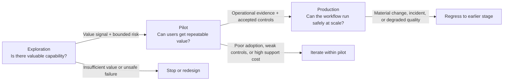
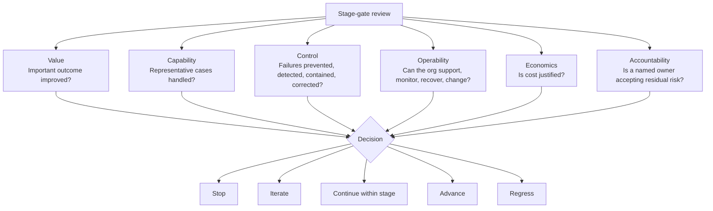

# AI FDE Operating Model: Exploration, Pilot, and Production

This note defines an operating model for AI forward deployed engineering teams that need to move from uncertain ideas to dependable workflows without applying full production controls before value is proven. The core claim is simple: teams should sequence evidence and controls rather than choose between speed and governance. That matters because AI-enabled workflows fail in two predictable ways. Some teams overbuild before they have evidence of value. Others ship demos into real work without the controls needed to contain failure.

## Context and motivation

AI-enabled workflows differ from conventional software in one operationally important way: at the start, the team often does not know whether the model can perform the task well enough to matter. The business problem may be clear, but the workflow still carries empirical uncertainty. Teams may not know which context the model needs, which tools improve performance, how users will adapt around the system, or which failures will dominate in operation.

That uncertainty changes how responsible delivery should work. A strong demo proves possibility, not production readiness. Production ML practice has shown for years that model quality is only one part of a larger system that includes data, integrations, monitoring, ownership, and operational controls [5][6]. AI workflow teams run into the same problem, often with more behavioral variability and more complicated human oversight.

## Core thesis

AI FDE teams should run work through three operating modes: Exploration, Pilot, and Production. Each mode answers a different question, requires different evidence, and justifies a different level of control.

- Exploration asks whether the capability is valuable at all.
- Pilot asks whether real users can get repeatable value under bounded conditions.
- Production asks whether the organization can operate the workflow safely, reliably, economically, and accountably at scale.

The main discipline is proportionality. Controls should scale with authority, irreversibility, data sensitivity, blast radius, and user exposure, not with novelty or executive excitement. This aligns with lifecycle-oriented risk management in NIST AI RMF, ISO/IEC 42001, production ML practice, SRE, and risk-based regulation [1][2][3][4][5][13][14].

## Mechanism: the three-stage operating model

The model separates capability discovery from operational hardening. Exploration resolves the largest capability uncertainties with the smallest safe experiment. Pilot introduces real users, real workflow variation, and bounded operational exposure. Production turns the resulting evidence into an operating commitment with named owners, monitoring, change management, and explicit residual-risk acceptance.

Caption: The operating lifecycle should move from evidence of possibility to evidence of controlled operation.

### Operating principles

#### Separate capability risk from operational risk

Capability risk asks whether the workflow can perform the task well enough to matter. Operational risk asks what happens when the system is wrong, unavailable, manipulated, or over-trusted. Exploration should focus on the first question. Pilot should characterize both. Production should keep residual operational risk inside an explicitly accepted boundary.

#### Bound consequences instead of demanding certainty

Probabilistic components do not become safe through review alone. Teams need deterministic constraints around access, outputs, and actions. In practice, that means controls such as read-only tools, scoped credentials, allowlisted actions, schema validation, transaction limits, human approval, audit trails, and reversible writes [9][10].

#### Increase controls with authority and irreversibility

A workflow that summarizes internal documents does not need the same controls as one that changes account settings, issues refunds, or communicates externally. Governance should track concrete power and consequence. It should not track how impressive the demo looked.

#### Use evidence to move between stages

Each initiative should define a hypothesis, baseline, measurable success criteria, unacceptable outcomes, required next-stage evidence, and a named transition owner. Stage transitions should follow observed results rather than optimism, fear, or architectural preference [1][5].

#### Design human oversight as part of the system

Human review only works when reviewers have enough time, evidence, context, independence, and authority to intervene. A nominal approval step is weak control if the reviewer cannot verify the recommendation or override it effectively. Automation-bias research and human-AI interaction guidance both support treating oversight as a designed workflow rather than as a checkbox [7][8][12].

#### Evaluate the workflow, not only the model

The unit of evaluation is the whole socio-technical workflow: user intent, context, retrieval, prompts, tools, policies, interfaces, review, execution, and business outcome. A technically correct answer can still fail if it reaches the wrong user, arrives too late, lacks evidence, or drives inappropriate reliance [11][12].

## Stage definitions

### Exploration

Exploration exists to answer one question: is there enough value here to justify further investment? The team should maximize learning speed while preventing material harm.

Entry conditions should include a concrete user problem, a falsifiable hypothesis, a representative task sample, bounded blast radius, approved experimental data access, and one accountable owner. Controls should default to approved or sanitized data, read-only access unless writes are essential, no unsupervised external communication, hard limits on runtime and cost, trace capture, a small tester group, and a clear stop condition.

Artifacts should include the problem statement, hypothesis, workflow sketch, permission and data inventory, evaluation sample, baseline, experiment log, failure taxonomy, and a recommendation to stop, iterate, or request a pilot.

Exploration metrics should emphasize capability and value:

- task completion rate
- reviewer acceptance rate
- correctness
- time saved against baseline
- human correction load
- tool-use success
- policy compliance
- cost and latency per task
- qualitative user feedback
- failure categories and recurrence

Exploration should stop when a simpler deterministic approach performs as well, when users do not value the outcome, when required capability is not there, or when critical failures cannot be detected or contained.

### Pilot

Pilot exists to answer a harder question: can real users get repeatable value under realistic but bounded conditions? A pilot is not a larger demo. It introduces workflow variation, support burden, operational ownership, and controlled exposure to real systems.

Entry conditions should include satisfied exploration exit criteria, a business owner, named pilot users, documented success and termination criteria, approved data and access boundaries, assigned support ownership, and end-to-end monitoring for material actions and outcomes.

Every pilot should define a bounded operating envelope:

- start and end dates
- participating users or teams
- included and excluded task types
- data sources
- tool permissions
- action-volume limits
- human approval points
- versioned model, prompt, policy, retrieval, and tool configuration
- fallback process
- incident and escalation path

Pilot controls usually include least-privilege credentials, allowlisted actions, structured logs, monitoring for quality, cost, latency, and policy violations, rollback or compensating actions, feedback channels, support ownership, versioned configuration, and explicit handling of sensitive data. Higher-risk pilots often need stronger separation of duties, deterministic validation before execution, policy engines, and dual approval [9][10].

Pilot metrics should cover business value, user value, quality, operations, and risk. That includes adoption, cycle-time reduction, severity-weighted error rate, override rate, support burden, cost per successful task, incident frequency, unauthorized-action attempts, and audit completeness.

### Production

Production exists to sustain value while the organization keeps reliability, security, accountability, and cost inside an accepted operating boundary. Production is not a deployment event. It is an operating commitment.

Production workflows need named business and technical owners, appropriate service objectives, documented data classification and retention, periodic access review, production-grade observability, tamper-evident audit trails, incident response, rollback procedures, version and change management, regression and safety evaluations, cost controls, user support, periodic reassessment, and retirement criteria [3][5][13][14].

Material changes should trigger proportionate reevaluation. A model swap, prompt change, retrieval change, policy change, tool change, or interface change can invalidate earlier evidence. Teams should treat those as system changes, not as invisible tuning [6].

## Stage-gate decision framework

The transition decision should force reviewers to judge the same dimensions every time. That keeps stage movement tied to evidence rather than momentum.

Caption: Stage-gate reviews should use the same decision dimensions at each transition.

The framework evaluates six dimensions:

- Value: does the workflow materially improve an important outcome?
- Capability: can it perform across representative cases?
- Control: can failures be prevented, detected, contained, corrected, or reversed?
- Operability: can the organization support, monitor, change, and recover it?
- Economics: do build, inference, review, and support costs make sense?
- Accountability: is there a named owner with authority to accept residual risk?

The valid decisions are Stop, Iterate, Continue within stage, Advance, and Regress.

## Risk-based control matrix

The same AI pattern can justify very different controls depending on impact. The right question is not whether the workflow is "agentic." The right question is what happens when it fails.

Caption: Control strength should rise with impact, authority, and irreversibility.

```mermaid
flowchart TB
  L[Low impact advisory<br/>Summaries, internal notes, knowledge discovery]
  M[Moderate impact operational<br/>Case recommendations, draft Jira changes, support responses]
  H[High impact consequential<br/>Financial changes, refunds, access changes, binding communication]

  L --> L1[Approved data]
  L --> L2[Source attribution]
  L --> L3[User review]
  L --> L4[Logging]
  L --> L5[No autonomous external actions]

  M --> M1[Scoped tool permissions]
  M --> M2[Required human approval]
  M --> M3[Structured validation]
  M --> M4[Rollback or correction path]
  M --> M5[Monitoring + sampled review]

  H --> H1[Deterministic policy checks]
  H --> H2[Strict transaction limits]
  H --> H3[Dual approval where appropriate]
  H --> H4[Strong identity + authorization]
  H --> H5[Tamper-evident audit records]
  H --> H6[Continuous monitoring]
  H --> H7[Tested rollback or compensating actions]
  H --> H8[Formal risk acceptance]
```

This internal impact classification is an operating tool, not a legal classification. Teams should not confuse it with statutory categories such as the EU AI Act's definition of high-risk systems [4].

## Worked example: internal support-case investigation

An internal support-case investigation workflow shows how the model applies in practice.

In Exploration, the team tests whether an AI workflow can gather policy, account, and historical case information and produce a useful investigation brief. It uses a curated dataset, read-only tools, representative cases, and trace capture. Success means strong reviewer acceptance, meaningful time reduction, no fabricated references, and no access outside the approved dataset.

In Pilot, ten support specialists use the workflow for four weeks. The system can query approved internal systems but cannot modify cases or contact merchants. Users approve the final brief, rate usefulness, and classify corrections. The team measures quality, adoption, support burden, cost, latency, and review effectiveness.

In Production, the workflow becomes an integrated support tool with managed identity, access review, quality monitoring, regression evaluation, incident ownership, versioned changes, and periodic value assessment. If the team later wants the agent to modify cases or send messages, that is a material capability expansion. It should re-enter a bounded pilot rather than slip into production by default.

## Trade-offs and failure modes

This model does not eliminate uncertainty. It makes uncertainty governable. Teams still need judgment about what counts as representative evidence, which failures are acceptable, and how much operating overhead the workflow justifies.

The model also has predictable failure modes:

- teams can mistake staged governance for bureaucracy and over-document before they learn anything
- teams can label long-running production behavior as a "pilot" to avoid ownership and residual-risk acceptance
- teams can add human approval that looks safe on paper but fails under time pressure or weak evidence
- teams can collect exhaustive traces without a defined purpose, retention model, or secret-redaction discipline
- teams can build a generic platform before they prove the first valuable workflow

The discipline only works when the organization is willing to stop. Not every capable workflow deserves promotion. Some should remain bounded tools. Some should be redesigned. Some should die.

## Practical takeaways

- Prove value before you harden architecture, but do not treat experimentation as a control exemption.
- Scale controls with authority, irreversibility, data sensitivity, and blast radius.
- Evaluate the full workflow, not just model quality.
- Design human review as an operational subsystem with evidence, time, and intervention authority.
- Treat material model, retrieval, tool, and policy changes as reasons to revalidate earlier evidence.

## Positioning note

This is not a formal standard, and it is not vendor documentation. It is an operator model synthesized from risk frameworks, production ML practice, SRE, and human-factors research [1]-[14]. It is narrower than academic research because it focuses on delivery mechanics. It is more durable than blog opinion because it ties claims to established operational patterns and references.

## Status and scope disclaimer

This note is a personal lab artifact. It is intended as applied guidance for experienced engineers and operators building AI-enabled workflows. It is not authoritative, and it does not replace legal, regulatory, security, privacy, or compliance review. The model is a synthesis, not a normative standard.

## References

[1] National Institute of Standards and Technology. Artificial Intelligence Risk Management Framework (AI RMF 1.0). NIST AI 100-1, January 2023. https://doi.org/10.6028/NIST.AI.100-1

[2] National Institute of Standards and Technology. Artificial Intelligence Risk Management Framework: Generative Artificial Intelligence Profile. NIST AI 600-1, July 2024. https://doi.org/10.6028/NIST.AI.600-1

[3] International Organization for Standardization. ISO/IEC 42001:2023 — Information technology — Artificial intelligence — Management system. December 2023. https://www.iso.org/standard/42001.html

[4] European Union. Regulation (EU) 2024/1689 laying down harmonised rules on artificial intelligence. Official Journal of the European Union, 12 July 2024. https://eur-lex.europa.eu/eli/reg/2024/1689/oj

[5] Breck, E., Cai, S., Nielsen, E., Salib, M., and Sculley, D. The ML Test Score: A Rubric for ML Production Readiness and Technical Debt Reduction. IEEE International Conference on Big Data, 2017. https://research.google/pubs/the-ml-test-score-a-rubric-for-ml-production-readiness-and-technical-debt-reduction/

[6] Sculley, D., Holt, G., Golovin, D., Davydov, E., Phillips, T., Ebner, D., Chaudhary, V., Young, M., Crespo, J.-F., and Dennison, D. Hidden Technical Debt in Machine Learning Systems. Advances in Neural Information Processing Systems 28, 2015. https://papers.nips.cc/paper/5656-hidden-technical-debt-in-machine-learning-systems

[7] Goddard, K., Roudsari, A., and Wyatt, J. C. Automation Bias: A Systematic Review of Frequency, Effect Mediators, and Mitigators. Journal of the American Medical Informatics Association 19(1), 2012. https://doi.org/10.1136/amiajnl-2011-000089

[8] Lyell, D., and Coiera, E. Automation Bias and Verification Complexity: A Systematic Review. Journal of the American Medical Informatics Association 24(2), 2017. https://doi.org/10.1093/jamia/ocw105

[9] National Institute of Standards and Technology. Security and Privacy Controls for Information Systems and Organizations. NIST SP 800-53 Rev. 5, September 2020, updated 2023. https://doi.org/10.6028/NIST.SP.800-53r5

[10] Rose, S., Borchert, O., Mitchell, S., and Connelly, S. Zero Trust Architecture. NIST SP 800-207, August 2020. https://doi.org/10.6028/NIST.SP.800-207

[11] Liang, P. et al. Holistic Evaluation of Language Models. Transactions on Machine Learning Research, 2023. https://arxiv.org/abs/2211.09110

[12] Amershi, S. et al. Guidelines for Human-AI Interaction. Proceedings of CHI 2019. https://doi.org/10.1145/3290605.3300233

[13] Beyer, B., Jones, C., Petoff, J., and Murphy, N. R., eds. Site Reliability Engineering: How Google Runs Production Systems. O’Reilly Media, 2016. https://sre.google/sre-book/table-of-contents/

[14] Beyer, B., Murphy, N. R., Rensin, D. K., Kawahara, K., and Thorne, S., eds. The Site Reliability Workbook. O’Reilly Media, 2018. https://sre.google/workbook/table-of-contents/
