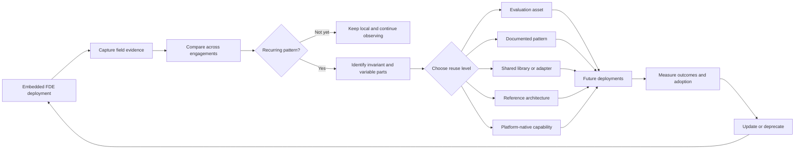

# Why AI FDE Teams Must Become Organizational Learning Systems

*Forward Deployed Engineering scales only when each deployment improves the next. The strategic output is not merely a working AI system, but reusable organizational capability.*

An AI deployment can succeed locally while leaving the organization no more capable than before.

A Forward Deployed Engineering team enters a business unit, studies its workflow, connects fragmented systems, works around data-quality problems, constructs evaluations, and discovers where users do not trust the model.

The system ships.

The engineers move to another engagement.

Several months later, a different team encounters a structurally similar problem. It rebuilds the same integration, rediscovers the same model failure, and creates another version of the same evaluation suite.

The organization has delivered two systems. It has learned almost nothing.

This is the central scaling problem of AI Forward Deployed Engineering.

FDE teams are valuable because they work where product assumptions meet operational reality. They build against live data, real authorization boundaries, undocumented business rules, changing model behaviour, and users whose trust cannot be inferred from a requirements document.

But embedding capable engineers inside business teams does not automatically create organizational learning.

Without a deliberate mechanism for turning field discoveries into shared capability, FDE becomes a high-end delivery service. Every engagement starts with another deep investigation. Every team creates its own workarounds. Delivery capacity grows primarily by adding engineers.

The alternative is to treat FDE as a distributed learning system.

Each deployment still solves a local problem. But it also produces evidence that can improve the platform, the operating model, and every deployment that follows.

The scalable output of FDE is therefore not only the system delivered.

It is the organizational capability extracted from the delivery.

## FDE exists because enterprise AI cannot be fully specified in advance

Traditional software delivery often assumes that requirements can be gathered, translated into specifications, and handed to an implementation team.

Enterprise AI systems frequently resist this model.

The visible task may appear simple:

- summarize a contract;
- classify a support request;
- retrieve company knowledge;
- investigate a payment anomaly;
- draft a compliance assessment.

The actual workflow is usually more complicated.

Important decisions depend on tacit business rules. Data definitions vary between teams. Permissions are encoded across several systems. Human operators apply undocumented exceptions. Model behaviour changes when prompts, context, tools, or underlying model versions change.

Many of these constraints become visible only when the system is used against production data by real operators.

This is why FDE teams are embedded.

They are not merely implementing a predefined product. They are discovering the real problem while building the solution.

Databricks describes its FDE model as replacing consultant-style handoffs with embedded engineers who build alongside customers, while maintaining a direct connection with product and research teams. Crucially, when the platform cannot yet support a customer requirement, the field team works with R&D to extend it, allowing field learning to shape the product.

This makes each FDE engagement a form of field research.

The team observes where the platform fails, where workflows diverge from documented procedures, where deterministic controls are required, where users override model recommendations, and where local context cannot be generalized.

The mistake is treating these findings as incidental details of delivery.

They are among the most valuable outputs of the engagement.

## The difference between delivery and learning

A delivery organization asks:

- Did the system launch?
- Did the project meet its deadline?
- Did the business unit accept the handover?
- How many engineers were utilized?

A learning organization asks additional questions:

- What did this deployment reveal that the platform did not previously understand?
- Which parts of the solution are specific to this environment?
- Which parts reflect a recurring structural problem?
- What evidence would allow another team to reuse the solution safely?
- Did this engagement make the next one faster, safer, or easier to operate?

The distinction changes the economics of FDE.

In a bespoke delivery model, each deployment produces a local application.

In a learning model, each deployment may also produce:

- a reusable integration;
- an evaluation dataset;
- a governance control;
- a reference architecture;
- a workflow pattern;
- a failure taxonomy;
- a shared library;
- a platform-native capability;
- a clearer boundary between global infrastructure and local business logic.

The first model scales mainly through headcount.

The second can create compounding leverage.

As field discoveries become shared capabilities, later teams begin with better infrastructure, stronger evaluations, clearer controls, and a more accurate understanding of the problem space. The marginal effort required for similar deployments should decline.

This maps to James March's distinction between exploration and exploitation in organizational learning. Exploration searches for new knowledge and possibilities; exploitation refines, standardizes, and applies what has already been learned.

FDE teams operate at the exploratory edge of the organization. They encounter new workflows, unfamiliar constraints, and real production failures.

Platform and product teams perform exploitation. They turn validated discoveries into capabilities that can be maintained and reused.

A scalable FDE model needs both.

Exploration without exploitation produces endless custom work.

Exploitation without exploration produces centralized platforms detached from operational reality.

## Every deployment should be treated as an experiment

An FDE engagement has two outputs.

The first is the local business outcome.

The second is evidence.

That evidence may include several kinds of discovery.

### Workflow discoveries

The team learns how work is actually performed rather than how the official process describes it.

Examples include:

- hidden approval steps;
- informal escalation rules;
- manual verification routines;
- local definitions of acceptable risk;
- conditions under which operators ignore model recommendations.

### Data discoveries

The team encounters:

- inconsistent identifiers;
- undocumented schemas;
- stale records;
- missing lineage;
- contradictory business definitions;
- access restrictions that were not visible during planning.

### Model discoveries

The team observes:

- hallucination patterns;
- incorrect tool selection;
- prompt sensitivity;
- reasoning loops;
- context degradation;
- output-format instability;
- failure under ambiguous instructions.

### Integration discoveries

The team identifies:

- authentication assumptions;
- token-routing constraints;
- unreliable APIs;
- hidden rate limits;
- incomplete event semantics;
- incompatibilities between systems.

### Adoption discoveries

The team learns:

- where users require explanations;
- which latency thresholds disrupt the workflow;
- where human review is mandatory;
- which interface details determine trust;
- what local teams need before they can own the system.

This knowledge is generated at the boundary between the platform and the operational environment.

It decays quickly when it remains inside chat threads, individual memory, local repositories, or undocumented code.

A learning system must therefore capture not only what was built, but why it was built and what evidence justified it.

## The field-to-platform learning loop

Organizational learning does not happen because teams produce more documentation.

It happens when field evidence moves through a repeatable decision process.

A practical FDE learning loop contains six stages.

### 1. Observe

During deployment, the team records significant operational discoveries.

This does not require documenting every implementation detail. The aim is to capture events that reveal something important about the system:

- a user repeatedly corrects a model output;
- a workflow requires an undocumented approval;
- an integration fails under a particular permission model;
- a prompt works only because it embeds volatile business rules;
- a human-review structure appears across several tasks;
- a model failure requires deterministic validation.

The observation should be connected to evidence wherever possible:

- execution traces;
- user feedback;
- code changes;
- incident records;
- evaluation failures;
- performance measurements.

The unit of learning is not the opinion that something went wrong.

It is the traceable relationship between context, intervention, and outcome.

### 2. Preserve

The team converts the raw discovery into a durable artifact.

The appropriate artifact depends on the discovery. It might be:

- an Architecture Decision Record;
- an evaluation case;
- a postmortem;
- a reusable test;
- a workflow diagram;
- an integration note;
- a code sample;
- a pattern proposal;
- an anti-pattern.

An Architecture Decision Record captures a significant design decision together with its rationale, trade-offs, and consequences. This makes ADRs particularly useful for FDE work: the code records what the team built, while the ADR preserves why the team chose that design under the constraints it encountered.

The objective is not comprehensive prose.

It is to preserve enough context that another team can understand:

- the problem;
- the environment in which it occurred;
- the attempted solution;
- the result;
- the known limitations;
- the evidence supporting the conclusion.

Knowledge capture should remain close to engineering work.

When documentation is treated as a separate activity performed after delivery, it is usually incomplete, delayed, or abandoned.

### 3. Compare

A local solution becomes strategically interesting when similar problems appear across independent engagements.

This comparison cannot rely only on industry labels or project names.

Two workflows may look unrelated at the business level while sharing the same technical structure.

A legal contract-review agent and an insurance claims system may both require:

- document extraction;
- structured validation;
- permission-aware retrieval;
- human approval;
- deterministic output schemas;
- audit logging.

The business language differs.

The underlying system problem is similar.

A learning organization therefore needs to compare engagements by problem class:

- integration pattern;
- authorization requirement;
- model failure mode;
- human-review structure;
- evaluation need;
- governance control;
- data-retrieval pattern;
- operational constraint.

This is where a shared registry, searchable repository, or developer portal becomes useful.

Its value is not that it stores information.

Its value is that it helps teams recognize repeated structure across different environments.

### 4. Validate recurrence

The first occurrence of a problem does not justify a platform abstraction.

It may be a local anomaly.

The second occurrence suggests a pattern but may still conceal important differences.

By the third occurrence, the organization can begin to distinguish invariant behaviour from environmental variation.

A practical rule is:

1. Solve the first occurrence locally.
2. Reuse or adapt the solution in a second environment.
3. Abstract only when repeated use has clarified what remains stable.

This is commonly described as a Rule of Three. It is not a mathematical law. It is a constraint against speculative platform engineering.

The first implementation reveals the problem.

The second tests whether the solution travels.

The third exposes the boundaries of the abstraction.

The rule protects the organization from two opposite failures:

- rebuilding the same capability indefinitely;
- standardizing a narrow solution before its real shape is understood.

### 5. Productize at the appropriate level

Not every recurring discovery should become a platform service.

This is one of the most important decisions in the learning system.

A validated discovery might become:

- a written pattern;
- a reusable evaluation;
- a small library;
- an integration adapter;
- a workflow template;
- a governance requirement;
- a reference architecture;
- a platform-native service.

The correct level depends on the stability, recurrence, risk, and local variation of the problem.

A common human-review pattern might justify a reusable queue and context-serialization interface.

A business unit's definition of a high-risk transaction should probably remain local configuration.

A repeated identity-control problem may justify centralized infrastructure because inconsistent implementations create security exposure.

A prompt used by one operations team may justify no shared abstraction at all.

Productization should reduce total organizational complexity.

It should not merely move complexity from local repositories into the central platform.

### 6. Measure, update, and deprecate

A reusable capability is valuable only when later teams adopt it and obtain better outcomes.

The organization should measure whether the capability:

- reduces implementation effort;
- prevents duplicate work;
- lowers incident recurrence;
- improves evaluation coverage;
- reduces security risk;
- simplifies handover;
- decreases dependence on FDE support;
- remains useful as models and vendors evolve.

Some abstractions will fail.

Others will become obsolete because model or cloud providers absorb the capability. Some will prove too rigid for the variation found in the field.

The learning loop must therefore include deprecation.

A platform that only accumulates abstractions is not learning.

It is preserving past assumptions.

## Turning tacit field knowledge into organizational capability

Much of what FDE teams learn is initially tacit.

An experienced engineer may recognize that a user does not trust an answer even when the evaluation score is high. A domain operator may know that one approval can be skipped in ordinary cases but never at month-end. A platform engineer may notice that a seemingly generic API hides business-unit-specific authorization assumptions.

This knowledge is difficult to transfer because it is contextual, experiential, and often unspoken.

Ikujiro Nonaka's work on organizational knowledge creation describes how organizations convert tacit knowledge into explicit forms, combine it with other knowledge, and eventually internalize it as shared practice.

Applied to FDE:

- **Socialization**: FDEs work alongside operators and learn how the workflow actually functions.
- **Externalization**: The team expresses those observations through traces, ADRs, evaluations, diagrams, and pattern descriptions.
- **Combination**: The organization compares discoveries across deployments and combines them into reusable assets or reference architectures.
- **Internalization**: Future teams use those assets until the knowledge becomes part of standard engineering practice.

The repository is only one part of this process.

The deeper task is converting local experience into forms that can travel without losing the context necessary to use them safely.

## A capability ladder for field discoveries

Organizational learning should not be reduced to code reuse.

A useful discovery can mature through several levels.

1. **Observation** — A field team records a failure, constraint, workaround, or user behaviour.

2. **Documented decision** — The team explains why a particular design or control was selected.

3. **Repeated pattern** — The same structural problem appears across several environments.

4. **Reusable asset** — The organization creates a shared evaluation, connector, template, library, or control.

5. **Reference architecture** — Several assets are composed into a supported implementation path for a recurring workflow class.

6. **Platform-native capability** — The central platform adopts the capability, provides stable interfaces, and assumes long-term maintenance.

This ladder matters because engineering teams often jump directly from local code to generic framework.

Most discoveries do not need to travel that far.

Sometimes the right output is a better evaluation dataset.

Sometimes it is a known anti-pattern.

Sometimes it is a documented decision boundary.

Sometimes it is a supported platform primitive.

Maturity should reflect evidence and actual reuse, not architectural ambition.

## The danger of premature abstraction

Strong engineers are often attracted to generalization.

They see several similar code paths and imagine a unified framework.

In conventional software, this can already produce unnecessary complexity. In AI systems, the risk is greater because the underlying models, APIs, prompting methods, and orchestration techniques change rapidly.

Consider an FDE team that successfully builds a multi-agent workflow for a complex operational process.

The implementation includes:

- task routing;
- retries;
- context persistence;
- tool execution;
- approval steps;
- recovery logic.

The system works well in its original environment.

The team concludes that it has discovered a universal orchestration pattern and turns the local design into a mandatory internal framework.

Other teams then encounter:

- configuration they do not need;
- assumptions tied to the original workflow;
- debugging layers that hide model behaviour;
- APIs designed around one state machine;
- dependency overhead greater than the value provided.

They bypass the framework and write simpler local code.

The abstraction has not removed duplication.

It has added a second system that teams must understand before ignoring.

A candidate for productization should meet a higher standard. It should demonstrate:

- recurrence across independent deployments;
- clear invariant behaviour;
- bounded and understandable variation;
- meaningful reduction in duplicated effort or risk;
- maintainability by a stable owner;
- sufficient stability in the underlying interfaces;
- a credible path to adoption.

The burden of proof belongs to the abstraction.

Local code does not need to prove that it can serve the entire organization.

A shared platform component does.

## The repository is not the learning system

Organizations often respond to fragmented knowledge by creating a central repository.

The repository gradually fills with:

- architecture documents;
- code snippets;
- postmortems;
- templates;
- diagrams;
- evaluation files;
- abandoned experiments.

Search quality declines.

Ownership becomes unclear.

Engineers return to asking colleagues directly because finding and validating the correct artifact requires more effort than rebuilding the solution.

The repository becomes a documentation graveyard.

Storage is necessary but insufficient.

A functioning learning system requires:

- structured intake;
- clear ownership;
- links between artifacts and source evidence;
- search by problem class;
- review and validation;
- versioning;
- usage telemetry;
- deprecation;
- connection to roadmap decisions.

Artifacts should remain connected to the deployments that produced them.

A reusable integration should link back to the original code, incidents, constraints, and validation evidence.

An evaluation should record which failure mode it protects against.

A pattern should state where it applies and where it does not.

A deprecated component should include a migration path.

The goal is not to preserve everything indefinitely.

It is to maintain a reliable body of organizational capability.

## AI can help find patterns, but it cannot decide the abstraction

AI can reduce the cost of processing evidence across many FDE engagements.

An internal analysis agent could inspect:

- repositories;
- pull requests;
- ADRs;
- evaluation traces;
- incident reports;
- issue trackers;
- support discussions;
- platform usage telemetry.

It could then:

- cluster similar failures;
- detect duplicated integration code;
- connect incidents to known model failure modes;
- recommend relevant prior implementations;
- identify stale documentation;
- surface repeated authorization workarounds;
- draft candidate pattern reports;
- identify shared assets that nobody uses.

For example, the system might detect that several teams have independently implemented similar permission-filtering middleware.

It could produce a report showing:

- source deployments;
- related code;
- common input and output contracts;
- differences between implementations;
- associated incidents;
- candidate invariant behaviour;
- possible platform owners.

This helps the organization find patterns that humans may miss.

It does not determine whether the implementations are meaningfully equivalent.

Two code paths may look similar while operating under different security, regulatory, performance, or ownership constraints.

Semantic similarity is evidence for review, not proof of a valid abstraction.

AI should support the sensing and synthesis functions of the learning system.

It should not automatically turn repeated code into mandatory architecture.

## Learning must change the platform roadmap

A field-learning system is ineffective when discoveries never alter platform investment.

Teams may produce excellent postmortems, pattern catalogs, and evaluation suites, but the organization still fails to learn if platform priorities are set independently of field evidence.

There must be a formal mechanism connecting recurring deployment friction to product and engineering decisions.

A field-to-platform review should include the people who see different parts of the system:

- FDE leads;
- platform engineers;
- product managers;
- architects;
- security and risk specialists;
- relevant business engineers.

Its purpose is not to review every local implementation.

It is to decide what the organization should do with repeated evidence.

For each recurring pattern, the group might decide to:

- keep the solution local;
- document it as a pattern;
- publish a shared component;
- create a reference architecture;
- fund a platform-native implementation;
- revise an existing platform capability;
- deprecate an abstraction that no longer works.

Roadmap proposals should be expressed as testable leverage hypotheses.

For example:

> Standardizing permission-aware retrieval will remove repeated identity and filtering work from future enterprise-search deployments.

Or:

> A shared human-review queue will reduce the custom state-management code required in regulated workflows.

The proposal should state:

- the repeated field evidence;
- the target problem class;
- the expected reduction in effort or risk;
- the environments likely to adopt it;
- the cost of central maintenance;
- the conditions under which the investment should be reconsidered.

This makes the platform roadmap partly empirical.

Instead of asking only what leaders or architects believe the organization should build, it also asks what repeated production evidence shows that it should build.

## Ownership must follow the capability

Every shared capability requires an explicit owner.

Ownership includes:

- maintenance;
- versioning;
- support;
- security review;
- compatibility;
- documentation;
- usage monitoring;
- deprecation.

A component without an owner is not a platform capability.

It is abandoned code with internal visibility.

Ownership should follow the nature of the asset.

A shared evaluation framework may belong to an AI reliability team.

An identity-aware retrieval control may belong jointly to platform engineering and identity security.

A business-specific policy configuration should remain with the business unit.

A core orchestration runtime may belong to the central AI platform.

The organizational boundary should be as deliberate as the technical API boundary.

This also prevents the FDE organization from becoming a shadow platform team.

FDEs should help identify and validate reusable capabilities. They may produce the first implementation.

But long-lived platform components require stable ownership outside a temporary field engagement.

## Handover is part of the learning loop

The FDE model fails when embedded teams become permanent operators.

A system may be technically complete while remaining organizationally dependent on the people who built it.

The local team does not understand the evaluation suite.

Production incidents are routed back to the FDEs.

Business rules change, but nobody knows which prompts, policies, or tools must be updated.

The FDE team becomes a support function for its previous deployments.

New work slows as old engagements consume more capacity.

A complete engagement must therefore transfer operational capability.

The receiving team should be able to:

- run and interpret evaluations;
- monitor system behaviour;
- diagnose common failures;
- modify local business rules;
- operate the deployment pipeline;
- respond to incidents;
- distinguish local defects from platform defects;
- know when to escalate.

Documentation alone does not prove this.

Handover should be demonstrated through operation.

The local team should run the system, execute changes, respond to controlled failures, and complete production cycles without direct FDE intervention.

This creates two complementary learning flows:

Field evidence moves inward toward the platform.

Operational capability moves outward toward the local team.

Without the first, the platform does not improve.

Without the second, the FDE organization does not regain capacity.

## Measure leverage, not activity

FDE organizations are often measured through visible activity:

- number of engagements;
- number of engineers deployed;
- utilization;
- projects completed;
- components published;
- documentation produced.

These metrics describe workload.

They do not show whether the organization is becoming more capable.

A learning system should measure leverage.

### Delivery acceleration

How quickly can later teams deliver a validated system for a previously encountered problem class?

Useful measures include:

- time to first validated production outcome;
- engineering effort per deployment;
- time spent on repeated integration work;
- time from field discovery to reusable capability.

### Reuse

Are validated capabilities actually used?

Useful measures include:

- adoption across independent environments;
- duplicate implementation rate;
- proportion of deployments using standard evaluations or controls;
- frequency with which teams bypass shared components.

Raw reuse counts are insufficient.

A team can import a library without obtaining value from it.

Reuse should be connected to delivery, quality, or risk reduction.

### Quality

Does organizational memory prevent repeated failures?

Useful measures include:

- recurrence of known incidents;
- regression failures caught before production;
- repeated security exceptions;
- repeated model failure classes;
- unresolved platform gaps.

### Capability transfer

Can local teams operate independently?

Useful measures include:

- support requests after handover;
- production changes completed without FDE assistance;
- local contributions to shared assets;
- successful incident response by the receiving team;
- time until the FDE team can disengage.

### Learning quality

Is the organization making disciplined abstraction decisions?

Useful measures include:

- proportion of proposed abstractions rejected;
- time taken to validate recurrence;
- adoption of productized capabilities;
- components deprecated after low usage;
- divergence between predicted and actual leverage.

The rejection rate matters.

If every pattern becomes a platform feature, the review process is not selective enough.

The purpose is not to maximize the number of shared components.

It is to increase the number of useful capabilities while controlling complexity.

## Common failure modes

Several recurring failures indicate that the learning loop is broken.

**The hero FDE**

A small number of engineers retain critical context, solve the hardest problems, and become indispensable to multiple systems.

The organization rewards local rescue rather than capability creation.

Delivery appears successful until those engineers rotate, burn out, or leave.

**The documentation graveyard**

Teams produce large amounts of material disconnected from code, evidence, ownership, and current platform behaviour.

The information exists but cannot be trusted.

**Postmortems without consequences**

Incidents are analyzed, but the findings never become tests, controls, platform changes, or roadmap priorities.

The same failure reappears in another business unit.

**Premature platformization**

A successful local solution is generalized after one deployment.

The resulting abstraction encodes assumptions that other teams do not share.

**Copy-pasted local systems**

Teams repeatedly implement the same integration, identity control, evaluation logic, or workflow pattern because existing solutions are difficult to discover or reuse.

**Platform engineering detached from the field**

The central platform builds features from architecture plans rather than current deployment friction.

FDE teams bypass the resulting capabilities because they do not solve the problems encountered in practice.

**Permanent FDE ownership**

Local teams never acquire the capability to operate the system.

Embedded engineers remain responsible for support, blocking future strategic deployments.

These failures are connected.

They occur when field knowledge cannot travel, platform decisions are disconnected from evidence, or ownership does not transfer.

## A minimum viable FDE learning system

An organization does not need a large knowledge-management program to begin.

It needs a small number of connected mechanisms.

### 1. A standard engagement record

Each deployment should maintain one lightweight record containing:

- workflow and business context;
- architecture decisions;
- discovered constraints;
- major failures;
- evaluation assets;
- local versus reusable components;
- handover owner.

This should live close to the code and evolve during the engagement.

### 2. A post-engagement extraction review

Shortly after the system reaches a stable production state, the FDE team and platform representatives review:

- what was genuinely new;
- what was already known;
- what was duplicated;
- what should remain local;
- what may recur;
- which evaluations should be retained;
- which platform gaps were exposed.

The output should be concrete backlog items and assets, not only retrospective notes.

### 3. A shared pattern registry

The organization needs a searchable index of:

- patterns;
- anti-patterns;
- integrations;
- evaluations;
- reference architectures;
- reusable components;
- deprecated approaches.

Entries should be tagged by technical problem, not only by business domain.

Searching for "permission-aware retrieval" is more useful than searching for "healthcare chatbot project."

### 4. A field-to-platform decision forum

A recurring review should decide what happens to candidate patterns.

Possible outcomes include:

- insufficient evidence;
- keep local;
- document as guidance;
- reuse experimentally;
- publish as an inner-source component;
- fund productization;
- revise an existing platform capability;
- deprecate an obsolete abstraction.

The forum should remain small enough to make decisions and broad enough to prevent local optimization.

### 5. A leverage scorecard

The organization should track whether the system improves over time.

A useful starting scorecard includes:

- delivery time for recurring workflow classes;
- duplicate implementation rate;
- adoption of shared evaluations and controls;
- repeated incident rate;
- post-handover support dependency;
- time from field discovery to reusable capability;
- usage and bypass rates for shared components;
- deprecated low-value abstractions.

These mechanisms are enough to begin generating compounding returns.

A sophisticated portal, semantic clustering system, or automated knowledge agent can be added later.

Automation should accelerate an existing learning process.

It cannot substitute for one.

## From deployed systems to compounding capability

Forward Deployed Engineering is often described as the function that closes the last mile between a platform and a production workflow.

That description is incomplete.

FDE teams also occupy the point where the organization encounters reality.

They see which platform assumptions survive production, which controls fail, which workflows resist automation, which abstractions travel, and which local differences matter.

That position makes FDE a distributed sensing network.

But sensing alone does not create learning.

The organization needs a mechanism that converts observations into evidence, evidence into patterns, patterns into reusable capability, and reusable capability into better future deployments.

This is closely related to Cohen and Levinthal's concept of absorptive capacity: an organization's ability to recognize valuable external knowledge, assimilate it, and apply it.

FDE teams give the organization access to high-value operational knowledge.

The learning system determines whether that knowledge becomes institutional capability or disappears with the engagement.

In a weak FDE model, every deployment consumes expertise.

In a strong FDE model, every deployment also produces expertise in a form that the rest of the organization can use.

The objective is not to eliminate customization.

Enterprise workflows will continue to require local adaptation.

The objective is to make adaptation cumulative.

The objective is not to standardize every local solution.

It is to identify what should remain local, what should be shared, and what should become part of the platform.

The objective is not to maximize reuse.

It is to create justified reuse that reduces total organizational effort and risk.

The scalable output of Forward Deployed Engineering is not the number of systems delivered.

It is the rate at which field experience becomes reusable organizational capability.

Each deployment should leave the organization better equipped to deliver the next one.

## References

- Jason Martin, Databricks — ["Forward Deployed Engineering: Delivering Business Outcomes with AI"](https://www.databricks.com/blog/forward-deployed-engineering-delivering-business-outcomes-ai)
- James G. March — ["Exploration and Exploitation in Organizational Learning"](https://pubsonline.informs.org/doi/10.1287/orsc.2.1.71), *Organization Science*, 1991
- Ikujiro Nonaka — ["The Knowledge-Creating Company"](https://hbr.org/2007/07/the-knowledge-creating-company), *Harvard Business Review*
- Wesley M. Cohen and Daniel A. Levinthal — ["Absorptive Capacity: A New Perspective on Learning and Innovation"](https://www.jstor.org/stable/2393553), *Administrative Science Quarterly*, 1990
- Michael Nygard — ["Documenting Architecture Decisions"](https://cognitect.com/blog/2011/11/15/documenting-architecture-decisions)
