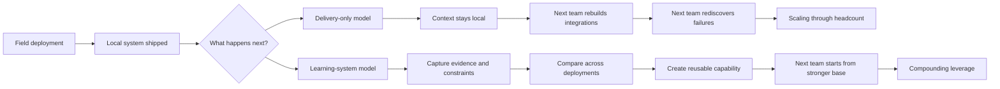
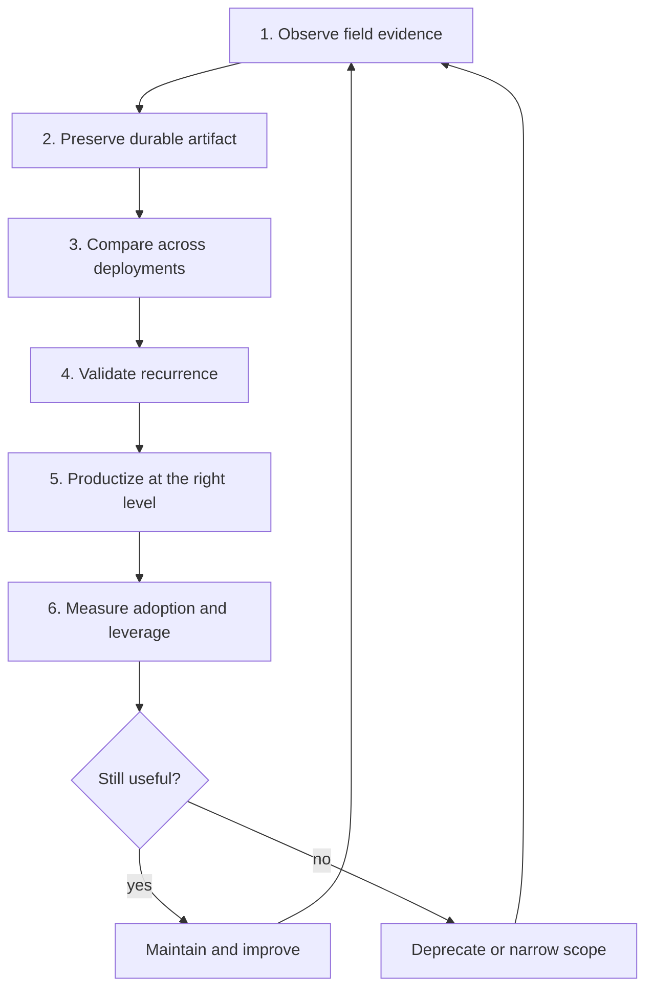
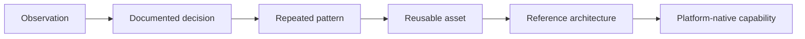

# Why AI FDE Teams Must Become Organizational Learning Systems

## Abstract

AI Forward Deployed Engineering (FDE) teams often solve hard local problems without making the organization much better at solving the next one. An engagement can ship a useful system, transfer little reusable knowledge, and force later teams to rediscover the same integrations, evaluation methods, failure modes, and governance controls. This note argues that the scalable output of FDE is not only deployed systems. It is the organizational capability extracted from those deployments. In practice, FDE should operate as a distributed learning system that turns field evidence into reusable patterns, assets, platform capabilities, and durable local ownership.

## Context & Motivation

Enterprise AI work usually cannot be fully specified in advance, yet many organizations still treat deployment as if implementation were the main problem. In practice, FDE teams discover the real workflow while they build the solution. They run into undocumented business rules, fragmented systems, shifting model behavior, hidden authorization boundaries, data-quality defects, and user trust constraints that become visible only in live operation.

As more organizations deliver AI systems through embedded field teams, a scaling problem becomes harder to ignore. The same structural problems reappear across business units, but the learning often stays trapped in chat threads, personal memory, local repositories, or one-off codebases. That makes FDE effective as delivery labor but weak as an engine for compounding organizational capability.

## Core Thesis

FDE teams should run as organizational learning systems, not only as bespoke delivery teams.

Each deployment should produce two outputs:

1. a local business result;
2. evidence that improves the platform, the operating model, and future deployments.

The scalable output of FDE is therefore not the number of systems delivered. It is the rate at which field experience becomes reusable organizational capability.

## Mechanism / Model

### FDE exists because enterprise AI cannot be fully specified in advance

Traditional delivery assumes that teams can gather requirements, translate them into specifications, and hand them to an implementation team. Enterprise AI systems often resist that model.

A workflow may look simple on paper:

- summarize a contract;
- classify a support request;
- retrieve company knowledge;
- investigate a payment anomaly;
- draft a compliance assessment.

The real system usually depends on tacit rules, conflicting data definitions, fragmented permissions, undocumented exceptions, and model behavior that shifts with prompts, context, tools, and vendor changes. Those constraints often become visible only when real operators use the system against production data.

That is why FDE teams embed in the field. They are not only implementing a known solution. They are discovering the real problem while they build it.

### Delivery and learning are different operating models

A delivery organization asks:

- Did the system launch?
- Did the project meet its deadline?
- Did the business unit accept the handover?
- How many engineers were utilized?

A learning organization asks additional questions:

- What did this deployment reveal that the platform did not previously understand?
- Which parts of the solution are local?
- Which parts reflect a recurring structural problem?
- What evidence would let another team reuse the solution safely?
- Did this engagement make the next one faster, safer, or easier to operate?

The distinction matters because the first model scales through headcount. The second can create compounding leverage.

This diagram shows the difference between local delivery and organizational learning.

### Every deployment should be treated as an experiment

An FDE engagement generates evidence in at least five categories:

- **Workflow discoveries**, such as hidden approvals, manual verification, local risk thresholds, or the conditions under which operators ignore model output.
- **Data discoveries**, such as inconsistent identifiers, undocumented schemas, stale records, contradictory definitions, or invisible access constraints.
- **Model discoveries**, such as hallucination patterns, prompt sensitivity, reasoning loops, output instability, or failures under ambiguity.
- **Integration discoveries**, such as authentication assumptions, rate limits, missing event semantics, or unreliable APIs.
- **Adoption discoveries**, such as where users need explanations, what latency breaks trust, where human review is mandatory, and what the local team needs to own the system.

This knowledge decays quickly when it remains informal. A learning system must capture not only what was built, but also why it was built and what evidence justified it.

### The field-to-platform learning loop

Organizational learning happens when field evidence moves through a repeatable decision process. A practical loop has six stages.

1. **Observe**  
   Record operational discoveries that reveal something important about the system, ideally with traces, feedback, incidents, evaluation failures, or measurements.

2. **Preserve**  
   Convert the discovery into a durable artifact, such as an architecture decision record, evaluation case, reusable test, postmortem, integration note, code sample, pattern proposal, or anti-pattern.

3. **Compare**  
   Look for repeated structure across independent engagements by problem class, not by business-unit label.

4. **Validate recurrence**  
   Use repeated occurrence to distinguish a local anomaly from a reusable pattern. The rule of three is useful here: solve locally once, adapt in a second environment, and abstract after a third occurrence clarifies what is stable.

5. **Productize at the appropriate level**  
   Turn validated discoveries into the smallest useful shared form, which may be a written pattern, evaluation, small library, adapter, workflow template, governance requirement, reference architecture, or platform service.

6. **Measure and update**  
   Verify that later teams actually adopt the capability and get better outcomes. Deprecate abstractions that no longer help.

This diagram summarizes the field-to-platform loop.

### A capability ladder for field discoveries

Useful learning is not limited to code reuse. A field discovery can mature through several levels:

1. **Observation**  
   A team records a failure, constraint, workaround, or user behavior.

2. **Documented decision**  
   The team explains why it chose a design or control.

3. **Repeated pattern**  
   The same structural problem appears across environments.

4. **Reusable asset**  
   The organization creates a shared evaluation, connector, template, library, or control.

5. **Reference architecture**  
   Several assets are composed into a supported path for a recurring workflow class.

6. **Platform-native capability**  
   The central platform adopts the capability and owns it as a stable interface.

The key discipline is to let maturity follow evidence and reuse, not architectural ambition.

This diagram shows how a field discovery can move from local observation to platform capability.

### The repository is not the learning system

A central repository is necessary, but it is not enough. Repositories often become storage for architecture notes, code snippets, postmortems, templates, diagrams, and abandoned experiments. When search quality degrades, ownership is unclear, or artifacts are disconnected from evidence and current behavior, teams go back to asking colleagues directly or rebuilding from scratch.

A functioning learning system requires:

- structured intake;
- clear ownership;
- links between artifacts and source evidence;
- search by problem class;
- review and validation;
- versioning;
- usage telemetry;
- deprecation;
- connection to roadmap decisions.

The goal is not to preserve everything. It is to maintain a reliable body of organizational capability.

### Learning must change the roadmap

A field learning system fails if recurring deployment friction never changes platform investment. The organization needs a formal field-to-platform review that includes FDE leads, platform engineers, product managers, architects, security and risk specialists, and relevant business engineers.

That review should decide what repeated evidence means operationally. For each recurring pattern, the organization may choose to:

- keep the solution local;
- document it as a pattern;
- publish a shared component;
- create a reference architecture;
- fund a platform-native implementation;
- revise an existing capability;
- deprecate an abstraction that no longer works.

Roadmap proposals should be framed as leverage hypotheses tied to repeated evidence, expected risk or effort reduction, likely adopters, central maintenance cost, and conditions for reconsideration.

### Handover is part of the learning loop

The FDE model fails when embedded teams become the permanent operators of old deployments. A system may be technically complete while the local team still cannot run evaluations, diagnose failures, update business rules, respond to incidents, or distinguish local defects from platform defects.

A complete engagement transfers operational capability outward while field evidence moves inward toward the platform. The receiving team should be able to:

- run and interpret evaluations;
- monitor system behavior;
- diagnose common failures;
- modify local business rules;
- operate the deployment pipeline;
- respond to incidents;
- know when to escalate.

Without inward learning, the platform does not improve. Without outward capability transfer, FDE does not regain capacity.

## Concrete Examples

### Example 1: Contract review and insurance claims share the same structural problem

A legal contract-review agent and an insurance claims system may look unrelated at the business level, but they can share the same technical structure:

- document extraction;
- structured validation;
- permission-aware retrieval;
- human approval;
- deterministic output schemas;
- audit logging.

If teams compare deployments only by business label, they miss the recurrence. If they compare by problem class, they can see that both systems may need similar evaluations, review flows, and control patterns.

### Example 2: Repeated identity and review problems should not stay local forever

A repeated human-review pattern may justify a reusable queue and context-serialization interface. A repeated identity-control problem may justify centralized infrastructure because inconsistent implementations create security exposure.

By contrast, a business unit's internal definition of a high-risk transaction may remain local configuration, and a prompt used by one operations team may not justify any shared abstraction.

The design question is not whether something can be centralized. It is whether centralization reduces total organizational complexity.

## Trade-offs & Failure Modes

### The danger of premature abstraction

Teams often generalize a successful local solution too early. In AI systems, that risk increases because models, APIs, prompting methods, and orchestration techniques change quickly.

A team may build a multi-agent workflow with routing, retries, context persistence, approval steps, and recovery logic. It works in one environment. The organization then turns that local design into a mandatory framework. Other teams inherit configuration, assumptions, and debugging layers they do not need, then bypass the framework with simpler local code.

The result is not less duplication. It is an extra system that everyone must understand before ignoring.

A candidate abstraction should show:

- recurrence across independent deployments;
- clear invariant behavior;
- bounded variation;
- meaningful reduction in duplicated effort or risk;
- maintainability by a stable owner;
- sufficient interface stability;
- a credible adoption path.

### Common signs that the learning loop is broken

Several failure modes recur:

- **The hero FDE**: a few engineers retain critical context and become indispensable.
- **The documentation graveyard**: artifacts exist but cannot be trusted or reused.
- **Postmortems without consequences**: incidents are analyzed but never become tests, controls, or roadmap decisions.
- **Premature platformization**: a one-off success becomes a generic framework too early.
- **Copy-pasted local systems**: teams keep rebuilding the same integrations, controls, or evaluations.
- **Platform engineering detached from the field**: central features do not solve real deployment friction.
- **Permanent FDE ownership**: local teams never become operationally independent.

These failures are linked. They appear when field knowledge does not travel, platform decisions are disconnected from evidence, or ownership never transfers.

## Practical Takeaways

1. Treat every FDE deployment as both delivery work and evidence generation.
2. Capture discoveries close to the engineering work, not as a separate after-action writing exercise.
3. Compare deployments by problem class, not by business-unit name.
4. Use repeated occurrence to justify reuse, and repeated recurrence to justify platformization.
5. Measure leverage, not activity. Track whether later deployments become faster, safer, easier to evaluate, easier to hand over, and less dependent on specialist intervention.

## Positioning Note

This note is not academic research. It does not attempt a formal theory of organizational learning or a quantified model of FDE economics.

It is also not a blog opinion piece built on a loose metaphor or a single anecdote. The aim is to offer an operator-oriented model for how field engineering organizations can accumulate capability instead of repeatedly consuming expertise.

It is not vendor documentation either. It does not describe a product feature set or prescribe a platform stack. Its focus is the operating model that should govern how field discoveries become reusable organizational capability.

## Status & Scope Disclaimer

This note is exploratory but grounded in practical engineering patterns. It is written as personal lab work, not as an authoritative standard. The claims are intended as an operational design frame for teams running AI FDE organizations, especially where deployments repeatedly encounter similar workflow, integration, evaluation, governance, and handover problems. It does not attempt to solve all knowledge-management, platform, or organizational-design questions.

## References

No explicit external references or source links were included in the source note.

