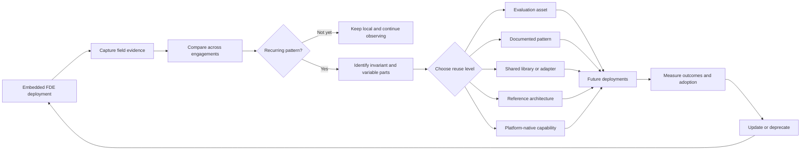

# Why AI FDE Teams Must Become Organizational Learning Systems

*Forward Deployed Engineering scales only when each deployment improves the next. The strategic output is not merely a working AI system, but reusable organizational capability.*

An AI deployment can succeed locally while leaving the organization no more capable than before.

A Forward Deployed Engineering team enters a business unit, studies its workflow, connects fragmented systems, works around data-quality problems, constructs evaluations, and discovers where users do not trust the model.

The system ships.

The engineers move to another engagement.

Several months later, a different team encounters a structurally similar problem. It rebuilds the same integration, rediscovers the same model failure, and creates another version of the same evaluation suite.

The organization has delivered two systems. It has learned almost nothing.

This is the central scaling problem of AI Forward Deployed Engineering.

FDE teams are valuable because they work where product assumptions meet operational reality. They build against live data, real authorization boundaries, undocumented business rules, changing model behaviour, and users whose trust cannot be inferred from a requirements document.

But embedding capable engineers inside business teams does not automatically create organizational learning.

Without a deliberate mechanism for turning field discoveries into shared capability, FDE becomes a high-end delivery service. Every engagement starts with another deep investigation. Every team creates its own workarounds. Delivery capacity grows primarily by adding engineers.

The alternative is to treat FDE as a distributed learning system.

Each deployment still solves a local problem. But it also produces evidence that can improve the platform, the operating model, and every deployment that follows.

The scalable output of FDE is therefore not only the system delivered.

It is the organizational capability extracted from the delivery.

## FDE exists because enterprise AI cannot be fully specified in advance

Traditional software delivery often assumes that requirements can be gathered, translated into specifications, and handed to an implementation team.

Enterprise AI systems frequently resist this model.

The visible task may appear simple: summarize a contract, classify a support request, retrieve company knowledge, investigate a payment anomaly, or draft a compliance assessment. The actual workflow is usually more complicated.

Important decisions depend on tacit business rules. Data definitions vary between teams. Permissions are encoded across several systems. Human operators apply undocumented exceptions. Model behaviour changes when prompts, context, tools, or underlying model versions change.

Many of these constraints become visible only when the system is used against production data by real operators.

This is why FDE teams are embedded.

They are not merely implementing a predefined product. They are discovering the real problem while building the solution.

Databricks describes its [Forward Deployed Engineering model](https://www.databricks.com/blog/forward-deployed-engineering-delivering-business-outcomes-ai) as replacing consultant-style handoffs with embedded engineers who build alongside customers, while maintaining a direct connection with product and research teams. Crucially, when the platform cannot yet support a customer requirement, the field team works with R&D to extend it, allowing field learning to shape the product.

This makes each FDE engagement a form of field research.

The team observes where the platform fails, where workflows diverge from documented procedures, where deterministic controls are required, where users override model recommendations, and where local context cannot be generalized.

The mistake is treating these findings as incidental details of delivery.

They are among the most valuable outputs of the engagement.

## The difference between delivery and learning

A delivery organization asks whether the system launched, whether the project met its deadline, whether the business unit accepted the handover, and how many engineers were utilized.

A learning organization asks additional questions: What did this deployment reveal that the platform did not previously understand? Which parts of the solution are specific to this environment? Which parts reflect a recurring structural problem? What evidence would allow another team to reuse the solution safely? Did this engagement make the next one faster, safer, or easier to operate?

The distinction changes the economics of FDE.

In a bespoke delivery model, each deployment produces a local application.

In a learning model, each deployment may also produce a reusable integration, an evaluation dataset, a governance control, a reference architecture, a workflow pattern, a shared library, or a clearer boundary between global infrastructure and local business logic.

The first model scales mainly through headcount.

The second can create compounding leverage.

As field discoveries become shared capabilities, later teams begin with better infrastructure, stronger evaluations, clearer controls, and a more accurate understanding of the problem space. The marginal effort required for similar deployments should decline.

This maps to James March's [distinction between exploration and exploitation in organizational learning](https://pubsonline.informs.org/doi/10.1287/orsc.2.1.71). Exploration searches for new knowledge and possibilities; exploitation refines, standardizes, and applies what has already been learned.

FDE teams operate at the exploratory edge of the organization. They encounter new workflows, unfamiliar constraints, and real production failures.

Platform and product teams perform exploitation. They turn validated discoveries into capabilities that can be maintained and reused.

A scalable FDE model needs both.

Exploration without exploitation produces endless custom work.

Exploitation without exploration produces centralized platforms detached from operational reality.

## Every deployment produces outcomes and evidence

An FDE engagement has two outputs.

The first is the local business outcome.

The second is evidence.

That evidence may include workflow discoveries such as hidden approval steps or informal escalation rules; data and integration discoveries such as inconsistent identifiers, undocumented schemas, access restrictions, or unreliable APIs; model discoveries such as prompt sensitivity, tool-selection failures, or unstable output formats; and adoption discoveries such as where users require explanations, where human review is mandatory, or which latency thresholds break trust.

This knowledge is generated at the boundary between the platform and the operational environment.

It decays quickly when it remains inside chat threads, individual memory, local repositories, or undocumented code.

A learning system must therefore capture not only what was built, but why it was built, what assumptions it depended on, what failed, and what evidence justified the result.

## The field-to-platform learning loop

Organizational learning does not happen because teams produce more documentation. It happens when field evidence moves through a repeatable decision process.

A practical FDE learning loop contains six stages.

### 1. Observe

During deployment, the team records significant operational discoveries.

This does not require documenting every implementation detail. The aim is to capture events that reveal something important about the system: a user repeatedly correcting a model output, an undocumented approval step, an integration failing under a particular permission model, or a model failure that requires deterministic validation.

The observation should be connected to evidence wherever possible through traces, user feedback, code changes, incident records, evaluation failures, or performance measurements. The unit of learning is not the opinion that something went wrong. It is the traceable relationship between context, intervention, and outcome.

### 2. Preserve

The team converts the raw discovery into a durable artifact.

The appropriate artifact depends on the discovery. It might be an Architecture Decision Record, an evaluation case, a postmortem, a reusable test, a workflow diagram, an integration note, or an anti-pattern.

An [Architecture Decision Record](https://cognitect.com/blog/2011/11/15/documenting-architecture-decisions) captures a significant design decision together with its rationale, trade-offs, and consequences. This makes ADRs particularly useful for FDE work: the code records what the team built, while the ADR preserves why the team chose that design under the constraints it encountered.

The objective is not comprehensive prose. It is to preserve enough context that another team can understand the problem, the environment in which it occurred, the attempted solution, the result, the known limitations, and the evidence supporting the conclusion. Knowledge capture should remain close to engineering work, because documentation treated as a separate post-delivery activity is usually incomplete, delayed, or abandoned.

### 3. Compare

A local solution becomes strategically interesting when similar problems appear across independent engagements.

This comparison cannot rely only on industry labels or project names. Two workflows may look unrelated at the business level while sharing the same technical structure. A legal contract-review agent and an insurance claims system may both require document extraction, permission-aware retrieval, deterministic output schemas, human approval, and audit logging.

A learning organization therefore needs to compare engagements by problem class: integration pattern, authorization requirement, model failure mode, human-review structure, evaluation need, governance control, or operational constraint. AI can help cluster similar failures, retrieve prior evidence, identify duplicated implementations, and surface candidate patterns. But semantic similarity does not prove that two solutions are equivalent under their security, regulatory, performance, or ownership constraints. AI can assist sensing and synthesis; humans must validate the abstraction.

### 4. Validate recurrence

The first occurrence of a problem does not justify a platform abstraction.

It may be a local anomaly. The second occurrence suggests a pattern but may still conceal important differences. By the third occurrence, the organization can begin to distinguish invariant behaviour from environmental variation.

A practical rule is:

1. Solve the first occurrence locally.
2. Reuse or adapt the solution in a second environment.
3. Abstract only when repeated use has clarified what remains stable.

This Rule of Three is not a mathematical law. It is a constraint against speculative platform engineering: the first implementation reveals the problem, the second tests whether the solution travels, and the third exposes the boundaries of the abstraction.

The rule protects the organization from two opposite failures: rebuilding the same capability indefinitely or standardizing a narrow solution before its real shape is understood.

### 5. Productize at the appropriate level

Not every recurring discovery should become a platform service.

This is one of the most important decisions in the learning system.

A validated discovery might become a written pattern, a reusable evaluation, a small library, an integration adapter, a workflow template, a governance requirement, a reference architecture, or a platform-native service.

A field discovery may mature from an observation, to a documented decision, repeated pattern, reusable asset, reference architecture, and eventually a platform-native capability. Most discoveries should stop before the final stage.

The correct level depends on the stability, recurrence, risk, and local variation of the problem.

A common human-review pattern might justify a reusable queue and context-serialization interface.

A business unit's definition of a high-risk transaction should probably remain local configuration.

A repeated identity-control problem may justify centralized infrastructure because inconsistent implementations create security exposure.

A prompt used by one operations team may justify no shared abstraction at all.

Productization should reduce total organizational complexity.

It should not merely move complexity from local repositories into the central platform.

### 6. Measure, update, and deprecate

A reusable capability is valuable only when later teams adopt it and obtain better outcomes.

The organization should measure whether the capability reduces implementation effort, prevents duplicate work, lowers incident recurrence, simplifies handover, decreases dependence on FDE support, and remains useful as models and vendors evolve.

Some abstractions will fail.

Others will become obsolete because model or cloud providers absorb the capability. Some will prove too rigid for the variation found in the field.

This process mirrors [Nonaka's model of organizational knowledge creation](https://hbr.org/2007/07/the-knowledge-creating-company): field teams acquire tacit knowledge through direct work, externalize it into artifacts, combine it across deployments, and allow future teams to internalize it through repeated use.

The learning loop must therefore include deprecation.

A platform that only accumulates abstractions is not learning.

It is preserving past assumptions.

## The danger of premature abstraction

Strong engineers are often attracted to generalization.

They see several similar code paths and imagine a unified framework.

In conventional software, this can already produce unnecessary complexity. In AI systems, the risk is greater because the underlying models, APIs, prompting methods, and orchestration techniques change rapidly.

Consider an FDE team that successfully builds a multi-agent workflow for a complex operational process.

The implementation includes:

- task routing;
- retries;
- context persistence;
- tool execution;
- approval steps;
- recovery logic.

The system works well in its original environment.

The team concludes that it has discovered a universal orchestration pattern and turns the local design into a mandatory internal framework.

Other teams then encounter:

- configuration they do not need;
- assumptions tied to the original workflow;
- debugging layers that hide model behaviour;
- APIs designed around one state machine;
- dependency overhead greater than the value provided.

They bypass the framework and write simpler local code.

The abstraction has not removed duplication.

It has added a second system that teams must understand before ignoring.

A candidate for productization should meet a higher standard. It should demonstrate:

- recurrence across independent deployments;
- clear invariant behaviour;
- bounded and understandable variation;
- meaningful reduction in duplicated effort or risk;
- maintainability by a stable owner;
- sufficient stability in the underlying interfaces;
- a credible path to adoption.

The burden of proof belongs to the abstraction.

Local code does not need to prove that it can serve the entire organization.

A shared platform component does.

## A pattern registry, not a documentation repository

Organizations often respond to fragmented knowledge by creating a central repository.

The repository gradually fills with architecture documents, code snippets, postmortems, templates, diagrams, evaluation files, and abandoned experiments. Search quality declines, ownership becomes unclear, and engineers return to asking colleagues directly because finding and validating the correct artifact requires more effort than rebuilding the solution.

Storage is necessary but insufficient.

A useful pattern registry requires evidence-linked entries, problem-oriented classification rather than business-domain tags, clear ownership, review and validation, usage signals, versioning, and deprecation. Artifacts should remain connected to the deployments that produced them. A reusable integration should link back to the original code, incidents, constraints, and validation evidence. An evaluation should record which failure mode it protects against. A pattern should state where it applies and where it does not. A deprecated component should include a migration path.

The goal is not to preserve everything indefinitely.

It is to maintain a reliable body of organizational capability.

## Field evidence must change roadmap and ownership

A field-learning system is ineffective when discoveries never alter platform investment.

Teams may produce excellent postmortems, pattern catalogs, and evaluation suites, but the organization still fails to learn if platform priorities are set independently of field evidence.

There must be a formal mechanism connecting recurring deployment friction to product and engineering decisions.

A recurring field-to-platform review should bring together FDE, platform, product, and relevant control functions to decide what the organization should do with repeated evidence. Its purpose is not to review every local implementation. It is to decide whether a recurring problem should remain local, become documented guidance, be reused experimentally, or be funded as a shared capability.

Roadmap proposals should be expressed as testable leverage hypotheses. For example:

> Standardizing permission-aware retrieval will remove repeated identity and filtering work from future enterprise-search deployments.

The proposal should state the repeated field evidence, the target problem class, the expected reduction in effort or risk, the environments likely to adopt it, the cost of central maintenance, and the conditions under which the investment should be reconsidered. That makes the platform roadmap partly empirical. Instead of asking only what leaders or architects believe the organization should build, it also asks what repeated production evidence shows that it should build.

When the organization accepts a capability, it must also select the appropriate reuse level and assign ownership for maintenance, versioning, support, security review, compatibility, usage monitoring, and deprecation. A component without an owner is not a platform capability. It is abandoned code with internal visibility.

Ownership should follow the nature of the asset. Some capabilities belong in a central platform, some in a reliability or security function, and some should remain with the business unit as local configuration. The organizational boundary should be as deliberate as the technical API boundary. This prevents FDE from becoming a permanent shadow platform team. FDEs should help identify and validate reusable capabilities and may produce the first implementation, but long-lived platform components require stable funding and ownership outside a temporary field engagement.

## Handover creates the second learning flow

The FDE model fails when embedded teams become permanent operators.

A system may be technically complete while remaining organizationally dependent on the people who built it.

The local team does not understand the evaluation suite. Production incidents are routed back to the FDEs. Business rules change, but nobody knows which prompts, policies, or tools must be updated. The FDE team becomes a support function for its previous deployments, and new work slows as old engagements consume more capacity.

A complete engagement must therefore transfer operational capability.

The receiving team should be able to run and interpret evaluations, monitor system behaviour, diagnose common failures, modify local business rules, operate the deployment pipeline, respond to incidents, and distinguish local defects from platform defects.

Documentation alone does not prove this. Handover should be demonstrated through operation. The local team should run the system, execute changes, respond to controlled failures, and complete production cycles without direct FDE intervention.

This creates two complementary learning flows:

Field evidence moves inward toward the platform.

Operational capability moves outward toward the local team.

Without the first, the platform does not improve.

Without the second, the FDE organization does not regain capacity.

## Measure leverage rather than activity

FDE organizations are often measured through visible activity:

- number of engagements;
- number of engineers deployed;
- utilization;
- projects completed;
- components published;
- documentation produced.

These metrics describe workload.

They do not show whether the organization is becoming more capable.

A learning system should measure leverage.

### Delivery acceleration

How quickly can later teams deliver a validated system for a previously encountered problem class? Useful measures include time to first validated production outcome and engineering effort per deployment.

### Reuse and bypass

Are validated capabilities actually used? Useful measures include adoption across independent environments and bypass or duplicate-implementation rate.

Raw reuse counts are insufficient.

A team can import a library without obtaining value from it.

Reuse should be connected to delivery, quality, or risk reduction.

### Repeated failure reduction

Does organizational memory prevent repeated failures? Useful measures include recurrence of known incidents and regressions caught before production.

### Capability transfer

Can local teams operate independently? Useful measures include support requests after handover and production changes completed without FDE assistance.

The rejection rate matters.

If every pattern becomes a platform feature, the review process is not selective enough.

The purpose is not to maximize the number of shared components.

It is to increase the number of useful capabilities while controlling complexity.

The organization should also track rejected abstractions, low-usage components, and incorrect leverage predictions. Those are signals that the learning system is at least testing its assumptions instead of merely accumulating artifacts.

## A minimum viable FDE learning system

An organization does not need a large knowledge-management program to begin. It needs a small set of connected mechanisms: structured evidence capture during the engagement, recurring cross-deployment comparison, a governed pattern registry, a productization decision forum, named ownership for anything that becomes shared, reuse and outcome measurement, and feedback into future deployments and handovers.

These mechanisms are enough to begin generating compounding returns. A sophisticated portal, semantic clustering system, or automated knowledge agent can be added later. Automation should accelerate an existing learning process. It cannot substitute for one.

## Conclusion: make adaptation cumulative

Forward Deployed Engineering is often described as the function that closes the last mile between a platform and a production workflow.

That description is incomplete.

FDE teams also occupy the point where the organization encounters reality.

They see which platform assumptions survive production, which controls fail, which workflows resist automation, which abstractions travel, and which local differences matter.

That position makes FDE a distributed sensing network.

But sensing alone does not create learning.

The organization needs a mechanism that converts observations into evidence, evidence into patterns, patterns into validated capability, and validated capability into better future deployments.

This is closely related to Cohen and Levinthal's [concept of absorptive capacity](https://www.jstor.org/stable/2393553): an organization's ability to recognize valuable external knowledge, assimilate it, and apply it.

FDE teams give the organization access to high-value operational knowledge.

The learning system determines whether that knowledge becomes institutional capability or disappears with the engagement.

In a weak FDE model, every deployment consumes expertise. In a strong FDE model, every deployment also produces expertise in a form that the rest of the organization can use.

The objective is not maximum reuse. Enterprise workflows will continue to require local adaptation. The objective is to make adaptation cumulative by identifying what should remain local, what should be shared, and what should become part of the platform.

The scalable output of Forward Deployed Engineering is not the number of systems delivered.

It is the rate at which field experience becomes reusable organizational capability.

Each deployment should leave the organization better equipped to deliver the next one.

## References

- Jason Martin, Databricks — ["Forward Deployed Engineering: Delivering Business Outcomes with AI"](https://www.databricks.com/blog/forward-deployed-engineering-delivering-business-outcomes-ai)
- James G. March — ["Exploration and Exploitation in Organizational Learning"](https://pubsonline.informs.org/doi/10.1287/orsc.2.1.71), *Organization Science*, 1991
- Ikujiro Nonaka — ["The Knowledge-Creating Company"](https://hbr.org/2007/07/the-knowledge-creating-company), *Harvard Business Review*
- Wesley M. Cohen and Daniel A. Levinthal — ["Absorptive Capacity: A New Perspective on Learning and Innovation"](https://www.jstor.org/stable/2393553), *Administrative Science Quarterly*, 1990
- Michael Nygard — ["Documenting Architecture Decisions"](https://cognitect.com/blog/2011/11/15/documenting-architecture-decisions)
