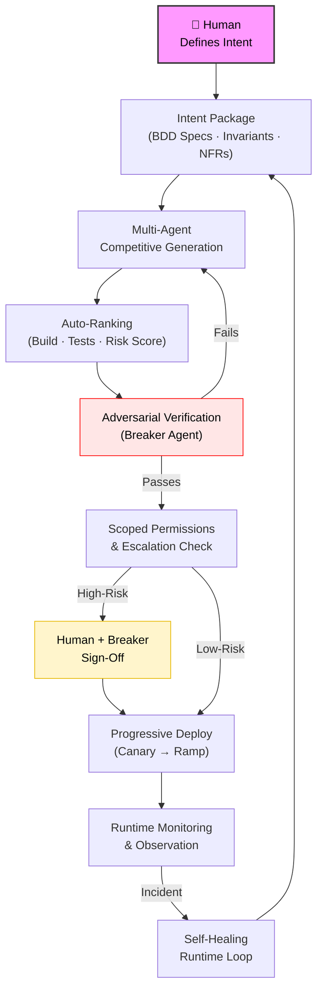
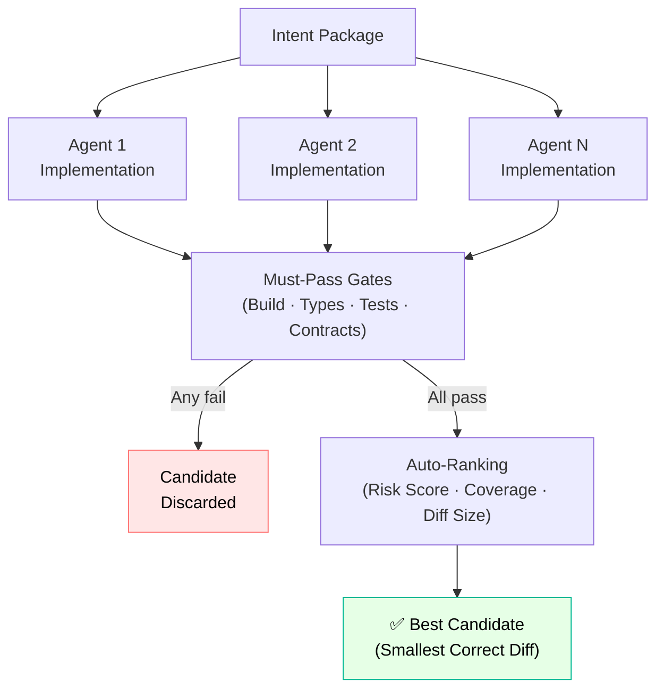
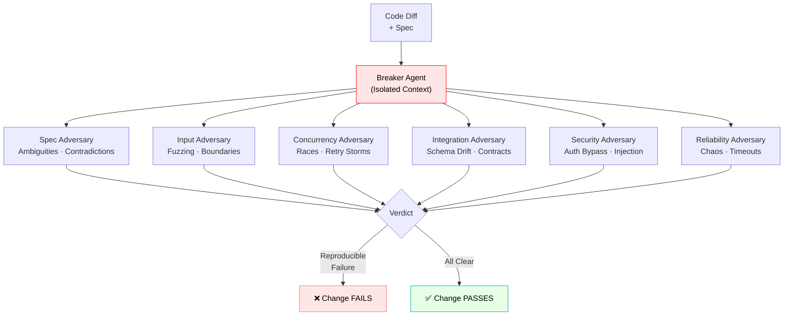
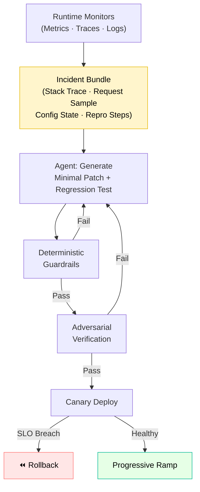
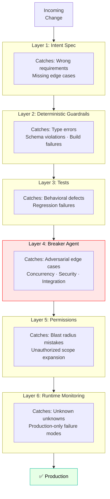

# AI-Native SDLC: A Verification-First Lifecycle for Agent-Generated Code

## Abstract

When code generation reaches inference speed, manual review and human-gated QA become the primary bottleneck. This note proposes a blueprint for an AI-native software development lifecycle in which humans define intent and architecture, while agents generate, verify, and refine code inside deterministic, adversarial guardrails. Reliability emerges from layered constraints, not trust in any single model or agent. The goal: eliminate review bottlenecks without sacrificing correctness, security, or operational stability.

---

## Context & Motivation

Two structural changes make a new SDLC approach necessary:

1. **Code throughput has outpaced human review capacity.** Agents, scaffolding tools, and assisted refactors can generate more code per unit time than any team can fully comprehend. Review devolves into sampling.
2. **Change surfaces have widened.** Modern services are already composed of SDKs, queues, retries, caches, feature flags, and third-party APIs. Continuous agent-driven modification increases the rate at which those surfaces are touched—often with locally plausible but globally fragile changes.

Code review does not scale to autonomous agents. Manual QA does not scale to continuous generation. The answer is not fewer controls—it is controls that are automated, adversarial, and deterministic.

---

## Core Thesis

In an AI-native lifecycle, code is no longer the source of truth. The **Intent Package** is.

- Humans define **what must be true**.
- Agents compete to implement **how it becomes true**.
- Deterministic systems verify compliance.
- Independent adversaries attack every change.
- Runtime systems monitor and auto-correct.

Correctness is not assumed. It is structurally enforced at each layer.

## Comparative SDLC Framework

The table below contrasts four SDLC archetypes. The point is not that teams perfectly fit a column, but that *bottlenecks and failure timing* move in predictable ways as throughput rises.

| Dimension | Traditional SDLC | CI/CD-first SDLC | AI-assisted SDLC | AI-native SDLC (this proposal) |
|---|---|---|---|---|
| **Source of truth** | Code + tribal knowledge + tickets | Code + pipeline config | Code + prompts/chat logs (often ephemeral) | **Intent Package** (versioned specs, invariants, NFRs) + compiled verification artifacts |
| **Unit of change** | PR / patch | Commit → pipeline run | PR / patch (generated faster) | **Intent delta** → candidates generated, ranked, attacked |
| **Review bottleneck** | Human code review | Review shifts to release management + flaky tests | Human review becomes sampling + “vibe check” | **Deterministic gates + isolated breaker**; human review only on policy escalation |
| **Verification mechanism** | Manual QA + unit tests | Automated tests + deploy checks | Same as CI/CD, plus ad-hoc agent-written tests | Deterministic guardrails + contract coverage + adversarial verification + progressive delivery |
| **Failure detection timing** | Late (QA/staging/production) | Earlier (CI), but production still finds gaps | Earlier for obvious failures; subtle defects still escape | Earliest feasible: spec compilation, deterministic gates, adversarial runs; production reserved for unknown unknowns |
| **Human involvement pattern** | Continuous involvement per change | Periodic involvement (merge/release) | Continuous involvement due to review load | **Front-loaded**: intent/invariants + policy sign-off; otherwise supervisory and exception-driven |
| **Economic scaling behavior** | Headcount scales with change volume | Tooling amortizes, but test maintenance rises | Generation cost drops; *verification cost becomes dominant* | Verification becomes the product: harness cost rises upfront, then amortizes with throughput |
| **Primary failure mode** | Underspecified intent + review misses + manual QA gaps | Flaky/insufficient tests + brittle pipelines | Confidently wrong diffs + unverified edge cases + security regressions | **Bad or incomplete intent packages** and mis-specified guardrails (garbage-in/garbage-enforced) |

Structurally, the AI-native SDLC is not “CI/CD plus agents.” It changes the control loop: the system treats intent as the artifact to compile, treats code as a generated intermediate, and treats verification as the scaling surface. That moves reliability from human comprehension to deterministic and adversarial enforcement.

---

## Mechanism / Model

### 1. Intent-First Specifications

The source of truth is a structured, versioned intent document written in natural language but compiled into machine-verifiable artifacts.

Each change requires:

- BDD acceptance scenarios (happy path, boundary, failure, abuse)
- Explicit invariants — what must never break
- Edge cases: nulls, empties, retries, concurrency, skew
- Non-functional constraints: latency, memory, idempotency, consistency model
- Observability requirements: logs, metrics, traces
- Risk tags: auth, DB, payments, PII, infra

Every clause must be traceable to tests, contract assertions, and code paths. If it is not specified, it is undefined behavior. This removes ambiguity before generation begins.

---

### 2. Multi-Agent Competitive Generation

Instead of a single agent implementation, multiple independent agents generate candidates. Each candidate must output:

- Code diff
- New/updated tests
- Contract coverage map (spec clause → assertion)
- Risk notes
- Dependency changes
- Migration steps (if any)

Auto-ranking selects the best candidate using objective signals:

**Must-pass gates:**
- Build
- Type checks
- Unit and integration tests
- Contract tests

**Risk scoring:**
- Surface area expansion
- Sensitive module touches
- Public API changes
- Cyclomatic complexity increase

**Optimization signals:**
- Smallest correct diff
- Highest spec coverage
- Performance stability

The system rewards minimal, correct change. Consensus is irrelevant; verifiable correctness wins.

---

### 3. Deterministic Guardrails

All subjective judgment is replaced by deterministic constraints wherever possible.

Mandatory layers:
- Static typing and schema validation
- API compatibility checks
- DB migration validation
- Lint rules encoding architecture constraints
- Reproducible builds
- Dependency and supply-chain scanning (SBOM)
- Stable JSON tool contracts
- Structured error codes

Agents do not decide if code is acceptable. Tooling does.

---

### 4. Adversarial Verification

Every change is attacked by an independent breaker agent with no shared reasoning context. Isolation is mandatory: the breaker sees only the spec and the diff, operates in a separate context window, uses separate scoring incentives, and runs on a separate toolchain.

**Breaker strategies:**

- **Spec adversary:** ambiguities, missing cases, contradictions
- **Input adversary:** fuzzing, boundary values, encoding attacks
- **Concurrency adversary:** race conditions, retry storms, duplicate events
- **Integration adversary:** schema drift, contract mismatch, backward incompatibility
- **Security adversary:** auth bypass, injection vectors, secret leakage
- **Reliability adversary:** chaos testing, timeout handling, graceful degradation

If the breaker finds a reproducible failure, the change fails.

---

### 5. Scoped Permissions and Escalation

Agents operate under least privilege.

**Default permissions:**
- Read-only repository access
- Write access scoped to target module, tests, and docs only

**Automatic escalation required for:**
- Authentication/authorization
- Payments
- Database migrations
- Infrastructure changes
- Cryptography
- PII handling

High-risk changes require human and breaker sign-off. No agent can silently refactor the system.

---

### 6. Self-Healing Runtime Loop

Post-deploy, runtime monitors feed structured incident bundles into a bounded remediation lane.

**Bundle includes:**
- Stack traces
- Request samples (redacted)
- Config state
- Deployment hash
- Reproduction instructions (if derivable)

**Agent flow:**
1. Generate minimal patch.
2. Add regression test reproducing the incident.
3. Pass full deterministic guardrails.
4. Pass breaker.
5. Deploy via canary.

Rollback is always permitted. Forward auto-fixes are constrained and audited. Self-healing does not bypass verification.

---

### 7. Continuous Observation and Progressive Delivery

CI/CD becomes a governor, not just a pipeline. Deployment proceeds only if:

- Full test suite passes
- Guardrails pass
- Breaker passes
- Risk policy is satisfied

**Release discipline:**
- Canary rollout
- Progressive percentage ramp
- Automated rollback on SLO breach
- Synthetic checks mapped to BDD scenarios
- Error-budget-aware gating
- Drift detection between environments

Verification continues after deploy.

---

## Swiss-Cheese Reliability

Reliability does not rely on one perfect system. It relies on multiple independent layers that fail differently:

| Layer | Failure Type Caught |
|---|---|
| Intent Spec | Wrong requirements |
| Guardrails | Structural violations |
| Tests | Behavioral defects |
| Breaker | Adversarial edge cases |
| Permissions | Blast radius mistakes |
| Runtime Monitoring | Unknown unknowns |

Each layer compensates for weaknesses in the others.

---

## Concrete Examples

### Example 1: Idempotent Webhook Handling

**Intent:** Duplicate events must not double-charge. The system must tolerate retries and reordering.

**Generation:** Three implementations are produced — cache-based, DB unique-constraint, and event-sourced.

**Ranking:** DB unique constraint plus upsert is selected as the smallest correct diff.

**Breaker:**
- Simulates duplicate concurrent delivery.
- Verifies restart scenarios.
- Fails the cache-based approach.

**Escalation:** The DB migration triggers human review.

**Deployment:** Canary with synthetic duplicate event replay. Monitored for consistency metrics.

---

### Example 2: Multi-Tenant Authorization Leak

**Intent:** No cross-tenant data leakage under malformed filters.

**Generation:** Filter logic passes unit tests.

**Breaker:**
- Fuzzes query parameters.
- Discovers empty-tenant fallback edge case.

**Spec update:** Missing tenant must return a 400 error.

**Regenerated patch:** Passes the adversarial run. No human code review required.

---

## Historical Failure Walkthrough: Retry Storm During Partial Dependency Failure

### Failure class

A common historical outage class (seen in multiple high-profile incidents, including large-cloud regional degradation events) is the **retry storm**: a downstream dependency becomes slow or partially unavailable, clients retry aggressively, total load multiplies, and the dependency (plus its control plane) collapses under amplified traffic.

This class is “historical” in the sense that it has repeatedly occurred in real systems; the exact triggering event varies (network partition, degraded storage nodes, overloaded metadata/control plane, etc.).

### Root failure layer

The root layer is usually not “a bug in one function,” but a missing system invariant:

- **Retry logic without global bounds** (no cap, no jitter, no per-key coordination)
- **No circuit breaking / load shedding** when error rate rises
- **Tight coupling** between data plane and control plane paths
- **Insufficient idempotency guarantees**, making retries unsafe or expensive

### How the AI-native SDLC layers interact with this failure

The walkthrough below assumes a team is adding or modifying a client for an internal dependency (HTTP/RPC client, queue consumer, or SDK wrapper) where retry behavior and timeouts can change blast radius.

#### 1) Intent Package

What it would demand (if specified):

- Explicit retry invariants: max attempts, exponential backoff with jitter, overall deadline, and “retry budget” behavior under sustained failures
- Degradation behavior: circuit open conditions, fallback path, or “fail fast” rules
- Safety constraints: idempotency requirements for operations that may be retried
- Observability clauses: metrics for retry rate, downstream latency, circuit state, and queue depth

Where it likely catches the failure:

- If the intent package requires bounded retries and a circuit breaker, unbounded retry implementations are simply *non-compliant*.

Where it can still escape:

- If the intent package is silent (or vague) about retry budgets, the generator can produce locally “reasonable” retry logic that is globally dangerous.

#### 2) Deterministic Guardrails

What it can enforce deterministically:

- Static checks that disallow infinite retries or missing timeouts in dependency clients
- Policy rules requiring jittered backoff helpers rather than ad-hoc loops
- Configuration schema constraints (e.g., max retry cap, deadline required)

Where it likely catches the failure:

- Prevents the most common foot-guns: no-timeout calls, tight retry loops, accidental “retry on everything.”

Where it can still escape:

- Guardrails can’t fully prove system-level stability. A *bounded* retry policy can still synchronize across a fleet and overload a dependency.

#### 3) Competitive Generation

What competition adds:

- Multiple candidate implementations (e.g., token-bucket retry budget vs. per-request exponential backoff) with different failure behaviors
- Selection pressure toward smaller diffs *and* better intent coverage (including explicit backoff/circuit semantics)

Where it likely helps:

- Reduces the chance that the only candidate is the “obvious but fragile” approach.

Where it can still escape:

- If the ranking signals do not include stress/chaos results, competition may select the cleanest diff that still fails under fleet-wide correlated retries.

#### 4) Breaker Isolation

What an isolated breaker should do for this class:

- Inject downstream slowness/5xx into integration tests and run load-oriented scenarios
- Specifically probe for retry amplification: concurrent callers, synchronized retries, and queue consumer reprocessing
- Validate circuit-breaker behavior and recovery hysteresis (avoids flapping)

Where it likely catches the failure:

- If the breaker runs even a modest concurrency test under injected dependency faults, it can reproduce the amplification pattern early.

Where it can still escape:

- If the breaker environment lacks realism (single-node tests, no fleet effects, no realistic timeouts), correlated retry storms can still emerge only at scale.

#### 5) Scoped Permissions

What it changes:

- Retry and timeout defaults are treated as high-risk configuration surfaces
- Changes that widen blast radius (client defaults, shared libraries, global middleware) trigger escalation

Where it likely catches the failure:

- Prevents silent rollout of a dangerous default (e.g., increasing retries globally) without explicit review.

Where it can still escape:

- Even with escalation, a human reviewer can miss the emergent behavior if the intent package and tests don’t make the risk concrete.

#### 6) Runtime Monitoring

What runtime can detect early:

- Rapid increase in retry rate, dependency latency, and error rate
- Circuit breaker state changes and retry-budget exhaustion
- Saturation signals (queue depth, thread pool exhaustion, CPU)

Where it catches the failure:

- It can detect the onset quickly and trigger automatic mitigations (open circuits, shed load, clamp retries, progressive rollback).

Where it can still escape:

- Monitoring detects; it doesn’t prevent. If the first few minutes of a storm cause irreversible effects (data corruption, cascading overload across multiple dependencies), the incident still happens—only with faster containment.

Net: this outage class is exactly where an AI-native SDLC can be meaningfully stronger than “generated code + CI,” but only if retry/circuit invariants are treated as first-class intent and enforced through guardrails and adversarial tests.

---

## Trade-offs & Failure Modes

**What this approach does poorly:**

- **Intent specification overhead.** Structured BDD specs and invariant documents require disciplined upfront work. Teams without strong specification habits will produce weak intent packages, which degrades every downstream step.
- **Toolchain integration complexity.** Deterministic guardrails, breaker agents, canary pipelines, and runtime monitors require investment before they provide value.
- **False confidence from passing gates.** A green breaker pass does not guarantee correctness in all production conditions. The adversarial strategies cover known failure categories, not unknown unknowns.

**Where it breaks:**

- When specs are vague, agents optimize for the wrong objective.
- When guardrails are misconfigured or absent, structural violations propagate.
- When breaker strategies are narrow, edge cases outside the strategy set go undetected.

**What this approach does not attempt to solve:**

- It does not replace domain expertise. It assumes domain expertise is applied where it has the most leverage: invariants, boundaries, and recovery.
- It does not address problems of organizational alignment or incentives.
- It does not provide formal correctness proofs for critical flows.

---

## Phased Adoption Model

The proposal reads cleanest as an integrated system, but real organizations adopt in increments. The phases below aim to preserve the reliability benefits while acknowledging tooling, culture, and integration constraints.

| Phase | Scope | Required tooling maturity | Organizational prerequisites | Expected reliability improvement | Economic cost multiplier | Typical failure reduction class |
|---|---|---|---|---|---|---|
| **Phase 1 – Intent + Deterministic Guardrails** | Introduce intent packages, spec-to-test traceability, and deterministic gates in CI | Strong CI; typed boundaries/schemas; contract tests; policy-as-code linting | Willingness to write/maintain invariants; ownership of pipelines; agreement on “definition of done” | Medium: fewer regressions, fewer obvious security mistakes | ~1.1–1.4× initially (spec + gate work), amortizes down | Incorrect assumptions, schema drift, missing edge cases, simple auth mistakes |
| **Phase 2 – Competitive Multi-Agent Generation** | Multiple candidate diffs + auto-ranking against gates and coverage | Stable, reproducible test environment; good test determinism; ability to sandbox agents | Comfort with agents writing code; clear module boundaries; PR workflow that can accept machine-generated candidates | Medium–high: reduces “single-path” fragility and improves test coverage quality | ~1.2–1.8× compute/tooling; human time often decreases | Logic bugs that are caught by better tests/coverage; API compatibility issues |
| **Phase 3 – Breaker Isolation** | Independent adversarial verification lane that attacks spec + diff | Isolation primitives; fuzz/chaos harness; realistic integration test fixtures; failure triage workflow | Incentives to treat breaker failures as first-class; time budget for adversarial iteration | High for known failure classes: concurrency, security, integration edges | ~1.3–2.5× (depends on breadth of adversaries) | Concurrency races, retry storms, auth bypass patterns, unsafe default changes |
| **Phase 4 – Self-Healing Runtime Loop** | Incident bundles → bounded auto-fix lane → canary | Mature observability; safe canary/rollback; incident classification; redaction and audit | Strong on-call discipline; clear ownership; risk policy for auto-remediation | High on MTTR and recurrence reduction; prevention still depends on upstream layers | ~1.2–2.0× ongoing ops investment; can reduce human toil | Recurrent production-only failures, configuration drift, “unknown unknowns” made known |

Notes on friction:

- Phase 1 is mostly process + CI policy, but it requires teams to confront ambiguity explicitly.
- Phase 2 tends to fail if tests are flaky; competitive generation amplifies flakiness costs.
- Phase 3 requires isolation and realism; otherwise it degenerates into another unit-test suite.
- Phase 4 is high-trust internally: you need strong audit trails and conservative blast-radius constraints.

---

## Minimal Viable AI-Native SDLC (MV-AI-SDLC)

If a small team implements only ~20% of the system, the 80% reliability gain comes from making intent explicit and making verification deterministic. Everything else is leverage on top.

### Smallest non-negotiable components

1. **Intent Package as a versioned artifact**
    - A lightweight, enforced format (even a single `intent.md` per change) containing BDD scenarios, invariants, and risk tags.
2. **Deterministic guardrails in CI**
    - Build, types/schema validation, unit/integration tests, and at least one policy rule for each high-risk domain you operate in (auth, data, payments, infra).
3. **Spec-to-test traceability (thin)**
    - A simple checklist or mapping that forces every invariant to have an assertion somewhere (test, contract check, runtime guard).
4. **Progressive delivery + rollback**
    - Even without fancy automation: canary, fast rollback path, and an SLO-based stop condition.

### What can safely be deferred

- Full multi-agent competition and auto-ranking (Phase 2)
- Sophisticated breaker suites (Phase 3), beyond a minimal set of targeted adversarial tests
- Self-healing auto-fix loops (Phase 4)
- Cryptographic provenance / advanced scoring models

### Highest leverage-to-complexity ratio

- **Write down invariants and make them executable.** Most reliability failures are “unspecified behavior” that later becomes production behavior.
- **Ban unbounded retries/timeouts by policy.** A handful of deterministic rules eliminate a disproportionate number of outage triggers.
- **Make risk explicit.** If a change touches auth, migrations, shared clients, or global middleware, treat it as high-risk by default.

### What a solo engineer can realistically implement

- A PR template + CI job that requires an `Intent Package` section and fails if missing invariants for risk-tagged changes.
- A small set of guardrail linters (timeouts required, retry helpers required, schema compatibility checks).
- One adversarial test harness relevant to your system (e.g., fuzz query params for auth boundaries, or inject downstream 5xx to validate circuit behavior).
- Canary + rollback runbook automation (even if rollout is manual at first).

---

## Practical Takeaways

1. **Make the Intent Package the unit of change, not the code diff.** Require specs, invariants, and BDD scenarios before generation begins.
2. **Replace subjective review with deterministic gates.** Build passing, type checks, contract tests, and guardrails should be preconditions for any candidate proceeding.
3. **Run a breaker with genuine isolation.** Shared context between generator and verifier undermines adversarial value; separate context windows are not optional.
4. **Scope agent permissions to the minimum required surface.** Automatic escalation for auth, payments, migrations, and infra prevents catastrophic silent refactors.
5. **Treat the runtime loop as part of the SDLC.** Incidents feed back into spec refinement; self-healing patches pass the same gates as new features.

---

## Harness Thesis Alignment: The Harness Is the Software

This proposal is an instance of a broader thesis: **the harness becomes the primary software artifact; the model becomes a component.**

Why SDLC design is fundamentally a harness design problem:

- The SDLC defines the closed-loop control system that turns intent into deployed behavior. In an AI-native setting, the transformation happens fast; therefore, the *constraints* and *verification surfaces* dominate outcomes.
- A “better model” changes the distribution of mistakes, but it does not eliminate them. The harness is what decides which mistakes ship.

Why model quality improvements alone do not solve reliability scaling:

- As generation cost approaches zero, the limiting factor becomes the marginal cost of verification (tests, analysis, isolation, canarying, monitoring). Without a harness that scales verification, higher-quality outputs simply increase the volume of changes you can be wrong about.
- Many failures are **emergent** (retries, concurrency, distributed state, permission boundaries). These are not reliably addressed by single-shot code synthesis quality; they require adversarial and system-level enforcement.

Why isolation and deterministic enforcement matter more than model cleverness:

- Deterministic guardrails convert subjective judgment into reproducible constraints and make compliance measurable.
- Breaker isolation prevents shared-context failure, where the generator and verifier converge on the same wrong assumptions.
- Scoped permissions and progressive delivery bound blast radius. In practice, bounding blast radius is often more valuable than attempting to predict every failure.

## Research Directions

1. Formal invariants integration (TLA+, Alloy for critical flows)
2. Trace-driven verification: replay production traffic as acceptance tests
3. Economic scoring models for verification agents
4. Cryptographic provenance of agent actions
5. Spec-to-code coverage metrics

---

## Positioning Note

This note is not:

- **Academic research:** it does not prove formal properties; it describes a practical SDLC structure grounded in software engineering principles.
- **Blog opinion:** each mechanism — intent packages, multi-agent ranking, breaker isolation, progressive delivery — maps to a concrete operational problem it solves.
- **Vendor documentation:** the proposal is tool-agnostic and does not depend on any specific platform, agent framework, or cloud provider.

---

## Status & Scope Disclaimer

This is a proposal. The individual components (BDD specs, contract testing, adversarial testing, canary deployment) are established practices. The integrated lifecycle described here is an extrapolation of those practices to AI-native, high-throughput development. This is personal lab work, not authoritative guidance. Validation at scale would require empirical study beyond the scope of this note.

---

*AI will generate code faster than humans can review it. The bottleneck must move from people to systems. The future SDLC is not lighter-weight — it is more structured, more adversarial, and more deterministic. Trust becomes optional. Verification becomes mandatory.*
