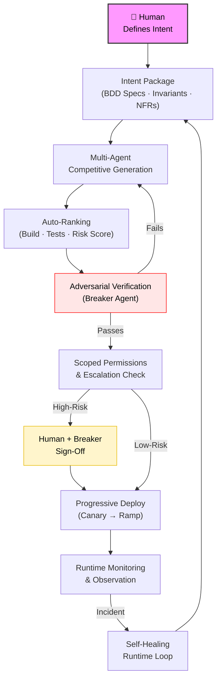
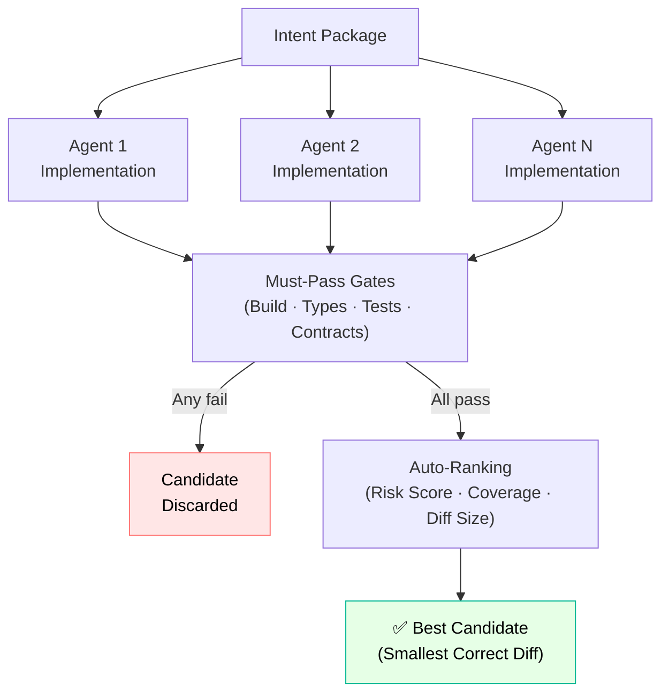
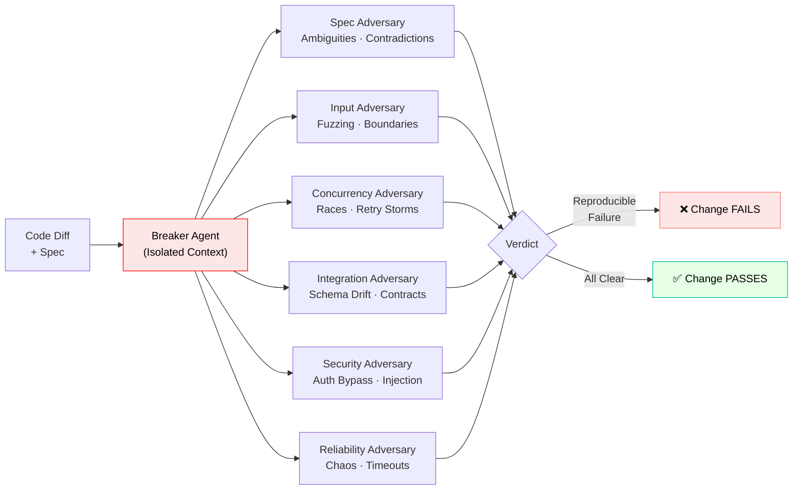
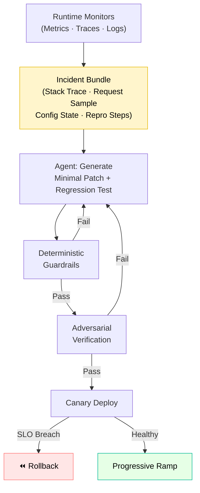

# AI-Native SDLC: A Proposal for Inference-Speed, Rock-Solid Software

## Abstract

When code generation reaches inference speed, manual review and human-gated QA become the primary bottleneck. This note proposes a blueprint for an AI-native software development lifecycle in which humans define intent and architecture, while agents generate, verify, and refine code inside deterministic, adversarial guardrails. Reliability emerges from layered constraints, not trust in any single model or agent. The goal: eliminate review bottlenecks without sacrificing correctness, security, or operational stability.

---

## Context & Motivation

Two structural changes make a new SDLC approach necessary:

1. **Code throughput has outpaced human review capacity.** Agents, scaffolding tools, and assisted refactors can generate more code per unit time than any team can fully comprehend. Review devolves into sampling.
2. **Change surfaces have widened.** Modern services are already composed of SDKs, queues, retries, caches, feature flags, and third-party APIs. Continuous agent-driven modification increases the rate at which those surfaces are touched—often with locally plausible but globally fragile changes.

Code review does not scale to autonomous agents. Manual QA does not scale to continuous generation. The answer is not fewer controls—it is controls that are automated, adversarial, and deterministic.

---

## Core Thesis

In an AI-native lifecycle, code is no longer the source of truth. The **Intent Package** is.

- Humans define **what must be true**.
- Agents compete to implement **how it becomes true**.
- Deterministic systems verify compliance.
- Independent adversaries attack every change.
- Runtime systems monitor and auto-correct.

Correctness is not assumed. It is structurally enforced at each layer.

---

## Mechanism / Model

### 1. Intent-First Specifications

The source of truth is a structured, versioned intent document written in natural language but compiled into machine-verifiable artifacts.

Each change requires:

- BDD acceptance scenarios (happy path, boundary, failure, abuse)
- Explicit invariants — what must never break
- Edge cases: nulls, empties, retries, concurrency, skew
- Non-functional constraints: latency, memory, idempotency, consistency model
- Observability requirements: logs, metrics, traces
- Risk tags: auth, DB, payments, PII, infra

Every clause must be traceable to tests, contract assertions, and code paths. If it is not specified, it is undefined behavior. This removes ambiguity before generation begins.

---

### 2. Multi-Agent Competitive Generation

Instead of a single agent implementation, multiple independent agents generate candidates. Each candidate must output:

- Code diff
- New/updated tests
- Contract coverage map (spec clause → assertion)
- Risk notes
- Dependency changes
- Migration steps (if any)

Auto-ranking selects the best candidate using objective signals:

**Must-pass gates:**
- Build
- Type checks
- Unit and integration tests
- Contract tests

**Risk scoring:**
- Surface area expansion
- Sensitive module touches
- Public API changes
- Cyclomatic complexity increase

**Optimization signals:**
- Smallest correct diff
- Highest spec coverage
- Performance stability

The system rewards minimal, correct change. Consensus is irrelevant; verifiable correctness wins.

---

### 3. Deterministic Guardrails

All subjective judgment is replaced by deterministic constraints wherever possible.

Mandatory layers:
- Static typing and schema validation
- API compatibility checks
- DB migration validation
- Lint rules encoding architecture constraints
- Reproducible builds
- Dependency and supply-chain scanning (SBOM)
- Stable JSON tool contracts
- Structured error codes

Agents do not decide if code is acceptable. Tooling does.

---

### 4. Adversarial Verification

Every change is attacked by an independent breaker agent with no shared reasoning context. Isolation is mandatory: the breaker sees only the spec and the diff, operates in a separate context window, uses separate scoring incentives, and runs on a separate toolchain.

**Breaker strategies:**

- **Spec adversary:** ambiguities, missing cases, contradictions
- **Input adversary:** fuzzing, boundary values, encoding attacks
- **Concurrency adversary:** race conditions, retry storms, duplicate events
- **Integration adversary:** schema drift, contract mismatch, backward incompatibility
- **Security adversary:** auth bypass, injection vectors, secret leakage
- **Reliability adversary:** chaos testing, timeout handling, graceful degradation

If the breaker finds a reproducible failure, the change fails.

---

### 5. Scoped Permissions and Escalation

Agents operate under least privilege.

**Default permissions:**
- Read-only repository access
- Write access scoped to target module, tests, and docs only

**Automatic escalation required for:**
- Authentication/authorization
- Payments
- Database migrations
- Infrastructure changes
- Cryptography
- PII handling

High-risk changes require human and breaker sign-off. No agent can silently refactor the system.

---

### 6. Self-Healing Runtime Loop

Post-deploy, runtime monitors feed structured incident bundles into a bounded remediation lane.

**Bundle includes:**
- Stack traces
- Request samples (redacted)
- Config state
- Deployment hash
- Reproduction instructions (if derivable)

**Agent flow:**
1. Generate minimal patch.
2. Add regression test reproducing the incident.
3. Pass full deterministic guardrails.
4. Pass breaker.
5. Deploy via canary.

Rollback is always permitted. Forward auto-fixes are constrained and audited. Self-healing does not bypass verification.

---

### 7. Continuous Observation and Progressive Delivery

CI/CD becomes a governor, not just a pipeline. Deployment proceeds only if:

- Full test suite passes
- Guardrails pass
- Breaker passes
- Risk policy is satisfied

**Release discipline:**
- Canary rollout
- Progressive percentage ramp
- Automated rollback on SLO breach
- Synthetic checks mapped to BDD scenarios
- Error-budget-aware gating
- Drift detection between environments

Verification continues after deploy.

---

## Swiss-Cheese Reliability

Reliability does not rely on one perfect system. It relies on multiple independent layers that fail differently:

| Layer | Failure Type Caught |
|---|---|
| Intent Spec | Wrong requirements |
| Guardrails | Structural violations |
| Tests | Behavioral defects |
| Breaker | Adversarial edge cases |
| Permissions | Blast radius mistakes |
| Runtime Monitoring | Unknown unknowns |

Each layer compensates for weaknesses in the others.

```mermaid
flowchart LR
    Change["Incoming\nChange"] --> L1

    subgraph L1["Layer 1: Intent Spec"]
        IS["Catches: Wrong requirements\nMissing edge cases"]
    end

    subgraph L2["Layer 2: Deterministic Guardrails"]
        DG["Catches: Type errors\nSchema violations · Build failures"]
    end

    subgraph L3["Layer 3: Tests"]
        TS["Catches: Behavioral defects\nRegression failures"]
    end

    subgraph L4["Layer 4: Breaker Agent"]
        BA["Catches: Adversarial edge cases\nConcurrency · Security · Integration"]
    end

    subgraph L5["Layer 5: Permissions"]
        PM["Catches: Blast radius mistakes\nUnauthorized scope expansion"]
    end

    subgraph L6["Layer 6: Runtime Monitoring"]
        RM["Catches: Unknown unknowns\nProduction-only failure modes"]
    end

    L1 --> L2 --> L3 --> L4 --> L5 --> L6 --> Prod["✅ Production"]

    style L4 fill:#ffe6e6,stroke:#ff0000,color:black
    style Prod fill:#e6ffe6,stroke:#00b894,color:black
```

---

## Concrete Examples

### Example 1: Idempotent Webhook Handling

**Intent:** Duplicate events must not double-charge. The system must tolerate retries and reordering.

**Generation:** Three implementations are produced — cache-based, DB unique-constraint, and event-sourced.

**Ranking:** DB unique constraint plus upsert is selected as the smallest correct diff.

**Breaker:**
- Simulates duplicate concurrent delivery.
- Verifies restart scenarios.
- Fails the cache-based approach.

**Escalation:** The DB migration triggers human review.

**Deployment:** Canary with synthetic duplicate event replay. Monitored for consistency metrics.

---

### Example 2: Multi-Tenant Authorization Leak

**Intent:** No cross-tenant data leakage under malformed filters.

**Generation:** Filter logic passes unit tests.

**Breaker:**
- Fuzzes query parameters.
- Discovers empty-tenant fallback edge case.

**Spec update:** Missing tenant must return a 400 error.

**Regenerated patch:** Passes the adversarial run. No human code review required.

---

## Trade-offs & Failure Modes

**What this approach does poorly:**

- **Intent specification overhead.** Structured BDD specs and invariant documents require disciplined upfront work. Teams without strong specification habits will produce weak intent packages, which degrades every downstream step.
- **Toolchain integration complexity.** Deterministic guardrails, breaker agents, canary pipelines, and runtime monitors require investment before they provide value.
- **False confidence from passing gates.** A green breaker pass does not guarantee correctness in all production conditions. The adversarial strategies cover known failure categories, not unknown unknowns.

**Where it breaks:**

- When specs are vague, agents optimize for the wrong objective.
- When guardrails are misconfigured or absent, structural violations propagate.
- When breaker strategies are narrow, edge cases outside the strategy set go undetected.

**What this approach does not attempt to solve:**

- It does not replace domain expertise. It assumes domain expertise is applied where it has the most leverage: invariants, boundaries, and recovery.
- It does not address problems of organizational alignment or incentives.
- It does not provide formal correctness proofs for critical flows.

---

## Practical Takeaways

1. **Make the Intent Package the unit of change, not the code diff.** Require specs, invariants, and BDD scenarios before generation begins.
2. **Replace subjective review with deterministic gates.** Build passing, type checks, contract tests, and guardrails should be preconditions for any candidate proceeding.
3. **Run a breaker with genuine isolation.** Shared context between generator and verifier undermines adversarial value; separate context windows are not optional.
4. **Scope agent permissions to the minimum required surface.** Automatic escalation for auth, payments, migrations, and infra prevents catastrophic silent refactors.
5. **Treat the runtime loop as part of the SDLC.** Incidents feed back into spec refinement; self-healing patches pass the same gates as new features.

---

## Research Directions

1. Formal invariants integration (TLA+, Alloy for critical flows)
2. Trace-driven verification: replay production traffic as acceptance tests
3. Economic scoring models for verification agents
4. Cryptographic provenance of agent actions
5. Spec-to-code coverage metrics

---

## Positioning Note

This note is not:

- **Academic research:** it does not prove formal properties; it describes a practical SDLC structure grounded in software engineering principles.
- **Blog opinion:** each mechanism — intent packages, multi-agent ranking, breaker isolation, progressive delivery — maps to a concrete operational problem it solves.
- **Vendor documentation:** the proposal is tool-agnostic and does not depend on any specific platform, agent framework, or cloud provider.

---

## Status & Scope Disclaimer

This is a proposal. The individual components (BDD specs, contract testing, adversarial testing, canary deployment) are established practices. The integrated lifecycle described here is an extrapolation of those practices to AI-native, high-throughput development. This is personal lab work, not authoritative guidance. Validation at scale would require empirical study beyond the scope of this note.

---

*AI will generate code faster than humans can review it. The bottleneck must move from people to systems. The future SDLC is not lighter-weight — it is more structured, more adversarial, and more deterministic. Trust becomes optional. Verification becomes mandatory.*
