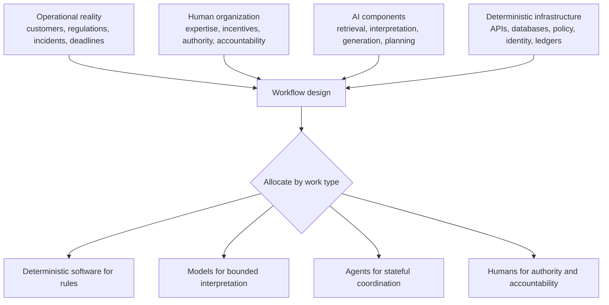
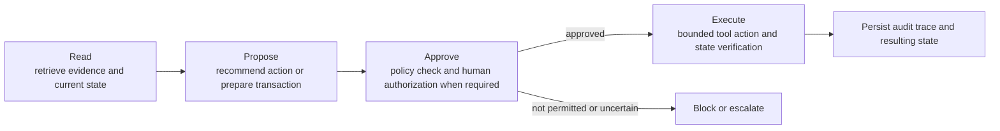
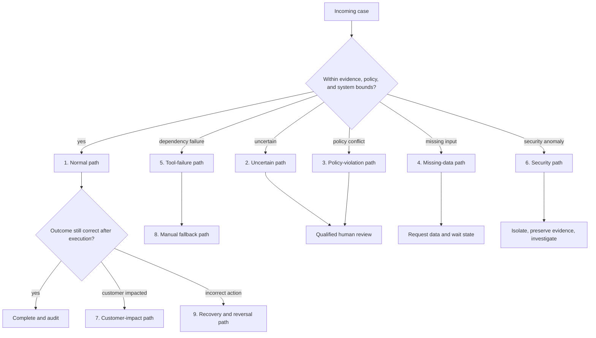
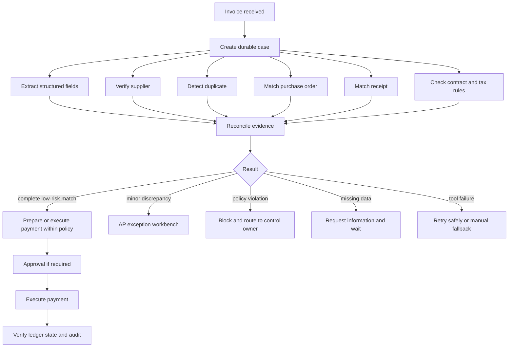

# From Task Automation to AI-Native Workflows: A Practical Redesign Framework

## Abstract

Most enterprise AI programs start from the wrong unit of analysis. Teams ask which tasks a model can perform, then drop that capability into an existing process. That can improve one local activity while leaving throughput, control, and accountability unchanged. In some cases, it makes the workflow worse by increasing review load, hiding failure modes, or adding new coordination costs.

This note argues for a different design unit: the workflow. Its practical design principle is simple:

> Use deterministic software for rules, models for bounded interpretation, agents for stateful coordination, and humans for authority and accountability.

From that principle, the note develops a workflow-redesign method grounded in sociotechnical systems thinking, explicit work decomposition, governed autonomy, event-driven state management, exception-first architecture, and end-to-end operational measurement.

The goal is not maximum automation. The goal is a workflow that becomes measurably faster, cheaper, more reliable, and more controllable without losing accountable human authority.

## Status and Scope Disclaimer

This document is a practical design framework. It does not claim that all enterprise work should become agentic, and it does not recommend removing human control from consequential decisions. It is written for bounded enterprise workflows where an organization can define business outcomes, authority boundaries, policy constraints, and recovery procedures. It does not substitute for legal, regulatory, or security review in high-consequence domains.

## Why Workflow Redesign Matters

AI capability is not the same thing as operational value. A model may summarize documents, extract fields, classify requests, draft decisions, or recommend actions. None of those capabilities, on its own, tells us whether the surrounding workflow performs better.

Consider a contract review process. It may include intake queues, policy reconstruction, exception routing, approval bottlenecks, system handoffs, and authorized sign-off. A model can accelerate clause extraction and draft redlines in seconds while total elapsed time remains dominated by waiting, escalation, and approval. The same pattern appears in invoice processing, customer operations, clinical workflows, and software engineering.

That is why workflow redesign matters more than model insertion. Deploying AI changes access to capability. Redesigning the workflow changes how the organization operates.

## Thesis

The central claim is:

> Use deterministic software for rules, models for bounded interpretation, agents for stateful coordination, and humans for authority and accountability.

This principle separates four capabilities that organizations often collapse into a vague idea of "automation." The workflow, not the model, chatbot, or agent, is the primary unit of design.

## The Gap Between AI Capability and Operational Value

The operational question is not whether generation is possible. The real question is whether the full process improves once verification, governance, and recovery are included.

Little's Law offers a useful reminder:

`L = λW`

Where:

- `L` is average work in progress
- `λ` is average throughput
- `W` is average time in system

If AI increases the rate of candidate outputs while downstream review capacity stays fixed, then work in progress or elapsed time must rise somewhere in the system. AI often creates exactly this condition because generation scales more cheaply than verification.

That asymmetry matters. Drafts, classifications, recommendations, and candidate actions are cheap to produce at the margin. Human review, policy interpretation, authorization, and accountable sign-off do not scale the same way. In practice, the bottleneck often moves from production to verification.

So the better design question is not, "Can the model do this?" It is:

- Does the redesign remove a real workflow constraint?
- Does it reduce coordination cost rather than merely shifting it?
- Does it add review burden faster than it removes manual effort?
- Does it strengthen or weaken control?

A useful operator heuristic is:

`Net workflow value = coordination and processing cost removed / verification, governance, and recovery cost introduced`

This is not a formal accounting identity. It is a discipline for avoiding false productivity claims.

## Treat the Workflow as a Sociotechnical System

Enterprise work emerges from people, policies, software, incentives, and external constraints acting together. AI is one component inside that larger system.

A useful working model has four interacting layers:

1. **Operational reality**  
   Customers, markets, regulations, deadlines, incidents, suppliers, and physical constraints.

2. **Human organization**  
   Expertise, authority, incentives, trust, cognitive load, informal workarounds, and accountability.

3. **AI components**  
   Retrieval, extraction, classification, generation, planning, and probabilistic judgment.

4. **Deterministic infrastructure**  
   Databases, APIs, workflow engines, policy services, identity systems, ledgers, and systems of record.

Workflows often fail at the interfaces between these layers. A model may produce a plausible recommendation without current permissions data. A human may remain accountable without enough evidence to supervise the decision. A deterministic rule may block a valid case because the exception model is incomplete. An agent may coordinate several steps while relying on reconstructed context instead of authoritative state.

The design goal is not maximum automation in any one layer. The goal is a system where each layer does the work it is structurally suited to do.

## Map the Real Workflow Before Choosing Tools

Workflow redesign should start with a current-state map of how work actually moves, not how the official procedure says it moves.

For each workflow, identify:

- the triggering event
- the desired business outcome
- participating actors
- information inputs
- transformations on that information
- decisions and their criteria
- tool actions
- queues and waiting states
- handoffs between actors and systems
- approval and control points
- common exceptions
- recovery and reversal paths
- the accountable workflow owner
- baseline performance measures

The critical distinction is between **active time** and **elapsed time**. A step that takes ten minutes of work may spend three days waiting in a queue. Automating the ten-minute step does not remove the three-day delay.

A practical mapping method is to trace several real cases and record, for each step:

- active processing time
- wait time
- queue ownership
- required evidence
- authority needed to proceed
- common rework triggers
- failure and fallback behavior

This exercise usually reveals where the formal process diverges from operational reality, especially where people rely on spreadsheets, email approvals, copied identifiers, direct messages, or tacit expert knowledge to keep work moving.

## Work Decomposition Framework

The question "Can AI do this task?" is too coarse for workflow design. Most business activities contain several distinct work types. Decompose them before you allocate execution.

### 1. Transformations

These convert information from one representation into another.

Examples:

- extracting invoice fields from a PDF
- converting notes into structured data
- classifying an incoming request
- summarizing evidence
- identifying clauses in a contract

### 2. Decisions

These evaluate alternatives under constraints.

Examples:

- whether evidence is sufficient
- whether a discrepancy is acceptable
- whether a case exceeds risk tolerance
- whether escalation is required

### 3. Actions

These change system state.

Examples:

- creating a ticket
- writing a record
- scheduling a payment
- restarting a service
- changing an account status

### 4. Handoffs

These transfer ownership or coordinate multiple participants.

Examples:

- routing a case to compliance
- requesting missing information
- assigning an incident
- combining evidence from several systems

### 5. Exceptions

These are states where the normal path cannot safely continue.

Examples:

- incomplete inputs
- contradictory evidence
- policy violations
- unavailable tools
- anomalous behavior
- incorrect completed actions

This decomposition matters because each work type brings different failure modes, latency patterns, and control requirements.

## Allocation Rules for Each Work Type

Allocation should follow the nature of the work, not the novelty of the technology.

| Work type | Primary mechanism | Why |
|---|---|---|
| Transformations | Models, bounded by schema and verification | Unstructured inputs often require interpretation, but outputs can be checked |
| Decisions | Deterministic policy where possible, human authority where consequential, models only for recommendation | Decision quality depends on separating recommendation from authorization |
| Actions | Deterministic software and bounded tools | State changes must be explicit, auditable, and idempotent |
| Handoffs | Agents or workflow engines with durable state | Coordination is often where elapsed time accumulates |
| Exceptions | Named paths with assigned owners | Production credibility depends on controlled deviation and recovery |

The practical rule set is:

- **Use deterministic software for explicit rules**
- **Use models for bounded interpretation**
- **Use agents for stateful coordination under uncertainty**
- **Use humans for authority, unresolved ambiguity, and accountability**

## Separate Reasoning, Authorization, and Execution

One of the most important boundaries in an AI-native workflow is the boundary between proposing an action and being allowed to perform it.

A model may infer that an invoice should be paid. An agent may prepare the transaction. Neither should define its own authority.

A governed workflow has four states:

1. **Read**  
   Retrieve evidence and current process state.

2. **Propose**  
   Generate a recommendation or candidate action.

3. **Approve**  
   Apply policy and, where required, obtain human authorization.

4. **Execute**  
   Invoke deterministic systems and verify the resulting state.

This separation keeps the reasoning component from becoming the permission system. It also makes review legible. Operators can inspect the evidence, policy outcome, and proposed action separately.

## Human Oversight as Epistemic Access and Causal Power

"Human in the loop" is not enough. Effective oversight requires two concrete properties.

### Epistemic access

The operator must be able to understand:

- what decision is being requested
- what evidence supports it
- how fresh and complete that evidence is
- what uncertainty or contradiction remains
- what policy constraints apply
- what the likely downstream effects are

### Causal power

The operator must be able to:

- reject the action
- modify the action
- pause the workflow
- redirect to another path
- trigger fallback
- reverse the action where possible

A person who can only click approve is not exercising meaningful oversight. That person is absorbing residual blame without adequate control.

## The Autonomy Ladder

Autonomy should be treated as a governed spectrum, not as a binary choice.

### Level 1: Inform

The system structures evidence. Humans decide and execute.

### Level 2: Recommend

The system proposes one or more actions with supporting evidence. Humans choose.

### Level 3: Prepare and validate

The system prepares the transaction or change. Execution is blocked pending approval.

### Level 4: Bounded execution

The system executes when machine-readable conditions are satisfied. Humans can monitor, veto, pause, or reverse.

### Level 5: Continuous autonomy

The system operates asynchronously under explicit guardrails, with supervision through monitoring, sampling, and retrospective audit.

Autonomy should vary by transaction, not only by application. A low-value exact-match invoice may qualify for bounded execution while a high-value ambiguous invoice remains at recommendation or prepare-and-approve.

The gating variables are not just model confidence. They include:

- consequence severity
- reversibility
- evidence completeness
- policy coverage
- verifiability
- regulatory requirements
- historical failure rate
- environmental volatility
- recovery capability

## Redesign Around Events and Shared State

Legacy workflows often depend on polling, inbox checking, spreadsheet tracking, and sequential handoffs. AI-native workflows can use a different structure.

### Event-driven architecture

The workflow should begin from meaningful state changes such as:

- invoice received
- contract uploaded
- threshold breached
- evidence submitted
- account state changed
- required data became available

Event-driven design reduces hidden waiting and makes progress legible.

### Shared authoritative state

Long-running workflows need durable state outside the model context. The state store should record:

- transaction identity
- workflow version
- current stage
- input evidence and provenance
- model outputs
- policy results
- approvals
- tool invocations
- retries
- exceptions
- resulting system state
- recovery actions

A context window is not a system of record. Without shared state, agents reconstruct reality from partial history, repeat work, or act on stale information.

### Parallelization where it actually helps

Independent checks should run concurrently only when the reduction in elapsed time exceeds the cost of synchronization, rate limits, and failure coordination.

## Exception-First Design

A prototype proves that the happy path can complete. A production workflow proves that the system can survive deviation, uncertainty, and failure.

In practice, the workflow should define **nine operational paths: one normal path plus eight exception and recovery paths**.

1. **Normal path**  
   Inputs are complete, policy allows the action, execution succeeds, and the case is fully recorded.

2. **Uncertain path**  
   Evidence is conflicting, incomplete, or below quality threshold.

3. **Policy-violation path**  
   A proposed action conflicts with a machine-readable rule.

4. **Missing-data path**  
   Required input is absent.

5. **Tool-failure path**  
   A dependency is unavailable or returns an ambiguous result.

6. **Security path**  
   Prompt injection, unauthorized access, anomalous tool use, or privilege escalation is detected.

7. **Customer-impact path**  
   An error affects an external person, service, or account.

8. **Manual fallback path**  
   The automated workflow is unavailable or outside its validated operating range.

9. **Recovery and reversal path**  
   A completed action is later found to be incorrect.

Exception-first design changes the architecture in three ways:

- the workflow becomes stateful rather than conversational
- recovery becomes an explicit design object rather than an ad hoc response
- human escalation becomes structured work reduction rather than dumping an unresolved case on an operator

## Decision Rights and Accountability Matrix

AI systems diffuse responsibility unless execution, authority, and accountability are explicit.

A practical matrix distinguishes at least four dimensions:

- **Execution responsibility**: who or what performs the action
- **Decision authority**: who may authorize it
- **Operational ownership**: who maintains the workflow
- **Legal and organizational accountability**: who remains answerable for the outcome

| Workflow responsibility | Typical owner |
|---|---|
| Information extraction | Model |
| Schema and policy validation | Deterministic service |
| Candidate recommendation | Model or agent |
| Low-risk bounded execution | Workflow controller |
| High-risk approval | Domain authority |
| Exception resolution | Exception manager |
| Control maintenance | Risk or compliance owner |
| Runtime reliability | Platform or AI operations |
| Business outcome | Workflow owner |
| Legal accountability | Designated organizational authority |

Delegating execution does not delegate authority. Delegating authority does not erase accountability.

## Team Organization Around Workflow Outcomes

A centralized AI team can provide models, infrastructure, standards, and vendor management. On its own, that is rarely enough to redesign a workflow.

Workflow redesign requires local operational knowledge:

- how work is actually performed
- which exceptions dominate time and risk
- where data is unreliable
- which approvals are substantive
- which failures create customer or regulatory harm
- what informal workarounds keep the current system functioning

The implementation team should therefore organize around the workflow outcome, not around the model component. In practice, that often means combining:

- domain operators
- an accountable workflow owner
- embedded AI or forward deployed engineers
- platform and security engineers
- risk or compliance owners
- product or process design
- evaluators responsible for operational quality

The objective is durable operating change, not a one-off prompt integration.

## Measurement Framework: Cycle Time, Quality, Cost, and Control

Workflow value must be measured at the operational level.

### Cycle time

Measure:

- end-to-end lead time
- active processing time
- queue waiting time
- time to resolve exceptions
- time to recovery

### Quality

Measure:

- first-pass completion rate
- rework rate
- downstream error rate
- evidence completeness
- escalation quality
- disagreement between human and system
- reversal rate

### Cost

Measure:

- inference and infrastructure cost
- human processing time
- review and audit cost
- exception-management cost
- remediation cost
- total cost per completed outcome

### Control

Measure:

- policy-block rate
- human override rate
- unauthorized-action attempts
- audit-trail completeness
- rollback success
- mean time to containment
- share of work processed outside the intended path

A system has not improved the workflow if it reduces local labor time while increasing exception cost, weakening auditability, or overloading reviewers.

## A 9-Phase Workflow Redesign Sequence

A practical redesign program can follow nine phases.

### Phase 1: Define the outcome and boundary

Specify the trigger, the business outcome, the accountable owner, the systems involved, baseline performance, risk boundary, and what is out of scope.

### Phase 2: Observe the current workflow

Follow real cases. Record active time, wait time, re-entry, context reconstruction, informal controls, and common exceptions.

### Phase 3: Locate the constraint

Identify the stage that currently limits throughput, quality, or control. Do not automate upstream volume before understanding its effect on the true constraint.

### Phase 4: Decompose and allocate

Split the workflow into transformations, decisions, actions, handoffs, and exceptions. Allocate each part to deterministic software, bounded model calls, agents, or humans.

### Phase 5: Design the target workflow

Define event triggers, shared state, sequential and parallel branches, approval transitions, autonomy levels, exception paths, and recovery logic.

### Phase 6: Prototype against historical cases

Test expected cases, incomplete data, contradictory evidence, unavailable tools, policy violations, and reversal scenarios. Require traces, not just outputs.

### Phase 7: Pilot with restricted autonomy

Begin at inform, recommend, or prepare-and-approve levels. Increase autonomy only after operational evidence supports it.

### Phase 8: Compare workflow outcomes

Measure before and after on the same business outcome across cycle time, quality, cost, control, operator workload, and customer impact.

### Phase 9: Transfer durable ownership

Assign long-term business ownership, platform ownership, exception-queue ownership, monitoring, change procedures, fallback, and rollback responsibility.

## Worked Example: Invoice Reconciliation

Invoice reconciliation is a useful example because it contains all five work types: transformations, decisions, actions, handoffs, and exceptions.

### Current state

In a conventional process:

- a supplier emails a PDF invoice
- an AP clerk reads it
- fields are entered into the ERP
- the purchase order is located
- line items are compared manually
- discrepancies trigger email exchanges
- a department owner approves payment
- finance schedules the transfer

If you describe this only as "invoice understanding," you hide the real design problem. The workflow contains extraction, deterministic matching, identity checks, exception investigation, approval, and transaction execution.

### Target state

Invoice arrival creates a workflow event and a durable case record. Independent checks then run in parallel:

- field extraction into a schema
- required-field validation
- supplier identity verification
- duplicate detection
- purchase-order match
- receipt match
- contract and tax validation
- policy classification by transaction value and risk

### Allocation in the example

- **Models** interpret invoice text and line items
- **Deterministic services** perform matching, identity, duplicate, threshold, and tax checks
- **The workflow controller or agent layer** coordinates state transitions and parallel branches
- **Humans** resolve ambiguous discrepancies and authorize cases above defined limits
- **The payment system** performs the actual transaction
- **The audit layer** records evidence, authority, and result

### What makes this a redesign rather than a task automation

The value does not come from an "invoice agent" acting end to end. It comes from:

- explicit shared state
- parallel checks that reduce elapsed time
- bounded authority
- structured exceptions
- recoverability after incorrect actions

## Common Failure Modes

Several failure modes recur across enterprise AI deployments.

### Automating a non-constraint

A local task becomes faster while total lead time remains unchanged.  
**Correction:** identify the real system constraint first.

### Generating more work than people can review

Candidate outputs scale faster than verification capacity.  
**Correction:** add deterministic validation, risk-based routing, and sampling before increasing generation volume.

### Preserving approvals without understanding their purpose

Legacy approval queues remain in place even when they no longer mitigate a specific risk.  
**Correction:** tie approvals to named risks and replace redundant ones with explicit controls or retrospective audit where appropriate.

### Using an agent where deterministic orchestration is sufficient

A fixed process is implemented through free-form planning.  
**Correction:** prefer workflow engines and narrow model calls unless dynamic planning has clear value.

### Treating model confidence as proof

A weakly calibrated score becomes the main autonomy gate.  
**Correction:** gate autonomy on evidence completeness, policy status, transaction value, reversibility, and historical performance.

### Assigning accountability without control

An operator is blamed for outcomes they cannot inspect, stop, or reverse.  
**Correction:** design oversight around epistemic access and causal power.

### Treating exceptions as edge cases

The normal path works, but failures cause state loss or uncontrolled manual intervention.  
**Correction:** specify exception, fallback, and recovery paths from the start.

### Measuring activity instead of outcomes

Teams report generations, tool calls, or benchmark improvements while operational performance stagnates.  
**Correction:** measure the workflow across cycle time, quality, cost, and control.

### Replicating a broken process at higher speed

Every legacy step is automated without questioning why it exists.  
**Correction:** simplify the workflow before automating it.

## Trade-offs and Practical Limits

This framework does not imply that every workflow should become more autonomous.

The trade-offs are real:

- event-driven architectures add state-management complexity
- parallelization adds synchronization and failure-coordination overhead
- tighter governance can slow routine cases if controls are poorly designed
- human review can become ceremonial if cases are not properly pre-structured
- exception-first systems require more design work than demo-oriented prototypes

The right question is not whether the architecture looks sophisticated. The right question is whether it improves a specific workflow under explicit risk and accountability constraints.

## Organizational Redesign Implications

At small scale, workflow redesign changes one process. At larger scale, it changes the organization.

If information gathering, routine interpretation, coordination, and low-risk execution become cheaper, organizations may be able to:

- reduce sequential handoffs
- broaden spans of control
- replace routine approvals with machine-readable policy
- organize teams around outcomes rather than functions
- move experts toward exceptions and supervision
- shift from batch operations toward event-driven operations

But those effects do not follow automatically from model deployment. They require changes in:

- role definitions
- authority boundaries
- incentives
- training
- team structures
- operating procedures
- accountability mechanisms

One important implication concerns skill formation. If junior staff only review AI outputs and never do enough foundational work themselves, the organization may weaken the expertise it needs for exception handling and long-term control.

## Open Research Questions

Several parts of this framework remain active research areas rather than settled practice.

### Dynamic allocation of autonomy

Can autonomy be adjusted safely per transaction based on risk, evidence quality, workload, and environmental state?

### Verification capacity as a system constraint

How should organizations model the relation between generation volume, automated validation, human review capacity, and residual risk?

### Multi-agent coordination limits

At what point does additional specialization create more coordination cost than performance benefit?

### Human skill attrition

How can organizations preserve tacit expertise when routine cases are increasingly handled by AI-mediated workflows?

### Evaluating organizational value

What evaluation methods best capture full workflow performance, including coordination cost, resilience, audit burden, and long-term capability development?

## Practical Takeaways

For operators and workflow owners, the guidance is straightforward:

1. Start with a workflow, not a model.
2. Map active time separately from elapsed time.
3. Identify the true constraint before choosing the intervention.
4. Decompose work into transformations, decisions, actions, handoffs, and exceptions.
5. Use code for rules, models for bounded interpretation, agents for coordination, and humans for authority.
6. Separate reasoning, authorization, and execution.
7. Increase autonomy only when reversibility, control, and recovery justify it.
8. Persist authoritative shared state outside the model context.
9. Design exception, fallback, and reversal paths before optimizing the normal path.
10. Measure outcomes at the workflow level.

## Positioning Note

This framework is not a theory of general intelligence, and it is not a recommendation for unrestricted agent autonomy. It is a design method for governed enterprise operations under uncertainty. Its claim is narrower and more practical: organizations get more durable value from AI when they redesign workflows around explicit state, authority, policy, and recovery rather than treating model capability as the operating model.

## Conclusion

Enterprise AI should not begin with the question, "Where can we add an agent?" It should begin with the question, "How should this workflow operate when information processing, bounded judgment, and software execution can be recombined?"

That reframing changes the implementation task. A credible redesign maps the real workflow, identifies the constraint, decomposes work by type, allocates execution mechanisms by fit, separates reasoning from authority, uses autonomy selectively, persists shared state, designs for exceptions, and measures full operational outcomes.

The model matters. It is not the operating model. The decisive enterprise capability is the ability to redesign work around probabilistic capability without losing control.

## References

Max, "Enterprise AI Transformation Requires Workflow Redesign, Not Model Deployment," rmax.ai, 2026.  
John D. C. Little, "A Proof for the Queuing Formula: L = λW," Operations Research, vol. 9, no. 3, 1961.  
Wei Xu and Zaifeng Gao, "An Intelligent Sociotechnical Systems Framework: Enabling a Hierarchical Human-Centered AI Approach," arXiv:2401.03223, 2024.  
Mamdouh Alenezi, "Human-AI Collaboration and the Transformation of Software Engineering Work," arXiv:2606.03394, 2026.  
Alex Farach, "AI as Coordination-Compressing Capital: Task Reallocation, Organizational Redesign, and the Regime Fork," arXiv:2602.16078, 2026.  
European Parliament and Council of the European Union, "Regulation (EU) 2024/1689, Artificial Intelligence Act," Official Journal of the European Union, 2024.  
Jonas C. Ditz, Veronika Lazar, Elmar Lichtmeß, Carola Plesch, Matthias Heck, Kevin Baum, and Markus Langer, "Secure Human Oversight of AI: Exploring the Attack Surface of Human Oversight," arXiv:2509.12290, 2025.  
Cedric Faas, Sophie Kerstan, Richard Uth, Markus Langer, and Anna Maria Feit, "Design Considerations for Human Oversight of AI: Insights from Co-Design Workshops and Work Design Theory," arXiv:2510.19512, 2025.  
Qian Qian, "Large Language Models in Clinical Trial Recruitment: Sociotechnical and Economic Framework Development Study," JMIR AI, vol. 5, e95899, 2026.  
Eric L. Trist and Ken W. Bamforth, "Some Social and Psychological Consequences of the Longwall Method of Coal-Getting," Human Relations, vol. 4, no. 1, 1951.  
Yash Raj Shrestha, Shiko M. Ben-Menahem, and Georg von Krogh, "Organizational Decision-Making Structures in the Age of Artificial Intelligence," California Management Review, vol. 61, no. 4, 2019.  
Gordon Baxter and Ian Sommerville, "Socio-Technical Systems: From Design Methods to Systems Engineering," Interacting with Computers, vol. 23, no. 1, 2011.
