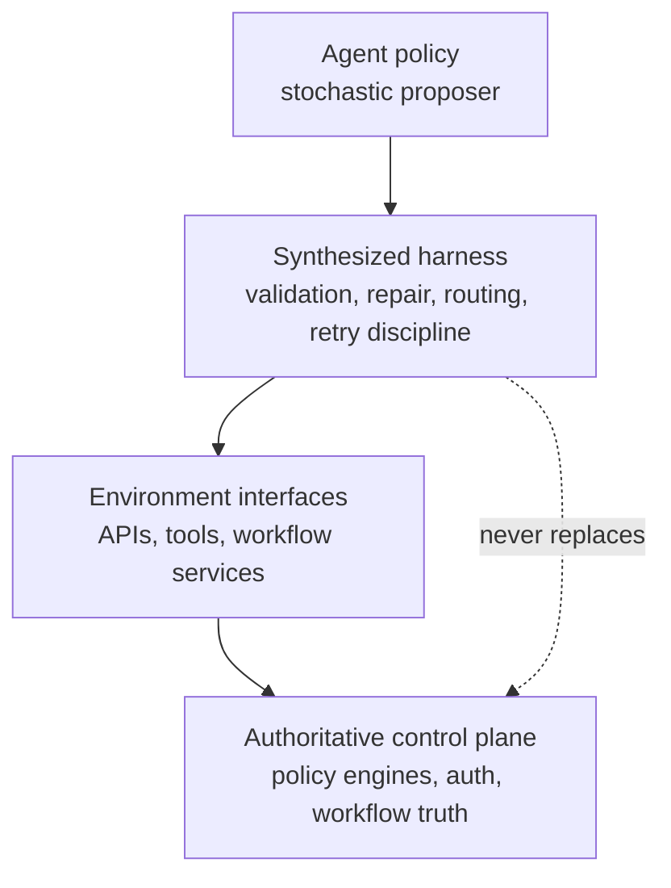
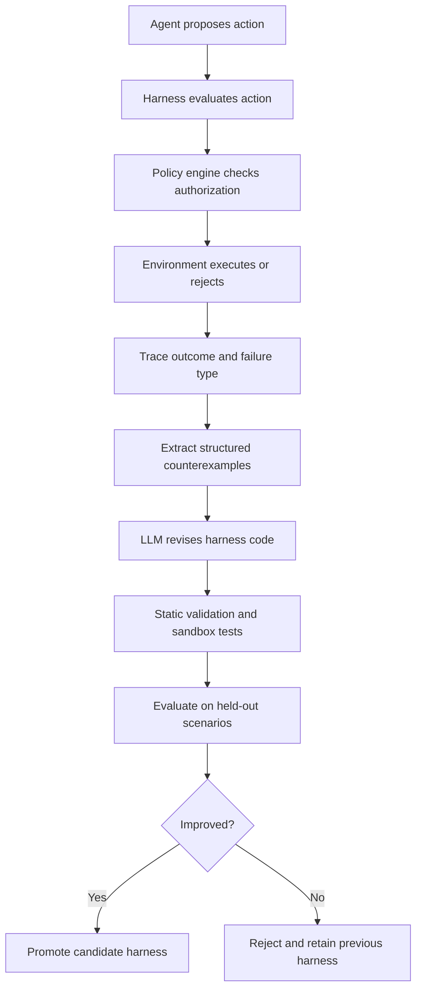
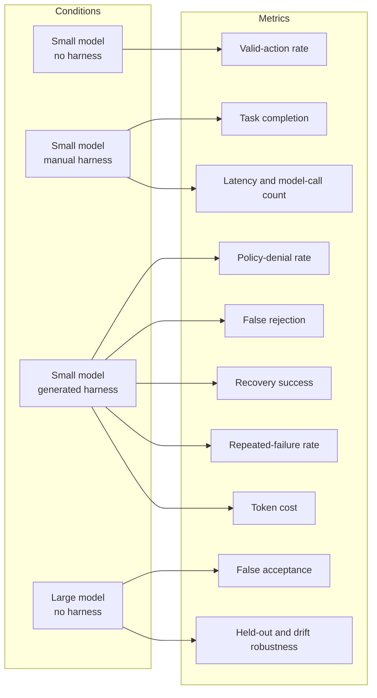
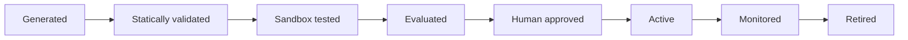

# Automatic Harness Synthesis for Enterprise Agents

*Automatic harness synthesis treats repeated agent failures as raw material for deterministic control code. The core claim is narrow: in structured environments with dense, machine-checkable feedback, an LLM-generated harness can improve execution reliability without becoming the source of business authority. This matters for enterprise agents because many costly failures are not failures of general intelligence, but failures of action validity, sequencing, recovery, and control.*

## Core thesis

Repeated execution failures can help synthesize deterministic control layers around probabilistic agents.

That claim is conditional, not universal. It is most credible when the environment provides dense, machine-checkable feedback: invalid action flags, schema errors, state-transition failures, policy denials, exceptions, test failures, and explicit success conditions. It is less credible when feedback is ambiguous, delayed, adversarial, or normatively contested.

The practical implication is narrow but useful. Automatic harness synthesis is more plausible for structured enterprise workflows than for open-ended judgment. Expense approvals, support workflows, and deployment systems expose enough state and failure structure to make harness learning useful. They do not expose enough moral or organizational certainty to let the harness become the authority.

A harness can learn execution discipline. It should not become the source of business truth.

## Why this matters

Enterprise agents do not fail only by saying the wrong thing. They also fail by doing the wrong kind of thing at the wrong time.

Common failures are operational:

- calling tools with malformed arguments
- acting before a workflow reaches the required state
- retrying after a policy denial as if denial were transient
- omitting required fields
- invoking irreversible operations without enough context
- confusing what looks operationally possible with what is actually authorized

The standard response is to use larger models, longer prompts, more examples, or better tool descriptions. Those interventions help, but they do not change the structure of the problem. A probabilistic model still operates directly against an environment with schemas, state transitions, authorization boundaries, and side effects.

That is why the AutoHarness result matters. The work does not primarily optimize prompts or model weights. It searches over code that surrounds the model. That shift is the important part. The target artifact is not a better sentence, but a better control layer.

This result fits a broader pattern in agent research. ReAct, Reflexion, Self-Refine, Code as Policies, Voyager, and Eureka all point toward the same architectural lesson: outer structure can matter as much as model capability. More recent scaffold and harness work makes that point more explicit. In many settings, the relevant unit of evaluation is the model-plus-harness configuration, not the model in isolation.

## Mechanism and architectural model

A useful enterprise-agent architecture has four layers:

The distinction between these layers is the main architectural point.

The agent proposes actions. The harness evaluates operational applicability. It can normalize observations, validate fields, reject malformed outputs, repair common mistakes, enforce ordering, or prevent repeated invalid retries. Environment interfaces expose the systems the agent interacts with. The authoritative control plane keeps final authority through policy engines, workflow engines, permission checks, and transactional invariants.

This separation matters because enterprise reliability and enterprise authority are different problems.

A synthesized harness may learn that an expense cannot be approved before submission. It may learn that a deployment cannot start before artifact validation. It may learn that refund handling requires certain fields and sequencing. But it must not decide who may approve the expense, whether the refund is permitted, or whether the deployment is authorized.

A useful invariant is simple:

**Harness acceptance never implies policy authorization.**

### The synthesis loop

The mechanism is straightforward. The system runs the agent, captures failures, turns those failures into structured counterexamples, and asks an LLM to revise the harness code.

What the harness learns is narrower than what the agent tries to do. It does not need to understand the full business domain. It needs to reduce repeated operational failures around action validity, recovery, and execution order.

That narrower scope is what makes the approach plausible.

## Where the approach applies

This pattern fits environments with explicit contracts and reliable feedback. It is most useful where failures can be observed, classified, and converted into candidate control logic.

Good candidates include:

- workflows with explicit state machines
- tools with strict schemas and argument validation
- environments with policy denials that are machine-readable
- systems with clear success and failure signals
- operational domains where recovery paths can be encoded deterministically

Poor candidates include:

- authorization decisions themselves
- legal interpretation
- medical diagnosis
- high-stakes financial judgment
- ambiguous compliance review
- any domain where feedback is delayed, contested, or hard to verify mechanically

The boundary matters. Automatic harness synthesis is a method for improving execution discipline in structured environments. It is not a general solution for contested judgment.

## What should be measured

Task success alone is not enough. A harness can appear effective by refusing too many actions, overfitting to visible scenarios, or hard-coding accidental constraints. A credible evaluation compares multiple system configurations and tracks both reliability and cost.

The most important pair is false acceptance and false rejection. A permissive harness can look useful while letting bad actions through. A conservative harness can look safe while blocking valid work. A good harness improves execution validity without becoming a refusal machine.

## Concrete examples

### Expense approval

Expense systems have request states, approval thresholds, receipt requirements, approver roles, reimbursement rules, and escalation paths. An agent may fail by approving too early, submitting malformed data, ignoring required receipt fields, or escalating along the wrong path.

A harness can learn state-sensitive validity rules and simple repairs:

- reject approval attempts before submission
- require receipt metadata before progressing
- normalize malformed action payloads
- escalate when required fields cannot be inferred safely

The policy engine still decides whether the specific user is authorized to approve the expense.

### Customer-support workflows

Support systems expose ticket states, customer records, refund policies, priority levels, assignment queues, and escalation constraints. An agent may fail by resolving unresolved tickets, issuing refunds without required checks, assigning to the wrong queue, or failing to escalate ambiguous cases.

A harness can learn:

- required field checks before refund actions
- correct sequencing between assignment, investigation, and resolution
- recovery behavior after policy denial or missing context
- routing rules for specialist escalation

It should not become the source of refund policy.

### Software deployment

Deployment systems are a strong fit because their feedback is usually crisp: artifact-validation errors, missing approvals, state conflicts, health-check failures, rollback signals, and explicit release states.

An agent may fail by starting before approval, deploying invalid artifacts, retrying unsafe operations, or failing to roll back after a failed release. A harness can reduce these failures by enforcing ordering, rejecting malformed deploy actions, and standardizing recovery paths.

This is the kind of domain where deterministic control around a probabilistic planner is often more valuable than a marginally stronger planner acting alone.

## Trade-offs and failure modes

Automatic harness synthesis has real risks.

### Evaluator overfitting

This is the familiar program-repair problem in a new form. A generated harness can pass the available tests while still encoding the wrong invariant.

### Specification gaming

If evaluation over-rewards legal-looking actions, the harness may maximize apparent legality while sacrificing progress. The system can become more compliant-looking and less useful.

### False confidence from deterministic code

Generated Python can feel safer than generated text because it is inspectable. But inspectable code can still be wrong. Deterministic does not mean correct.

### Constraint fossilization

A temporary schema quirk, policy denial, or environment bug can harden into a durable rule in the harness. This risk is especially high in enterprise systems, where policies and schemas change.

### Rule accretion

Local repairs can accumulate into an opaque layer of exceptions. The harness becomes harder to understand, maintain, and audit.

### Authority leakage

This is the most serious failure mode. If the harness starts deciding what is allowed instead of what is operationally applicable, it becomes an ungoverned policy engine.

### Domain limits

This approach fits environments with explicit contracts and reliable feedback. It is a poor fit for authorization decisions themselves, legal interpretation, medical diagnosis, high-stakes financial judgment, ambiguous compliance review, or any domain where the feedback loop is delayed or contested.

## Harness lifecycle and governance

A synthesized harness should be governed like software, not treated like a byproduct of model execution.

Each state has a concrete purpose:

- **Generated** means the code came from the synthesis loop.
- **Statically validated** means syntax, type, import, API-contract, and safety checks passed.
- **Sandbox tested** means the code ran under explicit capability limits.
- **Evaluated** means it was tested on nominal, held-out, mutated, and adversarial scenarios.
- **Human approved** means promotion depends on review, not only metric improvement.
- **Active** means the harness is in the execution path.
- **Monitored** means traces are checked for drift, policy conflicts, false rejections, and repeated failures.
- **Retired** means stale harnesses are removed when workflows, schemas, or policies change.

This is where enterprise discipline matters. Generated harnesses need provenance, versioning, rollback, reproducibility, and promotion gates. They should not mutate silently in production.

## Practical takeaways

1. **Treat harnesses as a separate optimization target.** Do not assume that all reliability gains must come from better prompts or larger models.
2. **Keep authority external.** Let the harness improve execution discipline, but preserve final authorization in explicit control systems.
3. **Evaluate more than task success.** Track false acceptance, false rejection, recovery behavior, repeated-failure rate, and drift robustness.
4. **Use simulation first.** Structured simulated environments are the right place to collect failures, counterexamples, and candidate harnesses safely.
5. **Govern generated code like a software artifact.** Sandbox it, version it, review it, and retire it when assumptions change.

## Positioning note

This is not academic research in the strict sense. The goal here is not a general theory of agent self-improvement or a new benchmark claim. The useful question is narrower: under what operational conditions does synthesized control code improve an agent system?

It is also not a blog-style opinion piece. The argument depends on concrete architecture boundaries, measurable failure types, and evaluation discipline.

It is not vendor documentation either. Vendor documentation usually describes a supported product surface and intended usage. This note is about an architectural pattern, where it plausibly works, and where it should remain constrained.

## Status and scope disclaimer

This is exploratory lab work, not a validated production blueprint.

The argument is based on the AutoHarness result, adjacent scaffold research, and the design of an open-source proof-of-concept, Enterprise AutoHarness Lab. The intended contribution is architectural clarity and a testable research direction. It does not claim production safety, compliance correctness, robustness against all adversarial behavior, or suitability for irreversible high-stakes decisions.

The scope is deliberately narrow: structured enterprise simulations in which repeated failures can be observed, classified, and turned into candidate control logic while final authority remains outside the harness.

## References

- AutoHarness: Improving LLM Agents by Automatically Synthesizing a Code Harness
- Enterprise AutoHarness Lab
- ReAct: Synergizing Reasoning and Acting in Language Models
- Reflexion: Language Agents with Verbal Reinforcement Learning
- Self-Refine: Iterative Refinement with Self-Feedback
- Code as Policies: Language Model Programs for Embodied Control
- Voyager: An Open-Ended Embodied Agent with Large Language Models
- Eureka: Human-Level Reward Design via Coding Large Language Models
- Meta-Harness: An Adaptive Meta-Harness for Reliable LLM Applications
- Harness-Bench: Evaluating LLM-Harness Pairs
- τ-bench: A Benchmark for Tool-Agent-User Interaction in Real-World Domains
- CRMArena: Understanding the Capacity of LLM Agents to Perform Professional CRM Tasks
- Program Synthesis
- FlashFill: Programming by Example
- DeepCoder: Learning to Write Programs
- Execution-Guided Neural Program Decoding
- Patch Overfitting in Program Repair
- Runtime Verification
- Enforceable Security Policies
- Shields for Safe Reinforcement Learning
- Zanzibar: Google's Consistent, Global Authorization System
- Cedar Policy Language
- How We Built Cedar with Formal Methods
- Open Policy Agent Documentation
- SLSA: Supply-chain Levels for Software Artifacts
- in-toto: Providing Farm-to-Table Guarantees for Bits and Bytes
- NIST Secure Software Development Framework
- "The purpose of computing is insight, not numbers." - Richard Hamming
