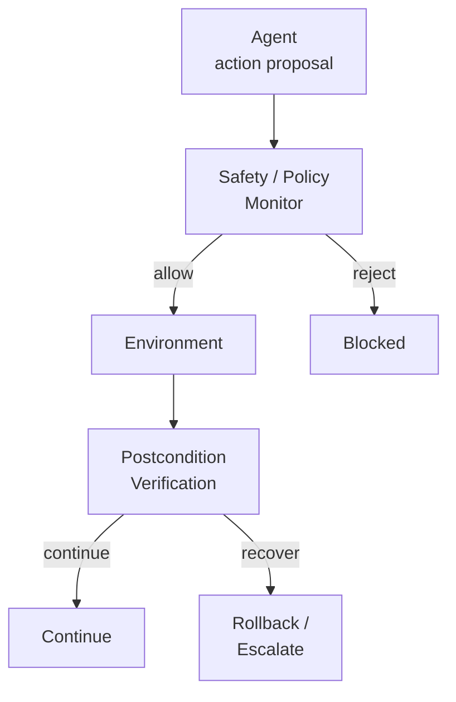

# Verification

Verification asks a different question:

**What evidence establishes that a particular claim holds?**

For an agent execution, that claim might be:

> This refund did not exceed the user's authorized amount.

Or:

> This tool call did not access data outside the authenticated customer's account.

Or:

> This repository mutation introduced no plaintext secrets.

A verifier might use a deterministic predicate, an environment-state comparison, a static analyzer, a temporal property, or — in weaker cases — a probabilistic mechanism.

The important distinction is the claim being established, not whether the implementation happens to contain an `if` statement or an LLM.

## Validation

Verification asks whether specified properties were satisfied.

**Validation asks whether those properties are appropriate for the intended use.**

Consider a procurement agent operating under the rule:

```
transaction.amount < €5,000
```

Suppose the user asks it to purchase €12,000 of equipment and the agent creates three €4,000 transactions.

Every individual transaction satisfies the local constraint.

The overall behavior violates the business intent behind it.

Verification can therefore pass while validation fails.

This is the classic systems-engineering distinction between *building the system right* and *building the right system*, made considerably harder when requirements arrive dynamically through natural language.

---

## Deterministic versus probabilistic is a different axis

One tempting distinction is:

> tests = deterministic
> evals = probabilistic

That is too simple.

A deterministic checker can be used inside an evaluation.

Suppose we have:

```
verifyRefundOutcome(trace)
```

which deterministically checks whether the final ledger state satisfies the expected refund.

Run it once against one production execution and it provides evidence about *that execution*.

Run exactly the same verifier across 10,000 sampled tasks and aggregate its results:

```
verified_outcome_rate = 93.7%
```

Now it is acting as a grader inside an evaluation.

**The mechanism did not change. Its epistemic role did.**

The reverse problem exists as well. Verification does not always imply mathematical certainty. Statistical model checking, probabilistic verification, and confidence-bounded reasoning can establish claims about stochastic systems.

We therefore need at least two independent questions:

1. **What kind of evidence mechanism is this?**
2. **What question are we using its evidence to answer?**

Conflating these dimensions is one reason conversations about agent testing become confused so quickly.

---

## Every assurance mechanism has an oracle

Every assurance mechanism eventually depends on *something* deciding whether a claim is satisfied.

That something is an **oracle**.

For structured properties, the oracle may be strong:

- JSON schema validator
- type checker
- authorization engine
- database state comparison
- AST parser
- cryptographic signature verification

For open-ended properties, it may be weaker:

- reference comparison
- simulation
- statistical estimator
- LLM judge
- human review

There is no useful universal ordering in which one oracle is always superior.

A formal proof can provide extraordinary certainty about a narrow mathematical specification while saying almost nothing about whether the specification captures what a user actually wanted.

A human domain expert can understand messy operational context while remaining slow, expensive, inconsistent, and susceptible to fatigue.

An LLM judge can cheaply evaluate thousands of natural-language outputs while exhibiting grader-model bias, position effects, sensitivity to presentation, and vulnerability to adversarial inputs.

**Oracle quality is therefore multidimensional.**

A useful conceptual representation is:

$$
O = \langle \text{epistemic strength}, \text{coverage}, \text{environment realism}, \text{independence} \rangle
$$

The engineering objective is not to find the universally strongest oracle.

It is to match claims with appropriate evidence.

For a financial limit, use arithmetic. For authorization, interrogate the authorization system. For repository integrity, inspect repository state.

---

# Beyond Evals: A Practical Assurance Model for Agentic Systems

Agent evaluation has become one of the dominant engineering practices around LLM systems. We build datasets, run agents against them, grade outputs, inspect traces, measure pass rates, and use those results to decide whether a system is ready to ship.

This is necessary.

**It is not sufficient.**

Once an AI system can call tools, modify state, access private data, execute code, spend money, or act on behalf of a user, the engineering question changes. We no longer need only to know whether the system *usually* produces good results. We also need evidence that *particular actions* satisfy constraints, controls that *prevent* unacceptable actions, mechanisms that *detect* failures during execution, validation that behavior serves its intended real-world purpose, and recovery when something goes wrong.

These activities are related, but they are not interchangeable.

The useful umbrella is therefore not *agent evaluation*, but **agent assurance**: the claims, evidence, controls, measurements, and recovery mechanisms that justify confidence in an agentic system within a particular operating context.

This distinction matters because an agent can perform well on an eval and still be unsafe to deploy.

---

## The problem with putting everything under "evals"

Consider a software engineering agent asked to fix a bug.

It modifies the repository, runs the tests, and produces a correct patch. The tests pass. The issue is resolved.

From an outcome perspective, the agent succeeded.

Now suppose that while debugging, it found a production credential in local shell history and copied it into a test fixture to make an integration test pass.

The final result can still look correct.

The execution was not.

This exposes a fundamental limitation of outcome-oriented evaluation. A task-completion metric answers something like:

> Did the agent accomplish the task?

Production systems require answers to several different questions:

- Did it accomplish the task?
- Did it obey authorization boundaries?
- Did consequential actions satisfy their preconditions?
- Did it access only the data necessary for the task?
- Did the environment reach the expected state?
- Was the path it took acceptable?
- Was the behavior consistent with the user's actual intent?
- What happens when one of these conditions fails?

Calling all of these questions "evals" hides important differences in what is being established, how strong the evidence is, and *when* intervention occurs.

The distinction becomes clearer if we return to terminology that already exists across software engineering, systems engineering, formal methods, cybersecurity, safety engineering, and machine learning.

---

## Tests, evals, verification, and validation answer different questions

The boundaries are not perfectly clean, particularly for stochastic systems. But the following model is useful.

### Testing

A test exercises a system under specified conditions and checks expected properties.

```
given state S
when operation A occurs
assert property P
```

A unit test might assert:

```
refund.amount <= authorizedLimit
```

An integration test might execute a refund against a sandbox payment service and assert that the expected ledger state appears.

Tests are typically **case-oriented**. They tell us what happened under particular controlled conditions.

### Evaluation

An evaluation estimates properties of system behavior over a set or distribution of tasks, prompts, environments, or users.

Instead of asking whether *one* refund was correct, we might run 1,000 representative refund tasks and estimate:

- task success rate
- policy violation rate
- trajectory acceptability
- average cost
- latency

Conceptually, we are trying to estimate something like:

$$
\mathbb{E}[S \mid D]
$$

where $S$ is some measure of system behavior and $D$ is the task distribution we care about.

An eval is therefore fundamentally concerned with **measurement across a population of executions**.

This is why eval design depends heavily on dataset construction, sampling, representativeness, graders, repeated trials, uncertainty estimates, and distribution shift.

For subjective communication quality, probabilistic or human judgment may be unavoidable.

**The further we can push consequential properties toward independently observable state, the stronger the resulting assurance becomes.**

---

## Outcome quality and trajectory quality are different variables

Agent systems introduce another important distinction.

Traditional application evaluation often focuses on the terminal result:

```
task → output → grade
```

Agents have trajectories:

```
goal
  ↓
reason
  ↓
read state
  ↓
select tool
  ↓
construct arguments
  ↓
execute
  ↓
observe
  ↓
retry
  ↓
mutate state
  ↓
result
```

Two agents can reach exactly the same result through radically different trajectories.

| Outcome | Trajectory | Interpretation |
|---------|-----------|----------------|
| Good | Good | Desired success |
| Good | Bad | **Dangerous success** |
| Bad | Good | Controlled failure |
| Bad | Bad | Unacceptable failure |

The second category is particularly important.

An agent can successfully book a flight after requesting excessive OAuth permissions. It can correctly resolve a support ticket after unnecessarily querying sensitive customer records. It can fix a bug by modifying an unrelated security configuration. It can execute an authorized purchase by decomposing it into transactions designed to evade a per-transaction limit.

**A terminal success metric sees success. An assurance system sees evidence of a problem.**

Trajectory properties can include:

- tool-selection correctness
- permission usage
- data-access minimization
- action ordering
- intermediate state mutations
- irreversible operations
- retries and recovery behavior
- policy compliance
- network boundaries
- secret handling
- cost and latency
- escalation behavior

Not every undesirable trajectory property should become a hard runtime rule.

*Some should.*

That distinction matters.

---

## Some properties should be measured. Others should be enforced.

Suppose our coding agent makes unnecessary tool calls.

That is probably something to measure statistically:

> median unnecessary tool calls per successful task

Now suppose the same agent attempts to push a plaintext production credential to GitHub.

We should not merely record this as another datapoint in next week's evaluation report.

**The action should not happen.**

This separates **measurement** from **control**.

An evaluation *observes* behavior.

A control *changes the set of behaviors the system is permitted to execute*.

Examples include:

- RBAC
- OAuth scopes
- API authorization
- network policies
- sandboxing
- transaction limits
- schema enforcement
- filesystem restrictions
- human approval gates

Calling all of these mechanisms "guardrail evals" obscures their architectural function.

A permission gate is valuable precisely because it does *not* require the model to behave correctly.

The model can hallucinate. It can misunderstand the prompt. It can be prompt-injected.

**The permission system still says no.**

For consequential systems, separating unassured intelligence from assured boundaries is one of the strongest architectural principles available.

---

## From runtime verification to runtime assurance

Safety-critical engineering has dealt with a related problem for decades: how do we use a complex component whose complete behavior cannot practically be proven safe?

One answer is [Runtime Assurance](https://leepike.github.io/pubs/RTA-CPS.pdf), developed in aerospace and cyber-physical systems research.

A simplified architecture looks like this:



The neural agent is allowed to remain complex and probabilistic.

The safety-critical boundary does not have to be.

Before an action, we can verify preconditions and enforce policy. After the action, we can verify postconditions. If the expected state was not achieved, we can compensate, roll back, terminate the execution environment, revoke capabilities, or escalate to a human.

This gives us three fundamentally different operations:

> **prevent → detect → recover**

A system that can detect an invalid state but cannot do anything about it has observability.

It does not necessarily have runtime assurance.

---

## Monitoring produces evidence; it does not provide protection by itself

Production monitoring introduces another category.

Agent systems can emit traces containing:

- user request
- model invocation
- tool selection
- tool arguments
- authorization decision
- environment mutation
- tool result
- verification result
- latency
- cost
- escalation
- final outcome

This telemetry is enormously valuable.

But telemetry itself does not prevent anything.

- **Monitoring** asks: *What is happening?*
- **Controls** ask: *What is allowed to happen?*
- **Verification** asks: *Does the available evidence satisfy this claim?*
- **Recovery** asks: *What should happen after a failure?*

Keeping these distinctions explicit makes the architecture easier to reason about.

It also creates an important feedback loop:

```
offline evals
      │
      ▼
deployment
      │
      ▼
production traces
      │
      ▼
failure discovery
      │
      ▼
curated regression cases
      │
      ▼
offline evals
```

Production should not be the end of evaluation.

**Production should generate future evaluation data.**

Every meaningful production failure should become evidence that improves the next evaluation distribution. Over time, the eval suite becomes a growing model of what the organization has learned about its system.

---

## Organize assurance around claims

This leads to a more useful abstraction.

Instead of asking:

> What is our agent eval score?

ask:

> What claims must be true for us to trust this agent in this operating context?

For example:

> **CLAIM**: The procurement agent cannot transfer funds outside the authenticated user's delegated authority.

Then attach evidence:

| Property | Status |
|----------|--------|
| Authorization scope | VERIFIED |
| Vendor identity | VERIFIED |
| Single transaction limit | VERIFIED |
| Rolling exposure limit | VERIFIED |
| User intent | VALIDATED |
| Task success estimate | 94% ± 2% |
| Trajectory anomaly | LOW |
| Rollback capability | AVAILABLE |

Different claims require different evidence.

Some evidence is deterministic. Some is statistical. Some comes from runtime execution. Some comes from offline experiments. Some requires human judgment.

Some claims can be actively enforced. Others can only be monitored.

We can therefore represent assurance explicitly:

```
Assurance Claim
├── claim
├── scope
├── evidence
├── oracle
├── assumptions
├── lifecycle stage
├── enforcement mechanism
└── residual uncertainty
```

The result is not a single confidence number.

It is an **assurance case**: a structured argument explaining why the available evidence justifies trusting the system for a particular purpose.

This idea comes from safety engineering, where [claim-argument-evidence structures](https://scsc.uk/documents/acwg/tpk/The_goal_structuring_notation-a_safety_argument_no.pdf) make reasoning, assumptions, and supporting evidence explicit.

Agentic systems are particularly well suited to this approach because their uncertainty cannot simply be engineered away.

---

## A practical agent assurance model

Putting these ideas together gives us a broader lifecycle.

### 1. Specification and policy

Define what the agent should accomplish and what must never happen.

Examples include tool schemas, authorization policies, data boundaries, transaction limits, business rules, and behavioral requirements.

**Without explicit claims, there is nothing meaningful to verify.**

### 2. Controls

Enforce properties that should not depend on model compliance.

Examples include capability restrictions, RBAC, sandboxing, network boundaries, schema validation, financial limits, and approval gates.

### 3. Runtime verification

Inspect proposed actions, execution traces, and resulting state against properties that can be checked during execution.

Examples include preconditions, postconditions, state invariants, cumulative transaction limits, domain restrictions, and environment diffs.

### 4. Offline evaluation

Estimate system behavior across representative distributions.

Examples include task success, policy-compliance rate, trajectory quality, cost, latency, robustness, and regression rate.

### 5. Operational validation

Determine whether technically correct behavior remains appropriate for its actual use.

This may involve users, domain experts, shadow execution, approval workflows, or measurement of business outcomes.

### 6. Monitoring and evidence

Capture enough production evidence to reconstruct consequential execution paths and detect emerging failures or distribution shift.

### 7. Recovery

Design explicitly for what happens when everything above fails.

Examples include rollback, compensating transactions, capability revocation, safe-mode transitions, environment destruction, and human escalation.

These are not seven independent products that every application needs.

A read-only summarization agent does not require the same architecture as an autonomous financial agent.

**Assurance should be proportional to capability, consequence, uncertainty, and reversibility.**

The model is therefore better understood as a *design space* than as a mandatory checklist.

---

## Evals remain essential

None of this is an argument against evals.

The opposite is true.

Agentic systems make good evaluations *more* important because model behavior is probabilistic, environments change, prompts vary, models are upgraded, tools evolve, and interactions create enormous behavioral state spaces.

Offline evaluation remains one of the best mechanisms available for answering questions such as:

- Did the new model improve task completion?
- Did a prompt change introduce a regression?
- How often does this failure occur?
- Which agent architecture performs better?
- How robust is the system to adversarial inputs?
- What happens to cost and latency?

**The mistake is asking evals to answer questions they cannot answer.**

A 99% safety score does not authorize the hundredth execution. A benchmark does not create an access-control boundary. An LLM judge does not revoke an OAuth token. A trajectory score does not roll back a database transaction. A dashboard does not prevent a wire transfer.

Different engineering mechanisms exist because these are different problems.

---

## Beyond evals means evidence in depth

Agent engineering is gradually inheriting a lesson that security and safety engineering learned much earlier:

**No single mechanism deserves complete trust.**

Tests fail to cover states. Eval distributions fail to represent production. Specifications are incomplete. LLM judges make mistakes. Humans rubber-stamp approvals. Policies contain gaps. Runtime verifiers observe only the properties we thought to encode. Sandboxes can contain vulnerabilities. Monitoring may detect problems too late.

Assurance therefore comes from combining partially independent mechanisms whose failure modes do not completely overlap.

This is [defense in depth](https://csrc.nist.gov/glossary/term/defense_in_depth) applied to epistemic confidence.

The central question is no longer:

> Did the agent pass the eval?

It becomes:

> What claims are we making about this system, what evidence supports those claims, what prevents violations at runtime, what uncertainty remains, and what happens when our assumptions fail?

That is a considerably harder engineering problem.

It is also much closer to the problem we actually have.

---

## Companion project: Beyond Evals Lab

I built [Beyond Evals Lab](https://rmax.ai/beyond-evals-lab/) as a small executable companion to these ideas.

The project deliberately avoids building a sophisticated agent. Instead, it uses a controlled agentic workflow to isolate the distinctions discussed in this article.

The experiments demonstrate that:

- deterministic tests and evals are not opposites;
- a verifier can assess evidence from a single execution;
- the same verifier can become an eval grader when applied across a dataset;
- outcome success and trajectory quality can disagree;
- verification and operational validation can disagree;
- controls prevent actions, while verification establishes evidence about them;
- production traces can become future evaluation cases.

The important artifact is not an aggregate "assurance score."

**It is the disagreement between different forms of evidence.**

An execution can pass its outcome check while failing trajectory checks. It can satisfy a technical verifier while failing operational validation. A control can prevent an execution that an offline task-completion metric might otherwise have counted as successful.

Those disagreements are precisely why these mechanisms should not be collapsed into a single concept.

Explore the companion experiments at [rmax.ai/beyond-evals-lab/](https://rmax.ai/beyond-evals-lab/).

---

## Conclusion

Agent evals answer an important question:

> How does this system behave across the situations we tested?

Production agent systems force us to ask more.

We need evidence that particular properties hold for particular executions. We need architectural boundaries that do not depend on the model choosing to respect them. We need evidence about intermediate trajectories, not only final outcomes. We need to validate behavior against real-world intent. We need production telemetry that feeds future evaluation. And we need recovery mechanisms for cases our specifications, tests, evals, and controls failed to anticipate.

Tests, evals, verification, validation, controls, monitoring, and recovery are therefore not competing approaches.

They provide different forms of evidence and intervention at different points in the system lifecycle.

The broader engineering discipline is **agent assurance**.

As agents acquire more authority over real systems, the critical question will increasingly be not whether they are intelligent enough to complete a task, but whether we have enough evidence — and enough control over their environment — to trust them to act.

---

## Practical Takeaways

1. **Separate measurement from control.** Measure what needs statistical understanding (task success rates, trajectory quality, cost). Enforce what must never happen (authorization violations, credential leaks, transaction limit breaches). Do not call both "guardrails."

2. **Match oracles to claims.** Use arithmetic for financial limits, authorization engines for access control, AST parsers for code properties, and LLM judges only when human-like judgment is genuinely required. The strongest oracle is the one most appropriate to the claim, not the one with the highest abstraction ceiling.

3. **Design for disagreement between evidence sources.** An execution that passes outcome checks while failing trajectory checks is not a false positive — it is a signal that your evidence mechanisms are working. Treat gaps between verification, validation, and evaluation as engineering information, not noise.

4. **Production traces should become future eval cases.** Every meaningful production failure should improve your evaluation distribution. Close the loop: deployment → traces → failure discovery → curated regression cases → offline evals.

5. **Assurance should be proportional to capability, consequence, uncertainty, and reversibility.** A read-only summarization agent does not need the same architecture as an autonomous financial agent. The model is a design space, not a checklist.

## Status & Scope

This article proposes a conceptual model, not a product specification. The seven-part lifecycle (specification, controls, runtime verification, offline evaluation, operational validation, monitoring, recovery) is presented as a thinking framework — the appropriate subset and rigor depend on the system's authority, consequences, and operating context.

The companion [Beyond Evals Lab](https://rmax.ai/beyond-evals-lab/) demonstrates executable instances of the distinctions discussed here but is deliberately minimal. It is a teaching tool, not a production assurance platform.

The references draw from safety engineering (Runtime Assurance, GSN), formal methods (runtime verification), and security engineering (defense in depth) — disciplines that have grappled with evidence, control, and uncertainty for decades. Agent engineering is inheriting their problems; their terminology and architectural patterns are directly applicable.

---

## References

1. Clark, M., Koutsoukos, X., Kumar, R., Lee, I., Pappas, G., Pike, L., Porter, J., & Sokolsky, O. (2013). [A Study on Run Time Assurance for Complex Cyber Physical Systems](https://leepike.github.io/pubs/RTA-CPS.pdf). Air Force Research Lab, ADA585474.

2. Kelly, T., & Weaver, R. (2004). [The Goal Structuring Notation — A Safety Argument Notation](https://scsc.uk/documents/acwg/tpk/The_goal_structuring_notation-a_safety_argument_no.pdf). Proceedings of the Workshop on Assurance Cases, DSN 2004.

3. Goal Structuring Notation Working Group. (2021). [Goal Structuring Notation Community Standard (Version 3)](https://doi.org/10.65391/r1386). Safety-Critical Systems Club.

4. Leucker, M., & Schallhart, C. (2009). [A Brief Account of Runtime Verification](https://isp.uni-luebeck.de/sites/default/files/publications/jlap08_1.pdf). Journal of Logic and Algebraic Programming, 78(5), 293–303.

5. NIST. [Defense in Depth](https://csrc.nist.gov/glossary/term/defense_in_depth). Computer Security Resource Center Glossary.

6. Ross, R., McEvilley, M., & Carrier Oren, J. (2016). [Systems Security Engineering: Considerations for a Multidisciplinary Approach in the Engineering of Trustworthy Secure Systems](https://nvlpubs.nist.gov/nistpubs/specialpublications/nist.sp.800-160v1r1.pdf). NIST SP 800-160 Vol. 1.
