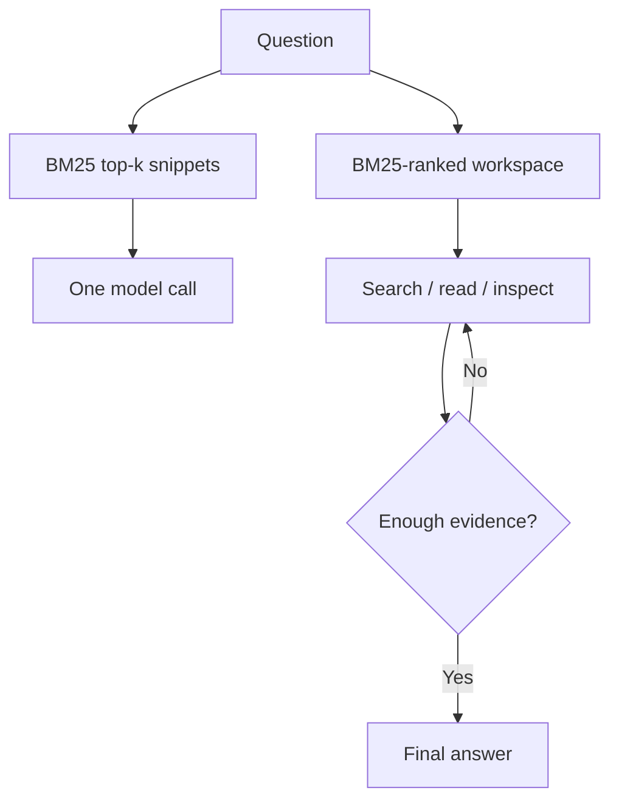

# BM25 Did Not Come Back. The Query Changed.

**Dense retrieval was designed to repair the ambiguity of human search. Agent systems increasingly generate a different workload: explicit, iterative and rich in exact identifiers. The interesting question is no longer whether BM25 beats embeddings in isolation, but how retrieval behaves inside an agent harness.**

BM25 is often described as an old baseline: cheap, reliable and useful, but conceptually superseded by dense embeddings.

That story is too simple.

The canonical account of BM25 dates to the probabilistic relevance framework developed before modern neural retrieval. Its core mechanisms—rare-term weighting, term-frequency saturation and document-length normalization—are well understood ([Robertson and Zaragoza, 2009](https://www.staff.city.ac.uk/~sbrp622/papers/foundations_bm25_review.pdf)). Dense retrievers later offered something BM25 fundamentally lacks: the ability to match semantically related language even when the query and document share few words.

For short human queries, that is a decisive advantage. A person may search for "card payment rejected abroad" while the relevant documentation says "cross-border authorization decline." Lexical retrieval sees different strings. A dense model can place them near each other in representation space.

But many retrieval calls inside an agent system are no longer written directly by a person.

They are generated by another model after it has decomposed a task, inspected an error, extracted an entity or formed a hypothesis. Instead of three ambiguous words, the retrieval layer may receive a function name, an error code, a product identifier, a quoted policy clause and a description of the relationship being investigated.

The algorithm did not change. The query distribution did.

This creates a plausible—but still insufficiently tested—hypothesis: **lexical retrieval becomes more competitive when the query issuer is a machine, especially when an agent can search repeatedly and inspect documents adaptively.**

## Dense retrieval solved a particular problem

The case for dense retrieval is strongest when vocabulary mismatch is the dominant failure mode.

Traditional search collections contain short and underspecified queries. Dense encoders transform queries and documents into vectors so that conceptual similarity can survive differences in wording. This is genuinely useful, not a historical mistake.

Yet dense retrieval also compresses an entire query into a fixed-size representation. That compression can blur distinctions that matter operationally: exact version numbers, negative conditions, namespace-qualified symbols, stack traces and several constraints expressed at once. This does not make dense vectors intrinsically bad. It means their strengths and failure modes depend on the input distribution.

BM25 makes the opposite trade-off. It cannot infer that two unrelated strings express the same idea, but it is unusually good at rewarding exact, discriminative terms. An identifier that occurs in one document and nowhere else receives high weight without needing to be represented semantically.

The broad empirical record already warns against declaring either paradigm universally superior. [BEIR](https://arxiv.org/abs/2104.08663) found BM25 to be a robust zero-shot baseline across heterogeneous datasets, while re-ranking and late-interaction methods achieved stronger average performance at higher computational cost. The result was not "BM25 wins." It was that generalization varies substantially across tasks, and simple lexical retrieval remains harder to displace than benchmark narratives imply.

Newer reasoning-intensive benchmarks complicate the picture further. [BRIGHT](https://arxiv.org/abs/2407.12883) shows that retrieval degrades sharply when finding the right documents requires reasoning rather than surface similarity. Explicit query reasoning improves results, but even strong retrievers remain weak. This suggests that some apparent retrieval failures are not merely failures of representation. They are failures to formulate and execute the search process.

## Machine queries are constructed, not merely typed

LLM systems can transform a user request before retrieval.

[Query2doc](https://arxiv.org/abs/2303.07678) generates a pseudo-document and appends it to the original query, improving both sparse and dense retrieval in the reported experiments. [HyDE](https://arxiv.org/abs/2212.10496) also generates a hypothetical document, then embeds it to locate a neighborhood of real documents. Although their downstream mechanisms differ, both methods demonstrate the same architectural point: the text submitted to a retriever can be synthesized rather than copied from the user.

This changes retrieval in several ways.

- The model can introduce terminology likely to occur in relevant documents.
- It can preserve exact entities extracted from logs, code or structured records.
- It can decompose one request into several narrower searches.
- It can revise a query after inspecting partial evidence.

The important shift is not simply that machine queries are longer. Length alone can add noise. The useful shift is that queries can become more explicit, more corpus-aware and more responsive to previous results.

That last property cannot be measured by evaluating one top-*k* retrieval call.

## The retriever is only one component of the retrieval system

Most retrieval comparisons treat the interface as fixed:

1. issue one query;
2. return the top-*k* chunks;
3. place those chunks in the model context;
4. produce an answer.

This design makes the first retrieval decision carry almost all the risk. If a required fact falls below the cutoff, the answering model cannot recover. Increasing *k* may improve recall, but it also consumes context and introduces distractors.

An agent can instead receive a navigable workspace. It may search for an identifier, inspect the relevant lines, follow a reference into a second file and stop when the evidence is sufficient. The same BM25 index can support both systems, but the harness exposes it differently.

The distinction is between **retrieval as context injection** and **retrieval as an interactive process**.

This is a harness-level hypothesis, not a claim about BM25 alone. A workspace may win because the model can make several retrieval attempts. It may lose because tool calls consume tokens, add latency or send the search down an unproductive path. Static snippets may be better when the task is simple or the initial ranking is already sufficient.

The comparison is meaningful only if those costs are controlled.

## The BM25 VFS ablation

The [BM25 VFS Workspace vs BM25 Snippet Ablation](https://github.com/rmax-ai/bm25-vfs-ablation) is a small research project designed to isolate this interface effect.

Both experimental conditions share the same corpus, BM25 index, chunking policy, model, task set, answer format and total token ceiling.

The first condition retrieves the top-ranked chunks and sends them to the model as static snippets in a single call.

The second exposes the corpus as a read-only virtual filesystem. The model receives compact candidate paths and can use bounded tools resembling `grep`, `read`, `cat` and `list`. It must pay for every tool argument, result and subsequent model turn from the same total token budget available to the snippet condition.

The default benchmark uses synthetic enterprise documents: service documentation, incidents, architecture decisions, ownership records, deployment histories and policies. Each question requires combining two to four facts, often from different files. Ground-truth fact spans and document identities are retained outside the model-visible text, making evidence access measurable rather than guessed after the fact.

The primary outcome is end-to-end task success. The experiment also records:

- initial BM25 recall for gold documents and chunks;
- final evidence coverage after navigation;
- citation accuracy;
- tool-call sequences and repeated or invalid calls;
- unique files and line ranges inspected;
- input, output and tool-result tokens;
- retrieval, tool and model latency;
- success per 1,000 tokens.

The primary comparison is paired by task and reports a bootstrap confidence interval and McNemar's test. The design also includes a controlled intervention that assigns maximum tool-call budgets of 0, 1, 2, 4, 8 or 12 calls.

That intervention matters. If successful VFS runs merely happen to contain more tool calls, the result is correlational: difficult tasks may both demand more calls and fail more often. Randomly assigning a call limit provides a stronger test of whether additional interaction actually changes outcomes.

As of this writing, the repository contains the experimental contract, the implementation of both harnesses and the experiment runner, and a passing offline test suite (hermetic, mocked model, no network), but no live-model benchmark result suitable for a publication claim. The project is evidence generation, not evidence theatre.

## What would count as evidence?

Several outcomes are plausible.

### 1. The workspace improves success at the same token budget

This would support the view that adaptive evidence acquisition matters beyond first-stage recall. The most interesting cases would be tasks where both conditions begin with similar recall but the VFS condition subsequently reaches more required facts.

It would not prove that BM25 is superior to dense retrieval. The experiment holds the retriever fixed and changes the interaction surface.

### 2. The workspace only wins with a larger effective budget

Then the benefit is not free. The practical question becomes whether the added success justifies the extra latency, orchestration and inference cost. A static snippet pipeline may remain preferable for high-volume or latency-sensitive workloads.

### 3. Tool-call limits produce an inverted U

Too few calls may prevent evidence recovery; too many may encourage wandering. If performance rises and then falls as the permitted call count increases, the important design variable is not "tools or no tools" but the amount of controlled search autonomy.

### 4. Static snippets perform equally well

That result would be valuable. It could mean the synthetic tasks are too easy, the initial BM25 ranking already exposes enough evidence, the model does not navigate effectively or a VFS adds ceremony without information. Each explanation suggests a different follow-up experiment.

### 5. Both conditions fail when initial lexical overlap is weak

This would expose the boundary of the design and motivate a third research stage—not a hidden change to the primary ablation—with dense or hybrid candidate generation held behind the same snippet and workspace interfaces.

## Conclusion

The retrieval debate is usually framed as an algorithm contest: sparse versus dense, keywords versus semantics, old versus new.

Agent systems weaken that framing.

Once a model can formulate queries, call tools, inspect partial results and revise its search, retrieval becomes a trajectory. Performance depends on the interaction among the query generator, index, tool interface, context budget, stopping policy and answer model.

Under that architecture, BM25 may occupy a different role from the one it held in web search. It is not required to understand the user's intent directly. The model can perform part of that translation first, then use lexical retrieval as a fast and inspectable constraint matcher over concrete language.

That may be why BM25 appears newly relevant. Not because information retrieval moved backward, but because the entity doing the searching changed.

The next step is measurement.

## Practical takeaways

The experiment is unfinished, but the design already suggests several engineering rules.

- **Evaluate retrieval on the queries your system actually issues.** Human benchmark queries are a poor proxy if production traffic consists of model-generated subqueries, copied error messages and iterative tool calls.
- **Separate retrieval recall from task success.** A system can retrieve every required document and still fail to combine the evidence—and can start with weak recall and recover through subsequent searches.
- **Treat the interface as an experimental variable.** Comparing BM25 with a vector database while simultaneously changing chunking, context size, tool access and prompts produces an architecture comparison that cannot explain its own result.
- **Match total budgets.** An iterative agent with eight model turns should not be compared casually with a one-call baseline; tool use consumes context, output tokens and time even when the local search operation itself is cheap.
- **Preserve exact-search paths even in dense systems.** Code symbols, policy identifiers, transaction references and version strings are not edge cases in enterprise software. They are often the shortest route to the evidence.

## Positioning note

This note reports exploratory work from a personal research lab. It is not a benchmark report: no measured results are presented, and nothing here is a product recommendation. Its central claim is a hypothesis about changing retrieval workloads, not an authoritative finding that BM25 generally outperforms dense retrieval. The linked ablation is intended to produce bounded evidence about one narrower question: whether an adaptive BM25-backed workspace improves multi-hop task success over static BM25 snippets under matched experimental conditions.

## Status and scope disclaimer

This is exploratory personal lab work: a hypothesis, a literature summary and an experimental design, not a measured result. As of publication, the companion repository contains an implementation and passing offline tests, but no live-model experiment has produced publishable outcomes; any performance expectations implied here remain untested until results are reported from the repository's own outputs. The literature summaries compress published benchmarks and retrieval research into a few paragraphs; query distributions, corpora, models and harness behavior differ across settings, and synthetic enterprise documents may not represent production traffic. Nothing here establishes that lexical retrieval generally beats dense retrieval, and nothing here is production guidance for any specific system.

## References and related work

**External**

1. Robertson & Zaragoza — [The Probabilistic Relevance Framework: BM25 and Beyond](https://www.staff.city.ac.uk/~sbrp622/papers/foundations_bm25_review.pdf) — *Foundations and Trends in Information Retrieval* 3(4), 2009.
2. Thakur et al. — [BEIR: A Heterogeneous Benchmark for Zero-shot Evaluation of Information Retrieval Models](https://arxiv.org/abs/2104.08663) — NeurIPS 2021 Datasets and Benchmarks Track.
3. Su et al. — [BRIGHT: A Realistic and Challenging Benchmark for Reasoning-Intensive Retrieval](https://arxiv.org/abs/2407.12883) — ICLR 2025.
4. Wang et al. — [Query2doc: Query Expansion with Large Language Models](https://arxiv.org/abs/2303.07678) — EMNLP 2023.
5. Gao et al. — [Precise Zero-Shot Dense Retrieval without Relevance Labels (HyDE)](https://arxiv.org/abs/2212.10496) — 2022.
6. rmax.ai — [BM25 VFS Workspace vs BM25 Snippet Ablation](https://github.com/rmax-ai/bm25-vfs-ablation) — 2026.

**Related on rmax.ai**

7. [Beyond RAG Memory: Treat Knowledge as Source Code and Retrieval as Compilation](/notes/knowledge-as-source-code/) — durable knowledge and retrieval as separate concerns.
8. [The Harness Is Becoming the Runtime](/notes/the-harness-is-becoming-the-runtime/) — the harness as the programmable boundary where models, tools, loops and policies meet.
9. [Stop Evaluating AI One Response at a Time](/notes/stop-evaluating-ai-one-response-at-a-time/) — trajectories, not responses, as the unit of evaluation.
