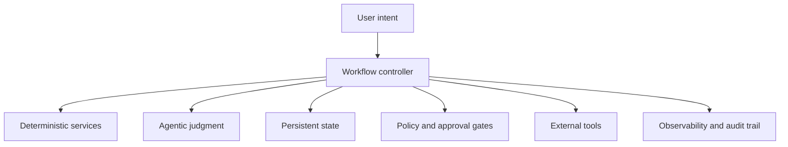
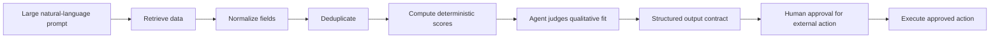
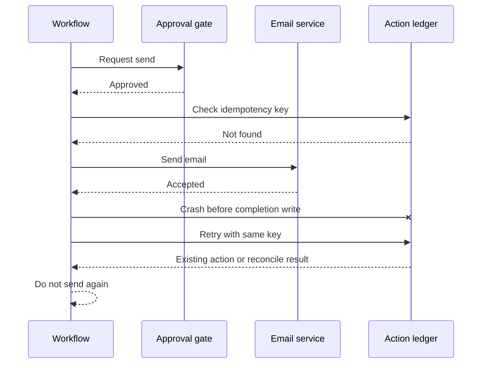

# Build Systems, Not Prompts: Software Engineering for Agentic AI

## Abstract

As coding agents improve, the hard part of software engineering does not disappear. It moves up a layer. The main operational challenge is no longer getting a model to produce plausible code or text. It is designing the surrounding system that constrains, verifies, and recovers from probabilistic behavior. This note argues that reliable agentic software depends on workflow design, typed contracts, persistent state, permission boundaries, and explicit approval paths, not on increasingly elaborate prompts. The practical consequence is simple: use code for determinism, agents for judgment, and humans for authority.

## Context & Motivation

Recent agent tooling makes it easy to confuse an impressive demo with a durable system. A capable model can now generate code, synthesize research, draft messages, call tools, and operate across long task chains. That shift changes where engineering effort creates the most value.

Angie Jones makes this point directly in *Build Systems, Not Code*: AI does not remove software engineering, it shifts engineering responsibility toward system structure, orchestration, memory, and control. [1] That framing aligns with a broader shift from prompt-centric thinking toward workflow and environment design. It also matches the distinction I have argued elsewhere between prompting a model and cultivating an execution environment around it. [3] [4]

The common failure mode is now straightforward. A team gives one agent a broad prompt, too much authority, weak state handling, and minimal verification. When the system becomes unstable, the team adds more instructions and hopes the prompt will compensate. The result is often a natural-language monolith that is hard to reason about, hard to test, and fragile under retries or adversarial input.

## Core Thesis

An agent is not an architecture. It is one probabilistic component inside a larger software system.

The engineering task is therefore not to perfect the prompt in isolation. It is to build a system that assigns the right work to deterministic code, bounded model judgment, and human approval, while making state, permissions, and recovery explicit. That is the practical center of modern agent design patterns, even when people describe it with different terms such as routing, planning, memory, guardrails, or human-in-the-loop control. [2]

A useful rule of thumb is:

> Use code for determinism, agents for judgment, and humans for authority.

That rule is simple, but it drives concrete design choices.

## Mechanism / Model

A useful mental model is to treat the workflow controller, not the agent, as the primary owner of execution.

*Figure 1. A minimal boundary model for an agentic workflow.*

In this model:

- **Deterministic services** handle work with precise correctness criteria, such as schema validation, ranking formulas, deduplication, and state transitions.
- **Agentic judgment** handles ambiguity, interpretation, summarization, and context-sensitive reasoning.
- **Persistent state** records what is currently true, independent of any single model session.
- **Policy and approval gates** decide what may happen next, and which actions require human sign-off.
- **External tools** expose capability through narrow interfaces with limited privilege.
- **Observability** records traces, evidence, and decisions so the system can be audited and debugged.

This model is closer to software architecture than to prompt writing. The model call is only one part of the execution path.

Decomposition is the second mechanism. A large natural-language instruction often hides several distinct responsibilities inside one context window: retrieval, normalization, ranking, interpretation, communication, and authorization. Those responsibilities should usually be separated into stages with typed boundaries. This is the same move software engineering makes when it refactors a monolith into components with clear interfaces.

*Figure 2. Decomposition turns one prompt into a bounded workflow.*

The key boundary here is the output contract. Free-form text is useful for people, but it is a weak interface between software components. A downstream step should not need to infer whether "looks good" means "passes hard constraints" or whether a recommendation is supported by evidence. The output should be structured, validatable, and versioned.

A third mechanism is explicit treatment of time and failure. Long-running workflows cannot rely on model memory alone. Context windows answer "what has been said?" Operational systems must answer "what is currently true?" That requires durable state, explicit step completion, and recovery logic that survives retries and restarts.

## Concrete Examples

### Example 1, relocation scouting as a workflow

Consider a relocation assistant that helps shortlist rental listings.

A single prompt might ask the agent to gather listings, compare neighborhoods, estimate commute times, remove duplicates, rank options, contact realtors, and schedule viewings. That looks efficient, but architecturally it mixes data processing, subjective evaluation, and external action in one place.

A more reliable system would separate the work:

1. Load or fetch listings.
2. Normalize source-specific fields with deterministic code.
3. Remove duplicates deterministically.
4. Calculate commute times and hard constraints.
5. Ask an agent to assess qualitative neighborhood fit.
6. Combine deterministic and qualitative signals into a typed ranking record.
7. Present the shortlist and supporting evidence.
8. Require explicit approval before any external contact.
9. Execute approved outreach through an idempotent action layer.

This is where prior work on environment design becomes operationally useful. The system is not asking the model to "remember everything and be careful." It is creating a workflow in which the model performs one bounded kind of judgment inside a controlled environment. [3] [4]

### Example 2, failure recovery during email outreach

Suppose the system sends a realtor email, the email provider accepts it, and the workflow crashes before recording success. On restart, the system still believes the action is pending. If it simply retries, the recipient may get duplicate outreach.

This is not an AI-specific problem. It is a standard distributed-systems problem, and the right answer is still idempotency. Fowler's *Idempotent Receiver* pattern captures the principle: when a request may be retried under uncertainty, the receiver should detect prior processing and return the existing result rather than repeating the effect. [5]

*Figure 3. Idempotency turns a retry into a lookup, not a duplicate action.*

The architectural lesson matters most. Reliability comes from the action ledger and retry semantics, not from asking the agent to avoid mistakes.

## Trade-offs & Failure Modes

This approach is more disciplined, but it is not free.

First, decomposition adds engineering overhead. More stages mean more interfaces, more schemas, and more coordination logic. For small tasks, one bounded model call may be enough.

Second, sub-agents can easily become organizational theater. A separate agent is only useful when it has a distinct context, permission boundary, model choice, lifecycle, or evaluation surface. Otherwise it may only add latency and complexity. [2]

Third, persistent memory can become a liability if the system treats it as trusted by default. Malicious or misleading content can survive the interaction in which it first appeared and influence future behavior. OWASP now treats memory poisoning and context poisoning as real system risks, not edge cases. [6]

Fourth, external content must be treated as evidence, not instruction. Stronger wording alone does not solve prompt injection. If an agent reads pages, emails, or tool outputs that contain attacker-controlled instructions, the system must separate data from policy, minimize permissions, and validate outputs before they trigger downstream actions. [6] [7] [8]

Fifth, human approval can become a bottleneck if applied indiscriminately. The point is not to route every action through a person. It is to reserve human authority for actions that are consequential, irreversible, or externally binding.

## Practical Takeaways

1. **Start with the workflow, not the prompt.** Write down the steps, state transitions, and approval boundaries before deciding where the model belongs.
2. **Use deterministic code wherever correctness can be specified.** Validation, filtering, scoring, deduplication, and state transitions should usually not be delegated to an LLM.
3. **Require structured outputs at component boundaries.** Free-form text is fine for presentation, but weak for system-to-system handoff.
4. **Persist operational state outside the context window.** A fresh agent session should be able to continue from current truth, not reconstruct reality from chat history.
5. **Treat tools and memory as security surfaces.** External inputs are untrusted, privileges should be narrow, and high-impact actions should pass through explicit approval and audit paths. [6] [7] [8]

## Positioning Note

This note is not academic research. It does not offer a novel formal framework or benchmark.

It is also not a blog-style opinion piece built on metaphor alone. The claims here are grounded in current agent practice, established software design principles, and concrete failure modes that appear when probabilistic components are given weak boundaries. [1] [2] [5]

It is not vendor documentation either. The goal is not to explain one product's recommended usage. The goal is to describe a durable engineering stance that should remain useful across models, frameworks, and orchestration stacks.

## Status & Scope Disclaimer

This is exploratory lab work, not a normative standard.

The note synthesizes current practice, reference material, and implementation-oriented reasoning for experienced builders who are deciding how to structure agentic systems. It should be read as a practical design note, not as authoritative guidance or as a claim that one architecture fits every workload. Some of the mechanisms discussed here are well established in software systems, while their application to agentic workflows is still being validated in practice.

## References

1. Angie Jones, [*Build Systems, Not Code* — Agentic AI Foundation, AI Engineer](https://www.youtube.com/playlist?list=PLH36PGKycBeLQk4KAshSjYOSlOqHlvs9u).

2. Antonio Gulli, *Agentic Design Patterns: A Hands-On Guide to Building Intelligent Systems*. The book develops complementary patterns including prompt chaining, routing, parallelization, reflection, tool use, planning, memory, exception recovery, human-in-the-loop control, guardrails, and evaluation.

3. Max Espinoza, [*Designing Agent Workflows as Environments, Not Prompts*](https://rmax.ai/notes/from-prompting-to-cultivation/).

4. Max Espinoza, [*From MLOps to Agent Harness Engineering: Why the Model Is the Small Box and the System Is the Product*](https://rmax.ai/notes/enterprise-ai-needs-harness-engineering/).

5. Martin Fowler, [*Idempotent Receiver*](https://martinfowler.com/articles/patterns-of-distributed-systems/idempotent-receiver.html).

6. OWASP, [*AI Agent Security Cheat Sheet*](https://cheatsheetseries.owasp.org/cheatsheets/AI_Agent_Security_Cheat_Sheet.html).

7. OWASP, [*LLM Prompt Injection Prevention Cheat Sheet*](https://cheatsheetseries.owasp.org/cheatsheets/LLM_Prompt_Injection_Prevention_Cheat_Sheet.html).

8. OWASP GenAI Security Project, [*LLM01:2025 Prompt Injection*](https://genai.owasp.org/llmrisk/llm01-prompt-injection/).
