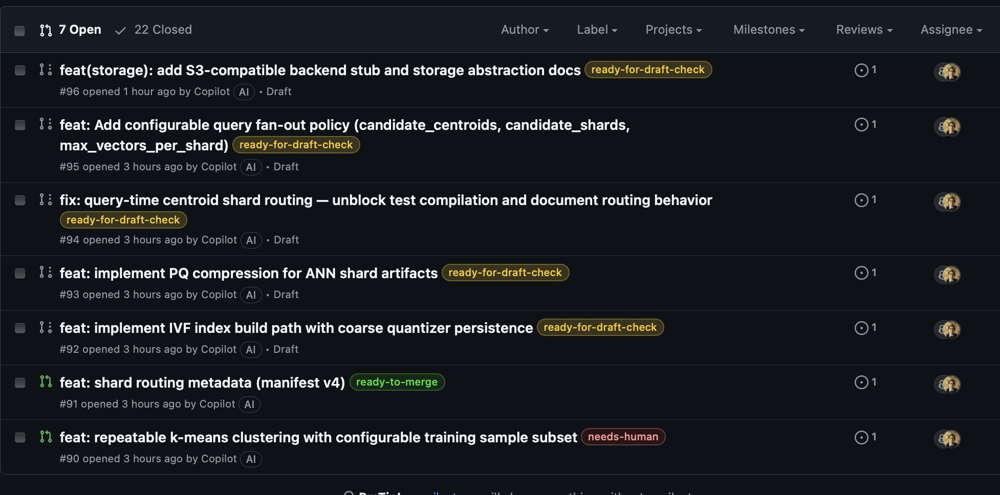
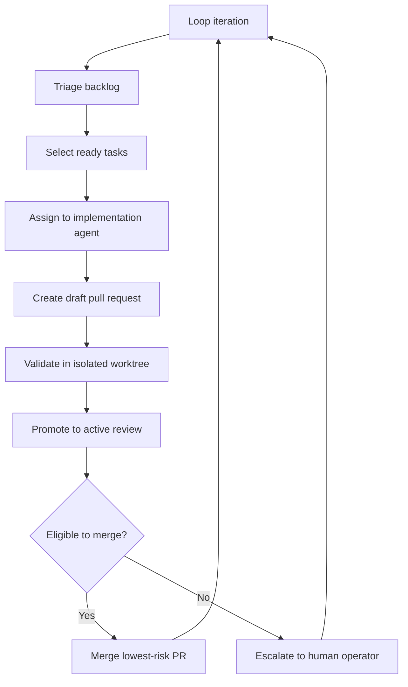
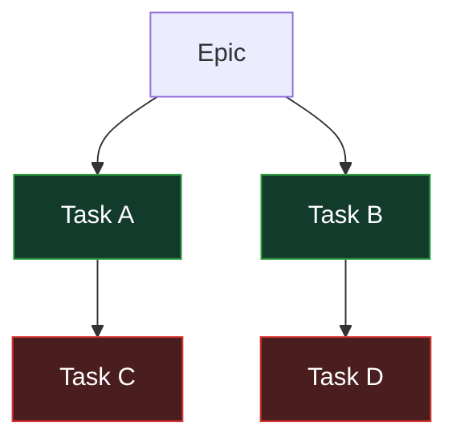
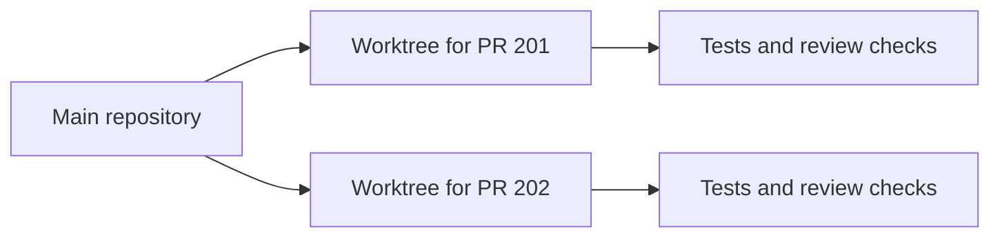
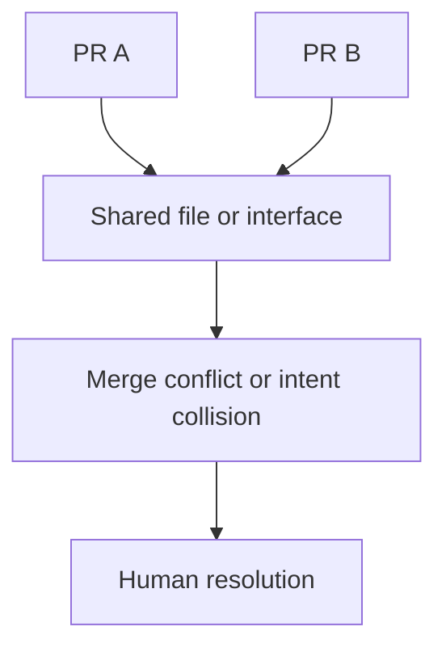
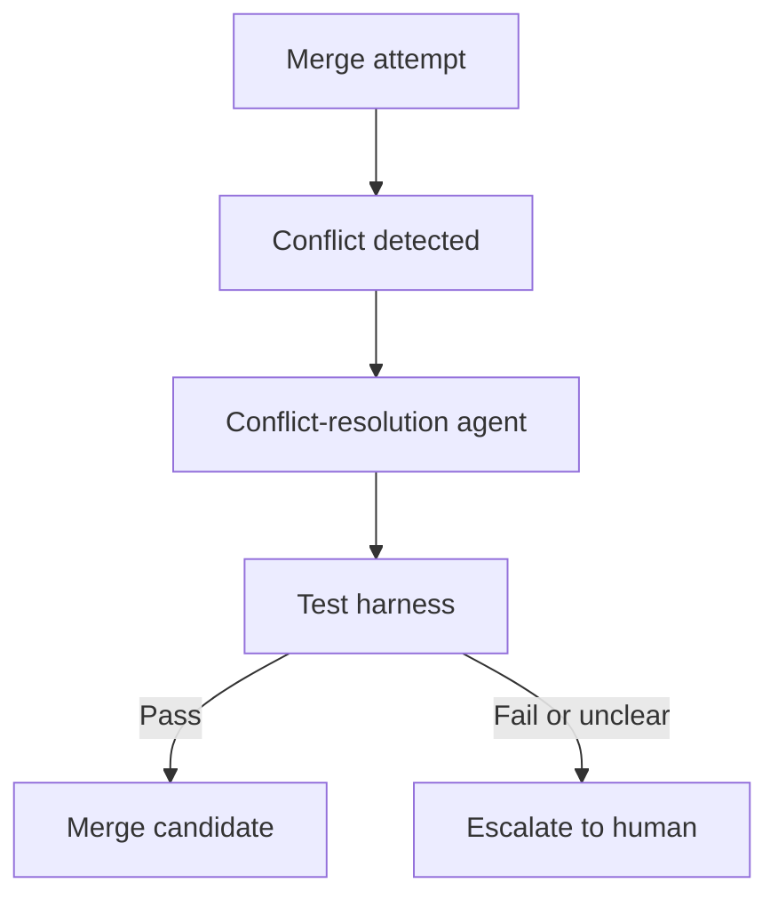

# Building an Autonomous Development Loop on GitHub

## Abstract

This note describes an applied model for running software development as a controlled production loop on top of GitHub issues, pull requests, labels, CI checks, and Git worktrees. The central claim is that once code generation becomes cheap, the governing problem shifts from implementation to orchestration: deciding what is ready, validating changes in isolation, and resolving ambiguity when parallel work collides. In this model, humans do less direct coding and more pipeline operation, especially around architectural judgment and merge conflict resolution. The practical result is not full autonomy, but a repeatable development loop in which the main bottleneck becomes conflict handling rather than code writing.


*Figure 1: A live GitHub pull request queue with workflow labels attached, showing the orchestration system operating against a real repository.*

## Context & Motivation

This note starts from a simple question: what changes when software development is treated as an automated production system rather than a sequence of manual engineering actions?

In a conventional workflow, people interpret issues, implement changes, review each other's code, and manually merge pull requests. In an agent-driven workflow, those same steps can be decomposed into narrow stages and executed continuously by automation.

The goal is not to build an AI demonstration. The goal is to test whether a real repository can be advanced through a disciplined loop that coordinates backlog selection, implementation, validation, review, and merge decisions with bounded human intervention.

A useful constraint is to structure the backlog as epics, phases, and dependent tasks. On GitHub, this means issues are not just a list of requests. They are a graph with explicit dependency edges, such as a `blocked-by` relationship, from which the system can compute a deterministic implementation frontier.

## Core Thesis

The hardest problem in an autonomous development loop is not generating code. The harder problem is resolving ambiguity between concurrent changes.

Once multiple agents can implement tasks in parallel, the limiting factor shifts to the points where local correctness is insufficient. Two pull requests may each be reasonable in isolation and still be unsafe to merge together.

That makes merge conflicts, overlapping intent, and unresolved review ambiguity the dominant operational bottlenecks. In practice, the value of the system depends less on model capability alone and more on whether the pipeline can safely decide what to do when independent changes intersect.

## Mechanism / Model

The model is a continuous loop with narrow stages and explicit state transitions represented through GitHub issues, pull requests, labels, and CI status.

A typical loop looks like this:

1. Triage the backlog.
2. Select a small set of ready tasks.
3. Assign each task to an implementation agent.
4. Create draft pull requests.
5. Validate each draft in isolation.
6. Promote valid drafts into active review.
7. Merge only the lowest-risk eligible pull request.
8. Escalate ambiguity or conflicts to a human operator.



The backlog is organized as a dependency graph. Only tasks whose dependencies are satisfied enter the ready queue. The queue should remain small and deterministic, for example ordered by epic and then by issue number, to prevent uncontrolled parallelism.



Each ready issue is assigned with three inputs:

- The issue description
- Repository-specific implementation guidance
- Relevant local codebase context

The implementation output is a draft pull request, not an assumed-correct change. The system records the artifact and moves it into validation.

Draft validation should happen in dedicated Git worktrees rather than in the main checkout. Worktree isolation reduces contamination between candidate changes and makes the loop easier to restart and audit. Validation checks whether the pull request matches the issue, satisfies repository quality gates, includes necessary documentation, and avoids obvious implementation gaps.



If a draft appears structurally correct, it is advanced for review. If the change is ambiguous, incomplete, or policy-sensitive, it is labeled for human attention rather than being forced through the pipeline.

Open pull request review then applies the repository's normal controls:

- Test execution
- Automated review feedback
- Documentation checks
- Code quality checks
- Safe application of machine-generated review suggestions

The merge pass is intentionally conservative. A pull request is eligible only if there are no failing checks, unresolved review issues, policy violations, or merge conflicts. If a conflict exists, the loop stops treating the problem as a routine merge and reclassifies it as an ambiguity event.

The design principles are straightforward:

- Deterministic ordering
- Bounded work per iteration
- Explicit workflow state through labels
- Restartable iterations
- Full auditability

These principles matter more than raw throughput because they make the system inspectable when something goes wrong.

## Concrete Examples

A simple GitHub issue hierarchy can define the implementation frontier:

```text
Epic
├── Phase 1
│   ├── Task A
│   ├── Task B
├── Phase 2
│   ├── Task C
│   ├── Task D
```

If `Task C` depends on `Task A`, and `Task D` depends on `Task B`, then only `Task A` and `Task B` can initially enter the ready-to-implement queue.

A bounded ready queue might look like this:

```text
ready-to-implement
- Issue 101
- Issue 102
- Issue 103
```

Each issue is implemented into a draft pull request. Those pull requests are then checked out into separate worktrees for validation:

```text
main repository
├── worktree for PR 201
└── worktree for PR 202
```

This isolates tests, review logic, and local inspection per pull request.

A typical merge failure is simple and common: two agents modify the same file. Even if both changes are locally valid, Git's merge model is textual and three-way. When the edits overlap, the system receives a conflict rather than a resolved semantic composition.



```text
<<<<<<< HEAD
change A
=======
change B
>>>>>>> branch
```

At that point, the loop cannot safely determine which intent should dominate, whether both changes should be preserved, or whether the underlying tasks were decomposed poorly. The pipeline pauses and routes the case to a human operator.

A forward-looking extension is to insert a conflict-resolution stage between merge attempt and human escalation. In that model, an agent receives:

- Both pull request descriptions
- The conflicting diff
- Local repository context
- The test suite

The agent proposes a merged result, and the test harness decides whether that proposed reconciliation is viable. If tests fail or intent remains unclear, the system still escalates.



## Trade-offs & Failure Modes

The main advantage of this model is controlled parallelism. Work can move continuously without requiring a human to hand-carry every task through implementation and review.

The main cost is that ambiguity is displaced rather than removed. The system reduces manual coding effort, but it increases the importance of operational discipline, task decomposition quality, and conservative merge policy.

Common failure modes include:

- Poorly scoped tasks that cause agents to edit the same files repeatedly
- Hidden dependencies that are not represented in the issue graph
- Draft pull requests that look complete but do not satisfy the actual task intent
- Automated review suggestions that are syntactically safe but contextually wrong
- CI suites that are too weak to detect semantic regressions
- Human operators becoming the throughput bottleneck for conflict resolution

There is also a structural mismatch between parallel agent execution and Git's merge semantics. Git is good at combining non-overlapping text changes. It is not designed to reason about competing implementation intent. As agent throughput rises, that mismatch becomes more visible.

Another trade-off is that determinism and bounded queues reduce chaos but also cap throughput. This is usually the correct trade in an early autonomous system. Unbounded parallelism creates more apparent productivity while often increasing unresolved collisions downstream.

## Practical Takeaways

Teams attempting this model should treat orchestration as the primary engineering surface.

A workable starting set of practices is:

- Represent work as explicit dependency graphs, not flat issue lists
- Keep the ready queue small and deterministic
- Use draft pull requests as provisional artifacts, not completed work
- Validate each pull request in an isolated worktree
- Use GitHub labels to represent workflow state explicitly
- Merge conservatively and escalate ambiguity early
- Log phase transitions, verdicts, and intervention points for later analysis

Task design matters. Smaller tasks reduce conflict probability, but only if the task boundaries also reduce overlap in files, interfaces, and architectural intent. Small but coupled tasks still collide.

Human effort should be reserved for decisions that are fundamentally semantic:

- Reconciling conflicting intent
- Choosing among competing architectural directions
- Deciding whether two changes should coexist at all

If conflict resolution is the dominant failure mode, the system should not respond by increasing agent volume first. It should improve task decomposition, dependency modeling, and merge discipline before scaling parallel execution.

## Positioning Note

This note is best read as an operator's model for autonomous software delivery on GitHub, not as a claim that software development can be fully delegated end to end.

It is not primarily about model benchmarking, prompt craft, or general statements about artificial intelligence. It is about workflow structure, failure containment, and the point at which human judgment remains necessary even when implementation labor is increasingly automated.

The framing is intentionally practical: software development begins to look less like a sequence of isolated coding acts and more like a managed production system composed of backlog control, implementation agents, validation stages, and merge gates.

## Status & Scope Disclaimer

This note reflects an early-stage applied experiment running against a real repository, not a generalized proof that autonomous development loops are production-ready across environments.

The observations here are strongest at the level of workflow dynamics: explicit dependencies help, isolated validation helps, and merge conflicts emerge as a major human bottleneck once parallel agent execution is introduced. The note does not claim that all repositories, all task types, or all organizational settings will exhibit the same operating profile.

The scope is limited to GitHub-centered development using issues, pull requests, labels, CI, and worktrees. It does not cover broader release management, multi-repository coordination, or formal semantic merge systems beyond noting them as an important next area for development.
