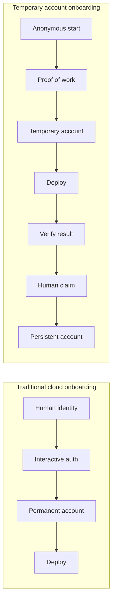
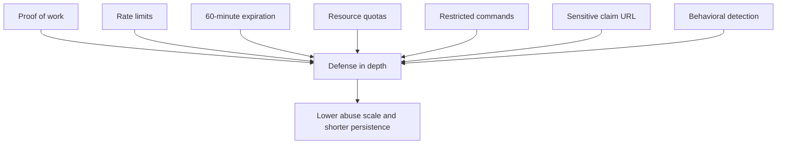
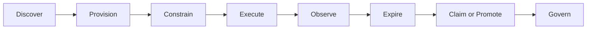
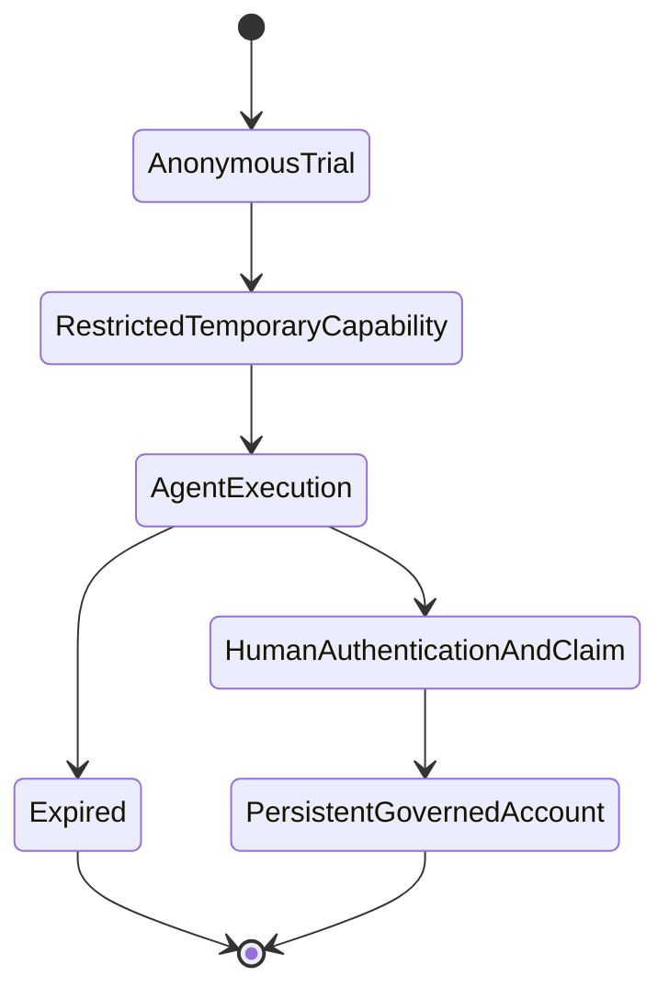

# Temporary Accounts for AI Agents: How Cloudflare Removes Friction Without Removing Control

[Temporary Accounts for AI agents](https://blog.cloudflare.com/temporary-accounts/) does more than shorten the sign-up flow for AI coding agents. It separates trial, identity, and durable ownership into distinct stages, which lets an agent deploy and verify code before a human creates or claims a permanent account. That matters because agent workflows break when every useful action depends on an interactive human authentication ceremony. The deeper claim is that cloud platforms can support autonomous software actors without giving them standing production access, as long as they provision narrow, expiring capability and make permanence a later human decision.[1][2]

## Context and motivation

Most cloud onboarding assumes an interactive human. A person opens a browser, completes OAuth, passes MFA, accepts terms, creates a token, and configures a project. Those steps are annoying but manageable for a deliberate operator. They stop an autonomous agent running in a terminal or background workflow.[1]

Cloudflare describes this mismatch as a wall built for humans. If an agent hits that wall, it cannot reliably pause, ask for a dashboard login, wait for someone to copy a credential, and then resume the same loop. In practice, the agent either fails or chooses a platform it can operate end to end.[1]

What changed is not only that AI agents write code. They now need to deploy, observe, diagnose, and redeploy it. A deployment target has become part of the evaluation loop, not just the destination after development ends. When Cloudflare lets an unauthenticated agent run [`wrangler deploy --temporary`](https://developers.cloudflare.com/workers/platform/claim-deployments/), it is optimizing for that loop.[1][2]

## Core thesis

Cloudflare's temporary accounts matter because they replace premature account creation with temporary, constrained, and reversible capability. That design removes friction from agent execution without removing governance. Identity still matters, but it matters most when ownership, persistence, spending, or broader authority becomes durable.[1][2]

## Mechanism and model

With a recent version of Wrangler, an unauthenticated agent can run:

```bash
wrangler deploy --temporary
```

Cloudflare then creates a [temporary preview account](https://developers.cloudflare.com/workers/platform/claim-deployments/), issues Wrangler a short-lived temporary credential, deploys the Worker to a `workers.dev` URL, and returns a claim URL. The agent can call the deployed application, inspect the result, modify code, and redeploy during the account's 60-minute lifetime. A human can later open the claim URL, authenticate or register, complete the human authentication and ownership claim, and take ownership. If nobody claims it, Cloudflare deletes the account and its resources.[1][2]

This is the core operating loop the feature unlocks:

```text
write -> deploy -> observe -> diagnose -> modify -> redeploy
```

*Diagram 1. Traditional onboarding couples identity and deployment; temporary onboarding separates them.*



The important design choice is reversible provisioning. Cloudflare does not pretend anonymous users are ordinary customers. It gives them enough capability to test a workload, then forces a later decision about permanence, ownership, and wider access.

Cloudflare has explored the same direction through other paths. Its [agent provisioning integration with Stripe](https://blog.cloudflare.com/agents-stripe-projects/) lets agents acting for signed-in users create accounts, obtain credentials, purchase domains, and initiate paid services, while Stripe provides identity attestation and tokenized payment rather than exposing card details directly to the agent.[3] Its work with WorkOS around the [`auth.md` agent-registration protocol](https://workos.com/blog/agent-registration-with-auth-md) points toward machine-discoverable registration, including provider-attested flows and anonymous-start, user-claimed flows with restricted permissions until a verified user binds the account.[4] The underlying [`auth.md` protocol documentation](https://workos.com/auth-md/docs) makes the registration contract itself machine-discoverable, rather than burying it in ad hoc product documentation.

Taken together, these systems suggest an agent-native onboarding model:

- the agent discovers a capability programmatically;
- the platform grants a narrow, time-bounded environment;
- the agent executes and gathers evidence;
- a human claims or promotes the result if it should persist.

This ordering matters because it separates five stages that traditional onboarding often bundles together:

- anonymous trial;
- restricted temporary capability;
- agent execution and verification;
- human authentication and ownership claim;
- persistent governed account.

It also separates three decisions that traditional onboarding often bundles together:

- can this workload run at all;
- who should own it if it proves useful;
- what level of ongoing authority should it receive.

## Abuse prevention as layered control

Anonymous compute attracts abuse by default. Attackers can use disposable environments for phishing, scanning, spam, malware distribution, proxying, or resource farming. Cloudflare's response is not to find a perfect identity signal before execution. It combines several imperfect controls so abuse becomes shorter-lived, less capable, and more expensive.[2] Proof of work raises the cost of abuse. Throttling limits scale. Quotas restrict capability. Expiration limits persistence. Human authentication and ownership claim establish durable identity only when the environment should survive.

*Diagram 2. No single control is sufficient; Cloudflare layers controls into defense in depth.*



### Proof of work and rate limits

Before Wrangler creates a temporary account, Cloudflare requires a proof-of-work check. The CLI solves that challenge automatically, which keeps the workflow agent-friendly while making bulk abuse more expensive.[2] Proof of work does not establish good intent, detect malicious behavior, or make anonymous execution safe. It changes the economics. Sparse legitimate use barely notices the cost; large-scale automated abuse pays it repeatedly.

Cloudflare also limits how quickly a client can create temporary accounts. When creation volume gets too high, Wrangler has to wait or authenticate with a permanent Cloudflare account.[2] That constrains the scale and economics of abuse. It does not identify the caller. It prevents attackers from bypassing expiration simply by rotating through endless new accounts.

### Expiration, quotas, and restricted credentials

Unclaimed accounts expire after 60 minutes, and Cloudflare deletes the account and its deployments.[1][2] That limits persistence and removes cleanup from the agent's discretion. The platform does not trust an agent to remember to relinquish access.

Temporary accounts also expose only a subset of Cloudflare products, each with bounded resources. Static assets have file limits. D1 is limited to one database with constrained storage. Hyperdrive and Queues are capped as well.[2] Those controls restrict capability. The principle matters more than any one quota value: pre-claim environments get enough capability to evaluate a workload, not enough to look like a full production tenant.

The credential itself is also constrained. `--temporary` works only for Wrangler commands that support the short-lived temporary credential, and it cannot be used when Wrangler is already authenticated through OAuth, an API token, or a global API key.[2] That reduces ambiguity and narrows the interfaces through which the temporary identity can act.

### Sensitive claim URLs and undisclosed detection

The claim URL authorizes a consequential step: transfer of ownership. Cloudflare explicitly tells users to treat it as sensitive.[2] In practice, that URL functions as a capability secret. If it leaks into logs, screenshots, traces, or model context, someone else could claim the environment.

Cloudflare also states that it applies additional abuse-prevention checks without documenting them publicly.[2] That is a reasonable security trade-off. Publishing every detection rule would help attackers tune behavior just below the threshold.

## Concrete examples

### Example 1: Cloud onboarding for autonomous deployment

A conventional cloud workflow asks a human to register before any meaningful deployment happens. Temporary accounts reverse that order. An agent can deploy a Worker, exercise it, inspect the response, and iterate. Human identity becomes necessary only when the result deserves ownership and persistence, and when a human should authenticate and claim the environment.[1][2]

That matters because the deploy target acts as part of the evaluation system. An agent that cannot test external behavior cannot close the loop on generated code. In that sense, temporary accounts are not just a trial feature. They are infrastructure for agent evaluation.

### Example 2: The broader onboarding stack

Cloudflare's Stripe Projects integration and the WorkOS `auth.md` protocol show two adjacent paths to the same architecture.[3][4] One path starts with a signed-in human and delegates bounded actions to an agent through provider attestation and tokenized payment. The other path starts with an anonymous credential, restricts it sharply, and later binds it to a verified user. Temporary accounts sit between those poles. They allow anonymous experimentation, but only within a disposable envelope of temporary capability.

## What platform and enterprise teams can learn

The note is not only about Cloudflare. It highlights a more general platform design rule for agent-facing systems.

### Separate experimentation from permanent enrollment

Requiring full identity, organizational setup, and durable authorization before a user or agent can test a capability adds friction where the value is still uncertain. Temporary environments let the platform ask for stronger identity later, when the result has proved worth keeping.

### Grant capabilities, not standing access

Temporary accounts express trust through boundaries: limited products, bounded quotas, short-lived credentials, and automatic expiration.[2] That is safer than giving an agent a long-lived user key and asking it to self-police.

### Put human approval at the persistence boundary

Cloudflare lets the agent build and verify a result, then requires a human to authenticate and claim the account before the environment becomes durable.[1][2] That is a sharper control point than forcing approval on every intermediate action.

### Teach recovery through operational interfaces

When an unauthenticated deploy fails, [Wrangler exposes `--temporary` through its CLI recovery message](https://blog.cloudflare.com/temporary-accounts/).[1] That makes the error path itself part of the product interface. For agent-facing tools, executable recovery guidance often matters more than static documentation.

## Trade-offs and failure modes

Temporary accounts solve a narrow problem well. They do not make anonymous execution safe by definition.

- A malicious Worker can still cause harm within its lifetime and quotas. Proof of work and throttling constrain the scale and economics of abuse, not the caller's intent.[2]
- Claim URLs and short-lived temporary credentials still create a credential-handling problem for agent systems. Expiration limits persistence and reduces blast radius, but it does not prevent leakage through prompts, logs, or observability traces.
- Restricted preview environments can mislead teams if they assume a successful temporary deployment says more about production readiness than it actually does.
- This pattern depends on a platform that can provision, meter, observe, and clean up temporary resources reliably. Many enterprises do not have that machinery yet.

## A reusable model: the Ephemeral Agent Capability Pattern

The broader pattern is reusable outside Cloudflare. A platform can expose temporary capability in a staged cycle that makes execution cheap while keeping promotion explicit.

*Diagram 3. The Ephemeral Agent Capability Pattern turns temporary execution into a governable lifecycle.*



This pattern applies to more than code deployment. Enterprise teams can use it for temporary sandboxes, preview datasets, integration testing, workflow configuration, infrastructure planning, or evaluation of new tools.

*Diagram 4. Temporary accounts stage a controlled path from anonymous trial to governed persistence.*



## Practical Takeaways

- Separate experimentation from permanent enrollment. Let agents or users prove value before you require full organizational setup.
- Grant capabilities, not standing access. Short-lived, task-shaped authority is safer than handing agents long-lived user credentials.
- Make cleanup automatic. Temporary resources should expire even when the agent crashes, disappears, or loses context.
- Put human approval at the persistence boundary. Require stronger verification when ownership, spend, sensitive data, or production impact becomes durable.
- Design abuse controls economically. Layer proof of work, throttling, quotas, restricted commands, expiration, and behavior-based detection instead of betting on one perfect control.
- Teach recovery through operational interfaces. Structured errors and CLI guidance can help agents discover the next safe action at the moment they need it.[1][2]

## Positioning Note

This note is not vendor documentation, and it is not an academic treatment of anonymous access or identity systems. It is an applied architectural reading of a specific product feature and a few adjacent mechanisms. The value is in the operating pattern: how a platform can let agents act before full enrollment while still preserving later ownership, bounded authority, and governance.[1][2][3][4]

## Status & Scope Disclaimer

This is personal lab analysis, not authoritative guidance from Cloudflare, WorkOS, or Stripe. The core argument is exploratory but evidence-based: it depends on published descriptions of Temporary Accounts, related Cloudflare onboarding flows, and WorkOS's `auth.md` framing.[1][2][3][4] The note is scoped to agent-facing platform design and enterprise architecture patterns, not to a general security endorsement of anonymous compute.

## References

1. Sid Chatterjee, Celso Martinho, and Brendan Irvine-Broque, Cloudflare, "[Temporary Cloudflare Accounts for AI agents](https://blog.cloudflare.com/temporary-accounts/)," June 19, 2026.

2. Cloudflare Developers, "[Claim deployments with Temporary Accounts](https://developers.cloudflare.com/workers/platform/claim-deployments/)," Cloudflare Workers documentation, accessed June 20, 2026.

3. Sid Chatterjee and Brendan Irvine-Broque, Cloudflare, "[Agents can now create Cloudflare accounts, buy domains, and deploy](https://blog.cloudflare.com/agents-stripe-projects/)," April 30, 2026.

4. Garrett Galow, WorkOS, "[Agent Registration with Auth.md](https://workos.com/blog/agent-registration-with-auth-md)," May 21, 2026.

### Further technical documentation

- WorkOS, "[auth.md protocol overview](https://workos.com/auth-md/docs)."
- WorkOS, "[The auth.md file format](https://workos.com/auth-md/docs/auth-md)."
- WorkOS, "[Implementing auth.md for applications](https://workos.com/auth-md/docs/apps)."
- WorkOS, "[Implementing verified identity for agent providers](https://workos.com/auth-md/docs/agent-providers)."

### How the sources are used

- The Cloudflare product announcement supports the motivation for temporary accounts, the 60-minute lifecycle, repeated deployment, the claim process, and Wrangler's agent-facing discovery behavior.
- The Cloudflare Workers documentation supports the technical restrictions and abuse controls, including proof of work, throttling, quotas, temporary credentials, automatic deletion, and claim-link handling.
- The Cloudflare-Stripe announcement supports the discussion of provider-attested identity, automated account provisioning, credential issuance, and tokenized payments.
- The WorkOS sources support the discussion of machine-discoverable registration, anonymous-start credentials, provider-attested identity, user claims, and later scope upgrades.
