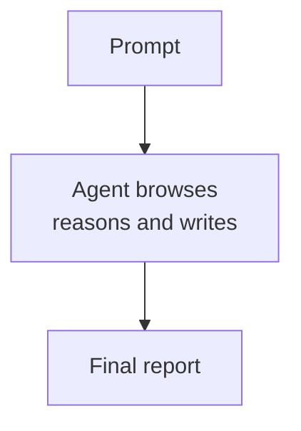
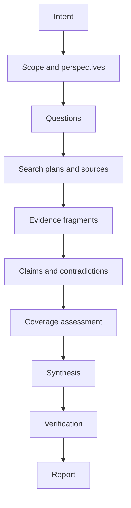
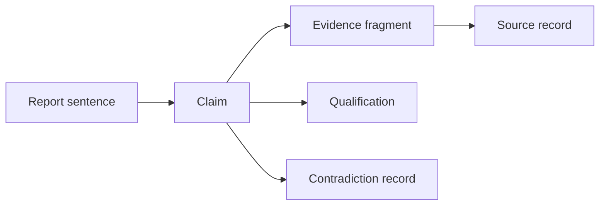
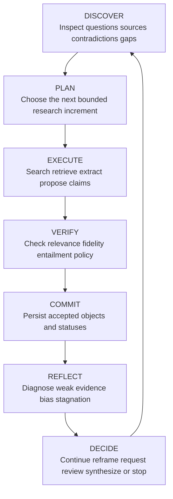

# Deep Research Is an Evidence Workflow, Not a Long-Running Agent

### Part 3 of the series *From Agent Demos to Governed Systems*

Deep research systems often produce polished reports that look similar on the surface. What matters operationally is whether the system retained only a browsing transcript and final prose, or whether it retained the research objective, questions, sources, evidence fragments, claims, contradictions, approval decisions, and unresolved gaps. This note argues that serious deep research should be built as an evidence workflow, not as a long-running opaque agent trajectory, because inspectability, resumability, and defensibility depend on durable intermediate state rather than on the report alone.

## Context and motivation

Deep research products now routinely advertise multi-step browsing, iterative search, parallel subagents, and report generation with citations. That is real progress. OpenAI's [deep research](https://openai.com/index/introducing-deep-research/), Google's [Gemini Deep Research](https://blog.google/products-and-platforms/products/gemini/google-gemini-deep-research/), and Anthropic's [multi-agent research system](https://www.anthropic.com/engineering/multi-agent-research-system) all describe systems that plan, search, revise, and synthesize across many steps rather than answering in one pass.

That shift makes a narrower architectural question more urgent. If a system can spend minutes or hours researching, what exactly becomes durable state? If the answer is "the final report and maybe the transcript," then the system still hides most of the epistemic work inside an execution trace that is hard to inspect, challenge, resume, or reuse.

That is why this note matters now. Tooling has improved enough that long-running research agents are practical. The next constraint is not whether the agent can browse for longer. It is whether the workflow preserves the transformations from question to evidence-backed claim.

## Core thesis

Deep research is not primarily a long-running generation task. It is a governed workflow that transforms intent, questions, sources, and evidence into qualified claims. The key design choice is not how many agents participate. It is which research decisions become durable, inspectable objects.

When too much of the process lives only inside a trajectory, teams lose failure diagnosis, safe resumption, targeted verification, and evidence reuse. When the workflow externalizes questions, sources, evidence fragments, claims, contradictions, approvals, and checkpoints, the final report becomes a rendered artifact over retained research state rather than the only durable output.

## Why the long-running-agent abstraction is insufficient

A long-running research agent is a useful abstraction for narrow and low-stakes questions. A user submits a prompt. The agent plans, browses, reads, reasons, revises its search, and writes a report.

*Caption: A report-only architecture hides most of the important state inside one trajectory.*

This architecture minimizes coordination overhead. It works reasonably well when the question is narrow, source quality is easy to judge, and the user can directly inspect the answer.

The failure appears when the agent bundles too many transformations into one opaque run. A conventional trajectory often mixes scope setting, question generation, search construction, source selection, evidence extraction, claim formation, contradiction handling, completeness judgment, and prose synthesis. If those steps do not produce durable objects, a polished paragraph can conceal which transformation failed.

An unsupported conclusion might come from weak scope, poor retrieval, a bad source choice, incorrect extraction, faulty synthesis, or citation drift. The report does not tell you which one. The same opacity also breaks resumability. A system cannot safely resume by replaying a transcript and asking a model to continue. It needs committed state: which questions are complete, which evidence was accepted, which claims remain contested, which approvals were granted, and which checkpoint is authoritative.

Long-running agents can still produce useful research. They are not a sufficient state model for governed research.

## Mechanism: from report generation to evidence workflow

An evidence workflow changes the representation of state. Instead of treating the report as the primary artifact, it treats the report as a projection over explicit research objects.

*Caption: The evidence workflow introduces durable intermediate objects between intent and report.*

This model works with one model or many. Reliability does not depend on agent count. It depends on whether the workflow preserves the decisions that matter.

### Research intent

A topic is not a research intent. "AI agents in finance" names an area. It does not specify the decision, audience, time horizon, scope, or evidence bar. A useful intent object captures the objective, decision context, audience, required depth, time horizon, geographic or organizational scope, exclusions, evidence standards, and output form.

Without that object, the system optimizes against an underspecified prompt and can produce a broad report that misses the actual decision.

### Scope and perspectives

Scope defines the investigation boundary: included and excluded questions, relevant dates, source classes, required perspectives, depth, and stopping constraints. Autonomous research often drifts because every source introduces adjacent concepts that create more searches and more branches. A governed workflow widens scope through an explicit decision, not by accident.

Perspectives are analytical lenses that change the research frontier. A security perspective asks how a design can be abused. An operational perspective asks how it fails under real ownership and workload constraints. A legal perspective asks which claims depend on jurisdiction. These are not decorative report headings. They are a disciplined way to generate missing questions.

### Questions, sources, evidence, and claims

A research objective must decompose into answerable questions, not just into an outline. A useful question has an identifier, rationale, priority, status, dependencies, candidate queries, supporting evidence, unresolved gaps, confidence, and completion criteria.

Queries are attempts to locate evidence. They are not the unit of progress. Several queries can serve one question, and one query can produce sources for several questions. Source records therefore need their own identity and provenance: title, author or organization, publication and access dates, location, source type, authority, possible conflicts, and version information.

Evidence fragments matter because source summaries are lossy too early. The workflow should preserve the smallest source-grounded object that supports or challenges a claim: exact source, location, excerpt or structured fact, extraction method, question served, context, limitations, version, and whether the fragment is direct evidence or interpretation.

Claims then become first-class objects with a precise statement, scope, supporting and contradicting evidence, confidence, qualifications, derivation type, and review status. The workflow should distinguish reported, extracted, calculated, inferred, synthesized, and recommended claims because those forms require different checks.

## The claim is the unit of research quality

Paragraph-level fluency is a weak quality metric. A paragraph can contain five propositions backed by one citation. That citation may fully support two of them, partly support a third, and say nothing about the rest. Smooth prose hides evidential discontinuity.

Claim-level representation exposes the common failure modes:

- Unsupported claims with no linked evidence
- Overgeneralized claims that exceed the population, time period, or implementation described by the evidence
- Citation mismatch where a source is topically related but does not entail the statement
- Missing qualification where the source contains conditions or uncertainty that the prose omits
- Contradiction suppression where synthesis drops conflicting evidence

Citation-evaluation work supports this decomposition. [ALCE](https://arxiv.org/abs/2305.14627) evaluates citation-grounded long-form generation at the levels of answer quality and citation quality, while [RAGAS](https://arxiv.org/abs/2309.15217) frames RAG evaluation across retrieval focus, faithfulness, and generation quality. These frameworks are imperfect, especially when model judges assess model outputs, but they reinforce the architectural point: research quality is easier to evaluate when the workflow preserves smaller verifiable units.

*Caption: Claim-level provenance makes it possible to inspect what the report actually asks the reader to accept.*

## Workflow state, contradictions, and provenance

The authoritative state of a research run should include more than the draft:

- Objective and scope
- Perspectives
- Questions and dependencies
- Search plans
- Sources
- Evidence fragments
- Claims
- Contradictions
- Coverage metrics
- Outline and drafts
- Verification findings
- Approval decisions
- Runtime checkpoints

Contradictions deserve first-class representation. Conflicting sources do not necessarily mean one source is wrong. They may use different definitions, time periods, populations, or causal assumptions. A contradiction record should capture the competing claims, source relationships, possible explanations, temporal or definitional differences, and resolution status. "Some experts disagree" is not enough structure to investigate the conflict.

[W3C PROV](https://www.w3.org/TR/prov-overview/) and [related provenance standards](https://pav-ontology.github.io/pav/) are useful here because they make outputs more assessable by preserving the [entities, activities, agents, and derivations](https://www.w3.org/TR/prov-o/) that produced them. A research workflow does not need to implement PROV literally to benefit from that design principle.

## Loop engineering applied to research

Loop engineering provides a clean control model for deep research. The point is not to make the model deterministic. It is to surround probabilistic workers with deterministic control over state transitions, verification, and commit boundaries.

*Caption: In deep research, loop engineering governs the movement from proposed evidence to committed research state.*

Discover inspects current state rather than relying on the model's recollection. Plan selects a bounded next increment, such as resolving one contradiction or strengthening one material claim. Execute lets models and tools search, retrieve, extract, and propose. Verify runs deterministic checks first where possible, then uses model judgment for entailment, qualification preservation, or causal overreach. Commit makes accepted objects authoritative. Reflect diagnoses weak strategies, source concentration, unresolved disagreement, and low information gain. Decide explicitly chooses whether to continue, widen scope, narrow scope, request human input, synthesize, publish, or stop.

That boundary between proposal and commit is the control point. It prevents speculative output from silently becoming research state.

## Concrete examples

### Example 1: resume and review after interruption

The difference between a trajectory and a workflow becomes obvious when a run stops midway through a consequential question.

In a transcript-first system, a reviewer often receives a long conversation, a partial draft, and a vague instruction to continue. The next model call has to reconstruct which questions were already answered, which citations were provisional, which contradictions were unresolved, and which side effects already occurred. That reconstruction is expensive and unreliable.

In an evidence workflow, the reviewer can inspect the committed state directly: completed questions, open questions, accepted evidence fragments, contested claims, approval status, and the last durable checkpoint. Resumption becomes a state transition, not a guess.

### Example 2: the `deep-research-assistant` architecture

[deep-research-assistant](https://deep-research-assistant.rmax.tech/) is an experimental governed research runtime built to test this architecture. Its central premise is sound: generated prose should be a projection over research state, not the authoritative state itself.

The inspected deployment exposes [architecture](https://deep-research-assistant.rmax.tech/architecture/), [implementation phases](https://deep-research-assistant.rmax.tech/phases/), and [API reference](https://deep-research-assistant.rmax.tech/api/) pages plus a [public repository](https://github.com/rmax-ai/deep-research-assistant). The repository contains Python source, tests, a [README](https://github.com/rmax-ai/deep-research-assistant/blob/main/README.md), [`docs/ARCHITECTURE.md`](https://github.com/rmax-ai/deep-research-assistant/blob/main/docs/ARCHITECTURE.md), a [threat-model document](https://github.com/rmax-ai/deep-research-assistant/blob/main/docs/THREAT_MODEL.md), [`SPEC.md`](https://github.com/rmax-ai/deep-research-assistant/blob/main/SPEC.md), and CI configuration. The deployed site appears documentation-oriented rather than a public interactive research service. Its API examples target `localhost:8080`, so I could inspect the documented API and source implementation but not execute live runs against the public deployment.

The implementation separates three planes:

- Governance plane for identity, policy, approval, audit, and publication
- Workflow plane for orchestration, scheduling, budgets, stopping, persistence, and recovery
- Cognitive plane for scope interpretation, question generation, retrieval, extraction, claim construction, contradiction analysis, drafting, and verification

That separation is visible in code, not only in diagrams. [`src/deep_research/workflow/graph.py`](https://github.com/rmax-ai/deep-research-assistant/blob/main/src/deep_research/workflow/graph.py) defines an ADK workflow with roles such as research director, question architect, query planner, evidence curator, claim builder, counter-evidence agent, section writer, and verifier. The same graph invokes deterministic modules for scheduling, coverage calculation, deduplication, source clustering, policy evaluation, checkpoints, and stopping decisions. It also records run identifiers, phases, logical-input hashes, idempotency keys, node execution records, approval pauses, and checkpoints.

That is strong evidence that the project treats persistence, approvals, identity propagation, and recovery as runtime concerns rather than prompt instructions. The architecture is not fully decoupled, though. The main workflow graph still concentrates a large amount of routing, instrumentation, persistence, event publication, approval handling, and cognitive execution. The separation is real but not yet minimal.

The project [`SPEC.md`](https://github.com/rmax-ai/deep-research-assistant/blob/main/SPEC.md) also defines typed state for research runs, objectives, scopes, perspectives, questions, search plans, sources, evidence fragments, claims, contradictions, outlines, drafts, verification findings, approval decisions, and metrics. That schema design matters because it reduces the authority of prose. A section can be regenerated while preserving the claims and evidence on which it depends.

## What the architecture buys

An evidence workflow delivers concrete operational advantages:

- Inspectability, because reviewers can challenge a claim without reconstructing an entire browsing trace
- Resumability, because the workflow restarts from committed objects and checkpoints rather than conversational memory
- Targeted verification, because expensive checks can focus on material or uncertain claims
- Evidence reuse, because verified fragments and claims can support later reports
- Explicit uncertainty, because contradictions and unresolved gaps remain in state instead of disappearing into prose
- Human review at semantic boundaries such as scope, plan, evidence, and publication
- Better failure diagnosis, because teams can distinguish retrieval failure from extraction, claim formation, synthesis, or rendering failure

Those benefits matter most when research informs consequential decisions, spans many sources, must survive multiple sessions, or operates under organizational governance.

## Trade-offs and failure modes

The additional structure is costly.

An evidence workflow needs schemas, databases, identifiers, orchestration, migrations, checkpoints, review interfaces, evaluators, and telemetry. It adds latency and model usage. Evidence extraction, counter-evidence search, and claim verification can require many more calls than direct report generation.

Schemas can also become rigid. A representation that fits technical reports may fit historical interpretation or exploratory science poorly. Human gates can turn into queues. Inspectability can overwhelm reviewers if the interface does not prioritize material claims and unresolved uncertainty. Structured workflows can also become process theater. A claim with several identifiers and status fields is not necessarily true.

A simpler agent is often sufficient when the question is narrow, low-stakes, disposable, easy to source, and easy for the user to verify directly. The evidence workflow becomes justified when the cost of an unsupported conclusion exceeds the cost of maintaining the workflow.

## What remains unsolved

A structured workflow does not make research true. It makes the path from question to conclusion more visible and therefore more contestable.

Several hard problems remain:

- Search-provider dependence. The workflow inherits [source-selection differences, crawler-blocking effects, inconsistency, and sensitivity to minor query changes across search systems](https://arxiv.org/abs/2604.27790) from its search provider.
- Source access and modality. PDFs, tables, datasets, images, dynamic pages, and paywalled sources require different extraction strategies.
- Citation drift. Correct evidence links can become incorrect when prose is merged or rewritten.
- Model-judge bias. A verifier from the same model family provides procedural separation, not independent ground truth.
- Incomplete contradiction discovery. The system can only represent disagreements it discovers.
- Coverage validity. Coverage and information-gain metrics are useful heuristics, not proven definitions of completeness.
- Cost escalation. More stages and more counter-evidence work can produce high marginal cost after the major questions are answered.
- Ground truth. Verification can test entailment, provenance, and consistency. It cannot manufacture truth when evidence remains incomplete.
- Reuse and invalidation. Claims are reusable only if scope, dependencies, versions, and source freshness remain explicit.

Evaluation therefore has to decompose as well. Teams should separately test question decomposition, retrieval recall and diversity, extraction fidelity, claim atomicity, claim-evidence entailment, citation correctness and completeness, contradiction discovery, calibration, coverage decisions, resume correctness, approval enforcement, and final decision usefulness across [Enterprise Deep Research](https://arxiv.org/abs/2510.17797)-style multi-agent planning and tool use, [STORM](https://arxiv.org/abs/2402.14207)-style perspective-guided retrieval and long-form synthesis, and [Co-STORM](https://arxiv.org/abs/2408.15232)-style collaborative steering and evolving knowledge structures. No single benchmark captures all of that.

## Practical takeaways

- Treat the report as a rendered artifact, not as the authoritative state of research.
- Persist questions, evidence fragments, claims, contradictions, approvals, and checkpoints as first-class objects.
- Review claim-evidence links, not just prose quality, when research informs consequential decisions.
- Use loop boundaries between proposal, verification, and commit so speculative model output does not silently become accepted state.
- Choose the evidence-workflow overhead deliberately. Use it where the cost of a wrong conclusion exceeds the cost of the workflow itself.

## Positioning note

This note is not academic research, vendor documentation, or a general manifesto about agent count. It is an applied architectural argument grounded in inspected product behavior, repository evidence, and research-system design patterns. The goal is to clarify what durable deep-research systems need to preserve if they are meant to be inspectable, resumable, and governable in practice.

## Status and scope disclaimer

This note reflects personal lab analysis and inspection of available public artifacts as of June 23, 2026. It is not an authoritative evaluation of every deep-research product, and it does not claim that the referenced implementation has already validated superior research outcomes against simpler alternatives. The strongest claims here are architectural: if a system wants research outputs to be defensible, it needs durable evidence state between intent and report.

## References

1. [Introducing deep research](https://openai.com/index/introducing-deep-research/) — OpenAI, February 2, 2025; updated February 10, 2026. Product announcement describing multi-step browsing, reasoning, source citation, and progress reporting.
2. [Try Deep Research and our new experimental model in Gemini, your AI assistant](https://blog.google/products-and-platforms/products/gemini/google-gemini-deep-research/) — Google, December 11, 2024. Product announcement describing research-plan generation, iterative web research, and source-linked reports.
3. [How we built our multi-agent research system](https://www.anthropic.com/engineering/multi-agent-research-system) — Anthropic, June 13, 2025. Engineering write-up on parallel research agents, coordination, and production evaluation.
4. [ALCE: Enabling Large Language Models to Generate Text with Citations](https://arxiv.org/abs/2305.14627) — Gao et al., 2023. Citation-grounded long-form generation benchmark covering answer quality and citation quality.
5. [RAGAS: Automated Evaluation of Retrieval Augmented Generation](https://arxiv.org/abs/2309.15217) — Es et al., 2023. RAG evaluation framework spanning retrieval focus, faithfulness, and generation quality.
6. [PROV-Overview](https://www.w3.org/TR/prov-overview/) — Paul Groth and Luc Moreau, W3C, April 30, 2013. Overview of provenance concepts and relationships.
7. [PROV-O: The PROV Ontology](https://www.w3.org/TR/prov-o/) — W3C, April 30, 2013. Ontology for entities, activities, agents, and derivations.
8. [PAV ontology documentation](https://pav-ontology.github.io/pav/) — PAV ontology project. Lightweight provenance, authoring, and versioning model relevant to research-state design.
9. [How Generative AI Disrupts Search: An Empirical Study of Google Search, Gemini, and AI Overviews](https://arxiv.org/abs/2604.27790) — Grossman et al., 2026. Evidence on source-selection differences, crawler blocking, inconsistency, and query sensitivity across search systems.
10. [Enterprise Deep Research: Steerable Multi-Agent Deep Research for Enterprise Analytics](https://arxiv.org/abs/2510.17797) — Prabhakar et al., 2025. Multi-agent enterprise research architecture with planning, specialized search, reflection, and benchmark evaluation.
11. [Assisting in Writing Wikipedia-like Articles From Scratch with Pre-Writing Augmented Language Models](https://arxiv.org/abs/2402.14207) — Shao et al., 2024. STORM paper on perspective-guided question generation, retrieval, and long-form synthesis.
12. [Into the Unknown Unknowns: Engaged Human Learning through Participation in Language Model Agent Conversations](https://arxiv.org/abs/2408.15232) — Jiang et al., 2024. Co-STORM paper on collaborative steering and evolving knowledge structures during research.

### Project materials inspected

13. [Deep Research Assistant](https://deep-research-assistant.rmax.tech/) — Deployed landing page inspected June 23, 2026. Public overview of the governed research runtime and exposed capabilities.
14. [Architecture](https://deep-research-assistant.rmax.tech/architecture/) — Deployed architecture page inspected June 23, 2026. Public description of the three-plane design, workflow topology, and data model.
15. [Implementation Phases](https://deep-research-assistant.rmax.tech/phases/) — Deployed implementation-phases page inspected June 23, 2026. Public roadmap and shipped-capability status.
16. [API Reference](https://deep-research-assistant.rmax.tech/api/) — Deployed API page inspected June 23, 2026. Public route documentation and approval-flow examples.
17. [Deep Research Assistant repository](https://github.com/rmax-ai/deep-research-assistant) — GitHub repository inspected June 23, 2026. Primary implementation source for orchestration, schemas, governance, persistence, and tests.
18. [README.md](https://github.com/rmax-ai/deep-research-assistant/blob/main/README.md) — Repository overview inspected June 23, 2026. Summarizes architecture, agent roster, validation split, and implementation status.
19. [`SPEC.md`](https://github.com/rmax-ai/deep-research-assistant/blob/main/SPEC.md) — Product specification inspected June 23, 2026. Defines features, phased acceptance criteria, and typed research-state expectations.
20. [`docs/ARCHITECTURE.md`](https://github.com/rmax-ai/deep-research-assistant/blob/main/docs/ARCHITECTURE.md) — Architecture document inspected June 23, 2026. Details the workflow graph, deterministic services, trust boundaries, and runtime records.
21. [`docs/THREAT_MODEL.md`](https://github.com/rmax-ai/deep-research-assistant/blob/main/docs/THREAT_MODEL.md) — Threat-model document inspected June 23, 2026. Structured analysis of attack paths, controls, and residual risk.
22. [`src/deep_research/workflow/graph.py`](https://github.com/rmax-ai/deep-research-assistant/blob/main/src/deep_research/workflow/graph.py) — Workflow graph implementation inspected June 23, 2026. Shows role routing, deterministic integrations, checkpointing, and approval-aware execution.

No completed public live research run, generated evidence package, trace, or final report was exposed by the deployed application during inspection. The API documentation points to a local service, so the two requested representative live runs could not be executed against the deployment. No run artifacts were fabricated.
