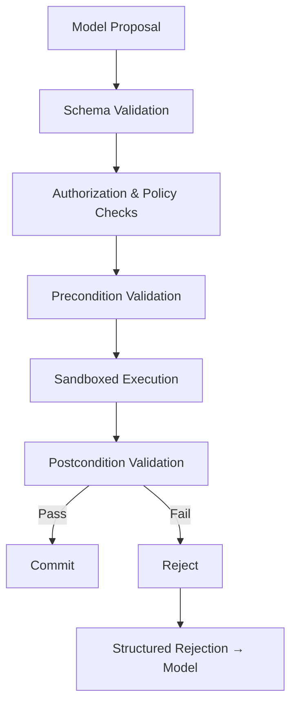
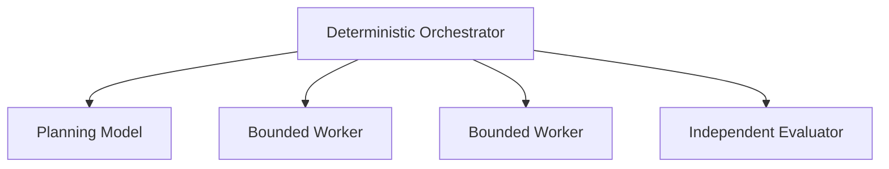

# Deterministic Runtimes for Long-Horizon AI Agents

Large language models can now use terminals, browse repositories, call APIs, modify files, delegate work and continue reasoning across hundreds of tool interactions. This has expanded the practical horizon of AI agents from answering questions to performing software migrations, investigating incidents, producing research and operating business workflows.

But extending an agent's execution time does not automatically make it more capable.

A longer-running agent also has more opportunities to accumulate incorrect assumptions, repeat actions, lose track of its objective, corrupt external state or become impossible to recover after a failure. The central engineering problem is therefore not simply how to make a model reason for longer. It is how to preserve correctness while a stochastic model interacts with a changing environment over an extended sequence of dependent actions.

The emerging answer resembles a distributed workflow system more than a chatbot:

**Long-horizon reliability comes from compiling stochastic model proposals into deterministic, durable and verifiable execution — not from allowing a model to control an increasingly long tool loop.**

This article develops that architecture and introduces [durable-agent-runtime-lab](https://github.com/rmax-ai/durable-agent-runtime-lab), a companion experimental project designed to test whether typed plans, event sourcing, checkpoints, verification gates and idempotent execution measurably improve agent reliability.

## What makes a task long-horizon?

It is tempting to define a long-horizon task by its number of model turns or tool calls. This is useful operationally, but incomplete.

A task with one hundred independent searches may be easier than a six-step database migration in which every action is irreversible and each decision depends on the previous result.

Long-horizon difficulty is better understood through several interacting dimensions:

- **Dependency depth:** how many later decisions depend on earlier outcomes.
- **Branching factor:** how many plausible actions are available at each step.
- **Feedback delay:** how long it takes before the consequences of a decision become observable.
- **Observability:** how much of the true environment state the agent can inspect.
- **Reversibility:** whether an incorrect action can be safely undone.
- **Coordination complexity:** how many workers, systems or people must remain synchronized.
- **Context pressure:** how much execution history must remain available for future decisions.

A repository migration may involve a deep dependency graph, delayed integration-test feedback and substantial rollback costs. A research task may require hundreds of source interactions but leave the external environment mostly unchanged. Both are long-horizon, but they fail in different ways.

This distinction matters because increasing model intelligence addresses only part of the problem. The rest belongs to runtime architecture.

## Reasoning is not planning

Most conventional agents operate through a variation of the same loop:

```
observe → reason → choose tool → execute tool → append result to context → repeat
```

This works well for short tasks. It is easy to implement, flexible and allows the model to adapt after every observation.

Its weakness appears when early decisions have delayed consequences.

The paper ["Why Reasoning Fails to Plan"](https://arxiv.org/abs/2501.12351) argues that step-by-step reasoning tends to induce a locally greedy policy. A model selects an action that looks useful from the current state but does not sufficiently account for how that commitment constrains future states. Over a long trajectory, these small local commitments become difficult to reverse. The paper introduces future-aware lookahead to let downstream outcomes influence earlier choices.

Related work on [task-decoupled planning](https://arxiv.org/abs/2410.11571) identifies another problem: agents frequently reason over a single entangled history containing multiple partially independent subtasks. Errors and irrelevant context then spread across the whole execution. By representing work as a directed graph of scoped subtasks, planning and recovery can remain local to the affected branch.

The practical conclusion is not that agents need perfect plans before execution. One-shot plans are also brittle when the environment produces unexpected results.

A more reliable architecture separates three responsibilities:

- A **planner** proposes a structured decomposition.
- A **deterministic orchestrator** owns execution state and dependencies.
- **Workers** solve bounded tasks and return typed results.

Planning remains adaptive, but the model no longer owns the execution semantics.

## Why longer agent loops fail

As the execution horizon expands, several failure modes compound.

### Context accumulation

Raw tool outputs, command traces, source files and intermediate explanations are appended to the active conversation. The context becomes increasingly expensive while important constraints compete with incidental execution details.

Atlassian encountered this pressure while developing its [Long Horizon reasoning engine](https://www.atlassian.com/blog/announcements/long-horizon). Its architecture supports loops of up to 150 iterations, requiring explicit context compaction, progressive tool disclosure, prompt-prefix caching and decomposition into child instances for wide tasks.

This illustrates an important boundary: a larger context window increases storage capacity, but it does not determine what information should remain active.

Context engineering is therefore a runtime responsibility. The system must decide:

- what remains at full resolution;
- what becomes a structured summary;
- what moves to retrievable storage;
- which instructions apply to the current execution phase;
- which tool schemas the model needs now.

The objective is not to preserve every token. It is to maintain the smallest sufficient working state.

### Accumulated false beliefs

A tool may partially succeed, return an ambiguous result or change the environment in an unexpected way. If the model assumes success without an external check, subsequent actions operate against an incorrect internal state.

The problem is not only hallucination in generated text. It is **belief–environment divergence**: the agent thinks a file was changed, a deployment succeeded or a record exists when the external system says otherwise.

Without postconditions, these errors become the foundation for later decisions.

### Duplicate and non-idempotent actions

Long-running processes experience timeouts, worker restarts, duplicated messages and uncertain acknowledgements. A model may repeat a command because it cannot determine whether the previous attempt succeeded.

For a read operation this is usually harmless. For a payment, notification, deployment or destructive write it may be catastrophic.

A production agent runtime therefore needs the same mechanisms used in reliable distributed systems:

- idempotency keys;
- write-ahead records;
- explicit commit states;
- bounded retries;
- compensation procedures;
- reconciliation after uncertain outcomes.

### Goal drift

As the execution trace grows, the immediate local problem gradually replaces the original objective.

An agent asked to upgrade a dependency may begin rewriting unrelated abstractions because doing so makes the current compilation error easier to solve. Each local decision appears coherent, but the final artifact no longer matches the requested scope.

Goal drift cannot be solved by periodically telling the model to "stay focused." The runtime must preserve explicit success criteria, forbidden changes and milestone postconditions outside the conversational trace.

### Recovery failure

Many agent frameworks still assume that one process owns the session. If the process disappears, its in-memory state disappears with it.

This is acceptable for a ten-second lookup. It is not acceptable for a multi-hour migration involving expensive model calls and partially modified repositories.

Long-horizon execution must assume interruption as a normal operating condition.

## The stochastic–deterministic boundary

The core architectural primitive is the boundary between model proposals and system effects.



The model proposes an action. Deterministic code decides whether that proposal may affect the environment.

Consider an agent proposing:

```json
{
  "tool": "apply_patch",
  "arguments": {
    "path": "src/payments/service.py",
    "patch": "..."
  },
  "intention": "adapt the service to the new client API",
  "expected_postconditions": [
    "the module type-checks",
    "existing payment tests pass"
  ],
  "idempotency_key": "migration-task-7-patch-3"
}
```

Before execution, the runtime can verify:

- the output matches the expected schema;
- the file is inside the permitted repository;
- the task is authorized to modify it;
- the patch does not exceed configured limits;
- the same action has not already been committed;
- the workflow remains inside its budget;
- the required checkpoint exists.

After execution, the runtime can run type checks and tests before creating a durable commit.

If verification fails, the model receives a structured rejection rather than a vague shell trace:

```json
{
  "code": "POSTCONDITION_FAILED",
  "failed_check": "payments integration tests",
  "evidence": "artifacts/test-results/run-183.txt",
  "workspace_restored_to": "git:91d02e4"
}
```

This preserves the model's flexibility while preventing it from becoming the final authority over system state.

## Event sourcing for agent execution

A durable agent requires more than periodically saving its conversation.

The runtime must record what happened as a sequence of immutable events:

```
WORKFLOW_CREATED
GOAL_COMPILED
PLAN_VALIDATED
TASK_CLAIMED
ACTION_PROPOSED
ACTION_VERIFICATION_PASSED
ACTION_EXECUTION_SUCCEEDED
POSTCONDITION_PASSED
ACTION_COMMITTED
CHECKPOINT_CREATED
```

The current workflow state becomes a projection of this event history.

The [ESAA architecture](https://arxiv.org/abs/2504.19951) applies event-sourcing principles to LLM-based software engineering. Agents emit structured intentions, while a deterministic orchestrator validates and records those intentions before materializing changes. This separates cognitive proposals from state mutation and provides a basis for replay and forensic inspection.

This separation produces several benefits.

### Traceability

The runtime can answer:

- which model proposed an action;
- which task authorized it;
- which policy allowed it;
- which checks were performed;
- what changed;
- whether the result was committed;
- which later events depended on it.

A raw chat transcript rarely provides this level of causal structure.

### State reconstruction

After a crash, the runtime can reconstruct workflow state from the event ledger and the latest verified checkpoint.

The replay path must not ask the model to regenerate historical decisions. Doing so would produce a new stochastic trajectory rather than reproduce the original execution.

Model requests, responses, selected actions and committed effects must therefore be serialized. The model is invoked only for work that had not yet been decided before the interruption.

### Tamper evidence

Events can include payload hashes and references to the previous event hash. This does not make the ledger inherently trustworthy, but it makes accidental or unauthorized historical modification detectable.

### Disposable compute, durable state

A useful design principle for long-running agents is:

> Workers should be replaceable; state should not be.

[Firetiger](https://www.firecrawl.dev/blog/firetiger-architecture) describes a long-horizon architecture in which immutable snapshots live in object storage while AWS Lambda workers perform one execution cycle at a time. Each invocation loads a snapshot, processes a model or tool step and writes a new snapshot. Failed workers can be retried from the last immutable state without requiring a persistent agent process.

[Temporal](https://temporal.io/blog/introducing-temporal-and-agentic-sandboxes) offers a different durability model. Workflow state is reconstructed from recorded history, allowing an agent to pause for minutes or weeks without retaining active compute. Its OpenAI Agents SDK integration demonstrates resumable sandbox sessions, workflow forking and recovery across worker restarts.

These systems differ in implementation, but share the same structural principle:

> durable state + ephemeral execution workers + replayable transitions

For an initial local implementation, a full workflow platform may be unnecessary. A smaller runtime can use:

- SQLite for workflow projections;
- JSON Lines for the immutable event ledger;
- Git commits for repository checkpoints;
- Docker for isolated execution;
- an artifact directory for logs and model responses.

The architecture should allow a later Temporal backend, but durability can be tested before introducing distributed infrastructure.

## Typed plans as intermediate representations

A plan should not be treated as another paragraph in the prompt.

It should be a machine-readable intermediate representation:

```json
{
  "plan_id": "plan-42",
  "goal": "upgrade the HTTP client and preserve behavior",
  "tasks": [
    {
      "id": "inspect-usage",
      "dependencies": [],
      "preconditions": [],
      "postconditions": [
        "all client call sites have been identified"
      ]
    },
    {
      "id": "update-client",
      "dependencies": ["inspect-usage"],
      "postconditions": [
        "the package type-checks",
        "unit tests pass"
      ]
    },
    {
      "id": "integration-verification",
      "dependencies": ["update-client"],
      "postconditions": [
        "integration tests pass"
      ]
    }
  ]
}
```

The model may generate or revise this plan, but deterministic code validates:

- graph acyclicity;
- dependency existence;
- allowed state transitions;
- bounded task size;
- completion criteria;
- authorization requirements.

This resembles a compiler pipeline:

```
natural-language intent → typed goal → logical plan → executable task graph → verified state transitions
```

The analogy is useful because compilers do not trust source text to directly manipulate machine state. They translate it into progressively constrained representations.

Long-horizon agent runtimes should apply the same discipline to model output.

## Verification must be continuous

Final review is insufficient when an agent has already performed dozens of state-changing actions.

Verification should occur at several levels.

### Proposal verification

Before execution: validate the schema; verify authorization; enforce sandbox boundaries; check budgets; reject forbidden commands; verify idempotency.

### Execution verification

During execution: apply timeouts; restrict CPU and memory; capture outputs; restrict network access; record observable side effects.

### State verification

After execution: compile; type-check; run tests; inspect the diff; verify expected files; evaluate declared invariants.

### Goal verification

At task and workflow boundaries: compare results with the original success criteria; detect forbidden changes; verify requirement coverage; assess unresolved assumptions.

Deterministic checks should be preferred. Model-based evaluators are appropriate when the criterion is semantic — such as documentation quality or research relevance — but should return evidence and criterion-level results rather than an unstructured opinion.

## Agent security is an execution problem

A model with a tool is also a principal with authority.

Every tool call raises questions about: identity; delegated permissions; resource scope; user consent; credential handling; network access; auditability.

The [Model Context Protocol security guidance](https://modelcontextprotocol.io/docs/concepts/security) documents risks including confused-deputy behavior, session hijacking, server compromise, SSRF and unsafe local execution. Its mitigations emphasize per-request authorization, secure session handling, restricted network behavior and explicit trust boundaries.

An agent runtime should therefore distinguish:

> what the model can propose ≠ what the runtime can execute ≠ what the user is authorized to do

The action gateway must map every proposal to the authority of the originating user or workflow. A broad service credential should not silently convert a low-privilege request into a high-privilege action.

Isolation is also necessary but insufficient. A sandbox limits the blast radius of code execution; it does not determine whether an action is legitimate.

A production boundary requires both:

- **capability isolation:** what the worker technically can access;
- **policy authorization:** what this task is allowed to access.

## One orchestrator, bounded workers

Multi-agent systems are often presented as collections of autonomous specialists that converse and negotiate.

This can be useful, but communication introduces its own failure surface. Each handoff can lose constraints, evidence and error details. Peer-to-peer coordination also grows rapidly as more agents are added.

Atlassian's Long Horizon architecture moved many operations away from product-specific subagent handoffs toward one model operating over a flattened tool surface. Its engineers reported that summarized handoffs had hidden raw tool failures and intermediate information from the orchestrator. They retained child instances for wide, independently decomposable tasks rather than routing every operation through specialist agents.

The implication is not that single-agent systems always outperform multi-agent systems. It is that agents should be introduced to isolate work, not to imitate an organization chart.

A practical topology is:



Workers should communicate through typed task artifacts and a shared ledger, not through indefinite conversation.

For cost-sensitive systems, model roles can also be separated:

- an expensive advisor for difficult planning and final review;
- a capable planner for decomposition and replanning;
- cheaper workers for narrow execution steps;
- deterministic verification wherever possible.

The [OpenAI Agents SDK](https://platform.openai.com/docs/guides/agents) exposes primitives for tool loops, handoffs, guardrails, sessions, human intervention, tracing and sandboxed workers. These are useful building blocks, but the application still needs to define its own durability, authority and commit semantics.

## The companion project: durable-agent-runtime-lab

The architectural argument is plausible, but plausibility is not evidence.

The companion project will test it directly.

[durable-agent-runtime-lab](https://github.com/rmax-ai/durable-agent-runtime-lab) will implement two comparable runtimes over the same repositories, tasks, models, tools and budgets.

### Baseline runtime

The baseline represents a competent conventional agent loop:

```
goal → model → tool → append result → model → repeat
```

It uses: conversational state; direct sequential tool execution; simple retries; no event replay; no intermediate Git checkpoints beyond the initial repository state.

The baseline will not be intentionally weakened.

### Durable runtime

The treatment runtime adds:

- typed goal specifications;
- typed plan DAGs;
- deterministic state transitions;
- an append-only event ledger;
- action verification;
- idempotency keys;
- sandboxed tools;
- Git checkpoints;
- postcondition checks;
- bounded retries;
- durable human approvals;
- crash recovery;
- model and cost tracking.

Both runtimes will attempt the same repository-level tasks.

### Experimental design

The first benchmark suite will include:

- A small deterministic refactor.
- A multi-file feature addition.
- A dependency migration with breaking changes.
- A repository-wide configuration migration.
- A task whose failure appears only during integration testing.
- A task interrupted after a mutating action and resumed after restart.

Faults will be deliberately injected: process termination; model timeout; malformed model output; tool timeout; failed Git commit; duplicate message delivery; repeated action proposal; corrupted temporary artifact; hard budget exhaustion.

The experiment will measure: task-completion rate; recovery success; duplicated mutating actions; workspace corruption; invalid proposals; rollback frequency; human interventions; token consumption; monetary cost; execution latency; final-state reproducibility.

The key question is not whether the durable runtime performs more work. It is whether its additional machinery produces enough reliability to justify its cost.

### Expected trade-offs

The durable runtime will almost certainly be slower on small tasks. It introduces: schema-generation calls; validation; event writes; checkpoint creation; test execution; rollback bookkeeping; additional storage; more complex implementation.

For a three-step file edit, this overhead may not be justified.

The expected benefit should emerge when tasks involve: deeper dependencies; delayed feedback; irreversible actions; long waits; infrastructure restarts; multiple workers; expensive duplicated work; strict audit requirements.

The project therefore should not attempt to prove that every agent needs a durable workflow engine. It should identify the boundary where the architecture becomes economically useful.

## Open research questions

Several difficult problems remain even with a deterministic runtime.

### Credit assignment

When a task fails after fifty actions, which earlier decision caused the failure? Checkpoints make rollback possible, but they do not automatically identify the optimal rollback point. Efficient causal diagnosis across long execution histories remains unresolved.

### Plan revision without plan drift

A plan must adapt to new evidence, but unrestricted replanning allows the model to rewrite the objective retrospectively. A robust runtime needs rules for: immutable completed milestones; versioned plan revisions; explicit rationale for changed dependencies; preservation of original success criteria.

### Semantic verification

Tests can prove that software compiles, but not that an architectural change is appropriate or a research report is insightful. Model evaluators can help, but introduce another stochastic component. Their judgments require calibration, evidence and disagreement handling.

### Context consolidation

Summarization reduces token use but can discard exactly the detail needed later. Pure retrieval avoids irreversible compression but may fail to recover the right evidence. A useful memory system must balance retention, retrieval, compaction and contradiction management.

### Safe tool evolution

Long-running agents may encounter new APIs or changed schemas during execution. Allowing them to synthesize tools dynamically expands capability but also expands the trusted computing base. Tool adaptation must itself pass through a controlled compilation and verification process.

## From agent loops to agent runtimes

The next generation of applied agent engineering will not be defined only by better prompts or larger context windows.

It will be defined by the infrastructure surrounding model decisions:

- typed intermediate representations;
- deterministic orchestration;
- durable execution;
- explicit authority;
- structured memory;
- continuous verification;
- reproducible experiments.

Models are becoming increasingly capable proposers. They can decompose problems, generate patches, select tools and interpret unexpected results.

But production systems cannot delegate correctness to probabilistic inference.

**The model should decide what might work. The runtime must decide what is allowed to happen, record what actually happened, verify whether it worked and recover when it did not.**

That is the transition from an agent loop to an agent runtime.

## Practical takeaways

1. Make the stochastic-deterministic boundary explicit by requiring every model proposal to pass schema, policy and precondition checks before it can touch external state.
2. Represent execution as an event-sourced ledger so the orchestrator-worker topology can replay, audit and resume workflows without asking the model to recreate prior decisions.
3. Compile natural-language intent into typed plans with dependency edges, task-level postcondition checks and bounded state transitions instead of leaving the plan embedded in free-form prompt text.
4. Put verification gates around every state-changing step by validating proposals before execution and enforcing postcondition checks such as type checks, tests and invariant checks after execution.
5. Treat durable execution as a first-class runtime property by persisting checkpoints, commit state and workflow history outside ephemeral workers.
6. Require idempotency keys for non-trivial actions so retries, duplicate messages and uncertain acknowledgements cannot silently produce duplicate writes or destructive side effects.
7. Keep the orchestrator authoritative and workers bounded so models can propose and execute scoped tasks while deterministic control logic decides what is committed.

## Scope and positioning

This note is not a claim that long-horizon reliability comes primarily from a smarter base model, a longer context window or a more elaborate prompt loop. It does not propose a new benchmark, proof system or universal agent architecture. Its argument is narrower: reliability depends on where the stochastic-deterministic boundary is drawn and how execution is compiled, recorded and verified after the model proposes an action.

It is also not a product pitch for any single framework, workflow engine or multi-agent pattern. The references to event sourcing, typed plans, durable execution, verification gates and the orchestrator-worker topology are architectural primitives, not a requirement to adopt one vendor stack. The examples are meant to show which runtime properties matter, not to collapse the design space into one implementation.

The scope is intentionally operational. This article focuses on execution semantics: authority, replay, postcondition checks, idempotency and recovery under failure. It does not attempt to cover agent UX, evaluation culture, model training or organizational process beyond the point where those concerns affect runtime correctness.

---

## References

1. Wang, Z. et al. ["Why Reasoning Fails to Plan: A Planning-Centric Analysis of Long-Horizon Decision Making in LLM Agents."](https://arxiv.org/abs/2501.12351) arXiv, 2026.
2. Li, Y. et al. ["Beyond Entangled Planning: Task-Decoupled Planning for Long-Horizon Agents."](https://arxiv.org/abs/2410.11571) arXiv, 2026.
3. Wang, T. et al. ["A Subgoal-driven Framework for Improving Long-Horizon LLM Agents."](https://arxiv.org/abs/2506.06048) arXiv, 2026.
4. Brito dos Santos Filho, E. ["ESAA: Event Sourcing for Autonomous Agents in LLM-Based Software Engineering."](https://arxiv.org/abs/2504.19951) arXiv, 2026.
5. Atlassian Engineering. ["Long Horizon: How Atlassian Built a Reasoning Engine for Complex AI Tasks."](https://www.atlassian.com/blog/announcements/long-horizon) 2026.
6. Firetiger. ["How Firetiger Works: Long Horizon Agents in Production."](https://www.firecrawl.dev/blog/firetiger-architecture) 2026.
7. Temporal. ["Introducing Temporal and Agentic Sandboxes: The OpenAI Agents SDK."](https://temporal.io/blog/introducing-temporal-and-agentic-sandboxes) 2026.
8. OpenAI. ["OpenAI Agents SDK Documentation."](https://platform.openai.com/docs/guides/agents)
9. Model Context Protocol. ["Security Best Practices."](https://modelcontextprotocol.io/docs/concepts/security)
10. rmax.ai. [durable-agent-runtime-lab: Experimental Runtime for Reliable Long-Horizon Agents.](https://github.com/rmax-ai/durable-agent-runtime-lab)
