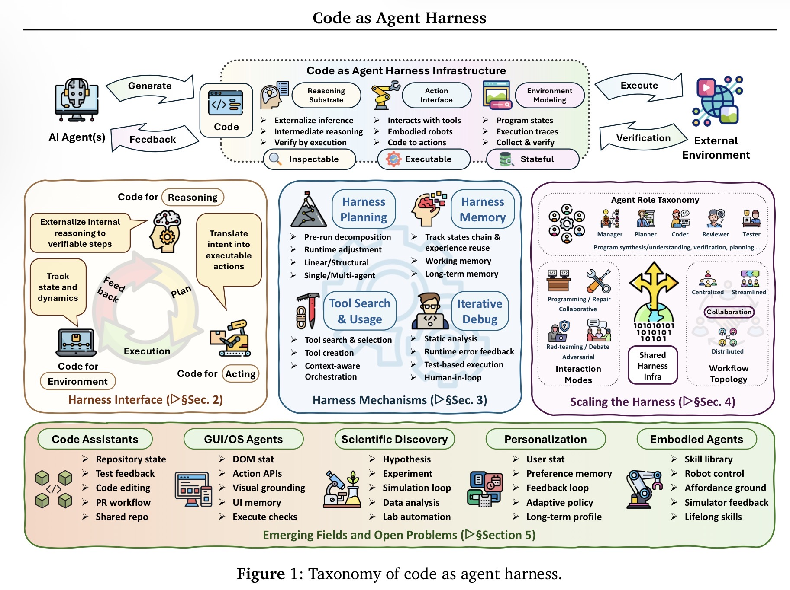

# Enterprise AI Needs Harness Engineering, Not Better Chatbots

## Abstract

Enterprise AI will not be differentiated by which model or chatbot a company adopts first. It will be differentiated by whether the organization builds a reliable agent harness: the executable, inspectable, stateful, and governed runtime around the model. The practical bottleneck is no longer only model reasoning quality. It is the system that retrieves the right context, uses tools safely, preserves state, verifies outcomes, captures approvals, and leaves an auditable trace. This note argues that harness engineering should be treated as a first-class enterprise discipline because that is where operational reliability, control, and trust are determined.

## Core thesis

The next practical frontier in enterprise AI is harness engineering, not chatbot refinement.

An agent harness is the layer around the model that provides tools, permissions, execution loops, memory, validators, telemetry, approval gates, and feedback channels. In enterprise settings, this harness determines whether an agent can safely operate inside real workflows. The model may propose a plan, but the harness determines:

- what context is visible;
- what actions are allowed;
- how state is persisted;
- how success is checked;
- when a human must approve; and
- how the full trace is audited afterward.

If enterprises want useful autonomy rather than impressive demos, they need to treat the harness as the product.

## Why the current framing is insufficient

Enterprise AI discussion is still too model-centered. Many decisions are framed as model selection, chatbot procurement, or copilot rollout. That framing made sense when the primary use case was question answering or lightweight assistance. It is less useful when agents are expected to inspect repositories, operate software, call APIs, use tools, prepare decisions, and execute bounded actions inside long-running workflows.

The shift is visible in *Code as Agent Harness: Toward Executable, Verifiable, and Stateful Agent Systems*. Xuying Ning et al. argue that code is no longer only what an agent generates. Code becomes the substrate through which an agent reasons, acts, maintains state, models its environment, and verifies progress. The paper examines this pattern across code assistants, GUI and OS agents, scientific discovery systems, and personalization agents. Read as an enterprise signal, the implication is straightforward: the key problem is not only how smart the model is, but how well the surrounding runtime governs autonomous work.

The paper’s main illustration is useful because it makes the harness concrete as a composed system rather than a vague wrapper around the model.



That matters because enterprise workflows are messy. They span APIs, SaaS tools, documents, tickets, dashboards, spreadsheets, approvals, and policy constraints. They are long-horizon, stateful, and often only partially reversible. A chatbot interface is not sufficient for that environment. A harness is.

## Mechanism and operating model

A useful way to think about an enterprise agent is as one component inside a controlled runtime.

```text
User / Business Process
        ↓
Intent Capture
        ↓
Planner
        ↓
Context + Memory Layer
        ↓
Shared Enterprise State Layer
        ↓
Policy / Permission / Approval Gateway
        ↓
Tool + API + MCP Gateway
        ↓
Sandboxed Execution / SaaS Executor
        ↓
Verification + Evidence Bundle
        ↓
Audit Log + Telemetry Store
        ↓
Harness Evaluation + Improvement Loop
```

This model shifts attention from generation to execution.

The model contributes reasoning. The harness contributes control.

In practice, the harness has at least six jobs:

1. **Context control**  
   Retrieve the right files, records, and prior decisions while enforcing authorization and freshness constraints.

2. **State management**  
   Persist what the agent knows, what it has done, and the current workflow state across time and across collaborating agents.

3. **Action governance**  
   Mediate tool access, permission boundaries, reversibility, and approval requirements before any high-impact write occurs.

4. **Verification**  
   Evaluate not only whether a task appears complete, but whether it used the right sources, respected policy, and produced a replayable execution trace.

5. **Observability**  
   Record telemetry, failures, retries, diffs, approvals, and outputs so operators can inspect what happened.

6. **Improvement**  
   Use traces and evaluation data to refine prompts, tool schemas, validators, policies, and workflow structure without introducing regressions.

This is why the paper’s emphasis on executable, verifiable, and stateful systems matters operationally. Once an agent is embedded in a harness, success is no longer determined by the base model alone. It depends on retrieval quality, tool interfaces, policy gates, oracles, state coordination, and verification logic.

## Concrete examples

### Example 1: Software lifecycle agents are the clearest enterprise template

The most mature version of this pattern is software engineering. Modern code agents do not only generate snippets. They inspect repositories, read issues, modify files, run tests, react to compiler feedback, and participate in pull-request loops. That is already a harnessed system: tool use, execution, validation, and feedback form a closed loop.

This matters beyond engineering teams because it shows the progression many enterprise workflows will follow:

1. answer a question;
2. retrieve context;
3. prepare a decision;
4. execute bounded actions; and
5. participate in a full operational loop.

The lesson is not that every business process should look like a code agent. The lesson is that useful autonomy emerges when the agent is embedded in a runtime that can inspect, act, verify, and recover.

### Example 2: Vendor risk review is a harness problem, not a chat problem

Consider a vendor risk workflow. A weak implementation asks a chatbot for a recommendation and treats the generated answer as the output. A stronger implementation treats the workflow as a governed state transition.

The agent gathers policy documents, ticket context, and the vendor profile. It runs sanctions screening and document completeness checks. It determines whether approval is required. It prepares a recommendation, but it does not directly execute the decision. Instead, it emits an evidence bundle and waits for an authorized reviewer.

A minimal evidence bundle could look like this:

```yaml
action_id: risk_review_approve_vendor_123
agent_goal: "Prepare vendor risk approval recommendation"
sources_used:
  - policy_doc: vendor-risk-policy-v4
  - ticket: VR-12093
  - vendor_profile: acme-payments-bv
checks_run:
  - sanctions_screening: passed
  - missing_documents: none
  - approval_threshold: requires_manager_approval
human_approval:
  required: true
  approver: team_lead
  timestamp: 2026-05-20T14:21:00Z
residual_risks:
  - "Financial statements older than 12 months"
final_state:
  recommendation: conditional_approval
  execution_status: not_executed_until_approval
```

The important output is not only a recommendation. It is a verifiable state transition with explicit evidence, approval status, and residual risk. That is harness engineering.

## Trade-offs and failure modes

Harness-centric systems solve real problems, but they introduce complexity of their own.

### Weak evaluation creates false confidence

A final answer can look plausible while the underlying process is wrong. An agent may use stale context, skip an approval, rely on an unauthorized source, or pass a shallow checker that misses an unacceptable intermediate action. Weak oracles produce brittle systems with polished outputs.

### Shared state divergence breaks multi-agent workflows

Multi-agent systems often fail because agents reconstruct reality from partial history instead of reading from a shared authoritative state. In enterprise environments, state is fragmented across Slack, email, tickets, documents, dashboards, and internal systems. Without explicit versioning, freshness checks, and reconciliation, agents drift apart.

### Approval cannot remain informal

Treating approval as a chat interaction is a governance failure. For high-impact workflows, approval must be durable state with a clear approver, scope, timestamp, and associated artifact. Otherwise, the system cannot reliably distinguish proposal from execution.

### UI-level automation is necessary and brittle

Many enterprise systems still require GUI interaction because APIs are incomplete or unavailable. GUI and OS agents make those workflows reachable, but the interface itself is unstable. Layout changes, accessibility gaps, hidden state, and ambiguous success criteria raise failure rates.

### Self-improving harnesses can regress silently

Telemetry can identify improvements to prompts, retrieval rules, validators, and permission policies. But a self-evolving harness without replay, regression testing, and staged rollout can degrade safety while appearing to improve productivity. Agent harnesses need their own CI discipline.

### Governance adds cost and latency

Evidence bundles, approval gates, audit logs, and validation layers all add overhead. That overhead is often justified, but it means harness engineering is not a shortcut. It is a deliberate trade: more control and reliability in exchange for more system design.

## Practical takeaways

1. **Treat the harness as the product boundary.**  
   Do not evaluate enterprise agent systems only by model quality or chat UX. Evaluate the runtime around the model.

2. **Measure workflows, not just answers.**  
   Success metrics should include tool-call correctness, source grounding, approval compliance, state consistency, replayability, cost, latency, and recovery behavior.

3. **Make approval a state transition.**  
   For high-risk actions, separate proposal, approval, execution, and audit into explicit steps.

4. **Build evidence bundles for serious actions.**  
   Every consequential workflow should emit sources used, checks run, required approvals, residual risks, and resulting state.

5. **Invest early in shared state and verification.**  
   Multi-agent systems and long-running workflows break quickly without authoritative state, freshness controls, and strong oracles.

## Positioning and scope

This note is not academic research. It does not attempt to prove a new theory or benchmark a novel architecture. It is an applied interpretation of agent-systems work, framed for operators who need to build reliable enterprise workflows.

It is also not a blog opinion piece. The argument is intentionally narrow: enterprise AI reliability will depend more on harness design than on chatbot polish. The purpose is to offer a durable systems model, not a hot take.

It is not vendor documentation either. Vendor materials usually describe product capabilities inside a single platform boundary. The concern here is broader: how to design governed, stateful, auditable agent runtimes across heterogeneous enterprise environments.

This is exploratory personal lab work, not an authoritative industry standard. The claims here are evidence-based but interpretive, and they extend agent-systems research into enterprise operating contexts. The intent is practical: to provide a useful frame for designing enterprise agent infrastructure, not to offer a complete reference architecture or validated control framework.

## References

- Xuying Ning et al., “Code as Agent Harness: Toward Executable, Verifiable, and Stateful Agent Systems”, arXiv:2605.18747v1, 18 May 2026. https://arxiv.org/abs/2605.18747
