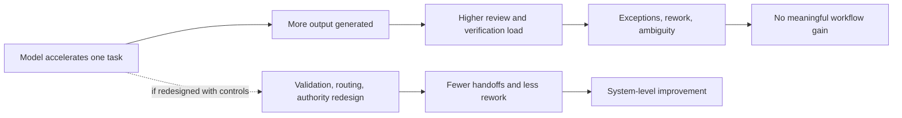
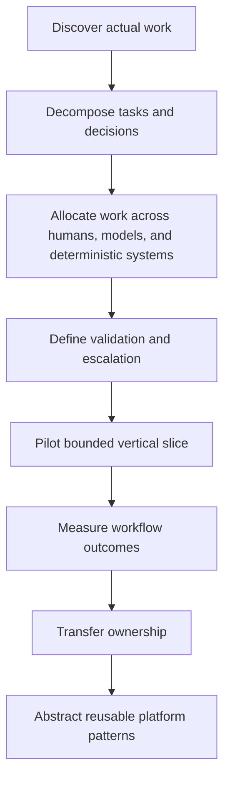
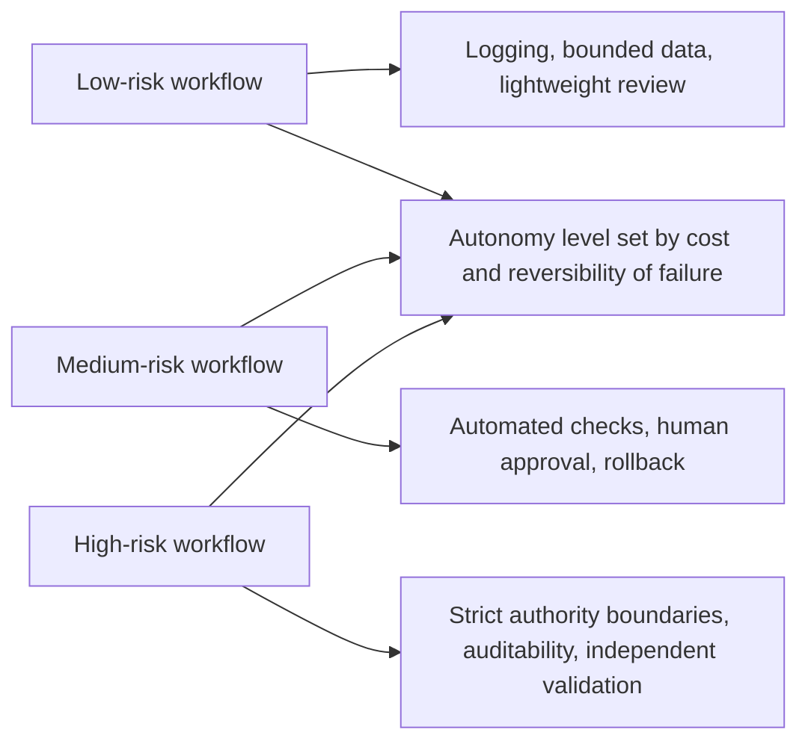
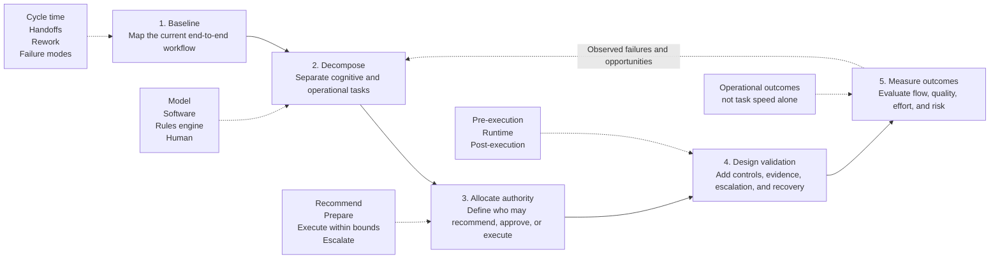

# Enterprise AI Adoption Is a Workflow Redesign Problem

Enterprise AI programs often fail for a simple reason: organizations deploy capable tools into workflows designed for human-only execution. The practical question is not whether a model can draft, classify, summarize, or recommend. The real question is whether the surrounding workflow, including data access, validation, escalation, authority, and ownership, has been redesigned so those capabilities produce durable system-level improvement.

This note argues that enterprise AI adoption should be treated as workflow redesign and adoption engineering, not as a software rollout.

## Why deployment alone does not compound

Many enterprise AI programs still begin the same way: buy licenses, expose users to a model, connect data, run training, and launch pilots. That sequence assumes local task acceleration will compound into organizational value.

In practice, the opposite often happens:

- one step becomes faster, but verification costs rise elsewhere
- more output is generated, but fewer decisions are closed
- teams gain a drafting assistant, but keep the same approvals, manual handoffs, and exception handling

The visible artifact changes. The operating system around it does not.

That gap matters more now because AI systems no longer sit on the sidelines as passive assistants. They increasingly participate in routing, drafting, retrieval, analysis, and action recommendation. As their scope expands, weak workflow design becomes the constraint more often than raw model capability.

## Core thesis

Enterprise AI adoption is not primarily a tooling problem. It is a workflow redesign problem.

The unit of transformation is not the model, chatbot, or agent. It is the full arrangement of tasks, decisions, data dependencies, controls, authorities, incentives, and handoffs through which work gets done.

A deployment changes what people can access. A redesigned workflow changes how the organization operates.

## The deployment fallacy

Traditional software rollouts often follow a plausible chain:

`acquire software -> configure software -> train users -> realize productivity gains`

That model works best when software encodes relatively stable, deterministic processes. Generative and agentic systems do not behave that way. Their outputs are probabilistic, context-sensitive, and uneven across adjacent tasks. [Research on the jagged technological frontier](https://doi.org/10.1287/orsc.2025.21838) shows that AI can improve speed and quality inside its capability boundary while degrading outcomes outside it. [[1]](https://doi.org/10.1287/orsc.2025.21838)

Local acceleration, therefore, is not evidence of system improvement.

A compliance team, for example, may cut first-draft time for a report from four hours to twenty minutes. If reviewers then spend three additional hours reconstructing sources, checking unsupported claims, and repairing subtle factual errors, the drafting task improved but the workflow did not.

This diagram shows the difference between task acceleration and workflow improvement.

## What a workflow actually contains

A workflow is more than a sequence diagram. It includes:

- task boundaries
- required data and its authority level
- system and human permissions
- decision criteria
- error-detection mechanisms
- escalation paths
- ownership after deployment
- local incentives
- unofficial workarounds that keep the process functioning

AI shifts the balance across all of these elements.

A superficial implementation inserts a model into one visible step, usually drafting or summarization. A redesign asks harder questions:

- Which inputs should be assembled before a human starts?
- Which sources are authoritative?
- Which steps need deterministic enforcement instead of model judgment?
- Which cases can be auto-prepared but not auto-approved?
- What evidence must be logged for later review?
- Which old steps can be removed rather than merely accelerated?

That is an engineering problem, not a prompt-writing problem.

## Workflow imagination matters more than prompt literacy

Prompt literacy helps, but it is not the main bottleneck in enterprise adoption. The more important capability is workflow imagination: the ability to decompose work and reallocate it across humans, models, deterministic systems, evaluators, and approval authorities.

That redesign requires three moves.

### Task decomposition

Most professional work is too coarse to automate as a single unit. "Automate contract review" hides tasks with very different risk profiles:

- document parsing
- clause classification
- entity extraction
- deviation detection
- legal interpretation
- risk acceptance
- final authorization

An LLM may help with classification, extraction, comparison, and drafting. It should not silently inherit authority to accept legal risk.

### Validation design

Probabilistic systems need explicit verification. For each step, an AI-enabled workflow should define:

- what gets checked
- how it gets checked
- who is accountable
- what happens when confidence is low
- how failures are recorded
- how the process falls back or rolls back

Validation is not an add-on. It is part of the workflow.

### Process reconfiguration

The biggest gains often come from changing process shape, not speeding up one step. AI can let work happen:

- in parallel rather than sequentially
- before the human opens the case
- with continuous checks instead of end-stage review
- through exception-based escalation instead of universal escalation

This diagram shows a practical model for redesigning a workflow around these constraints.

## Why technically successful pilots still fail

Many pilots prove that a model can perform a task under favorable conditions. That matters, but it is not enough.

A pilot does not establish production value until the organization knows:

- how exceptions are handled
- how the system integrates with real data and controls
- who owns failures
- how quality is measured
- whether users keep using it
- whether workflow metrics improve
- whether the capability survives beyond the pilot team

Several recurring failure modes show up across enterprise programs.

### Tool deployment without process redesign

This is the most common failure. AI is added on top of unchanged approvals, handoffs, and accountability structures. The result is more output and more review, not less work.

### Training without supported application

Generic AI literacy programs often teach prompting in the abstract while leaving operational barriers in place: no access to the right data, unclear policy, no manager support, no workflow owner, and no safe production path. The problem is not user enthusiasm. The problem is missing organizational support.

Programs such as [1Password's AI Champions](https://1password.com/blog/how-1password-is-building-a-culture-of-ai-fluency-through-ai-champions) are more useful because they connect domain-specific workflows, peer support, and reusable internal practice. [[6]](https://1password.com/blog/how-1password-is-building-a-culture-of-ai-fluency-through-ai-champions)

### Executive enthusiasm without manager alignment

Leaders can fund a strategy, but middle managers control time allocation, performance expectations, and tolerated failure. If managers are measured only on short-term throughput, blocking workflow experimentation is rational. Redesign costs time before it returns capacity.

### Innovation theater and pilot purgatory

Many AI programs optimize for visibility rather than learning. They produce demos, hackathon prototypes, and internal agents without a workflow owner, baseline metrics, production criteria, or handoff plan. These projects persist because they are interesting, not because they are operationally integrated.

### Governance paralysis

Enterprises often swing between under-controlled deployment and universal gating. Both approaches fail. Governance should be embedded in the workflow and scaled to the harm profile of the task.

This diagram shows a simple risk-based control model.

## A practical workflow-redesign model

When an enterprise team sits down to redesign a workflow around AI, they need more than a conviction that local automation is insufficient. They need a structured way to evaluate the workflow before and after the change.

The model below is a practitioner synthesis, not a new theory. It draws on workflow engineering, socio-technical systems, and operational measurement to provide a repeatable evaluation sequence.

The model is sequential, but not linear: measured outcomes feed back into decomposition, authority boundaries, and validation design.

Each stage constrains the next; skipping one usually moves cost or risk downstream rather than removing it.

### 1. Baseline the current workflow

Document how the workflow operates before introducing AI. Capture the trigger, the final outcome, participating roles and systems, major handoffs, cycle time, queue depth, rework rate, exception rate, review effort, failure modes, and compliance requirements.

The baseline must measure the complete workflow, not only the task selected for automation. Reducing drafting time from 40 minutes to 5 minutes is not meaningful if verification downstream adds another hour.

| Dimension | Baseline question |
|---|---|
| Outcome | What result must the workflow reliably produce? |
| Flow | Where does work wait, repeat, or move between teams? |
| Effort | Which steps consume the most human attention? |
| Risk | Where can errors create material consequences? |
| Evidence | What records are required for review or audit? |

### 2. Decompose the work

Break the workflow into discrete cognitive and operational tasks. Do not treat the job as one unit. Categories include information retrieval, context assembly, classification, extraction, drafting, calculation, decision support, approval, execution, monitoring, and exception handling.

For each task, assess input quality, output verifiability, error tolerance, frequency, variability, dependency on tacit knowledge, and reversibility.

Allocate tasks according to their characteristics: deterministic software for stable rules, models for interpretation and synthesis, evaluators for repeatable checks, humans for ambiguous judgment and accountability.

Decomposition should expose steps that can be removed, combined, reordered, or made continuous — not reproduce the existing workflow unchanged.

| Task | Best executor | Reason |
|---|---|---|
| Retrieve account history | System | Structured and deterministic |
| Summarize prior interactions | Model | High-volume synthesis |
| Check policy eligibility | Rules engine | Explicit policy constraints |
| Approve high-risk exception | Human | Accountability and contextual judgment |

### 3. Allocate authority

Define not only what the system can produce, but what it is permitted to decide or execute. For every task, specify an authority level:

1. **Recommend** — AI proposes; human decides.
2. **Prepare** — AI completes the work; human approves.
3. **Execute within bounds** — AI acts when explicit conditions are satisfied.
4. **Execute and report** — AI acts autonomously but produces evidence and remains observable.
5. **Escalate** — AI must stop and transfer control when confidence, risk, or policy thresholds are crossed.

Authority should be determined by consequence of error, reversibility, regulatory exposure, financial and customer impact, confidence quality, and policy clarity.

> Capability answers, "Can the system do this?" Authority answers, "Under what conditions is the system allowed to do this?"

| Task | Authority level | Boundary |
|---|---|---|
| Draft response | Prepare | Human approval required |
| Issue small refund | Execute within bounds | Maximum €50 and eligible policy case |
| Close fraud investigation | Recommend | Human investigator decides |
| Update CRM summary | Execute and report | Source links and audit log required |

### 4. Design validation

Validation is not a final review step — it is part of the workflow architecture. For each AI-supported task, define what must be checked, when the check happens, which mechanism performs it, what evidence is retained, and what happens when the check fails.

Mechanisms include schema validation, deterministic business rules, source-grounding checks, permission checks, confidence thresholds, model-based evaluators, reconciliation against systems of record, sampled human review, anomaly detection, and rollback.

Distinguish pre-execution controls that prevent unsafe actions from runtime controls that constrain behavior and post-execution controls that detect failures for audit and recovery.

Human review should be concentrated on ambiguity and risk, not applied uniformly. Otherwise automation moves the bottleneck into a review queue.

| Risk | Validation mechanism | Failure response |
|---|---|---|
| Unsupported factual claim | Source-grounding check | Regenerate or escalate |
| Policy violation | Deterministic policy engine | Block execution |
| Unusual transaction | Anomaly detector | Route to specialist |
| Low-confidence classification | Confidence threshold | Human review |

### 5. Measure workflow outcomes

Evaluate the redesigned workflow against operational outcomes, not model-centric metrics alone. Model accuracy, latency, and token cost are intermediate engineering indicators. They do not establish whether the workflow improved.

| Dimension | Before | After | Target |
|---|---:|---:|---:|
| Cycle time | 3 days | 8 hours | <12 hours |
| Human review rate | 100% | 22% | <25% |
| Rework rate | 18% | 7% | <8% |
| Cost per case | €42 | €19 | <€22 |
| Audit completeness | 71% | 99% | >98% |

Measure across four dimensions: **flow** (cycle time, handoffs, throughput), **quality** (first-pass rate, rework, compliance), **human effort** (attention per case, review burden, released capacity), and **risk** (error rate, escalation precision, audit completeness).

#### Worked example: customer-support resolution

**Before redesign:** An employee gathers context from several systems, AI drafts a response, a reviewer checks every draft, missing context causes rework, and total cycle time remains nearly unchanged despite faster drafting.

**After redesign:** Systems assemble context automatically, deterministic rules classify routine cases, AI drafts only where interpretation is required, policy checks run before execution, low-risk cases proceed without review, humans handle only exceptions, and evidence is logged for audit. Cycle time drops from 3 days to under 12 hours.

The improvement comes from changing task allocation, authority, validation, and handoffs — not from generating text faster.

---

A workflow is meaningfully redesigned only when the end-to-end system improves across flow, quality, human effort, and risk. Faster output from one task is not sufficient evidence of transformation.

## Adoption requires joint optimization

Socio-technical systems theory remains a useful frame here. [Trist and Bamforth](https://doi.org/10.1177/001872675100400101) showed that technical and social systems cannot be optimized independently without damaging overall performance. [[3]](https://doi.org/10.1177/001872675100400101) Enterprise AI follows the same rule.

The technical subsystem includes:

- models
- retrieval and context systems
- APIs and tools
- evaluation harnesses
- identity and access controls
- runtime infrastructure
- observability

The organizational subsystem includes:

- roles
- authority
- incentives
- trust
- management practice
- ownership
- professional norms

If an organization optimizes only the technical side, it gets impressive but fragile systems. If it optimizes only the organizational side, it gets strategy documents and training without working capability.

The target is joint optimization: a technically reliable system embedded in a workflow that people are authorized, motivated, and able to operate.

That is also why acceptance models are only partly sufficient. [Perceived usefulness and ease of use](https://doi.org/10.2307/249008) matter. [[4]](https://doi.org/10.2307/249008)[[5]](https://doi.org/10.2307/30036540) But enterprise adoption also depends on whether people have permission, data access, accountability clarity, and protected time to change how work gets done. [Weiner's framing of change commitment and change efficacy](https://doi.org/10.1186/1748-5908-4-67) is especially relevant here. [[2]](https://doi.org/10.1186/1748-5908-4-67)

## Forward-Deployed Engineering as adoption engineering

One practical operating model for this problem is Forward-Deployed Engineering.

At its best, FDE is not just implementation support. It combines:

- production engineering
- workflow discovery
- system integration
- domain learning
- evaluation design
- governance coordination
- stakeholder negotiation
- capability transfer

[Palantir's AI FDE material](https://palantir.com/docs/foundry/ai-fde/overview/) describes one formalized version of this pattern. [[7]](https://palantir.com/docs/foundry/ai-fde/overview/) Broader commentary from [First Round Review](https://review.firstround.com/so-you-want-to-hire-a-forward-deployed-engineer/) and [PostHog](https://posthog.com/blog/forward-deployed-engineer) points to the same underlying idea: useful systems are built close to operational reality, not at an abstract distance. [[8]](https://review.firstround.com/so-you-want-to-hire-a-forward-deployed-engineer/)[[9]](https://posthog.com/blog/forward-deployed-engineer)

A useful pairing is a technical operator who understands systems, models, and runtime constraints, plus a domain operator who understands institutional process, incentives, and failure costs. The labels matter less than the complement.

A strong internal adoption team should:

1. embed in a real workflow
2. observe the work as it is actually performed
3. identify a bounded bottleneck
4. build a complete vertical slice
5. measure effect in production terms
6. transfer ownership
7. abstract repeated patterns into platform primitives

The goal is not permanent dependence on embedded experts. The goal is to turn local discovery into reusable organizational capability.

## Concrete examples

### Example 1: customer support in a regulated environment

A weak implementation adds an AI drafting assistant after the support agent has already opened the case, collected context manually, searched policy, and decided what needs approval.

A better redesign changes the workflow:

- classify the request automatically on intake
- assemble customer, account, and policy context before the ticket opens
- distinguish deterministic policy checks from model-generated language
- route high-uncertainty or high-risk cases to human escalation immediately
- log the evidence used to generate the draft
- require approval only for cases above a defined threshold

The model still helps, but most of the value comes from changing routing, preparation, validation, and approval.

### Example 2: monthly operational reporting

A weak implementation uses AI to draft commentary after analysts manually gather and normalize data.

A better redesign assembles evidence continuously, detects anomalies upstream, drafts explanations against authoritative data, and routes only unresolved discrepancies to analysts. That reduces cycle time by removing manual reconciliation and narrowing human attention to exceptions.

In both cases, the important question is not "Did the model help?" It is "Did the workflow shed unnecessary work while preserving control?"

## Trade-offs and failure modes

This approach has real costs.

### It is slower at the beginning

Workflow redesign takes longer than tool rollout. Teams must observe real work, map exceptions, define controls, and build production pathways.

### It requires cross-functional cooperation

This work spans engineering, operations, legal, security, and line management. Many organizations are not set up to coordinate that cleanly.

### It can overfit to current process

A redesign may accidentally encode today's local process too tightly, including bad habits and temporary constraints.

### It does not remove hard judgment

Some tasks remain dominated by ambiguity, institutional responsibility, or legal accountability. AI can support them without replacing the human authority layer.

### It is easy to confuse motion with progress

Dashboards showing model usage, prompt volume, or active users can create false confidence. Those are operating indicators, not proof of workflow value.

## Practical takeaways

1. **Map the real workflow before adding AI.** Include unofficial handoffs, spreadsheets, shadow systems, and exception paths.
2. **Decompose work into tasks with separate failure costs.** Do not automate a broad label when only some substeps are suitable.
3. **Design validation before deployment.** Decide what gets checked, by whom, and with what fallback behavior.
4. **Measure workflow outcomes, not just tool activity.** Cycle time, rework, first-pass yield, exception load, and released capacity matter more than prompt counts.
5. **Treat adoption as a capability, not a campaign.** The durable asset is the organization's ability to redesign workflows repeatedly under governance.

## Conclusion

Enterprise AI adoption is often discussed as if employees need better tools, better prompts, or more enthusiasm. That framing is too shallow.

The difficult work is reconstructing the system around the model: tasks, data, authority, validation, management, incentives, governance, and ownership. Models will continue to improve. Access to capable models will diffuse. Individual features will be copied quickly. Durable advantage will come from an organization's ability to redesign work around probabilistic systems without losing control, accountability, or institutional knowledge.

A deployment changes what people can access. A redesigned workflow changes how the organization operates.

---

*This is an applied technical note based on current enterprise patterns, field observations, and published supporting material. It is not authoritative and does not replace domain-specific governance, legal review, or formal evaluation in regulated settings.*

## References

1. Dell'Acqua, F., McFowland, E., Mollick, E., et al. "[Navigating the Jagged Technological Frontier: Field Experimental Evidence of the Effects of AI on Knowledge Worker Productivity and Quality](https://doi.org/10.1287/orsc.2025.21838)." *Organization Science*, 2026.
2. Weiner, B. J. "[A Theory of Organizational Readiness for Change](https://doi.org/10.1186/1748-5908-4-67)." *Implementation Science*, 2009.
3. Trist, E. L., and Bamforth, K. W. "[Some Social and Psychological Consequences of the Longwall Method of Coal-Getting](https://doi.org/10.1177/001872675100400101)." *Human Relations*, 1951.
4. Davis, F. D. "[Perceived Usefulness, Perceived Ease of Use, and User Acceptance of Information Technology](https://doi.org/10.2307/249008)." *MIS Quarterly*, 1989.
5. Venkatesh, V., Morris, M. G., Davis, G. B., and Davis, F. D. "[User Acceptance of Information Technology: Toward a Unified View](https://doi.org/10.2307/30036540)." *MIS Quarterly*, 2003.
6. 1Password. "[How 1Password Is Building a Culture of AI Fluency Through AI Champions](https://1password.com/blog/how-1password-is-building-a-culture-of-ai-fluency-through-ai-champions)." 2026.
7. Palantir. "[AI FDE Overview](https://palantir.com/docs/foundry/ai-fde/overview/)."
8. First Round Review. "[So You Want to Hire a Forward Deployed Engineer](https://review.firstround.com/so-you-want-to-hire-a-forward-deployed-engineer/)."
9. PostHog. "[WTF Is a Forward Deployed Engineer](https://posthog.com/blog/forward-deployed-engineer)." 2026.
