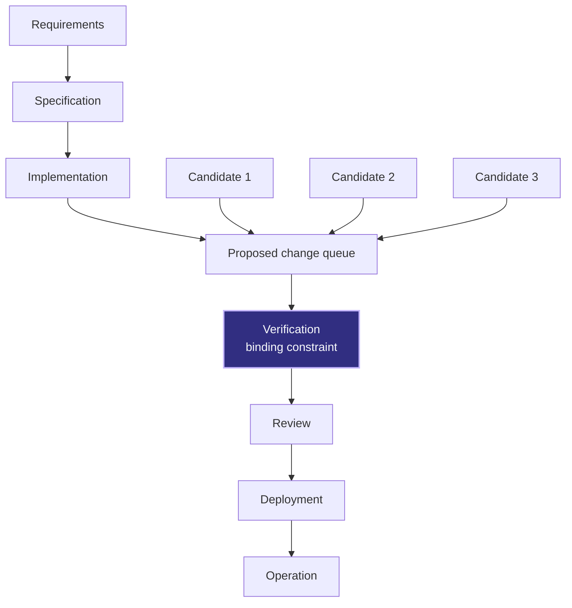
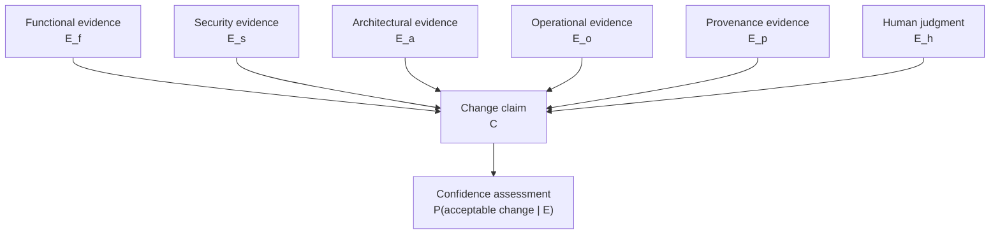
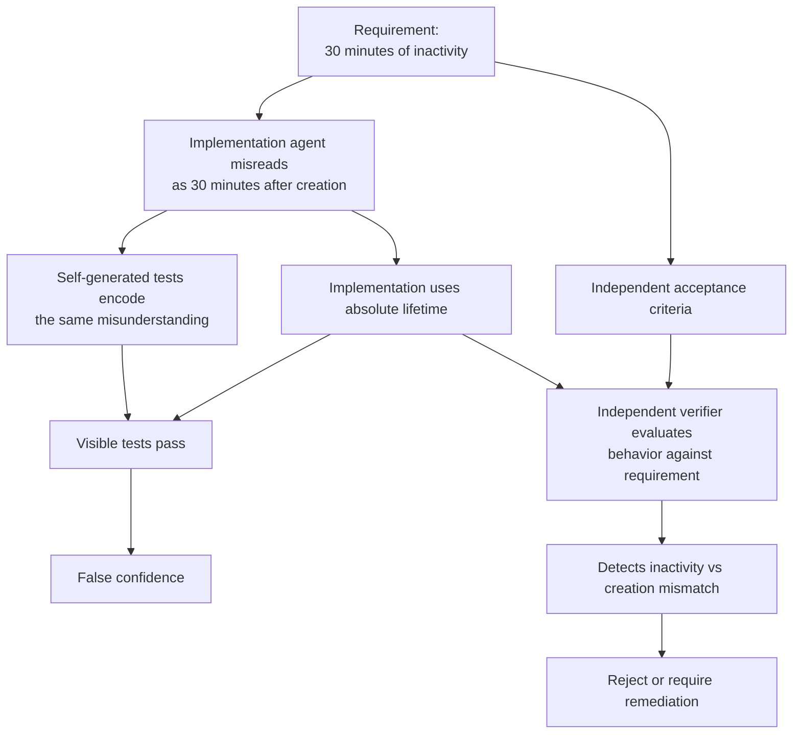
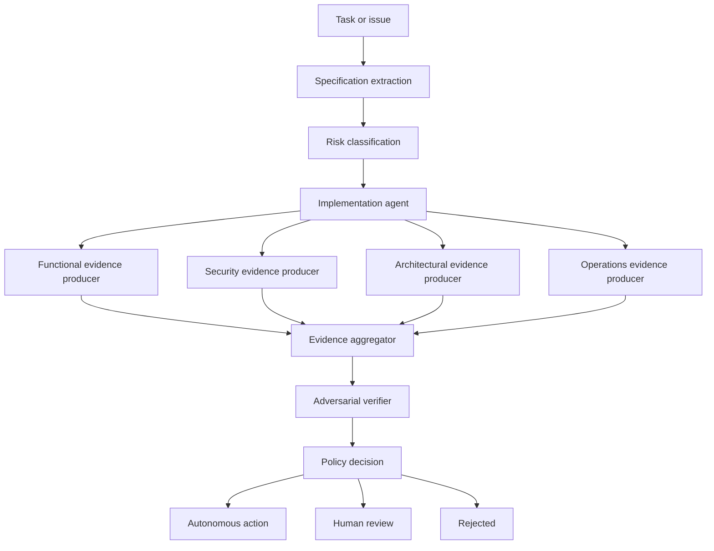

# Evidence-Carrying Changes: From AI Code Production to Verifiable Software Delivery

## Abstract

AI coding systems can now produce implementations, tests, migrations, and pull requests faster than many delivery processes can evaluate them. That does not mean software engineering has become uniformly faster. It suggests that, for some classes of work, implementation capacity is increasing faster than verification, review, integration, security assurance, and operational validation capacity. This note proposes **evidence-carrying changes**. Each consequential change should arrive with a structured claim, independent evidence, provenance, stated residual uncertainty, and a policy decision. Here, consequential means a change whose failure could materially affect users, data, money, security, or operations. The design draws on assurance cases, provenance systems, mutation testing, policy-as-code, and independent verification. The central hypothesis is that durable advantage in AI-assisted engineering may depend less on access to code generators and more on the ability to justify changes before they reach production.

## Context and motivation

AI coding systems can inspect repositories, modify multiple files, run commands, repair test failures, and prepare pull requests with limited human intervention. For bounded tasks, the marginal effort required to produce a plausible implementation has fallen sharply.

The effect on total engineering productivity is less settled.

In a randomized trial involving experienced open-source developers working on real issues in repositories they already knew, [METR](https://metr.org/blog/2025-07-10-early-2025-ai-experienced-os-dev-study/) found that the early-2025 AI tools it tested increased completion time by about 19 percent. The study population was narrow, the tools have since changed, and the result should not be generalized to all developers or tasks. METR later labeled this estimate outdated; a [follow-up experiment with late-2025 tools](https://metr.org/blog/2026-02-24-uplift-update/) produced weak evidence of speedups but faced substantial selection effects that prevented a reliable estimate. The original study still shows why local code-generation speed cannot be assumed to translate into system-level delivery speed.

Chen et al. found in a 2026 mixed-methods study at [BNY Mellon](https://arxiv.org/abs/2602.03593), based on 2,989 survey responses and 11 interviews, that no single activity measure captures developer productivity adequately. Participants described effects on expertise, ownership, quality, and long-term maintainability that commit counts or immediate task completion do not capture. The evidence is self-reported and organization-specific, but it reinforces a broader point: generated output is not the same as delivered value.

The practical question is therefore not whether AI improves productivity in the abstract. It is where capacity is added, where queues form, and which constraints become binding.

## Core thesis

**As AI lowers the cost of producing plausible code, the bottleneck in consequential software delivery shifts toward specification quality, verification quality, review quality, integration discipline, and operational judgment.**

That shift changes what must accompany a proposed change. A patch and a green test run are often not enough. The producer should also carry the supporting evidence that explains why the change is acceptable, what was actually evaluated, what remains uncertain, and which policy boundary governs the next step.

## 1. Code is becoming cheaper, justified change is not

A useful delivery model is:

```text
Requirements → Specification → Implementation → Verification → Review → Deployment → Operation
```

*Figure 1. Faster implementation creates a queue unless downstream validation capacity grows with it.*



As a heuristic, end-to-end throughput is constrained by the slowest meaningful stage:

```text
T_delivery ≈ min(T_spec, T_generation, T_verification, T_review, T_deployment)
```

This is not a precise empirical law. It is a constraint-oriented model. The formula above describes latency (time per change); throughput — accepted changes per unit of time — is bounded by the stage with the lowest capacity, not by elapsed stage time. [Amdahl's Law](https://en.wikipedia.org/wiki/Amdahl%27s_law) offers a useful analogy: accelerating one portion of a system has diminishing effect when the remaining portions dominate total time. Queueing theory offers a second warning: when arrivals approach or exceed a stage's service capacity, waiting time rises nonlinearly.

If an agent produces three times as many proposed changes while verification and review capacity remain unchanged, the result may be a larger queue rather than three times as much production value. More generated code can also create more integration paths, more dependency interactions, and more states that require operational validation.

The point is not that implementation has stopped mattering. It is that verification and integration are increasingly likely to become binding constraints where code generation accelerates faster than the surrounding delivery system.

## 2. A code change is a claim

A proposed code change is not merely a collection of modified files. It is an assertion about a system.

It claims that:

- the system should behave differently;
- the implementation satisfies an intended requirement;
- existing behavior remains acceptably preserved;
- the change complies with architectural and organizational constraints;
- the change is sufficiently safe to deploy;
- failures, if they occur, can be observed and handled.

Let:

```text
C = claim introduced by a proposed change
```

The delivery system evaluates that claim using evidence:

```text
E = E_f + E_s + E_a + E_o + E_p + E_h
```

where:

- `E_f`: functional evidence;
- `E_s`: security evidence;
- `E_a`: architectural evidence;
- `E_o`: operational evidence;
- `E_p`: provenance evidence;
- `E_h`: human-judgment evidence.

*Figure 2. Multiple evidence classes feed one change claim, which then updates confidence rather than proving correctness.*



The crucial distinction is:

```text
Evidence exists ≠ The artifact is correct
```

Instead, evidence changes confidence:

```text
P(acceptable change | E)
```

This probability need not be computed numerically. The expression makes the epistemic relationship explicit: a test report, scan, approval, or attestation changes what can reasonably be believed about a change, but none establishes universal correctness.

This framing resembles an assurance case more than a conventional CI status page. [Goal Structuring Notation](https://scsc.uk/gsn), for example, represents relationships between claims, supporting arguments, contextual assumptions, and evidence. A diagram does not itself prove safety. It exposes how the argument is constructed and where it depends on incomplete or contested evidence.

It also resembles [proof-carrying code](https://dl.acm.org/doi/10.1145/263699.263712) in a limited conceptual sense. In proof-carrying code, an untrusted producer supplies code together with a machine-checkable proof that it satisfies a defined safety policy. An ordinary evidence package is much weaker. Tests, scans, and approvals are not mathematical proofs. The transferable design principle is that the producer should carry the burden of supplying verifiable support for its claims rather than asking the consumer to reconstruct that support from scratch.

## 3. What counts as software evidence

Evidence is useful only relative to a claim. "All tests passed" is weak evidence when the requirement is ambiguous, the tests cover only the happy path, or the test oracle reproduces the same mistaken assumption as the implementation.

An evidence-carrying change should therefore distinguish evidence classes rather than collapse everything into one green status.

### Functional evidence

Functional evidence addresses whether the implementation behaves according to its specification.

Examples include:

- unit tests;
- integration tests;
- end-to-end tests;
- property-based tests;
- differential testing;
- regression tests;
- mutation testing;
- formal specifications;
- model checking or theorem proving where justified.

Different techniques expose different defect classes. Unit tests can isolate local behavior but often miss interactions. End-to-end tests exercise realistic paths but may be slow, flaky, and hard to diagnose. Property-based testing explores families of inputs rather than individual examples, but its value depends on whether the stated properties capture meaningful correctness.

[Mutation testing](https://dl.acm.org/doi/10.1109/C-M.1978.218136) evaluates the test suite rather than the implementation directly. It introduces controlled faults and asks whether the tests detect them. A high mutation score does not guarantee correctness, but a low score shows that many plausible faults can survive the suite.

### Security evidence

Security evidence addresses bounded classes of vulnerability and policy violation.

Examples include:

- static application security testing;
- taint analysis;
- dependency and supply-chain scanning;
- secret detection;
- privilege checks;
- policy checks;
- adversarial inputs;
- sandbox execution;
- dynamic security testing;
- authorization-path analysis.

A clean scan is evidence of non-detection under a particular tool, configuration, rule set, and code path. It is not proof that vulnerabilities are absent.

[NIST's Secure Software Development Framework](https://csrc.nist.gov/projects/ssdf) treats secure development as a set of practices integrated throughout the software lifecycle rather than a final scan attached to a release. Security evidence should therefore record tool versions, rule configurations, suppressions, scan coverage, and unresolved findings. Otherwise, "security passed" communicates almost nothing about what was evaluated.

### Architectural evidence

Architectural evidence establishes whether a change conforms to system structure and repository-specific constraints.

Examples include:

- dependency-direction rules;
- forbidden imports;
- module boundaries;
- layering constraints;
- API compatibility;
- schema compatibility;
- performance budgets;
- repository conventions;
- data residency constraints;
- approved integration patterns.

This category matters because a functionally correct local change can still be systemically unacceptable. It may couple domains that were intentionally isolated, bypass an authorization layer, introduce a new dependency class, or violate an operational ownership boundary.

Executable constraints are often more dependable than long procedural prompts. A prompt can tell an agent not to import a storage client into a domain module. A conformance test can make the violation unmergeable.

Recent agent-development experiments support this distinction, but the evidence is provisional. In [TDAD](https://arxiv.org/abs/2603.17973), an AST-derived code-test graph was used to surface likely affected tests to coding agents. In the authors' reported SWE-bench Verified runs, that structural context reduced test-level regressions from 6.08% to 1.82%, while procedural TDD prompting alone produced a 9.94% regression rate. The evaluation was limited to particular models, subsets, and a benchmark environment. It is evidence for a promising mechanism, not a universal law.

### Operational evidence

Pre-merge correctness is not production correctness.

Operational evidence addresses behavior under deployment and runtime conditions:

- load and stress tests;
- canary results;
- rollback verification;
- observability coverage;
- alert validation;
- service-level objective impact;
- production anomaly detection;
- fault injection;
- capacity margins;
- compatibility with real traffic and data distributions.

Many important properties are observable only after integration or deployment. Provider timeouts may differ from simulations. Data cardinality may invalidate local performance assumptions. A retry mechanism may pass integration tests but amplify load during an outage.

An evidence-carrying change should therefore support evidence that matures over time. Before merge, it may contain simulated fault-injection results. After canary deployment, the same change record can be extended with production latency, error rate, and rollback evidence.

### Provenance evidence

Provenance establishes where an artifact and its supporting evidence came from.

Examples include:

- source revision;
- model and harness version;
- human principal;
- agent or workload identity;
- tool-call trace;
- referenced sources;
- dependency versions;
- environment hash;
- artifact hash;
- authorization decisions;
- build identity;
- evidence timestamps.

Supply-chain systems already provide useful primitives. [SLSA](https://slsa.dev/provenance) defines provenance as verifiable information describing where, when, and how an artifact was produced. [in-toto](https://in-toto.io/) records what supply-chain steps were performed, by whom, and in what order. [Sigstore](https://www.sigstore.dev/) provides signing and transparency mechanisms. These systems do not establish semantic correctness, but they make evidence attributable and tamper-evident.

The same principle should apply to AI-generated changes. A text field claiming that tests passed is weak provenance. A signed attestation bound to an artifact hash, runner identity, test command, environment, and output is substantially stronger.

### Human-judgment evidence

Some claims cannot be reduced reliably to deterministic checks.

Human judgment may still be required for:

- product acceptance;
- domain interpretation;
- legal and regulatory analysis;
- architecture trade-offs;
- user-experience quality;
- ethical impact;
- risk acceptance;
- interpretation of ambiguous requirements.

Human approval should not be treated as an undifferentiated checkbox. The record should state what the reviewer evaluated, the information available, unresolved objections, and the scope of the approval.

## 4. Evidence quality matters more than evidence volume

Evidence volume is easy to optimize and easy to game. Evidence quality is harder.

A harness could generate hundreds of tests that execute lines without asserting meaningful properties. It could run multiple scanners with overlapping rule sets and present overlapping detections as independent confirmation. It could ask five agents based on the same model to review the same patch and count five approvals.

The relevant question is not "How much evidence was produced?" It is "How strongly does this evidence discriminate between an acceptable and unacceptable change?"

Four properties deserve special attention.

### Coverage

Coverage asks whether the evidence addresses the important parts of the claim.

Code coverage can reveal unexecuted paths but cannot determine whether executed paths were evaluated correctly. Requirement coverage is often more valuable: which acceptance criteria, invariants, threat scenarios, and operational assumptions have corresponding evidence?

### Oracle strength

An oracle decides whether observed behavior is acceptable.

Weak oracles are common in generated tests. They may assert that a function returns a value without checking its semantics, snapshot an incorrect output, or merely verify that execution does not throw.

Mutation testing is useful because it measures whether the suite notices plausible faults. Hidden behavioral tests add another layer: the implementation and its visible tests cannot tailor themselves directly to every evaluation case.

A 2026 study on [test-driven AI agent definition](https://arxiv.org/abs/2603.08806) combined visible tests, hidden tests, and semantic mutation testing. Across 24 trials on four purpose-built agent specifications, the authors reported 92% initial compilation success and a 97% mean hidden-test pass rate. Compilation success fell to 58% once the specifications evolved, with mutation scores between 86% and 100%. The study is small and purpose-built. Its broader contribution is methodological: visible tests alone can overstate compliance, and verifier quality should itself be evaluated.

### Independence

Evidence is stronger when its failure modes are not tightly correlated with the implementation process.

Independence is not binary. It exists on a spectrum:

1. same model, same context, same agent;
2. same model, separate role, with parts of the implementation context withheld;
3. different model family or independently constructed verifier;
4. deterministic or externally grounded verification.

The fourth arrangement is usually strongest for properties that can be encoded deterministically. A compiler, type checker, policy engine, database constraint, or reproducible benchmark does not share a language model's conversational interpretation in the same way another agent might.

But deterministic tools can still share a flawed specification or incomplete rule set. Independence reduces some correlated failures. It does not remove specification risk.

Research on [N-version programming](https://ntrs.nasa.gov/citations/19900041359) provides a useful warning. Diverse implementations can improve fault tolerance only when their failures are sufficiently independent. Experiments have found correlated failures even among separately developed implementations because difficult inputs and shared specifications create common fault patterns.

### Provenance

Evidence without provenance is hard to evaluate or reproduce.

A report should bind each result to:

- the exact source and artifact revisions;
- the command or procedure executed;
- the environment;
- the tool and rule versions;
- the producing identity;
- the timestamp;
- the raw output;
- any transformations used to summarize it.

The summary should be treated as a view over primary evidence, not the evidence itself.

## 5. Why self-generated tests can produce false confidence

Consider a requirement:

> Expired sessions must be rejected after 30 minutes of inactivity.

An agent interprets this as "30 minutes after creation," implements an absolute lifetime check, and generates tests using the same interpretation. All tests pass.

The implementation, tests, and explanation are internally consistent. They are also wrong.

This is a correlated-failure problem:

1. the model misunderstands the requirement;
2. it generates an implementation from that misunderstanding;
3. it generates tests encoding the same misunderstanding;
4. the tests pass;
5. the system reports high confidence.

*Figure 3. A shared misunderstanding can produce a passing test suite, while an independent verifier path catches the requirement mismatch.*



Self-generated tests still have value. They can catch implementation mistakes relative to the model's interpretation, exercise edge cases, and improve local regression protection. What they cannot do by themselves is validate the interpretation from which both code and tests were derived.

A stronger arrangement separates specification, implementation, and evaluation:

- human- or policy-owned acceptance criteria are established first;
- some behavioral tests remain hidden from the implementation agent;
- deterministic constraints evaluate architectural and security properties;
- a verifier is given the requirement and resulting behavior, but not the implementation agent's rationale;
- mutation testing measures whether the suite detects plausible defects;
- residual uncertainty records properties that cannot yet be tested.

The goal is not maximal disagreement between agents. It is useful independence from the change generator's blind spots.

## 6. Risk-calibrated evidence requirements

Uniform verification is inefficient.

Requiring formal review, adversarial testing, signed attestations, and staged deployment for a documentation typo would create process without proportional risk reduction. Allowing a payment-authorization change to merge after linting and self-generated unit tests would be reckless.

Evidence requirements should increase with risk:

```text
R = f(expected_harm, reversibility, blast_radius, data_sensitivity, privilege, customer_proximity, regulatory_impact, novelty, observability)
```

This function need not initially be numerical. A rule-based classifier may be more transparent and easier to audit.

### Tier 1: Low-risk and reversible

Examples:

- local scripts;
- internal prototypes;
- documentation;
- isolated developer tooling;
- non-production examples.

Possible requirements:

- basic execution;
- formatting and linting;
- targeted tests;
- artifact and actor provenance;
- explicit declaration of affected files.

Autonomous merge may be acceptable where changes are readily reversible and isolated.

### Tier 2: Operational or customer-facing

Examples:

- production SaaS features;
- API changes;
- dependency upgrades;
- service configuration;
- user-facing workflows.

Possible requirements:

- unit and integration tests;
- architecture checks;
- security and dependency scanning;
- mutation threshold for critical logic;
- rollback evidence;
- human review;
- provenance attestations.

### Tier 3: High-impact or regulated

Examples:

- payment logic;
- identity and authorization;
- database migrations;
- personal-data processing;
- compliance controls;
- irreversible state transitions.

Possible requirements:

- independent verification;
- hidden behavioral tests;
- adversarial testing;
- formal approval by named roles;
- signed attestations;
- policy-engine enforcement;
- staged deployment;
- runtime monitoring;
- explicit rollback or compensating actions;
- separation of duties.

These tiers are a proposed engineering model, not a validated universal standard. Organizations should calibrate them using incident history, regulatory obligations, architecture, and operational maturity.

Make the policy decision deterministic where practical. [Open Policy Agent](https://openpolicyagent.org/docs) is a good example of a declarative engine that evaluates structured evidence against release rules. An LLM may classify ambiguous evidence or flag gaps, but it should not decide whether its own output satisfies release policy. Independence here is best treated as a spectrum, not a binary label.

## 7. The evidence-carrying change format

An evidence-carrying change can be represented as a machine-readable artifact:

```yaml
claim:
  intent: "Add idempotent payment retry handling"
  specification_version: "payments-spec@8b71ac"
  changed_artifacts:
    - src/payments/retry.ts
    - tests/payments/retry.test.ts

evidence:
  functional:
    unit_tests: passed
    integration_tests: passed
    mutation_score: 0.83

  architectural:
    dependency_policy: passed
    forbidden_imports: passed

  security:
    static_analysis: passed
    secret_scan: passed

  operational:
    load_test_report: artifacts/retry-load.json
    rollback_verified: true

  provenance:
    model: "<model name and version>"
    harness_version: "0.1.0"
    human_principal: "user://..."
    agent_identity: "agent://..."
    environment_hash: "sha256:..."
    artifact_hash: "sha256:..."

residual_uncertainty:
  - "Provider timeout behavior is simulated"
  - "No production traffic evidence is available yet"

decision:
  risk_tier: 2
  policy_result: "REQUIRE_HUMAN_APPROVAL"
```

The `residual_uncertainty` field is not an optional disclaimer. It is part of the core data model.

A binary pass/fail interface encourages epistemic compression. It hides the difference between "the property was verified," "the tool did not detect a violation," "the property was simulated," and "the property was not evaluated."

Residual uncertainty should be structured where possible:

```yaml
residual_uncertainty:
  - claim: "Retries remain safe under provider-side partial failure"
    reason: "Provider sandbox cannot reproduce partial commit behavior"
    impact: "Possible duplicate external charge"
    mitigation: "Canary limited to internal merchant accounts"
    owner: "payments-platform"
    expires_after: "production canary"
```

This turns uncertainty into something that can be owned, monitored, and resolved.

## 8. Architecture of an evidence-carrying change harness

*Figure 4. The harness separates change production from evidence production, then applies adversarial verification and policy before any action is accepted.*



### Specification extractor

The extractor converts a task into explicit claims, acceptance criteria, invariants, non-goals, and unresolved questions.

It should distinguish source material from inferred requirements. An agent-generated assumption must not silently become an authoritative acceptance criterion.

### Risk classifier

The classifier determines the provisional risk tier.

Some signals can be deterministic:

- files under identity or payment modules;
- schema or migration changes;
- privilege modifications;
- customer-facing APIs;
- personal-data access;
- irreversible actions.

An LLM can assist with semantic interpretation, but the final tier should be explainable and subject to policy rules. Uncertain classification should move upward in risk rather than silently default downward.

### Implementation worker

The worker produces the proposed change. It receives the specification and repository context, but it should not control all evidence production. It may generate candidate tests and explanations, which remain producer-supplied evidence rather than independent validation.

### Independent evidence producers

These include:

- compilers and type checkers;
- unit and integration runners;
- dependency analyzers;
- mutation testing;
- static security analysis;
- architecture tests;
- API and schema compatibility checks;
- load or rollback probes;
- provenance attestors.

Tool outputs should be retained as primary artifacts and normalized into the evidence schema.

### Adversarial verifier

The verifier challenges the proposed change rather than improving it. Its inputs may include the specification, diff, selected repository context, test results, and historical incidents. It should search for:

- untested requirements;
- specification ambiguity;
- incorrect assumptions;
- missing failure modes;
- inconsistent evidence;
- suspiciously weak assertions;
- paths through which the implementation can satisfy tests while violating intent.

Its findings are advisory unless converted into deterministic policy conditions or accepted by an accountable reviewer.

### Policy engine

The policy engine evaluates structured evidence against risk-dependent requirements.

```text
IF risk_tier == 3
AND independent_verification != passed
THEN decision = REJECT

IF risk_tier >= 2
AND rollback_verified != true
THEN decision = REQUIRE_REMEDIATION

IF residual_uncertainty contains "possible irreversible loss"
THEN decision = REQUIRE_NAMED_RISK_OWNER
```

Possible outcomes include:

- autonomous action;
- human approval required;
- additional evidence required;
- rejected;
- deployment restricted to a canary;
- accepted with monitored uncertainty.

## 9. Human review, skill, and organizational design

AI-assisted development shifts the human role from generating solutions to supervising, diagnosing, and evaluating them.

That transition creates several risks.

### Automation bias

Reviewers may over-trust a system because it appears systematic. A detailed evidence report, signed attestation, or green dashboard can increase confidence even when the underlying oracle is weak.

### Instant-gratification bias

Generated solutions reduce the delay between a question and a plausible answer. That can encourage early commitment before the problem has been understood.

A 2026 study on [cognitive biases in LLM-assisted software development](https://arxiv.org/abs/2601.08045) identified several supervisory biases, including instant gratification and preference for the model's suggestion. The sample is small and exploratory. The stronger conclusion is that AI-assisted programming introduces identifiable review biases that tool design should address.

### Reviewer fatigue

Increasing the volume or size of generated changes without improving evidence can overwhelm reviewers. Fatigued reviewers are more likely to rely on summaries, familiar patterns, or CI status.

The answer is not necessarily more human review. It is better allocation of human attention: deterministic checks for machine-verifiable properties, independent evidence for likely correlated failures, and human judgment for ambiguous or consequential decisions.

### Cognitive offloading and skill decay

When implementation is delegated, engineers may lose some of the mental model they normally acquire by constructing the solution.

Aviation automation is a useful but limited analogy. The transferable concern is that supervisors may become less able to detect rare failures when routine execution is delegated.

Organizations may need deliberate practices for maintaining system knowledge:

- manual investigation of selected incidents;
- design reconstruction exercises;
- rotation through verification and operations;
- review of rejected agent changes;
- explicit testing of engineers' system models;
- pairing human reviewers with evidence gaps rather than only successful outputs.

The goal is not to preserve manual coding for its own sake. It is to preserve the capacity to understand, challenge, and recover from automated decisions.

## 10. Metrics for validated engineering progress

AI-assisted engineering should not be evaluated primarily by:

- lines of code;
- commits;
- pull-request volume;
- suggestion acceptance;
- story points;
- agent tokens;
- tasks attempted.

These metrics may measure activity while rewarding larger changes, fragmented commits, superficial task decomposition, or unnecessary generation.

More useful metrics include:

- lead time to validated production value;
- escaped defect rate;
- change failure rate;
- review time;
- evidence-generation cost;
- mutation score;
- false-acceptance rate;
- false-rejection rate;
- rollback success;
- percentage of claims with adequate provenance;
- percentage of material uncertainty disclosed;
- reviewer confidence calibration;
- evidence freshness;
- evidence reuse rate.

No single metric is sufficient. Metrics should be treated as a balanced measurement system. [Goodhart's Law](https://en.wikipedia.org/wiki/Goodhart%27s_law) applies: once a measure becomes the target, pressure grows to optimize the measure rather than the outcome.

## 11. Limits of the evidence

The empirical literature on modern coding agents is young, fast-moving, and hard to compare.

First, tool capability changes quickly. Results produced using early-2025 models may not describe 2026 systems. The METR slowdown study is rigorous within its setting, but it concerns experienced contributors working on mature repositories they already understood.

Second, benchmarks and production environments differ. SWE-bench-style evaluations offer reproducibility but cannot capture all integration, operational, security, and organizational costs.

Third, observational studies face attribution problems. A 2026 study of explicitly identified AI-authored commits, [Debt Behind the AI Boom](https://arxiv.org/abs/2603.28592), found many static-analysis issues and tracked some persisting in later repository revisions. It captures only commits with explicit AI metadata, depends on static analyzers' definitions, and does not establish how equivalent human-authored changes would have performed under matched conditions.

Fourth, evidence-carrying changes remain an architectural proposal. Supply-chain attestations, assurance cases, mutation testing, policy engines, and independent verification are established ideas, but their combination into an AI coding harness has not yet been validated across organizations.

Open questions include:

- Which evidence classes reduce escaped defects most cost-effectively?
- How much verifier diversity is required to reduce correlated failures?
- Can evidence requirements be calibrated without creating excessive process?
- How should confidence be represented without misleading numerical precision?
- When should evidence expire?
- How should runtime evidence update pre-merge assurance?
- Can reviewers accurately calibrate confidence from evidence reports?
- Does an evidence package reduce review effort, or merely move effort into evidence interpretation?
- How often do agents learn to satisfy the verifier without satisfying intent?
- Which residual uncertainties are routinely omitted?

Evidence-first engineering can increase confidence. It cannot prove total correctness, eliminate human responsibility, or make an invalid specification valid.

## 12. Companion experiment and open-source implementation

The companion project is an intentionally narrow verification harness built to test the central hypothesis:

> Do evidence-carrying changes reduce reviewer effort and escaped defects compared with conventional agent-generated pull requests?

The initial implementation is available in the [rmax-ai/evidence-first-harness](https://github.com/rmax-ai/evidence-first-harness) repository. The repository should be read as an experimental harness, not as a finished reference architecture.

The experiment should compare four conditions:

1. human implementation with conventional CI;
2. agent implementation with conventional CI;
3. agent implementation with self-generated tests;
4. agent implementation with independently produced evidence.

The evaluation should measure:

- task completion rate;
- escaped defects;
- mutation score;
- reviewer time;
- reviewer confidence;
- confidence calibration;
- false acceptance;
- false rejection;
- evidence-generation cost;
- total lead time;
- model cost;
- change failure rate.

The first version should remain deliberately constrained:

- one language ecosystem;
- one test framework;
- static analysis;
- type checking;
- mutation testing;
- a machine-readable `evidence.json`;
- an HTML evidence report;
- GitHub pull-request integration;
- two or three risk tiers.

It should explicitly exclude:

- generic enterprise workflow orchestration;
- distributed schedulers;
- complex policy administration;
- broad multi-language support;
- Kubernetes;
- Temporal;
- production deployment automation;
- autonomous merging of high-risk changes.

The project's purpose is not to demonstrate a polished autonomous engineering platform. It is to determine whether structured, independently generated evidence changes measurable software-delivery outcomes.

## Practical takeaways

1. Treat every consequential code change as an explicit claim, not just a diff.
2. Separate producer-supplied evidence from independent evidence, and record the difference.
3. Require provenance that binds evidence to the exact artifact, environment, toolchain, and identity that produced it.
4. Make residual uncertainty first-class. Unknowns should be named, scoped, owned, and expired.
5. Scale evidence requirements with risk. Do not run the same gate for a docs typo and a payment-path migration.

## Positioning

This note is not an academic proof, a vendor architecture guide, or a claim that current AI coding systems can justify their own output reliably. It is an operator-oriented design proposal for software delivery teams that already face growing implementation capacity and uneven validation capacity.

It also does not argue that every organization should build a full evidence harness immediately. Teams with simple workflows, small blast radius, or weak specification discipline may add more process than value if they adopt the full model too early.

## Status and scope disclaimer

This is personal lab work, not an authoritative standard. It combines established assurance ideas with early evidence from AI-assisted software development and proposes a concrete harness. The central claim still needs controlled evaluation: evidence-carrying changes may reduce reviewer effort and escaped defects, but this article does not prove that yet.

## Conclusion

The declining cost of producing plausible code does not remove the need for specification, verification, review, integration, security assurance, or operational judgment. It changes their relative importance.

A code-generating agent should not hand a reviewer only a patch and a statement that tests passed. It should produce an evidence-carrying change. That package should state the intended behavior, include evidence from multiple relevant and independent sources, record provenance, disclose residual uncertainty, and report a deterministic policy result.

This architecture does not guarantee correctness. Tests can encode the wrong specification. Scanners can miss vulnerabilities. Independent agents can share correlated blind spots. Human reviewers can over-trust polished reports. Production can invalidate pre-deployment assumptions.

The value of the evidence-carrying approach is therefore not certainty. It is disciplined uncertainty management.

## References

1. Sabry E. Farrag, ["The Productivity-Reliability Paradox: Specification-Driven Governance for AI-Augmented Software Development"](https://arxiv.org/abs/2605.01160), 2026.
2. Valerie Chen et al., ["Beyond the Commit: Developer Perspectives on Productivity with AI Coding Assistants"](https://arxiv.org/abs/2602.03593), 2026.
3. METR, ["Measuring the Impact of Early-2025 AI on Experienced Open-Source Developer Productivity"](https://metr.org/blog/2025-07-10-early-2025-ai-experienced-os-dev-study/), 2025.
4. METR, ["Research Update: Towards Reconciling Slowdown with Time-Horizon Evaluations"](https://metr.org/blog/2025-08-12-research-update-towards-reconciling-slowdown-with-time-horizons/), 2025.
5. Stanford Software Engineering Productivity Research, [research programme](https://softwareengineeringproductivity.stanford.edu/).
6. Yue Liu et al., ["Debt Behind the AI Boom: A Large-Scale Empirical Study of AI-Generated Code in the Wild"](https://arxiv.org/abs/2603.28592), 2026.
7. Xinyi Zhou et al., ["Cognitive Biases in LLM-Assisted Software Development"](https://arxiv.org/abs/2601.08045), 2026.
8. Pepe Alonso, ["TDAD: Test-Driven Agentic Development, Reducing Code Regressions in AI Coding Agents via Graph-Based Impact Analysis"](https://arxiv.org/abs/2603.17973), 2026.
9. Tzafrir Rehan, ["Test-Driven AI Agent Definition: Compiling Tool-Using Agents from Behavioral Specifications"](https://arxiv.org/abs/2603.08806), 2026.
10. George C. Necula, ["Proof-Carrying Code"](https://dl.acm.org/doi/10.1145/263699.263712), POPL, 1997.
11. S. S. Brilliant, J. C. Knight, and N. G. Leveson, ["Analysis of Faults in an N-Version Software Experiment"](https://ntrs.nasa.gov/citations/19900041359), IEEE Transactions on Software Engineering, 1990.
12. Assurance Case Working Group, [Goal Structuring Notation Community Standard](https://scsc.uk/gsn).
13. NIST, [Secure Software Development Framework](https://csrc.nist.gov/projects/ssdf).
14. NIST, [SP 800-218: Secure Software Development Framework Version 1.1](https://csrc.nist.gov/pubs/sp/800/218/final), 2022.
15. SLSA, [Provenance specification](https://slsa.dev/provenance).
16. in-toto, [Software supply-chain integrity framework](https://in-toto.io/).
17. Sigstore, [Software signing and transparency project](https://www.sigstore.dev/).
18. Open Policy Agent, [official documentation](https://openpolicyagent.org/docs).
19. Open Policy Agent, [Using OPA in CI/CD Pipelines](https://openpolicyagent.org/docs/cicd).
20. SPIFFE and SPIRE, [workload-identity documentation](https://spiffe.io/docs/latest/spire-about/).
21. GitHub, [Spec Kit](https://github.com/github/spec-kit).
22. NIST, [AI Risk Management Framework](https://www.nist.gov/itl/ai-risk-management-framework).
23. OWASP, [Top 10 for Large Language Model Applications](https://owasp.org/www-project-top-10-for-large-language-model-applications/).
24. rmax-ai, [Evidence-First Harness companion project](https://github.com/rmax-ai/evidence-first-harness).
25. Richard A. DeMillo, Richard J. Lipton, and Frederick G. Sayward, ["Hints on Test Data Selection: Help for the Practicing Programmer"](https://dl.acm.org/doi/10.1109/C-M.1978.218136), Computer, 1978.
26. METR, ["We are Changing our Developer Productivity Experiment Design"](https://metr.org/blog/2026-02-24-uplift-update/), 2026.
