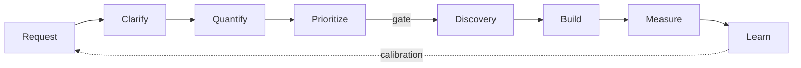

# How to Run an FDE Intake Like a Technical Leader

**Intake is not request management. It is the discipline of turning ambiguous business requests into decisions an organization can defend — and on a forward deployed engineering team, it is where most of the leverage lives.**

On the surface, intake sounds like administration: someone brings a problem, you ask a few questions, write some notes, maybe build something. That is not the job. The job is converting ambiguity into a defensible decision — a decision the organization can explain, fund, and revisit.

The distinction matters most for a Forward Deployed Engineering (FDE) team. Such a team sits between business problems and technical capability, and receives requests with the solution already embedded: we need an agent, an AI assistant, RAG, automation. The requested mechanism is rarely the problem. Intake is where the two get separated.

This note describes the process stage by stage, with its mechanisms grounded in decision research where the literature is strong. For the role itself, see [The Forward Deployed Engineer in Enterprise AI](/notes/forward-deployed-engineer-enterprise-ai/); for what happens after intake — governance, evaluation, and scaling — see the [FDE Playbook for Governed Agentic Adoption](/notes/fde-playbook-governed-agentic-adoption/). For a practitioner overview of the role, see the [Pragmatic Engineer's survey of forward deployed engineers](https://newsletter.pragmaticengineer.com/p/forward-deployed-engineers).

## Context: building got cheaper; deciding got more expensive

AI has collapsed the cost of producing first-draft software across a widening class of tasks. As argued in [The New Scarcity of Software Engineering](/notes/new-scarcity-software-engineering/), the scarce work is shifting toward judgment: deciding what deserves to be built, in what order, and against what evidence. Intake is the first — and cheapest — place to apply that judgment.

The failure data points in the same direction. [RAND's review of AI project failures](https://www.rand.org/pubs/research_reports/RRA2680-1.html) found that more than 80 percent of the AI projects it examined failed, roughly twice the rate of comparable non-AI IT projects, and identified a misidentified business problem as a leading root cause: teams start from a technology and search for a use. [Gartner forecasts](https://www.gartner.com/en/newsroom/press-releases/2025-06-25-gartner-predicts-over-40-percent-of-agentic-ai-projects-will-be-canceled-by-end-of-2027) that over 40 percent of agentic AI projects will be canceled by the end of 2027, citing escalating costs, unclear business value, and inadequate risk controls — and describes most such projects as hype-driven proofs of concept. A [BCG and Harvard field experiment](https://papers.ssrn.com/sol3/papers.cfm?abstract_id=4573321) adds the sharpest detail: AI boosted speed and quality inside its capability frontier, but on a task just outside it, consultants using AI were 19 percentage points *less* likely to be correct. Task-level capability fit is not something to discover after building.

None of this argues against building. It argues for deciding better before building.

## The intake funnel: the operating model

Intake is a funnel that progressively compresses ambiguity:

Request → Clarify → Quantify → Prioritize → Discover → Build → Measure → Learn.

Each stage reduces uncertainty; none is a formality. Intake proper covers the first four stages and ends in a decision with one of four outcomes: proceed to deeper discovery, gather specific missing evidence first, redirect the problem elsewhere, or decline. This is the gate pattern from staged product development practice — a gate is a decision event with explicit go/kill outcomes and portfolio-level consequences, not a status meeting ([Stage-Gate International](https://www.stage-gate.com/stage-gate-the-quintessential-decision-factory/)).

The rest of this note walks the intake stages: what each one produces and how to run it.

## The request is not the problem

A stakeholder says: “We need an AI agent to qualify requests before they reach our team.” The instinctive engineering response is to ask about models, tools, data sources, and integrations. Those questions are premature, because they accept an untested premise.

The better first question: *What is happening today that makes you believe you need an agent?* That question changes the conversation. Maybe incoming requests are poorly specified; different teams submit different information; some requests consume four meetings before anyone realizes the opportunity is too small; escalations happen because stakeholders do not understand why their request has not been prioritized.

Now the problem reads differently. It is not “we don’t have an intake agent.” It might be “we lack a consistent way to turn loosely defined requests into comparable business cases.” That definition does not assume a solution, and it points at what the organization actually needs to improve.

Treat the requested mechanism as a hypothesis with information value — often about what the stakeholder has seen or is worried about — and test it during discovery rather than before it.

## Start with the most recent real example

People describe processes abstractly, and abstract descriptions converge on the idealized version. Instead of asking “How does this process work?”, ask: *Can we walk through the most recent real example?* Then reconstruct what actually happened: what triggered it, who became involved, which systems were used, where information came from, where decisions were made, where handoffs and waits occurred, where judgment was required, and how it ended.

A concrete case is evidence. “Six people across three meetings over two weeks, before deciding not to pursue the request” is far more useful than “our intake is inefficient.” Concrete first, abstract second: observe specific cases, then infer the pattern. One example opens the investigation; it does not close it — collect a few before generalizing, and resist the temptation to generalize from the loudest or most recent complaint.

## Translate operational pain into business impact

Stakeholders usually arrive with operational pain: too much time searching, too many manual steps, slow processes, badly written requests. Those statements may be true, but none of them yet explains why the company should allocate engineering capacity here. What is missing is a causal chain.

For example:

- Fragmented requests lead to multiple discovery meetings.
- Those meetings consume scarce FDE capacity.
- Capacity spent on low-value opportunities reduces the team’s ability to investigate higher-value work.
- The business consequence is not simply wasted time; it is worse portfolio allocation.

That last step is the executive-level translation. A second example: account managers reconcile information across three systems for two hours a week; that slows case resolution; slower resolution affects merchant responsiveness; responsiveness may affect customer experience or revenue. The pattern is always operational friction → immediate consequence → downstream business effect → strategic implication.

This chain is a cost-of-delay argument in physical terms. Reinertsen’s work on product development flow makes the underlying economics explicit: queues and delay are the dominant hidden costs of knowledge work, and most organizations cannot quantify them ([Principles of Product Development Flow](https://archive.org/details/principlesofprod0000rein)). If you cannot build the chain, you probably do not yet understand the opportunity.

## Establish scale, not precision

A serious business problem has magnitude. You rarely need perfect numbers — you need enough to distinguish a local irritation from an economically meaningful problem. Ask: How often does this happen? How many cases are involved? How many people touch each case? How much time is spent, end to end? Is volume increasing? Does the same pattern exist in other teams?

“About twelve requests a month, each involving three or four people and several combined hours” is not an ROI calculation, but it is an order of magnitude, and an order of magnitude is usually enough for a first-stage decision.

Prefer an honest range over fake precision: “ten to fifteen requests per month” is more trustworthy than “12.3 requests” when no system produces that decimal. Reference-class forecasting research shows why ranges beat point estimates in practice: basing projections on the actual performance of comparable cases bypasses both optimism bias and strategic misrepresentation ([Flyvbjerg, *Curbing Optimism Bias and Strategic Misrepresentation*](https://ora.ox.ac.uk/objects/uuid:82761425-46df-4200-9ef1-b611d73433af)). The base rates are sobering: in [Flyvbjerg and Gardner’s survey of large projects](https://www.penguinrandomhouse.com/books/672118/how-big-things-get-done-by-bent-flyvbjerg-and-dan-gardner/), roughly 92 percent come in over budget or over schedule, or both. Estimate the way the evidence suggests, not the way enthusiasm prefers.

## Strategic relevance: intake as portfolio management

Not every painful problem deserves investment. This is where intake becomes portfolio management. Ask: Why does this matter now? Which organizational priority does it support? What competing work would it displace? Is this problem specific to one team, or does it reveal a reusable pattern? If we improved only one part of the workflow, which change would create the most value?

A stakeholder may have a genuine problem. But an opportunity that consumes three months of engineering capacity for five people should not be treated as equal to one that affects three hundred people and supports an explicit strategic priority. Leadership begins when problems stop being evaluated in isolation — when each one is compared against alternatives, finite capacity, and organizational direction. That comparison requires saying “not now,” “not here,” or “show me more evidence” to worthwhile requests. Doing it deliberately is the job.

## Define success before designing

Before anyone discusses architecture, ask: *If we revisit this after an intervention, what would make you say it worked?* The answers should be outcome-shaped — for example: decision time drops from two weeks to two days; meetings before a go-or-no-go decision fall by half; requests arrive with the information needed for prioritization; escalations decrease; effort per request falls by thirty percent.

Notice what those metrics do not mention: AI, agents, or any implementation. That is the point. The outcome should be independent of the implementation. An agent is successful only if it improves the business outcome; the existence of an agent is not itself success. Defining success early also converts a vague request into something that can later be evaluated — which is the same commitment that discovery, and later measurement, will need.

## Separate facts, hypotheses, and unknowns

Maintain three buckets in every intake conversation: facts, hypotheses, and unknowns. A fact: “twelve requests arrived last month.” A hypothesis: “poor request quality is the primary cause of long decision times.” An unknown: “we do not know whether delays mostly come from incomplete requests or from internal decision-making.”

These categories must not be mixed, because weak decisions happen when assumptions quietly become facts. Someone says, “I think most of the delay comes from missing information.” Three weeks later, a document says, “the main bottleneck is missing information.” Nobody notices the transformation — a phenomenon organizational-learning research names precisely: defensive reasoning makes conclusions remarkably impervious to contrary evidence unless the reasoning chain is surfaced deliberately ([Argyris, *Teaching Smart People How to Learn*](https://hbr.org/1991/05/teaching-smart-people-how-to-learn)).

Good intake makes uncertainty visible instead. Facts can support a decision; hypotheses need tests; unknowns define discovery work. Explicit categories are not hesitation — they are the evidence trail. Before a significant commitment, run a premortem — assume the initiative failed and generate the reasons why — a technique shown to surface risks that ordinary planning reviews miss ([Klein, *Performing a Project Premortem*](https://hbr.org/2007/09/performing-a-project-premortem)).

## Park solutions without dismissing them

Senior stakeholders often return to a proposed solution. When someone says “we should build an agent,” the reflex “no, that’s premature” creates resistance and signals that the idea was not heard.

Instead: “That sounds like one plausible intervention. I’ll capture it. Before deciding on the mechanism, I want to understand the outcome and what information actually determines whether a request is valuable.” That response does three things: it acknowledges the stakeholder, it preserves the idea, and it keeps discovery in the correct sequence. You are not opposing the solution; you are sequencing the decision. The solution may be excellent — but it should win on evidence, and this approach makes stakeholders partners in the inquiry rather than opponents in a technology debate.

## Synthesize before the meeting ends

The final minutes matter more than they look. Do not end with “Great, thanks — I’ll write this up.” Construct the shared model of the problem while everyone who knows the work is still in the room:

“Let me play back what I’ve understood. The core problem is that loosely defined requests cannot be compared consistently, and that consumes significant discovery capacity. The primary business consequence appears to be inefficient allocation of engineering attention. We have an initial estimate of volume, but need stronger evidence on effort per request. A meaningful improvement would reduce the time and work required to reach a prioritization decision. The main unknown is which information actually predicts whether an opportunity is worth pursuing. Next step: validate that against a small sample of previous requests. Is that an accurate characterization?”

This is not summarization. It is stakeholder alignment — a chance to correct the mental model before it hardens into the written record. That makes it one of the highest-leverage behaviors in the entire process.

## The one-page opportunity assessment

After the meeting, do not produce twenty pages of notes. Compress what you learned into a one-page opportunity assessment answering: What is the problem? Who is affected? What is the business impact? What is the scale? Why does it matter strategically? What does success look like? What evidence exists? What remains unknown? What constraints apply? What solutions were suggested? And what is the recommendation?

The recommendation should land in one of the four categories defined earlier — proceed to discovery, gather specific missing evidence, redirect, or decline. Decisive routing is the point. Intake is a gate, not an automatic conveyor belt into engineering — and a well-run no (with reasons, evidence gaps, and a next step for the stakeholder) is a legitimate, often correct, and revisitable outcome: record what evidence would change it.

## Make the decision inspectable

As the number of opportunities grows, intuition stops being enough. A lightweight scorecard — business impact, scale, strategic alignment, AI leverage (where a model materially changes what is feasible), feasibility, reusability, risk, evidence confidence — keeps decisions comparable. The scorecard’s purpose is not mathematical truth; it is exposing the reasoning. For example, why did opportunity A proceed while B did not? Because A had high impact, strong alignment, reusable potential, and sufficient evidence, while B had enthusiastic sponsors but weak evidence and limited scale.

This is decision science applied at small scale: decisions have quality independent of their outcomes, and a good decision process names its frame, alternatives, information, values, and reasoning explicitly ([Spetzler, Winter & Meyer, *Decision Quality*](https://www.wiley.com/en-us/Decision+Quality%3A+Value+Creation+from+Better+Business+Decisions-p-9781119176657)). Reviewing the *process* — not just the content — is what surfaces bias; Kahneman, Lovallo, and Sibony’s checklist for decision reviews ([*Before You Make That Big Decision*](https://hbr.org/2011/06/the-big-idea-before-you-make-that-big-decision)) exists for exactly this, and reducing unwanted variability in judgment is its own discipline (Kahneman, Sibony & Sunstein, *[Noise](https://www.hachettebookgroup.com/titles/daniel-kahneman/noise/9780316451406/)*). A visible framework does not eliminate disagreement, but it moves the discussion from volume and personalities to assumptions and tradeoffs — which is what makes the decision survivable when stakeholders disagree.

## Discovery is its own phase

Passing intake does not mean starting to build. It means earning a short discovery phase. Write down: what questions must be answered, what evidence is required, which users to interview, which systems to inspect, which hypotheses to test, whether a prototype is warranted, what evaluation would show the idea works, what decision the phase ends with, and what the timebox is.

Compare the two formulations: “Determine whether AI-assisted qualification can reduce intake effort by at least thirty percent while preserving prioritization quality” versus “Build an intake agent.” One is a question; the other already assumes the answer. The UK Government Digital Service draws the same line for its own teams — discovery exists to produce a decision to proceed, and building during discovery is explicitly out of scope ([GDS Service Manual](https://www.gov.uk/service-manual/agile-delivery/how-the-discovery-phase-works)). Product organizations reached the same conclusion from the other direction: discovery is where the risk of building the wrong thing is retired before engineering capacity is committed to delivery ([Cagan, *Product Discovery*](https://www.svpg.com/product-discovery/)).

## The leadership shift

A senior engineer creates value by solving difficult problems. A technical leader creates value by ensuring the organization is solving the right difficult problems. That requires a different skill set: resisting the intellectual reward of immediately designing the system, tolerating ambiguity longer, asking questions that can feel less technically sophisticated, and understanding incentives, constraints, and organizational priorities well enough to turn them into a decision others can understand and defend.

That is stakeholder management in its real technical form — not politeness, but creating a reliable decision process across people with different information, incentives, and mental models. The transition it produces is worth naming: people stop seeing you only as someone who can build sophisticated systems and start trusting you with deciding which systems should exist at all. As Peter Drucker put it: *“There is nothing so useless as doing efficiently that which should not be done at all.”*

## Trade-offs and failure modes

**Defensible is not correct.** The process produces decisions you can stand behind, not decisions that are always right. Good decision quality is distinct from good outcomes — a disciplined process can still approve a bad bet, but it makes the error visible early and cheap to reverse (Spetzler et al.).

**A gate with no authority is theater.** If nobody can genuinely decline, redirect, or sequence requests, intake degrades into documentation for decisions made elsewhere. Gate authority is delegated by leadership; it cannot be self-conferred. If it does not exist, the honest move is to rename the process, not perform it.

**Proportionality is the calibration.** Small, reversible requests should not queue behind the full process — the cost of process can exceed the cost of simply trying (Reinertsen). A practical rule: requests that are cheap to reverse and small relative to team capacity can be answered directly; the full sequence earns its cost on commitments measured in weeks of engineering time or external visibility. And keep intake itself fast — an intake queue that delays decisions invites workarounds. A process that cannot be applied proportionally tends to be routed around.

**Evidence bars can be weaponized.** The same standard of evidence must apply to every opportunity, including favored ones; decision hygiene means noticing when scrutiny is selective, and making overrides explicit rather than silent (*Noise*).

**Quantifiable work has an unfair advantage.** The funnel privileges opportunities that articulate cleanly in its vocabulary. Exploratory bets, capability building, and optionality are legitimate investments that cannot always produce a causal chain on demand. Name that bias and reserve a deliberate fraction of capacity against it — otherwise intake becomes a machine for declining the work it cannot measure.

**Ambiguity is expensive whether or not you measure it.** Requirements-quality research consistently identifies ambiguity as one of the most studied and most consequential causes of rework ([Montgomery et al., systematic mapping study](https://doi.org/10.1007/s00766-021-00367-z)), and classic work puts late defect repair at up to 100 times the cost of early resolution ([Boehm & Basili](https://www.cs.umd.edu/~basili/publications/journals/J81.pdf)). Intake is the cheapest place this bill can be paid; skipping it does not save the cost, it defers it.

**Scorecards invite false rigor.** Numbers can be ordered without being understood. Treat scores as prompts for judgment, not substitutes for it.

## Practical takeaways

1. Before discussing mechanism, ask the reframing question — *what is happening today that makes you believe you need this?* Treat the requested solution as a hypothesis, not a specification.
2. Walk one real recent case end-to-end before generalizing. Concrete first, abstract second.
3. Build the causal chain from operational friction to strategic implication. If you cannot, you do not yet understand the opportunity.
4. Keep three buckets — facts, hypotheses, unknowns — in every artifact, and stress-test significant plans with a premortem before commitment.
5. End every intake with a one-page assessment and one of the four recommendations, with success defined in outcome terms before design starts.

## Positioning note

This is not academic research: the cited work supports specific mechanisms, but it does not validate this process as a whole. It is not blog opinion: the stages are a concrete operating model with named artifacts and explicit decision outcomes. And it is not vendor documentation: there is no product attached — the artifacts are a one-page assessment and a scorecard you can build in any tool.

## Status and scope disclaimer

This note describes exploratory personal lab practice, adapted from operating experience with enterprise AI workflows. It is not authoritative guidance. The evidence bars, effort estimates, and scorecard dimensions are calibrated to one operating context and require adaptation elsewhere; treat the stage names as scaffolding, not standard. Research citations support the mechanisms; they do not transfer the burden of judgment.

## References

1. Orosz, G. (2025). [What are Forward Deployed Engineers, and why are they so in demand?](https://newsletter.pragmaticengineer.com/p/forward-deployed-engineers). The Pragmatic Engineer.
2. Ryseff, J., De Bruhl, B., & Newberry, S. (2024). [The Root Causes of Failure for Artificial Intelligence Projects and How They Can Succeed](https://www.rand.org/pubs/research_reports/RRA2680-1.html). RAND Corporation, RR-A2680-1.
3. Gartner. (2025, June 25). [Gartner Predicts Over 40% of Agentic AI Projects Will Be Canceled by End of 2027](https://www.gartner.com/en/newsroom/press-releases/2025-06-25-gartner-predicts-over-40-percent-of-agentic-ai-projects-will-be-canceled-by-end-of-2027). Press release (analyst forecast).
4. Dell’Acqua, F., McFowland III, E., Mollick, E., Lifshitz-Assaf, H., Kellogg, K., Rajendran, S., Krayer, L., Candelon, F., & Lakhani, K. (2023). [Navigating the Jagged Technological Frontier: Field Experimental Evidence of the Effects of AI on Knowledge Worker Productivity and Quality](https://papers.ssrn.com/sol3/papers.cfm?abstract_id=4573321). Harvard Business School Working Paper 24-013.
5. Stage-Gate International. [Stage-Gate: The Quintessential Decision Factory](https://www.stage-gate.com/stage-gate-the-quintessential-decision-factory/).
6. Reinertsen, D. G. (2009). [The Principles of Product Development Flow: Second Generation Lean Product Development](https://archive.org/details/principlesofprod0000rein). Celeritas Publishing.
7. Flyvbjerg, B. (2008). [Curbing Optimism Bias and Strategic Misrepresentation in Planning: Reference Class Forecasting in Practice](https://ora.ox.ac.uk/objects/uuid:82761425-46df-4200-9ef1-b611d73433af). European Planning Studies, Routledge.
8. Flyvbjerg, B., & Gardner, D. (2023). [How Big Things Get Done](https://www.penguinrandomhouse.com/books/672118/how-big-things-get-done-by-bent-flyvbjerg-and-dan-gardner/). Crown.
9. Argyris, C. (1991). [Teaching Smart People How to Learn](https://hbr.org/1991/05/teaching-smart-people-how-to-learn). Harvard Business Review.
10. Klein, G. (2007). [Performing a Project Premortem](https://hbr.org/2007/09/performing-a-project-premortem). Harvard Business Review.
11. Spetzler, C., Winter, H., & Meyer, J. (2016). [Decision Quality: Value Creation from Better Business Decisions](https://www.wiley.com/en-us/Decision+Quality%3A+Value+Creation+from+Better+Business+Decisions-p-9781119176657). Wiley.
12. Kahneman, D., Lovallo, D., & Sibony, O. (2011). [Before You Make That Big Decision…](https://hbr.org/2011/06/the-big-idea-before-you-make-that-big-decision). Harvard Business Review.
13. Kahneman, D., Sibony, O., & Sunstein, C. R. (2021). [Noise: A Flaw in Human Judgment](https://www.hachettebookgroup.com/titles/daniel-kahneman/noise/9780316451406/). Little, Brown Spark.
14. UK Government Digital Service. [How the discovery phase works](https://www.gov.uk/service-manual/agile-delivery/how-the-discovery-phase-works). GOV.UK Service Manual.
15. Cagan, M. [Product Discovery](https://www.svpg.com/product-discovery/). Silicon Valley Product Group.
16. Boehm, B., & Basili, V. R. (2001). [Software Defect Reduction Top 10 List](https://www.cs.umd.edu/~basili/publications/journals/J81.pdf). IEEE Computer, 34(1), 135–137.
17. Montgomery, L., Fucci, D., Bouraffa, A., Scholz, L., & Maalej, W. (2022). [Empirical research on requirements quality: a systematic mapping study](https://doi.org/10.1007/s00766-021-00367-z). Requirements Engineering, Springer.
