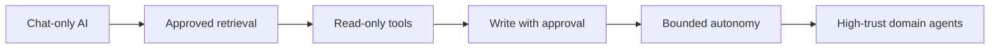
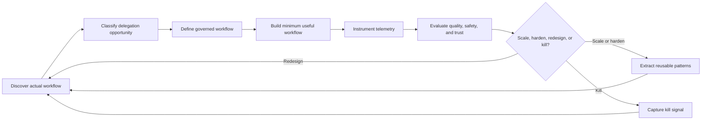
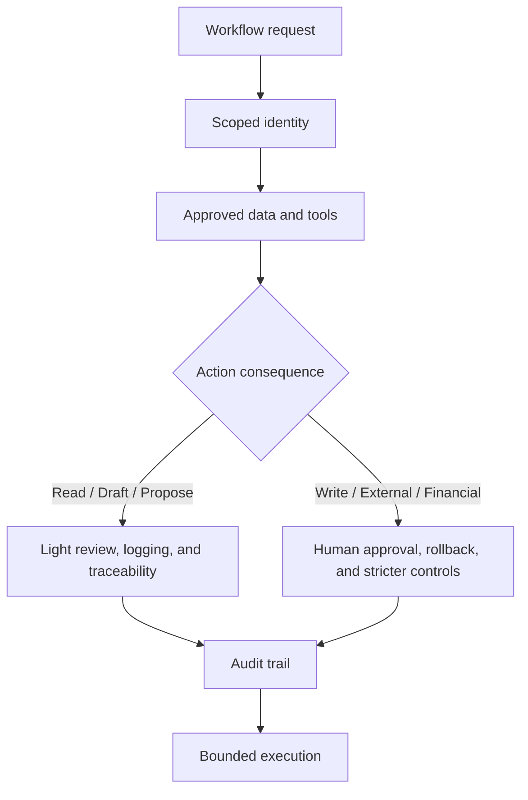

# FDE Playbook for Governed Agentic Adoption

## Abstract

Enterprise AI adoption is moving from chat interfaces and productivity demos toward delegated execution. That shift changes the problem. The hard part is no longer only prompting or retrieval. It is deciding which workflows can be delegated, under what controls, with which approvals, and with what evidence that the system is safe and useful. This note argues that forward deployed engineering teams create durable value when they translate messy business work into governed agentic workflows, instrument those workflows, evaluate them, and turn local pilots into reusable operating patterns.

## Context and motivation

The first phase of enterprise AI adoption was experimentation: chatbots, knowledge assistants, prompt libraries, document search, and productivity demos. That phase was useful, but insufficient. The next phase is not about giving every employee a custom chatbot. It is about helping organizations safely delegate real work to AI systems.

This requires a different operating model.

The companies that succeed with agentic AI will not be the ones that simply connect more data sources, expose more tools, or deploy more assistants. They will be the ones that learn how to identify delegable workflows, govern them, instrument them, evaluate them, and gradually increase autonomy without losing control.

That is where the forward deployed engineer, or FDE, becomes strategically important.

Platform teams understand infrastructure, identity, data access, security, and deployment. Business teams understand local pain, operational reality, customer context, and process friction. FDEs sit between them. Their job is not merely to configure AI tools. Their job is to turn messy business work into governed agentic workflows.

## Core thesis

The north star is simple:

**Safely delegated work completed.**

That is the metric that matters. Not the number of agents created. Not the number of MCP servers connected. Not the number of documents indexed. Not the number of demos delivered. The real question is whether useful work was completed by AI-assisted or AI-executed workflows under appropriate governance, with measurable business value and human accountability.

An internal FDE team should be measured by its ability to create governed delegation capability, not by the volume of AI activity around it. If the team behaves like an internal AI service desk, each request stays local and the work does not compound. If it converts repeated workflow friction into reusable approval models, tool patterns, evaluation cases, governance templates, and implementation playbooks, the organization builds an operating model for safe agent adoption.

## From AI as chat to AI as delegation

Most enterprise AI adoption still treats AI as an interface: a chat window, a search assistant, a summarizer, or a drafting tool. These are valid starting points, but they do not fundamentally change how work flows through the organization.

Agentic adoption is different. It treats AI as a controlled execution layer. An agent can retrieve context, reason over a workflow, draft an artifact, call tools, ask for approval, update systems, produce an audit trail, and escalate when uncertain.

But this must happen gradually.

The maturity path usually looks like this:

1. Chat-only AI.
2. Approved knowledge retrieval.
3. Read-only tool use.
4. Human-approved write actions.
5. Bounded autonomous workflows.
6. High-trust domain agents.

As a control ladder, the progression looks like this:

The mistake is jumping from level 1 to level 5. Enterprises often want autonomous agents before they have defined data boundaries, approval gates, telemetry, evaluation, ownership, rollback paths, or failure handling. That produces fragile systems and organizational mistrust.

The goal is not maximum autonomy. The goal is safe, increasing autonomy.

## The FDE way of working

The unit of adoption is not the agent. It is the workflow.

A weak starting question is: "Which agent should we build?"

A better starting question is: "What work should be partially delegated, under what constraints, with which approval points, and with what measurable outcome?"

Every FDE engagement should begin by studying the actual work, not the official process. Official process diagrams are often too clean. The real workflow lives in Slack threads, spreadsheets, ticket comments, dashboards, undocumented judgment calls, copy-paste routines, and escalation habits.

A useful FDE discovery process asks:

- What triggers this workflow?
- Who owns the outcome?
- What systems are involved?
- What data is trusted?
- What decisions are made?
- Where do people wait?
- Where do people copy-paste?
- Where do mistakes happen?
- What judgment is required?
- What would be dangerous to automate?
- What must remain human-owned?

The output should be a workflow map.

From there, the FDE classifies the delegation opportunity. Some workflows are only suitable for retrieval. Others are suitable for summarization, drafting, structured extraction, decision support, ticket creation, system updates, monitoring, exception handling, or multi-step orchestration.

Then the FDE defines the governed workflow.

A governed workflow should specify:

- Workflow owner.
- User group.
- Trigger.
- Inputs.
- Approved data sources.
- Allowed tools.
- Forbidden actions.
- Approval gates.
- Output artifact.
- Logging requirements.
- Data retention rules.
- Human override path.
- Failure modes.
- Success metrics.
- Evaluation method.
- Kill criteria.

Only after this should the team build.

The first implementation should be the smallest workflow that performs real work. Not a platform. Not a grand architecture. Not a generic agent that can do everything. A narrow workflow where success and failure are visible.

Examples:

- Summarize an incident and draft follow-up tickets.
- Generate a sales account brief from approved internal sources.
- Convert meeting notes into structured project actions.
- Draft a merchant support response from case context.
- Extract risks from a process and propose controls.
- Enrich an operational ticket with missing metadata.

Every pilot should produce telemetry. Track user request, retrieved sources, tool calls, actions proposed, actions approved, actions rejected, human edits, latency, cost, failure category, and user feedback.

Every pilot should also end with a decision: scale, harden, redesign, or kill.

A pilot that ends only in a demo has not created organizational learning. A good pilot produces one of three things: a reusable pattern, a decision, or a kill signal.

The operating loop is straightforward, but it only compounds when the team treats each pilot as a learning system:

## Governance is not a blocker. It is the product.

In many enterprises, governance is treated as the thing that slows AI adoption down. This is backwards.

For agentic systems, governance is part of the product. Without governance, the system cannot be trusted with real work.

A governed agentic workflow must define what data the agent can access, whether personal, customer, merchant, regulated, or confidential data is involved, whether data leaves approved environments, whether outputs are stored, whether outputs can be shared, and whether access is inherited from the user or mediated through a scoped service identity.

Identity matters. The organization must know whether the agent is acting as the user, as a scoped service, or as a delegated workflow identity. Tool calls should be logged under a clear identity. Approval must be tied to a human identity. The audit trail must show who requested, who approved, what was used, what was changed, and what happened.

Actions should be classified by consequence:

- Read.
- Draft.
- Propose.
- Write with approval.
- Write autonomously.
- External communication.
- Financial or contractual action.

In execution terms, that control model looks like this:

The higher the consequence, the stronger the control.

A workflow that drafts an internal summary may need light review. A workflow that updates a CRM record needs approval and rollback. A workflow that sends external communication needs strict preview and human confirmation. A workflow that affects money, contracts, compliance, or customer commitments requires formal governance.

## MCP and tool design standard

MCP tools should be designed around business actions, not raw system access.

Bad tool:

`query_database(sql)`

Better tool:

`get_customer_risk_summary(customer_id)`

Bad tool:

`update_ticket(payload)`

Better tool:

`draft_ticket_update_from_approved_summary(summary_id)`

Bad tool:

`send_message(channel, text)`

Better tool:

`draft_internal_update(workflow_id, audience)`

The difference is control.

Raw tools expose too much surface area. They are hard to evaluate, hard to permission, and easy to misuse. Business-action tools are narrower, typed, auditable, and easier to govern.

Every enterprise MCP tool should define:

- Purpose.
- Inputs.
- Outputs.
- Permissions.
- Data classification.
- Side effects.
- Rate limits.
- Failure responses.
- Logging requirements.
- Approval requirement.
- Human owner.
- Version.
- Evaluation method.
- Rollback path, if applicable.

Good tools are narrow, typed, permission-aware, auditable, connected to a workflow, clear about side effects, and hard to misuse.

Enterprises should not expose internal systems to agents as generic APIs and hope governance emerges later. Governance must be embedded into the tool surface itself.

## Evaluation is the missing discipline

Many enterprise AI pilots fail because they are evaluated through vibes.

People ask: "Did users like it?" or "Was the demo impressive?"

That is not enough.

Agentic workflows need evaluation from the start. The evaluation should include quality, safety, workflow, reliability, and trust metrics.

### Quality metrics

- Accuracy.
- Completeness.
- Relevance.
- Grounding.
- Consistency.
- Format adherence.
- Business usefulness.

### Safety metrics

- Data boundary violations.
- Unauthorized tool calls.
- Unsupported claims.
- Incorrect action proposals.
- Sensitive data exposure.
- Policy violations.

### Workflow metrics

- Time saved.
- Handoff reduction.
- Human acceptance rate.
- Number of edits required.
- Cycle-time reduction.
- Rework reduction.
- Escalation rate.
- Cost per completed workflow.

### Reliability metrics

- Tool call success rate.
- Retrieval success rate.
- Latency.
- Failure frequency.
- Regression rate.
- Drift over time.

### Trust metrics

- Repeat usage.
- Approval rate.
- Rejection reasons.
- User satisfaction.
- Qualitative feedback.
- Complaints.
- Abandonment.

For important workflows, teams should maintain golden test cases and regression checks. If the agent is expected to summarize incidents, draft support responses, enrich tickets, or produce account briefs, the team should collect representative examples and test whether the system improves or regresses over time.

Without evaluation, the enterprise cannot know whether it is scaling capability or scaling risk.

## Applied workflow scenarios

### Incident review agent

Current process:

After a production incident, multiple people gather logs, messages, deployment notes, tickets, dashboards, and timeline fragments. A postmortem is drafted manually. Follow-up actions are created inconsistently. Important context is often scattered across tools.

Target delegation:

An incident review agent retrieves approved incident context, drafts a timeline, identifies missing information, proposes contributing factors, and drafts follow-up tickets.

Autonomy level:

Human-approved drafting and ticket creation.

Data sources:

Incident channel, ticket system, monitoring dashboards, internal docs, deployment logs, and previous incident records.

Tools:

- Read incident messages.
- Fetch ticket history.
- Query deployment metadata.
- Read dashboard snapshots.
- Draft postmortem.
- Draft follow-up tickets.

Approval gates:

A human approves the postmortem, validates causal claims, approves ticket creation, and approves any stakeholder update.

Success metrics:

- Time to first postmortem draft.
- Completeness of timeline.
- Human edit distance.
- Follow-up ticket acceptance rate.
- Reduction in incident review cycle time.
- User satisfaction.

Failure modes:

- Missing context.
- Incorrect causality.
- Overconfident summary.
- Sensitive information in output.
- Wrong ticket ownership.
- Unsupported remediation proposal.

This is a strong early workflow because it is bounded, valuable, repetitive, measurable, and naturally human-reviewed.

### Customer support drafting agent

Current process:

Support agents collect customer context, previous cases, documentation, product behavior, known issues, and policy guidance before drafting a response. This creates research overhead and inconsistent response quality.

Target delegation:

The agent summarizes case context, retrieves relevant documentation, identifies uncertainty, drafts an internal recommendation, and drafts a customer-facing response.

Autonomy level:

Draft only. No external sending.

Data sources:

Case history, customer profile, internal knowledge base, product documentation, known issue database, and policy documents.

Tools:

- Retrieve case context.
- Search documentation.
- Summarize prior interactions.
- Draft internal recommendation.
- Draft customer-facing response.
- Highlight uncertainty and missing information.

Approval gates:

A human reviews before sending, confirms factual claims, selects the final recommendation, and edits tone.

Success metrics:

- Draft usefulness.
- Reduction in research time.
- Human acceptance rate.
- Reduction in escalations.
- Response quality.
- Lower variation across support agents.

Failure modes:

- Hallucinated product behavior.
- Missing customer-specific context.
- Policy mismatch.
- Wrong tone.
- Sensitive data leakage.
- Overconfident recommendation.

This workflow should not begin with autonomous customer communication. It should begin with grounded drafting and strict human review. Over time, parts of the workflow may become more automated, but only after evaluation proves quality and safety.

### Sales account briefing agent

Current process:

Before customer meetings, sales or account teams gather information from CRM, support history, product usage, contracts, previous meeting notes, public sources, and internal documents. The work is repetitive but context-heavy.

Target delegation:

The agent produces a structured account brief from approved sources, highlights risks and opportunities, summarizes open issues, and suggests meeting questions.

Autonomy level:

Read-only retrieval plus draft generation.

Data sources:

CRM, support cases, product analytics, meeting notes, internal account plans, approved public sources, and documentation.

Tools:

- Retrieve account profile.
- Summarize support history.
- Fetch recent product usage signals.
- Search internal notes.
- Draft account brief.
- Generate meeting preparation checklist.

Approval gates:

Human reviews before use. No customer-visible communication is generated without explicit approval.

Success metrics:

- Time saved preparing for meetings.
- Completeness of account context.
- Sales team repeat usage.
- Human edit distance.
- Meeting usefulness feedback.
- Reduction in missed context.

Failure modes:

- Stale CRM data.
- Unsupported claims.
- Incorrect prioritization.
- Sensitive internal notes included inappropriately.
- Poor distinction between fact and recommendation.

This is a good level 1-2 workflow because it improves context access and preparation without immediately mutating systems.

### Ticket enrichment agent

Current process:

Operational tickets often arrive incomplete. Engineers, analysts, or operations staff spend time asking for missing fields, checking related systems, classifying priority, and routing the issue.

Target delegation:

The agent inspects the ticket, identifies missing information, retrieves related context, suggests classification, and drafts a structured update.

Autonomy level:

Read-only tool use plus human-approved ticket update.

Data sources:

Ticket system, service catalog, ownership registry, logs, documentation, and related incidents.

Tools:

- Read ticket.
- Fetch service metadata.
- Retrieve related incidents.
- Search documentation.
- Draft enrichment update.
- Suggest owner.
- Suggest priority.

Approval gates:

Human approves ticket updates and ownership assignment.

Success metrics:

- Reduction in triage time.
- Correct owner suggestion rate.
- Reduction in back-and-forth.
- Human acceptance rate.
- Cycle-time reduction.

Failure modes:

- Wrong owner.
- Misclassified severity.
- Missing dependency context.
- Incorrect relation to previous incidents.
- Over-automation of ambiguous tickets.

This is a useful operational workflow because it reduces coordination load without removing human accountability.

## What an internal FDE team should own

An internal FDE team should not own all AI infrastructure. It should not replace platform, security, compliance, or business operations.

Its role is to own the adoption loop.

That includes:

- Workflow discovery.
- Delegation classification.
- Governed workflow design.
- Minimum useful pilot implementation.
- Tool and MCP design patterns.
- Evaluation design.
- Telemetry requirements.
- User feedback capture.
- Failure analysis.
- Pattern extraction.
- Business enablement.
- Scaling recommendations.

The FDE team should produce reusable organizational assets:

- Workflow templates.
- Intake forms.
- Pilot scoring rubrics.
- Governance checklists.
- MCP and tool standards.
- Approval patterns.
- Evaluation sets.
- Failure taxonomies.
- Case studies.
- User onboarding guides.
- Reference implementations.

The team should also dogfood agentic workflows internally. FDEs should be the first serious users of the systems they want the business to trust. If the FDE team is not using agents to improve its own discovery, documentation, debugging, reporting, and implementation work, it will lack the operational insight needed to guide others.

## Practical takeaways

- Measure the team by safely delegated work completed, not by agents launched or integrations connected.
- Start with narrow, repetitive workflows where success, failure, and ownership are visible.
- Treat governance, approvals, and auditability as part of the workflow design, not a later compliance overlay.
- Design tools around business actions with clear side effects and approval boundaries, not around raw API surface area.
- Instrument and evaluate every pilot from the start, then make an explicit decision to scale, harden, redesign, or kill.

## Positioning note

This is not academic research, vendor documentation, or a generic AI transformation manifesto. It is a practical operating note for teams trying to move from experimentation toward governed delegation of work. The goal is not theoretical completeness. The goal is to preserve the operational logic of a field playbook in a form that is easier to reuse, critique, and apply.

## Status and scope disclaimer

This note is exploratory but practice-oriented. It reflects a personal synthesis of how an internal FDE team can structure governed agentic adoption inside enterprise environments. It is non-authoritative, based on applied reasoning rather than a controlled benchmark program, and most relevant in organizations where workflows cross systems, approval boundaries matter, and the company is trying to move beyond chat assistance toward constrained execution.
