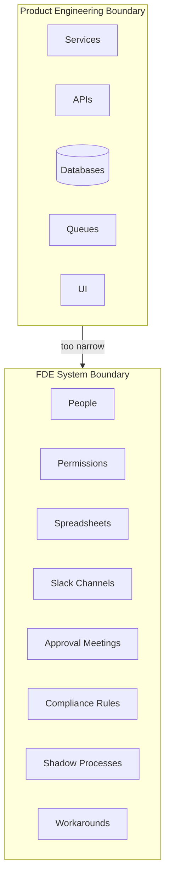
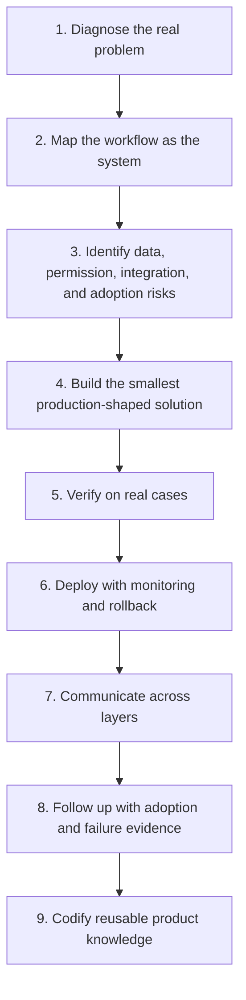
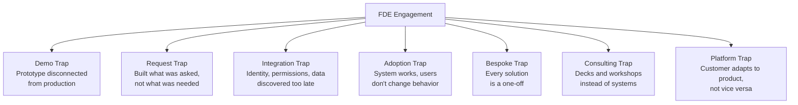

Forward Deployed Engineering is not consulting with better titles. It is engineering ownership moved closer to the customer. In practice, the system boundary includes product code, customer data, organizational workflows, security constraints, adoption behavior, and production feedback.

That definition matches how [OpenAI](https://openai.com/careers/forward-deployed-engineer-%28fde%29-nyc-new-york-city/), [Databricks](https://www.databricks.com/blog/forward-deployed-engineering-delivering-business-outcomes-ai), [Stripe](https://stripe.com/jobs/listing/forward-deployed-engineer-professional-services/7671038), and [Palantir](https://blog.palantir.com/a-day-in-the-life-of-a-palantir-forward-deployed-software-engineer-45ef2de257b1) describe the role: field engineers own discovery, design, build, rollout, adoption, and reusable product learning.

The practical definition is simple:

> An FDE owns the distance between customer reality and a durable product outcome.

That means the unit of work is not a demo, workshop, prototype, integration, migration, dashboard, agent, or pull request. The unit of work is a workflow that now works better in production, with evidence.

---

## 1. Own the outcome, not the artifact

A normal engineering team can sometimes stop at "the feature shipped." An FDE cannot. The feature is only a vehicle. The real object is the customer outcome: reduced cycle time, fewer manual handoffs, higher search success, faster dispute resolution, safer analysis, lower operational cost, or better decision quality.

[Databricks' FDE launch post](https://www.databricks.com/blog/forward-deployed-engineering-delivering-business-outcomes-ai) is explicit about this shift: the customer expectation has moved from infrastructure delivery toward business problem solving, and FDE engagements are anchored on shared outcomes rather than consultant-style handoffs.

### Narrative case study: invoice dispute resolution

A finance operations team says: "We need an AI assistant that answers invoice questions." A weak FDE builds a chatbot over invoice PDFs and ERP exports. The demo works. Everyone nods. The project dies because the assistant cannot see approval status, cannot distinguish disputed invoices from pending invoices, and cannot explain which system is authoritative.

A strong FDE reframes the outcome: "Finance analysts need to resolve invoice disputes faster without violating approval controls." The system becomes a workflow: retrieve invoice, purchase order, contract terms, approval history, vendor thread, and policy; produce an answer with citations; expose unresolved ambiguity; route exceptions to a human approver; log the decision.

The artifact is an assistant. The outcome is faster, safer dispute closure.

**Principle:** do not own "the agent." Own the operational improvement the agent is supposed to create.

---

## 2. Diagnose before building

Customers usually describe symptoms in the language of available tools: "We need retrieval-augmented generation (RAG)," "We need an agent," "We need workflow automation," "We need better search." That is not yet a problem statement.

FDE work begins by separating the stated request from the underlying failure. Is the issue missing data, fragmented permissions, bad process design, lack of trust, poor UX, slow approvals, weak observability, or a product gap? Diagnosis matters because a team that picks the wrong abstraction can spend more and still miss the real problem.

This is also consistent with the deployment literature. The survey paper ["Challenges in Deploying Machine Learning: a Survey of Case Studies"](https://arxiv.org/abs/2011.09926) notes that production ML systems face practical issues across the whole deployment workflow, not only at model-building time.

### Narrative case study: "We need RAG for support"

A support organization asks for RAG over documentation. The first prototype retrieves help-center articles and drafts answers. Quality is inconsistent. The team blames embedding quality.

A diagnostic FDE watches support agents work for two days. The real problem is not retrieval. The public docs are mostly fine. The failure is that support agents need account-specific state: plan, region, entitlement, last incident, enabled feature flags, and open engineering bugs. The system also needs permission-aware retrieval because some support staff cannot see enterprise contract notes.

The final solution uses RAG, but RAG is not the center. The center is a support-resolution workspace that joins documentation, customer state, incident context, and escalation rules. The FDE did not build what the customer asked for. They built what the workflow required.

**Principle:** the first deliverable is not code. It is a correct model of the customer's problem.

---

## 3. Treat the workflow as the system

In product engineering, the system boundary often stops at services, APIs, databases, queues, and UI. In FDE work, that boundary is too narrow. The system includes people, permissions, spreadsheets, Slack channels, approval meetings, compliance rules, shadow processes, and the old workaround everyone pretends does not exist.

[Palantir's FDSE description](https://blog.palantir.com/a-day-in-the-life-of-a-palantir-forward-deployed-software-engineer-45ef2de257b1) captures this field reality: FDSEs focus on enabling many capabilities for a single customer, working across software development, data engineering, customer engagement, and creative problem-solving, while implementing solutions with end users.

*Figure: Product engineering draws the boundary at services and APIs. FDE work extends it to people, permissions, and informal workflows.*

### Narrative case study: supply chain exception handling

A logistics customer wants a dashboard for delayed shipments. The obvious solution is a dashboard that shows late containers, root cause, and ETA. It is useful, but not sufficient.

The FDE maps the workflow. A planner sees a delay, checks port status, checks customer priority, messages a carrier, updates an internal spreadsheet, escalates high-value shipments, and manually emails account managers. The problem is not visibility. It is exception handling.

The shipped solution becomes an exception console: detect delay, classify severity, suggest next action, draft carrier message, update CRM note, trigger escalation for priority accounts, and log operator decisions. The dashboard was a view. The workflow is the system.

**Principle:** if the human still has to stitch five tools together, the FDE has not yet owned the workflow.

---

## 4. Build for adoption, not just correctness

A technically correct system can still fail if users do not trust it, cannot find it, cannot explain it, or do not know when to use it. Adoption is not a go-to-market afterthought. It is part of the engineering problem.

[OpenAI's FDE description](https://openai.com/careers/forward-deployed-engineer-%28fde%29-nyc-new-york-city/) explicitly includes guiding adoption of what is built, not merely delivering technical artifacts.

### Narrative case study: legal contract review assistant

A legal team wants an assistant that identifies risky contract clauses. The first version performs well on a benchmark. Lawyers still ignore it. Why? The output is too confident, does not quote the relevant clause, does not distinguish "must fix" from "commercially negotiable," and does not match the firm's review style.

The FDE changes the product surface. Each finding now includes clause citation, risk category, policy basis, confidence, suggested fallback language, and escalation path. The assistant does not claim to "review the contract." It prepares a review packet. Lawyers adopt it because it fits their judgment workflow rather than trying to replace it.

**Principle:** adoption depends on trust, timing, fit, and accountability. Correctness alone is not enough.

---

## 5. Make integration risk explicit early

FDE work lives in integration territory. That means risk hides in identity, authorization, tenancy, audit logs, API quotas, data freshness, custom schemas, brittle exports, old systems, and unclear ownership.

[Stripe's Forward Deployed Engineer role description](https://stripe.com/jobs/listing/forward-deployed-engineer-professional-services/7671038) emphasizes secure, scalable technical solutions aligned with customer needs, production applications combining user business logic with platform best practices, and direct collaboration across internal and external stakeholders.

### Narrative case study: payments reconciliation

A customer wants a reconciliation app across Stripe, ERP, bank statements, and internal ledger data. The prototype reconciles sample records beautifully. The danger is hidden: bank files arrive late, ERP IDs are inconsistent, refunds are represented differently across systems, and finance users need an audit trail for every automated match.

A strong FDE surfaces these constraints before committing to timelines. The architecture includes a canonical transaction model, confidence scores, manual review queue, immutable match log, reconciliation rules by payment type, and backfill strategy. This slows the first demo but prevents a failed production rollout.

**Principle:** integration risk discovered late becomes delivery failure. Integration risk exposed early becomes architecture.

---

## 6. Verify against reality, not synthetic success

FDE demos are dangerously easy to fake, especially with AI systems. A model can appear useful on curated examples while failing on real permissions, real data quality, real exceptions, and real user behavior.

The ML deployment survey ["Challenges in Deploying Machine Learning: a Survey of Case Studies"](https://arxiv.org/abs/2011.09926) is relevant here because it shows deployment challenges appearing across the full workflow, from data and model development to monitoring and production operation.

### Narrative case study: account research agent

A sales team wants an agent that prepares account briefs. The demo uses clean public data and produces impressive summaries. In production, the agent hallucinates customer priorities, misses renewal risk, and pulls stale notes from old CRM fields.

The FDE replaces demo validation with workflow validation. The eval set includes real accounts, stale CRM records, conflicting notes, permission-restricted fields, and accounts with no recent activity. The agent must cite sources, mark uncertainty, and pass task-level checks: "Can an account executive use this to prepare for a renewal call without manually redoing the research?"

**Principle:** the eval target is not "good answer." The eval target is "safe and useful inside the real workflow."

---

## 7. Ship production systems, not impressive prototypes

Forward deployment fails when it becomes forward-deployed prototyping. Production means deployment, monitoring, support path, rollback, versioning, access control, user documentation, and a clear owner after the initial build.

[Palantir's FDSE account](https://blog.palantir.com/a-day-in-the-life-of-a-palantir-forward-deployed-software-engineer-45ef2de257b1) emphasizes that field engineers still use traditional engineering practices: engineering reviews, code reviews, deployability optimization, maintenance, monitoring, and production systems discipline.

### Narrative case study: clinical document summarization

A healthcare customer wants summaries of long patient records. A prototype produces clean summaries. But production requires protected health information (PHI) handling, permission boundaries, traceability, clinician review, prompt/version control, downtime behavior, and model output monitoring.

The FDE ships a production workflow: summaries are generated only inside approved contexts, every output links to source passages, clinicians can accept or reject sections, rejected summaries feed an error taxonomy, and all access is logged. The model is only one component. The production system is the safety envelope around it.

**Principle:** a prototype proves possibility. Production proves responsibility.

---

## 8. Communicate across layers

FDEs sit between customer users, customer leadership, security, procurement, internal product, research, sales, support, and engineering. Communication is not status reporting. It is how the FDE keeps users, security, leadership, and product aligned while the system changes.

[OpenAI's description](https://openai.com/careers/forward-deployed-engineer-%28fde%29-nyc-new-york-city/) places FDEs between customer delivery and core platform development, working with Product, Research, Partnerships, governance/risk/compliance (GRC), Security, and go-to-market (GTM).

### Narrative case study: enterprise knowledge assistant

An enterprise knowledge assistant changes how employees search policy, HR, and technical documentation. If only the buyer knows, adoption is weak. If only users know, security is nervous. If only security knows, the product team misses reusable lessons.

The FDE creates different communication artifacts: a user guide for employees, a permission model for admins, a risk register for security, a rollout note for leadership, failure examples for support, and product feedback for the core engineering team. The same system needs different explanations at different layers.

**Principle:** unclear communication creates hidden operational debt.

---

## 9. Convert field work into product leverage

The best FDEs do not only solve local problems. They extract reusable product knowledge from field entropy.

[OpenAI's role description](https://openai.com/careers/forward-deployed-engineer-%28fde%29-nyc-new-york-city/) says FDEs should codify working patterns into tools, playbooks, and reusable building blocks. [Stripe](https://stripe.com/jobs/listing/forward-deployed-engineer-professional-services/7671038) expects FDEs to contribute tooling, frameworks, and best practices that scale across accounts. [Databricks](https://www.databricks.com/blog/forward-deployed-engineering-delivering-business-outcomes-ai) describes the same product-feedback loop as direct R&D interlock.

This is where FDE becomes strategically different from bespoke services. The local deployment should leave behind a reusable abstraction, not just a satisfied customer.

### Narrative case study: repeated permission failures

Across three enterprise deployments, agents fail for the same reason: they retrieve documents the user can theoretically access but should not operationally use in that workflow. The naive fix is customer-specific filtering. The FDE turns that lesson into a reusable platform feature: a permission-aware retrieval policy layer with workflow-scoped access, audit traces, and denial explanations.

The immediate customer gets a safer assistant. The platform gets a reusable primitive. Future deployments get faster.

**Principle:** every field failure should be inspected for platform shape.

---

## 10. Follow up after release

FDE ownership does not end when users get access. Many failures only appear after real traffic, organizational drift, edge cases, and changed incentives.

[Databricks' examples](https://www.databricks.com/blog/forward-deployed-engineering-delivering-business-outcomes-ai) emphasize measurable impact: search success, user engagement, migrated workloads, trained users, and workflow compression. These are not demo metrics. They are post-deployment signals.

### Narrative case study: procurement intake automation

A procurement team launches an AI intake assistant that classifies vendor requests and routes them to legal, finance, or security. Week one looks successful. Week three reveals a problem: users learn that certain wording bypasses security review. The workflow is faster but less safe.

A strong FDE has follow-up instrumentation: routing distribution, override rates, downstream rejection rates, security escalations, and sampled trace review. The team patches the classifier, adds policy checks, and changes the UI so requesters cannot accidentally or strategically omit risk-relevant facts.

**Principle:** shipping creates the first honest dataset.

---

## 11. Preserve engineering standards under field pressure

FDEs operate under urgency. A customer is blocked. A strategic account is waiting. A demo is scheduled. Leadership wants a visible win. This pressure can produce a dangerous anti-pattern: field hacks that become permanent infrastructure.

The answer is not heavyweight process. It is explicit quality judgment. Rapid prototyping can coexist with appropriate quality standards; [Stripe's FDE requirements](https://stripe.com/jobs/listing/forward-deployed-engineer-professional-services/7671038) point in that direction.

### Narrative case study: one-off data connector

A strategic customer needs a connector to an old internal system. The fastest path is a brittle script running on someone's laptop. The FDE can use a throwaway script for discovery, but not for production.

The production version has typed schemas, retry logic, observability, secret management, test fixtures, backfill behavior, and ownership. The FDE distinguishes exploration code from operational code.

**Principle:** speed is not the opposite of quality. Ambiguity is the reason quality boundaries must be explicit.

---

## 12. Make concepts explicit

Many field failures are not caused by bad code. They are caused by mismatched concepts. One team says "customer," another means "billing account," another means "legal entity," another means "workspace," and another means "tenant." The agent or workflow then automates confusion.

The paper ["Concept-centric Software Development"](https://arxiv.org/abs/2304.14975) argues that teams build better systems when they name their core concepts explicitly. That matters here because unclear concepts like "customer" or "health" cause workflow automation to encode ambiguity.

### Narrative case study: customer health scoring

A customer success team wants an AI-generated "customer health" score. Sales defines health as expansion likelihood. Support defines it as low ticket volume. Finance defines it as payment reliability. Product defines it as feature adoption. Leadership wants one number.

The FDE refuses to build the score until the concept is decomposed. The final system has separate concepts: adoption health, commercial health, support health, implementation risk, and renewal risk. The AI summarizes them, but does not collapse them into a false universal metric.

**Principle:** before automating a workflow, define the concepts the workflow depends on.

---

## The FDE operating loop

The principles converge on a repeatable operating model:

The deeper principle is that FDE is not a role for "people who can talk to customers." It is a role for engineers who can preserve technical rigor while operating inside customer ambiguity.

---

## The seven failure modes

FDE work usually fails in predictable patterns:

**The demo trap:** the prototype is impressive but disconnected from production constraints.

**The request trap:** the FDE builds what the customer asked for without diagnosing the real problem.

**The integration trap:** identity, permissions, data freshness, and operational ownership are discovered too late.

**The adoption trap:** the system works but users do not change behavior.

**The bespoke trap:** every customer solution remains a one-off, and the company learns nothing reusable.

**The consulting trap:** the team produces decks, workshops, and recommendations instead of production systems.

**The platform trap:** the team insists the customer adapt to the product instead of learning what the product is missing.

Good FDE practice means spotting these seven failure modes early and reducing their impact before they harden into delivery failures.

---

## Conclusion

Forward Deployed Engineering is engineering ownership applied to the full customer system. It requires product judgment, software discipline, data skepticism, integration realism, communication range, and post-deployment follow-through.

For AI systems, this becomes even more important. Models make demos cheaper. They also make false confidence cheaper. The FDE's job is to close that gap: not to show that AI can do something once, but to make a workflow measurably better under real constraints.

A useful final test:

> If the FDE disappears tomorrow, does the customer still have a working system, does the product team understand what was learned, and does the company now have a reusable pattern?

If not, the work was not finished.

---

## References

1. OpenAI Careers — [Forward Deployed Engineer (FDE)](https://openai.com/careers/forward-deployed-engineer-%28fde%29-nyc-new-york-city/)  
   Describes the role as owning discovery, technical scoping, system design, build, production rollout, production adoption, measurable workflow impact, and eval-driven feedback.

2. Databricks Blog — [Forward Deployed Engineering: Delivering Business Outcomes with AI](https://www.databricks.com/blog/forward-deployed-engineering-delivering-business-outcomes-ai)  
   Frames FDE around customer business outcomes, embedded engineering-led delivery, production AI systems, shared OKRs, and direct R&D interlock.

3. Stripe Careers — [Forward Deployed Engineer, Professional Services](https://stripe.com/jobs/listing/forward-deployed-engineer-professional-services/7671038)  
   Describes FDEs as directly building scalable integrations and standalone applications for strategic users, while contributing reusable tooling and best practices.

4. Palantir Blog — [A Day in the Life of a Palantir Forward Deployed Software Engineer](https://blog.palantir.com/a-day-in-the-life-of-a-palantir-forward-deployed-software-engineer-45ef2de257b1)  
   Explains the historical FDSE model: embedding with customers, implementing solutions with end users, and maintaining rigorous production engineering practices in the field.

5. Paleyes, Urma, Lawrence — [Challenges in Deploying Machine Learning: a Survey of Case Studies](https://arxiv.org/abs/2011.09926)  
   Useful grounding for why AI/ML production work fails across the whole deployment workflow, not only at model-development time.

6. Wilczynski, Gregoire-Wright, Jackson — [Concept-centric Software Development](https://arxiv.org/abs/2304.14975)  
   Useful grounding for why field engineering must make domain concepts explicit before building or automating workflows.
