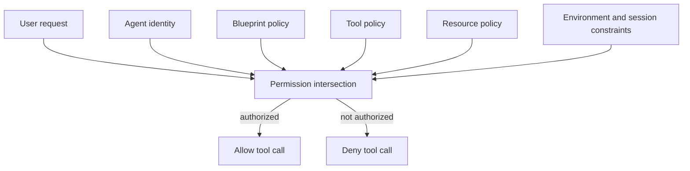
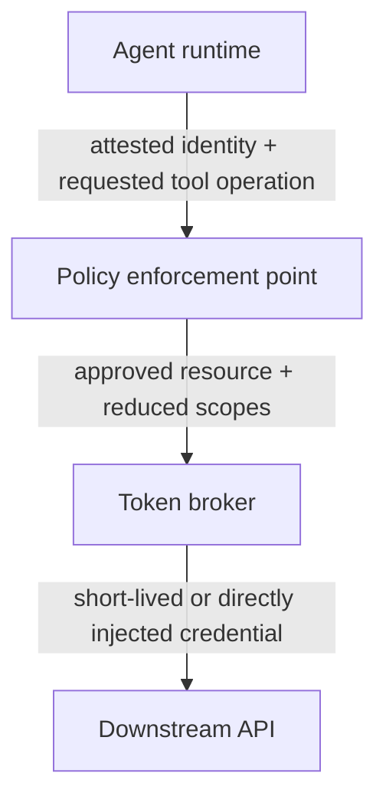
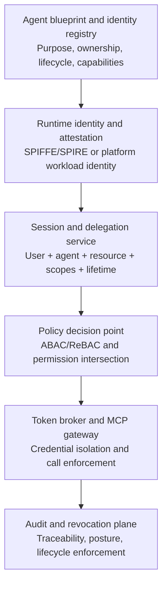

# Building First-Class Identities for Enterprise AI Agents

## Abstract

Enterprise AI agents increasingly run with credentials designed for deterministic software: service accounts, application credentials, API keys, or delegated human sessions. That abstraction is weakening because an agent chooses actions at runtime. It interprets natural-language instructions, retrieves untrusted context, selects tools, constructs parameters, delegates work, and can perform state-changing operations across multiple systems.

This note makes a practical claim: enterprises should treat agents as first-class identity principals, distinct from the human user, the hosting workload, and the tools they invoke. A workable architecture combines five controls in one plane: directory governance, runtime attestation, delegated user authority, policy evaluation, and credential isolation. This note outlines that model and uses [Agent Identity Lab](https://github.com/rmax-ai/agent-identity-lab) as an open-source proof-of-concept target for testing it.

## Thesis

The central claim is simple: the agent should be a distinct principal.

An enterprise agent identity should not collapse into its process, its model, or its human operator. It should be a registered principal with its own lifecycle, policy boundary, and runtime proof.

That principal needs four classes of information:

```text
Agent identity =
    cryptographic identity
  + provenance attributes
  + operational ownership
  + dynamic security context
```

- **Cryptographic identity** provides a verifiable identifier and signing or authentication material.
- **Provenance attributes** identify what is running: the agent blueprint, code revision, container image, model, prompt package, and tool configuration.
- **Operational ownership** identifies the accountable humans or teams: a technical owner, a business sponsor, and possibly a data owner.
- **Dynamic security context** describes the current execution: environment, acting user, session lifetime, risk signals, requested operation, and resource sensitivity.

Together, these elements produce a principal that administrators can govern, systems can authenticate cryptographically, and policies can constrain at runtime.

## Why existing workload identities are no longer enough

Service accounts still fit deterministic workloads. A scheduled export job has a known executable, a fixed trigger, and a bounded set of API calls. An agent does not. Its execution path depends on the user request, the model and prompt configuration, retrieved documents and external messages, available tool descriptions, intermediate model decisions, and responses from downstream systems.

The same agent can answer a question, search a repository, edit an issue, send a message, or initiate a deployment. It exercises authority through a reasoning loop, not through a predefined call graph.

That shift changes the security question. It is no longer enough to ask:

**Which application is making this request?**

An enterprise system also needs to ask:

**Which agent is acting, on whose behalf, from which runtime, under which configuration, and within what currently authorized boundary?**

This matters because agent runtimes now connect models to live enterprise systems through tool protocols, gateways, and orchestration frameworks. It also matters because prompt injection is a practical risk, not just a research concern. A document, issue, email, or web page can contain instructions meant to redirect the agent. Model-level protections may lower the chance of manipulation, but they do not create a reliable authorization boundary. Identity and authorization controls therefore need to assume that an agent can make a bad decision.

## Two identity models that need to be combined

Two emerging platform directions clarify the shape of a workable architecture. In practice, enterprises need both.

### Directory-managed agent identities

[Microsoft Entra Agent ID](https://learn.microsoft.com/en-us/entra/agent-id/) extends enterprise directory concepts to agents. Its central abstraction is the agent identity blueprint, a template that defines shared agent characteristics, authentication settings, required resource access, and inheritable permissions. Multiple identities can be created from one blueprint while retaining distinct credentials and permissions.

The blueprint also has a tenant-local principal. Microsoft uses that principal to provision and deprovision child agent identities and to attribute those administrative operations in audit logs. Disabling a blueprint can prevent its identities from authenticating.

This model is strong at inventory, ownership, lifecycle, policy inheritance, administrative delegation, access reviews, and tenant-level auditability. It answers the governance question: what kind of agent is this, who is responsible for it, and how is its fleet managed?

### Runtime-attested agent identities

[Google Cloud Agent Identity](https://docs.cloud.google.com/iam/docs/agent-identity-overview) starts closer to workload identity. Each supported agent receives a unique, strongly attested identity based on [SPIFFE](https://spiffe.io/). The identity is tied to the hosted agent resource rather than shared across workloads. Google states that agent identities cannot be impersonated and do not expose long-lived service-account keys to developers.

A representative identifier looks like this:

```text
spiffe://agents.example.system.id.goog/
  resources/aiplatform/projects/123/
  locations/europe-west4/reasoningEngines/research-agent
```

The corresponding principal can be referenced directly in IAM policies. Google-issued access tokens are cryptographically bound to the agent's X.509 credential, which reduces the usefulness of a stolen bearer token.

This model is strong at workload attestation, secretless authentication, short-lived credentials, runtime-to-resource binding, cryptographic isolation, and automatic credential rotation. It answers the execution question: which deployed runtime is making this request, and can it prove that identity?

### Why both are required

A complete enterprise design needs:

- a directory and governance identity that describes the approved agent
- an attested workload identity that proves which runtime is executing it

A directory object without runtime attestation can be copied or used from an unexpected environment. A workload identity without directory governance says little about business purpose, ownership, approved capabilities, or lifecycle.

## Authorization must be computed, not assumed

Authentication establishes which agent is running. It does not determine what the agent should be allowed to do during a particular task.

The effective permission boundary should be calculated dynamically:

```text
effective authority =
    user authority
  ∩ agent authority
  ∩ blueprint authority
  ∩ tool policy
  ∩ resource policy
  ∩ environment constraints
  ∩ session constraints
```

Consider a research agent that may read GitHub repositories but may never modify them. A user asks it to inspect a private repository. The request should succeed only when:

- the user can read that repository
- the agent identity is active
- the agent blueprint permits repository access
- the requested operation is read-only
- the runtime satisfies the blueprint's attestation policy
- the session has not expired or been revoked

The fact that the user can create issues does not mean the research agent should be allowed to create issues. The fact that the agent can read repositories does not mean it can read repositories the user cannot access. The resulting authority is narrower than either principal on its own.

This is a natural application of Attribute-Based Access Control. [NIST SP 800-162](https://csrc.nist.gov/pubs/sp/800/162/final) defines ABAC in terms of attributes associated with the subject, object, requested operation, and environment. Agent systems add useful subject and environment attributes:

```yaml
subject:
  agent_id: research-agent-17
  blueprint: research-agent-v3
  acting_user: user-492
  model: deepseek-pro
  code_revision: 9b02f15
  runtime_digest: sha256:abc123

object:
  type: github_repository
  organization: rmax-ai
  repository: agent-identity-lab
  classification: public

action:
  operation: search_code
  required_scope: repository:read

environment:
  deployment: development
  session_age_seconds: 217
  risk_level: low
```

A policy engine such as [Open Policy Agent](https://www.openpolicyagent.org/docs/latest/) or [Cedar](https://docs.cedarpolicy.com/) can evaluate this context at the moment of the tool call. A policy engine can still use static roles, but it should evaluate them alongside the live request context.



## Delegation must preserve both user and agent identity

When an agent acts for a user, downstream systems need to distinguish the subject from the actor.

The **subject** is the identity whose resources or authority are being used. The **actor** is the agent currently exercising that delegated authority.

[OAuth 2.0 Token Exchange, RFC 8693](https://datatracker.ietf.org/doc/html/rfc8693), defines an `act` claim for representing this relationship:

```json
{
  "sub": "user:492",
  "aud": "https://github-gateway.example.com",
  "scope": "repository:read",
  "act": {
    "sub": "agent:research-agent-17"
  }
}
```

This token means that `research-agent-17` is acting under authority associated with `user:492`.

RFC 8693 also permits nested actor claims, which makes it possible to represent a multi-agent delegation chain:

```json
{
  "sub": "user:492",
  "act": {
    "sub": "agent:repository-reviewer",
    "act": {
      "sub": "agent:research-orchestrator"
    }
  }
}
```

That history helps auditors attribute actions, but it does not authorize anything by itself. Each delegation step must narrow or preserve authority. It must never silently expand it. A sub-agent should receive a capability scoped to its specific task, resource, and lifetime, not the root agent's full session.

## Credential isolation is part of the identity boundary

Even a correctly authenticated agent runtime should not hold unnecessary secrets.

An agent processes untrusted text and generates dynamic tool arguments. If API keys or OAuth refresh tokens live in the same memory space, prompt injection, tool compromise, debugging mistakes, and accidental logging become more costly.

A safer architecture introduces a credential broker or token vault:



[Google's Agent Identity auth manager](https://docs.cloud.google.com/iam/docs/auth-manager-overview) acts as a centralized credential vault and authentication broker for API keys, machine-to-machine OAuth, and user-delegated OAuth. In the specific Agent Gateway and Gemini Enterprise path described in [Google Cloud Agent Identity](https://docs.cloud.google.com/iam/docs/agent-identity-overview), the gateway can decrypt the end-user credential so the agent never sees the raw credential.

The broader design principle is simple:

> Agents should request capabilities, not retrieve secrets.

Where possible, the gateway should inject the credential into the outbound request and return only the tool result. The agent does not need to see the token at all. Where direct token presentation is unavoidable, the broker should issue a short-lived credential restricted by audience, resource, scope, session, agent, acting user, proof-of-possession key, and expiration time.

## MCP is the natural enforcement boundary

The [Model Context Protocol](https://modelcontextprotocol.io/) standardizes how agent applications discover and invoke external tools. That makes the MCP boundary a natural place to enforce identity and authorization.

The MCP [authorization specification](https://modelcontextprotocol.io/specification/2025-11-25/basic/authorization) treats a protected MCP server as an OAuth resource server. It requires [OAuth Protected Resource Metadata, RFC 9728](https://datatracker.ietf.org/doc/html/rfc9728), for authorization-server discovery and requires clients to identify the target server using [OAuth resource indicators, RFC 8707](https://datatracker.ietf.org/doc/html/rfc8707).

A protected server can advertise metadata such as:

```json
{
  "resource": "https://tools.example.com/mcp",
  "authorization_servers": [
    "https://identity.example.com"
  ],
  "scopes_supported": [
    "repository:read",
    "issues:read",
    "issues:write"
  ]
}
```

The metadata solves protocol-level discovery, but an enterprise agent architecture still needs a policy enforcement layer around it.

An identity-aware MCP gateway should:

1. authenticate the agent session
2. identify the acting user
3. validate the runtime and agent lifecycle state
4. resolve the requested MCP tool to required scopes
5. evaluate the permission intersection
6. acquire or inject a downstream credential
7. forward the tool request
8. record the decision and result

The gateway should also enforce MCP token audience boundaries and avoid token passthrough between servers. A token issued for one server must not be forwarded to another. The MCP authorization specification requires clients to use the OAuth `resource` parameter and requires servers to validate that presented tokens were issued specifically for them. That requirement limits lateral movement when a token is exposed or one MCP server is compromised.

## Identity should be established before model execution

Many agent architectures request authorization only when the model decides to call a tool. That check is necessary, but it is incomplete.

An execution plan can declare its expected authority before an expensive or sensitive run begins:

```yaml
plan_id: plan-0182
agent_id: research-agent-17
acting_user: user-492

requested_operations:
  - tool: github.search_code
    resource: github.com/rmax-ai/agent-identity-lab
    scopes:
      - repository:read

  - tool: confluence.search
    resource: engineering-space
    scopes:
      - pages:read

constraints:
  network: enterprise-egress
  environment: development
  maximum_runtime_seconds: 900
```

The control plane can reject impossible or unauthorized plans before model inference starts.

This does not replace per-call authorization. The model may deviate from the plan, tool requirements may change, or the user's access may be revoked during execution. Preflight authorization defines an expected authority envelope. The gateway remains the final enforcement point.

Typed plans also improve auditability. Reviewers can compare:

- authority requested before execution
- authority granted to the session
- tools actually invoked
- authority used by each call

Unexpected differences become observable events.

## Agent identity requires an administrative lifecycle

Agent identity is not just a token format. It requires an administrative lifecycle.

**Registration**  
A developer or platform team registers an agent blueprint that describes business purpose, approved models, approved tools, maximum scopes, permitted environments, runtime requirements, session lifetime, technical owner, and business sponsor.

**Provisioning**  
A concrete agent identity is instantiated from the blueprint. It receives a unique principal identifier and registered verification material.

**Attestation**  
At startup, the runtime proves relevant properties such as workload identity, container digest, code revision, deployment environment, agent framework version, model identifier, and prompt package version. Software claims are not equivalent to hardware-backed attestation, but they still provide a useful verifiable binding for a proof of concept.

**Session issuance**  
The agent requests a short-lived session for a specific user, task, resource set, and scope set. The identity control plane evaluates policy and issues a bounded credential.

**Continuous enforcement**  
The platform checks every sensitive tool call against the current state of the agent, user, session, runtime, resource, and policy.

**Suspension and revocation**  
Suspending an agent identity should block subsequent calls even when an already-issued session token has not expired. The gateway therefore needs an online lifecycle or revocation check for sensitive operations.

**Decommissioning**  
When an agent is retired, the platform should revoke its identities, remove credentials, archive its audit history, and detach its resources and policies.

This lifecycle keeps agent sprawl from becoming the next form of service-account sprawl.

## Audit records must connect reasoning to authority

Traditional API logs answer questions such as which IP address accessed an endpoint and which token identifier was presented. That is not enough for autonomous workflows.

A useful agent audit record should connect three layers.

**Identity provenance**

- agent identity
- acting user
- blueprint and version
- runtime identity
- code and container digest
- model and prompt version

**Authorization decision**

- requested tool and operation
- requested and effective scopes
- target resource
- policy version
- decision and reason
- human approval, when required
- issued credential lease

**Execution trace**

- plan and trace identifiers
- tool arguments, with sensitive fields redacted
- downstream response metadata
- execution result
- failure or denial reason

A representative event could look like this:

```json
{
  "event_type": "tool.authorization.allowed",
  "agent_id": "research-agent-17",
  "acting_user_id": "user-492",
  "session_id": "session-81",
  "trace_id": "trace-943",
  "blueprint": "research-agent-v3",
  "model": "deepseek-pro",
  "runtime_digest": "sha256:abc123",
  "tool": "github",
  "operation": "search_code",
  "resource": "rmax-ai/agent-identity-lab",
  "requested_scopes": ["repository:read"],
  "effective_scopes": ["repository:read"],
  "policy_version": "2026-07-10.1",
  "decision": "allow"
}
```

The goal is not to log every private reasoning token. The goal is to preserve enough evidence to reconstruct who exercised authority, why the platform permitted it, and what external effect followed.

## Concrete examples

### Example 1, a read-only research agent

A research agent is approved to read repositories but never modify them. A user with read and write access asks the agent to inspect a private repository and summarize a design change.

The correct result is:

- allow repository read access if the user can read the repository
- deny issue creation or write operations, even if the user independently has write permission
- deny all access if the agent identity is suspended
- deny access if the runtime fails attestation
- avoid exposing downstream credentials to the agent runtime

This is the simplest useful example because it tests the distinction between user authority and agent authority.

### Example 2, Agent Identity Lab as an executable proof of concept

[Agent Identity Lab](https://github.com/rmax-ai/agent-identity-lab) is intended as a vendor-neutral reference implementation of this architecture. It does not replace an enterprise identity provider or certificate authority; it makes agent identity concrete enough to test, inspect, and challenge.

The initial proof of concept is expected to include:

- blueprint-based agent registration
- individual agent identities and lifecycle states
- signed software runtime attestations
- user-to-agent delegation grants
- short-lived agent session tokens
- permission intersection through a policy engine
- an identity-aware MCP gateway
- server-side credential injection
- credential lease tracking
- tamper-evident audit records
- an integration example for the Hermes agent runtime

The intended request path is:



The core demonstration uses a read-only research agent. It should be allowed to search an approved repository when both the user and agent have read access. A write attempt should be denied even when the acting user independently has write permission. Suspending the agent identity should invalidate subsequent calls. External credentials should remain outside agent memory.

A concrete request path for that demo is:

```text
Hermes agent
    |
    | signed runtime attestation
    v
Agent Identity Lab session service
    |
    | short-lived agent session
    v
MCP gateway
    |
    | policy decision + credential injection
    v
GitHub or mock MCP server
    |
    | result + structured audit record
    v
Hermes agent
```

The repository should provide executable scenarios rather than only architecture diagrams:

```text
make demo-authorized-read
make demo-denied-write
make demo-user-lacks-access
make demo-suspended-agent
make demo-invalid-runtime
make demo-secret-isolation
```

The most important invariant is:

> A denied action must never cause a downstream credential to be issued.

Other invariants include:

```text
effective scopes ⊆ requested scopes
effective scopes ⊆ agent scopes
effective scopes ⊆ user scopes
effective scopes ⊆ blueprint scopes

revoked agent → no valid new session
suspended agent → no successful tool call
unknown tool mapping → deny
policy service unavailable → deny
```

These properties are testable independently of model quality. That independence is precisely their value.

## Trade-offs and failure modes

A dedicated identity layer does not make an agent trustworthy.

It does not eliminate:

- prompt injection
- malicious tools
- poisoned retrieval results
- unsafe model behavior
- incorrect planning
- data leakage through legitimate outputs
- excessive access granted by bad policy
- compromised identity infrastructure

Identity changes the **failure boundary**.

A manipulated research agent with unrestricted user credentials may modify repositories, send messages, or access unrelated systems. The same agent, operating under a short-lived, attested, read-only identity, remains dangerous within its allowed read boundary but cannot silently acquire write authority.

That is the security objective: not to prove that the reasoning process is correct, but to limit what incorrect reasoning can do.

There are also unresolved engineering questions:

- **Cognitive-state attestation**: infrastructure can attest a container image, executable, deployment, and key, but it cannot yet prove that the agent's current context, memory, or planning state has not been manipulated.
- **Multi-agent delegation semantics**: RFC 8693 can represent actor chains, but complex agent systems still need precise rules for delegation depth, scope reduction, revocation propagation, and accountability across orchestrators and workers.
- **Cross-organization trust**: SPIFFE federation can establish workload trust across domains, but business authorization requires more than certificate validation. Organizations need interoperable ways to exchange agent provenance, approved capabilities, liability boundaries, and revocation signals.
- **Identity granularity**: an identity can represent an agent product, deployment, replica, session, or individual task. Coarse identities are easier to operate but produce wider blast radii. Fine-grained identities improve isolation but increase lifecycle and observability costs.
- **Policy latency**: Online token exchange, attestation validation, and dynamic policy evaluation add latency. Systems will need bounded caches and fast revocation channels instead of choosing between full online validation and long-lived authorization.

These are engineering problems, not reasons to keep using broad service accounts.

## Practical takeaways

1. Treat the agent as its own principal, not as a renamed service account or a thin wrapper around a user's full session.
2. Combine directory governance with runtime attestation. Either one alone leaves an important gap.
3. Compute effective authority as an intersection of user, agent, blueprint, tool, resource, environment, and session constraints.
4. Keep long-lived credentials out of agent memory. Prefer capability requests, short-lived brokered credentials, and server-side injection.
5. Put enforcement at the MCP or tool gateway boundary, and fail closed when policy, mapping, or lifecycle state is uncertain.

## Scope and positioning

This note is not academic research. It does not propose a new formal model, benchmark, or proof system.

It is also not a blog opinion piece. The claims here are architectural and operational. They are meant to be challenged through implementation, policy design, and failure testing.

It is not vendor documentation either. The examples draw from Microsoft Entra Agent ID and Google Cloud Agent Identity because they illustrate two useful directions, but the intent is a vendor-neutral control-plane model that can be built with existing enterprise identity systems, policy engines, and tool gateways.

This is exploratory lab work, not a validated standard. The architectural claims are grounded in existing identity patterns, published protocol specifications, and emerging vendor implementations, but the end-to-end model described here is still a synthesis. Treat it as a practical design hypothesis for enterprise agent systems, not as authoritative guidance.

The scope is intentionally narrow. This note focuses on identity, delegation, authorization, credential isolation, and auditability for tool-using agents. It does not attempt to solve model alignment, reasoning correctness, retrieval safety, or organizational governance beyond what is needed to define and operate an agent principal.

## References

1. Microsoft, [What is Microsoft Entra Agent ID?](https://learn.microsoft.com/en-us/entra/agent-id/)
2. Microsoft, [Agent identity blueprints in Microsoft Entra Agent ID](https://learn.microsoft.com/en-us/entra/agent-id/agent-blueprint)
3. Microsoft Graph, [agentIdentityBlueprint resource type](https://learn.microsoft.com/en-us/graph/api/resources/agentidentityblueprint?view=graph-rest-1.0)
4. Google Cloud, [Agent Identity overview](https://docs.cloud.google.com/iam/docs/agent-identity-overview)
5. Google Cloud, [Agent Identity auth manager overview](https://docs.cloud.google.com/iam/docs/auth-manager-overview)
6. SPIFFE, [SPIFFE overview](https://spiffe.io/)
7. SPIFFE, [SPIFFE ID and Verifiable Identity Document](https://spiffe.io/docs/latest/spiffe-about/spiffe-concepts/)
8. SPIFFE, [X.509-SVID specification](https://github.com/spiffe/spiffe/blob/main/standards/X509-SVID.md)
9. SPIFFE, [SPIRE — the SPIFFE Runtime Environment](https://spiffe.io/docs/latest/spire-about/)
10. NIST, [SP 800-162: Guide to Attribute Based Access Control Definition and Considerations](https://csrc.nist.gov/pubs/sp/800/162/final)
11. IETF, [RFC 8693: OAuth 2.0 Token Exchange](https://datatracker.ietf.org/doc/html/rfc8693)
12. IETF, [RFC 8707: Resource Indicators for OAuth 2.0](https://datatracker.ietf.org/doc/html/rfc8707)
13. IETF, [RFC 9728: OAuth 2.0 Protected Resource Metadata](https://datatracker.ietf.org/doc/html/rfc9728)
14. Model Context Protocol, [Authorization specification](https://modelcontextprotocol.io/specification/2025-11-25/basic/authorization)
15. Open Policy Agent, [OPA documentation](https://www.openpolicyagent.org/docs/latest/)
16. Cedar, [Cedar documentation](https://docs.cedarpolicy.com/)
17. RMax AI, [Agent Identity Lab](https://github.com/rmax-ai/agent-identity-lab)
