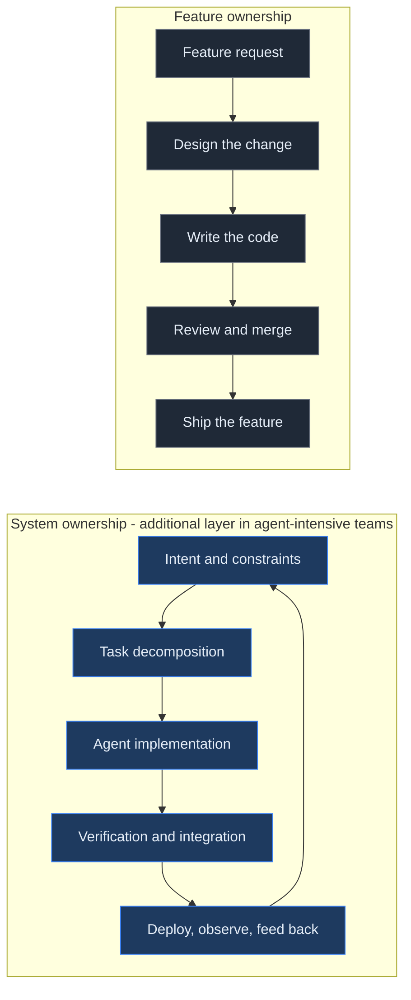
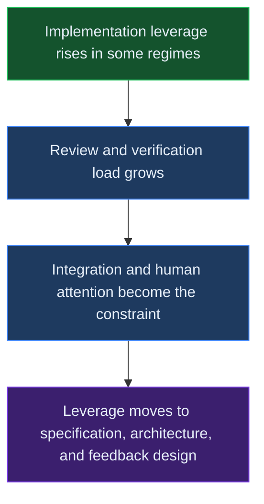
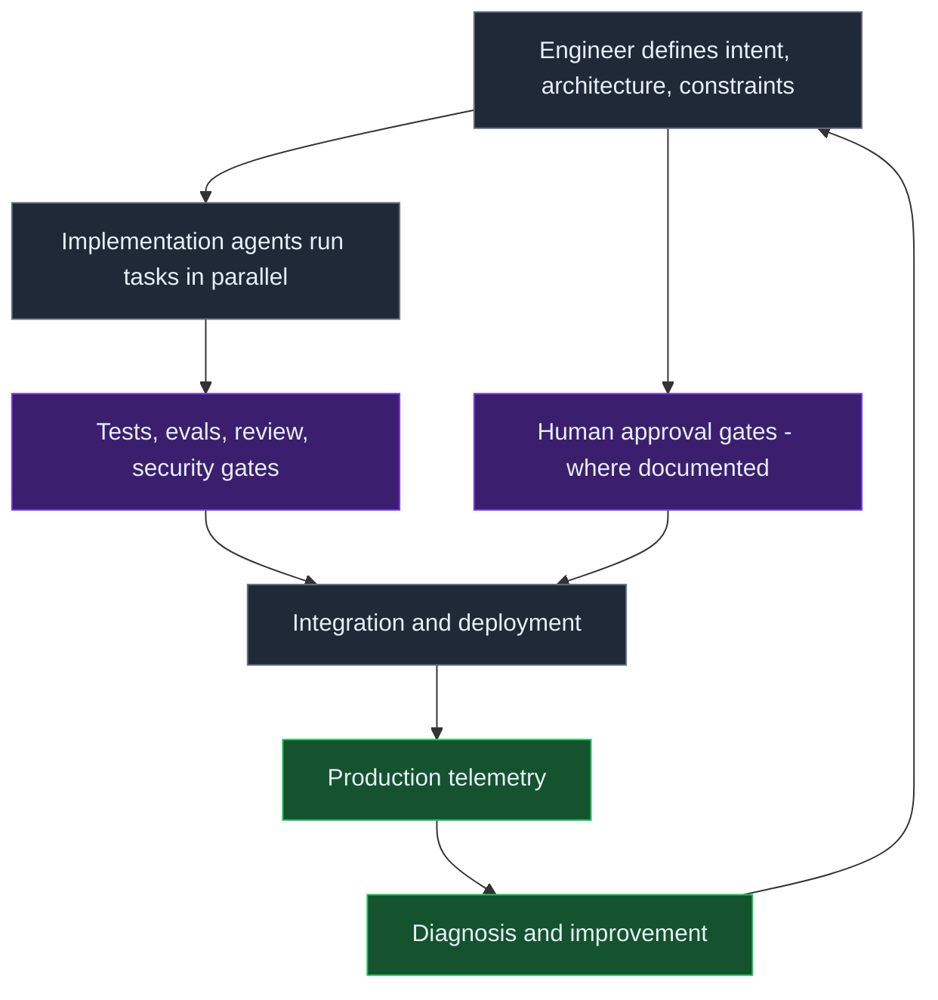

# From Feature Ownership to System Ownership

> **Abstract.** Coding agents are beginning to change senior software engineering less by eliminating implementation than by making implementation capacity programmable. In agent-intensive teams, an engineer's leverage increasingly comes from defining intent, architecture, constraints, verification, and operational feedback systems that let many implementation tasks execute safely in parallel. This note separates the better-evidenced claim about implementation productivity from the weaker claim about changing ownership. The transition is visible in frontier workflows and production accounts, but evidence that it has broadly produced smaller teams or flatter organizations remains preliminary.

The question is not whether a model can write code faster in a bounded task. It is what an engineer owns when implementation is delegable. Feature ownership covers request, design, implementation, review, and shipping. System ownership adds the conditions under which many changes can be specified, generated, verified, integrated, deployed, observed, and improved without one engineer writing every line.

The thesis is deliberately narrow: coding agents are making implementation capacity programmable in some engineering regimes. That can move senior leverage toward intent, architecture, constraints, verification, and operational feedback. It extends the DevOps tradition of end-to-end ownership into a possible ownership of the software-producing system itself. The workflow claim is stronger than the organizational claim. The evidence supports a partial transition in documented frontier teams, not a general occupational or headcount conclusion.

The first diagram is a conceptual distinction, not a measured workflow and not a claim that one form of ownership replaces the other. Feature delivery remains inside the larger system:

## Implementation leverage, immediately bounded

The strongest broad evidence here concerns implementation output, not ownership. A set of three randomized field experiments involving **4,867 developers** reported a **26.08% increase (SE: 10.3%) in completed tasks**. The [Microsoft Research report](https://www.microsoft.com/en-us/research/publication/the-effects-of-generative-ai-on-high-skilled-work-evidence-from-three-field-experiments-with-software-developers/) labels the result as a completed-task outcome across the study window. It does not measure speed, code quality, or a change in senior responsibility. The same randomized field-experiment report found that less experienced developers had higher adoption rates and greater productivity gains, a subgroup result rather than evidence about who owns the system.

The immediate counterweight is a different randomized design. In an [early-2025 METR randomized controlled trial](https://metr.org/blog/2025-07-10-early-2025-ai-experienced-os-dev-study/) of **16 experienced open-source developers** working on **246 real issues**, the measured task-time result was that “when developers use AI tools, they take **19% longer** than without.” Continuous-integration time also changed by **+2% to +39%** in that study. The tools were early-2025 tools used on mature, familiar repositories, so the result is a bound on that regime, not a timeless statement that agents are slower.

METR's [2026 methodological update](https://metr.org/blog/2026-02-24-uplift-update/) says its data is “only **very weak evidence** for the size of this increase” in later improvement. It points to selection effects, including task choice and a pay-cut change from $150 to $50 per hour, while the study design is being changed. That sentence belongs beside every later speed or leverage claim: the evidence does not justify assuming a universal post-2025 speedup.

An industry survey provides different context. [DORA's 2025 report](https://dora.dev/research/2025/dora-report/) draws on survey responses from nearly **5,000 technology professionals** and **100+ hours** of qualitative work. Its interpretation is that AI acts as an **amplifier**, magnifying organizational strengths and dysfunctions. This is survey and correlational evidence, not an experiment; completed-task counts still do not report review, repair, or verification burden.

## Where the bottleneck goes

When implementation capacity rises in a bounded workflow, the scarce work can move rather than disappear. The [GitHub account of Copilot code review](https://github.blog/ai-and-ml/github-copilot/60-million-copilot-code-reviews-and-counting/) reports **60 million** reviews, **10×** growth, more than **one in five** code reviews on GitHub, and automatic runs in **12,000 organizations**. Those are review events and adoption telemetry, not accepted-and-useful reviews. The same account's volume therefore makes verification capacity more important, not less.

[Cursor's Bugbot account](https://cursor.com/blog/building-bugbot) reports resolution rising from **52% to over 70%** across its workflow. This is a vendor case result, not a general review-quality measurement. Its useful implication is bounded: automated review can find and resolve more issues in a configured workflow, while humans still need to judge whether the issue, fix, and residual risk are acceptable.

The direct role evidence is a longitudinal survey by [Vella and Blincoe](https://arxiv.org/abs/2605.23135), not a productivity benchmark. The two-wave survey went from **158 to 101 participants**, with **95 matched** responses. **82%** reported spending less time writing code; respondents described a shift from creation to **verification** and **supervisory engineering work**. The same self-report study contains a paradox: **84%** perceived improvement, while worsened experience rose from **14% to 27%**. These are perceptions over a six-month window from one cohort, but they directly support a cautious claim that the work can change character.

The larger observational evidence is consistent with that pressure. An [agent-PR study](https://arxiv.org/abs/2601.15195) analyzed **33k agent-authored PRs** from five agents: documentation, CI, and build tasks merged best, while performance and bug-fix tasks performed worst. Non-merges were associated with larger diffs, more files, and CI failures. A **600-PR** taxonomy included reviewer disengagement, duplicates, unwanted features, and misalignment. This measures neither delay nor production loss; it shows why generated changes need an evidence and repair path.

The following conceptual loop makes the allocation shift explicit. It combines the self-report role evidence with duties documented in production accounts; it is not a measured universal sequence:

This is why [verification-first software engineering](/notes/verification-first-software-engineering/), [the change as the unit of assurance](/notes/the-change-is-the-unit-of-assurance/), and [Beyond evals](/notes/beyond-evals-assurance-model/) matter here: durable leverage connects intent to tests, review, security gates, integration, deployment, telemetry, diagnosis, and recovery.

The production loop is a conditional model of system ownership. Human approval gates appear only where documented:

## The machines that actually exist

The production accounts are useful as existence proofs, not as population estimates. In its [five-month harness account](https://openai.com/index/harness-engineering/), OpenAI reports **0 lines of manually-written code**, a team moving from **3 to 7 engineers**, about **1,500 pull requests**, about **1 million lines of code**, and **3.5 PRs per engineer per day**. The same account says runs can last **upwards of 6 hours** and describes the result as built in approximately **1/10th the time** it would have taken by hand. That last figure is the company's author estimate, not a measured speedup. The account also says the bottleneck became human QA capacity, while failed runs, human rescue, task mix, and quality outcomes are not disclosed.

[OpenAI's Symphony account](https://openai.com/index/open-source-codex-orchestration-symphony/) reports a **500% increase** in landed pull requests **on some teams within the first three weeks**, while describing an interactive ceiling of **3–5 agent sessions**. “Some teams” and “first three weeks” are part of the claim. The board acts as a control plane and tickets can represent larger work units, but human attention remains a constraint when those units produce changes that need review. METR's 2026 bound still applies: its evidence is only very weak evidence for the size of later improvement.

Anthropic's [compiler account](https://www.anthropic.com/engineering/building-c-compiler) reports **16 agents**, nearly **2,000 Claude Code sessions**, and **$20,000** spent on a **100,000-line compiler** that can build Linux 6.9 on x86, ARM, and RISC-V. The work ran for two weeks and used **2B input tokens** and **140M output tokens**. Its concurrency story is as important as its result: agents overwrote one another until a deterministic oracle using GCC cross-checks supplied a coordination boundary. Anthropic's [harness account](https://www.anthropic.com/engineering/effective-harnesses-for-long-running-agents) frames long-running agents around human-engineer-inspired structure and documents four failure modes. These are company technical accounts; they can omit failed runs and rescue effort.

The [Bun Rust rewrite account](https://bun.com/blog/bun-in-rust) reports **535,496 lines of Zig**, about **50 dynamic workflows** over **11 days**, **64 Claudes running for 11 days**, and **6,778 commits** from May 3 to the merge on May 14. The net diff was **+1,009,272** lines, and the account says **0 tests were skipped or deleted**. Its statement that the work would take a small team a **full year** is an attributed counterfactual, not a measured comparison. Human monitoring continued throughout, so the commit count is not a substitute for verification. METR's 2026 update remains the bound on treating any such case as a general speed result.

Other accounts show the same system shape with different limits. [GitHub Mission Control](https://github.blog/ai-and-ml/github-copilot/how-to-orchestrate-agents-using-mission-control/) describes orchestrating a small fleet. Cursor's [Amplitude account](https://cursor.com/blog/amplitude) reports **3× weekly production commits** and **60–70% of low-risk PRs merged directly**, with a cloud-versus-local ceiling. Its [Faire account](https://cursor.com/blog/faire) reports **2× PR throughput** and attributes an **18-month migration compression** to the workflow; that is a company estimate, not a controlled measurement. [Cursor Automations](https://cursor.com/blog/automations) documents security review on push, agentic codeowners, and incident response. Review, integration, and operational ownership remain part of every account.

These systems resemble a programmable runtime layer. [The harness is becoming the runtime](/notes/the-harness-is-becoming-the-runtime/) describes that boundary; the operational question is who maintains the gates when many tasks are live.

## Concurrency and coordination economics

Parallel implementation creates a bill in conflicts, overwrites, and integration work. [AgenticFlict](https://arxiv.org/abs/2604.03551) collected **142K+ Agentic PRs from 59K+ repositories**, of which **107K+** were processed through deterministic merge simulation. **29K+ PRs** exhibited simulated merge conflicts, yielding a **27.67% conflict rate**, with **336K+ fine-grained conflict regions**. This is an observational simulation denominator, not a production-merge rate. Conflict incidence is a coordination cost in the simulation; it is not merge delay, production loss, or a net productivity estimate.

The [concurrent-agent replay study](https://arxiv.org/abs/2607.04697) reports textual conflict rates of **41.7% versus 19.8%** for cross-agent versus intra-agent conflicts in its analyzed replay subset, with non-overlapping 95% confidence intervals. In the same study, only **0.5% of co-active pairs were cross-agent**. The base rate matters: a high conditional conflict rate does not mean cross-agent coordination dominates all work. These two studies use different populations and methods and should not be aggregated.

Anthropic's compiler account supplies a concrete mechanism for the abstract cost. Independent agents overwrote one another until a deterministic oracle could compare compiler behavior against GCC. That does not show every multi-agent build needs the same oracle, but it shows that parallel generation needs a truth source and integration boundary. The software-producing system owns those boundaries, including when to stop, retry, split, or hand work back to a human. METR's 2026 update still says its data is only very weak evidence for later improvement; simulated conflict rates cannot repair that limitation.

## Smaller teams, flatter orgs: context, not cause

Organizational interpretation needs controls before it needs an AI story. Meta's [2023 Year of Efficiency account](https://about.fb.com/news/2023/03/mark-zuckerberg-meta-year-of-efficiency/) described approximately **10,000 roles cut** and **5,000 open requisitions closed**, alongside a plan to remove multiple layers of management. That program predates the agent-intensive workflows discussed here. It is a reminder that the post-2022 efficiency cycle, macro conditions, and management redesign are competing explanations for organization-level movement.

Carta's [marketplace data note](https://carta.com/data/newsletter-ai-takes-startup-jobs/) reports that a Series-A company in **2024** had a median of **15 full-time employees**, down from **22** in **2022**. The author says it would be inaccurate to pin the entirety of that difference on AI and closes with “No final conclusions yet.” That is the appropriate register for this note: a cohort comparison is context, not an identified effect.

SignalFire's [2026 State of Talent report](https://www.signalfire.com/blog/signalfire-state-of-talent-report-2026) reports engineering-manager spans of about **12**, up from **10** at technology majors, a **+14%** change versus 2019; startup spans are about **15**, a **+34%** change. It also reports PMs at **+22%** and engineers at **55% of all hiring**, versus **46% in 2019**. This is proprietary recruiting-report data over its own periods and is correlational. It can describe a concurrent staffing pattern, not an AI effect.

The accounts and surveys support a hypothesis that implementation capacity and verification duties are being reorganized in some teams. They do not establish smaller teams, fewer managers, a flatter hierarchy, or a general change in seniority mix. A careful organizational analysis would need controls for the efficiency cycle, company stage, revenue, product mix, labor market conditions, and selection into agent-intensive work before attributing any organizational outcome to agents.

## The lineage: ownership is old; programmable implementation capacity is the new element to test

This is not a clean succession. Specialist roles, full-stack work, DevOps, platform engineering, Staff-plus engineering, AI-assisted engineering, and agent orchestration overlap. The DevOps lineage is often summarized by Werner Vogels's “you build it, you run it” formulation in [ACM Queue from 2006](https://aws.amazon.com/blogs/aws/acm_queue_inter/). Platform engineering made shared environments explicit; Backstage's [project history](https://backstage.spotify.com/discover/backstage-101) dates its first internal version to **2018** and reports adoption by **over 2,600 companies**.

Those dates are antecedents, not proof of a new succession. The novelty worth testing is narrower: documented instances where agents, reusable harnesses, and verification gates make implementation capacity programmable. “You build it, you run it” can become defining the conditions under which a fleet builds, verifies, ships, observes, and repairs. That interpretation remains conditional on the gates working.

## What it means role by role

For junior and mid-level engineers, agent-intensive workflows may raise the implementation floor while making the learning path less obvious. A generated change can be easy to request and difficult to understand. Durable skills include stating intent, inspecting assumptions, building tests, interpreting failures, and explaining why a change belongs in the system. This is an interpretation, not a measured career outcome.

For senior and Staff-plus engineers, the ownership shift is more concrete but still bounded. The Vella and Blincoe longitudinal survey is the direct self-report evidence for the creation-to-verification shift and supervisory engineering work. Production accounts document engineers defining task units, maintaining harnesses, setting verification gates, resolving integration failures, and closing telemetry loops. Those duties support an observed-in-account or inferred workflow claim. PR volume and agent counts alone would not support it.

For managers, the practical problem is calibration. A [Pragmatic Engineer account](https://newsletter.pragmaticengineer.com/p/the-great-engineering-leader-career-break) offers secondary practitioner context for how leadership work may change, but it is a hypothesis generator, not causal evidence. Managers still need to distinguish more generated changes from more valuable changes, and more review events from more reliable review. The Vella and Blincoe paradox is the warning: perceived improvement and worsened experience can coexist when flow and cognitive load change.

The METR bound belongs here too: its 16-developer early-2025 randomized trial does not justify a universal speed assumption, and its 2026 update calls later improvement evidence only very weak. Career advice that assumes every team has crossed into system ownership would outrun the evidence.

## The operational question

The useful question for an engineer is not “How many agents can I start?” It is: **What system would let this class of feature be implemented, verified, shipped, observed and improved repeatedly without depending on me to write every line?**

Answering that question is itself system ownership. It requires a specification boundary, task decomposition that preserves intent, agents with bounded authority, verification that can reject plausible work, integration rules for parallel changes, deployment and telemetry, and a feedback path that turns failures into better constraints. It also requires knowing where the system is not ready: when the review queue is saturated, the oracle is weak, the task is under-specified, or the cost of coordination exceeds the implementation saving.

The conclusion is partial. Evidence is comparatively strong that bounded implementation leverage can coexist with a larger verification and integration burden, and that several frontier teams have built reusable systems around that burden. Evidence is weak and mostly correlational for organizational restructuring. The next engineering move is not to declare the feature obsolete. It is to make the production system around the feature explicit, measurable, and owned.

## Practical Takeaways

- Keep implementation productivity claims separate from ownership claims. A completed-task count or PR count is not evidence of a role change.
- Put review, verification, repair, and integration costs next to every generation-volume figure.
- Treat vendor accounts as existence proofs. Record the task mix, human rescue, failed runs, gates, and outcome evidence they do not disclose.
- If agents run in parallel, define the truth source, merge boundary, retry policy, and human stop condition before increasing concurrency.
- Test system ownership through repeated feature delivery with observable feedback, not through agent count or organizational anecdotes.

## Positioning Note

This is practitioner analysis, not an academic meta-analysis, a vendor tutorial, or a claim that one operating model is standard. It connects the evidence to earlier rmax.ai notes on [operating agent systems](/notes/from-human-orchestrated-agent-to-autonomous-control-plane/), harnesses, verification, changes, and production assurance, while keeping measured studies, surveys, vendor cases, simulations, and interpretation in separate registers. The organizational section is deliberately contextual: it does not attribute team size or hierarchy to AI.

## Status & Scope

This note was prepared from public sources checked on 2026-09-27. It is an evidence-labeled analysis for senior engineers, Staff-plus ICs, and engineering leaders evaluating agent-intensive workflows. The workflow thesis is partially supported by randomized studies, surveys, observational studies, and documented company accounts; the ownership interpretation is narrower and the organizational conclusion remains preliminary. Vendor cases omit information about failed runs and rescue effort, survey findings are self-reported or correlational, and simulations and replays do not establish production outcomes. This is not authoritative organizational guidance or a benchmark of agent quality.

## References

- [Microsoft Research: The effects of generative AI on high-skilled work](https://www.microsoft.com/en-us/research/publication/the-effects-of-generative-ai-on-high-skilled-work-evidence-from-three-field-experiments-with-software-developers/)
- [METR: Early-2025 AI experienced open-source developer study](https://metr.org/blog/2025-07-10-early-2025-ai-experienced-os-dev-study/)
- [METR: Uplift update](https://metr.org/blog/2026-02-24/uplift-update/)
- [DORA 2025 report](https://dora.dev/research/2025/dora-report/)
- [Google Cloud announcement of the 2025 DORA report](https://cloud.google.com/blog/products/ai-machine-learning/announcing-the-2025-dora-report)
- [OpenAI: Harness engineering](https://openai.com/index/harness-engineering/)
- [OpenAI: Open-source Codex orchestration with Symphony](https://openai.com/index/open-source-codex-orchestration-symphony/)
- [Anthropic: Building a C compiler with parallel Claude Code agents](https://www.anthropic.com/engineering/building-c-compiler)
- [Anthropic: Effective harnesses for long-running agents](https://www.anthropic.com/engineering/effective-harnesses-for-long-running-agents)
- [Bun: Rewriting Bun in Rust](https://bun.com/blog/bun-in-rust)
- [AgenticFlict simulation study](https://arxiv.org/abs/2604.03551)
- [Concurrent-agent replay study](https://arxiv.org/abs/2607.04697)
- [Agent PR failures study](https://arxiv.org/abs/2601.15195)
- [Vella and Blincoe: Longitudinal survey](https://arxiv.org/abs/2605.23135)
- [GitHub Mission Control](https://github.blog/ai-and-ml/github-copilot/how-to-orchestrate-agents-using-mission-control/)
- [GitHub: 60 million Copilot code reviews](https://github.blog/ai-and-ml/github-copilot/60-million-copilot-code-reviews-and-counting/)
- [Cursor Automations](https://cursor.com/blog/automations)
- [Cursor: Building Bugbot](https://cursor.com/blog/building-bugbot)
- [Cursor: Amplitude](https://cursor.com/blog/amplitude)
- [Cursor: Faire](https://cursor.com/blog/faire)
- [SignalFire State of Talent report](https://www.signalfire.com/blog/signalfire-state-of-talent-report-2026)
- [Carta: AI takes startup jobs](https://carta.com/data/newsletter-ai-takes-startup-jobs/)
- [Meta: Year of Efficiency](https://about.fb.com/news/2023/03/mark-zuckerberg-meta-year-of-efficiency/)
- [ACM Queue lineage reference](https://aws.amazon.com/blogs/aws/acm_queue_inter/)
- [Backstage 101](https://backstage.spotify.com/discover/backstage-101)
- [Pragmatic Engineer: The great engineering leader career break](https://newsletter.pragmaticengineer.com/p/the-great-engineering-leader-career-break)
