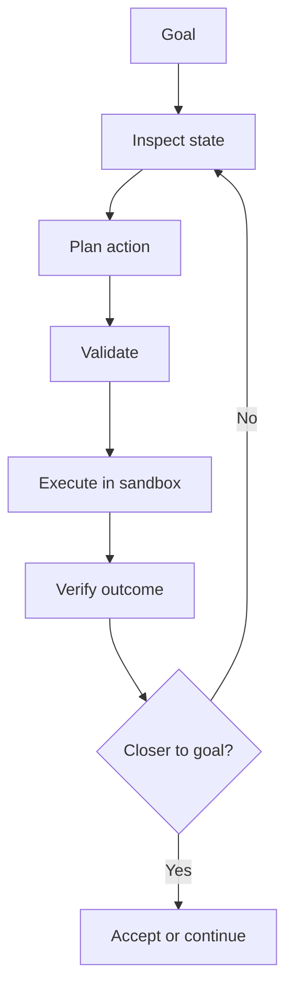

Autonomous agents do not become robust because a model can reason in natural language. They become useful when they operate inside a harness that exposes state, constrains actions, validates changes, and measures outcomes. This note argues that the shift from task automation to goal-driven systems is primarily a systems engineering problem. For operators building agent-enabled software, the practical question is not how to get better prompts, but how to design environments where agents can inspect, act, verify, and improve safely.

## Core Thesis

Goal-driven agents are only as capable as the harness and target system around them. Reliable autonomy does not come from reasoning alone. It comes from closed-loop operation over observable state, constrained actions, validation gates, and objective verification signals.

A useful shorthand is:

Task agents execute tasks.  
Goal agents create tasks.

That ability to generate and revise tasks makes goal-driven systems adaptive. It also makes them risky when the surrounding environment is weak.

## Context & Motivation

Traditional automation has been task-shaped. Scripts run fixed jobs. CI pipelines execute predefined stages. Workflow engines move work through explicit branches. These systems are valuable because their behavior is legible and constrained, but they only do what was specified in advance.

Agent systems change the operating model. Instead of being handed a workflow, they are given an outcome and asked to find a path to it. That creates a different engineering problem. The limiting factor is no longer instruction quality alone. It is whether the surrounding system gives the agent enough visibility, enough control, and enough feedback to operate without causing damage.

A common mistake in discussions of autonomy is to treat it as a property of the model. In practice, autonomy emerges from the interaction of three layers:

- the agent, which reasons and selects actions
- the harness, which mediates what the agent can see and do
- the target system, which exposes state, accepts changes, and emits outcome signals

That framing matters because it moves the problem from model mystique to system design.

## Mechanism / Model

Task-oriented systems follow a fixed path:

`input -> workflow -> output`

They are well suited to narrow, repeated work:

- CI runners building and testing software
- support automations routing tickets
- dependency bots opening routine update PRs

Their strength is predictability. Their weakness is brittleness when conditions change.

Goal-oriented systems follow an adaptive loop. They operate on outcomes rather than instructions, and they regenerate the next action from current evidence.

This loop depends on a harness. The harness is the infrastructure layer between the agent and the target system. It is not a convenience wrapper. It is the mechanism that makes iterative autonomy possible.

A workable harness usually provides five components:

1. Context ingestion  
   The agent can inspect repository state, configuration, logs, metrics, dependency graphs, or architecture artifacts.

2. Action interface  
   The agent has structured ways to make changes, such as code edits, configuration APIs, or infrastructure tooling.

3. Execution sandbox  
   Proposed changes run in an isolated environment rather than directly against production systems.

4. Evaluation system  
   Tests, benchmarks, performance measures, or reliability indicators determine whether an action helped.

5. Decision gate  
   Policies decide whether a change is rejected, retried, escalated, or accepted.

The target system also has to meet the agent halfway. A strong harness cannot compensate for a system with poor observability, unsafe write paths, or no reliable outcome signals. In practice, agent-compatible systems tend to be:

- observable
- testable
- reproducible
- modular
- rollback-friendly

If those properties are missing, planning becomes speculation and verification becomes guesswork.

## Concrete Examples

### Autonomous Coding Agents

Autonomous coding agents make the model concrete because the loop is easy to inspect. A typical repository-improvement cycle looks like this:

1. inspect repository structure and current failures
2. propose a code or configuration change
3. validate with static analysis or schema checks
4. apply the patch in a sandbox
5. run tests or CI to verify the result

The operational lesson is that most failures here are not caused by weak reasoning alone. They are caused by weak harnesses: flaky tests, incomplete coverage, missing policy gates, poor rollback discipline, or no clear metric for improvement.

If the evaluation system cannot distinguish improvement from regression, the agent cannot improve the repository reliably.

### Infrastructure or Optimization Agents

The same pattern appears outside code editing. An optimization agent tuning system performance needs:

- current metrics and logs
- constrained configuration interfaces
- policy checks before risky changes
- reproducible experiments
- outcome measures such as latency, cost, or error rate

Without those pieces, the agent is not optimizing a system. It is sampling changes blindly and hoping the environment is forgiving.

## Trade-Offs & Failure Modes

This approach improves adaptability, but it introduces new costs.

First, the harness becomes part of the product. Teams must build and maintain evaluation logic, safety gates, and reproducible execution environments. That is real engineering work.

Second, outcome quality is bounded by signal quality. If tests are flaky, metrics are noisy, or goals are underspecified, the agent will optimize against unstable or misleading feedback.

Third, not every domain benefits from goal-driven control. For highly regulated or tightly bounded tasks, a fixed workflow may still be the better tool.

Common failure modes include:

- poor observability, so the agent plans from incomplete state
- unsafe action surfaces, so mistakes are expensive
- weak validation, so invalid changes propagate too far
- weak verification, so regressions are accepted as progress
- non-deterministic environments, so the agent cannot learn from repeated attempts

The broader point is simple: better models do not remove the need for discipline. They increase the penalty for weak surrounding systems.

## Practical Takeaways

- Treat the harness as a first-class system component, not glue code around a model.
- Start with objective verification signals before expanding agent authority.
- Prefer reversible, version-controlled action interfaces over direct mutation of live systems.
- Invest in deterministic tests and reproducible environments; they are prerequisites for autonomous improvement.
- Design target systems for observability and rollback if you expect agents to operate on them safely.

## Positioning Note

This is not academic research. It does not attempt a formal theory of autonomy or a benchmark taxonomy.

It is not a blog-style opinion piece. The claims here are operational claims about what tends to work when agents move from demos into real software environments.

It is also not vendor documentation. The model applies across tools and frameworks because the core issue is architectural: whether a system can support closed-loop improvement.

## Status & Scope Disclaimer

This note is exploratory but grounded in practical patterns emerging from agent-enabled software work. It reflects personal lab reasoning and operator-oriented synthesis rather than a controlled comparative study. It is non-authoritative by design: a working model for engineers building agent harnesses, not a final statement on autonomous systems.
