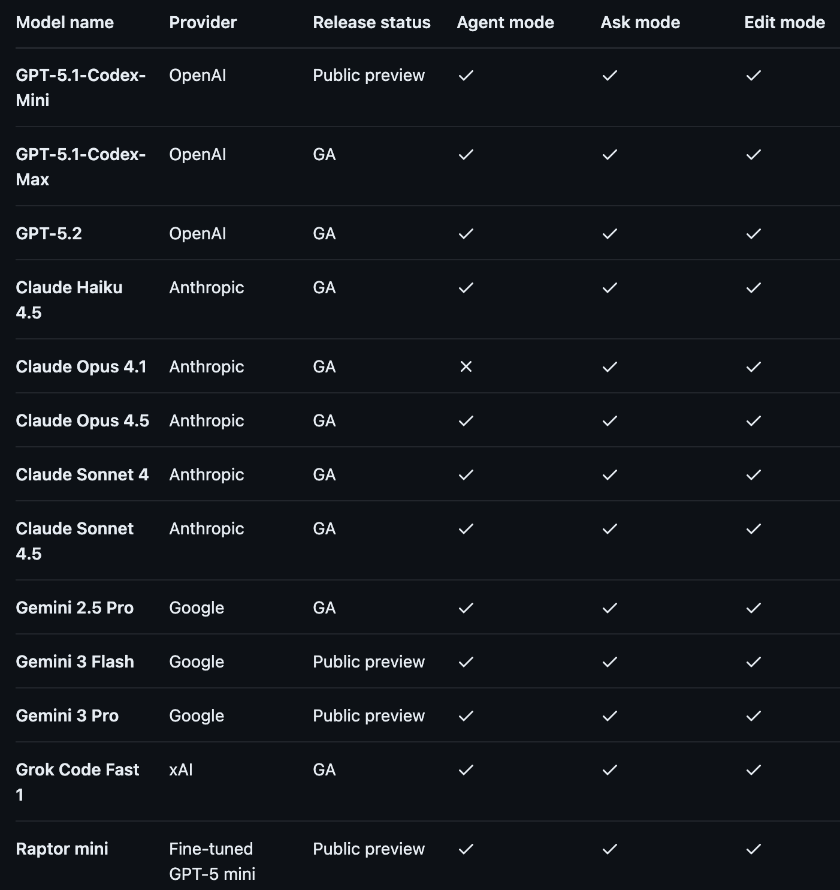

# Model Selection in GitHub Copilot: A Systems Design Approach to Engineering Intelligence

*Figure 1: GitHub Copilot Model Table - Tiers and Capabilities.*

The proliferation of frontier and near-frontier models within development environments like GitHub Copilot has transitioned model selection from a convenience feature to a critical systems design problem. Without a disciplined selection framework, engineers risk cognitive overspend, inflated review complexity, and a degradation of architectural rigor. This note outlines a tiered selection strategy optimized for the solo engineer-researcher, prioritizing the maximization of **research throughput per unit of attention** over raw code volume.

## Context & Motivation

As of early 2026, the integrated development environment (IDE) provides access to a heterogeneous array of models with disparate reasoning capabilities and latency profiles.

The primary bottleneck in agentic software engineering is no longer code generation, but the human capacity for **verification and judgment**. When an engineer defaults to the most powerful model for every task—a practice termed "vibe coding"—they often introduce unnecessary complexity and non-local side effects. This "intelligence over-provisioning" increases the long-term cognitive load of the system without a commensurate increase in utility.

## Core Thesis: The Principle of Least Power

Model selection is an exercise in resource allocation. The governing principle for applied research and development is: **Use the weakest model that can reliably complete the task.**

Intelligence must be treated as a scarce resource, reserved for irreversible architectural decisions. Mechanical execution should be delegated to high-throughput, low-latency "swarm" models. This approach preserves the engineer's "attention budget" for parts of the system where correctness is difficult to verify automatically.

## Hierarchy of Intelligence Tiers (Premium-Aware)

Selection is governed by a four-tier hierarchy based on the **premium-request cost**, the required **reasoning horizon**, and the **cost of verification**.

### Premium request cost model

| Cost | Premium Impact | Meaning |
| :--- | :--- | :--- |
| **0x** | 0 requests | Non-metered budget-free primitives. |
| **0.33x** | 1/3 request | Cheap, fractional execution. |
| **1x** | 1 request | Full premium execution. |
| **3x** | 3 requests | Strategic-only high-cost synthesis. |

---

### Tier 0: High-Frequency Core (0x)
*Models: Raptor mini, Grok Code Fast 1, GPT-5-mini*

*   **Objective:** Routing, rapid iteration, and workspace-wide actuation.
*   **Use Case:** The "operating system" of the environment. Always enabled for orchestration.
*   **Model Profiles:**
    *   **🦅 Raptor mini:** Optimized for multi-file, dependency-aware edits with massive context (~264K).
    *   **🏎️ Grok Code Fast:** Ultra-low-latency accelerator for tight TDD loops and exploratory debugging.
    *   **💎 GPT-5-mini:** The "cognitive glue" for task classification, routing, and instruction adherence.
*   **Heuristic:** If the task is an "inner loop" or purely mechanical actuation, 0x is the default.

### Tier 1: Cheap Execution Layer (0.33x)
*Models: Claude Haiku 4.5, Gemini 3 Flash, GPT-5.1-Codex-Mini*

*   **Objective:** Fast, clean prose and light code mechanics.
*   **Use Case:** Summaries, documentation, and small code transformations.
*   **Strength:** Predictable instruction following at fractional cost.
*   **Heuristic:** If better language quality or reliability is needed without full premium cost, Tier 1 is sufficient.

### Tier 2: Premium Execution (1x)
*Models: Claude Sonnet 4.5, GPT-5.1-Codex / Max*

*   **Objective:** Multi-file maneuvers and feature implementation.
*   **Use Case:** The "senior engineer" tier for standard development work.
*   **Model Notes:** **Codex-Max** is prioritized for long-horizon maneuvers; **Sonnet 4.5** is preferred for correctness and PR hygiene.
*   **Heuristic:** If the change spans more than ~3 files or introduces new invariants, Tier 2 is the default.

### Tier 3: Strategic Cognition (3x)
*Models: Claude Opus 4.5*

*   **Objective:** Deep synthesis and high-level structural planning.
*   **Use Case:** Research framing, architecture-level decisions, and high-level critiques.
*   **Constraint:** Always checkpointed. Never background. Used rarely and deliberately.
*   **Heuristic:** If the output will influence *weeks of work*, Tier 3 is justified. Otherwise, it is waste.

## Clarifying the Role of GPT-5, GPT-5.2, and Gemini 3 Pro

Wait, notice a pattern? **GPT-5**, **GPT-5.2**, and **Gemini 3 Pro** are missing from our Tiered Execution list.

While these models are available, in the rMax.ai lab, we treat them as **Benchmarked Instruments** rather than **Routing Tiers**. Here’s why:

*   **GPT-5.1-Codex / Max** is the superior *executioner*. It is tuned specifically for the latency and multi-file horizon of the Copilot workspace.
*   **Claude Opus 4.5** remains the gold standard for *synthesis*.

Use **GPT-5**, **GPT-5.2**, or **Gemini 3 Pro** sparingly, primarily as **Secondary Auditors**. If Sonnet 4.5 produces a fix that feels "smelly," prompt GPT-5.2 for an *evaluation* rather than a *generation*. They are your peer reviewers, not your primary builders.

## Canonical Routing Policy

To maximize leverage per premium request, follow a strict escalation path:

1.  **Classify (0x):** Start with **GPT-5-mini** to classify the task and estimate the blast radius.
2.  **Execute (0x/0.33x):** Use **Grok** for speed, **Raptor** for scale, or **Haiku/Flash** for cheap prose.
3.  **Escalate Intentionally (1x/3x):** Use **Sonnet/Codex** for correctness, **Opus** for direction, and **GPT-5/5.2** for auditing.

**No silent escalation.** Every move to $\ge 1x$ models must be deliberate.

## Decision Matrix

| Phase | Goal | Reasoning Horizon | Recommended Tier |
| :--- | :--- | :--- | :--- |
| **Ideation** | Decide what is worth building | Long | **Tier 3** |
| **Scoping** | Define boundaries and success metrics | Long | **Tier 3** |
| **Design** | Architecture-level thinking and evals | Long | **Tier 3 → Tier 2** |
| **Implementation** | Build and refactor logic | Medium | **Tier 2** |
| **Scaling** | Parallelize work (tests, fixtures) | Short | **Tier 0 → Tier 1** |
| **Evaluation** | Validate and falsify via benchmarks | Long | **Tier 3** |
| **Documentation** | Explain outcomes and API docs | Short | **Tier 1** |

## Trade-offs & Failure Modes

*   **Verification Lag:** Using Tier 2 or 3 for agentic execution shifts the bottleneck to the human's ability to review. Increasing generation throughput without increasing verification capability leads to system entropy.
*   **Context Fragmentation:** Frequent model switching during a session can degrade the engineer's mental model ("state"), even if the Copilot context remains synchronized.
*   **The Luxury Trap:** Using Tier 2 or Tier 3 for Tier 1 tasks leads to "review fatigue." Because the model is highly capable, the engineer may lower their guard, missing subtle errors in otherwise elegant-looking code.

## Human-in-the-loop Constraints

Verification effort must scale with model autonomy. As the reasoning horizon shifts from Tier 1 to Tier 3, the human role transitions from **execution** to **orchestration and judgment**.

1.  **No Autonomous Deployment:** Zero-touch deployment is prohibited. All agentic output requires human review.
2.  **Explicit Intent Mapping:** Every agent-generated PR or code block must map to an explicit goal or architectural invariant.
3.  **Proportional Verification:** The rigor of manual review and automated testing must increase linearly with the complexity of the delegated task.
4.  **Hypothesis-Driven Coding:** Treat model outputs as hypotheses to be falsified, not truths to be accepted.

## Anti-patterns

*   **Vibe Coding:** Defaulting to Tier 2 or Tier 3 for routine implementation without a justification for the reasoning complexity.
*   **Unbounded Autonomy:** Allowing agents to run across multiple files or sessions without defined checkpoints and human verification.
*   **Intelligence Over-provisioning:** Using high-entropy models for low-entropy tasks (e.g., o1-class for unit test boilerplate), leading to "review fatigue."
*   **Ignoring Side Effects:** Assuming Tier 2/3 refactors are local. Always assume non-local impact unless proven otherwise by automated suites.

## The Non-Negotiable: Evals over Intuition

At the end of the day, **model selection without evaluation is guesswork**. In the rMax.ai workflow, the single most important factor in choosing a model is empirical performance on specific tasks, measured by explicit evaluation suites rather than "vibes."

### Why evals matter more than model specs

*   Context window size does not predict correctness.
*   Latency does not predict usefulness.
*   Premium cost does not predict quality.
*   "Feels smart" does not predict reliability.

Only evals tell you where a model fails, how often it fails, and whether those failures are acceptable for the task.

### Operational Implication

> **Never argue about models in the abstract. Argue with eval results.**

If a 0x model passes your evals, it is *better* than a 3x model that does not. If a 0.33x model is "good enough," the premium model is waste.

**Final Heuristic:** Models are hypotheses. Evals are the evidence. Budget follows evidence.

## Practical Takeaways

1.  **Default to Tier 2 (Sonnet 4.5):** This is currently the Pareto frontier for general-purpose engineering.
2.  **Escalate for Irreversibility:** If a decision cannot be easily undone (e.g., database schema, core API), move to Tier 3 immediately.
3.  **Delegate for Volume:** For repetitive changes across $>10$ files, prioritize Tier 0 (Raptor/Grok) and Tier 1 to minimize latency and cost.
4.  **Verification Scales with Autonomy:** The more you delegate execution to the model, the more rigorous your automated evaluation (tests, linters) must be.

## Positioning & Disclaimer

**Positioning:** Designed for the **solo researcher-engineer** who must maximize impact while minimizing "busy work." It prioritizes *Thinking over Typing*.

**Scope:** These guidelines apply specifically to the GitHub Copilot ecosystem as of Q1 2026. While specific model mappings will evolve, the tiering logic and selection heuristics are designed for durability.

> **Closing Heuristic:** Models are hypotheses. Evals are the evidence. Budget follows evidence.

### Related
- [AI-Native Engineering: From Autocomplete to Agent Orchestration](../ai-native-engineering/) (Background)
- [Typing Code Is Solved](../typing-code-is-solved/) (Theoretical Foundation)
