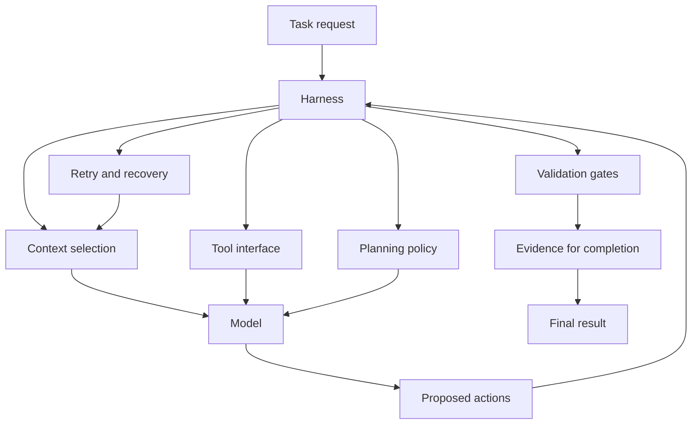
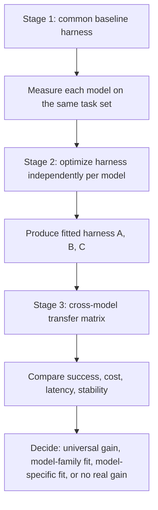
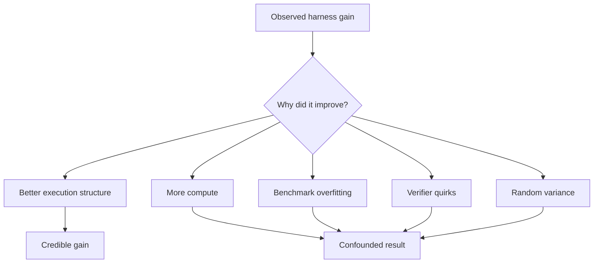

# The Harness Gap: Measuring Model–Harness Fit in Coding Agents

A coding agent is not just a model. It is a model operating inside a deterministic execution system that decides what context to load, which tools to expose, how results are represented, when to retry, and what evidence is required before a run can end. This note argues that the surrounding system materially affects agent performance, and that model comparisons increasingly need to separate raw model capability from model–harness fit.

The central operational question is not simply whether harness optimization works. It is whether different models benefit from different harnesses under the same task and budget constraints.

## Context and motivation

As agent systems have evolved from single-turn prompting into long-running execution loops, practical engineering effort has shifted from prompt wording toward execution design. Anthropic's writing on [context engineering](https://www.anthropic.com/engineering/effective-context-engineering-for-ai-agents), [tool design for agents](https://www.anthropic.com/engineering/writing-tools-for-agents), and [effective harnesses for long-running agents](https://www.anthropic.com/engineering/effective-harnesses-for-long-running-agents) points in the same direction: once a model is allowed to act over time, the interface around it becomes part of the capability surface.

This matters because agent evaluations are increasingly used to choose models, budgets, and deployment policies. If the harness meaningfully shapes outcomes, then many public benchmark results are measuring two things at once: model quality and the scaffold around the model.

Work such as [SWE-agent](https://arxiv.org/abs/2405.15793) established that agent–computer interface design can change coding performance. More recent papers such as [Meta-Harness](https://arxiv.org/abs/2603.28052), [TTHE: Test-Time Harness Evolution](https://arxiv.org/abs/2607.08124), and [Rethinking the Evaluation of Harness Evolution for Agents](https://arxiv.org/abs/2607.12227) push the question further. They ask whether harnesses can be optimized systematically, and whether the apparent gains survive fair controls.

## Core thesis

The right unit of comparison for coding agents is not the model alone. It is the model plus harness, evaluated on a task distribution under explicit resource limits.

A stronger version of that claim is the one worth testing:

1. Changing the harness can change the performance of a fixed model.
2. Searching the harness space may discover better configurations than a reasonable manual baseline.
3. Different models may have different best-fit harnesses.

The first claim is increasingly well supported. The second is plausible but easy to overstate. The third is the most informative, because it would imply that a generic harness can systematically mismeasure some models.

## Mechanism: what the harness does

In practice, the harness is the control system around the model. It shapes what the model sees, what actions it can take, and when the run is allowed to stop.

This diagram shows the operational split between model reasoning and harness control.

For coding work, the harness usually determines:

- system instructions and repository context
- file search and navigation tools
- tool names, schemas, and result formatting
- planning requirements
- context compaction and summarization policy
- retry logic and failure handling
- test, lint, and type-check triggers
- completion criteria and evidence requirements
- safety, cost, and permission controls

This is why agent capability is not identical to model capability. A capable model behind a poor harness can look clumsy for reasons that have little to do with the model's internal competence.

## A simple model of the harness gap

The term "harness gap" is useful only if it refers to a measurable difference rather than a vague intuition.

For a given model:

- start with a common baseline harness
- optimize or fit a harness within a bounded search space
- compare the fitted harness against the baseline
- test whether that fitted harness still helps other models

Three quantities matter:

| Quantity | Meaning | Question it answers |
| --- | --- | --- |
| Optimization gap | Improvement from baseline harness to fitted harness for the same model | Did harness search help at all? |
| Matching gap | Advantage of a model's own fitted harness over harnesses fitted for other models | Is the gain model-specific? |
| Transfer effect | Change when one model uses another model's fitted harness | Do harness improvements generalize? |

A useful harness utility function should include more than success rate. It should also account for cost, latency, and stability. Otherwise, the optimizer can appear to win simply by spending more compute.

## How to measure model–harness fit

A credible experiment needs three stages with matched budgets.

This diagram shows the minimum evaluation loop.

### Stage 1: common-harness baseline

Run several models on the same held-out tasks using one reasonable generic harness. This produces a standard model leaderboard, but only within that interface.

### Stage 2: independent harness optimization

Optimize the same bounded harness search space independently for each model. The model changes, but the task distribution, tool permissions, and execution ceilings remain fixed.

Possible search dimensions include:

- terse versus detailed system instructions
- explicit planning versus direct action
- broad versus narrow tool menus
- raw versus summarized tool output
- fresh-context retries versus continued-history retries
- eager versus delayed validation
- strict versus permissive completion schemas

### Stage 3: cross-model transfer

Evaluate every optimized harness with every model. This is the step that separates general harness quality from genuine model–harness coupling.

A transfer matrix can produce at least five outcomes:

- one harness works well for everyone
- harnesses transfer within model families
- each model prefers its own fitted harness
- task type matters more than model identity
- apparent gains disappear under fair controls

A good experiment should remain open to all five outcomes.

## Concrete examples

### Example 1: interface design as capability design

[SWE-agent](https://arxiv.org/abs/2405.15793) is the clearest concrete example of the harness effect in coding. Its contribution was not only a benchmark score. It showed that a model's ability to act on a repository changes when file viewing, editing, navigation, and command execution are exposed through an interface designed for model use rather than through a generic shell alone.

That result is best read as a systems result: the same model can perform differently when the interface changes.

### Example 2: a controlled internal evaluation scenario

Consider three coding models on an internal bug-fix workload modeled after [SWE-bench](https://arxiv.org/abs/2310.06770) or [SWE-bench Verified](https://www.swebench.com/verified.html), but with hidden tests and matched tool permissions.

A common baseline harness might require:

- raw shell output
- no explicit planning
- one retry
- validation only at the end

A fitted harness for one model might instead use:

- a compact repository map up front
- structured search tools
- focused validation after meaningful edits
- fresh-context retry after repeated tool failures

If that fitted harness improves only the model it was optimized for, and the improvement shrinks when transferred to other models, that is evidence of model–harness fit. If it helps every model similarly, it is better understood as a general harness improvement.

## Why false gains are easy to produce

Harness optimization can overfit just as easily as model training can.

This diagram shows the main failure paths.

The most common confounders are:

- task overfitting to a repeated evaluation set
- repository overfitting to one codebase's conventions
- optimizer overfitting to noise in small samples
- budget inflation through more retries, tokens, or tests
- leakage through visible tests or weak completion rules

This is where [Rethinking the Evaluation of Harness Evolution for Agents](https://arxiv.org/abs/2607.12227) is especially useful. Its main contribution is not a dismissal of harness search. It is a stricter comparison standard: compare optimized harnesses against simpler retry and search baselines under matched information and compute, not against a weak one-shot baseline.

## Practical takeaways

1. Evaluate complete agent systems, not models in isolation.
2. Treat tool schemas, output formats, and validation rules as capability-shaping components.
3. Separate execution budget from optimization budget in any harness experiment.
4. Store traces, rejected harness candidates, and ablations; otherwise, you cannot distinguish structure from noise.
5. Re-run evaluations after model upgrades, because a previously good harness may become unnecessary or counterproductive.

## Trade-offs and failure modes

Harness optimization is attractive because it is cheaper and faster than changing model weights. It is also dangerous for the same reason.

What it does well:

- improves operational reliability without retraining
- exposes deterministic engineering leverage
- allows targeted adaptation to repository and workflow constraints

What it does poorly:

- can produce brittle gains that fail on held-out tasks
- can hide simple budget inflation behind more elaborate orchestration
- can make systems harder to reason about if the harness becomes too adaptive

What it does not solve:

- missing model capability on tasks outside the model's competence range
- weak or non-executable validation environments
- poor repository hygiene, slow tests, or ambiguous acceptance criteria

## Positioning note

This note is narrower than academic research because it focuses on what should be measured in a real agent evaluation loop. It is more structured than a blog opinion because the central claim is meant to be falsifiable. It is less prescriptive than vendor documentation because it is not tied to one framework, one model provider, or one product surface.

The main point is not that one harness recipe is best. It is that model comparisons without harness controls are easy to misread.

## Status and scope disclaimer

This is an exploratory technical note from a personal lab context, not an authoritative standard or a validated benchmark result. The argument is grounded in published papers, engineering writeups, and a small prototype effort, but the model-specific harness thesis remains an open empirical question. The intended scope is coding agents operating under explicit tools, validation, and budget constraints; it does not attempt to generalize to all agentic systems.

## A small proof of concept

[HarnessFit](https://github.com/rmax-ai/harness-fit) is an early prototype for making harness-fit experiments concrete. Its current capabilities include:

- running configured models under one shared generic harness
- executing deterministic hidden-test evaluation
- persisting per-run success, score, cost, latency, tokens, tool calls, event logs, and failure labels
- evaluating a supplied machine-readable harness JSON on the held-out split
- generating persisted-run reports with success, score, cost, and average duration

What it does not yet do — and what is planned as remaining implementation work — includes:

- end-to-end optimizer CLI and candidate-history persistence
- cross-model transfer-matrix execution
- stability, variance, and statistical-acceptance reporting
- a larger benchmark (the current split is 3 train, 2 dev, 1 test)
- validated live provider results

As a result, HarnessFit does not yet establish whether a harness gap is real, general, model-specific, or mostly an artifact of evaluation design. But it provides the initial execution and measurement substrate needed to investigate that question rigorously.

## References

- [SWE-agent: Agent–Computer Interfaces Enable Automated Software Engineering](https://arxiv.org/abs/2405.15793)
- [Writing Effective Tools for Agents—With Agents](https://www.anthropic.com/engineering/writing-tools-for-agents)
- [Effective Context Engineering for AI Agents](https://www.anthropic.com/engineering/effective-context-engineering-for-ai-agents)
- [Effective Harnesses for Long-Running Agents](https://www.anthropic.com/engineering/effective-harnesses-for-long-running-agents)
- [Meta-Harness: End-to-End Optimization of Model Harnesses](https://arxiv.org/abs/2603.28052)
- [Rethinking the Evaluation of Harness Evolution for Agents](https://arxiv.org/abs/2607.12227)
- [TTHE: Test-Time Harness Evolution](https://arxiv.org/abs/2607.08124)
- [SWE-bench: Can Language Models Resolve Real-World GitHub Issues?](https://arxiv.org/abs/2310.06770)
- [SWE-bench Verified](https://www.swebench.com/verified.html)
- [DSPy: Compiling Declarative Language Model Calls into Self-Improving Pipelines](https://arxiv.org/abs/2310.03714)
- [TextGrad: Automatic Differentiation via Text](https://arxiv.org/abs/2406.07496)
- [Demystifying Evals for AI Agents](https://www.anthropic.com/engineering/demystifying-evals-for-ai-agents)
- [HarnessFit](https://github.com/rmax-ai/harness-fit)
