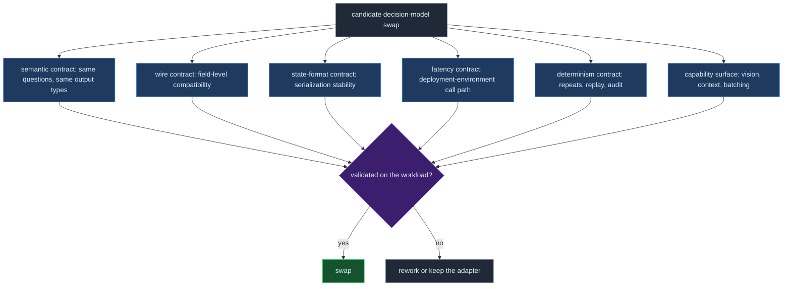
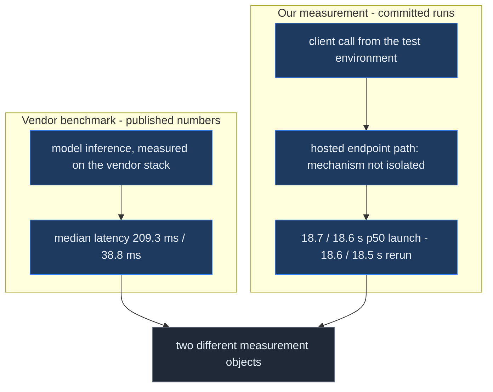
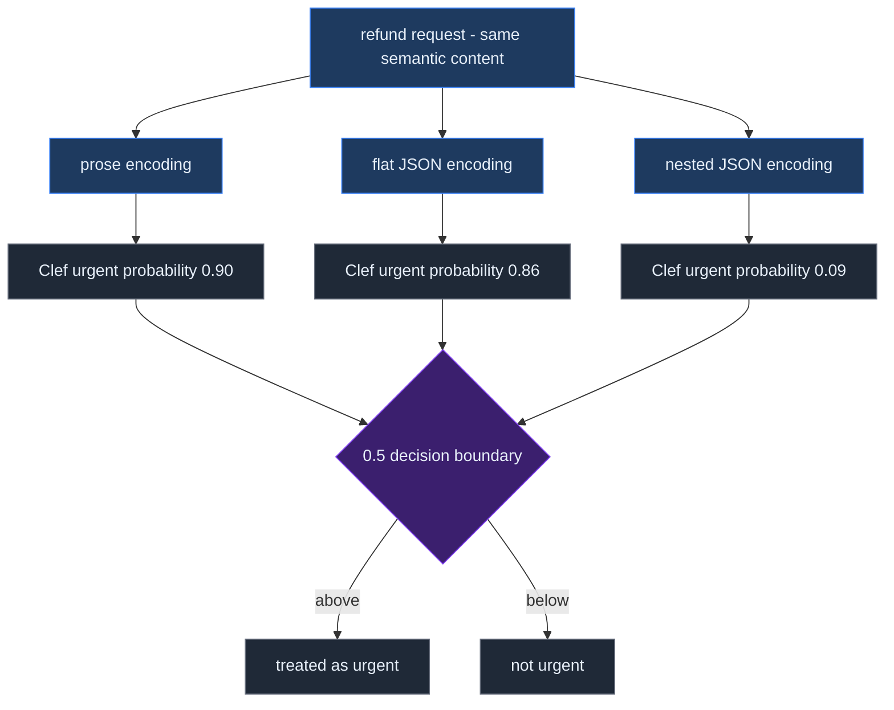

# Jev vs Clef: What a Launch-Week Stress Test Found

Decision models occupy an unusual point in an agent stack. They do not generate plans or prose. They take application state plus typed questions and return bounded answers with probabilities that software can branch on directly.

TypeSafe introduced this interface with [System One models and Jev](https://typesafe.ai/blog/introducing-system-one-models-and-jev). Its API accepts a shared `state` and questions such as booleans, choices, or scores; the output is typed rather than free-form text. [Vercel exposes Jev as an evaluation model](https://vercel.com/ai-gateway/models/jev) for routing, classification, rubric scoring, and verification.

On October 1, Cloudflare released [Clef and Clef-flash](https://blog.cloudflare.com/clef-decision-models/), two open-weight decision models hosted on Workers AI. Cloudflare describes them as System One-compatible and positions the 27B Clef model for higher-precision decisions and the 9B Clef-flash model for latency-sensitive use. The [Workers AI documentation](https://developers.cloudflare.com/workers-ai/models/clef/) adds 64K context, multimodal state, up to 64 questions per request, and vision; the model weights are published under Apache-2.0 for [Clef](https://huggingface.co/Cloudflare/clef) and [Clef-flash](https://huggingface.co/Cloudflare/clef-flash).

We already use Jev-style decision models in workflow experiments, so the practical question was not whether Clef looked competitive on a vendor benchmark. It was whether we could substitute it in the kinds of gates we actually build. We ran a small launch-week stress test on our own box, then re-ran the full battery three days later, keeping both dated runs side by side.

The result was mixed in the useful way: the larger Clef model was strong on our author-expected decisions and added capabilities Jev did not have, but latency, state-format sensitivity, and one API incompatibility were large enough that a blind swap would have changed system behavior.

## The benchmark

The public [jev-vs-clef repository](https://github.com/rmax-ai/jev-vs-clef) contains the harness, specification, raw calls, and reports. Each full run recorded **159 calls** across three arms; both runs used the byte-identical battery. The launch-window run (2026-10-03) and the rerun (2026-10-06) keep their raw evidence committed: [launch report](https://github.com/rmax-ai/jev-vs-clef/blob/main/results/run-20261003-main/report.md) · [launch calls](https://github.com/rmax-ai/jev-vs-clef/blob/main/results/run-20261003-main/calls.jsonl) · [rerun report](https://github.com/rmax-ai/jev-vs-clef/blob/main/results/run-20261004-rerun/report.md) · [rerun calls](https://github.com/rmax-ai/jev-vs-clef/blob/main/results/run-20261004-rerun/calls.jsonl).

| Arm | Hosted path | Input price used by the run | Relevant capability |
|---|---|---:|---|
| Jev | TypeSafe System One through Vercel AI Gateway | $0.042 / M tokens | text decision model |
| Clef 27B | Cloudflare Workers AI | $0.24 / M tokens | 64K context, vision |
| Clef-flash 9B | Cloudflare Workers AI | $0.09 / M tokens | 64K context, vision |

The battery used synthetic support-routing, guardrail, formatting, scale, repeatability, batching, and edge cases. Each arm received the same state and question content, except for one documented type-name translation: Cloudflare expects `noul` for yes/no questions while the Jev gateway path expects `boolean`.

The runs proceeded through smoke, probe, and battery phases under a spend guard. Every raw request, response, latency, provider-usage record, and cost is committed in the two `calls.jsonl` logs. The derived numbers below come from the two final reports, and a [launch-versus-rerun delta table](https://github.com/rmax-ai/jev-vs-clef/blob/main/results/run-20261004-rerun/delta-vs-20261003.md) recomputes every headline metric from the raw calls.

## Accuracy was close; operational behavior was not

Across 24 author-expected question-level decisions, Clef 27B matched 23 in both runs; Jev matched 22 in the launch run and 20 in the rerun; Clef-flash matched 19 in both:

| Metric (launch · rerun) | Jev | Clef 27B | Clef-flash |
|---|---:|---:|---:|
| Author-expected decision accuracy (n=24) | 92% · 83% | 96% · 96% | 79% · 79% |
| Agreement with Jev, 48 questions | — | 90% · 88% | 85% · 83% |
| p50 latency in our test environment | 0.3 s · 0.3 s | 18.7 s · 18.6 s | 18.6 s · 18.5 s |
| Average cost per call from provider usage | $0.000021 | $0.000111 · $0.000113 | $0.000038 · $0.000039 |

This is too small a labeled set for a general quality ranking. The labels are our expected answers, not independent ground truth, and the disagreements concentrated on deliberately ambiguous cases: mixed-topic routing, borderline urgency, spam/security-disclosure handling, and feature-request classification. The labeled subset also moved between our two runs — Jev from 22 to 20 — which at n=24 is a reminder about sample size, not a trend about models.

That concentration matters. A decision model usually sits at a branch point. The interesting failures are not only obvious wrong answers but cases near a policy boundary where two reasonable classifiers disagree. Those are also the cases where an escalation band or human review is useful.

The cost differences were real but small in absolute terms. Across the two 159-call batteries, computed spend was **$0.0097** and **$0.0099** from provider usage; the conservative estimates were **$0.017** each. For this workload, model cost was not the limiting resource.

Latency was.

## The hosted latency was the main surprise

Cloudflare’s launch post reports median model-benchmark latencies of **209.3 ms for Clef** and **38.8 ms for Clef-flash**, and presents Clef-flash as appropriate for latency-critical decisions. Those are vendor benchmark numbers, not an end-to-end SLA.

Our API path during launch week behaved very differently: **18.7 s p50 for Clef and 18.6 s for Clef-flash**, versus **0.3 s for Jev** in the same harness. The full rerun three days later measured **18.6 s and 18.5 s** — the same 18–19 second band, and it held across every phase of both runs: smoke, probe, and the full battery.

We checked whether simple client-side serialization was hiding the difference. It was not. Sequential and four-way-parallel clef probes gave ~19 s medians in both runs (parallel-to-sequential ratios of 1.03× and 1.01×). Even an intentionally invalid image request returned only after roughly the same delay — about 18.7 s — so the wait is not proportional to request work.

One anomaly is worth recording precisely. Between the two runs, a lightweight probe on October 4 saw sub-second medians — about **0.70 s** for Clef and **0.48 s** for Clef-flash across ten calls each. We could not reproduce that window: the full rerun stayed at ~18.6 s, and a matched-shape probe of ten calls per model at rerun time measured medians of **~18.7 s / ~18.7 s**. We report both observations; the difference between them is unexplained in our data, and the measurements do not isolate the serving mechanism behind the delay.

The deployment consequence is simpler than the causal diagnosis. In that environment, Clef was suitable for asynchronous gates, batch triage, and background analysis. It was not suitable for a synchronous hot path where a user or agent is waiting on every branch. Before putting it there, we would re-measure from the intended region and concurrency profile — and keep re-measuring: within one week, the same endpoints produced both a ~19-second and a ~0.7-second observation.

This is why model benchmarks and system benchmarks are different objects. A 39 ms model result can coexist with a 19 s API observation when they measure different paths — or with a sub-second one, when the serving path cooperates. The hosted path is part of the contract.

## State serialization is part of the model contract

The second surprise was format sensitivity.

We asked semantically equivalent questions over three encodings of the same state: prose, flat JSON, and nested JSON. Choice and score outputs were mostly stable. Some yes/no probabilities were not.

For the same refund-request case, Clef’s urgent probability moved from **0.90 in prose** to **0.86 in flat JSON** and **0.09–0.10 in nested JSON**, consistent across both runs. On another destructive-action probe, at least one arm crossed the decision boundary when the representation changed.

Jev was not format-invariant either. The benchmark is therefore not evidence that one provider has a serialization problem and another does not. It is evidence that **representation belongs in the behavioral contract**.

This is easy to miss when state is assembled by upstream software. A refactor from prose to JSON can look like a harmless transport improvement while changing the model’s decision surface. For deterministic code, equivalent data structures are usually expected to preserve behavior. For decision models, that equivalence has to be measured.

The rule we would use in production is straightforward: keep state formatting stable per pipeline, version it like an interface, and rerun the workload eval when the representation changes.

## Determinism also differs by provider

The repeat probes exposed another operational distinction.

For the tested requests, Clef and Clef-flash returned byte-identical answers across three repeats in both runs. Jev returned small numeric variants while preserving the final labels.

Neither behavior is inherently better. Exact repeatability is convenient for caching, regression debugging, and replay. Small probability movement can be acceptable when downstream code already uses bands, hysteresis, or review thresholds.

What matters is that the system knows which contract it has. A pipeline that treats a probability as a stable score for audit or deduplication needs a stricter repeatability test than a pipeline that only branches on a wide threshold.

## Vision is a real capability difference

Clef was the only tested family with vision support. Both Clef sizes correctly answered all three questions on a synthetic shapes image, in both runs.

The wire contract was specific: images worked as base64 data URIs, while raw base64 was rejected with HTTP 422. Image tokens were included in `usage.input_tokens`.

The public [Cloudflare model documentation](https://developers.cloudflare.com/workers-ai/models/clef/) describes image inputs as an extension to the System One API. That makes Clef interesting for gates that otherwise require a separate vision model before classification: document triage, screenshot inspection, UI-state checks, or image-based moderation. We did not benchmark those workloads here, so the result is capability verification, not a quality claim.

## “API-compatible” still needs an adapter

Cloudflare describes Clef as fully compatible with Jev and the System One API. At the semantic level, the match is close: state plus typed questions in, typed probabilistic decisions out.

At the wire level, our two hosted paths disagreed on the boolean question keyword. Cloudflare accepts `noul`; the Vercel/TypeSafe path used by the harness expects `boolean`. Each rejected the other’s spelling in the tested API path.

That is a one-field adapter, not a deep incompatibility. But it changes the deployment claim from “change only the model name” to “change the endpoint/model and translate one schema field.”

This kind of seam is normal in infrastructure. It is also exactly why compatibility should be tested from the client boundary rather than inferred from conceptual similarity.

## The two injection probes held, but that is not a security result

The battery included two synthetic prompt-injection-style cases. One embedded text telling the model to ignore instructions and mark a ticket non-urgent; another embedded a fake `SYSTEM:` directive asking it to route to billing.

All three arms preserved the intended routing/urgency decision across those six checks, in both runs.

That result is useful only at its actual scale: **6/6 on two synthetic probes**. It does not establish prompt-injection robustness. A real security evaluation would need adversarial generation, broader attack classes, repeated trials, and workload-specific harm definitions.

The point of keeping these cases in the battery is regression detection. If a provider or formatting change suddenly flips them, the pipeline gets a concrete warning.

## Decision models should be evaluated like dependencies

The benchmark changed how we think about decision-model substitution.

A normal model comparison asks which model scores higher. An infrastructure comparison asks a larger set of questions:

- Does it preserve the decisions that matter on our workload?
- What happens around ambiguous policy boundaries?
- What is the end-to-end latency from the deployment environment?
- Does parallel load change that latency?
- Does semantically equivalent state serialization change decisions?
- Are identical calls repeatable enough for replay and audit?
- Are the APIs actually wire-compatible?
- What capabilities, such as vision or longer context, change the architecture?
- What does the full path cost at realistic request volume?

That framing matches our earlier distinction between [typed probabilistic decisions and generative models](https://rmax.ai/notes/jev-vs-generative-models-for-typed-software-decisions/). A decision model is attractive precisely because it narrows the output contract. The surrounding system should be equally explicit about the input and operational contract.

For our current use, the measured guidance is workload-specific rather than a winner:

| Workload property | What this run suggests |
|---|---|
| Low-latency synchronous branch | Jev was the only tested path with a consistent sub-second p50 (~0.3 s) in our environment; Clef ranged from sub-second probe windows to ~19 s battery windows — re-measure before use |
| Async triage / background gate | Clef 27B is plausible: strong small-sample accuracy, low absolute cost |
| Cost-sensitive async gate | Clef-flash was cheaper than Clef 27B but weaker on our labeled subset |
| Multimodal decision | Clef is the only tested option with vision |
| Replay-sensitive deterministic workflow | Clef repeats were byte-identical in our probes; validate over a larger sample |
| Existing Jev integration | The semantic API is close, but keep an explicit `boolean`↔`noul` adapter and compatibility tests |

These are not universal provider recommendations. They are the decisions supported by one synthetic battery, one test environment, and hosted behavior across two dated windows in Clef’s first week.

## What we would test next

The next run should focus less on adding cases and more on separating causes.

First, latency needs replication in more dimensions: multiple Workers AI regions if selectable, repeated windows across several days, cold/warm patterns, and concurrency ramps — plus a method that can explain why identical client calls ranged from sub-second to ~19 seconds within one week. Our temporal replication so far is a full rerun that agreed with the launch window, bracketed by a probe window that disagreed; the spread itself is the thing to chase.

Second, the format test should become a metamorphic evaluation. Generate multiple semantically equivalent encodings of the same state—field order, nesting, prose, normalized JSON—and measure label stability and probability drift automatically.

Third, the accuracy set needs independent labels and more naturally occurring borderline cases. Twenty-four author-expected question-level decisions are useful for regression but not enough for a quality ranking.

Fourth, repeatability should be measured over hundreds of identical calls, not three, and should distinguish exact bytes, label stability, probability drift, and decision-band crossings.

Finally, vision deserves its own workload. Passing a three-question shapes test shows the interface works. It says little about document or UI decisions under real ambiguity.

## Practical Takeaways

- Treat a decision-model migration as an interface and systems change, not a model-name change.
- Benchmark the hosted path from the actual deployment environment, and repeat the measurement over time; vendor model latency and end-to-end API latency answer different questions.
- Version state serialization and re-evaluate when its structure changes.
- Put compatibility shims in one explicit adapter and test them; do not spread provider-specific field names through application code.
- Use small synthetic batteries for regression and integration discovery, not for broad claims about model quality.
- Keep ambiguous decisions inside review bands. Agreement rates matter less than what happens at policy boundaries.

## Positioning Note

This is an engineering field report, not a general benchmark of Jev, Clef, or decision models. The measured battery was small and synthetic, the labeled subset used author expectations rather than independent adjudication, and latency came from one deployment environment across two dated measurement windows in Clef’s first week. Vendor-published benchmark latency and our observed API latency use different measurement paths and should not be compared as if they were the same metric.

## Status & Scope

Measurements were collected on October 3, 2026 and October 6, 2026 and are reproducible from the public [benchmark repository](https://github.com/rmax-ai/jev-vs-clef): the [launch-window run](https://github.com/rmax-ai/jev-vs-clef/blob/main/results/run-20261003-main/report.md), the [rerun](https://github.com/rmax-ai/jev-vs-clef/blob/main/results/run-20261004-rerun/report.md), their committed raw call logs, and the [launch-versus-rerun delta](https://github.com/rmax-ai/jev-vs-clef/blob/main/results/run-20261004-rerun/delta-vs-20261003.md). External capability and launch claims were checked against Cloudflare, TypeSafe, Vercel, and the released Hugging Face model cards. Research synthesis and this draft were prepared with AI assistance; the benchmark evidence is committed for independent inspection.

## References

- [Benchmark repository](https://github.com/rmax-ai/jev-vs-clef)
- [Launch-window run report](https://github.com/rmax-ai/jev-vs-clef/blob/main/results/run-20261003-main/report.md)
- [Launch-window raw call log](https://github.com/rmax-ai/jev-vs-clef/blob/main/results/run-20261003-main/calls.jsonl)
- [Rerun report](https://github.com/rmax-ai/jev-vs-clef/blob/main/results/run-20261004-rerun/report.md)
- [Rerun raw call log](https://github.com/rmax-ai/jev-vs-clef/blob/main/results/run-20261004-rerun/calls.jsonl)
- [Launch-versus-rerun delta table](https://github.com/rmax-ai/jev-vs-clef/blob/main/results/run-20261004-rerun/delta-vs-20261003.md)
- [Cloudflare: Introducing Clef](https://blog.cloudflare.com/clef-decision-models/)
- [Cloudflare Workers AI: Clef documentation](https://developers.cloudflare.com/workers-ai/models/clef/)
- [Cloudflare Clef model card](https://huggingface.co/Cloudflare/clef)
- [Cloudflare Clef-flash model card](https://huggingface.co/Cloudflare/clef-flash)
- [TypeSafe: Introducing System One Models & Jev](https://typesafe.ai/blog/introducing-system-one-models-and-jev)
- [TypeSafe API documentation](https://api.typesafe.ai/docs)
- [Vercel AI Gateway: Jev](https://vercel.com/ai-gateway/models/jev)
- [rmax.ai: Jev vs Generative Models for Typed Software Decisions](https://rmax.ai/notes/jev-vs-generative-models-for-typed-software-decisions/)
