# Beyond RAG Memory: Treat Knowledge as Source Code and Retrieval as Compilation

Retrieval-augmented generation gives agents access to external information, but it does not by itself provide durable memory. This note argues for a stricter separation: human-readable, version-controlled knowledge should remain canonical, while vector indexes, lexical search, graphs, summaries, and prompt packages should be treated as replaceable compiled artifacts. That boundary matters when agents must operate over time, accept governed corrections, preserve provenance, and rebuild retrieval state without losing what the system actually knows.

## Context and Motivation

RAG solved an important operational problem. Models cannot carry all organizational or personal knowledge in parameters or context windows, so systems retrieve external information and inject it into the model's working context.

That retrieval pipeline works well for search and question answering. It becomes less reliable when teams quietly promote the retrieval layer into the memory layer. In many deployments, documents are chunked, embedded, inserted into a vector database, and then treated as the effective representation of long-term knowledge.

That shortcut is acceptable for demos. It becomes fragile when agents must update beliefs, distinguish current facts from historical ones, explain where knowledge came from, resolve contradictions, and accept controlled corrections from humans. The problem is not RAG itself. The problem is treating a retrieval index as canonical knowledge.

## Core Thesis

Durable agent knowledge should be stored in human-readable, version-controlled source form. Retrieval infrastructure should be compiled from that source into workload-specific projections.

Under that model, retrieval still matters. It may remain the fastest way to find relevant material. But it no longer owns the truth. If an embedding model changes, an index is corrupted, or a schema evolves, the system should rebuild the derived artifacts from the canonical source instead of trying to reconstruct knowledge from opaque retrieval state.

## Mechanism: Retrieval and Memory Are Different Jobs

RAG systems usually follow a familiar sequence:

1. Collect documents.
2. Divide them into chunks.
3. Generate an embedding for each chunk.
4. Store embeddings and associated text.
5. Embed an incoming query.
6. Retrieve semantically similar chunks.
7. Insert those chunks into the model's context.

This is effective for retrieval. It is not a complete lifecycle model for memory.

Retrieval asks which existing pieces of information are relevant to a query. Durable memory must also answer:

- What does the system currently believe?
- Which claims are observations, hypotheses, or verified facts?
- When was a fact valid?
- Where did it come from?
- What superseded it?
- Which claims contradict one another?
- Who approved a correction?
- Which information should expire?
- What did the system know at a specific point in time?

A vector index does not inherently answer those questions. It encodes numerical relationships useful for semantic similarity. It does not, by itself, provide provenance, temporal semantics, review history, or rollback.

This distinction matters more once agents take actions instead of only answering questions. Weak retrieval may produce a weak answer. Weak memory may trigger an incorrect payment, a stale policy decision, or an action based on a superseded instruction.

## The Compilation Model

The practical alternative is to separate canonical knowledge from derived retrieval state.

The canonical layer should be:

- Human-readable
- Machine-parseable
- Versionable
- Diffable
- Source-linked
- Correctable
- Portable
- Independently auditable
- Rebuildable into multiple retrieval formats

Downstream systems can then compile that knowledge into forms optimized for different workloads:

- Vector embeddings for semantic retrieval
- Inverted indexes for lexical search
- Graph indexes for relationship traversal
- Summaries for progressive disclosure
- Structured databases for filtering and aggregation
- Prompt fragments for runtime context
- Evaluation datasets for regression testing

Caption: Canonical knowledge should feed multiple derived retrieval products.

```mermaid
flowchart TD
    RE[Raw Evidence] --> CKR[Canonical Knowledge Repository]
    CKR --> VI[Vector Index]
    CKR --> LI[Lexical Index]
    CKR --> KG[Knowledge Graph]
    CKR --> SU[Summaries]
    CKR --> PP[Prompt Packages]
    CKR --> ED[Evaluation Datasets]

    style CKR fill:#1a1a2e,stroke:#e94560,stroke-width:2px
    style RE fill:#16213e,stroke:#0f3460
    style VI fill:#16213e,stroke:#0f3460
    style LI fill:#16213e,stroke:#0f3460
    style KG fill:#16213e,stroke:#0f3460
    style SU fill:#16213e,stroke:#0f3460
    style PP fill:#16213e,stroke:#0f3460
    style ED fill:#16213e,stroke:#0f3460
```



Every derived artifact may be discarded and reconstructed. The system should never depend on reconstructing authoritative knowledge from an opaque embedding index.

## Open Knowledge Format as a Source Representation

One emerging representation for canonical knowledge is the [Open Knowledge Format (OKF)](https://cloud.google.com/blog/products/data-analytics/how-the-open-knowledge-format-can-improve-data-sharing/), introduced by Google as a draft specification in June 2026. The [OKF v0.1 specification](https://github.com/GoogleCloudPlatform/knowledge-catalog/blob/main/okf/SPEC.md) represents a knowledge bundle as a directory of Markdown files with YAML frontmatter. Each non-reserved document requires a `type` field, and files can be connected with ordinary Markdown links.

A minimal concept might look like this:

```yaml
---
type: Policy
title: Production refund approval
description: Approval requirements for production refunds.
tags:
  - payments
  - risk
  - approval
timestamp: 2026-06-13T10:00:00Z
---
```

```markdown
# Rule

Refunds above the defined risk threshold require approval from an
authorized reviewer before execution.

# Related concepts

- [Refund execution workflow](/workflows/refund-execution.md)
- [Risk thresholds](/policies/risk-thresholds.md)

# Citations

1. [Internal refund control policy](/sources/refund-policy.md)
```

OKF is useful because it keeps canonical knowledge close to ordinary files and standard tools. It can be edited in a text editor, reviewed in Git, indexed by search engines, and consumed without a proprietary SDK.

Its limits are equally important. OKF does not automatically solve entity resolution, temporal reasoning, ontology alignment, contradiction management, access control, provenance verification, retrieval quality, or policy enforcement. It provides a portable envelope, not a complete runtime.

Google's [Knowledge Catalog repository](https://github.com/GoogleCloudPlatform/knowledge-catalog) also contains the specification, sample bundles, an enrichment agent, and an experimental visualizer, providing reference implementations for both producing and consuming OKF.

## From Raw Documents to Maintained Knowledge

The canonical repository should not merely contain copied source documents. Raw evidence and maintained knowledge serve different functions.

A useful layout separates them:

```text
knowledge/
├── raw/
│   ├── meetings/
│   ├── articles/
│   ├── reports/
│   └── imports/
├── concepts/
├── decisions/
├── policies/
├── projects/
├── people/
├── playbooks/
├── conflicts/
└── archive/
```

The `raw/` directory preserves evidence such as transcripts, reports, captures, and imported documents. The other directories contain maintained knowledge: the decisions, policies, concepts, preferences, and conflicts that should shape future behavior.

An ingestion agent can then operate more like a compiler than a loader:

1. Detect a new raw source.
2. Parse its structure.
3. Identify entities and claims.
4. Search for existing concepts.
5. Propose new concepts or modifications.
6. Attach provenance.
7. Mark contradictions or supersessions.
8. Run schema and consistency checks.
9. Submit the update for review.
10. Rebuild affected retrieval indexes after approval.

This resembles [ByteRover's agent-native memory architecture](https://arxiv.org/abs/2604.01599), in which the reasoning agent also curates knowledge into a human-readable hierarchical context tree with explicit provenance and lifecycle metadata.

This is more demanding than chunking a document and storing embeddings. It is also more useful. A long meeting transcript may ultimately contribute one decision, a few commitments, several state changes, and a small number of source-linked observations. The goal is not to remember every token equally. The goal is to maintain the knowledge that should affect future behavior. This is also consistent with [Compiled Memory](https://arxiv.org/abs/2603.15666), which frames memory as the distillation of experience into more precise behavioral instructions rather than the accumulation of additional retrieved information.

## Concrete Example: Typed Knowledge

Canonical repositories become more useful when they distinguish between kinds of knowledge instead of relying on the model to infer everything from prose.

A practical type system might include:

- Fact
- Observation
- Hypothesis
- Decision
- Commitment
- Goal
- Preference
- Policy
- Instruction
- Workflow
- Skill
- Research
- Conflict
- ArchivedFact

Different types need different lifecycle rules. A hypothesis should carry evidence and confidence. A commitment should have an owner and due date. A policy should record its approval state. A decision should preserve rationale.

Example: a research claim and an operational policy should not be treated the same way.

```yaml
---
type: Hypothesis
title: Structured memory improves temporal consistency
status: proposed
created_at: 2026-06-13T10:00:00Z
confidence: 0.68
verification_status: unverified
derived_from:
  - raw/research/memory-evaluation-notes.md
evidence:
  - research/byterover.md
  - research/compiled-memory.md
review_after: 2026-08-01
---
```

```yaml
---
type: Policy
title: Human approval for canonical knowledge changes
status: verified
created_at: 2026-06-13T10:00:00Z
verification_status: human_approved
sensitivity: internal
owner: team:ai-platform
valid_from: 2026-06-15
supersedes: policies/previous-memory-write-policy
---
```

Both are files. The runtime should reason about them differently.

## Concrete Example: Temporal Memory

Durable memory should avoid overwriting history when facts change. At minimum it should separate:

- Valid time: when the fact was true in the world
- Observation time: when the system learned or recorded it

If a customer changes account managers on May 1 but the system learns that on May 10, those timestamps answer different questions:

```yaml
valid_from: 2026-05-01
observed_at: 2026-05-10T09:32:00Z
```

`valid_from` answers historical truth. `observed_at` answers what the system would have known at a prior moment. Without that distinction, updates become destructive and the system loses the ability to reconstruct its own knowledge state.

```yaml
type: Fact
title: Client X account owner — Alice
valid_from: 2025-09-01
valid_until: 2026-04-30
superseded_by: facts/client-x-owner-bob
status: archived
```

The old fact did not become false. It became historical.

## Git as a Governance Plane

Once canonical knowledge is text, Git becomes a useful governance layer. It provides version history, diffs, attribution, branches, pull requests, review comments, rollbacks, signed commits, branch protection, ownership rules, and CI hooks.

That enables a controlled write path:

1. Create a branch.
2. Modify or add concepts.
3. Attach source references.
4. Run validation.
5. Open a pull request.
6. Request review from the relevant owner.
7. Merge only after checks and approval pass.

This creates a visible boundary between proposed knowledge and accepted knowledge. Sensitive changes such as policy edits, instruction updates, or access-rule changes can require human approval, while lower-risk changes may be auto-merged after validation.

Git does not prove that a claim is true or that an agent reasoned correctly. Signed commits do not solve compromised keys. The value is narrower and still useful: a stronger attribution and review trail than an opaque background write to a memory service. Related work such as [CommitDistill](https://arxiv.org/abs/2605.18284) explores another Git-native direction: deterministically extracting typed knowledge units from repository history and serving them through an inspectable local retrieval layer.

## A Hybrid Runtime Architecture

Git is not the right storage engine for every kind of agent state. High-frequency execution traces, ephemeral tool outputs, locks, and queues belong somewhere else.

A practical design separates three state classes:

1. Canonical knowledge: policies, verified facts, decisions, maintained concept pages, reusable playbooks, long-term preferences, and durable instructions stored in version-controlled files.
2. Transient runtime state: active conversations, intermediate tool results, temporary plans, execution checkpoints, locks, queues, and short-lived observations stored in an operational database or cache.
3. Derived retrieval state: embeddings, lexical indexes, graph projections, reranking features, entity tables, and cached summaries stored as replaceable indexes.

Caption: The slow path maintains integrity while the fast path serves execution.

```mermaid
flowchart TD
    CK[Canonical Knowledge\nMarkdown + metadata\nGit history + review] -->|compile| VI[Vector Index]
    CK -->|compile| LI[Lexical Index]
    CK -->|compile| KG[Graph Index]
    VI -->|retrieve| AEE[Agent Execution Engine]
    LI -->|retrieve| AEE
    KG -->|retrieve| AEE
    AEE --> TRS[Transient Runtime State]
    TRS -->|periodic synthesis| PKU[Proposed Knowledge Update]
    PKU --> CK

    style CK fill:#1a1a2e,stroke:#e94560,stroke-width:2px
    style VI fill:#16213e,stroke:#0f3460
    style LI fill:#16213e,stroke:#0f3460
    style KG fill:#16213e,stroke:#0f3460
    style AEE fill:#1a1a2e,stroke:#e94560
    style TRS fill:#16213e,stroke:#0f3460
    style PKU fill:#16213e,stroke:#0f3460
```



This split avoids two common mistakes:

- Expecting Git to handle transactional runtime state
- Expecting a vector database to provide canonical knowledge governance

## Retrieval Still Matters

Treating retrieval artifacts as compiled outputs does not make them unimportant. It gives them a cleaner role.

Semantic retrieval remains useful when terminology varies, queries are exploratory, the corpus is too large to traverse directly, or relevant passages lack exact keyword overlap. Lexical search remains useful for identifiers, error messages, and exact phrases. Graph indexes remain useful for explicit relationships and multi-hop traversal. Structured databases remain better for aggregation, filtering, and strongly typed queries.

The architectural shift is that no single retrieval mechanism owns the authoritative state. Each is a projection optimized for a different access pattern.

Caption: Query routing should depend on the access pattern, not on a single universal store.

```mermaid
flowchart LR
    Q[Query] --> QP[Query Planner]
    QP -->|Exact ID| LL[Lexical Lookup]
    QP -->|Date filter| MQ[Metadata Query]
    QP -->|Conceptual| VR[Vector Retrieval]
    QP -->|Multi-hop| GT[Graph Traversal]
    QP -->|High-integrity| DCR[Direct Canonical Read]
    LL --> R[Result]
    MQ --> R
    VR --> R
    GT --> R
    DCR --> R

    style Q fill:#1a1a2e,stroke:#e94560
    style QP fill:#1a1a2e,stroke:#e94560
    style DCR fill:#16213e,stroke:#e94560,stroke-width:2px
```



For sensitive operations, the system can retrieve candidates through an index and then read the canonical source before making a decision.

## Knowledge CI

Once knowledge is maintained like source code, it also needs continuous integration.

A knowledge CI pipeline can check:

- Structural validity: parseable YAML, required fields, valid timestamps, unique identifiers
- Link integrity: existing concepts, allowed relationship types, stale references after moves
- Provenance: sources present, sources permitted, verified claims backed by evidence
- Temporal consistency: no overlapping mutually exclusive facts, sensible supersession windows, expired knowledge excluded from active indexes
- Security: secret scanning, sensitivity rules, target-directory authorization, restricted policy edits
- Retrieval regression: benchmark queries still retrieve expected concepts and prefer current over superseded knowledge

These checks turn knowledge maintenance into an engineering discipline instead of an informal content workflow.

## Trade-offs and Failure Modes

The source-code analogy is useful but incomplete.

- Knowledge is often ambiguous. It may be uncertain, contested, incomplete, or perspective-dependent.
- Human-readable files are not automatically semantically consistent. Markdown plus YAML does not replace ontology design or entity resolution.
- Git has weak fine-grained access control compared with enterprise document permissions.
- Erasure is difficult. Permanent history conflicts with use cases that require deletion of regulated or personal data.
- Concurrent agents can produce merge conflicts or semantically inconsistent changes that merge cleanly.
- Compilation can be expensive. Large corpora need incremental compilation, dependency tracking, and selective re-indexing.

This does not imply that every agent should store everything in Git. It implies that high-integrity knowledge deserves a canonical representation independent of the systems used to retrieve it.

## Practical Takeaways

1. Preserve canonical sources before optimizing retrieval. If every indexed chunk cannot be traced back to an immutable or versioned source, the memory layer is already underspecified.
2. Introduce typed metadata early. Distinguish policies, observations, decisions, facts, instructions, and hypotheses before the corpus grows beyond manual repair.
3. Separate slow-path governance from fast-path execution. Durable knowledge, transient runtime state, and derived retrieval artifacts should not share the same storage contract.
4. Add review and CI to memory updates. Provenance, schema checks, temporal consistency, and retrieval regression matter more than raw embedding freshness.
5. Treat vector databases, search indexes, and graphs as projections. They are valuable runtime tools, but they should remain rebuildable outputs rather than canonical truth stores.

## Positioning Note

This note is not academic research, vendor documentation, or a general survey of memory systems. It is an applied architectural position intended for engineers building agent runtimes that must preserve provenance, temporal state, and governed updates over time.

The claim is narrower than "all memory should live in Git" and stronger than "RAG needs better metadata." The practical position is that durable knowledge should be maintained separately from the retrieval projections used to access it.

## Status and Scope Disclaimer

This is exploratory lab work, not an authoritative standard. Some of the building blocks discussed here, especially OKF and recent agent-memory papers, are early and still evolving. The model is useful because it clarifies boundaries and governance responsibilities, not because the surrounding ecosystem is mature or settled.

## References

1. Sam McVeety and Amir Hormati, Google Cloud, "[Introducing the Open Knowledge Format](https://cloud.google.com/blog/products/data-analytics/how-the-open-knowledge-format-can-improve-data-sharing/)," June 12, 2026.
2. GoogleCloudPlatform, "[Open Knowledge Format v0.1 Specification](https://github.com/GoogleCloudPlatform/knowledge-catalog/blob/main/okf/SPEC.md)," draft specification.
3. GoogleCloudPlatform, "[Knowledge Catalog: Tools, Agents and Samples](https://github.com/GoogleCloudPlatform/knowledge-catalog)."
4. Andy Nguyen et al., "[ByteRover: Agent-Native Memory Through LLM-Curated Hierarchical Context](https://arxiv.org/abs/2604.01599)," arXiv:2604.01599, 2026.
5. James Rhodes and George Kang, "[Compiled Memory: Not More Information, but More Precise Instructions for Language Agents](https://arxiv.org/abs/2603.15666)," arXiv:2603.15666, 2026.
6. Divya Chukkapalli et al., "[CommitDistill: A Lightweight Knowledge-Centric Memory Layer for Software Repositories](https://arxiv.org/abs/2605.18284)," arXiv:2605.18284, 2026.
