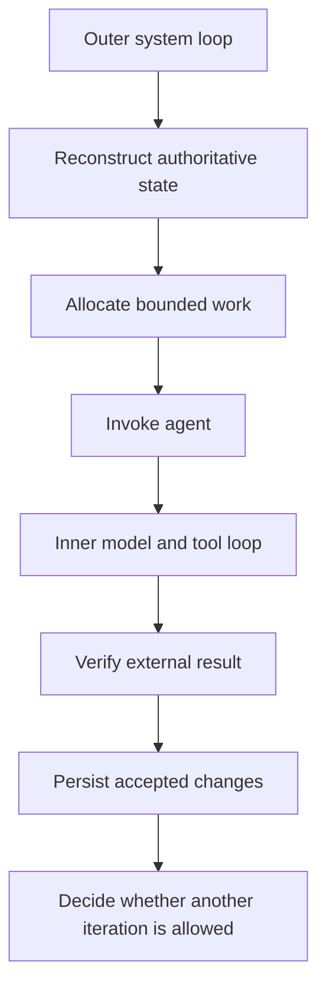
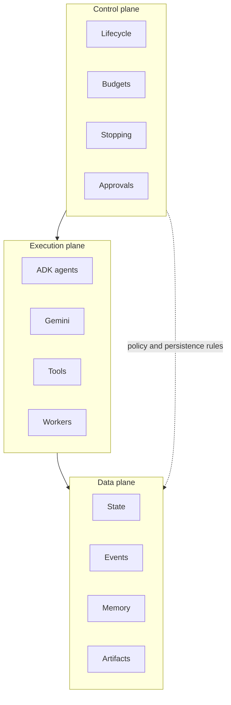
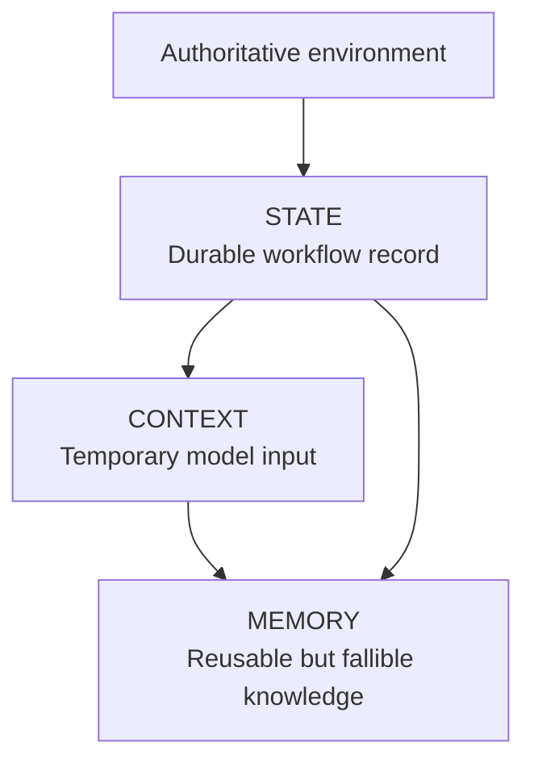

# Loop Engineering: The Control System Around the Agent

## Abstract

Reliable agent systems do not emerge from models, prompts, tools, and memory alone. They depend on the control system that reconstructs state, allocates bounded work, verifies outputs, persists accepted changes, and decides whether another iteration is allowed. This note argues that the primary object of engineering is the loop around the agent, not merely the agent itself. That matters because many production failures come from control failures: stale state, weak stopping rules, unsafe retries, unverifiable progress, and ambiguous authority.

## Context and motivation

Agent demos have improved quickly. Teams can now show a model planning, calling tools, and producing convincing outputs across coding, research, and operational tasks. That progress creates a familiar mistake: people describe the agent as if the model and its prompt were the whole system.

That description leaves out the machinery that decides what happens first, which facts are authoritative, what counts as progress, when a failure should trigger a retry, and when execution must stop. In production, those decisions determine whether a system remains bounded, diagnosable, and governable.

This note uses **loop engineering** as the name for that design problem:

> Loop engineering is the discipline of designing the control system that repeatedly reconstructs context, invokes probabilistic workers, verifies their outputs, persists validated state, and determines what happens next.

This is not an established industry term. It is the organizing concept behind the [`adk-loop-lab`](https://github.com/rmax-ai/adk-loop-lab) reference architecture, which implements bounded agent loops with Google ADK.

## Core thesis

The important design object is not merely the agent. It is the loop around the agent.

Models can propose plans, interpret evidence, and generate candidate actions. They do not define durable state, safe retries, stopping conditions, authority boundaries, or acceptance criteria by themselves. A production system needs deterministic control around probabilistic workers.

## The loop is the system

A production agent operates inside a repeated decision-and-action process. The return edge is conditional. The system does not continue merely because another model call is possible.

Lifecycle loop:

The [`LoopController`](https://github.com/rmax-ai/adk-loop-lab/blob/main/src/adk_loop_lab/loop/controller.py) in adk-loop-lab executes these phases in deterministic Python. It invokes model-backed behavior during planning and reflection, but the controller owns iteration advancement, state transitions, evaluation, persistence, checkpoints, and terminal decisions.

### DISCOVER

DISCOVER reconstructs the current situation from authoritative state.

It asks:

- What currently exists?
- What changed since the previous iteration?
- What remains incomplete?
- Which assumptions may now be stale?
- Does the external environment still match persisted workflow state?

This matters whenever the environment can change independently of the model. A coding agent may resume against a modified repository. A research workflow may discover that a source disappeared. A business-process agent may find that a human already approved the case.

adk-loop-lab currently implements a minimal generic discovery phase that records the goal and current iteration. Its richer coding example demonstrates the broader architectural intention: inspect the external environment before planning against it. The generic controller does not yet provide full reconciliation, optimistic concurrency, or version-conflict handling. Those are production extensions, not current guarantees.

### PLAN

PLAN selects a bounded increment of work.

A useful plan specifies:

- intended outcome;
- proposed action;
- responsible worker;
- relevant constraints;
- expected evidence;
- execution budget;
- completion criteria.

Planning the entire task upfront is often worse than planning the next bounded increment. Long plans rest on assumptions that later tool results may invalidate. Shorter planning horizons let the system incorporate environmental feedback before the next commitment.

In the current controller, the model returns a text plan that is placed into `pending_actions`. This demonstrates model-directed planning, but it is weaker than the architecture's intended `ActionProposal` contract. A more mature implementation would require structured fields such as tool name, arguments, expected effect, verification plan, and idempotency metadata.

### EXECUTE

EXECUTE invokes the selected worker or tool through a constrained interface.

The worker may be probabilistic, but the interface should not be. Tool names, argument schemas, permissions, timeouts, output contracts, and side-effect classes should be explicit.

The generic adk-loop-lab controller resolves a pending action against a registered tool map, invokes it through a recovery wrapper, records the result, and increments the tool-call budget.

The repository also describes a richer governance model that distinguishes read-only operations, reversible writes, irreversible writes, and execution. That taxonomy is useful, but the generic controller does not yet enforce it through typed tool descriptors or approval gates.

### VERIFY

VERIFY evaluates what actually happened.

Verification can include:

- schema validation;
- static analysis;
- tests;
- policy checks;
- evidence validation;
- invariant checking;
- model-based evaluation when deterministic checks are insufficient.

The architecture uses a deliberate policy:

> Deterministic checks run before model judges, and deterministic failures veto success.

This is a design choice, not a universal theorem. It fits cases where a deterministic check represents a hard requirement: a failing test, invalid schema, missing citation, prohibited operation, or violated policy should not be overridden by a model's qualitative approval.

The current controller runs registered evaluators, normalizes their outputs, averages their scores, and requires every result to pass. The repository also contains broader composite-evaluation abstractions, but the generic controller currently behaves closer to an `ALL_REQUIRED` policy than the full documented set of deterministic-veto, weighted-score, and quorum policies.

### COMMIT

COMMIT makes validated progress durable.

The analogy is to a database transaction or version-control commit:

1. Proposed work remains provisional.
2. Verification determines whether the work is acceptable.
3. Accepted work updates authoritative state.
4. Failed work must not silently become recorded progress.

adk-loop-lab passes the current run, state, and buffered events to a transaction manager, then creates a checkpoint. This provides a concrete persistence boundary, but it should not be described as a universal ACID transaction across models, filesystems, external APIs, and event logs. Distributed side effects require additional reconciliation or compensation mechanisms.

### REFLECT

REFLECT interprets failures, gaps, and execution evidence.

It may produce:

- a revised hypothesis;
- a failure classification;
- a different strategy;
- a candidate memory;
- a recommendation to escalate.

Reflection is diagnostic and advisory. It must not convert a failing test into a passing result, grant itself additional budget, or authorize an operation that policy denied.

The current controller sends recent actions, failures, and progress to the model and stores the returned reflection in state. It does not yet automatically convert that reflection into evidence-linked memory.

### DECIDE

DECIDE selects the next lifecycle transition:

- continue;
- complete;
- pause;
- request approval;
- escalate;
- fail;
- stop because a budget was exhausted;
- stop because progress stagnated.

In adk-loop-lab, the stopping policy checks verified completion, remaining budgets, stagnation, and elapsed duration.

The model may recommend completion. The control plane determines whether completion criteria are actually satisfied.

## The inner agent loop and the outer system loop

Agent frameworks already contain loops. A model may reason, call a tool, observe its result, and continue until it emits a final response. That is the inner agent loop.

The application still needs an outer system loop that controls durable work across invocations. The inner loop decides how a worker attempts a task. The outer loop decides whether the attempt counts as progress.

Inner and outer loop relationship:

This distinction matters when work extends beyond one model invocation. A local tool call may succeed while the overall task remains incomplete. A model may also produce a polished final response while required artifacts are still missing.

Google ADK distinguishes model-backed agents from deterministic workflow structures. Its template workflow agents, including sequential, parallel, and loop agents, control execution without consulting a model for orchestration. Starting with ADK 2.0, Google describes these templates as superseded by more flexible graph-based and dynamic workflows, while retaining them as supported templates. ([Google ADK: Template agent workflows](https://adk.dev/agents/workflow-agents/); [Google ADK: Graph-based workflows](https://adk.dev/graphs/)) ([ADK][1])

adk-loop-lab reports using Google ADK 2.2.0 and the workflow graph API. Its lifecycle controller is therefore best understood as application-level control around ADK workers, not as a thin wrapper around the legacy `LoopAgent`.

## Deterministic shell, probabilistic workers

The central division of responsibility is simple:

> Models propose; deterministic code decides where deterministic enforcement is possible.

This does not mean every useful decision can be reduced to rules. It means the system should not delegate enforceable rules to a model.

| Concern | Deterministic control | Model judgment |
| --- | ---: | ---: |
| Budget limits | Yes | No |
| Tool authorization | Yes | No |
| Schema validation | Yes | No |
| Task decomposition | Sometimes | Often |
| Ambiguous evidence interpretation | Limited | Often |
| Completion approval | Policy-dependent | Advisory |
| Failure diagnosis | Rules plus evidence | Useful |
| Persistence | Controlled | Proposed only |

The deterministic shell should normally own:

- iteration limits;
- model and tool budgets;
- permission checks;
- tool allowlists;
- state transitions;
- checkpointing;
- required approvals;
- hard failure conditions;
- structured-output validation.

Models are more useful for:

- interpreting ambiguous requests;
- decomposing unfamiliar tasks;
- generating candidate solutions;
- synthesizing evidence;
- diagnosing failures;
- proposing alternative strategies.

The boundary is not fixed. A document's tone may require model judgment. A maximum word count does not. Research-source relevance may require interpretation. Whether a cited URL exists can be checked directly.

Anthropic's evaluator-optimizer pattern makes a similar separation between generation and evaluation and recommends explicit criteria and iterative refinement when evaluation can provide actionable feedback. Anthropic also advises starting with simple, composable workflows and adding autonomous behavior only when task complexity justifies it. ([Anthropic, "Building Effective Agents," December 2024](https://www.anthropic.com/research/building-effective-agents))

## Three architectural planes

adk-loop-lab separates the system into three planes.

Three architectural planes:

The control plane owns orchestration policy. The execution plane performs work. The data plane records what the system knows and what happened.

This separation improves diagnosis. When a run fails, developers can ask three different questions:

1. Did the controller choose the wrong transition?
2. Did a model or tool perform the work incorrectly?
3. Was the state or evidence incomplete, stale, or corrupted?

Without these boundaries, model behavior, workflow behavior, and persistence behavior become indistinguishable inside one conversation transcript.

OpenAI's Agents SDK applies a related observability distinction through traces and spans for model generations, tool calls, guardrails, handoffs, and custom events. ([OpenAI Agents SDK: Tracing](https://openai.github.io/openai-agents-js/guides/tracing)) ([OpenAI][2]) Trace grading can then evaluate the full trajectory rather than only the final answer. ([OpenAI: Trace grading](https://platform.openai.com/docs/guides/trace-grading)) ([OpenAI Platform][3])

Tracing does not create reliability by itself. It creates evidence the system can use to evaluate and improve reliability.

## Context is not state, and state is not memory

These concepts are often collapsed into one prompt or message history. That collapse makes authority, lifetime, and failure recovery harder to reason about.

Context, state, and memory hierarchy:

| Concept | Purpose | Lifetime | Authority |
| --- | --- | --- | --- |
| Context | Supply relevant information to one invocation | Temporary | Incomplete by design |
| State | Record accepted workflow facts and progress | Durable | Authoritative for the workflow |
| Memory | Retain potentially useful lessons | Cross-iteration or cross-run | Advisory unless revalidated |

Context is bounded and selected. It may contain the goal, constraints, current state, relevant memories, recent failures, and remaining budget.

State records the current phase, accepted artifacts, completed tasks, remaining work, verification results, approvals, and consumed budget. It should be read fresh and updated deliberately.

Memory contains information that may improve later decisions: a proven strategy, recurring failure, a verified fact, or a tool-specific lesson. It can become stale or irrelevant.

The repository implements a `ContextBuilder` that selects acceptance criteria, constraints, observations, verified memories, failures, and budget information while excluding full event history and prior model responses.

It also implements a SQLite memory store with FTS5 search, evidence references, promotion from `CANDIDATE` to `VERIFIED`, and invalidation metadata.

But these modules are not fully connected to the generic loop controller. The controller currently constructs smaller prompts directly, and memory retrieval and promotion remain the responsibility of higher-level examples or callers. The architecture demonstrates the intended separation more completely than the generic execution path currently enforces.

## Verification before persistence

The verify-commit boundary is one of the most important parts of loop engineering.

Consider three cases:

- A document-refinement loop generates a revision. Before replacing the accepted document, it checks required sections, word count, prohibited claims, and editorial criteria.
- A research loop generates claims. Before marking coverage complete, it checks whether each material claim links to appropriate evidence and whether unresolved contradictions remain.
- A coding loop changes files. Before accepting the patch, it runs formatting, linting, type checking, tests, and requirement-specific checks.

In all three cases, the model output is provisional.

This is the difference between producing an artifact and accepting an artifact.

Model-based evaluation can help when requirements are qualitative, but it introduces correlated failure when the same model both generates and judges an output. Deterministic checks, independent evaluators, adversarial tests, and human review reduce, but do not eliminate, that risk.

OpenAI's guardrail documentation makes a similar operational distinction: input, output, and tool guardrails execute at defined workflow boundaries, and tool guardrails can block or validate individual function calls. ([OpenAI Agents SDK: Guardrails](https://openai.github.io/openai-agents-js/guides/guardrails/)) ([OpenAI][4])

## Concrete examples

The three runnable examples in adk-loop-lab illustrate progressively harder control problems.

### Example 1: bounded document refinement

| Property | Design |
| --- | --- |
| Objective | Produce a document satisfying explicit constraints |
| Authoritative state | Current accepted draft and evaluation results |
| Progress signal | Fewer defects and passing deterministic checks |
| Verifier | Word-count, style, citation, and quality evaluators |
| Stop condition | Criteria pass or five iterations are consumed |
| Main failure | Endless self-critique |
| Production limitation | Editorial quality remains partly subjective |

The loop separates generation, criticism, revision, and stopping. This prevents the critic from revising its own criteria mid-run and prevents refinement from continuing indefinitely.

The simplification is that real editorial systems require evidence review, factual verification, version comparison, human approval, and potentially different evaluators for different audiences.

### Example 2: evidence-driven research

| Property | Design |
| --- | --- |
| Objective | Produce a report supported by traceable evidence |
| Authoritative state | Questions, claims, evidence records, and unresolved gaps |
| Progress signal | Material evidence gaps closed |
| Verifier | Coverage and citation checks |
| Stop condition | Coverage criteria pass or research budget ends |
| Main failure | High activity without improved evidence coverage |
| Production limitation | Fixture corpus and simplified source-quality judgments |

The example decomposes the objective, executes bounded research tasks, tracks claim-evidence relationships, identifies gaps, and continues selectively. The important abstraction is that evidence becomes workflow state rather than prose hidden in model context.

The third article in this series will develop that architecture in full.

### Example 3: resumable coding loop

| Property | Design |
| --- | --- |
| Objective | Produce a verified change to a target repository |
| Authoritative state | Repository contents, task state, checkpoints, test outcomes |
| Progress signal | Requirements satisfied and quality gates passing |
| Verifier | Tests, linting, type checks, and requirement checks |
| Stop condition | Verified success, stagnation, fatal failure, or budget exhaustion |
| Main failure | Repeated ineffective patches or stale repository assumptions |
| Production limitation | Local Linux sandbox and simplified transactional semantics |

This example introduces the harder problems: external-state reconstruction, controlled side effects, failure classification, checkpointing, and resumption.

The controller can restore a run and state from the latest checkpoint, then re-enter the lifecycle. Resumption does not mean replay is automatically safe. External operations still require idempotency keys, read-after-write verification, version checks, or reconciliation when outcomes are ambiguous.

## Progress, retries, budgets, and stopping

Activity is not progress.

Tokens, messages, tool calls, and elapsed time measure resource consumption. Progress requires domain-specific state changes:

- more required tests pass;
- evidence gaps close;
- document defects decrease;
- accepted tasks complete;
- validated artifacts are committed.

adk-loop-lab currently derives progress from evaluator scores and increments a stagnation counter when the aggregate score does not improve. This is a useful baseline, but production systems need task-specific signals. A coding loop should track failing tests or unmet requirements. A research loop should track claim coverage and source quality. A scalar average can conceal meaningful local progress or regression.

A retry and an iteration are also different.

A retry repeats an operation because execution failed transiently: a timeout, a connection reset, or a rate limit.

An iteration performs another lifecycle cycle because the task remains incomplete or the strategy changed.

Conflating them can cause duplicate side effects, hidden infinite loops, and misleading metrics. Distributed-system guidance therefore treats retries as safe only when operations are idempotent or protected by operation identifiers, deduplication, or reconciliation. Circuit breakers and retry limits prevent repeated calls from amplifying persistent failures. ([Microsoft Azure Architecture Center: Retry pattern](https://learn.microsoft.com/azure/architecture/patterns/retry); [Circuit Breaker pattern](https://learn.microsoft.com/azure/architecture/patterns/circuit-breaker))

The repository tracks iteration, model-call, tool-call, and duration budgets. Its current generic controller checks terminal budget conditions during DECIDE, after an iteration has executed. A stricter production implementation should reserve or validate budget immediately before every model call, tool call, retry, and delegated sub-agent operation.

Nested agents require hierarchical accounting. A parent that delegates work should allocate a portion of its own budget rather than allowing children to consume unbounded resources outside centralized visibility.

## Repository evidence

| Architectural claim | Repository evidence | Status |
| --- | --- | --- |
| Deterministic lifecycle | `loop/controller.py`, `loop/lifecycle.py` | Implemented |
| Durable workflow state | `state/sqlite.py`, `state/transactions.py` | Implemented locally |
| Checkpoint and resume | `loop/checkpoints.py`, `LoopController.resume()` | Implemented, limited to repository semantics |
| Budget accounting | `loop/policies.py` | Implemented; pre-action enforcement is partial |
| Deterministic verification | Controller evaluator path and evaluation modules | Implemented; full policy integration is partial |
| Selective context construction | `context/builder.py` | Implemented as a module; not fully wired into generic controller |
| Evidence-linked memory | `memory/sqlite.py`, memory models | Implemented as storage lifecycle; evidence validation is limited |
| Governed tool categories | Architecture documentation and tool modules | Conceptually demonstrated; generic enforcement is partial |
| Explicit event history | JSONL recorder and lifecycle events | Implemented |
| Three progressive examples | `level-1`, `level-2`, and `level-3` CLI targets | Implemented as reference examples |

The project specification describes the repository as both a working demonstration and reusable starter kit. The roadmap, however, still contains unchecked implementation tasks despite many corresponding modules now existing, so it should not be treated as an accurate completion ledger.

The safest characterization is a working reference architecture with partial vertical integration, not a production-ready runtime.

## Trade-offs and failure modes

Loop engineering does not compensate for every failure source, and it can introduce new failure modes if the control system is weak.

### Failure modes the loop must control

**Endless refinement**

The system continues revising without measurable convergence.

Controls include explicit quality thresholds, maximum iterations, output-delta checks, diminishing-return detection, and escalation.

**Repeated failed strategy**

The system retries essentially the same approach under different wording.

Controls include failure classification, strategy fingerprints, failed-attempt records, retry limits, and requiring a material plan change.

**False completion**

The model declares success while required artifacts or evidence are missing.

Controls include completion invariants, deterministic checks, independent evaluators, and explicit approval requirements.

**State drift**

The system acts on stale assumptions.

Controls include rediscovery, version checks, authoritative reads, optimistic concurrency, and environment reconciliation. The repository demonstrates rediscovery conceptually but does not yet provide a general concurrency-control protocol.

**Duplicate side effects**

An operation is repeated after a timeout or ambiguous failure.

Controls include idempotency keys, operation identifiers, read-after-write checks, deduplication, and compensation. These are production extensions rather than complete generic features of adk-loop-lab.

**Memory contamination**

An unverified conclusion becomes reusable knowledge.

Controls include provenance, evidence-linked promotion, confidence, freshness metadata, and invalidation. The repository supports memory statuses and evidence references, but currently allows promotion without proving that referenced evidence exists.

**Budget leakage**

Nested workers consume resources outside centralized accounting.

Controls include hierarchical budgets, delegation limits, tool-call caps, timeouts, token accounting, and cost attribution. The current repository tracks top-level budgets but does not yet fully model nested consumption.

**Verification capture**

The same model produces and approves its own output.

Controls include deterministic checks first, separate evaluators, adversarial tests, trace evaluation, and human review for consequential actions.

### What loop engineering does not solve

A well-engineered loop does not fix:

- a model that lacks the required capability;
- an objective that cannot be operationalized;
- a tool with ambiguous or unsafe semantics;
- an evaluator that measures the wrong property;
- an adversarial or rapidly changing environment;
- missing authorization boundaries;
- unclear organizational ownership;
- irreducible uncertainty; or
- blind spots shared by generators and evaluators.

Iterative execution can also amplify mistakes. Every additional model call, tool call, and state transition creates another opportunity for error and cost. Research on agent infrastructure finds that additional test-time reasoning can improve performance while producing diminishing returns, increased latency variance, and substantial resource costs. ([Kim et al., "The Cost of Dynamic Reasoning," June 2025](https://arxiv.org/abs/2506.04301)) ([arXiv][5])

A badly specified loop can repeat bad decisions more reliably.

The objective is not maximum autonomy. It is controlled continuation.

## Practical takeaways

- Reconstruct external reality before the model acts.
- Plan bounded increments instead of fictional complete futures.
- Keep authoritative state outside model context.
- Treat model outputs as proposals until verification passes.
- Verify before committing durable state.
- Measure progress, not activity.
- Distinguish retries from iterations.
- Centralize budgets and stopping decisions.
- Make every continuation transition explicit.
- Preserve enough evidence to resume and diagnose.
- Require stronger controls as side effects become less reversible.
- Use the simplest loop that satisfies the task.

## Positioning note

This note is not academic research, although it draws on papers and vendor documentation. It does not propose a new training method or a formal theorem. It is also not vendor documentation, even when it discusses ADK, OpenAI, Anthropic, or Azure patterns. The goal is narrower and more operational: describe a reusable control model that helps experienced engineers reason about bounded agent execution in practice.

It also differs from a general blog opinion. The claims here are tied to a concrete repository, explicit lifecycle phases, specific control boundaries, and named failure modes.

## Status and scope disclaimer

This note reflects personal lab work, repository analysis, and operator judgment. It is exploratory in the sense that `adk-loop-lab` is a working reference architecture with partial vertical integration, not a production-ready runtime. It should not be read as authoritative guidance for every agent deployment.

The scope is deliberately narrow. The note focuses on bounded agent loops for document refinement, research, and coding workflows. It does not attempt to solve general autonomy, formal safety, or organization-wide operating models.

## References

1. [adk-loop-lab](https://github.com/rmax-ai/adk-loop-lab) — rmax-ai, June 2026. The reference implementation examined throughout this article, including its controller, state, memory, evaluation, event, and example modules.

2. [adk-loop-lab Architecture Overview](https://github.com/rmax-ai/adk-loop-lab/blob/main/docs/architecture/overview.md) — rmax-ai, June 2026. Defines the seven-phase lifecycle, three planes, trust boundaries, evaluation policy, and persistence model.

3. [adk-loop-lab Specification](https://github.com/rmax-ai/adk-loop-lab/blob/main/SPEC.md) — rmax-ai, June 2026. Records the project thesis, intended features, examples, and acceptance criteria.

4. [Graph-based agent workflows](https://adk.dev/graphs/) — Google Agent Development Kit, accessed June 20, 2026. Documents ADK 2.x graph workflows for combining deterministic nodes, tools, human input, and model-backed agents. ([ADK][6])

5. [Template agent workflows](https://adk.dev/agents/workflow-agents/) — Google Agent Development Kit, accessed June 20, 2026. Explains sequential, parallel, and loop templates and clarifies their relationship to newer graph and dynamic workflows. ([ADK][1])

6. [Loop workflow](https://adk.dev/agents/workflow-agents/loop-agents/) — Google Agent Development Kit, accessed June 20, 2026. Defines deterministic repeated execution with explicit termination conditions and iteration bounds.

7. [Building Effective Agents](https://www.anthropic.com/research/building-effective-agents) — Anthropic, December 19, 2024. Introduces composable workflow patterns, including evaluator-optimizer loops, and distinguishes workflows from dynamically directed agents.

8. [Tracing](https://openai.github.io/openai-agents-js/guides/tracing) — OpenAI Agents SDK, accessed June 20, 2026. Describes trace records for model generations, tool calls, guardrails, handoffs, and custom events. ([OpenAI][2])

9. [Trace grading](https://platform.openai.com/docs/guides/trace-grading) — OpenAI, accessed June 20, 2026. Explains structured evaluation of complete agent trajectories rather than final outputs alone. ([OpenAI Platform][3])

10. [Guardrails](https://openai.github.io/openai-agents-js/guides/guardrails/) — OpenAI Agents SDK, accessed June 20, 2026. Defines validation boundaries for workflow inputs, outputs, and tool invocations. ([OpenAI][4])

11. [Retry pattern](https://learn.microsoft.com/azure/architecture/patterns/retry) — Microsoft Azure Architecture Center, accessed June 20, 2026. Provides distributed-systems guidance on transient-failure retries, limits, and idempotency.

12. [Circuit Breaker pattern](https://learn.microsoft.com/azure/architecture/patterns/circuit-breaker) — Microsoft Azure Architecture Center, accessed June 20, 2026. Explains how systems prevent repeated operations from amplifying persistent failures.

13. [The Cost of Dynamic Reasoning: Demystifying AI Agents and Test-Time Scaling from an AI Infrastructure Perspective](https://arxiv.org/abs/2506.04301) — Jiin Kim et al., June 4, 2025. Studies accuracy, latency, cost, and diminishing returns in multi-step agent execution. ([arXiv][5])

14. [Agentproof: Static Verification of Agent Workflow Graphs](https://arxiv.org/abs/2603.20356) — Melwin Xavier et al., March 20, 2026. Demonstrates how explicit workflow graphs can support structural and temporal-policy verification before deployment. ([arXiv][8])

15. [From Agent Traces to Trust: Evidence Tracing and Execution Provenance in LLM Agents](https://arxiv.org/abs/2606.04990) — Yiqi Wang et al., June 3, 2026. Surveys evidence lineage, tool-use provenance, memory provenance, trace-based diagnosis, and recovery-oriented evaluation. ([arXiv][9])

16. Article specification: "Loop Engineering: The Control System Around the Agent" — author-provided brief, June 2026. Defines the series position, required repository grounding, evidence discipline, and article scope.

[1]: https://adk.dev/agents/workflow-agents/?utm_source=chatgpt.com "Template agent workflows - Agent Development Kit (ADK)"
[2]: https://openai.github.io/openai-agents-js/guides/tracing?utm_source=chatgpt.com "Tracing | OpenAI Agents SDK"
[3]: https://platform.openai.com/docs/guides/trace-grading?utm_source=chatgpt.com "Trace grading | OpenAI API"
[4]: https://openai.github.io/openai-agents-js/guides/guardrails/?utm_source=chatgpt.com "Guardrails | OpenAI Agents SDK"
[5]: https://arxiv.org/abs/2506.04301?utm_source=chatgpt.com "The Cost of Dynamic Reasoning: Demystifying AI Agents and Test-Time Scaling from an AI Infrastructure Perspective"
[6]: https://adk.dev/graphs/?utm_source=chatgpt.com "Graph-based agent workflows - Agent Development Kit (ADK)"
[7]: https://adk.dev/agents/workflow-agents/loop-agents/?utm_source=chatgpt.com "Loop workflow - Agent Development Kit (ADK)"
[8]: https://arxiv.org/abs/2603.20356?utm_source=chatgpt.com "Agentproof: Static Verification of Agent Workflow Graphs"
[9]: https://arxiv.org/abs/2606.04990?utm_source=chatgpt.com "From Agent Traces to Trust: Evidence Tracing and Execution Provenance in LLM Agents"
