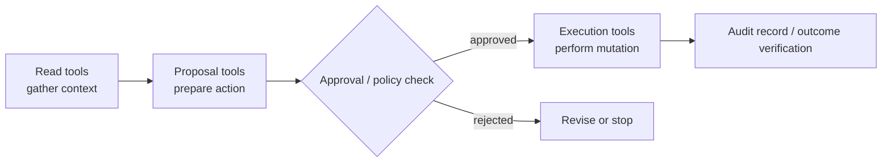
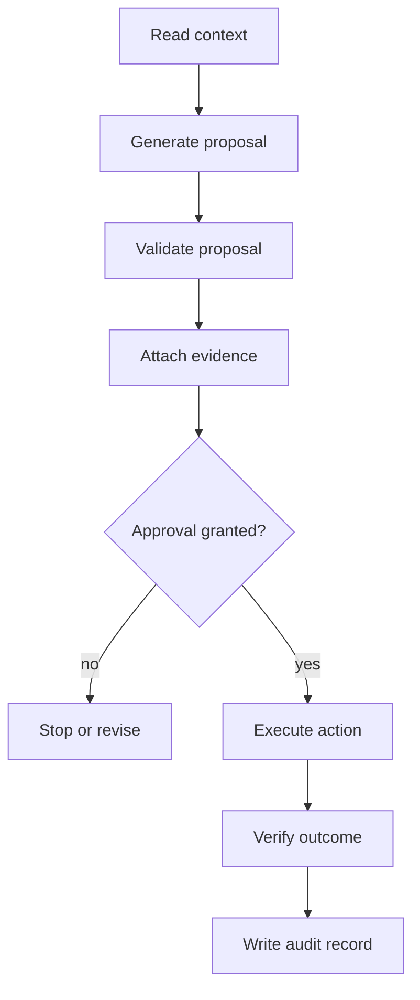
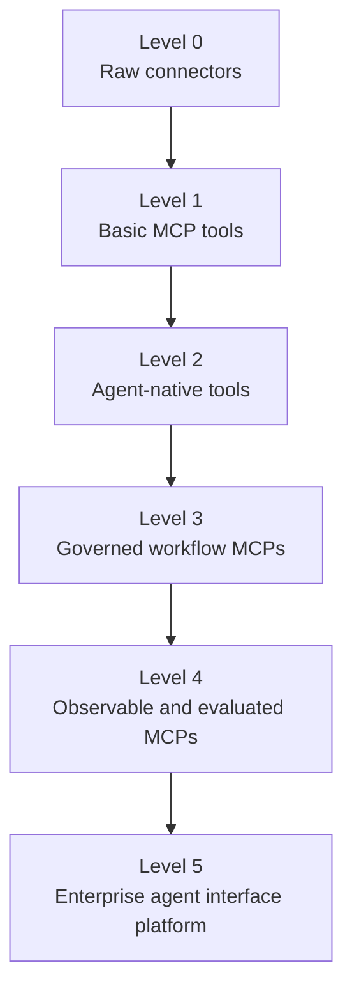

# MCP Design Best Practices for Agents: From API Wrappers to Agent-Native Interfaces

Most enterprise AI failures will not come from weak models. They will come from weak interfaces.

As language models become capable of planning, retrieving context, invoking tools, and executing workflows, the critical design problem shifts from "Can the model reason?" to "Can the model act safely through our systems?" That question is not solved by exposing more APIs. It is solved by designing better operational interfaces for agents.

The Model Context Protocol, or MCP, is emerging as one of the most important interface layers in this transition. But treating MCP as a thin adapter over existing APIs misses the point. A good MCP server is not just a connector. It is an agent-facing control surface. It compresses system complexity, exposes meaningful actions, constrains unsafe behavior, reports recoverable errors, and gives the enterprise a place to govern agentic execution.

In human software, the user interface is the product boundary. In agentic software, the tool interface becomes the product boundary.

That means MCP design is not plumbing. It is interface engineering for machine users.

## The Core Shift: Agents Are Not Human API Consumers

Traditional APIs are designed for developers. They assume the caller can read documentation, inspect examples, understand hidden domain rules, debug failures, and decide when not to call an endpoint.

Agents do not operate that way.

An agent sees a tool name, a description, a schema, a few examples, and the surrounding task context. From that limited surface, it must decide which tool to call, which parameters to provide, how to interpret the response, whether to retry, and whether it has enough evidence to proceed.

For an agent, the schema is the interface.

A vague tool description is like a badly labeled button. An under-specified parameter is like a form field with no validation. A giant JSON payload is like a dashboard with every table dumped onto one screen. An opaque error message is like a modal saying only "Something went wrong."

This is why agent-native MCP design requires a different discipline. The goal is not to mirror internal systems. The goal is to expose the smallest useful set of safe, meaningful, and recoverable actions.

## Bad MCP Design: Wrapping APIs Too Literally

The most common mistake is exposing low-level CRUD operations directly:

```text
get_user
list_users
update_user
get_team
list_teams
update_team
create_ticket
update_ticket
delete_ticket
```

This looks clean from an API perspective, but it is poor from an agent perspective. The agent must infer the business workflow from disconnected primitives. It must discover the right entities, resolve ambiguous identifiers, understand which state transitions are valid, and avoid unsafe writes.

The model becomes responsible for orchestration that should belong inside the tool layer.

A better MCP interface exposes intent-level operations:

```text
propose_team_member_transfer
summarize_customer_refund_eligibility
investigate_failed_invoice_sync
prepare_access_review_for_manager
request_approval_for_subscription_change
execute_approved_subscription_change
```

These are not generic database operations. They are workflow primitives. They encode business meaning.

The server can still call many internal APIs underneath. But the agent should not need to know that. The MCP server should absorb lookup, validation, authorization, idempotency, state transitions, and audit logging.

In short: do not expose your system's internal shape. Expose the agent's useful action space.

## Principle 1: Design Tool Names as Affordances

Tool names should make the correct action obvious.

A human user can inspect a UI visually. An agent cannot. It relies heavily on names and descriptions. This makes naming unusually important.

Weak tool names:

```text
update_record
run_action
process_request
sync_data
handle_ticket
```

Strong tool names:

```text
propose_refund_for_customer_order
summarize_account_risk_before_plan_change
create_jira_ticket_from_incident_summary
validate_saas_access_change_request
execute_approved_crm_account_update
```

Good names encode intent, scope, and risk level.

For enterprise systems, I prefer namespaced tool names:

```text
com.company.crm:summarize_account_health
com.company.billing:propose_refund
com.company.identity:request_access_change
com.company.jira:create_incident_ticket
```

This gives the agent a clearer map of the enterprise landscape. It also helps humans audit what kinds of capabilities have been exposed.

## Principle 2: Separate Read, Propose, and Execute

Enterprise agents should not jump directly from reasoning to mutation.

A useful pattern is to separate tools into three categories:

Read tools retrieve and summarize context.

```text
get_customer_account_summary
search_policy_knowledge_base
summarize_recent_support_history
```

Proposal tools prepare a possible action without executing it.

```text
propose_refund
propose_access_change
propose_contract_update
```

Execution tools perform a mutation only after approval, policy validation, or explicit authorization.

```text
execute_approved_refund
apply_approved_access_change
submit_approved_contract_update
```



This design creates friction where friction is valuable. It gives the system a place to enforce policy, require human approval, attach evidence, generate audit records, and prevent accidental side effects.

The agent should not be trusted because it sounds confident. It should be trusted only when its actions pass through a governed execution path.

## Principle 3: Compress Context Semantically

Agents are constrained by context windows, latency, and cost. Dumping raw system data into the model is usually a design failure.

Bad output:

```json
{
  "logs": [
    "... thousands of raw log lines ..."
  ],
  "tickets": [
    "... full ticket bodies ..."
  ],
  "events": [
    "... raw event stream ..."
  ]
}
```

Better output:

```yaml
summary:
  issue: "Invoice sync failed for 18 customers after ERP token rotation."
  likely_cause: "Expired OAuth refresh token for Business Central connector."
  affected_systems:
    - billing
    - erp_sync
    - customer_portal
  evidence:
    - "401 errors began at 2026-06-07 09:14 UTC"
    - "No schema changes detected"
    - "Retries succeeded after manual token refresh in staging"
  recommended_next_action:
    tool: "com.company.erp:refresh_connector_token"
    requires_approval: true
```

The MCP server should do local computation before involving the model. Filter, rank, summarize, group, deduplicate, and explain.

This is semantic compression: preserving decision-relevant information while removing operational noise.

For enterprise workflows, semantic compression is not just an optimization. It is a safety feature. The less irrelevant data the model sees, the lower the chance it acts on noise, leaks sensitive context, or hallucinates a causal link.

## Principle 4: Make Errors Recoverable

Most tool errors are written for developers. Agents need errors that explain what happened and what to do next.

Bad error:

```text
400 Bad Request
```

Better error:

```json
{
  "error_type": "VALIDATION_ERROR",
  "message": "Refund cannot be proposed because the order is outside the refundable window.",
  "failed_field": "order_id",
  "policy_reference": "refund_policy.v3.max_refund_window_days",
  "recoverable": true,
  "suggested_next_steps": [
    {
      "tool": "com.company.billing:get_refund_exception_policy",
      "reason": "Check whether manager-approved exceptions are allowed."
    },
    {
      "tool": "com.company.support:create_customer_explanation_draft",
      "reason": "Prepare a response explaining why standard refund is unavailable."
    }
  ]
}
```

A good agent-facing error should include:

- the category of failure
- whether the failure is recoverable
- which parameter or assumption failed
- which policy or system constraint was involved
- whether retrying makes sense
- what tool or workflow should be attempted next

This reduces blind retries and makes the agent more useful under uncertainty.

## Principle 5: Treat Security as Interface Design

Security should not be bolted on after the tool interface is built. The interface itself should encode security boundaries.

Useful design patterns include:

- delegated OAuth instead of shared API keys
- least-privilege tool scopes
- explicit separation between read and write tools
- approval gates for sensitive actions
- idempotency keys for write operations
- audit logs for every proposed and executed action
- egress restrictions for tools that touch private data
- state-machine validation for business workflows

The dangerous pattern is giving an agent access to three things at once:

1. untrusted external content
2. private internal data
3. write or execution capability

That combination creates the conditions for prompt injection, data exfiltration, and unauthorized action.

A safer architecture separates these surfaces. External content should be treated as hostile. Internal data access should be scoped. Writes should require validated intent and approval. Tool outputs should distinguish facts, model inferences, and user-provided claims.

Enterprise agent security is not only about authentication. It is about controlling what the agent can perceive, infer, and mutate.

## Principle 6: Instrument the Agent Interface

A production MCP server should be observable.

The important question is not only "Did the API call succeed?" The better question is "Did the agent complete the intended workflow safely, efficiently, and correctly?"

Useful metrics include:

- tool selection accuracy
- invalid tool calls
- parameter validation failures
- retry count
- average turns to completion
- tokens per successful outcome
- human approval rate
- approval rejection rate
- policy violation attempts
- execution latency
- post-action correction rate
- rollback frequency

One particularly useful metric is tokens per successful outcome. It connects model cost to business value. An interface that helps the agent complete a workflow in three calls is better than one that requires twenty calls, retries, and human repair.

This changes how MCP servers should be evaluated. The unit of quality is not the endpoint. The unit of quality is the completed workflow.

## Principle 7: Build MCPs Around Workflow Contracts

A mature MCP design should define a workflow contract.

For example, an approval-gated SaaS write workflow might have the following lifecycle:

```text
read context
-> generate proposal
-> validate proposal
-> attach evidence
-> request approval
-> receive approval
-> execute action
-> verify outcome
-> write audit record
```



Each phase should have explicit inputs, outputs, constraints, and failure states.

The MCP server should enforce the contract. The agent should not be trusted to remember every rule from a prompt. Prompts are useful for guidance; servers are necessary for enforcement.

This distinction matters. Prompt instructions can influence behavior. Protocol and server constraints can guarantee behavior.

For enterprise agents, guarantee beats persuasion.

## A Practical Maturity Model for MCP Design

Most organizations will move through several stages.

Level 0: Raw connectors. The enterprise exposes APIs, databases, or SaaS endpoints directly. Agents have too much surface area and too little guidance.

Level 1: Basic MCP tools. Existing operations are wrapped as MCP tools, but the design still mirrors the underlying systems.

Level 2: Agent-native tools. Tool names, schemas, outputs, and errors are designed for model usability.

Level 3: Governed workflow MCPs. Tools are organized around business workflows, with approval gates, policy checks, idempotency, and auditability.

Level 4: Observable and evaluated MCPs. The organization measures workflow success, retries, tool-call quality, cost, safety, and human intervention.

Level 5: Enterprise agent interface platform. MCP design becomes standardized across teams, with reusable patterns, internal guidelines, evaluation suites, and governance controls.



The strategic goal is not to create many MCP servers. The goal is to create a coherent agent interface layer across the enterprise.

## What This Means for Forward Deployed Engineers

The Forward Deployed Engineer role becomes central in this world.

An FDE working on enterprise AI should not merely connect systems or configure assistants. The higher-value work is to identify operational workflows, redesign them as agent-native interfaces, and turn field-specific deployment lessons into reusable platform patterns.

A strong FDE should ask:

- What workflow is the agent actually trying to complete?
- Which decisions require business context?
- Which actions are safe to automate?
- Which actions require approval?
- What evidence should be attached before execution?
- What should the agent never see?
- What should the agent never be allowed to mutate?
- How will we measure success?
- How will we debug failures?
- How will this pattern become reusable?

This is where enterprise AI moves from demos to operations.

The FDE becomes a bridge between model capability and institutional reality: part systems engineer, part workflow architect, part governance implementer, and part product feedback loop.

## Example: Bad vs Good MCP Design for Access Management

A weak access-management MCP might expose tools like this:

```text
list_users
get_user
list_groups
add_user_to_group
remove_user_from_group
```

This forces the agent to infer policy. It may add the wrong person to the wrong group if the context is ambiguous or if a malicious instruction is embedded in a ticket.

A better design would expose:

```text
summarize_user_access_profile
validate_access_change_request
propose_access_change
request_manager_approval_for_access_change
execute_approved_access_change
verify_access_change_outcome
```

Now the workflow has structure. The agent can gather context, generate a proposal, validate it, seek approval, execute only after approval, and verify the result. The MCP server can enforce role constraints, approval requirements, separation of duties, and audit logging.

The difference is not cosmetic. It is the difference between an API wrapper and an operational control plane.

## Example: Bad vs Good MCP Design for Incident Response

A weak incident-response MCP might expose raw logs, metrics, traces, and ticket APIs. The agent receives too much data and has to infer causality.

A better MCP would expose tools such as:

```text
summarize_recent_service_anomalies
correlate_deployment_with_error_spike
identify_probable_incident_cause
draft_incident_update
propose_rollback_plan
request_rollback_approval
execute_approved_rollback
```

The MCP server should compress logs into relevant anomalies, correlate events across systems, surface uncertainty, and distinguish evidence from speculation.

This allows the agent to assist with incident work without pretending that the model itself is the monitoring platform, the policy engine, and the release manager.

## The Design Standard: Agent-Native, Workflow-Native, Governed

Good MCP design has three properties.

It is agent-native. The interface is designed for how models perceive tools: names, schemas, examples, constraints, and structured outputs.

It is workflow-native. The interface exposes meaningful business operations, not low-level system fragments.

It is governed. The interface encodes authorization, approval, auditability, idempotency, and policy enforcement.

This is the design standard enterprise AI needs.

The future enterprise agent stack will not be only a model plus tools. It will include a governed interface layer that translates business workflows into safe, observable, executable capabilities.

MCP is one candidate protocol for that layer. But the deeper idea is protocol-independent: agents need operational UX.

The companies that understand this will build internal platforms where agents can act safely and measurably. The companies that do not will accumulate fragile demos, unsafe automations, and unmaintainable tool sprawl.

## Conclusion

The next wave of enterprise AI will depend less on exposing every system to agents and more on deciding exactly how agents should interact with systems.

That is an interface design problem.

MCP servers should not be treated as passive connectors. They should be designed as agent-facing workflow control surfaces: compressed, constrained, observable, and governed.

The best enterprise AI teams will not ask, "How many tools can our agents call?"

They will ask, "What is the safest, smallest, most meaningful action space we can expose so agents can complete real work?"

That is the shift from API integration to agent interface engineering.

And it may become one of the most important software design disciplines of the agent era.

## Practical Takeaways

- Design MCP tools around business actions and workflow phases, not raw CRUD or generic API wrappers.
- Separate read, propose, and execute paths so approval and policy checks live in the interface instead of depending on prompt discipline alone.
- Compress context semantically before it reaches the model so agents reason over signals, not over undifferentiated operational noise.
- Return structured, recoverable errors that tell the agent what failed, whether it should retry, and what tool to use next.
- Treat security, observability, and auditability as first-class interface properties, not as downstream implementation details.

## Positioning Note

This note is not a protocol explainer, product tutorial, or formal extension to the MCP specification. It is an architectural interpretation of MCP as an agent-facing interface layer, aimed at teams designing tool surfaces for real workflows rather than merely connecting models to APIs.

## Status and Scope Disclaimer

This note is exploratory but evidence-backed lab work. It draws on the MCP specification, schema reference, security guidance, Chrome DevTools MCP materials, Anthropic's context engineering guidance, and Stainless's debugging guidance, but the design recommendations here are interpretive patterns rather than normative protocol requirements. It is most relevant for enterprise and product teams building governed agent workflows, not as a complete treatment of every MCP use case.

## Sources

1. [Model Context Protocol — Specification](https://modelcontextprotocol.io/specification/2025-11-25)
2. [Model Context Protocol — Schema Reference](https://modelcontextprotocol.io/specification/2025-11-25/schema)
3. [Model Context Protocol — Security Best Practices](https://modelcontextprotocol.io/docs/tutorials/security/security_best_practices)
4. [Chrome DevTools MCP — GitHub Repository](https://github.com/ChromeDevTools/chrome-devtools-mcp)
5. [Chrome DevTools for Agents — Get Started](https://developer.chrome.com/docs/devtools/agents/get-started)
6. [Building Agent Interfaces: Lessons from Chrome DevTools MCP for Agents — Michael Hablich, Google](https://app.daily.dev/posts/building-agent-interfaces-lessons-from-chrome-devtools-mcp-for-agents-michael-hablich-google-v9gqworuu)
7. [Anthropic — Effective Context Engineering for AI Agents](https://www.anthropic.com/engineering/effective-context-engineering-for-ai-agents)
8. [Stainless — Error Handling and Debugging MCP Servers](https://www.stainless.com/mcp/error-handling-and-debugging-mcp-servers/)
