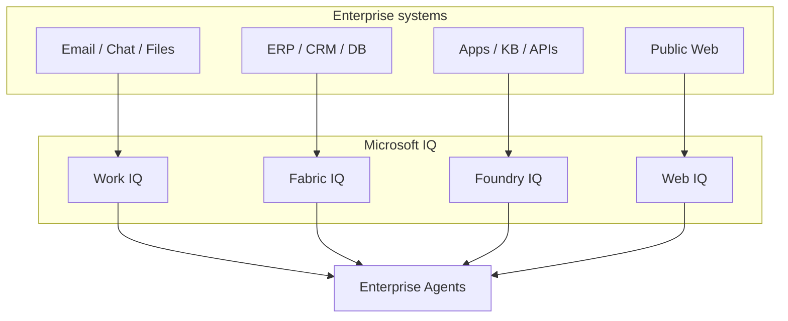
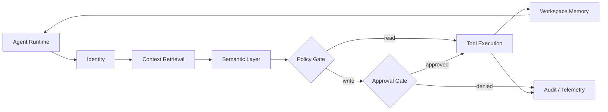
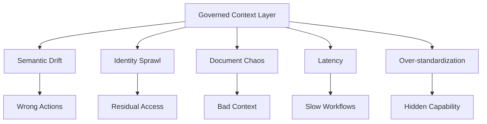

# Microsoft IQ and the Rise of the Enterprise Agent Context Layer

## Abstract

Enterprise AI is moving from chat interfaces toward operational agents that retrieve information, reason across business context, invoke tools, and initiate work. That shift exposes a harder bottleneck than prompt quality: context delivery. A model cannot act reliably inside an enterprise unless it is grounded in identity, permissions, business semantics, provenance, approvals, and audit boundaries. This note argues that Microsoft IQ is important not mainly as a product announcement, but as a signal that enterprise AI is converging on a governed context layer between raw systems and autonomous agents.

## Source framing

The main sources for this note are Microsoft's published materials on Work IQ, Fabric IQ, Foundry IQ, Web IQ, and adjacent agent-platform documentation. The goal is not to restate product marketing. It is to use Microsoft's framing as a practical case study for a broader systems question: what kind of context architecture enterprise agents need when they move from chat assistance to bounded operational work.

## Core thesis

The next enterprise AI platform is not just a model endpoint or a retrieval pipeline. It is a governed intelligence layer that transforms fragmented organizational data into secure, semantic, low-latency, agent-usable context.

That reframes the central enterprise AI question. The highest-leverage decision is no longer only, "Which model should we use?" It is, "How do we deliver the right context, tools, identity, and policy boundaries to agents at execution time?"

## 1. The context bottleneck in enterprise AI

Most enterprise AI prototypes look stronger in demos than they do in production because the environment is artificially simple. The agent receives a clean prompt, a small set of documents, and a narrow task. Production environments are the opposite.

Enterprise knowledge is spread across email, chat, SharePoint, tickets, databases, dashboards, CRM systems, ERP records, spreadsheets, calendars, contracts, policies, and undocumented human workflows. These systems were built for human operators, not autonomous agents. They expose raw APIs, inconsistent schemas, permission models, duplicated files, stale documents, and conflicting definitions.

A human can compensate for that mess through memory, judgment, and social context. An agent cannot. Without a governed context layer, the agent either receives too little context and produces shallow outputs, or it receives too much context and becomes expensive, slow, and unreliable.

This is why simple retrieval-augmented generation is not enough. RAG can retrieve documents, but enterprise agents need more than documents. They need semantic grounding, runtime authorization, tool discovery, policy enforcement, persistent state, and auditability.

The bottleneck is not access to information. The bottleneck is governed interpretation.

## 2. Microsoft IQ as an enterprise context fabric

Microsoft IQ is best understood as a unified context layer for agentic systems. Instead of treating context as scattered retrieval calls from individual applications, Microsoft divides enterprise context into four specialized layers:

- Work IQ for productivity and collaboration context.
- Fabric IQ for structured enterprise data and semantic business models.
- Foundry IQ for custom grounding and multi-source retrieval.
- Web IQ for external web intelligence optimized for agents.

This architecture marks a shift from application-centric integration to agent-centric context delivery. The agent does not directly reason over raw email APIs, database schemas, SharePoint folders, or HTML pages. The IQ layer transforms those sources into compact, governed, semantically meaningful context.

At a high level, the stack looks like this:

That distinction matters. A raw data layer retrieves objects. An intelligence layer interprets relationships.

Microsoft Graph, for example, already exposes files, messages, users, and organizational structure. Microsoft IQ tries to go further by mapping those objects into operational meaning. It asks: what project is this related to, which business entity does this record represent, which policy governs this action, which identity is the agent operating under, what evidence should be cited, and which intermediate state must be persisted?

That is the architectural move enterprise AI needed.

## 3. Work IQ: collaboration context as agent substrate

Work IQ focuses on the context embedded in everyday work: email, meetings, files, chats, Teams, calendars, SharePoint sites, and Dataverse records. These are not just documents. They are traces of organizational activity.

A useful enterprise agent must understand that an email thread may represent a decision, a calendar invite may represent authority, a Teams conversation may contain operational context, and a SharePoint document may define current policy. Treating each source as isolated text loses the real structure of work.

The technically interesting part of Work IQ is its MCP-shaped interface. Instead of exposing hundreds of granular APIs to the agent, it collapses access into a smaller set of generic tools with runtime schema discovery. That reduces tool-surface complexity and avoids loading massive static API definitions into the model context.

This is a pattern worth generalizing. Enterprise agents should not connect directly to every internal API. They should interact through constrained, self-describing gateways that expose only the operations relevant to the current task.

The deeper lesson is that tool access must be designed for model cognition, not merely for developer convenience.

## 4. Fabric IQ: from raw tables to business semantics

Fabric IQ addresses a different problem: structured data is often machine-readable but not agent-readable.

A relational database may contain fields such as `shipment_status_id`, `fk_location_01`, or `temperature_event_code`. A human analyst may know that those fields represent a delayed shipment, a warehouse route, or a cold-chain breach. The model does not automatically know that. It needs a semantic layer.

Fabric IQ introduces ontologies and graph traversal over enterprise data. Instead of forcing agents to infer business meaning from raw schemas, the platform maps entities, relationships, metrics, and actions into a conceptual model.

This matters for agentic workflows. Consider the question:

> Which customers were impacted by the temperature breach, and what action should we take?

A naive system might search logs, inspect sensor records, join shipment tables, query orders, and then map customers manually. A semantic system can traverse a graph like:

`Sensor -> Shipment -> Order -> Customer -> Policy -> Action`

This turns the data platform into an intelligence platform. The ontology becomes a shared contract between humans, agents, dashboards, and operational systems.

For enterprise AI, this is one of the most important architectural ideas in the Microsoft IQ stack: agents should reason over business concepts, not physical storage structures.

## 5. Foundry IQ: retrieval beyond one-shot vector search

Foundry IQ focuses on custom grounding for multi-agent applications. Its key idea is agentic retrieval: retrieval as a planned, multi-step process rather than a single vector-similarity call.

Traditional RAG often follows a simple loop:

1. Embed the query.
2. Retrieve similar chunks.
3. Send chunks to the model.
4. Generate an answer.

That pattern works for simple knowledge lookup. It breaks down when the question requires multi-source reasoning, freshness checks, disambiguation, policy constraints, or cross-document synthesis.

Agentic retrieval introduces a planning step. The retrieval engine can decompose the query, search multiple sources, evaluate intermediate results, remove duplicates, and aggregate evidence before passing context to the main agent.

This separates two different cognitive tasks:

- Retrieval planning: deciding what evidence is needed.
- Task reasoning: deciding what to do with that evidence.

That separation is architecturally valuable. It reduces the burden on the main agent, improves context density, and lets retrieval behavior be tuned for latency, cost, and accuracy.

The trade-off is complexity. More planning means more calls, more latency, and more moving parts. But in enterprise workflows, a wrong answer in an operational context is often more expensive than a slower answer.

## 6. Web IQ: web search for agents, not humans

Web IQ extends the same principle to public web data. Human search engines return links and pages. Agents need compact, relevant, citation-ready passages.

The web is too large, noisy, and adversarial for agents to consume naively. Scraping full pages creates latency, token waste, parsing failures, and security risk. A model-native search layer should retrieve dense passages, not raw websites.

The important pattern is not specific to Microsoft. It points to a broader design principle: external knowledge should be transformed before it reaches the agent. Retrieval systems should minimize irrelevant tokens, preserve provenance, and return evidence in forms that support reasoning.

The agent should not browse like a human. It should consume structured evidence streams.

## 7. Identity: the agent as a governed non-human actor

One of the most important aspects of Microsoft's architecture is the treatment of agents as non-human identities.

In early enterprise AI systems, agents often run through shared service accounts, API keys, or application credentials. That makes auditability weak, permission boundaries blurry, and lifecycle management fragile.

Microsoft's Agent User model points toward a stronger pattern. An agent should have directory identity, ownership metadata, permissions, lifecycle state, and traceable execution history. It should be possible to answer:

- Who owns this agent?
- What systems can it access?
- What user was it acting on behalf of?
- What did it retrieve?
- What tool did it invoke?
- What policy allowed or blocked the action?
- What state did it persist?
- What output did it produce?

This is the difference between automation and governable agency.

The future enterprise agent stack will require non-human identity governance as a first-class discipline. Agent accounts must be provisioned, reviewed, monitored, expired, and decommissioned. Otherwise, organizations will accumulate orphaned agents with lingering access to sensitive systems.

That is not only an AI problem. It is an identity-governance problem triggered by AI.

## 8. Runtime policy: security cannot live in the prompt

A recurring failure pattern in agent systems is delegating security to the language model. The prompt says, "Do not access confidential data," or, "Only send emails when authorized." That is not security. It is wishful thinking.

Microsoft's architecture points toward decoupled runtime policy enforcement. Tool calls should be evaluated by a policy engine using identity, action type, resource path, data classification, user context, and organizational rules.

This is where OPA/Rego-style enforcement becomes important. The agent may propose an action, but the gateway decides whether that action is allowed.

At execution time, the control path looks more like a governed pipeline than a direct model call:

A robust enterprise agent system should distinguish at least three modes:

1. `read`: retrieve information within permission boundaries.
2. `propose-write`: draft or recommend an action for human approval.
3. `execute-write`: perform the action after authorization.

This distinction is foundational. Many enterprise workflows do not need fully autonomous execution. They need governed proposal generation, evidence collection, and approval-gated writes.

The right model is not "agents can do everything." The right model is "agents can operate within explicit policy envelopes."

## 9. Persistent workspaces: agent memory inside the enterprise boundary

Long-running agents need state. They need to remember intermediate plans, partial results, retrieved evidence, approval status, generated drafts, and unresolved subtasks.

The naive solution is to store this memory in an external vector database or application-specific cache. The enterprise-safe solution is tenant-bound workspace storage.

Microsoft's use of workspace concepts suggests a general pattern: agent state should live inside governed enterprise storage, not in arbitrary external memory systems. That enables compliance, access control, auditability, retention policies, and secure handoffs between agents.

Memory is not just a convenience feature. In enterprise systems, memory is regulated state.

If an agent remembers a customer issue, a financial analysis, a legal document, or a confidential decision path, that memory must be governed like any other enterprise record.

## 10. Failure modes: where the IQ vision can break

The Microsoft IQ architecture is compelling, but it does not eliminate hard problems. It relocates them into the platform layer.

Those trade-offs concentrate in a small set of failure paths:

The first risk is semantic drift. Ontologies and semantic models depend on alignment between physical schemas and conceptual business definitions. If tables change, relationships break, or business definitions evolve, the semantic layer can become stale. Agents may then produce confident but incorrect outputs.

The second risk is identity sprawl. If every agent becomes a non-human identity, organizations need strong lifecycle automation. Without it, abandoned experiments become orphaned accounts with residual permissions.

The third risk is document chaos. If SharePoint, Teams, and internal knowledge bases contain outdated drafts, duplicated files, and contradictory policies, the retrieval layer will surface bad context. AI does not magically fix poor information architecture.

The fourth risk is latency. Preprocessing context, planning retrieval, enforcing policy, and traversing semantic graphs all add overhead. For trivial tasks, this may be slower than a direct model call. The architecture only pays off when tasks require reliability, governance, and cross-system reasoning.

The fifth risk is over-standardization. MCP simplifies tool integration, but real enterprise APIs are often messy and domain-specific. Compressing everything into generic tools can hide important platform-specific capabilities. Good gateway design needs a balance between standardization and escape hatches.

## 11. What this means for enterprise platform teams

The practical implication is that enterprise AI teams should stop thinking in terms of isolated copilots. They should think in terms of an agent platform.

That platform needs several core components:

- An MCP-native tool gateway.
- A tool registry and schema discovery layer.
- A semantic model and ontology layer.
- A retrieval planning layer.
- A non-human identity governance system.
- A runtime policy engine.
- Tenant-bound workspace memory.
- Human-in-the-loop approval flows.
- Observability and audit logs.
- Evaluation suites for agent behavior.

This is not a chatbot architecture. It is an operational control plane for AI agents.

For internal engineering teams, the most valuable near-term use cases are not fully autonomous agents. They are approval-gated workflows where the agent collects context, proposes an action, cites evidence, checks policy, and waits for human authorization before executing.

Examples include:

- Drafting and routing vendor approval requests.
- Reviewing SaaS access changes.
- Preparing incident summaries.
- Proposing CRM updates.
- Creating Jira tickets from operational signals.
- Summarizing compliance evidence.
- Generating procurement recommendations.
- Reconciling conflicting business records.

These workflows are valuable because they sit between knowledge work and operational execution. They also expose the real infrastructure requirements: identity, policy, state, audit, and semantic grounding.

## 12. The applied research opportunity

Microsoft IQ validates an important research direction: enterprise agent infrastructure is becoming a distinct software category.

The open questions are not only about model quality. They are about systems architecture:

- How should MCP gateways enforce authorization per tool call?
- How should agent identities be provisioned and expired?
- How should ontologies be tested for drift?
- How should retrieval planners be evaluated?
- How should agents cite evidence across structured and unstructured systems?
- How should human approvals be represented as machine-checkable execution gates?
- How should agent memory be stored, audited, and deleted?
- How should organizations measure cost per successful workflow, not cost per token?

These questions define the next generation of enterprise AI engineering.

A useful research prototype would implement a narrow but realistic workflow: approval-gated SaaS write operations. The system would include actors, roles, actions, tools, policies, approvals, evidence, executions, outcomes, and audit records. It would expose tools through MCP, enforce policy through OPA/Rego, store state in a governed workspace, and evaluate performance across concrete competency scenarios.

This kind of prototype would be small enough for a solo applied researcher to build, but serious enough to demonstrate the real architecture behind enterprise agents.

## Practical takeaways

- Treat governed context as a platform layer, not as a retrieval add-on attached late in the stack.
- Start with approval-gated workflows where identity, policy, evidence, and audit already matter more than full autonomy.
- Model business concepts explicitly before exposing raw schemas and application APIs directly to agents.
- Enforce read, propose-write, and execute-write boundaries in runtime gateways instead of relying on prompt text to carry security policy.
- Keep agent memory tenant-bound and auditable; in enterprise settings, persistent state is regulated operational data, not an implementation detail.

## Positioning note

This note is not vendor documentation. It uses Microsoft's public framing as a case study for a broader enterprise-agent architecture problem.

It is also not academic research or a benchmark report. The claims here are architectural and interpretive rather than experimentally validated across production deployments.

The scope is narrower than a full enterprise blueprint. The strongest lessons apply where organizations already care about identity governance, semantic modeling, approval design, and auditability.

## Status & scope disclaimer

This is exploratory personal lab work based on public Microsoft documentation and adjacent platform material available in June 2026. It does not validate Microsoft's private implementation details or prove that the full IQ stack is operationally mature across real enterprise deployments.

Treat it as a design frame for governed enterprise agent infrastructure, not as authoritative product guidance or a substitute for evaluating a concrete workflow in your own environment.

## Conclusion

Microsoft IQ is not merely another product announcement. It is a signal that enterprise AI is moving toward governed context infrastructure.

The winning enterprise agent platforms will not be the ones that simply attach a large model to company data. They will be the ones that can answer a harder question: how do we deliver the right context to the right agent, under the right identity, with the right policy, at the right time, with evidence and auditability?

That is the architecture frontier.

The model is only the reasoning engine. The enterprise context layer is what makes reasoning operational.

## References

- [Microsoft IQ documentation](https://learn.microsoft.com/en-us/microsoft-iq/)
- [Fabric IQ overview](https://learn.microsoft.com/en-us/fabric/iq/overview)
- [Work IQ extensibility overview](https://learn.microsoft.com/en-us/microsoft-365/copilot/extensibility/work-iq/)
- [What is Foundry IQ?](https://learn.microsoft.com/en-us/azure/foundry/agents/concepts/what-is-foundry-iq)
- [Agent 365 tooling servers and MCP](https://learn.microsoft.com/en-us/microsoft-agent-365/tooling-servers-overview)
- [Agent 365 identity and authentication flows](https://learn.microsoft.com/en-us/microsoft-agent-365/developer/identity#authentication-flows)
- [Work IQ: Production-ready intelligence for every agent](https://devblogs.microsoft.com/microsoft365dev/work-iq-production-ready-intelligence-for-every-agent/)
- [Integrating Model Context Protocol tools with Semantic Kernel](https://devblogs.microsoft.com/agent-framework/integrating-model-context-protocol-tools-with-semantic-kernel-a-step-by-step-guide/)
- [Building a Model Context Protocol Server with Semantic Kernel](https://devblogs.microsoft.com/agent-framework/building-a-model-context-protocol-server-with-semantic-kernel/)
- [Microsoft's Web IQ aims to give enterprise AI agents real-time web intelligence](https://www.infoworld.com/article/4181326/microsofts-web-iq-aims-to-give-enterprise-ai-agents-real-time-web-intelligence.html)
- [Microsoft IQ and the Agent Data Platform](https://adoption.microsoft.com/files/agents/MicrosoftIQAgentDataPlatform.pdf)
