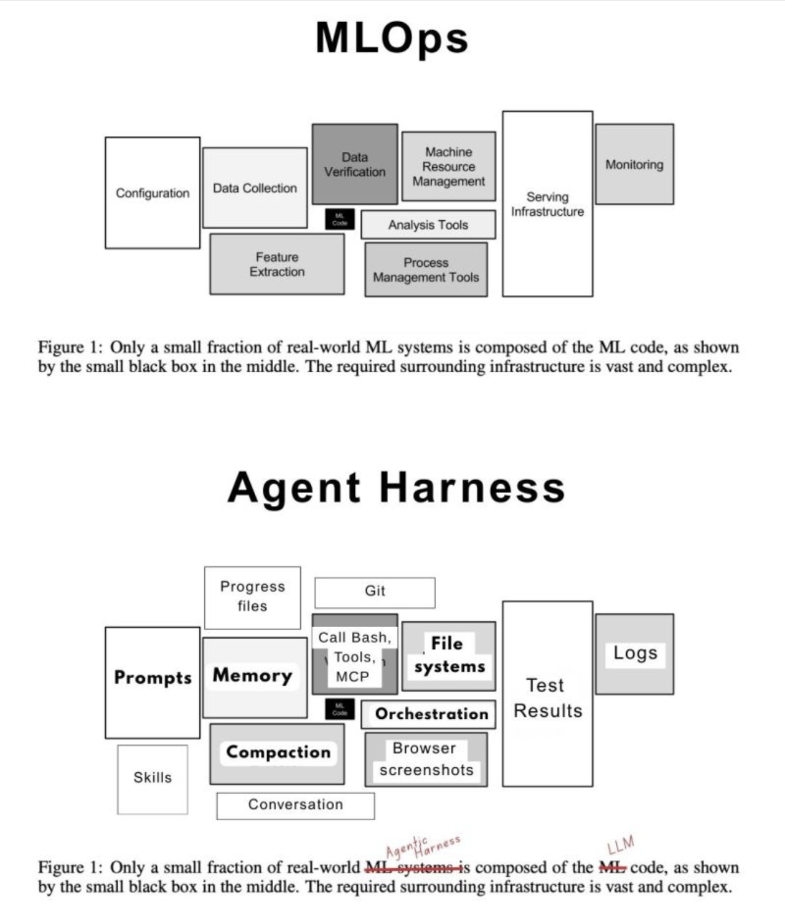

## From MLOps to Agent Harness Engineering: Why the Model Is the Small Box and the System Is the Product

Modern ML systems taught a hard lesson: the trained model is rarely the product by itself. Most of the engineering burden lives in the system around it, including data pipelines, validation, serving, monitoring, and operational control. Agent systems follow the same pattern. The LLM is one runtime component inside a larger harness made of prompts, tools, memory, orchestration, file and state management, logs, evaluators, and control loops. Once agents do real work over time, reliability depends less on model choice alone and more on whether the surrounding system can make work bounded, observable, and verifiable in practice. ([NeurIPS Proceedings][1]) ([Anthropic][2])

## Core thesis

For production agent systems, the model is not the product. The product is the harness around the model.

The operational question is not whether the base model is smart in isolation. It is whether the surrounding system can consistently give the model the right context, limit the wrong actions, preserve task state, verify outputs, and surface failures early enough to recover. Stronger models help, but they do not remove the need for those controls. In practice, harness quality is often the difference between a demo that looks impressive once and a system that can be operated repeatedly without accumulating hidden debt. ([NeurIPS Proceedings][1]) ([Anthropic][4])

## Context & motivation

A useful starting point is the old MLOps warning. In *Hidden Technical Debt in Machine Learning Systems*, the model appears as a small black box inside a much larger operational system, and most of the long-term maintenance burden comes from the surrounding infrastructure rather than the learned component itself. The paper called out entanglement, hidden feedback loops, undeclared dependencies, and boundary erosion as recurring sources of technical debt in production ML. ([NeurIPS Proceedings][1])

Agent systems are running into an equivalent reality. Public discussion still focuses on larger context windows, better reasoning, and stronger frontier models, but deployed behavior is increasingly shaped by the environment around the model. Anthropic's guidance on effective agents centers the augmented LLM with retrieval, tools, and memory. Work on context engineering and long-running harnesses makes the same point more directly: useful agents need explicit mechanisms for context selection, persistence, and execution control over time. ([Anthropic][2]) ([Anthropic][3]) ([Anthropic][5])

This matters because teams are moving from short interactive sessions to longer-running agent workflows that must survive incomplete context, imperfect tools, changing state, and real operational consequences. At that point, the main problem is no longer how to call a model. The problem is how to make a model perform bounded, checkable work inside an engineered environment.

## Mechanism / model

An agent harness is the complete environment inside which an LLM can observe, decide, act, and be checked. It plays the same role for agent systems that MLOps infrastructure plays for production ML.

A practical harness usually has five layers:

1. **Cognitive runtime.** The LLM produces plans, summaries, tool selections, and decisions. This is the flexible probabilistic core, but it should not carry responsibilities that belong elsewhere.
2. **Context plane.** Retrieval, memory recall, compaction, and relevance filtering determine what the model sees. Many failures that look like reasoning failures are actually failures of context assembly. Anthropic's context-engineering guidance is useful here because it treats context quality as a first-class engineering problem rather than a prompt-writing detail. ([Anthropic][3])
3. **Action plane.** Tool schemas, permissions, rate limits, filesystem boundaries, browser mediation, API wrappers, and transactional semantics determine what the model can do. Tool design is part of the product, not plumbing. Poorly named tools, vague parameters, weak return structures, and broad permissions reliably degrade outcomes. ([Anthropic][4])
4. **Verification plane.** Tests, assertions, policy checks, output validators, simulations, and human approval gates decide whether outputs are accepted, retried, escalated, or rejected. Correctness should not depend on how convincing the model sounds.
5. **Observability and governance plane.** Logs, traces, run histories, artifact versioning, budgets, auditability, and policy enforcement make the system operable by a team rather than legible only to the person who first built it.

This layered view leads to a simple rule: if a function can be externalized into the harness, it usually should be. Memory should not depend on the model remembering. Safety should not depend on the model being careful. Correctness should not depend on eloquence.

## Why the MLOps analogy matters

The MLOps analogy matters because it prevents three category errors.

First, it pushes against model reductionism. In both ML and agent systems, system quality is mediated by interfaces, controls, feedback loops, and operational discipline, not just by the core learned component. ([NeurIPS Proceedings][1])

Second, it pushes against demo-driven architecture. A prompt plus a few tools can look good in a short run, then fail badly once context grows, state changes, or an action has real consequences. ML systems accumulated debt when teams optimized for the happy path and ignored monitoring, drift, observability, and recovery. Agent systems will do the same if teams ignore prompt sprawl, tool sprawl, hidden state dependencies, and context drift. ([NeurIPS Proceedings][1])

Third, it shifts attention toward the levers teams can actually control. Most teams cannot improve the frontier model. They can improve tool interfaces, memory design, task decomposition, verification loops, context routing, and runtime policy. Those are increasingly the controllable factors that determine cost, reliability, and safety. ([Anthropic][4])

## Concrete examples

### Coding agent in a repository

A naive coding agent gets a large prompt, broad repository access, bash, and git. It works on small tasks, then degrades as the task horizon extends. Context goes stale, edits conflict, the agent loses track of intent, and it starts re-reading or rewriting the same material because too much state is implicit.

A harnessed version changes the environment rather than the model. It uses scoped file retrieval, explicit task artifacts, compacted progress summaries, targeted tests, and checkpoints before risky changes. The model is still the same probabilistic core, but the system behaves better because the harness constrains entropy and provides objective feedback after each step. This is consistent with guidance for long-running coding agents. ([Anthropic][5])

### Business workflow agent

A support operations agent reads tickets, queries internal systems, drafts recommendations, and escalates edge cases. The brittle version relies on one large system prompt and broad free-form tool access. It can produce plausible text, but it is hard to trust and harder to debug.

The production version introduces customer-context memory, structured tools with explicit schemas, routing to only relevant systems, policy gates for risky actions, and evaluator checks before anything is sent downstream. The difference in outcome comes mainly from harness quality, not from a fundamentally different model. That matches the augmented LLM framing and the emphasis on tools and memory in agent design guidance. ([Anthropic][2])

## Trade-offs & failure modes

The analogy to MLOps is strong, but agent harnesses are not just MLOps with a new name. They add their own operational burden because the central artifact is not merely a predictor. It is an interactive controller whose behavior unfolds across time, tools, and external state.

Several failure modes show up repeatedly:

- **Prompt sprawl.** Instructions accumulate, become contradictory, and create brittle behavior.
- **Memory poisoning or irrelevance.** Persisted state becomes stale, low-signal, or misleading, so the agent reasons from bad assumptions.
- **Tool overexposure.** Too many tools increase choice complexity and misfires. Tool abundance without routing usually makes an agent worse, not better.
- **Context bloat.** More context is not automatically better. Noise crowds out signal, which is why context selection matters as much as context size. ([Anthropic][3])
- **Verification gaps.** Without tests, schemas, simulators, or approval gates, the system can act confidently and incorrectly.
- **Bad decomposition.** Google's work on scaling agent systems suggests that architecture must match task topology. Multi-agent systems help for parallelizable work and can hurt on sequential work. ([Google Research][6])
- **Operational invisibility.** Weak logs and traces make it hard to distinguish model weakness from harness weakness.

There is also a cost side to this framing. A better harness usually improves reliability, but it also creates more surface area to maintain. Once teams move to long-running agents, they take on new burdens around context-window economics, execution safety, resumability, budgets, and reasoning-trace management. Anthropic's work on long-running harnesses exists precisely because uninterrupted trajectories do not scale cleanly without compaction and state control. ([Anthropic][5])

## Practical takeaways

1. Put durable state outside the prompt. Use explicit memory stores, files, and task artifacts instead of relying on conversational continuity. ([console.anthropic.com][7])
2. Treat tools as product interfaces. Naming, parameter clarity, return structure, and error semantics directly affect agent quality. ([Anthropic][4])
3. Optimize context selection, not just context size. A smaller, sharper context usually beats a larger, noisier one. ([Anthropic][3])
4. Verify before trusting. Meaningful actions should terminate in tests, policy validation, schema checks, simulation, or human approval.
5. Match orchestration to task structure. Do not cargo-cult multi-agent designs; use them when the work actually parallelizes. ([Google Research][6])

## Positioning note

This is not an academic paper proposing a new learning algorithm or formal theory of agency. It is also not a blog-style opinion piece built around novelty or personal narrative. And it is not vendor documentation tied to a specific stack.

It is an applied technical note: a narrow operational argument about where reliability and leverage are moving in production agent systems. The goal is to give experienced builders a durable model for thinking about agent design, using evidence from the MLOps literature and work from Anthropic and Google. ([NeurIPS Proceedings][1]) ([Anthropic][2]) ([Google Research][6])

## Status & scope disclaimer

This note is exploratory lab work, not an authoritative standard. The argument is grounded in published work and in visible operating patterns around current agent tooling, but it is still a practical framing rather than settled doctrine.

The scope is intentionally narrow. This note is about production agent systems and the engineering harness around them. It is not a general theory of intelligence, and it does not argue that model quality no longer matters. The claim is more specific: once teams try to run agents on real work, the surrounding system becomes the main determinant of whether those models are useful, safe, and operable over time.

[1]: https://proceedings.neurips.cc/paper/2015/file/86df7dcfd896fcaf2674f757a2463eba-Paper.pdf?ref=ds3lab.ghost.io&utm_source=chatgpt.com 'Hidden Technical Debt in Machine Learning Systems'
[2]: https://www.anthropic.com/research/building-effective-agents?utm_source=chatgpt.com 'Building Effective AI Agents'
[3]: https://www.anthropic.com/engineering/effective-context-engineering-for-ai-agents?utm_source=chatgpt.com 'Effective context engineering for AI agents'
[4]: https://www.anthropic.com/engineering/writing-tools-for-agents?utm_source=chatgpt.com 'Writing effective tools for AI agents—using ...'
[5]: https://www.anthropic.com/engineering/effective-harnesses-for-long-running-agents?utm_source=chatgpt.com 'Effective harnesses for long-running agents'
[6]: https://research.google/blog/towards-a-science-of-scaling-agent-systems-when-and-why-agent-systems-work/?utm_source=chatgpt.com 'Towards a science of scaling agent systems'
[7]: https://console.anthropic.com/docs/en/agents-and-tools/tool-use/memory-tool?utm_source=chatgpt.com 'Memory tool - Claude API Docs'
