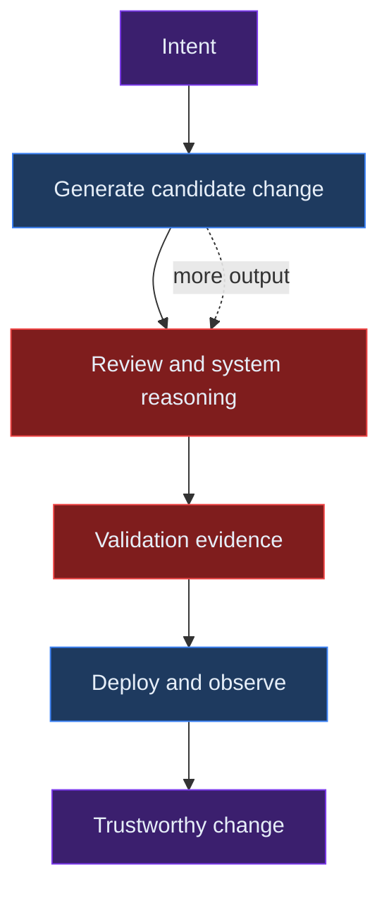
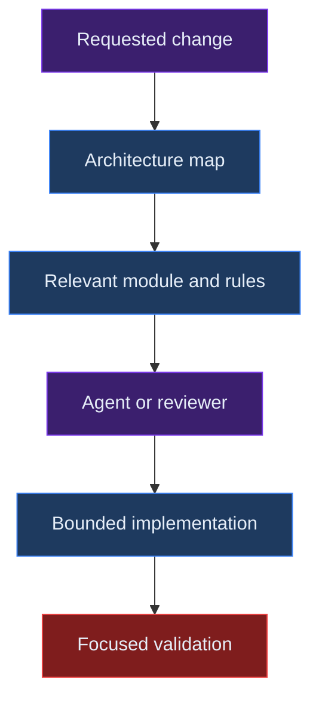
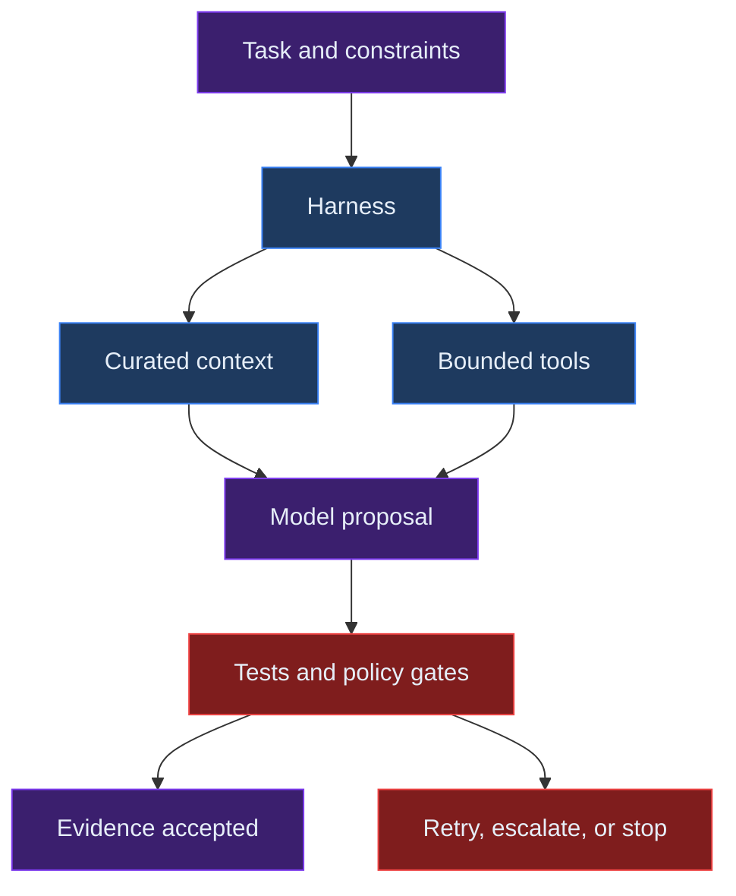

# The New Scarcity of Software Engineering in the AI Era

## Abstract

AI coding tools make locally plausible code cheaper, but they do not lower every cost of software delivery at the same rate. This note argues that the constraint is shifting to problem framing, system comprehension, verification, and the design of the controls around agents. The operational implication is simple: optimize for trustworthy change, not generated-code volume.

## Context

Coding agents can inspect repositories, edit files, run commands, and iterate against tests. [OpenAI's account of harness engineering](https://openai.com/index/harness-engineering/) describes this as an agent-first development environment; [Anthropic's research on Claude Code use](https://www.anthropic.com/research/claude-code-expertise) reports that domain expertise remains associated with better outcomes. These are useful signals, but neither makes implementation equivalent to engineering.

Cheaper implementation usually produces more implementation. More branches, generated tests, dependencies, and diffs then reach stages that have not become equally cheap: requirement clarification, review, integration, deployment, incident response, and maintenance.

That is why a team can report faster task completion while trustworthy delivery slows. Local output has increased without a matching ability to determine whether a change is correct, safe, and worth owning.

## Core thesis

As the marginal cost of code generation falls, justified judgment becomes software engineering's scarce resource: the ability to frame the right problem, understand system-wide consequences, and produce evidence that a change is safe enough to adopt.

Code is an input to a delivery system, not its final product. The product is a change that works in its real environment and remains comprehensible to the people responsible for it.

## Mechanism: constraint migration

The whole change path is the relevant unit. A faster coding step improves delivery only when the surrounding system can absorb its output.

*Caption: Faster generation moves the bottleneck to evaluation and integration.*

Review is not merely a ceremonial approval step. The bottleneck is the ability to reconstruct intent, trace effects across boundaries, judge test relevance, and identify consequences that a local diff cannot show.

[Herbert A. Simon's “Designing Organizations for an Information-Rich World”](https://gwern.net/doc/design/1971-simon.pdf) offers a useful analogy: information abundance consumes attention. Here, code abundance consumes evaluation attention. A larger candidate set makes filtering and interpretation more valuable.

### Context efficiency is an architectural property

Agents and reviewers both need enough relevant context to make a reliable change. Scattered rules, inconsistent terminology, and implicit dependencies force them to load and reconcile more information. Clear boundaries, explicit interfaces, focused documentation, and executable constraints reduce that work.

[Anthropic's context-engineering guidance](https://www.anthropic.com/engineering/effective-context-engineering-for-ai-agents) identifies this constraint at the agent level: more context is not automatically better context. For an engineering organization, the corresponding architectural question is:

> How much relevant information must a human or agent load to make one correct change?

Call this **context efficiency**. It does not replace correctness or modularity; it asks whether those qualities make a system easier to change safely.

*Caption: A legible repository narrows the context needed for correct action.*

## What becomes scarce

### Problem framing and architectural judgment

Models can produce coherent implementations of incorrect interpretations. They cannot reliably decide which organizational constraint should dominate, what a product requirement means in a local domain, or whether a new abstraction justifies its future operational cost.

These are architectural decisions because they allocate complexity and responsibility over time. They are also accountable decisions: someone must bear the consequences when the system is misunderstood, overloaded, or changed by a different team.

### Program comprehension and code review

[Google Engineering Practices’ *The Standard of Code Review*](https://google.github.io/eng-practices/review/reviewer/standard.html) states that review exists to improve the health of the codebase, not merely to find syntax errors. That purpose becomes more important when a model can produce a convincing patch in seconds.

A reviewer must still determine whether the behavior meets the real requirement, preserves authorization and data boundaries, duplicates an existing abstraction, encodes a fragile assumption, and has meaningful tests. These questions take time because they depend on system and domain context.

### Verification and evidence

Generated code can pass a narrow test while still using an unsafe tool path, violating an architectural boundary, or failing a user flow. AI systems introduce another concern: acceptable performance on a few examples is not evidence of acceptable performance across the cases that matter.

[Anthropic's *Demystifying Evals for AI Agents*](https://www.anthropic.com/engineering/demystifying-evals-for-ai-agents) recommends combining code-based, model-based, and human graders where appropriate. The broader engineering lesson is that completion criteria should require evidence, not a self-reported assertion of success.

An evidence-carrying change may include deterministic tests, build results, a demonstrated user flow, logs or traces, defined forbidden actions, and independent review. The needed evidence is risk-dependent; an isolated copy change and a permission-model change should not face the same gate.

### Harness engineering

A model is not a complete engineering system. It operates as an agent within a harness that selects context, exposes tools, sets permissions, manages retries, and decides what counts as completion.

[Anthropic's *Effective Harnesses for Long-Running Agents*](https://www.anthropic.com/engineering/effective-harnesses-for-long-running-agents) and [*Harness Design for Long-Running Application Development*](https://www.anthropic.com/engineering/harness-design-long-running-apps) both emphasize progress artifacts and structured continuation for work that exceeds one context window. In practice, reliability comes from the interaction between model and environment, not model capability alone.

*Caption: The harness converts a model proposal into either bounded progress or a controlled stop.*

Tool design is part of that environment. [Datadog's guidance on designing MCP tools for agents](https://www.datadoghq.com/blog/engineering/mcp-server-agent-tools/) focuses on clear, composable tool interfaces; its [native AI-agent integrations](https://www.datadoghq.com/blog/datadog-ai-agent-integrations/) illustrate a related need: agents require controlled access to current telemetry, not only static repository context.

## Concrete operating examples

### Example 1: a generated authorization change

An agent can add a route guard and unit tests quickly. The scarce work is deciding whether the route is the actual enforcement boundary, whether a background job can bypass it, which existing policy owns the decision, and how to demonstrate that denial and audit behavior remain correct.

The appropriate output is not “the agent changed the route.” It is a bounded change with tests at the policy boundary, evidence of the affected flow, and a review that connects the change to the authorization model.

### Example 2: an observability-assisted incident fix

An agent with production telemetry can propose a likely regression fix. The scarce work is distinguishing correlation from cause, controlling access to sensitive data and production actions, and defining a rollback signal before deployment.

Live context can improve diagnosis here, but only when the harness limits permissions and requires evidence from the relevant trace or metric. More tool access without those controls can increase both the blast radius and the amount of irrelevant context.

## Trade-offs and failure modes

This model does not imply that every change needs a heavy evaluation program. Overbuilt gates delay low-risk work and teach teams to route around the process. Controls should scale with irreversibility, blast radius, uncertainty, and the cost of being wrong.

Nor does it assume that human judgment is consistently correct. Human review can be shallow, biased, and slow. The relevant comparison is not ideal humans versus imperfect models, but the quality of complete human–AI delivery systems.

[DORA's 2025 research on the value of development work](https://dora.dev/research/ai/value-of-development-work/) frames generative AI as an amplifier of existing conditions, while the [DORA 2025 report](https://dora.dev/dora-report-2025/) places outcomes in a broader technical and organizational system. The caution is practical: adding an agent to unclear ownership, weak tests, or poor deployment discipline may scale the dysfunction rather than repair it.

Finally, some current bottlenecks may move again. Better models and evaluators may automate parts of review, architecture, and test design. The durable claim is not that specific human tasks are permanently protected, but that reducing one constraint creates demand for control at another layer.

## Practical takeaways

1. Measure time from intent to validated production behavior, including review, rework, and incidents—not code volume or agent sessions.
2. Make repository context cheaper to load: document boundaries, use consistent domain language, and put enforceable rules near the work they govern.
3. Require proportional evidence for consequential agent changes: tests, demonstrated behavior, policy checks, and a clear rollback path.
4. Treat the harness as production infrastructure. Version its permissions, tool contracts, validation gates, and stopping rules.
5. Preserve apprenticeship through code reading, test design, incident analysis, and critique of generated work; these are how future reviewers develop judgment.

## Positioning note

This is not academic research: it does not claim a new benchmark, causal study, or universal theory of labor substitution. It is not a blog opinion: its claim is intentionally operational and grounded in publicly described agent, evaluation, review, and delivery practices. It is not vendor documentation: it does not prescribe a particular model, platform, or toolchain.

## Status and scope disclaimer

This is exploratory personal lab work, not an authoritative standard or validated organizational model. It synthesizes public sources with practical engineering reasoning. Its scope is AI-assisted software delivery; it does not forecast employment, claim that all engineering work follows the same pattern, or replace risk assessment for a specific system.

## References

- [Anthropic — *Demystifying Evals for AI Agents*](https://www.anthropic.com/engineering/demystifying-evals-for-ai-agents)
- [Anthropic — *Effective Context Engineering for AI Agents*](https://www.anthropic.com/engineering/effective-context-engineering-for-ai-agents)
- [Anthropic — *Effective Harnesses for Long-Running Agents*](https://www.anthropic.com/engineering/effective-harnesses-for-long-running-agents)
- [Anthropic — *Harness Design for Long-Running Application Development*](https://www.anthropic.com/engineering/harness-design-long-running-apps)
- [Anthropic — *How Claude Code Is Used in Practice*](https://www.anthropic.com/research/claude-code-expertise)
- [Datadog — *Bring Live Datadog Telemetry into Your AI Agents with Native Integrations*](https://www.datadoghq.com/blog/datadog-ai-agent-integrations/)
- [Datadog — *Designing MCP Tools for Agents*](https://www.datadoghq.com/blog/engineering/mcp-server-agent-tools/)
- [DORA — *How Gen AI Affects the Value of Development Work*](https://dora.dev/research/ai/value-of-development-work/)
- [DORA — *State of AI-Assisted Software Development Report 2025*](https://dora.dev/dora-report-2025/)
- [Google Engineering Practices — *The Standard of Code Review*](https://google.github.io/eng-practices/review/reviewer/standard.html)
- [Herbert A. Simon — *Designing Organizations for an Information-Rich World*](https://gwern.net/doc/design/1971-simon.pdf)
- [OpenAI — *Harness Engineering: Leveraging Codex in an Agent-First World*](https://openai.com/index/harness-engineering/)
