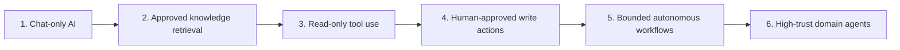
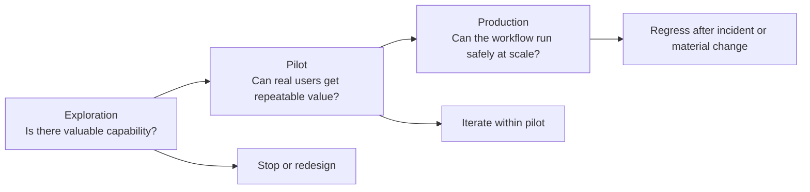
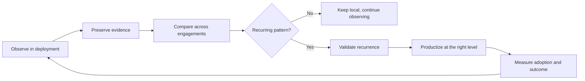

# New to AI Forward Deployed Engineering

AI Forward Deployed Engineering sits where model capability meets enterprise reality. The role exists because useful AI systems do not stop at answers. They retrieve evidence, interpret policy, request approval, call tools, update systems, and leave an audit trail. That makes deployment an engineering problem about workflow, identity, control, and measurable outcomes, not just prompts or model selection [1][2][3][4].

## 1. What is an AI Forward Deployed Engineer?

An AI Forward Deployed Engineer, or FDE, is the engineer who turns a messy business workflow into a governed AI operating path.

That definition is narrower than "AI consultant" and broader than "integration engineer." The job is not only to connect a model to a data source, nor only to demo a chatbot. The durable job is to make an AI system useful inside real institutional constraints: permissions, approvals, systems of record, business rules, and accountability [1][2].

The role is showing up now for a practical reason. Frontier models are strong enough to summarize, retrieve, classify, draft, and reason across tools. What still blocks enterprise value is not usually raw model capability. It is the gap between model capability and production workflows. Financial Times describes forward-deployed engineers as a fast-rising AI role because enterprises need people who can translate general model capability into local operating systems for actual work [1]. Databricks describes the same pattern from the delivery side: embedded engineers work with customers to reach business outcomes while feeding recurring friction back into product and platform capability [2].

In practice, an FDE works at the boundary between:

- business outcomes, such as cycle time, throughput, or risk reduction
- workflow design, including triggers, approvals, escalation, and evidence
- policy and identity, including who can read, propose, approve, and execute
- tool and knowledge interfaces, including APIs, MCP tools, and structured context
- model runtime behavior, including evaluation, cost, latency, and failure handling

The role matters because enterprise AI rarely fails at "the model said something weird" alone. It fails when nobody has defined what work may be delegated, what evidence is required, which actions are reversible, or how the system proves it stayed inside policy [5][8][10].

Not every AI feature needs an FDE. The role becomes most useful when a workflow crosses systems, approvals, or consequential actions and therefore needs explicit delegation boundaries.

## 2. Why the role matters

The shift from copilots to agents changes the deployment problem.

Chat interfaces and drafting assistants are useful, but the human remains the primary actor. An agentic system changes the unit of work. It can gather context across systems, structure a proposal, ask for approval, call tools, write to downstream systems, and verify the result. At that point, the core question is no longer "Is the answer good?" It becomes "Can this workflow be safely delegated under bounded authority?" [3][5][7][10]

That is why FDEs are usually working on governed delegation rather than generic automation. Governance is not a compliance layer added later. It is part of the product boundary. Without it, the system cannot be trusted with meaningful work [5][8][9].

The progression usually follows a control ladder:

The mistake is trying to jump from chat to autonomy. Enterprises often want level five behavior before they have level three controls: scoped credentials, typed tools, approval paths, evaluation cases, or auditable traces. FDEs slow that jump down in the right way. They sequence authority with evidence, and they increase control as consequence rises [5][7][8][9][10].

That sequencing matters because the north star is not "agents launched." It is safely delegated work completed. A successful deployment completes useful work under appropriate governance, with measurable value and named human accountability [5].

## 3. Core capabilities

FDEs create value by doing five kinds of work repeatedly.

### Workflow discovery

They study actual work, not the official process diagram. They look for triggers, waiting points, copy-paste loops, hidden judgment calls, risky handoffs, and systems that jointly define the workflow. The better starting question is not "Which agent should we build?" It is "What work can be partially delegated, under what constraints, and with what measurable outcome?" [5]

### Governed workflow design

They convert that workflow into an explicit contract:

- who owns the outcome
- what triggers the flow
- which data sources are approved
- which tools are allowed
- which actions are forbidden
- where approval is required
- what must be logged
- what counts as success, failure, and rollback

This is the difference between a demo and an operating path. Once the contract exists, the team can reason about consequence, control strength, and auditability before code sprawls across integrations [5][10].

### MCP and tool design

FDEs do not just wire up APIs. They redesign system access into agent-usable business actions. A weak interface exposes low-level CRUD or generic SQL access. A strong interface exposes bounded actions such as "summarize account risk," "draft incident follow-up ticket," or "execute approved access change." That makes the interface easier to permission, evaluate, and observe [8].

This is where the role overlaps with the enterprise control plane. Good tool design separates read, propose, approve, and execute paths instead of collapsing them into one broad capability [5][8].

### Evaluation and telemetry

FDEs treat evaluation as part of the workflow, not as a separate model benchmark. They measure quality, safety, reliability, cost, latency, approval rate, correction burden, and business usefulness. They care about whether the workflow completes correctly in the real environment, not whether the model looked impressive in a narrow test [5][10].

### Pattern extraction and organizational learning

The highest-leverage FDE teams do not stop at a local delivery. They capture recurring discoveries, compare them across deployments, validate recurrence, and then decide what should remain local versus become a reusable pattern, evaluation asset, shared library, or platform capability. Without that loop, every deployment rediscovers the same edge cases and the organization scales by headcount alone [2][11][12][13].

## 4. The FDE operating model

Strong FDE teams do not choose between speed and governance. They sequence evidence and controls across three modes: Exploration, Pilot, and Production [10].

### Exploration

Exploration asks whether there is enough value to justify continued investment. The team should maximize learning while preventing material harm. Controls are light but deliberate: bounded datasets, small user groups, trace capture, and read-only tools unless writes are essential.

### Pilot

Pilot asks whether real users can get repeatable value under realistic but bounded conditions. The workflow now has named owners, explicit success criteria, support responsibility, monitoring, and a defined operating envelope.

### Production

Production asks whether the workflow can run safely, reliably, economically, and accountably at scale. That requires stronger identity controls, observability, change management, incident response, periodic re-evaluation, and residual-risk acceptance [10].

Across those stages, the operating discipline is consistent:

1. Separate capability risk from operational risk.
2. Bound consequences instead of demanding certainty.
3. Increase controls with authority and irreversibility.
4. Use evidence to move between stages.
5. Design human oversight as part of the system.
6. Evaluate the whole socio-technical workflow, not just model output [10].

The stage-gate is simple in principle and hard in practice. A transition should force the same review every time: did the workflow produce value, handle representative cases, stay inside controls, remain operable, justify its cost, and have a named owner willing to accept the residual risk? If not, it should iterate, regress, or stop [10].

This model assumes a baseline of organizational maturity. Typed tools, approvals, traces, and rollback paths do not create safety by themselves. If ownership is weak or reviewers cannot actually intervene, the controls are theatre rather than governance.

## 5. Real FDE workflows

The role becomes concrete when you look at bounded workflows instead of abstract "agents."

### Incident review

An incident review agent can collect incident context, deployment metadata, related tickets, and dashboard evidence, then draft a timeline and follow-up actions. The useful autonomy level is usually human-approved drafting, not autonomous remediation. The FDE work is defining approved sources, evidence requirements, failure modes, and ticket-creation controls [5].

### Customer support drafting

A support drafting workflow can summarize case history, retrieve policy and documentation, identify uncertainty, and draft both an internal recommendation and a customer-facing response. The usual boundary is draft-only, with no autonomous sending. The FDE challenge is grounding, policy alignment, and preventing the system from treating incomplete context as complete context [5].

### Sales account briefing

A sales briefing workflow can pull CRM context, usage signals, support history, and internal notes into a structured account brief. This is usually read-only plus draft generation. The hard part is not retrieval alone. It is deciding which sources are authoritative, how to separate facts from recommendations, and how to avoid leaking inappropriate internal context into the brief [5].

### Ticket enrichment

A ticket enrichment workflow can inspect an operational ticket, retrieve service metadata, identify missing fields, suggest an owner, and draft a structured update. This is a good early workflow because it reduces coordination load without removing human accountability for the final update [5].

Across all four examples, the pattern is stable:

- narrow workflow
- clear owner
- approved sources
- typed tools
- visible success criteria
- human review where consequence rises

That repeatability is why the unit of adoption is the workflow, not the agent [5].

## 6. Key challenges

The work is valuable precisely because it is hard.

### Premature abstraction

Teams often productize the first successful workflow too early. A local orchestration pattern may not survive a second business unit, a different permission model, or a different review path. The right default is the rule of three: solve locally, reuse in a second environment, and only abstract once repeated use reveals what is actually stable [2].

### Learning system gaps

An FDE team can deliver several successful systems and still fail strategically if nothing compounds. The organization then has outputs, but not leverage. It built systems without learning how to build the next one faster or safer [2][11][12][13].

### Human review bottlenecks

Approval gates reduce risk, but they also add latency and workload. A weak review step is dangerous in two ways: it can be too shallow to catch errors, or too slow to preserve workflow value. FDEs have to design review as an operational subsystem with enough evidence, time, and authority to matter [10].

### Identity and delegation misdesign

Enterprise permissions were built for humans and conventional applications, not agents reasoning conditionally across multiple tools. The common failure is treating a user's existing access as a proxy for what an agent should be allowed to do on the user's behalf. Strong systems separate read authority, proposal authority, approval authority, and execution authority [4][8][10].

### Delivery versus learning tension

FDE teams are often pulled toward immediate delivery pressure. That is rational because local outcomes matter. But if every engagement ends with bespoke code, undocumented assumptions, and no reusable evidence, the team becomes an expensive services layer. The strategic challenge is to hit local outcomes while extracting organizational capability from each deployment [2][11][13].

For engineers new to the field, this is the right mental model: the job is not to make AI look smart. The job is to make delegated work safe, useful, measurable, and increasingly reusable. In practice, that model fits best in organizations where workflows are consequential enough to justify explicit controls and operating ownership.

### Practical takeaways

- Start with workflows, not agent personas.
- Separate read, propose, approve, and execute authority early.
- Use typed, business-level tools instead of raw system access.
- Treat evaluation, logging, and rollback as part of the workflow design.
- Capture deployment evidence so each engagement improves the next one.

### Positioning note

This guide is not a canonical definition of the FDE role across every company. It is a synthesis of the operating patterns that appear when enterprises move from AI assistance toward governed delegation of work.

### Status and scope disclaimer

This note is exploratory but evidence-backed lab work. It is intended for experienced engineers and technical leaders thinking about enterprise AI delivery. It is not authoritative guidance, and it does not replace security, legal, compliance, or domain-specific operational review.

## 7. Further reading

### Internal references

These five rmax.ai notes together form the backbone of this landing page:

- [The Forward Deployed Engineer in Enterprise AI: From Integration Specialist to Agentic Control-Plane Builder](/notes/forward-deployed-engineer-enterprise-ai/)
- [FDE Playbook for Governed Agentic Adoption](/notes/fde-playbook-governed-agentic-adoption/)
- [AI FDE Operating Model: Exploration, Pilot, and Production](/notes/ai-fde-operating-model/)
- [Why AI FDE Teams Must Become Organizational Learning Systems](/notes/ai-fde-organizational-learning-systems/)
- [MCP Design Best Practices for Agents: From API Wrappers to Agent-Native Interfaces](/notes/mcp-design-best-practices-for-agents/)

### External references

If you want the shortest path into the broader context, start with the market signal in Financial Times, then read the operating-model material from Databricks, OpenAI, and Palantir, and finally read the governance material from MCP, OWASP, and NIST [1][2][3][4][5][6][8][9][10].

For the organizational-learning side of the role, the most useful conceptual anchors are March on exploration versus exploitation, Nonaka on knowledge creation, and Cohen and Levinthal on absorptive capacity [11][12][13].

## References

[1] Cristina Criddle, "The New Hot Job in AI: Forward-Deployed Engineers," *Financial Times*, 2 November 2025. https://www.ft.com/content/91002071-7874-4cb7-9245-08ca0571c408

[2] Jason Martin, "Forward Deployed Engineering: Delivering Business Outcomes with AI," Databricks, 2026. https://www.databricks.com/blog/forward-deployed-engineering-delivering-business-outcomes-ai

[3] OpenAI, "OpenAI launches the OpenAI Deployment Company to help businesses build around intelligence," 11 May 2026. https://openai.com/index/openai-launches-the-deployment-company/

[4] OpenAI Careers, "Forward Deployed Engineer (FDE)" and related technical deployment roles, 2026. https://openai.com/careers/forward-deployed-engineer-(fde)-nyc-new-york-city/ and https://openai.com/careers/search/

[5] Palantir, "Connecting Agents to Decisions," 28 April 2026. https://blog.palantir.com/connecting-agents-to-decisions-277dee8ddb40

[6] Palantir, "How Palantir AIP Bootcamps Work," 22 February 2024. https://blog.palantir.com/deploying-full-spectrum-ai-in-days-how-aip-bootcamps-work-f6c3b6efb329

[7] Google Cloud, "Introducing Gemini Enterprise Agent Platform," 22 April 2026. https://cloud.google.com/blog/products/ai-machine-learning/introducing-gemini-enterprise-agent-platform

[8] Model Context Protocol, "Understanding Authorization in MCP," 2025. https://modelcontextprotocol.io/docs/tutorials/security/authorization

[9] OWASP GenAI Security Project, "OWASP Top 10 for Agentic Applications for 2026," December 2025. https://genai.owasp.org/resource/owasp-top-10-for-agentic-applications-for-2026/

[10] National Institute of Standards and Technology, "Artificial Intelligence Risk Management Framework: Generative Artificial Intelligence Profile," NIST AI 600-1, July 2024. https://www.nist.gov/publications/artificial-intelligence-risk-management-framework-generative-artificial-intelligence

[11] James G. March, "Exploration and Exploitation in Organizational Learning," *Organization Science* 2, no. 1 (1991). https://pubsonline.informs.org/doi/10.1287/orsc.2.1.71

[12] Ikujiro Nonaka, "The Knowledge-Creating Company," *Harvard Business Review*. https://hbr.org/2007/07/the-knowledge-creating-company

[13] Wesley M. Cohen and Daniel A. Levinthal, "Absorptive Capacity: A New Perspective on Learning and Innovation," *Administrative Science Quarterly* 35, no. 1 (1990). https://www.jstor.org/stable/2393553
