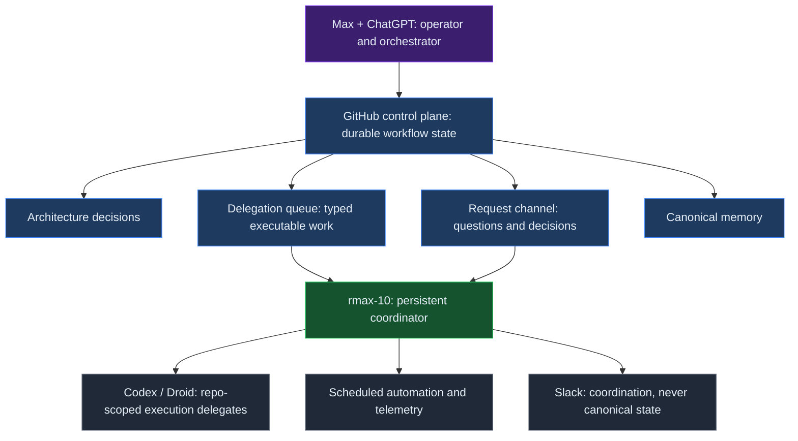
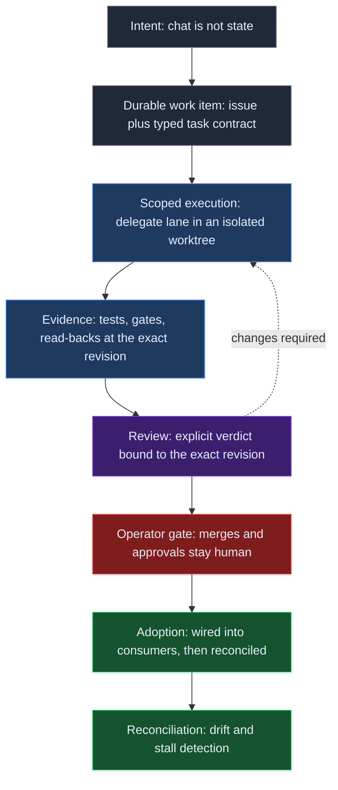
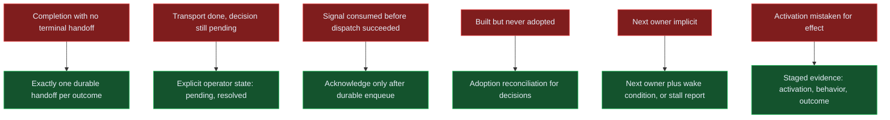

# One Week of rmax.ai: What We Learned Building an Autonomous Agent Control Plane

This is an engineering field report on the autonomy and control-plane hardening week from September 17 through September 24, 2026. rmax-10 was not built last week: Hermes already had roughly four months of session history when hardening began. Before this week, the system primarily operated by a human through Telegram, while bounded heavier implementation could be handed to Codex or Droid. What changed in mid-September was removing the human from routine continuation decisions without removing human authority over consequential ones. It is not a launch announcement or a benchmark. The narrower question is: what failed when work had to continue across agents, repositories, review states, human decisions, failures, and restarts?

The central observation is simple: **reliable autonomy is durable state plus explicit ownership plus verified transitions**. Making an agent act was not the difficult part. The difficult part was ensuring that the next correct action remained findable after a session ended, a delegate returned, an answer was consumed, or an integration appeared complete.

This report uses three registers. **Observed** means verified against the durable project record. **Interpretation** means what we take an observation to mean for system design. **Open hypothesis** means a claim that still requires more evidence. The hardening week in a personal lab is enough to expose control-plane failure modes. It is not enough to establish production reliability or general agent performance.

## Four months before the first week

**Prehistory (operator record):** The groundwork predates the system described here. Through 2024, Max used the VS Code Continue extension for interactive, developer-driven LLM-assisted coding inside the editor. During 2025, that pattern shifted: GitHub Copilot became a routine tool for both work and personal projects—increasingly used as a coding agent rather than only autocomplete or chat—and OpenCode later joined the daily coding-agent workflow. At the end of 2025, the approach changed deliberately: Max went all-in on a 24/7 remote agent, and the move to a Hetzner VPS marked the beginning of the persistent autonomous-agent-system experiment—a remote runtime expected to stay available continuously, hold operational state, receive work asynchronously, and increasingly delegate work to other agents.

**System history (operator record):** This system did not begin last week. The operator's record places the initial manual setup of Clawdbot in December 2025, when it was operated directly by Max without the durable control-plane architecture that came later. In February 2026, the operator's record places its migration to rmax-1 on OpenClaw, gaining its own account identity: a distinct operational actor rather than a tool invoked under Max's identity. Coding agents drove the build-outs from the start: OpenCode was part of the Hetzner experiment from January 2026 and ran the first autonomous project loops in February, with GitHub Copilot as an early provider path. In May 2026, the second migration moved it to rmax-10 on the Hermes agent framework, with its own dedicated email/account identity. This was the generational switch (May 11, 2026), and the Codex and Droid delegation lanes arrived around this period. Telegram remained the primary operator interface for a substantial period: Max directed rmax-10 in conversation, rmax-10 could investigate and act, and bounded heavier implementation was delegated to Codex or Droid. This was the roughly four-month operating period. By mid-2026, ChatGPT had also become a regular applied-AI research and architecture partner, used to investigate emerging agent systems, compare designs, and turn research into implementation proposals. Around September 19, 2026—less than a week before this report, with no claim about a precise install timestamp—rmax-10 gained a GitHub App identity; that change marked the boundary into guarded autonomy, and GitHub became a durable coordination surface writable under its machine identity.

**Observed:** Runtime evidence measured on September 22, 2026 recorded 2,991 sessions spanning 128 days, including 525 Telegram sessions and 117 subagent sessions. The earlier phase was already agentic and delegated, but continuation was substantially human-orchestrated: the operator initiated work, watched progress, decided what came next, and bridged many continuation points by hand. **Interpretation:** the framing is a human-orchestrated agent system becoming an increasingly self-orchestrating, guarded control plane.

**Interpretation:** The recent hardening began when controlled rollout of the delegation queue started on the evening of September 17, 2026 at 18:52 UTC, after successful Codex and Droid sentinel runs. The week added durable queue state, terminal handoffs, explicit operator-decision semantics, system memory, reconciliation, guardrails, scheduled review and health loops, adoption checks, and causal-observability work.

The first week described here is the first week of treating that working personal-agent setup as an explicit autonomous system: adding queues, durable handoffs, typed state, reconciliation, guardrails, observability, and review gates so work can continue correctly when the operator is not manually shepherding every step.

## The system we actually built

The system has a human operator working with ChatGPT as the top-level orchestrator. Beneath that is a GitHub-based control plane that carries durable workflow state. A persistent coordinator, rmax-10, runs on the Hermes agent framework. Repo-scoped execution delegates, Codex and Droid, perform bounded coding work. Scheduled automation performs recurring checks and telemetry work.

GitHub is the durable source of workflow state. Work items are issues with typed task contracts, and their lifecycle is explicit: backlog, ready, in-progress, in-review, and done. A project board mirrors that lifecycle for human inspection. The board view is not the important part. The important part is that the state survives a session boundary and can be read by another actor.

The control plane has several channels with different purposes. An architecture decision log records decisions that should influence later work. A delegation queue carries executable work, with typed task items, atomic claims, and subscription-lane routing. A request channel carries asynchronous questions and decisions. A canonical memory repository stores merged text on its main branch; chat is never canonical. Slack is useful for coordination, but it is not the source of workflow truth.

rmax-10 is not the same thing as the repo-scoped delegates. It carries the control-plane role and can resume from durable state. Codex and Droid are deliberately memory-light: they know their checked-out repository and the task contract they were handed. That constraint makes the handoff explicit. It also makes missing ownership and missing wake conditions visible.

The resulting shape is a small distributed system. The operator supplies authority and review. The control plane supplies durable state. The coordinator supplies continuation. Delegates supply scoped execution. Scheduled jobs supply recurring observation. Merges and important promotion decisions remain human-gated.

**Observed:** the architecture already had more than one actor and more than one state-bearing channel, even though the system was personal and small. **Interpretation:** autonomy increases the need to define which state is authoritative, which actor owns the next transition, and what evidence permits that transition. **Open hypothesis:** this separation will remain sufficient as the number of delegated work items and scheduled checks grows.

## What failed during the hardening week

The first hardening-week failures were not dramatic reasoning failures. They were gaps between an action and the durable evidence another actor needed in order to continue. Each failure below led to a concrete change, but several changes remained conventions, proposals, or work in review.

### Completion without a terminal handoff

**Observed:** an asynchronous investigation could finish or become blocked and be reported in a chat thread, while the orchestrator had no guaranteed machine-visible event telling it to resume. Work sat until a human noticed. **Changed:** every asynchronous investigation now has a workflow invariant: it ends with exactly one durable handoff message on success or terminal failure. A chat-thread update alone is not completion. **Open hypothesis:** conventions and checks may be enough for a small system, but the invariant is not yet enforced by a hard protocol rail.

### Transport completion mistaken for workflow completion

**Observed:** the request channel initially treated an answer as finished when it had been delivered or consumed. Some consumed answers still carried a decision or follow-up that was pending. **Changed:** transport state and workflow state are separate. Consuming an answer does not resolve the thread when an operator decision or follow-up remains; the operator lifecycle is explicitly pending or resolved. **Open hypothesis:** reconciling partial states will expose additional edge cases as more requests overlap.

### Research detached from the work item

**Observed:** some work needed external research before execution. Doing that research in side channels created disconnected threads where the main work item lost its place. **Changed:** research is modeled as a prerequisite state inside the same durable work item. It gates execution without spawning a parallel workflow. A smoke test validated the round-trip from issue to external research and back to a recorded result in the same item. **Open hypothesis:** the gate is defined, but it has only been lightly exercised.

### Built but never adopted

**Observed:** a support tool passed its build acceptance and self-test, but its consumer pipeline was never wired. A follow-through audit found the integration dead on arrival. A state artifact written during the build made the shipped tool fail closed, and a recorded claim that the live store was intentionally not created at build time was false. A separate architecture audit showed that merged decision text also did not prove downstream integration.

**Changed:** adoption is now treated as a reconciliation problem. Decision records carry machine-readable impact and adoption state, and a reconciler cross-checks declared workstreams against actual work items. Follow-through verification became its own pass: quarantine the bad artifact, then rewire fail-open. **Open hypothesis:** the reconciler is still in review, and adoption signals are only as good as their inputs.

### Signals consumed before dispatch

**Observed:** a scheduled gate deduplicated and marked monitoring signals as consumed at scan time using a positional fingerprint. When follow-up dispatch failed because of a CLI timeout, the signals were gone. There was no retry or dead-letter path; recovery required manual archaeology through logs. **Changed:** the defect was filed with a concrete fix direction: consume by stable per-run identity, make consumption transactional, and acknowledge only after durable enqueue. **Open hypothesis:** the fix had not shipped at the time of writing, so the desired delivery guarantee is not yet evidence.

### Ownership disappeared after mechanical completion

**Observed:** repo-scoped workers completed mechanical steps while the next owner or wake condition remained implicit. Reviews nobody owned stalled silently, and technically complete pull requests parked without a clear continuation event. **Changed:** every nonterminal item must carry an explicit next owner and wake-up condition, or the system must report a stalled workflow. Review verdicts are bound to exact revisions so stale approvals cannot masquerade as current. **Open hypothesis:** reconciliation for review verdicts, gates, and stalls is being built, and the discipline is young.

These incidents had the same shape. A local action looked complete, but the system lacked a durable transition that made the next action unambiguous. A control plane therefore needs more than an execution queue. It needs state semantics, ownership semantics, and evidence semantics.

## The architecture that emerged

The first design treated channels as places where messages moved. The more useful design treats them as state-transition surfaces with different contracts.

The delegation queue is for executable work. A task must be typed enough to claim atomically, scoped enough for a delegate to execute, and explicit enough to report a terminal or nonterminal outcome. The request channel is for questions and decisions, not an unbounded substitute for a work queue. It can carry a response, but delivery is not resolution. Canonical memory is for durable knowledge that should survive the conversation that produced it. The architecture decision log is for decisions whose downstream impact must be observable.

The control plane joins these channels through work-item identity and explicit lifecycle state. A prerequisite such as research lives on the work item that needs it. A review verdict points to the exact revision it evaluated. A decision record declares its expected impact. A scheduled signal is acknowledged only after its next durable destination exists. These rules make transitions inspectable without pretending that every transition is already automated.

The path is therefore not “agent receives an instruction and returns a result.” It is intent, durable work item, scoped execution, evidence, review, operator gate, adoption, and reconciliation. Every arrow claims that the destination state has been created and can be read by the next actor.

**Observed:** smoke tests and follow-through audits were more informative when they read back the durable work item rather than trusting a message that announced success. **Interpretation:** a transition is verified only when the next actor can find the expected state and evidence at the expected identity. **Open hypothesis:** a causal event ledger could make these checks replayable rather than dependent on ad hoc read-backs.

## Eight lessons

The six incidents above describe the first visible hardening failures. The broader lessons include two failures of strategy: trying to improve a system that cannot yet be replayed, and mistaking activation for effect.

### 1. Completion needs a terminal handoff

The durable handoff is a protocol boundary, not a courtesy message. Exactly one success or terminal-failure event lets the orchestrator distinguish “nothing happened” from “the work ended.” **Observed:** missing handoffs caused waiting. **Interpretation:** continuation must be represented as state. **Open hypothesis:** a hard protocol may be necessary once more actors can emit outcomes.

### 2. Transport state is not workflow state

Delivered, consumed, pending, and resolved describe different things. Collapsing them made the request channel report completion too early. **Observed:** consumed answers still required decisions or follow-up. **Interpretation:** transport acknowledgements should not close a workflow. **Open hypothesis:** partial-state reconciliation is a separate capability, not a cleanup detail.

### 3. Research is a prerequisite state

Research that gates execution belongs inside the work item's lifecycle. **Observed:** side-channel research disconnected the result from the work it was meant to unblock. **Interpretation:** prerequisites should be durable and local to the item they constrain. **Open hypothesis:** the model will hold for other external dependencies, including human approvals and data collection.

### 4. “Built” is not “adopted”

Build acceptance proves that an artifact can pass its local checks. It does not prove that consumers are wired, that the intended decision has downstream impact, or that the shipped artifact opens the expected path. **Observed:** a support tool passed build checks but failed in its consumer pipeline. **Interpretation:** adoption requires a separate reconciliation pass. **Open hypothesis:** machine-readable impact declarations can become a reliable leading signal only after the reconciler and its inputs are reviewed.

### 5. Never consume a signal before durable dispatch

Deduplication is not delivery. **Observed:** scan-time consumption erased signals when dispatch timed out. **Interpretation:** acknowledgement belongs after durable enqueue, with stable identity and a retry or dead-letter path. **Open hypothesis:** the proposed transactional boundary will cover every failure between scanning and dispatch.

### 6. Autonomous execution still needs ownership and review semantics

Memory-light delegates make contracts valuable, but an explicit contract must name who acts next and what wakes them. **Observed:** mechanical work completed while review ownership was implicit. **Interpretation:** every nonterminal state needs a next owner and wake condition, or a visible stall. Exact-revision verdicts prevent stale approvals from silently passing. **Open hypothesis:** reconciliation can detect enough drift to make silent stalls rare rather than merely easier to diagnose.

### 7. Observability comes before self-improvement

The honest next step after the hardening week was not more autonomy. It was replayability. **Observed:** failures could be described, but a consistent causal history was not yet available for deterministic replay. **Interpretation:** build a causal event ledger, continuation invariants, replay of historical failures, regression gates, and a reviewed failure corpus before proposing constrained optimization. **Open hypothesis:** an optimizer can improve the control plane safely only when its proposals are evaluated against that corpus and remain inside the human-gated authority boundary.

### 8. Measure effects, not activation

An enforcement gate was designed, built, wired, and activated during the week. It steers heavy in-session work into delegated execution lanes. An audit a few days later verified it live-enforcing: it produced real block decisions across multiple sessions and some of that work visibly shifted into delegated lanes within minutes. The fleet-level heavy-session share of spend was approximately flat relative to baseline after only about three days of post-activation data.

The working distinction is now four-part: implementation evidence, activation evidence, behavioral evidence, and outcome evidence. **Observed:** the gate is active and behavior shifted in some cases, while the fleet-level outcome was not yet distinguishable from baseline. **Interpretation:** a deployed guard is not automatically a successful policy. **Open hypothesis:** the planned metric re-run will determine whether the policy changes the aggregate outcome. No aggregate efficiency claim is made.

**The gate is verified active and has shifted some work into delegated lanes; fleet-level heavy-session spend share is approximately flat after only about three days, so no aggregate efficiency claim yet.**

The hardening-week failure modes map to concrete mechanisms rather than to a vague request for “more autonomy.” A handoff addresses waiting. Explicit operator state addresses premature closure. Post-enqueue acknowledgement addresses signal loss. Adoption reconciliation addresses dead-on-arrival integrations. Ownership plus wake conditions address silent stalls. Staged evidence addresses the difference between a live gate and a useful gate.

## What we deliberately did not automate

The control plane is autonomous by design, but its authority is bounded. Merges remain human-gated. Important promotions remain human-gated. Acceptance authority remains human or review-gated. Broad self-modification is out of scope.

This boundary is not a concession that makes the rest of the system less autonomous. It separates execution from authority. Agents execute. Contracts decide. Humans refine the contracts and hold the merge button. A delegate can implement a scoped change and provide evidence; it cannot turn its own output into an accepted change merely because a local check passed.

The same boundary applies to the control plane itself. A proposal to improve routing, reconciliation, or continuation should be evaluated against recorded failures and explicit invariants. It should not silently rewrite the rules that determine its own authority. This is why observability precedes self-improvement: without a replayable record, an apparently beneficial change can erase the evidence needed to understand its side effects.

## Week two

The next work is to make the hardening week's lessons queryable rather than memorable. A causal event ledger should record the identities and transitions needed to reconstruct why an item moved, stopped, or was reopened. Continuation invariants should be checked as part of normal operation. Historical failures should be replayed deterministically, with regression gates that prevent a fix in one lane from reopening a known failure in another.

The adoption reconciler needs review and real inputs. The dispatch fix needs to ship before its guarantee can be claimed. Review verdicts, gates, and stalled work need reconciliation rather than manual inspection. The heavy-session policy needs another measurement pass that separates implementation, activation, behavior, and outcome evidence.

This is deliberately less ambitious than adding another autonomous capability. The immediate objective is trajectory queryability: being able to answer what happened, which transition was expected, who owned the next step, what evidence existed at that revision, and where the system stopped. Once that record exists, constrained improvement becomes an engineering activity instead of a confidence exercise.

## Practical Takeaways

- **Make completion durable:** require exactly one terminal handoff for every asynchronous success or terminal failure.
- **Separate state types:** delivery and consumption do not resolve a workflow when an operator decision or follow-up remains.
- **Keep prerequisites in the item:** research and other gates should block the durable work item, not fork an untracked side workflow.
- **Verify adoption:** local build success and merged decision text are not proof that a consumer is wired.
- **Acknowledge after dispatch:** stable identity, transactional consumption, and retry or dead-letter behavior belong at the signal boundary.
- **Name the next owner:** every nonterminal item needs a next owner and wake condition, or an explicit stalled-workflow report.
- **Measure the outcome:** activation and observed behavior are evidence, but they are not an aggregate efficiency result.

## Positioning Note

This report's proposed contribution is a compact control-plane framing for agent autonomy: durable state, explicit ownership, and verified transitions are the unit of reliability. The incidents are ordinary distributed-systems failures seen through an agent workflow, not evidence that one agent model is superior. The practical novelty is the insistence on keeping observed facts, interpretations, and open hypotheses separate while tracing each failure to a mechanism and a verification boundary.

The report extends the operational thread in [When AI Use Becomes Infrastructure](/notes/when-ai-use-becomes-infrastructure/) by focusing on hardening-week control-plane transitions rather than a longer operational record. It also connects to [Failure-Oriented Orchestration](/notes/failure-oriented-orchestration/) and [Earned Agent Autonomy](/notes/earned-agent-autonomy/): autonomy is earned by surviving explicit failure checks, not by increasing the number of actions an agent can take. The contract boundary is further developed in [Agent Execution Contracts](/notes/agent-execution-contracts/) and [Authority-First Agent Architecture](/notes/authority-first-agent-architecture/).

## Status & Scope

This is a conceptual model and engineering field report, not a product specification and not production guidance. It describes the hardening week in a personal lab, from September 17 through September 24, 2026, while the architecture was changing quickly. Some fixes and reconcilers were still in review or had not shipped when this report was written. The public evidence is limited to one scoped statement: the gate is verified active and has shifted some work into delegated lanes; fleet-level heavy-session spend share is approximately flat after only about three days, so no aggregate efficiency claim yet.

The report includes no benchmark of agent quality, no general reliability estimate, and no claim that these mechanisms are sufficient for a production system. Treat the observations as dated engineering evidence and the interpretations as hypotheses to test. Any deployment should establish its own authority model, durable state, ownership rules, replayability, review gates, and outcome measures.

## References

1. [When AI Use Becomes Infrastructure](/notes/when-ai-use-becomes-infrastructure/) — preceding operational record and direct context.
2. [Failure-Oriented Orchestration](/notes/failure-oriented-orchestration/) — failure-first orchestration principles.
3. [Earned Agent Autonomy](/notes/earned-agent-autonomy/) — autonomy as an earned property.
4. [Agent Execution Contracts](/notes/agent-execution-contracts/) — explicit contracts for delegated execution.
5. [Authority-First Agent Architecture](/notes/authority-first-agent-architecture/) — authority boundaries for agent systems.
