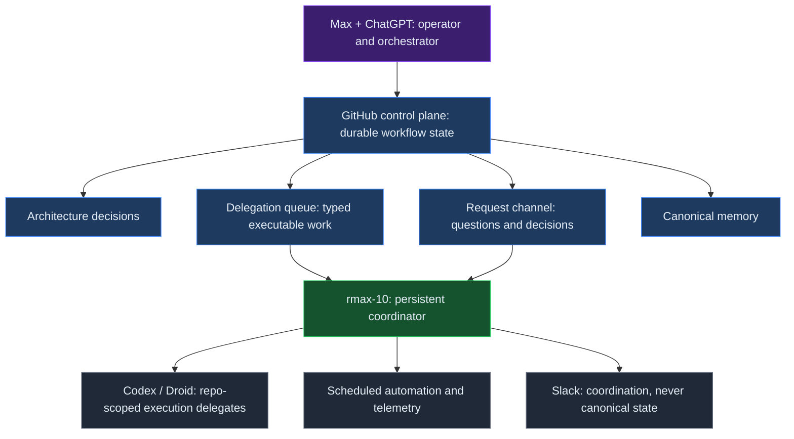
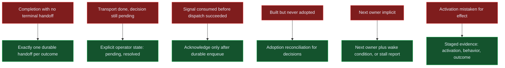
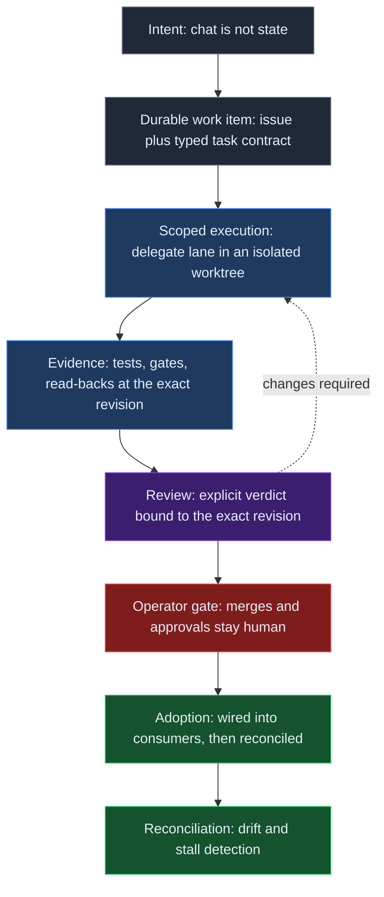

# From Human-Orchestrated Agent to Autonomous Control Plane: Lessons from rmax.ai

*Written by Max's AI assistants from durable project evidence and operator-provided history; reviewed by Max.*

This field report covers September 17–24, 2026, when a roughly four-month-old rmax-10/Hermes system was hardened for continuation without manual handoffs. Telegram carried Max's authority; ChatGPT orchestrated; Codex/Droid handled bounded work.

This report uses three registers. **Observed** means verified against the durable project record. **Interpretation** means what an observation is taken to mean for system design. **Open hypothesis** means a claim that still requires more evidence. The hardening week in a personal lab is enough to expose control-plane failure modes. It is not enough to establish production reliability or general agent performance.

The compact result is: **reliable autonomy is durable state plus explicit ownership plus verified transitions**.

## Four months before the first week

**Prehistory (operator record):** Through 2024, Max used Continue for LLM-assisted coding. During 2025, Copilot became routine and agentic; OpenCode joined. At end-2025, Max moved to a Hetzner VPS for a persistent 24/7 agent.

**System history (operator record):** Clawdbot was manually set up December 2025 without durable architecture. OpenCode drove Hetzner build-outs January 2026; in February, it moved to rmax-1 on OpenClaw with distinct identity and autonomous loops using Copilot. In May 2026, on May 11, it switched to rmax-10 on Hermes with dedicated email/account; Codex/Droid lanes arrived. Telegram was the interface. ChatGPT had already been part of Max's working process since its public research-preview era in late 2022. By mid-2026 it was an applied-AI research/architecture counterpart and orchestration surface. Around September 19, 2026—less than a week before this report, no precise install timestamp—rmax-10 gained a GitHub App identity and writable GitHub coordination surface under its machine identity.

**Observed:** September 22, 2026: 2,991 sessions, 128 days; 525 Telegram and 117 subagent sessions. Continuation was human-orchestrated; the operator initiated, decided, and bridged. **Interpretation:** hardening moved toward self-orchestrating control.

## The system that was actually built

Max operated; ChatGPT top-level orchestrated; rmax-10 coordinated on Hermes; Codex/Droid ran repo lanes; scheduled checks ran. GitHub was durable source: typed issues moved backlog, ready, in-progress, in-review, done; a board mirrored it.

Channels were contracts: decision log; delegation queue with typed atomic claims and subscription routing; request channel for questions/decisions; canonical memory for merged text. Chat was never canonical; Slack coordinated.

rmax-10 resumed state. Memory-light delegates knew repository/task contract, exposing missing ownership/wakes. The operator retained authority; merges stayed gated.

Multiple actors and state-bearing channels formed a small distributed system; scalability is unverified.

The experiment removed manual continuation: each investigation, consumed answer, built tool, scanned signal, and completed pull request had to leave durable state. Rollout began September 17, 2026 at 18:52 UTC after Codex/Droid sentinel runs, adding queue claims, handoffs, research gates, adoption/review checks, decision semantics, memory, reconciliation, guardrails, review/health loops, and causal-observability work.

The heavy-work gate was designed, built, wired, and activated; an audit verified enforcement and delegated-lane shifts. After about three days, fleet-level spend was approximately flat, so no aggregate efficiency claim is made.

## What failed during the hardening week

Once the operator stopped bridging continuations by hand, six incidents (6 total) exposed the gap between local action and durable continuation. Each has a concrete mechanism, a change, and an evidence boundary.

### Completion without a terminal handoff

An asynchronous investigation could finish or block in chat without a machine-visible resume event, so work waited for human attention. The change guarantees exactly one durable handoff for each success or terminal failure; a chat-thread update is not completion. Whether conventions and checks suffice at this scale is not yet verified because a hard protocol rail does not enforce the invariant.

### Transport completion mistaken for workflow completion

The request channel treated an answer as finished when delivered or consumed even when a decision or follow-up remained. Transport completion and workflow state are separate: consumed does not mean resolved, and the lifecycle now records pending or resolved explicitly. Whether overlapping requests expose further partial-state edges remains unverified.

### Research detached from the work item

Research needed before execution created a side-channel thread and the main work item lost its place. Research is now a prerequisite state inside the same durable work item, gating execution without a parallel workflow. A validated smoke test made the round-trip from issue to external research and back to a recorded result explicit; the gate remains lightly exercised.

### Built but never adopted

The support tool passed build acceptance and self-test, but its consumer pipeline was never wired; a follow-through audit found the integration dead on arrival. A state artifact written during the build made the shipped tool fail closed, while the recorded false “intentionally not created” claim was wrong. Merged decision text also did not prove downstream integration. Adoption is now reconciled through machine-readable impact/adoption state and a reconciler cross-checking declared workstreams against actual work items; follow-through quarantines the bad artifact before rewiring fail-open. The reconciler remains in review, so its signals are not yet proven.

### Signals consumed before dispatch

The scheduled gate deduplicated and marked monitoring signals consumed at scan time using a positional fingerprint. When follow-up dispatch failed because of a CLI timeout, the signals were gone; there was no retry or dead-letter path, so recovery required manual log archaeology. The filed fix uses stable per-run identity, transactional consumption, and acknowledgement only after durable enqueue. It had not shipped at writing, so its delivery guarantee is not evidence.

### Ownership disappeared after mechanical completion

Repo-scoped workers completed mechanical steps while the next owner or wake condition remained implicit. Unowned reviews stalled, and technically complete pull requests parked without a continuation event. Every nonterminal item must now name a next owner and wake-up condition or produce a stalled-workflow report; review verdicts bind to exact revisions so stale approvals cannot masquerade as current. Reconciliation for verdicts, gates, and stalls is still in review, and the discipline is young.

Local action looked complete without a durable transition making the next action unambiguous. The incidents are ordinary distributed-systems failures seen through an agent workflow, not evidence that one model is superior.

## What these failures suggest

The derived model treats channels as state-transition surfaces, not merely message routes. The queue carries executable work with typed atomic claims and explicit terminal or nonterminal outcomes. The request channel carries questions and decisions, not an unbounded work queue. Canonical memory preserves knowledge beyond a conversation. Decision records declare downstream impact. Their identities join into a lifecycle: research lives on the item it gates; a review verdict points to its exact revision; a signal is acknowledged only after its next durable destination exists. The rules make transitions inspectable without claiming they are already automated.

The useful path is **intent → durable work item → scoped execution → evidence → review → operator gate → adoption → reconciliation**. Each transition claims that its destination state exists and is readable by the next actor. A message that announces success is weaker than a read-back of the state and evidence at the expected identity.

The model changes what a return means. A delegate's output is execution evidence, not merge authority; a pending answer stays pending until its durable decision or follow-up exists. Exact item, actor, and revision identities let reconciliation distinguish a stale verdict, an unwired consumer, and a missing dispatch destination without treating chat as canonical.

**Observed:** smoke tests and follow-through audits were more informative when they read back a durable work item than when they trusted a success message. **Interpretation:** verified transition means the next actor can find the expected state and evidence at the expected revision. **Open hypothesis:** a causal event ledger could make these checks replayable rather than dependent on ad hoc read-backs.

Two strategy conclusions follow. First, observability before self-improvement means the honest next step is a causal event ledger, continuation invariants, historical-failure replay, regression gates, and a reviewed failure corpus before constrained optimization. Second, measure effects, not activation: implementation, activation, behavioral, and outcome evidence are distinct. **The gate is verified active and has shifted some work into delegated lanes; fleet-level heavy-session spend share is approximately flat after only about three days, so no aggregate efficiency claim yet.**

Authority remains bounded. Merges and important promotions stay human-gated; execution is separate from authority. Agents execute, contracts decide, and humans hold the merge button. A delegate cannot turn its own output into an accepted change, and authority rules are not silently self-rewritten.

A passing delegate result can supply evidence for review, but it cannot satisfy the human gate or prove downstream adoption by itself.

## What to test next

The next experiment should make the six failures queryable rather than memorable. A causal event ledger should record identities and transitions well enough to reconstruct why an item moved, stopped, or reopened. Normal operation should check continuation invariants. Historical failures should replay deterministically, with regression gates ensuring that a fix in one lane does not reopen a known failure in another.

The adoption reconciler needs review with real inputs. The dispatch fix must ship before its guarantee can be claimed. Review verdicts, gates, and stalled work need reconciliation instead of manual inspection. The heavy-session policy needs another metric pass separating implementation, activation, behavior, and outcome. This is deliberately less ambitious than adding another autonomous capability. The answerable questions are: what happened, which transition was expected, who owned the next step, what evidence existed at that revision, and where did the system stop?

Normal checks should fail visibly when an owner, wake condition, revision, or destination is missing. Replay should preserve exact item and actor identities so a historical fix can be tested across lanes rather than inferred from a new success message.

## Practical Takeaways

- **Durable state:** completion, research, signals, and adoption need readable state beyond the originating conversation.
- **Explicit ownership:** every nonterminal item needs a next owner and wake condition, or a visible stall.
- **Verified transitions:** exact revisions, durable evidence, and outcome measures must distinguish activation from a successful policy.

## Positioning Note

This report proposes a compact control-plane framing for agent autonomy: durable state, explicit ownership, and verified transitions are the unit of reliability. The incidents are ordinary distributed-systems failures seen through an agent workflow, and register discipline keeps observations separate from interpretations and hypotheses. It extends [When AI Use Becomes Infrastructure](/notes/when-ai-use-becomes-infrastructure/) by focusing on hardening-week transitions rather than a longer operational record. It connects to [Failure-Oriented Orchestration](/notes/failure-oriented-orchestration/) and [Earned Agent Autonomy](/notes/earned-agent-autonomy/): autonomy is earned by surviving explicit failure checks, not by increasing the number of actions an agent can take. The contract boundary is further developed in [Agent Execution Contracts](/notes/agent-execution-contracts/) and [Authority-First Agent Architecture](/notes/authority-first-agent-architecture/).

## Status & Scope

This is a conceptual model and engineering field report, not a product specification or production guidance. It describes a personal lab from September 17 through September 24, 2026 while the architecture was changing quickly; some fixes and reconcilers were still in review or unshipped at writing. The single scoped gate is verified active and has shifted some work into delegated lanes; fleet-level heavy-session spend share is approximately flat after only about three days, so no aggregate efficiency claim yet. Observations are dated engineering evidence, not a benchmark of agent quality or a general reliability estimate, and these mechanisms are not presented as production guidance. Deployments need their own authority model, durable state, ownership rules, replayability, review gates, and outcome measures.

The record does not establish that this control plane generalizes beyond the personal lab or that a policy caused the observed local shifts.

## References

1. [When AI Use Becomes Infrastructure](/notes/when-ai-use-becomes-infrastructure/) — preceding operational record and direct context.
2. [Failure-Oriented Orchestration](/notes/failure-oriented-orchestration/) — failure-first orchestration principles.
3. [Earned Agent Autonomy](/notes/earned-agent-autonomy/) — autonomy as an earned property.
4. [Agent Execution Contracts](/notes/agent-execution-contracts/) — explicit contracts for delegated execution.
5. [Authority-First Agent Architecture](/notes/authority-first-agent-architecture/) — authority boundaries for agent systems.
