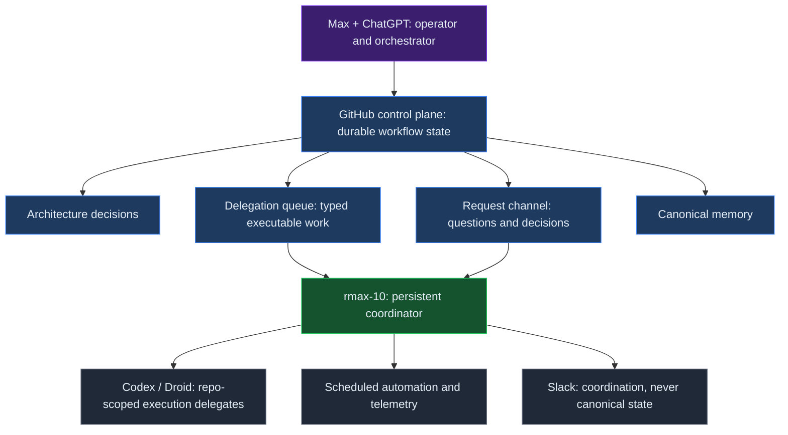
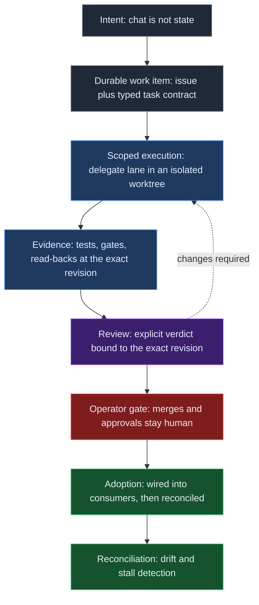
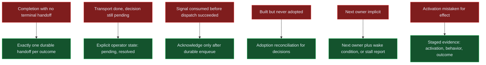

# From Human-Orchestrated Agent to Autonomous Control Plane: Lessons from rmax.ai

*Written by Max's AI assistants from durable project evidence and operator-provided history; reviewed by Max.*

This report covers the autonomy and control-plane hardening week from September 17 through September 24, 2026, after roughly four months in which rmax-10 and Hermes operated as a human-orchestrated system: Max directed it through Telegram, while bounded heavier implementation went to Codex or Droid. In mid-September, the transition to guarded self-orchestration moved routine continuation decisions into durable control-plane state while human authority over consequential actions remained. The question is what failed when work had to continue across agents, repositories, review states, human decisions, failures, and restarts—not whether an agent could act.

The central observation is simple: **reliable autonomy is durable state plus explicit ownership plus verified transitions**. Making an agent act was not difficult; durable state had to keep the next correct action findable after a session ended, a delegate returned, an answer was consumed, or an integration appeared complete.

This report uses three registers. **Observed** means verified against the durable project record. **Interpretation** means what an observation is taken to mean for system design. **Open hypothesis** means a claim that still requires more evidence. The hardening week in a personal lab is enough to expose control-plane failure modes. It is not enough to establish production reliability or general agent performance.

## Four months before the first week

**Prehistory (operator record):** Through 2024, Max used the VS Code Continue extension for interactive, developer-driven LLM-assisted coding inside the editor. During 2025, GitHub Copilot became routine for work and personal projects—increasingly as a coding agent rather than only autocomplete or chat—and OpenCode later joined the daily coding-agent workflow. At the end of 2025, Max deliberately went all-in on a 24/7 remote agent; moving to a Hetzner VPS began the persistent autonomous-agent-system experiment: a continuously available runtime that held operational state, received work asynchronously, and increasingly delegated to other agents.

**System history (operator record):** Clawdbot was manually set up in December 2025 without the durable control-plane architecture that came later. In February 2026 it migrated to rmax-1 on OpenClaw and gained its own account identity, distinct from Max's. OpenCode drove the Hetzner build-outs from January 2026 and the first autonomous project loops in February, with GitHub Copilot as an early provider path. In May 2026 it migrated to rmax-10 on Hermes with a dedicated email/account identity; this generational switch was May 11, 2026, around when Codex and Droid delegation lanes arrived. Telegram remained the primary operator interface: Max directed rmax-10 in conversation, it investigated and acted, and bounded heavier implementation went to Codex or Droid. This was the roughly four-month operating period. ChatGPT had already been part of Max's working process since its public research-preview era in late 2022. Over time, its role evolved from an interactive thinking and coding partner to a regular applied-AI research and architecture counterpart; by mid-2026, project records gave dense evidence of sustained applied-AI research use, and it became an orchestration surface around the persistent remote agent system. Around September 19, 2026—less than a week before this report, with no precise install timestamp—rmax-10 gained a GitHub App identity, marking guarded autonomy and a GitHub coordination surface writable under its machine identity.

**Observed:** Runtime evidence measured on September 22, 2026 recorded 2,991 sessions spanning 128 days, including 525 Telegram sessions and 117 subagent sessions. The earlier phase was already agentic and delegated, but continuation was human-orchestrated: the operator initiated work, watched progress, decided what came next, and bridged continuation points by hand. **Interpretation:** the system was becoming an increasingly self-orchestrating, guarded control plane.

**Interpretation:** Controlled rollout of the delegation queue began on the evening of September 17, 2026 at 18:52 UTC, after successful Codex and Droid sentinel runs. The week added durable queue state, terminal handoffs, explicit operator-decision semantics, system memory, reconciliation, guardrails, scheduled review and health loops, adoption checks, and causal-observability work.

The hardening week treated that working personal-agent setup as an explicit autonomous system, adding queues, durable handoffs, typed state, reconciliation, guardrails, observability, and review gates so work could continue without manual shepherding.

## The system that was actually built

The system pairs a human operator with ChatGPT as top-level orchestrator. A GitHub-based control plane carries durable workflow state; persistent coordinator rmax-10 runs on Hermes; Codex and Droid are repo-scoped execution delegates; scheduled automation runs recurring checks and telemetry.

GitHub is the durable source of workflow state. Issues carry typed task contracts through backlog, ready, in-progress, in-review, and done; a project board mirrors that lifecycle for inspection. The key property is that state survives a session boundary and can be read by another actor.

The channels have distinct purposes: an architecture decision log records decisions that should influence later work; a delegation queue carries typed executable work with atomic claims and subscription-lane routing; a request channel carries asynchronous questions and decisions; a canonical memory repository stores merged text on its main branch. Chat is never canonical, and Slack coordinates without being workflow truth.

rmax-10 carries the control-plane role and resumes from durable state; Codex and Droid are memory-light, knowing their checked-out repository and task contract. That constraint makes handoffs explicit and exposes missing ownership or wake conditions.

The result is a small distributed system: the operator supplies authority and review; the control plane, coordinator, delegates, and scheduled jobs supply durable state, continuation, scoped execution, and recurring observation. Merges and important promotion decisions remain human-gated.

**Observed:** the architecture already had more than one actor and more than one state-bearing channel, even though the system was personal and small. **Interpretation:** autonomy increases the need to define which state is authoritative, which actor owns the next transition, and what evidence permits that transition. **Open hypothesis:** this separation will remain sufficient as the number of delegated work items and scheduled checks grows.

## What failed during the hardening week

Once the operator stopped bridging continuations by hand, hardening exposed gaps between local action and the durable evidence another actor needed to continue. Each failure led to a concrete change, though several remain conventions, proposals, or work in review.

### Completion without a terminal handoff

**Observed:** an asynchronous investigation could finish or block in chat without a guaranteed machine-visible resume event; work sat until a human noticed. **Changed:** every asynchronous investigation now ends with exactly one durable handoff on success or terminal failure; a chat-thread update alone is not completion. **Open hypothesis:** conventions and checks may suffice for a small system, but a hard protocol rail does not yet enforce the invariant.

### Transport completion mistaken for workflow completion

**Observed:** the request channel treated an answer as finished when delivered or consumed, although some consumed answers still carried a pending decision or follow-up. **Changed:** transport and workflow state are separate; consuming an answer does not resolve a thread that still needs an operator decision or follow-up, whose lifecycle is explicitly pending or resolved. **Open hypothesis:** overlapping requests may expose more partial-state edge cases.

### Research detached from the work item

**Observed:** external research needed before execution created side-channel threads where the main work item lost its place. **Changed:** research is a prerequisite state inside the same durable work item, gating execution without a parallel workflow; a smoke test validated the round-trip from issue to external research and back to a recorded result. **Open hypothesis:** the gate is defined but lightly exercised.

### Built but never adopted

**Observed:** a support tool passed its build acceptance and self-test, but its consumer pipeline was never wired. A follow-through audit found the integration dead on arrival. A state artifact written during the build made the shipped tool fail closed, and a recorded claim that the live store was intentionally not created at build time was false. A separate architecture audit showed that merged decision text also did not prove downstream integration.

**Changed:** adoption is now treated as a reconciliation problem. Decision records carry machine-readable impact and adoption state, and a reconciler cross-checks declared workstreams against actual work items. Follow-through verification became its own pass: quarantine the bad artifact, then rewire fail-open. **Open hypothesis:** the reconciler is still in review, and adoption signals are only as good as their inputs.

### Signals consumed before dispatch

**Observed:** a scheduled gate deduplicated and marked monitoring signals as consumed at scan time using a positional fingerprint. When follow-up dispatch failed because of a CLI timeout, the signals were gone. There was no retry or dead-letter path; recovery required manual archaeology through logs. **Changed:** the defect was filed with a concrete fix direction: consume by stable per-run identity, make consumption transactional, and acknowledge only after durable enqueue. **Open hypothesis:** the fix had not shipped at the time of writing, so the desired delivery guarantee is not yet evidence.

### Ownership disappeared after mechanical completion

**Observed:** repo-scoped workers completed mechanical steps while the next owner or wake condition remained implicit. Reviews nobody owned stalled silently, and technically complete pull requests parked without a clear continuation event. **Changed:** every nonterminal item must carry an explicit next owner and wake-up condition, or the system must report a stalled workflow. Review verdicts are bound to exact revisions so stale approvals cannot masquerade as current. **Open hypothesis:** reconciliation for review verdicts, gates, and stalls is being built, and the discipline is young.

Across incidents, local action looked complete without a durable transition making the next action unambiguous. A control plane therefore needs state, ownership, and evidence semantics—not only an execution queue.

## The architecture that emerged

The first design treated channels as message routes; the more useful design treats them as state-transition surfaces with different contracts.

The delegation queue carries executable work: tasks are typed for atomic claims, scoped for delegates, and explicit about terminal or nonterminal outcomes. The request channel carries questions and decisions, not an unbounded work queue; delivery is not resolution. Canonical memory preserves knowledge beyond its originating conversation, while the architecture decision log records decisions whose downstream impact must be observable.

The control plane joins channels through work-item identity and explicit lifecycle state: research lives on the item it gates; a review verdict points to its exact revision; a decision record declares expected impact; a scheduled signal is acknowledged only after its next durable destination exists. The rules make transitions inspectable without claiming they are already automated.

The path is not “agent receives an instruction and returns a result,” but intent, durable work item, scoped execution, evidence, review, operator gate, adoption, and reconciliation. Each arrow claims that its destination state exists and is readable by the next actor.

**Observed:** smoke tests and follow-through audits were more informative when they read back the durable work item rather than trusting a message that announced success. **Interpretation:** a transition is verified only when the next actor can find the expected state and evidence at the expected identity. **Open hypothesis:** a causal event ledger could make these checks replayable rather than dependent on ad hoc read-backs.

## Eight lessons

The six incidents show visible hardening failures; two strategy failures broaden them: improving a system that cannot yet be replayed and mistaking activation for effect.

### 1. Completion needs a terminal handoff

The durable handoff is a protocol boundary, not a courtesy message: exactly one success or terminal-failure event distinguishes “nothing happened” from “the work ended.” **Observed:** missing handoffs caused waiting. **Interpretation:** continuation must be state. **Open hypothesis:** more actors may require a hard protocol.

### 2. Transport state is not workflow state

Delivered, consumed, pending, and resolved describe different things. Collapsing them made the request channel report completion too early. **Observed:** consumed answers still required decisions or follow-up. **Interpretation:** transport acknowledgements should not close a workflow. **Open hypothesis:** partial-state reconciliation is a separate capability, not a cleanup detail.

### 3. Research is a prerequisite state

Research that gates execution belongs inside the work item's lifecycle. **Observed:** side-channel research disconnected the result from the work it was meant to unblock. **Interpretation:** prerequisites should be durable and local to the item they constrain. **Open hypothesis:** the model will hold for other external dependencies, including human approvals and data collection.

### 4. “Built” is not “adopted”

Build acceptance proves that an artifact can pass its local checks. It does not prove that consumers are wired, that the intended decision has downstream impact, or that the shipped artifact opens the expected path. **Observed:** a support tool passed build checks but failed in its consumer pipeline. **Interpretation:** adoption requires a separate reconciliation pass. **Open hypothesis:** machine-readable impact declarations can become a reliable leading signal only after the reconciler and its inputs are reviewed.

### 5. Never consume a signal before durable dispatch

Deduplication is not delivery. **Observed:** scan-time consumption erased signals when dispatch timed out. **Interpretation:** acknowledgement belongs after durable enqueue, with stable identity and a retry or dead-letter path. **Open hypothesis:** the proposed transactional boundary will cover every failure between scanning and dispatch.

### 6. Autonomous execution still needs ownership and review semantics

Memory-light delegates make contracts valuable, but an explicit contract must name who acts next and what wakes them. **Observed:** mechanical work completed while review ownership was implicit. **Interpretation:** every nonterminal state needs a next owner and wake condition, or a visible stall. Exact-revision verdicts prevent stale approvals from silently passing. **Open hypothesis:** reconciliation can detect enough drift to make silent stalls rare rather than merely easier to diagnose.

### 7. Observability comes before self-improvement

The honest next step after the hardening week was replayability, not more autonomy. **Observed:** failures could be described, but consistent causal history was unavailable for deterministic replay. **Interpretation:** build a causal event ledger, continuation invariants, historical-failure replay, regression gates, and a reviewed failure corpus before constrained optimization. **Open hypothesis:** an optimizer can improve the control plane safely only when evaluated against that corpus inside the human-gated authority boundary.

### 8. Measure effects, not activation

An enforcement gate was designed, built, wired, and activated during the week to steer heavy in-session work into delegated lanes. An audit a few days later verified live enforcement: real block decisions across multiple sessions, with some work visibly shifting into delegated lanes within minutes. Fleet-level heavy-session spend share was approximately flat relative to baseline after only about three days of post-activation data.

The working distinction is now four-part: implementation evidence, activation evidence, behavioral evidence, and outcome evidence. **Observed:** the gate is active and behavior shifted in some cases, while the fleet-level outcome was not yet distinguishable from baseline. **Interpretation:** a deployed guard is not automatically a successful policy. **Open hypothesis:** the planned metric re-run will determine whether the policy changes the aggregate outcome. No aggregate efficiency claim is made.

**The gate is verified active and has shifted some work into delegated lanes; fleet-level heavy-session spend share is approximately flat after only about three days, so no aggregate efficiency claim yet.**

The hardening-week failure modes map to concrete mechanisms rather than to a vague request for “more autonomy.” A handoff addresses waiting. Explicit operator state addresses premature closure. Post-enqueue acknowledgement addresses signal loss. Adoption reconciliation addresses dead-on-arrival integrations. Ownership plus wake conditions address silent stalls. Staged evidence addresses the difference between a live gate and a useful gate.

## What was deliberately not automated

The control plane is autonomous by design, but its authority is bounded. Merges remain human-gated. Important promotions remain human-gated. Acceptance authority remains human or review-gated. Broad self-modification is out of scope.

This boundary is not a concession that makes the rest of the system less autonomous. It separates execution from authority. Agents execute. Contracts decide. Humans refine the contracts and hold the merge button. A delegate can implement a scoped change and provide evidence; it cannot turn its own output into an accepted change merely because a local check passed.

The same boundary applies to the control plane itself. A proposal to improve routing, reconciliation, or continuation should be evaluated against recorded failures and explicit invariants. It should not silently rewrite the rules that determine its own authority. This is why observability precedes self-improvement: without a replayable record, an apparently beneficial change can erase the evidence needed to understand its side effects.

## Week two

Week two starts with trajectory queryability: the hardening week's lessons must become queryable rather than memorable. A causal event ledger should record the identities and transitions needed to reconstruct why an item moved, stopped, or reopened; continuation invariants should be checked in normal operation; historical failures should be replayed deterministically, with regression gates preventing a fix in one lane from reopening a known failure in another.

The adoption reconciler needs review and real inputs. The dispatch fix needs to ship before its guarantee can be claimed. Review verdicts, gates, and stalled work need reconciliation rather than manual inspection. The heavy-session policy needs another measurement pass that separates implementation, activation, behavior, and outcome evidence.

This is deliberately less ambitious than adding another autonomous capability. The immediate objective is to answer what happened, which transition was expected, who owned the next step, what evidence existed at that revision, and where the system stopped. Once that record exists, constrained improvement becomes an engineering activity instead of a confidence exercise.

## Practical Takeaways

- **Make completion durable:** require exactly one terminal handoff for every asynchronous success or terminal failure.
- **Separate state types:** delivery and consumption do not resolve a workflow when an operator decision or follow-up remains.
- **Keep prerequisites in the item:** research and other gates should block the durable work item, not fork an untracked side workflow.
- **Verify adoption:** local build success and merged decision text are not proof that a consumer is wired.
- **Acknowledge after dispatch:** stable identity, transactional consumption, and retry or dead-letter behavior belong at the signal boundary.
- **Name the next owner:** every nonterminal item needs a next owner and wake condition, or an explicit stalled-workflow report.
- **Measure the outcome:** activation and observed behavior are evidence, but they are not an aggregate efficiency result.

## Positioning Note

This report's proposed contribution is a compact control-plane framing for agent autonomy: durable state, explicit ownership, and verified transitions are the unit of reliability. The incidents are ordinary distributed-systems failures seen through an agent workflow, not evidence that one agent model is superior. The practical novelty is the insistence on keeping observed facts, interpretations, and open hypotheses separate while tracing each failure to a mechanism and a verification boundary.

The report extends the operational thread in [When AI Use Becomes Infrastructure](/notes/when-ai-use-becomes-infrastructure/) by focusing on hardening-week control-plane transitions rather than a longer operational record. It also connects to [Failure-Oriented Orchestration](/notes/failure-oriented-orchestration/) and [Earned Agent Autonomy](/notes/earned-agent-autonomy/): autonomy is earned by surviving explicit failure checks, not by increasing the number of actions an agent can take. The contract boundary is further developed in [Agent Execution Contracts](/notes/agent-execution-contracts/) and [Authority-First Agent Architecture](/notes/authority-first-agent-architecture/).

## Status & Scope

This is a conceptual model and engineering field report, not a product specification and not production guidance. It describes the hardening week in a personal lab, from September 17 through September 24, 2026, while the architecture was changing quickly. Some fixes and reconcilers were still in review or had not shipped when this report was written. The public evidence is limited to one scoped statement: the gate is verified active and has shifted some work into delegated lanes; fleet-level heavy-session spend share is approximately flat after only about three days, so no aggregate efficiency claim yet.

The report includes no benchmark of agent quality, no general reliability estimate, and no claim that these mechanisms are sufficient for a production system. Treat the observations as dated engineering evidence and the interpretations as hypotheses to test. Any deployment should establish its own authority model, durable state, ownership rules, replayability, review gates, and outcome measures.

## References

1. [When AI Use Becomes Infrastructure](/notes/when-ai-use-becomes-infrastructure/) — preceding operational record and direct context.
2. [Failure-Oriented Orchestration](/notes/failure-oriented-orchestration/) — failure-first orchestration principles.
3. [Earned Agent Autonomy](/notes/earned-agent-autonomy/) — autonomy as an earned property.
4. [Agent Execution Contracts](/notes/agent-execution-contracts/) — explicit contracts for delegated execution.
5. [Authority-First Agent Architecture](/notes/authority-first-agent-architecture/) — authority boundaries for agent systems.
