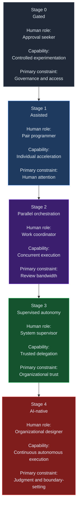
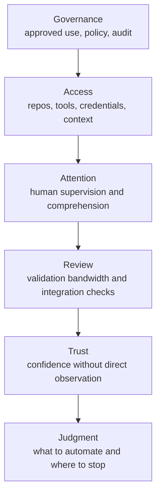
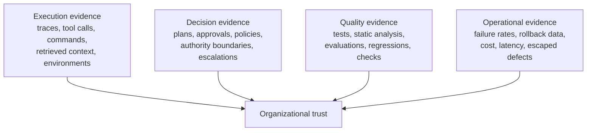

# The Organizational Stages of AI Adoption

## Abstract

AI adoption in engineering is often framed as a story about model capability. The more durable constraint, however, is organizational: how much responsibility a team can safely delegate to an autonomous system. This note argues that the shift from AI-assisted coding to AI-native engineering depends less on model gains than on five organizational changes: governance, access, review capacity, trust, and operational evidence. The practical implication is straightforward: model improvements matter, but throughput gains stall unless the surrounding organization can validate, supervise, and learn from delegated work.

## Core Thesis

The organizational stages of AI adoption are stages of delegated responsibility.

Each stage increases the amount of work transferred to agents. Each stage also changes the engineer's role and exposes a new non-model constraint:

- governance enables access
- access exposes attention limits
- parallel execution exposes review bandwidth limits
- automated verification exposes the need for organizational trust
- once trust is established, the remaining constraint is judgment: what should be automated, under what boundaries, and with what evidence

Viewed this way, AI adoption is less about adding a smarter assistant and more about redesigning the system around delegated work.

## Context and Motivation

Over the past two years, coding agents have become materially more capable. They can inspect repositories, edit multiple files, run tests, search documentation, call tools, and continue working across bounded tasks that previously required sustained human attention.

Yet many engineering organizations are seeing a mismatch.

Model capability is improving quickly. Organizational throughput is not improving at the same rate.

The main question is no longer whether an AI system can produce useful engineering work. The harder question is whether an organization can expose the right context, permissions, validation, and accountability structures to let that work happen safely.

[Anthropic's Steps of AI Adoption](https://claude.ai/code/artifact/bfdfaef9-bc62-4dfe-ba9e-c58a26c9accf#no_universal_links), introduced by Boris Cherny ([@bcherny](https://x.com/bcherny/status/2077929379661844559)) in July 2026, is useful here not as a tool taxonomy, but as a delegation model.

## Mechanism and Model

The mechanism is simple. As generation becomes cheaper, other parts of the delivery system become relatively more expensive.

A developer using an AI agent still needs repository access, documentation, credentials, test environments, policy boundaries, and an approved path to ship the result. Generated changes still need to be reviewed, validated, merged, deployed, and monitored. Someone still owns the outcome.

This is why local acceleration does not automatically become system-level throughput.

An agent can produce an implementation in minutes, but the organization may still hold it for hours or days while reviewers check permissions, integrations, approvals, and risk.

The five stages below describe that progression.

### Stage 0: Gated

At Stage 0, the organization is still deciding whether AI use is acceptable and under what terms.

The dominant concerns are security, procurement, compliance, and auditability. Standards like the [NIST AI Risk Management Framework](https://www.nist.gov/itl/ai-risk-management-framework) reflect the organizational gravity of these concerns.

Developers may have access to approved chat tools or lightweight internal gateways, but they usually do not yet have broad authority to run agents against production repositories, internal systems, or sensitive environments.

The constraint is not model intelligence.

It is the absence of a governed path from experimentation to production use.

### Stage 1: Assisted

At Stage 1, one engineer works with one agent. The engineer frames the task, monitors the session, inspects most outputs, and remains directly responsible for the change.

This is where many organizations currently operate.

The gains can be real. The Microsoft study [Adoption and Impact of Command-Line AI Coding Agents](https://arxiv.org/abs/2607.01418) estimated that adopters merged roughly 24 percent more pull requests than they otherwise would have during an early-2026 rollout across a large engineering population.

That result matters, but so does its limit.

A merged pull request is only an output proxy. It does not tell you whether the change increased defect rates, triggered rollbacks, or raised maintenance cost.

At this stage, the main bottleneck is human attention.

Code generation becomes cheap. Code comprehension does not.

Research on developer productivity reinforces this distinction. [Beyond the Commit](https://arxiv.org/abs/2602.03593) found that developers often report high satisfaction with AI coding assistants while realizing only modest time savings, and that productivity includes cognitive load, self-sufficiency, ownership, expertise development, and long-term maintainability—not only output volume.

### Stage 2: Parallel Orchestration

Stage 2 changes the unit of work.

Instead of one human synchronously driving one assistant, the engineer decomposes a larger objective into independent tracks and delegates them concurrently.

One agent explores the repository. Another implements a change. Another updates tests. Another performs review or validation.

Isolated worktrees, remote execution environments, and automated checks become important because concurrency without isolation creates avoidable conflicts.

The architectural analysis [Dive into Claude Code](https://arxiv.org/abs/2604.14228) reaches a similar conclusion: the core model loop is relatively small, while most of the system concerns permissions, context management, extensibility, session state, delegation, and isolation.

The engineer increasingly reviews completed proposals instead of watching every intermediate step. The new bottleneck is review bandwidth. Faster execution can flood reviewers with more pull requests, test runs, and diffs than they can confidently clear.

### Stage 3: Supervised Autonomy

Stage 3 is the first qualitative shift.

Humans no longer initiate every unit of work.

Agents begin handling bounded categories of recurring tasks with less direct prompting. Typical examples include dependency updates, documentation repair, routine maintenance, flaky-test investigation, and policy-constrained migrations.

The human role shifts from task supervisor to system supervisor.

When failures happen, the relevant question changes. It is less often, "Which line is wrong?" It is more often, "Which context did we omit, which policy did we fail to encode, or which approval boundary did we leave undefined?"

At this stage, organizational trust becomes the primary constraint.

### Stage 4: AI-Native

At Stage 4, the organization runs software delivery through tightly scoped automated workflows with human escalation points. Humans set objectives, priorities, risk tolerances, and escalation boundaries. Agents discover or receive work, coordinate execution, validate results, and surface exceptions.

The scarce resource is no longer implementation capacity. It is judgment.

Teams need to decide which work is worth automating, which evidence is sufficient, and where direct human accountability must remain in the loop.

## Constraint Progression

The stages are cumulative.

Solving one constraint reveals the next.

This progression matters operationally because teams often misread the bottleneck. If governance is unresolved, better models do not help much. If review is overloaded, more agents can make throughput worse. If trust is weak, autonomy does not scale even when test automation is strong.

## Evidence as the Scaling Mechanism

The transition from Stage 2 to Stage 3 is where many programs stall.

The reason is simple: human observation does not scale.

A person can inspect one pull request line by line. A person cannot continuously inspect hundreds of agent executions across multiple repositories and services.

So the organization needs something stronger than visibility.

It needs evidence.

Evidence is what lets a team trust delegated execution without relying on constant direct observation.

This is broader than test passing. Verification answers a narrow question: did this change pass the available checks? Evidence answers a broader question: why should the organization trust this run, and what reason does it have to trust the next similar run?

This distinction matters because green checks are not automatically independent confirmation.

Tests may be weak. Generated tests may share the same mistaken assumptions as the implementation. Operational dashboards may look healthy while hiding narrow coverage or blind spots.

For autonomy to scale, evidence needs provenance, coverage, and enough independence to be decision-useful.

## The Engineer's Role Evolution

The role of the engineer changes with the system. In traditional software work, engineers do the task directly. In AI-native software work, engineers design the workflow, set the guardrails, and supervise the results.

```mermaid
flowchart TD
    subgraph T["Traditional loop"]
        T1["Understand task"] --> T2["Implement change"]
        T2 --> T3["Review and revise"]
        T3 --> T4["Deploy and monitor"]
    end

    subgraph A["AI-native higher-order loop"]
        A1["Design execution system"] --> A2["Specify intent and acceptance criteria"]
        A2 --> A3["Define permissions and guardrails"]
        A3 --> A4["Automate verification and evidence collection"]
        A4 --> A5["Monitor outcomes and exceptions"]
        A5 --> A6["Update context, policies, and evaluations"]
    end
```

This does not remove the engineer. It changes the leverage point.

A reusable evaluation harness, repository-specific policy, access boundary, context provider, or escalation rule may improve every future execution more than a single manual implementation would.

In that sense, the engineer becomes partly responsible for the conditions under which software is produced, not only for the software artifact itself.

## Concrete Examples

### Example 1: Individual acceleration is real, but bounded

The Microsoft rollout study [Adoption and Impact of Command-Line AI Coding Agents](https://arxiv.org/abs/2607.01418) is a useful Stage 1 example. It suggests that command-line agents can measurably increase merged pull-request volume at organizational scale.

That is meaningful evidence that assisted workflows can change output. It is not evidence that the organization has solved review, trust, or operational accountability.

A team can see more merged changes and still remain at Stage 1 if each change depends on close human supervision.

The gain is real. The delegation boundary is still narrow.

### Example 2: A bounded maintenance lane as a Stage 2-to-Stage 3 bridge

A practical transition path is a narrow autonomy lane for repetitive maintenance work.

For example:

- dependency updates within approved version ranges
- documentation repairs tied to failing link or build checks
- flaky-test triage in non-production-critical repositories
- mechanical migrations with strong before-and-after validation

This kind of lane works when the organization defines:

- eligible task classes
- allowed tools and repositories
- required validation steps
- escalation triggers
- rollback or revert paths
- evidence retention

What matters is not that the agent can edit files.

What matters is that the organization can describe the job, constrain the actions, verify the outcome, and inspect failures without ambiguity.

## Trade-offs and Failure Modes

This model is useful, but it does not solve everything.

First, teams may label themselves "AI-native" even when manual review and informal trust still carry most of the load.

Second, stronger automation can increase local output while degrading global quality. If review queues, test quality, or production observability are weak, more agent activity can amplify noise.

Third, evidence systems can produce false confidence. A polished trace is not the same as a justified decision. A green test run is not the same as risk coverage.

Fourth, not all work is equally delegable. Novel architecture, ambiguous product decisions, sensitive migrations, and high-consequence operational changes may require direct human judgment even in advanced organizations.

Fifth, autonomy can centralize hidden risk. If many agents depend on the same poor context, weak policy, or flawed evaluation harness, the error can scale quickly.

This note also does not attempt to solve model benchmarking, procurement strategy, or universal organizational sequencing.

Different teams will move through stages unevenly across repositories and task classes.

## Practical Takeaways

1. Treat AI adoption as a workflow design problem, not only a model selection problem.
2. Identify the current bottleneck explicitly: governance, access, attention, review, trust, or judgment.
3. Build narrow autonomy lanes first, especially for repetitive work with clear validation and rollback paths.
4. Invest early in evidence collection and evaluation quality, not only in generation quality.
5. Measure system flow, not just local output; review effort, escaped defects, rollback quality, and lead time matter more than raw code volume. Research on developer productivity metrics, including the [SPACE framework](https://queue.acm.org/detail.cfm?id=3454124) and [Accelerate](https://itrevolution.com/product/accelerate/), has consistently shown that delivery performance depends on system-level practices—not on individual output alone.

## Industry Convergence

The major AI platforms increasingly reflect this architectural direction.

[OpenAI's Agents SDK](https://platform.openai.com/docs/quickstart) supports tools, handoffs, orchestration logic, guardrails, sessions, and tracing around model calls. [Google's Agent Development Kit and Agents CLI](https://google.github.io/adk-docs/) frame agent development as a lifecycle spanning scaffolding, tools, evaluation, deployment, and observability. [Microsoft Agent Framework](https://learn.microsoft.com/en-us/agent-framework/) distinguishes open-ended agents from explicit graph-based workflows and provides sequential, concurrent, handoff, group-chat, and manager-led orchestration patterns, together with checkpointing and human approval. [Anthropic's Claude Code ecosystem](https://docs.anthropic.com/en/docs/claude-code) emphasizes permissions, worktree isolation, subagents, hooks, context management, and long-running workflows.

These systems differ in implementation, but they point toward the same conclusion: the production abstraction is no longer an isolated prompt. It is a controlled execution system around one or more models.

This also suggests that foundation models will become increasingly interchangeable within larger architectures. Model selection will remain important for capability, latency, and cost, but durable advantage will often come from the surrounding system: context quality, tool design, permissions, evaluation, evidence, workflow ownership, and the ability to learn from failures.

## Positioning Note

This note is not academic research. It does not propose a novel formal theory, controlled experiment, or comprehensive empirical taxonomy.

It is also not a blog-style opinion piece. The claims here are meant to be operational and falsifiable in practice.

It is not vendor documentation either. It is not tied to one product surface or one recommended stack.

The goal is to offer a durable working model for engineers and operators deciding how to structure delegated software work as agent capability improves.

## Status and Scope Disclaimer

This is an applied technical note based on current tooling, public references, and personal lab synthesis.

The framing is exploratory, but it draws on the cited studies, public tooling documentation, and patterns observed in current engineering workflows.

It is not an authoritative standard, a complete maturity model, or a universal implementation guide.

Its intended use is practical orientation: a way to reason about AI adoption as an organizational delegation problem rather than a pure model capability problem.

## References

1. Cherny, Boris — [Steps of AI Adoption](https://claude.ai/code/artifact/bfdfaef9-bc62-4dfe-ba9e-c58a26c9accf#no_universal_links). Introduced as a Claude artifact and [announced on X](https://x.com/bcherny/status/2077929379661844559), July 16, 2026. Boris Cherny is the Head of Claude Code at Anthropic.
2. Liu, Jiacheng; Zhao, Xiaohan; Shang, Xinyi; Shen, Zhiqiang — [Dive into Claude Code: The Design Space of Today's and Future AI Agent Systems](https://arxiv.org/abs/2604.14228). arXiv:2604.14228, 2026.
3. Murphy-Hill, Emerson; Butler, Jenna; Savelieva, Alexandra — [Adoption and Impact of Command-Line AI Coding Agents: A Study of Microsoft's Early 2026 Rollout of Claude Code and GitHub Copilot CLI](https://arxiv.org/abs/2607.01418). arXiv:2607.01418, 2026.
4. Beller, Moritz et al. — [Beyond the Commit: Developer Perspectives on Productivity with AI Coding Assistants](https://arxiv.org/abs/2602.03593). ICSE-SEIP 2026; arXiv:2602.03593.
5. Forsgren, Nicole; Storey, Margaret-Anne; Maddila, Chandra; Zimmermann, Thomas; Houck, Brian; Butler, Jenna — [The SPACE of Developer Productivity: There's More to It Than You Think](https://queue.acm.org/detail.cfm?id=3454124). ACM Queue 19(1), 2021.
6. Forsgren, Nicole; Humble, Jez; Kim, Gene — [Accelerate: The Science of Lean Software and DevOps](https://itrevolution.com/product/accelerate/). IT Revolution, 2018.
7. OpenAI — [Agents SDK and API documentation](https://platform.openai.com/docs/quickstart).
8. Google — [Agent Development Kit and Agents CLI documentation](https://google.github.io/adk-docs/).
9. Microsoft — [Agent Framework documentation: agents, workflows, orchestration, checkpointing, and human-in-the-loop execution](https://learn.microsoft.com/en-us/agent-framework/).
10. NIST — [Artificial Intelligence Risk Management Framework (AI RMF 1.0)](https://www.nist.gov/itl/ai-risk-management-framework), 2023.
