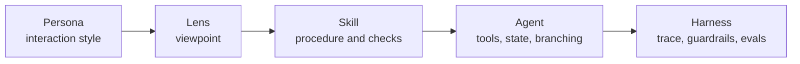
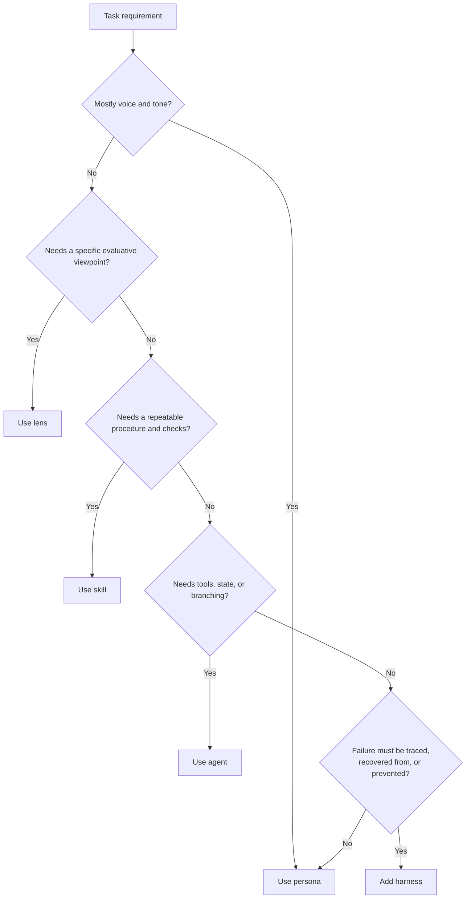
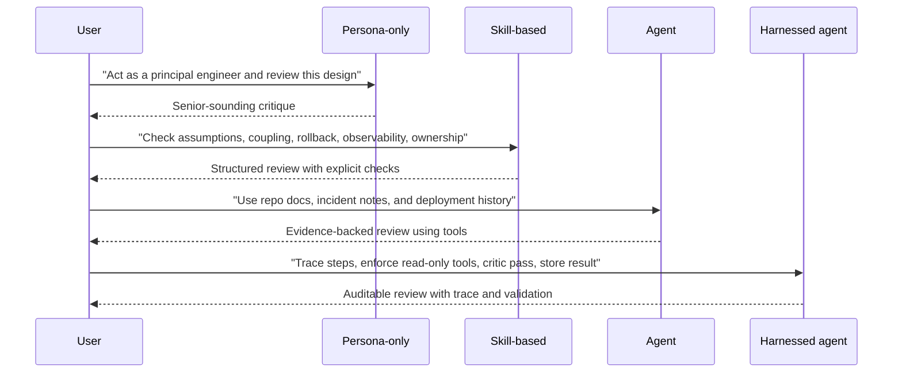
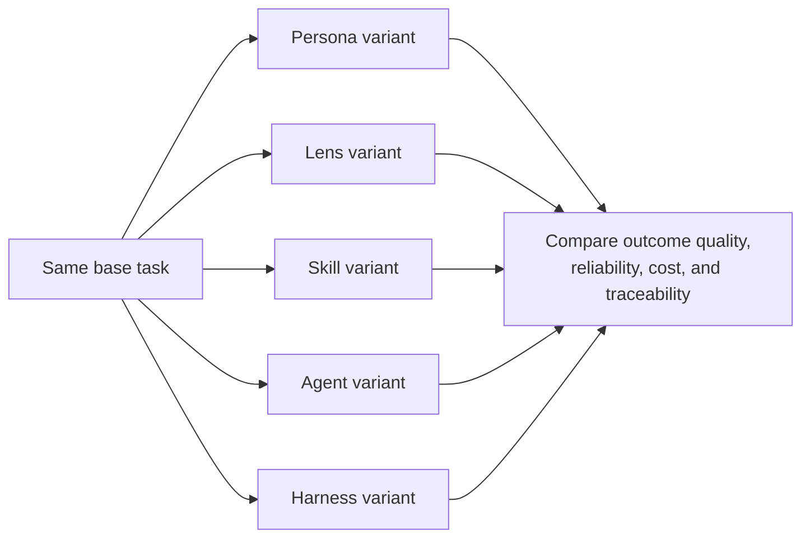

# Personas, Skills, Agents, and Harnesses in AI System Design

## Abstract

Persona prompting helps because it compresses tone, posture, and expected style into a familiar label. That convenience, however, invites people to ask more of the label than it can reliably deliver. This note argues that personas belong at the interaction layer, not the reliability layer. For operational AI systems, the more durable stack is persona, lens, skill, agent, and harness: personas shape UX, lenses define viewpoints, skills encode repeatable procedures, agents add tools and state, and harnesses provide guardrails, tracing, recovery, and evaluation. The practical question is not whether personas can help. It is which control layer is the cheapest one that still meets the task's reliability requirement.

## Thesis

The core claim is simple: personas are useful, but they are not the unit of reliability.

A persona is a lightweight UX control. It can change tone, framing, caution, and implied priorities. It does not reliably specify what counts as evidence, which checks must happen, which tools may be used, when the task is complete, or how the system should handle failure. Stronger abstractions have to carry those properties.

For practical system design, it is more useful to separate five layers:

1. **Persona** for interaction style
2. **Lens** for evaluative viewpoint
3. **Skill** for repeatable procedure
4. **Agent** for tools, state, and branching behavior
5. **Harness** for tracing, guardrails, recovery, and evaluation

This separation fits the mixed empirical picture around persona prompting. Studies such as [When “A Helpful Assistant” Is Not Really Helpful: Personas in System Prompts Do Not Improve Performances of Large Language Models](https://aclanthology.org/2024.findings-emnlp.888/), [Better Zero-Shot Reasoning with Role-Play Prompting](https://aclanthology.org/2024.naacl-long.228/), [Persona is a Double-Edged Sword: Rethinking the Impact of Role-play Prompts in Zero-shot Reasoning Tasks](https://aclanthology.org/2025.findings-ijcnlp.51/), [The Prompt Makes the Person(a): A Systematic Evaluation of Sociodemographic Persona Prompting for Large Language Models](https://aclanthology.org/2025.findings-emnlp.1261/), [In-Context Impersonation Reveals Large Language Models' Strengths and Biases](https://openreview.net/forum?id=CbsJ53LdKc), and [When Does Persona Prompting Actually Help? A Retrieval and Metric Analysis of Expert Role Injection in LLMs](https://arxiv.org/abs/2605.29420) suggest that personas often change response characteristics, but do not reliably improve core capability across tasks.

## Why this distinction matters

Persona prompting became popular because it is ergonomic. Prompts such as “act as a senior software architect” are easy to write, easy to teach, and often produce an immediate shift in tone and structure. The prompt-pattern literature, including [A Prompt Pattern Catalog to Enhance Prompt Engineering with ChatGPT](https://dl.acm.org/doi/10.5555/3721041.3721046), helped formalize that pattern. Work such as [Role play with large language models](https://www.nature.com/articles/s41586-023-06647-8) made the framing legible: models often respond as if they are role-playing a conversational identity.

The runtime environment has changed. Current agent systems are no longer just chat interfaces. Vendor guidance such as [Prompt guidance | OpenAI API](https://developers.openai.com/api/docs/guides/prompt-guidance), [Effective context engineering for AI agents](https://www.anthropic.com/engineering/effective-context-engineering-for-ai-agents), [Prompt design strategies | Gemini API | Google AI for Developers](https://ai.google.dev/gemini-api/docs/prompting-strategies), and [Safety and Security for AI Agents - Agent Development Kit (ADK)](https://google.github.io/adk-docs/safety/) now treats instructions, tools, memory, retrieved context, permissions, and stopping conditions as first-class parts of system design. Framework documentation such as [Workflows and agents - Docs by LangChain](https://docs.langchain.com/oss/python/langgraph/workflows-agents) and the [OpenAI Agents SDK](https://openai.github.io/openai-agents-python/) reflects the same shift.

That shift matters because vague role instructions that are merely annoying in chat become risky when the model can act. In tool-using settings, underspecified prompts can produce poor tool choice, weak evidence standards, confused authority, and traces that are hard to audit. Research such as [What Prompts Don't Say: Understanding and Managing Underspecification in LLM Prompts](https://arxiv.org/abs/2505.13360), [Quantifying Language Models' Sensitivity to Spurious Features in Prompt Design or: How I learned to start worrying about prompt formatting](https://arxiv.org/abs/2310.11324), and [Are AI-assisted Development Tools Immune to Prompt Injection?](https://arxiv.org/abs/2603.21642) makes that operational risk harder to ignore.

## The control stack

The useful distinction is not “good persona” versus “bad persona.” The useful distinction is which layer controls which behavior.

This diagram shows the stack and the operational responsibility that grows at each layer.

### Persona

A **persona** shapes the surface of interaction. It fits tasks whose main requirement is communicative: sound more executive, review more skeptically, explain more patiently.

### Lens

A **lens** narrows the evaluative angle. “Review this for production readiness” is usually better than “act as a principal engineer” when the real need is operational critique rather than identity simulation.

### Skill

A **skill** makes the work explicit. It defines inputs, ordered steps, expected outputs, and checks. At this layer, a capability becomes testable. The framing in [Testing Agent Skills Systematically with Evals](https://developers.openai.com/blog/eval-skills) is useful here: a skill becomes meaningful when a team can exercise it, score it, and compare it over time. Evaluation guidance such as [Holistic Evaluation of Language Models](https://arxiv.org/abs/2211.09110) and [Application-specific evaluation approaches](https://docs.langchain.com/langsmith/evaluation-approaches) reinforces the same point: useful evaluation is multidimensional and task-specific.

### Agent

An **agent** adds runtime power. It can search a repository, retrieve documents, inspect state, choose tools, and adapt its path. That power changes the risk profile. Once the system can act, prompt wording alone is no longer enough.

### Harness

A **harness** is the reliability shell around the agent. It determines tool permissions, trace capture, retry policy, critic passes, schema validation, regression comparison, and escalation behavior. At this layer, claims become inspectable and failures become observable.

## How to choose the layer

This diagram shows the promotion rule from one layer to the next.

The practical rule is:

- If you cannot define checks, you do not yet have a skill.
- If you cannot inspect the trajectory, you do not yet have a reliable agent.
- If you cannot rerun the evaluation, you do not yet have an engineering artifact.

## Concrete example: design review

A design review task makes the differences visible.

This diagram shows the same architecture review request moving up the stack as the reliability bar rises.

In the **persona-only** version, the output may sound senior and may still help. But the procedure stays hidden. The model can skip important checks and still produce an authoritative answer.

In the **lens** version, the request becomes narrower: review for production readiness, security posture, maintainability, or user risk. This is usually the most efficient upgrade when the real problem is viewpoint rather than execution.

In the **skill** version, the request becomes inspectable: extract assumptions, identify coupling, check failure modes, separate blocking issues from non-blocking risks, and ground blocking claims in the document. This is where repeatability begins.

In the **agent** version, the system can retrieve architecture documents, incident notes, issue history, or deployment artifacts before it makes claims. That is the right move when the answer depends on external evidence, not just on the prompt payload.

In the **harnessed** version, the system is no longer just generating a review. It is producing an auditable work product. That is the point where permission policy, trace capture, unsupported-claim marking, and regression storage become part of the capability itself.

## PromptStackBench and experimental design

The same logic motivates [PromptStackBench](https://github.com/rmax-ai/PromptStackBench), a proof-of-concept benchmark for comparing persona, lens, skill, agent, and harness treatments on the same task. The benchmark is not trying to prove that one layer always wins. It asks a narrower question: does the added structure pay for itself for a given task class?

A useful way to read the benchmark is as a controlled comparison of intervention layers.

The key point is experimental, not metaphysical. The benchmark compares increasingly structured treatments of the same task so that teams can ask whether a higher-control layer improves outcomes enough to justify its cost.

## Trade-offs and failure modes

This model is not an argument for maximum structure everywhere.

The first failure mode is **under-engineering**. Teams use personas for tasks that actually require explicit checks, evidence retrieval, tool policy, or auditability. Fluent prose then hides the failure.

The second failure mode is **over-engineering**. Teams build agent runtimes and harness machinery for tasks that are mostly about presentation or simple reframing. The result is unnecessary complexity, latency, and maintenance cost.

There are also layer-specific risks:

- **Persona risk**: authoritative tone can mask weak evidence.
- **Lens risk**: a narrow viewpoint can suppress other important concerns.
- **Skill risk**: rigid procedures can miss relevant exceptions.
- **Agent risk**: tools expand the attack surface and increase failure modes.
- **Harness risk**: guardrails and evaluation can add cost without improving the underlying procedure.

A separate failure mode is **layer collapse**. It occurs when a single role prompt is expected to carry style, evidence standard, tool policy, stopping condition, and recovery behavior all at once. That pattern demos well, but teams struggle to debug it and should hesitate to trust it.

## Practical takeaways

1. Use a persona when the problem is primarily interaction style, not capability.
2. Replace vague role prompts with explicit lenses when the real need is a viewpoint such as production readiness, security review, or user empathy.
3. Promote repeated high-value tasks into skills with ordered checks, output contracts, and evaluation cases.
4. Add agent behavior only when the task truly needs tools, external evidence, memory, or branching.
5. Add harness machinery when failure has operational consequences and the run must be traceable, reviewable, and comparable over time.

## Positioning note

This note sits between three familiar categories.

It is **not academic research** because it does not attempt a comprehensive literature review or a novel formal theory. It uses research selectively to clarify an engineering distinction.

It is **not a blog opinion piece** because the main claim is operational and testable: teams should choose different control layers according to task reliability requirements, and they can evaluate that choice.

It is **not vendor documentation** because it does not prescribe a single framework, SDK, or prompt format. The point is architectural: treat personas as a UX primitive, then decide when to promote the task into a lens, skill, agent, or harness.

## Status and scope disclaimer

This is exploratory lab work, not a normative standard.

The taxonomy is a practical design model for AI system construction and evaluation. It draws on current tooling patterns, recent prompt and agent guidance, and a narrow set of benchmark ideas. It is meant to be a precise working abstraction for builders, not authoritative field terminology. The examples here aim to improve structure and decision-making in applied systems, not to claim universal performance results.

> “The purpose of abstraction is not to be vague, but to create a new semantic level in which one can be absolutely precise.”
>
> - Edsger W. Dijkstra

## References

- [A Prompt Pattern Catalog to Enhance Prompt Engineering with ChatGPT](https://dl.acm.org/doi/10.5555/3721041.3721046)
- [Role play with large language models](https://www.nature.com/articles/s41586-023-06647-8)
- [When “A Helpful Assistant” Is Not Really Helpful: Personas in System Prompts Do Not Improve Performances of Large Language Models](https://aclanthology.org/2024.findings-emnlp.888/)
- [In-Context Impersonation Reveals Large Language Models' Strengths and Biases](https://openreview.net/forum?id=CbsJ53LdKc)
- [Better Zero-Shot Reasoning with Role-Play Prompting](https://aclanthology.org/2024.naacl-long.228/)
- [Persona is a Double-Edged Sword: Rethinking the Impact of Role-play Prompts in Zero-shot Reasoning Tasks](https://aclanthology.org/2025.findings-ijcnlp.51/)
- [The Prompt Makes the Person(a): A Systematic Evaluation of Sociodemographic Persona Prompting for Large Language Models](https://aclanthology.org/2025.findings-emnlp.1261/)
- [What Prompts Don't Say: Understanding and Managing Underspecification in LLM Prompts](https://arxiv.org/abs/2505.13360)
- [Quantifying Language Models' Sensitivity to Spurious Features in Prompt Design or: How I learned to start worrying about prompt formatting](https://arxiv.org/abs/2310.11324)
- [Holistic Evaluation of Language Models](https://arxiv.org/abs/2211.09110)
- [Prompt guidance | OpenAI API](https://developers.openai.com/api/docs/guides/prompt-guidance)
- [Testing Agent Skills Systematically with Evals](https://developers.openai.com/blog/eval-skills)
- [OpenAI Agents SDK](https://openai.github.io/openai-agents-python/)
- [Effective context engineering for AI agents](https://www.anthropic.com/engineering/effective-context-engineering-for-ai-agents)
- [Safety and Security for AI Agents - Agent Development Kit (ADK)](https://google.github.io/adk-docs/safety/)
- [Prompt design strategies | Gemini API | Google AI for Developers](https://ai.google.dev/gemini-api/docs/prompting-strategies)
- [Workflows and agents - Docs by LangChain](https://docs.langchain.com/oss/python/langgraph/workflows-agents)
- [Application-specific evaluation approaches](https://docs.langchain.com/langsmith/evaluation-approaches)
- [PromptStackBench](https://github.com/rmax-ai/PromptStackBench)
- [When Does Persona Prompting Actually Help? A Retrieval and Metric Analysis of Expert Role Injection in LLMs](https://arxiv.org/abs/2605.29420)
- [Are AI-assisted Development Tools Immune to Prompt Injection?](https://arxiv.org/abs/2603.21642)
