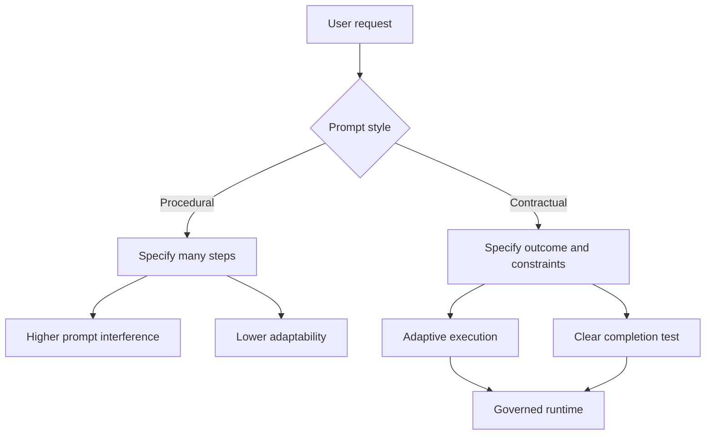
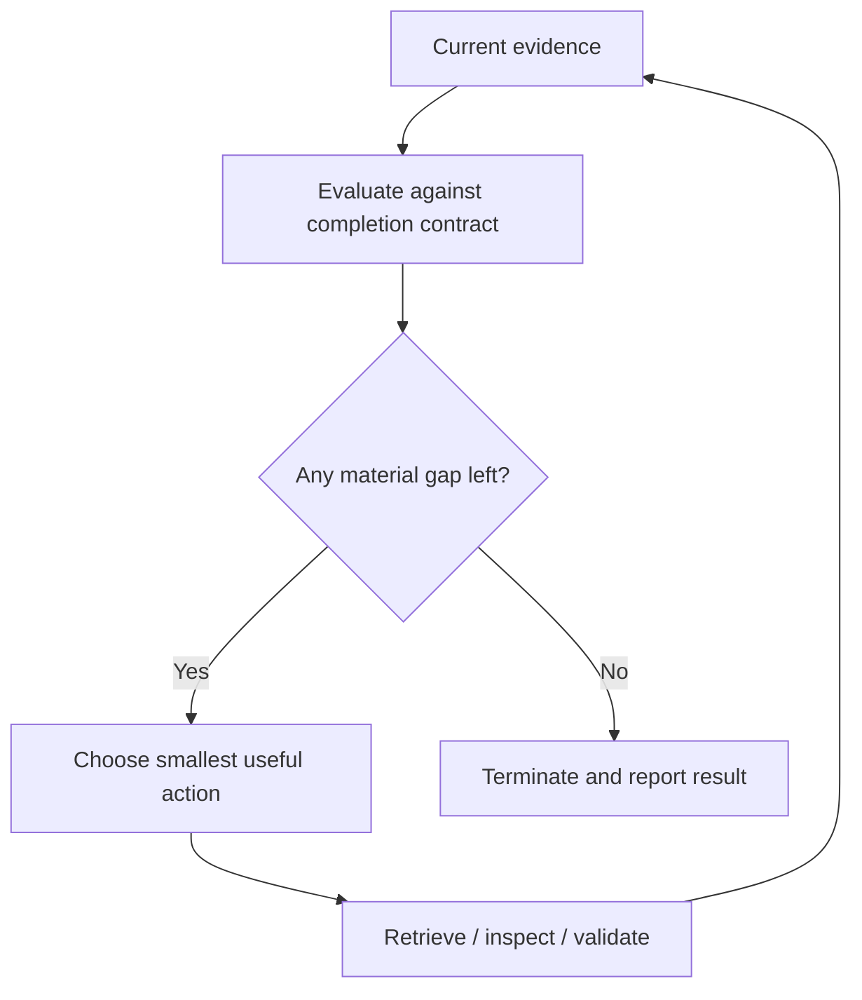
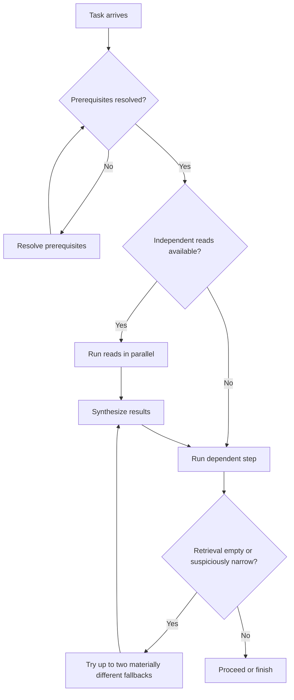

# Prompts Are Contracts, Not Programs: What GPT-5.6 Changes About Agent Design

## Abstract

As models improve at planning, tool use, and instruction following, prompt design shifts away from procedural scripting and toward contract design. This note argues that a prompt's operational job is no longer to prescribe every step. Its job is to define the outcome, constraints, evidence requirements, authorization boundaries, and completion conditions that a capable model must satisfy. That shift matters because it changes agent architecture. The prompt becomes one control layer inside a larger governed runtime, not the whole program.

## Core Thesis

For modern agents, the prompt should primarily define what must be true at completion, not the exact sequence of actions used to get there.

A good prompt contract specifies:

- the desired outcome;
- success criteria;
- authority and permission boundaries;
- evidence and citation requirements;
- validation requirements;
- output structure;
- stop and escalation rules.

A weak prompt spends too much of its budget on generic activity instructions such as "investigate thoroughly," "use tools carefully," or "respond quickly." Those instructions often conflict, and the system usually reveals the conflict only after it behaves badly.

## Context and Motivation

Recent [OpenAI prompt engineering guidance](https://platform.openai.com/docs/guides/prompt-engineering) for GPT-5.6 points toward a simpler prompt style: define the task clearly, specify what success requires, expose only relevant tools, and avoid unnecessary procedural scaffolding. That advice reflects a real change in model behavior. Earlier agent systems often needed long instructions because models planned poorly and used tools unreliably. More capable systems can often infer the sequence. They still cannot safely infer permission boundaries, evidence standards, stop conditions, or validation requirements.

That change makes prompt design less like writing a program in natural language and more like specifying a contract for an adaptive runtime.

## From Procedural Instructions to Declarative Contracts

A procedural prompt says how to work:

> Inspect the repository. Make a plan. Implement the change. Review the result. Run tests. Return a summary.

A contract prompt says what completion requires:

> Implement the requested behavior without changing unrelated functionality. Preserve repository conventions. Validate the change with relevant tests. Report remaining uncertainty.

The second form does not remove planning, inspection, or validation. It delegates the order and scope of those actions to the model. That is the important change.

The structure is similar to declarative infrastructure. An imperative deployment script lists commands. A declarative system defines the desired state and relies on a control loop to reconcile the actual system state with the desired state. In the same way, the prompt defines the destination and the boundaries, while the model and runtime decide how to reconcile the current state against the completion contract.

## Prompt Simplification Is a Behavioral Change

Prompt reduction is not only a latency or token optimization. It changes behavior.

OpenAI reports, in internal coding-agent evaluations, that leaner system prompts improved evaluation scores by 10–15%, reduced total token use by 41–66%, and reduced cost by 33–67%. Because those results are internal, treat them as directional rather than universal. The accompanying guidance recommends validating any prompt change against representative application-specific evals.

The mechanism is simple: every instruction adds another optimization pressure. A prompt that says "always investigate thoroughly," "use the fewest tool calls," "never make assumptions," "do not ask unnecessary questions," and "respond quickly" does not define a coherent policy. It defines competing objectives.

The practical goal is not minimalism. The goal is to remove instructions that do not materially improve behavior.

Keep the information the model cannot safely invent:

- outcome;
- completion criteria;
- permission model;
- evidence rules;
- validation requirements;
- tool-routing policy;
- output schema.

Remove repeated rules, generic process narration, redundant style demands, irrelevant tools, and duplicated tool descriptions.

## Define Completion, Not Activity

Agents perform better when the prompt defines observable completion conditions instead of vague activity.

"Research this topic" does not tell the system when to stop. "Produce a report that answers three questions, supports material claims with retrieved sources, distinguishes evidence from inference, and identifies unresolved gaps" does.

That difference gives the runtime a usable completion predicate. After each action, the system can compare current evidence against the contract and decide whether to continue, ask, narrow the result, or stop.

For agents that work against evolving evidence, this is usually a better organizing model than a generic "plan, act, observe, reflect" loop. The central question is not "what step comes next?" The central question is "what contract condition is still unsatisfied?"

## Separate Invariants, Policies, and Preferences

Prompt stacks often become brittle because they mix hard rules with softer guidance.

Use absolute language only for real invariants:

- never expose secrets;
- never claim an action succeeded without tool confirmation;
- never perform destructive actions without approval;
- output must match the required schema.

Express context-sensitive behavior as policies:

- search when available evidence is insufficient or may be stale;
- ask only when missing information blocks a correct or authorized action;
- use account tools only when the answer depends on account state.

Treat preferences separately:

- concise tone;
- preferred validation order;
- favored output style.

This separation matters operationally. Invariants must always hold. Policies guide decisions between valid options. Preferences should never override correctness.

## Authorization Is Part of the Prompt Contract

More capable agents act more proactively. They inspect more context, call more tools, and continue longer without intervention. That makes authorization semantics non-optional.

A working contract should distinguish:

- read versus write;
- planning versus execution;
- local versus external effects;
- reversible versus irreversible actions;
- task completion versus scope expansion.

A compact policy often works better than repeated "ask first" language scattered throughout the prompt:

| Action class | Default policy |
|---|---|
| Read or analyze | Allowed |
| Local in-scope modification | Allowed by implementation request |
| Non-destructive validation | Allowed |
| External write | Requires approval |
| Destructive or irreversible action | Requires approval |
| Material scope expansion | Requires approval |

The prompt should communicate this policy, but high-consequence systems should not rely on prompting alone. Runtime gates should independently classify and allow, deny, or route proposed actions for approval.

## Tools Are Part of the Prompt

Tooling is not separate from prompting. The tool set defines the model's action space, and tool descriptions are part of the behavioral contract.

[OpenAI's tools guidance](https://platform.openai.com/docs/guides/tools) supports a simple rule: expose only the tools relevant to the current task, and describe them with routing and failure semantics rather than vague labels.

A useful tool description explains:

- what the tool does;
- when to use it;
- what it returns;
- important limitations;
- expected errors.

That is why tool schemas and descriptions should be treated as interface contracts. A vague tool name increases decision entropy. A precise description reduces it.

## Let the Runtime Choose the Execution Pattern

Fixed workflow graphs still have value, but they work best where the sequence is known and stable.

Where sequence depends on context, the prompt should define execution policy rather than a rigid script. The source material condenses OpenAI's GPT-5.6 guidance into a simple execution policy: resolve prerequisites first, parallelize independent reads, and keep dependent steps sequential. Then synthesize those results before acting, and if retrieval comes back empty, try one or two materially different fallbacks.

That policy lets the model construct a task-specific execution graph without hard-coding every sequence in the prompt.

Dynamic orchestration is not automatically better. Regulated or repetitive business processes may still fit deterministic graphs better. Adaptivity matters when the right path depends on local context.

## Use Deterministic Code for Deterministic Work

[Programmatic Tool Calling](https://platform.openai.com/docs/guides/tools-programmatic-tool-calling) draws a cleaner boundary: use deterministic code when a bounded stage can transform structured data more reliably than the model can, and keep the model in control when each result may change the next decision.

Deterministic code is well suited to:

- filtering;
- sorting;
- joining;
- ranking;
- deduplication;
- aggregation;
- repeated validation;
- bulk processing of similar records.

Direct model-controlled calls are better when:

- each result changes the next decision;
- semantic judgment is required;
- approval may be needed;
- intermediate artifacts are small;
- citations or native outputs must be preserved.

A useful pattern is:

probabilistic interpretation and orchestration  
→ deterministic processing  
→ probabilistic synthesis and judgment  
→ deterministic validation and policy enforcement

In an incident investigation, the model can decide which systems matter, deterministic code can normalize and order thousands of records, the model can interpret the timeline, and deterministic checks can verify the final output against policy.

## Grounding Must Be Explicit

Retrieval access does not automatically create grounded answers. The contract must define what counts as evidence.

That includes:

- which claims require support;
- which sources are allowed;
- how citations attach to claims;
- how disagreement is represented;
- how inference is labeled;
- what to do when evidence is missing.

A strong evidence contract requires retrieved support for every material external claim, places citations beside the claims they support, labels synthesis as synthesis, and leaves unresolved gaps visible.

The most operationally important distinction is between absence of evidence and evidence of absence. "No supporting document was found" is a retrieval observation. It is not automatically proof that an event did not happen.

## Keep the Contract Stable and Task State Compact

Long-running agents accumulate too much state if everything stays in the live context. The source material proposes three layers:

- stable contract;
- current task state;
- historical trace.

The stable contract contains the durable rules: role, permissions, evidence policy, schema, and completion criteria. The current task state contains what is active now: objective, retrieved evidence, completed actions, remaining gaps, and blockers. The historical trace contains prior plans, failed attempts, verbose tool outputs, and superseded reasoning.

This is where [prompt caching](https://platform.openai.com/docs/guides/prompt-caching) becomes architecturally useful, not just financially useful. A stable contract can remain cache-friendly and durable while task state stays compact and authoritative.

## More Reasoning Is Not Better Architecture

Increasing reasoning effort is not a substitute for missing system design. [OpenAI's reasoning best practices](https://platform.openai.com/docs/guides/reasoning-best-practices) support a more disciplined view: if outputs are weak, first check the architecture: does the system define success, route tools correctly, enforce permissions, and validate results?

Reasoning amplifies the model operating inside the architecture. It does not replace the architecture.

A model cannot reliably compensate for undefined completion, missing permissions, absent validation tools, or unavailable evidence sources. Raising reasoning effort may make a broken design slower and more expensive without making it safer or more correct.

## Validation Defines Completion

Producing an artifact is not the same as completing a task. Completion requires evidence that the required conditions hold.

For software changes, that evidence may include targeted tests, type checks, linting, builds, or smoke tests. For visual work, it may include rendering and checking layout, spacing, clipping, responsive behavior, and content integrity.

The prompt contract should define which checks matter before completion can be claimed. The runtime should gather the evidence. The final response should report both the result and the validation status.

This is where [function calling](https://platform.openai.com/docs/guides/function-calling) and structured outputs become practically important: they make it easier to return a result plus evidence, not just a narrative summary.

## Prompts Should Evolve Through Evals

Prompt development should be treated more like engineering change management than copywriting.

The source material outlines a disciplined migration loop aligned with [Working with evals](https://platform.openai.com/docs/guides/evals) and [Evaluate agent workflows](https://platform.openai.com/docs/guides/agent-evals):

1. Change the model while preserving the current reasoning setting.
2. Run representative evaluations before changing the prompt.
3. Remove obsolete scaffolding, repeated instructions, and irrelevant tools.
4. Add only the smallest targeted instruction needed to fix a measured regression.
5. Rerun evaluations after each prompt or reasoning change.

This sequence isolates variables. If the model, prompt, tools, reasoning level, and runtime all change at once, regressions become hard to diagnose and improvements become hard to trust.

## Concrete Examples

### Example 1: Repository implementation agent

A weak prompt for a coding agent often says:

> Inspect the repo, make a plan, implement, review your work, run tests, and summarize.

A stronger contract says:

- implement the requested behavior;
- preserve unrelated behavior and repository conventions;
- stay within requested scope;
- do not perform external writes or destructive actions;
- validate with relevant tests or checks;
- report changed behavior, evidence, and remaining uncertainty.

The model can still inspect the repo, plan, implement, and validate. The difference is that the completion contract implies those activities instead of scripting them manually.

### Example 2: Research agent with retrieval

A weak prompt says:

> Research this topic thoroughly.

A stronger contract says:

- answer three specified questions;
- support material claims with retrieved sources;
- distinguish evidence from inference;
- describe disagreements between reliable sources;
- identify missing evidence;
- narrow conclusions when support is incomplete.

The second form provides a stop condition and a reporting standard. It also prevents a common failure mode: the system returns a confident synthesis with unclear provenance.

## Trade-offs and Failure Modes

This approach does not solve every agent problem.

- A contract that is too compact can omit critical business rules or authority boundaries.
- A contract without runtime enforcement still relies too heavily on model compliance.
- Poor tool design can degrade behavior even when prompt design is strong.
- Some workflows fit deterministic graphs better than adaptive loops.
- Completion contracts can be hard to define for open-ended creative or exploratory tasks.
- Overly abstract contracts can hide sequence dependencies that should be explicit in code.

The transition also carries risk. Teams that are used to long prompts may remove structure too aggressively and discover that some of that structure was compensating for gaps elsewhere in the system. Simplify prompts only when evals show that the change improves results.

## Practical Takeaways

1. Write prompts around completion conditions, not activity sequences.
2. Separate invariants, policies, and preferences so the model is not asked to optimize conflicting instructions.
3. Treat tool exposure and tool descriptions as part of the prompt contract.
4. Push deterministic work into code and keep probabilistic judgment with the model.
5. Evaluate prompt changes the way you evaluate code changes: against representative regressions, one variable at a time.

## Positioning Note

This note is not academic research. It does not propose a formal theory of agent cognition or a new benchmark.

It is also not a blog-style opinion piece. Its claims are operational and architectural. They are meant to help practitioners design systems that behave better under real tool, permission, and validation constraints.

It is not vendor documentation either. Although the argument is grounded in current [OpenAI API documentation](https://platform.openai.com/docs), the point is broader than any single endpoint or product surface. The useful abstraction is the contract model itself: prompts define governed behavioral boundaries inside a larger runtime.

## Status and Scope Disclaimer

This is exploratory but evidence-informed lab work, not authoritative guidance. It reflects a practical reading of current OpenAI documentation and the design implications suggested by the source material, not a universal law of agent engineering.

The note is scoped to modern tool-using agents operating in software and research workflows. It does not attempt to cover all model classes, all safety regimes, or highly regulated deployment environments.

## References

1. [OpenAI — Prompt engineering](https://platform.openai.com/docs/guides/prompt-engineering)
2. [OpenAI — Using tools](https://platform.openai.com/docs/guides/tools)
3. [OpenAI — Programmatic Tool Calling](https://platform.openai.com/docs/guides/tools-programmatic-tool-calling)
4. [OpenAI — Working with evals](https://platform.openai.com/docs/guides/evals)
5. [OpenAI — Prompt caching](https://platform.openai.com/docs/guides/prompt-caching)
6. [OpenAI — Function calling](https://platform.openai.com/docs/guides/function-calling)
7. [OpenAI — Reasoning best practices](https://platform.openai.com/docs/guides/reasoning-best-practices)
8. [OpenAI — Evaluate agent workflows](https://platform.openai.com/docs/guides/agent-evals)
