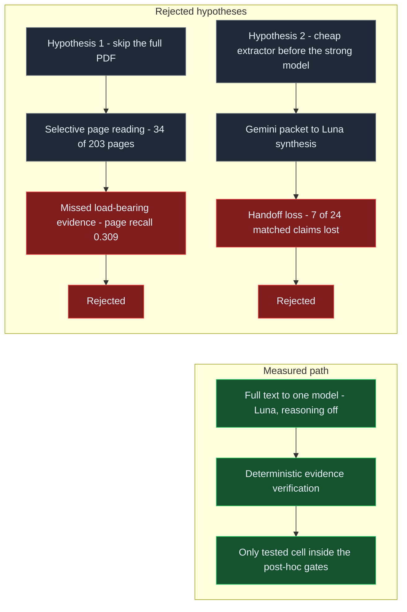
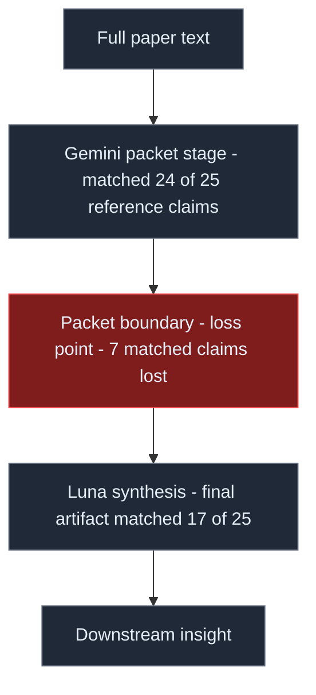
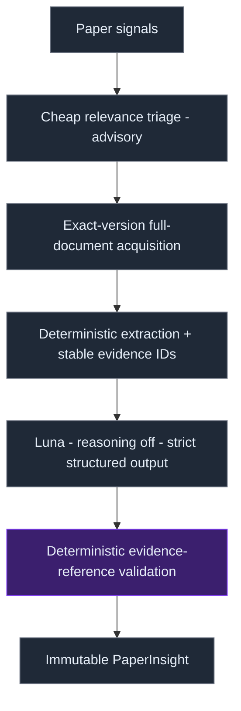

# Read the Whole Paper: Lessons from Benchmarking AI Research Pipelines

This field report tests whether two AI research-pipeline optimizations can reduce work without losing evidence: selective page reading and a cheap-model evidence packet handed to a synthesizer. In the measured runs, both lost load-bearing information, while full extracted text sent to one model followed by deterministic evidence checks had better measured outcomes at lower cost than the staged arm. The result supports a narrow rule: every compression boundary must demonstrate that it preserves the evidence its downstream decision needs.

## The PDF wall

Paper discovery is easier to automate than evidence-grounded research memory. Feeds, metadata, and relevance scores identify candidates; a durable record still requires evidence to survive acquisition, extraction, synthesis, and citation. Each efficiency step can lower cost while removing detail needed to defend a conclusion.

We tested three operational questions in the public [AI papers routing benchmark](https://github.com/rmax-ai/ai-papers-routing-benchmark): can a pipeline avoid reading every page, can a cheap model compress a paper before a stronger model sees it, and can a probabilistic evaluator decide what deserves deeper processing? The benchmark’s [benchmark report](https://github.com/rmax-ai/ai-papers-routing-benchmark/blob/main/report/report.md) and [selective-reading failure walkthrough](https://github.com/rmax-ai/ai-papers-routing-benchmark/blob/main/artifacts/failures/selective-reading.md) document the first experiment; its [two-arm comparison](https://github.com/rmax-ai/ai-papers-routing-benchmark/tree/main/dq84-luna-vs-gemini) documents the second.

The evidence supports a bounded conclusion, not a universal reading strategy: two tested efficiency strategies lost reference evidence, while a simpler path did better among the measured arms. We distinguish observed outcomes from interpretation and open questions because the samples, references, and evaluators limit what these measurements establish.

## The architecture that looked sensible

The intuition was progressive narrowing: route papers by relevance, inspect likely-important pages, extract claims with a low-cost model, pass a compact packet to a synthesis model, then verify before storage. A probabilistic evaluator could route expensive attention. Each stage seemed to lower token use or reserve model effort for promising material.

That design added interfaces. A page selector had to request unseen evidence; an extractor had to choose what fit a fixed packet; a synthesizer had to interpret its schema and preserve contents; a verifier had to distinguish supported claims from plausible prose. Each interface assumes what matters and what can be discarded.

We treated the optimizations as hypotheses, asking what each boundary removed and whether savings compensated for lost reference evidence. The results changed our baseline architecture.

## Hypothesis 1 — “we don’t need to read the whole PDF”

Selective reading seemed like the most direct way to reduce work: render pages, inspect a subset, and request more when evidence was missing. The tested reader used Gemini Flash-Lite to inspect visual page images rendered with PyMuPDF. In the eight-paper deep evaluation, it examined 34 of 203 pages (16.7%). The model was asked to request additional pages when needed but requested none on all eight papers. Its `stop_reason` was free-form prose rather than the requested stop token, so the loop ended because the model returned no page requests. This is a strategy and contract failure, not evidence that the bounded loop knew when it had enough.

**Observed.** Against the full-document operational reference, selective reading reached 0.309 mean load-bearing-page recall and 0.212 mean claim recall at the primary lexical threshold, content-word Jaccard ≥ 0.20. These are overlap measures, not semantic entailment scores, and the reference is a practical comparison target rather than independent truth. On one paper, the output missed all four reference claims, including 33/505 confirmed reward-hack cases and a 40.5% cumulative evasion result. On another, it missed three claims, including a reported 98% best-of-three evasion-attempt rate and an 88% success rate. On a third, it missed three of five claims, including the late-commit and unknown-in-flight limit on exactly-once guarantees.

**Interpretation.** The benchmark’s post-hoc, non-preregistered tolerances were at most 0.5/4 loss in faithfulness and evidence support, at least 0.90 evidence-page and claim recall, and at least 0.95 normalized schema and page-reference validity. No selective pipeline met them. Only the full-document reference → GPT-6 Luna cell met its own reference-quality and structural gates. For eight papers, that cell cost $0.112304 ($0.079122 extraction, $0.033183 generation), passed the canonical schema 8/8, and reached 0.776 citation quote containment. The full evaluation cost approximately $0.538550 estimated across 300 saved attempts in triage, page strategies, generation arms, blind judging, and post-checks—6.7% of the $8 cap. Costs are rate-card estimates from recorded usage, not invoices.

**Open.** The 24 papers were purposively selected: 12 high-value proxies, 8 adjacent papers, and 4 negative controls, balanced by construction rather than randomly sampled. The eight-paper deep subset was preselected as long and figure/table-heavy; six papers were 20+ pages. These are proxies, not a gold relevance set. We reject this tested strategy for this evidence task, not selective reading everywhere. A future contract needs explicit page requests, preserved stop-token semantics, and recall measured against a larger, independently adjudicated evidence set.

## Hypothesis 2 — “let a cheap model extract the evidence”

The next hypothesis retained the full document at acquisition but compressed it before synthesis. Both arms used the same Luna system prompt and output schema. Arm A sent full extracted paper text to GPT-6 Luna in one call per paper. Arm B sent that text to Gemini Flash-Lite, then sent its evidence packet to Luna. The packet had exactly four fields: `candidate_claims`, `key_claims`, `limitations`, and `load_bearing_pages`, serialized with sorted keys, compact separators, and UTF-8. `requested_pages` and `stop_reason` were omitted. The two stages ran serially per paper.

| Measure | Full text → Luna (A) | Gemini packet → Luna (B) |
|---|---:|---:|
| Mean load-bearing-page recall | 0.509 | 0.273 |
| Cited-quote containment | 0.804 | 0.654 |
| Unsupported or weak claims | 13.3% (6/45) | 43.2% (19/44) |
| Estimated cost per paper | $0.003639 | $0.010907 |
| Median latency per paper | 15.4 s | 39.8 s |
| Blind-judge means (n=7) | Faithfulness 4.00 / evidence support 4.00 / depth 4.00 | 3.286 / 2.714 / 2.714 |
| Schema (native, normalized) | 8/8, 8/8 | 8/8, 7/8 |

**Observed.** The packet found material; synthesis failed to preserve some of it. Across 25 paper-specific reference-claim instances at the primary lexical threshold, the packet matched 24 and final B matched 17. Luna lost seven packet-matched claims and recovered zero packet misses. Page-level results were less uniform: packet evidence-reference recall was 0.231 and the final artifact reached 0.273. One packet-matched claim scored 0.414 Jaccard, then 0.035 in the final artifact. The measured loss is clearest in claims, not uniform across pages.

**Interpretation.** An intermediate representation is a lossy interface, not a free abstraction: a handoff adds omission, serialization, schema, and synthesis choices. In this run, the extra boundary did not preserve enough evidence to justify its added cost and latency. The result does not rule out other packet formats or synthesis strategies.

**Open.** The apparent lexical claim-overlap advantage for B (0.652 versus 0.440) is confounded: the operational reference came from the same model family as B’s extraction stage, so it is not independent truth. Claim, page, and quote metrics are lexical, not semantic entailment. The blind judge was a single small judge (n=7 usable cells), ceiling-heavy for A (all normalized ratings were 4/4), with imperfect format compliance; no second judge produced usable scores. The subset was purposive n=8; costs are estimates and latency is serial wall time per paper.

The run used `reasoning_effort=none`; a four-paper medium-effort sensitivity arm showed no measured quality gain. B’s post-hoc improvement rule—at least +0.5/4 judge gain or +10 percentage points recall, positive in at least six of eight pairs—was applied after the run. It is pragmatic for this small sample, not a universal rule. A still missed substantial reference evidence (page recall 0.509): it was best among those tested, not complete.

## The simpler architecture

We changed the baseline to advisory relevance triage, exact-version full-document acquisition, deterministic extraction with stable evidence IDs, one GPT-6 Luna pass at reasoning off with strict structured output, deterministic evidence-reference validation, and an immutable record. This removes selective-page requests and model-to-model packet handoff from the measured path; synthesis must point to evidence assembled before generation.

**Interpretation.** The full-document Luna cell alone met the post-hoc quality and structural gates. In the two-arm evaluation it had stronger measured results than the staged arm across page recall, quote containment, unsupported-claim rate, judge means, schema validity, estimated cost, and median latency. That motivates this benchmark’s simpler default, not an optimal or universal design. Its 0.509 page recall still leaves evidence unrepresented.

The architecture constrains probabilistic interpretation: acquisition pins the source version; extraction creates addressable evidence blocks; the model proposes structured claims and selects IDs. Deterministic code checks each ID and resolves its source location and text before a durable record is written. Verification becomes a system boundary, not a style instruction to cite carefully.

## Where JEV actually fit

The same evaluator can prioritize triage without serving as a truth gate. The table separates observed threshold results from the operational use indicated by this purposive n=24 sample.

This is the operational case for the earlier [distinction between typed probabilistic decisions and generative judgment](https://rmax.ai/notes/jev-vs-generative-models-for-typed-software-decisions/). Route work to review with probabilistic scores; enforce evidence invariants with deterministic checks. These purposive proxy labels and small-sample thresholds guide attention, not deployment guarantees.

| Decision | Observed result | Operational use indicated by this sample |
|---|---|---|
| Triage at P(relevant) ≥ 0.70 | Proxy precision 0.857; recall 1.000 (12/12); roughly $0.000047 per call | Prioritize escalation; keep 0.50–0.69 for review and do not auto-discard below it |
| Truth check at P(supported) ≥ 0.75 | 19 of 43 predicted-supported candidates failed exact quote containment | Not a sufficient acceptance gate |
| Truth check at P(supported) ≥ 0.95 | Proxy precision 0.80; recall 0.154 | Higher precision came with low recall; no balanced automatic threshold measured |

**Interpretation.** Probabilistic scores can direct attention, but these small-sample thresholds do not support automatic discard or evidence acceptance. A typed probability does not establish that a claim has evidence.

## Don’t let the LLM write the citation

**Recommendation.** Separate evidence discovery from citation rendering. Before generation, extraction pins the source version and assigns stable IDs to addressable evidence blocks. The model returns a claim, limitation, and structure while selecting IDs. Deterministic code resolves each ID against the pinned source to page, section, quote, offsets, and source hash. Dangling IDs and model-authored coordinates are hard validation failures.

Stable identifiers do not make an interpretation correct: the model can still miss or select the wrong evidence. They make provenance checkable and give later stages a failure signal for review or re-extraction, instead of letting a plausible page number or quotation authorize itself.

The distinction connects to [deep research as an evidence workflow](https://rmax.ai/notes/deep-research-evidence-workflow/) and [assurance attached to verifiable changes and evidence](https://rmax.ai/notes/the-change-is-the-unit-of-assurance/). A durable object needs enough linked evidence and validation state for a downstream operator to inspect what the system relied on.

## What this says about agent architecture

This is a pipeline result, not a provider leaderboard. Every compression boundary chooses what survives. In evidence-grounded synthesis, an omitted limitation can cost more than the saved tokens; measure that cost against downstream decisions, not packet size or model confidence.

Model and agent handoffs are information bottlenecks. A schema makes a boundary explicit but cannot ensure it carries every relevant fact or that the next model preserves each field. Extra stages should show task-relevant evidence gains, with latency, cost, and failure handling measured too. Simpler pipelines can cost less by removing serial calls and failure surfaces.

Optimize for evidence preservation, not token minimization alone. That fits [treating the harness as part of the runtime](https://rmax.ai/notes/the-harness-is-becoming-the-runtime/) and the [field report on human orchestration and autonomous control planes](https://rmax.ai/notes/from-human-orchestrated-agent-to-autonomous-control-plane/): routing, verification, and durable state are explicit, observable design choices.

## What remains unsolved

**Open.** One-pass Luna is not a complete evidence reader: page recall of 0.509 leaves reference evidence uncovered, and the reference is not independent ground truth. Claim, page, and quote measures are lexical proxies, not semantic entailment. Selective-reading and routing labels are purposive proxies, not naturally prevalent, human-adjudicated gold judgments.

Judge evidence is thin: one small judge, seven usable cells, ceiling-heavy A ratings, and no usable second judge. Larger samples could change the estimates. The reasoning-off setting bounds the comparison; the small medium-effort arm’s lack of measured gain does not show reasoning never helps. Routing calibration and escalation thresholds also remain open.

The next benchmark should use independent, human-adjudicated evidence, preserve source versions, and test downstream decisions on a larger sample. It should measure effects on review effort and decisions, not just overlap. Until then, this is a bounded choice for the tested setup, not a general prescription. Any optimization that removes context must show that it preserves the evidence downstream decisions need.

## Practical Takeaways

- Treat page selection and model-to-model packets as lossy interfaces; measure what downstream evidence survives each one.
- Preserve explicit request and stop semantics in any iterative reader. A loop that ends without a valid request signal has not demonstrated sufficient coverage.
- Pin the document version, assign stable evidence IDs, and make deterministic code resolve citations and enforce reference invariants.
- Use probabilistic scores to prioritize review when labels are weak; require stronger checks for evidence acceptance.
- Compare quality, cost, and serial latency together, and keep the sample, reference, judge, and reasoning-setting caveats beside the result.

## Positioning Note

This is an engineering field report, not an academic evaluation: the samples are small and purposive, and several thresholds were post-hoc. It is more than a blog opinion because it records tested arms, operational metrics, failure examples, and bounded conclusions. It is not vendor documentation or a model recommendation; provider names identify measured roles in these experiments. The subject is the architecture around the model and how it preserves evidence.

## Status & Scope

These are bounded experiments in a personal research lab, not a validated general benchmark or authoritative guidance. Results are limited by purposive samples, lexical-proxy metrics, a single small judge, estimated costs, serial latency, reasoning-off scope, and the reference-family confound in the two-stage comparison. The winning arm still misses evidence. The note records what we measured and the architecture we changed; independent adjudication and broader calibration remain open.

## References

- [AI papers routing benchmark repository](https://github.com/rmax-ai/ai-papers-routing-benchmark)
- [Benchmark report](https://github.com/rmax-ai/ai-papers-routing-benchmark/blob/main/report/report.md)
- [Selective-reading failure walkthrough](https://github.com/rmax-ai/ai-papers-routing-benchmark/blob/main/artifacts/failures/selective-reading.md)
- [Luna and Gemini two-arm comparison](https://github.com/rmax-ai/ai-papers-routing-benchmark/tree/main/dq84-luna-vs-gemini)
- [Typed probabilistic decisions and generative judgment](https://rmax.ai/notes/jev-vs-generative-models-for-typed-software-decisions/)
- [Deep research evidence workflow](https://rmax.ai/notes/deep-research-evidence-workflow/)
- [The change is the unit of assurance](https://rmax.ai/notes/the-change-is-the-unit-of-assurance/)
- [The harness is becoming the runtime](https://rmax.ai/notes/the-harness-is-becoming-the-runtime/)
- [From human-orchestrated agent to autonomous control plane](https://rmax.ai/notes/from-human-orchestrated-agent-to-autonomous-control-plane/)
