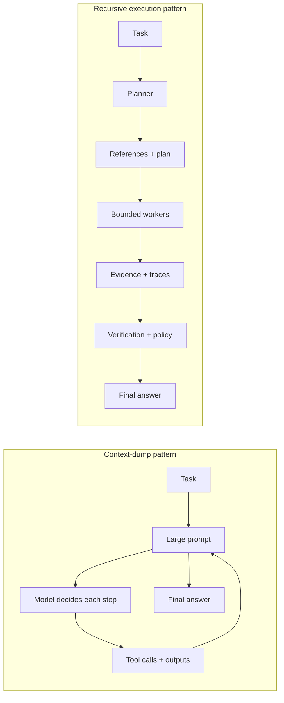
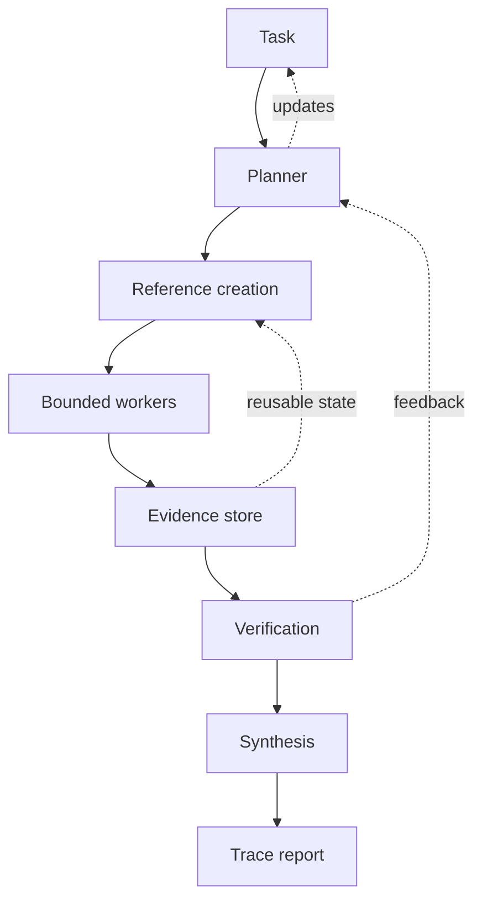
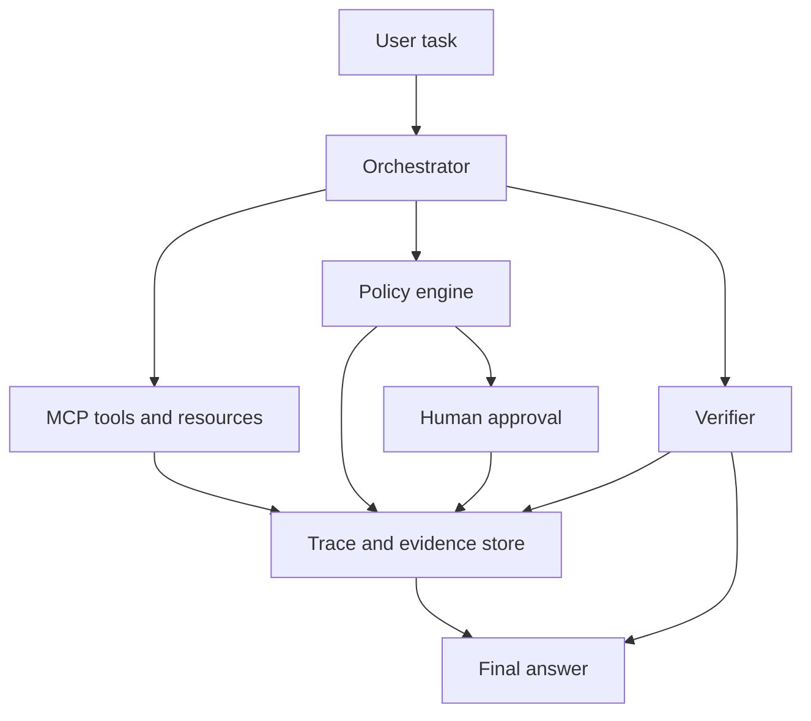
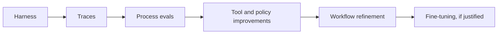

# Recursive Execution Is the Missing Layer for Long-Running Agents

*Long-running agents fail when they treat execution as an extended chat session. This note argues that reliable agents need a missing middle layer: recursive execution over externalized state, bounded workers, deterministic policy checks, and traceable verification. That layer matters because it changes both the economics and the control model of agent systems. Once a task has stable structure, the model should stop improvising every step and start emitting execution artifacts the system can run, inspect, replay, and improve.*

## Context and motivation

Recent coding and research agents have improved for a simple reason: the environment got sharper. [SWE-agent: Agent-Computer Interfaces Enable Automated Software Engineering](https://arxiv.org/abs/2405.15793) showed that better interfaces can make the same model more reliable. [Separating Intelligence from Execution: A Workflow Engine for the Model Context Protocol](https://arxiv.org/abs/2605.00827) pushes the same idea into longer-running work. The model reasons once, emits a workflow blueprint, and later runs execute that blueprint with far less model involvement. In its Kubernetes CMDB synchronization case, the paper reports more than 99 percent lower per-run token cost for a 67-step workflow.

That shift matters now because current agent systems are hitting the same limit from different directions. Larger context windows make it possible to stuff more material into a prompt, but they do not make execution durable. More tools increase capability, but they also increase failure surface. Longer sessions create the appearance of continuity, but they often collapse planning, memory, policy, side effects, and verification into one fragile transcript.

The result is a common production failure pattern: the agent can often produce a plausible answer, but the system cannot explain what happened, recover from interruption, or safely reuse what it learned.

## Core thesis

Reliable long-running agents need recursive execution over externalized state, not bigger conversation history.

More specifically, the unit of reliability should shift from the prompt to the execution path. A strong system does not ask the model to remember every prior action, every retrieved document, every failed attempt, and every policy boundary. It stores those things outside the prompt, then lets the agent operate over references, checkpoints, and verifiable sub-results.

This is not a claim that prompts stop mattering. Prompts still shape behavior. The narrower claim is that prompts should not carry the full burden of control once the task becomes multi-step, stateful, expensive, or consequential.

## Mechanism and model

Recursive execution means the system repeatedly converts open-ended work into narrower work products:

1. a plan
2. references to relevant state
3. bounded subtask inputs
4. evidence from worker execution
5. verification results
6. a synthesized answer with provenance

At each layer, the agent reasons over a smaller surface than the total problem. The system persists what matters and passes forward artifacts, not giant transcripts.

This model depends on four concrete design moves.

### 1. Externalize state

Documents, prior tool outputs, code diffs, approvals, intermediate claims, and validation results should live in durable stores. The agent should receive handles, IDs, or typed objects, not raw blobs whenever possible.

That distinction sounds obvious, but it changes the failure model. If the agent crashes, the work survives. If a human pauses the run, the state survives. If the system replays the workflow, the references remain stable enough to inspect.

### 2. Bound every worker

Each worker should have a narrow input, a narrow output, and an explicit success test. This is the long-running version of the Agent-Computer Interface argument in [SWE-agent: Agent-Computer Interfaces Enable Automated Software Engineering](https://arxiv.org/abs/2405.15793). Reliability improves when the environment constrains action shape instead of hoping the model self-regulates forever.

### 3. Separate execution from authority

Execution logic should not become the policy authority. [Temporal](https://temporal.io/) is a useful reference point because durable execution systems already separate coordination from side effects. For agents, the same separation should hold across planning, tools, policy checks, and human approvals.

Policy belongs in deterministic systems such as [Open Policy Agent](https://www.openpolicyagent.org/) or [Cedar: A New Language for Expressive, Fast, Safe, and Analyzable Authorization](https://arxiv.org/abs/2403.04651). The model can propose an action. The policy layer decides whether the action is allowed. The workflow layer decides when it runs. The trace layer records what happened.

### 4. Treat traces as first-class artifacts

[From Agent Traces to Trust: Evidence Tracing and Execution Provenance in LLM Agents](https://arxiv.org/abs/2606.04990) makes the core point clearly: trustworthy agent outputs require auditable links between evidence, intermediate claims, actions, and final answers. In long-running systems, the trace is not just a debugging log. It is part of the product. Standards such as [OpenTelemetry GenAI semantic conventions](https://opentelemetry.io/) matter here because teams need a shared way to describe model calls, tool use, retrieval, and verification events across runs.

Without this layer, teams cannot answer basic operator questions:

- What evidence supported this claim?
- Which tool created this artifact?
- Which policy check allowed this action?
- What failed, and where did the failure start?

## Recursive execution around MCP

[Model Context Protocol](https://modelcontextprotocol.io/) matters because it standardizes how agents connect to tools, resources, and prompts. It does not, by itself, solve durable execution, policy, or verification. MCP exposes capability. The execution stack decides how that capability is used.

This stack turns MCP from a tool transport into part of a governable system. It also makes subtle failures visible. [ProvenanceGuard: Source-Aware Factuality Verification for MCP-Based LLM Agents](https://arxiv.org/abs/2606.18037) highlights cross-source conflation, where an answer is supportable somewhere but attributed to the wrong source. A recursive execution system can catch that because claims, sources, and tool outputs are separate artifacts connected by trace edges.

Compressed chat history cannot do that well. It loses the structure needed for diagnosis.

## Concrete examples

### Example 1: multi-document research synthesis

This is a good benchmark because it naturally exposes the weakness of long-context execution.

The naive pattern is straightforward: dump every document into context, ask the model to summarize, then score the final report. That approach hides most of the real failure surface. You cannot easily see which source backed which claim, whether contradictory evidence was ignored, or whether a bad early retrieval polluted the rest of the run.

A recursive execution harness would treat the same task differently:

- create references for each source
- dispatch workers that extract claims or evidence from bounded subsets
- store evidence with source attribution
- run a verifier over unsupported or cross-sourced claims
- synthesize only from verified evidence

The final answer may still be wrong. But if it is wrong, the system can usually explain why.

### Example 2: policy-constrained enterprise workflow

Consider expense approval or support-ticket routing. These workflows combine state, permissions, side effects, and delayed approvals. A chat-style agent will often keep asking itself what to do next while carrying the whole interaction in memory. That makes error recovery difficult and policy boundaries blurry.

A recursive execution system would:

- persist task state at each transition
- isolate planner, retriever, approver, and executor roles
- evaluate each side-effecting action against policy
- request human approval for high-risk steps
- commit only after verification passes

This is also where [AutoHarness: Improving LLM Agents by Automatically Synthesizing a Code Harness](https://arxiv.org/abs/2603.03329) becomes interesting. The deeper lesson of AutoHarness is not that every production agent should synthesize its own control layer. The lesson is that many repeated failures are control failures, not intelligence failures. Once the system sees the same invalid action pattern enough times, it should tighten the harness instead of paying the model to rediscover the boundary on every run.

## Trade-offs and failure modes

Recursive execution is not a universal answer. It has real costs and clear limits.

### It can be overbuilt too early

Small, low-risk workflows do not need a full orchestration stack. If the task is short, the side effects are reversible, and the state is shallow, a simpler loop may be enough.

### It assumes mature interfaces

This pattern works best when tools expose typed inputs, machine-checkable outputs, and stable identifiers. Weak interfaces produce weak recursive systems.

### It does not remove judgment

Recursive execution helps with control, provenance, and recoverability. It does not solve contested judgment, ambiguous policy interpretation, or missing domain knowledge. Externalized state is not a substitute for good decision boundaries.

### It introduces orchestration overhead

Workers, trace stores, verifiers, and policy checks add latency and engineering cost. That cost is justified when failures are expensive or recurring. It is not justified for every agent task.

### It can fossilize bad structure

A workflow blueprint can preserve mistakes just as easily as it preserves good process. If the initial decomposition is wrong, the system may execute the wrong plan more efficiently.

## Continual learning comes after the harness

[Voyager: An Open-Ended Embodied Agent with Large Language Models](https://arxiv.org/abs/2305.16291) is still a useful reference because it treated learned behavior as executable artifacts rather than conversational residue. That same principle applies here. Long-running agents should learn first through better tools, better traces, and better harnesses.

Fine-tuning can come later. Most teams will get more value, sooner, from improving the control plane than from adapting model weights.

The practical sequence is simple:

1. build recursive execution
2. capture traces
3. define process-level evals
4. improve harnesses, tools, and policies
5. fine-tune only when the task is stable, measurable, and expensive enough

## Practical takeaways

1. **Stop treating long-running work as a longer chat.** Persist state and operate over references.
2. **Move policy outside the prompt.** Let deterministic systems decide whether actions are allowed.
3. **Decompose by verification boundary.** Create workers whose outputs can be checked independently.
4. **Invest in trace structure early.** If you cannot reconstruct the run, you cannot govern it.
5. **Improve the harness before the model.** Repeated failures often indicate missing control logic, not missing intelligence.

## Positioning note

This note is not an academic result, although it draws on recent papers and systems. It is also not a vendor implementation guide. It is a lab-style architectural claim about what makes long-running agents operationally plausible.

The point is narrower than "all agents need workflow engines." The point is that once tasks become stateful, multi-step, and consequential, execution needs its own explicit layer with durable state, verification, and authority boundaries.

Unlike academic work, the goal here is not novelty. Unlike a blog opinion, the claim stays tied to concrete control surfaces. Unlike vendor documentation, it does not assume one product boundary or one stack.

## Status and scope disclaimer

This is exploratory personal lab work, not authoritative guidance.

The argument is grounded in recent work on workflow compilation, evidence tracing, MCP-native execution, harness synthesis, and durable orchestration. It is meant as a practical systems framing for engineers building long-running agents, not as a claim that one architecture has already won.

The scope is deliberately limited to workflows where state, side effects, provenance, and recovery matter. It does not claim that recursive execution is necessary for every assistant, every chatbot, or every short-lived automation.

## References

- [Separating Intelligence from Execution: A Workflow Engine for the Model Context Protocol](https://arxiv.org/abs/2605.00827)
- [SWE-agent: Agent-Computer Interfaces Enable Automated Software Engineering](https://arxiv.org/abs/2405.15793)
- [From Agent Traces to Trust: Evidence Tracing and Execution Provenance in LLM Agents](https://arxiv.org/abs/2606.04990)
- [ProvenanceGuard: Source-Aware Factuality Verification for MCP-Based LLM Agents](https://arxiv.org/abs/2606.18037)
- [AutoHarness: Improving LLM Agents by Automatically Synthesizing a Code Harness](https://arxiv.org/abs/2603.03329)
- [Voyager: An Open-Ended Embodied Agent with Large Language Models](https://arxiv.org/abs/2305.16291)
- [Cedar: A New Language for Expressive, Fast, Safe, and Analyzable Authorization](https://arxiv.org/abs/2403.04651)
- [Open Policy Agent](https://www.openpolicyagent.org/)
- [OpenTelemetry GenAI semantic conventions](https://opentelemetry.io/)
- [Temporal](https://temporal.io/)
- [Model Context Protocol](https://modelcontextprotocol.io/)
- [Prose2Policy: A Practical LLM Pipeline for Translating Natural-Language Access Policies into Executable Rego](https://arxiv.org/abs/2603.15799)
- [Continual Learning for Long-Running Agents: Agents That Keep Getting Better](https://youtu.be/SVWmuJx0hHM) — Jackmanong, Prime Intellect, hosted by NVIDIA Developer

