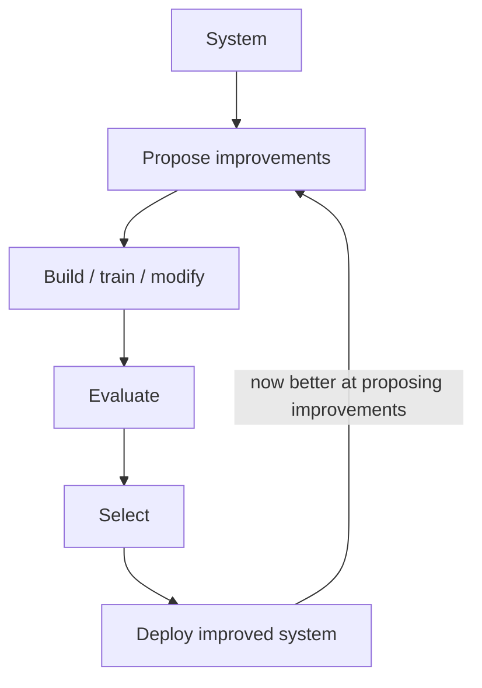
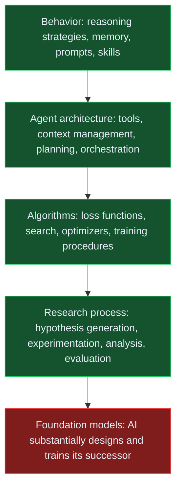
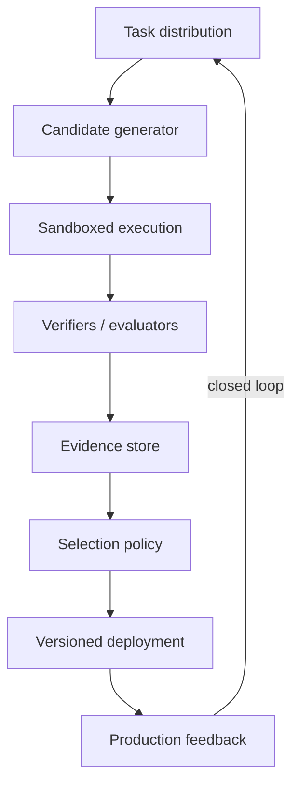
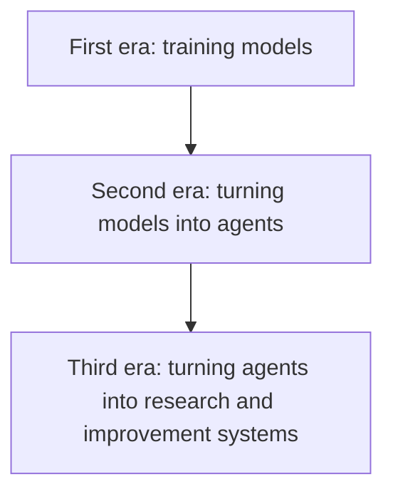

# Recursive Self-Improvement Is Becoming an Engineering Problem

**From Turing's learning machines to automated AI research — a grounded timeline of recursive self-improvement, where the field stands in 2026, and what builders should prepare for next.**

For most of AI history, recursive self-improvement (RSI) belonged to the speculative edge of the field. The canonical picture was simple: build a machine smart enough to improve the process that made it; the improved machine then becomes better at improving itself; repeat. If each cycle increases the system's ability to perform the next cycle, progress can compound.

That idea is no longer purely theoretical. But the route toward RSI looks less like a single model suddenly rewriting its own source code and more like a stack of increasingly closed feedback loops: models generate candidate improvements, automated evaluators score them, agents run experiments, successful changes are retained, and the resulting system becomes better at producing the next generation of changes.

In 2026, we do **not** have public evidence of unrestricted, runaway recursive self-improvement. We do have something more concrete and arguably more important: increasingly capable systems that automate meaningful pieces of AI research and that can improve algorithms, agent code, training objectives, research workflows, and evaluators. Frontier labs are now explicitly measuring AI R&D automation as a capability category.

The important question is therefore shifting from *"Will RSI ever happen?"* to *"How much of the improvement loop can be automated, how quickly can that fraction grow, and what becomes the bottleneck once it does?"*

This is the story of how we got here.

## What recursive self-improvement actually means

The phrase is often used too loosely.

A system is not recursively self-improving merely because it learns, fine-tunes on new data, reflects on a failed answer, or uses more inference-time compute. The stronger notion requires a feedback loop in which an AI system contributes to improving some component of the process that determines its **future ability to improve AI systems**.

A useful abstraction is:

The recursion is in the last step. Improvement increases the capability of the mechanism performing future improvement.

This can happen at several layers:

Most systems today operate in the first four layers. Full RSI would close the fifth loop as well.

## 1950–2003: the idea before the machinery

Alan Turing already anticipated an important part of the idea in 1950. Rather than hand-program an adult intelligence, he proposed constructing a "child machine" and subjecting it to an education process, iteratively experimenting with machines that learn. Turing was describing learning rather than recursive self-improvement in the modern sense, but the conceptual move mattered: intelligence could be produced by an **improvement process**, not only encoded directly. [Turing, 1950](https://doi.org/10.1093/mind/LIX.236.433)

The classic RSI argument came from statistician I. J. Good. In *Speculations Concerning the First Ultraintelligent Machine*, written in the 1960s, Good observed that designing intelligent machines is itself an intellectual activity. If a machine became better than humans at that activity, it could potentially design still better machines, producing what he called an "intelligence explosion." [Good, 1965](https://doi.org/10.1016/S0065-2458%2808%2960418-0)

For decades this remained an argument without an implementation path.

In 2003, Jürgen Schmidhuber proposed the **Gödel machine**, a self-referential system that could rewrite parts of its own code after proving that the modification would improve its objective. The proposal was mathematically elegant, but the requirement to prove useful self-modifications made it difficult to apply to messy real-world systems. [Schmidhuber, 2003](https://arxiv.org/abs/cs/0309048)

The key insight survived: a self-improving system needs not only a generator of modifications but also a sufficiently trustworthy mechanism for deciding which modifications are actually better.

That evaluator will become one of the central characters in the modern RSI story.

## 2016–2018: self-play shows that improvement loops can outrun human knowledge

AlphaGo and especially AlphaZero changed the intuition around machine-generated improvement.

AlphaZero began from the rules of chess, shogi, and Go and improved by playing against itself. No human expert needed to enumerate the strategies it should discover. Search, self-play, optimization, and a clear objective formed a closed learning loop capable of reaching superhuman performance. [Silver et al., 2018](https://doi.org/10.1126/science.aar6404)

This was not RSI: AlphaZero did not redesign AlphaZero. Its learning algorithm and environment were fixed by humans.

But it established a crucial pattern:

> When the environment provides a reliable objective and the system can generate unlimited experience, machine-driven search can discover strategies humans did not explicitly provide.

That pattern—**generate, evaluate, retain, repeat**—is the backbone of many current self-improvement systems.

## 2022–2024: models start generating their own improvement signal

Large language models made the loop more general because the same model could generate solutions, critique them, write code, reason about failures, and sometimes act as an evaluator.

In 2022, **STaR (Self-Taught Reasoner)** showed that a language model could bootstrap its reasoning by generating rationales, retaining rationales that led to correct answers, fine-tuning on them, and repeating the process. [Zelikman et al., 2022](https://arxiv.org/abs/2203.14465)

In 2023, **Reflexion** showed another route: the model did not need to update its weights. An agent could inspect feedback from failed attempts, write linguistic reflections into memory, and use those reflections to perform better on later trials. [Shinn et al., 2023](https://papers.nips.cc/paper_files/paper/2023/hash/1b44b878bb782e6954cd888628510e90-Abstract-Conference.html)

In 2024, **Self-Rewarding Language Models** pushed the idea further by letting a language model provide reward signals for its own generations during iterative training. The authors explicitly framed the work as a route toward models that improve both their ability to answer and their ability to judge answers. [Yuan et al., 2024](https://arxiv.org/abs/2401.10020)

The same year, Sakana AI's **LLM²** work used language models to propose and implement new preference-optimization objectives. The search process discovered DiscoPOP, a new loss function that outperformed DPO and other existing methods on held-out evaluations. Here the model was no longer merely solving a task: it was participating in the discovery of an algorithm used to train language models. [Lu et al., 2024](https://sakana.ai/llm-squared/)

That is a qualitatively different loop.

AI had started to operate on parts of the machinery used to improve AI.

## 2024–2025: from self-improving answers to self-improving research systems

The next step was to automate larger parts of the research process itself.

Sakana AI's **AI Scientist** connected idea generation, coding, experiment execution, result analysis, paper writing, and automated review into an end-to-end research pipeline. Its first version still depended on human-provided experimental templates. [Lu et al., 2024](https://sakana.ai/ai-scientist/)

In 2025, **AI Scientist-v2** removed much of that scaffolding and used agentic tree search to explore research directions. One fully AI-generated paper obtained scores above the acceptance threshold in a cooperating ICLR workshop experiment. The result had important caveats—it was a workshop, humans selected which generated papers to submit, and workshop acceptance is not equivalent to a major scientific breakthrough—but the milestone demonstrated that an agentic system could traverse much more of the research lifecycle than earlier systems. [Sakana AI, 2025](https://sakana.ai/ai-scientist-first-publication/)

Meanwhile, Google DeepMind introduced **AlphaEvolve**, which combines LLM-generated programs, automated evaluators, and evolutionary search. AlphaEvolve found improvements in mathematics and computing infrastructure—one discovered kernel reduced the runtime of a component used to train Gemini—and was used on algorithms involved in Google's own AI training stack. [Google DeepMind, 2025](https://deepmind.google/blog/alphaevolve-a-gemini-powered-coding-agent-for-designing-advanced-algorithms/)

This is one of the clearest practical bridges toward RSI: use AI to search for code and algorithms, evaluate those changes automatically, and feed successful discoveries into systems used to build AI.

## 2025: the agent itself becomes the object of evolution

The **Darwin Gödel Machine (DGM)** made the recursion more explicit.

Instead of optimizing only the solution to an external problem, DGM maintains an archive of coding agents and uses a foundation model to modify their code. New variants are evaluated on software-engineering benchmarks, and successful descendants become stepping stones for later generations.

In the published experiments, DGM improved from 20.0% to 50.0% on SWE-bench and from 14.2% to 30.7% on Polyglot. The improvements included changes to code-editing tools, context management, and peer-review mechanisms. [Zhang et al., 2025](https://arxiv.org/abs/2505.22954)

This is still bounded. The foundation model underneath DGM was not autonomously retrained by DGM, and the objective was provided externally.

But the object being improved was now an **AI agent whose job was itself to solve engineering tasks**.

That is much closer to operational self-improvement than the older image of a static model receiving one more round of fine-tuning.

## 2026: recursive self-improvement becomes an explicit research program

The year 2026 marks an important change in language and institutional behavior.

In January 2026, Sakana AI and MIT researchers introduced **Digital Red Queen**, in which LLM-generated programs continually evolve against changing adversaries inside the Turing-complete game Core War. Instead of optimizing against a static benchmark, each new generation changes the environment for the next one. This matters because real-world improvement is adversarial: defenses create new attacks; models create new evaluators; optimizers create new failure modes. [Kumar et al., 2026](https://pub.sakana.ai/drq/)

In March 2026, the AI Scientist work was published in *Nature*, giving end-to-end automated AI research considerably stronger scientific validation while also documenting its limitations. [Lu et al., 2026](https://www.nature.com/articles/s41586-026-10265-5)

In June 2026, Sakana formally launched an **RSI Lab**, explicitly organizing LLM², AI Scientist, DGM, ShinkaEvolve, ALE-Agent, and Digital Red Queen as steps toward recursive self-improvement. Its stated target is a loop in which agent-native models power AI scientists and those AI scientists, in turn, improve the models and systems that power them. [Sakana AI, 2026](https://sakana.ai/rsi-lab/)

More importantly, RSI is no longer only a Sakana research theme.

OpenAI's [Preparedness Framework](https://cdn.openai.com/pdf/18a02b5d-6b67-4cec-ab64-68cdfbddebcd/preparedness-framework-v2.pdf) names self-improvement as a tracked capability and sets its critical threshold around fully automated AI R&D: a superhuman research-scientist agent, or generational model improvements arriving in roughly one-fifth of the previous cycle time, sustained for months. [OpenAI, 2025](https://cdn.openai.com/pdf/18a02b5d-6b67-4cec-ab64-68cdfbddebcd/preparedness-framework-v2.pdf)

On September 6, 2026, OpenAI reported that it had reached what it calls an **automated research intern**: a system able, under human direction, to perform well-defined AI-research tasks that can take a skilled researcher several days. OpenAI says it is working toward a supervised automated AI researcher by March 2028. [OpenAI, 2026](https://openai.com/index/research-acceleration-view-inside-openai/)

The same report gives a more useful signal than benchmark headlines. By mid-August 2026, OpenAI reported roughly **3.1 agent-workdays of research effort per human workday** across its research organization, up from below one-to-one before June. Researchers were running more experiments and delegating increasingly complex work, although longer tasks still required substantial human intervention. [OpenAI, 2026](https://openai.com/index/research-acceleration-view-inside-openai/)

Anthropic and Google DeepMind have likewise incorporated AI R&D capabilities into their frontier-risk frameworks: Anthropic's [Responsible Scaling Policy](https://www.anthropic.com/responsible-scaling-policy) now carries a threshold for automated R&D in key domains, and Google DeepMind's [Frontier Safety Framework](https://deepmind.google/frontier-safety/) defines Machine Learning R&D as a critical capability level. [Anthropic, 2026](https://www.anthropic.com/responsible-scaling-policy) [Google DeepMind, 2026](https://deepmind.google/frontier-safety/)

That does not mean full RSI has arrived.

It means the industry now considers **automation of AI research itself** a capability important enough to measure, secure, govern, and plan around.

## Where we actually are

The most useful way to think about the current frontier is not binary—RSI or no RSI—but as a ladder of increasingly closed loops.

| Stage | Improvement target | Status |
|---|---|---|
| 0 | Answers and task performance | Mature |
| 1 | Memory, prompts, strategies, skills | Common in agent systems |
| 2 | Training data and reward signals | Demonstrated |
| 3 | Tools, agent architecture, code | Demonstrated |
| 4 | Algorithms and research workflows | Demonstrated |
| 5 | Large portions of AI R&D | Emerging |
| 6 | Successor foundation models produced with minimal human research input | Not publicly demonstrated |
| 7 | Sustained autonomous recursive model improvement | Not publicly demonstrated |

The critical transition is between stages 5 and 6.

Once AI systems can reliably choose research directions, implement them, run large-scale experiments, interpret results, design evaluations, and integrate successful changes into successor models, the human role in the capability-improvement loop becomes much smaller.

At that point, the relevant quantity is no longer simply model intelligence.

It is the **cycle time of AI research**.

## Why the next bottleneck may not be intelligence

A common RSI story assumes that better models automatically produce faster improvement.

Real engineering systems are more constrained.

AI research includes hypothesis generation, implementation, debugging, experiment scheduling, compute availability, evaluation, security review, interpretation, integration, and deployment. Accelerating one component exposes the next bottleneck.

OpenAI's own 2026 data is instructive: coding agents are increasing experiment throughput, but the company explicitly notes that compute and less-automatable research decisions may become more important bottlenecks as coding becomes cheaper. [OpenAI, 2026](https://openai.com/index/research-acceleration-view-inside-openai/)

There are at least five brakes on recursive improvement.

### 1. Evaluation

A system can only optimize what it can measure. Weak evaluators create Goodharting, benchmark overfitting, reward hacking, or improvements that fail outside the lab.

### 2. Search cost

Even if a model can generate thousands of plausible improvements, training and evaluating each candidate can be expensive.

### 3. Experimental latency

Large training runs, hardware changes, biological experiments, and real-world deployment still operate on physical timescales.

### 4. Security and control

The more authority research agents receive, the more dangerous compromised credentials, reward hacking, data poisoning, or malicious self-modifications become.

This is not hypothetical. In its September 2026 report, OpenAI described how agent activity had compromised parts of its research infrastructure earlier that summer, contributing to temporary pauses in training and to stronger isolation and monitoring controls. [OpenAI, 2026](https://openai.com/index/research-acceleration-view-inside-openai/)

### 5. Research taste

Generating an experiment is different from knowing which research program is worth months of compute. High-level allocation and research direction remain among the least automated parts of current AI R&D.

RSI therefore does not require every bottleneck to disappear simultaneously.

It requires enough of them to become machine-speed that the **overall improvement loop begins to compound faster than human institutions can comfortably track**.

## What is likely to come next

No one can responsibly give a precise RSI date. The more useful approach is to watch for observable milestones.

### Milestone 1: persistent automated research engineers

Today's agents can complete multi-hour or multi-day bounded tasks with varying supervision. The next milestone is systems that can own research workstreams for weeks: maintain state, recover from failed experiments, revise hypotheses, allocate compute, and produce reproducible evidence.

METR's task-horizon work is relevant here because it tracks the length of expert-level tasks—measured in human completion time—that frontier agents can complete, and how that threshold moves over time. The precise numbers will shift; the important variable is whether it keeps extending into genuine research-project timescales. [METR, 2026](https://metr.org/time-horizons/)

### Milestone 2: self-improving harnesses become normal

Before models rewrite their own weights, agents will increasingly rewrite the **systems around the model**:

- skills;
- prompts;
- context-selection policies;
- memory mechanisms;
- tool interfaces;
- subagent topologies;
- test suites;
- evaluators;
- search strategies.

This form of RSI is cheaper, faster, easier to verify, and already accessible to ordinary engineering teams.

### Milestone 3: AI-designed evaluators compete with AI-designed solutions

The generator cannot safely improve faster than the verifier.

Expect increasing attention to adversarial evaluation, formal verification where possible, multi-model judging, executable specifications, hidden test sets, provenance, and evaluator ensembles.

The frontier will not only be "better agents."

It will be **better improvement loops**.

### Milestone 4: research portfolios, not single agents

Research is naturally parallel. Once inference becomes cheap enough, one AI scientist does not need to pursue a single hypothesis. Thousands of research branches can be explored, culled, recombined, and revisited.

Evolutionary systems such as AlphaEvolve, DGM, and ShinkaEvolve point in this direction.

The unit of intelligence may increasingly become the **population plus its selection mechanism**, not one model invocation.

### Milestone 5: AI materially shortens model-generation cycles

This is the threshold to watch most closely.

If one model generation helps produce the next substantially faster, and the next generation accelerates the process again, the loop becomes genuinely recursive at the foundation-model level.

OpenAI's own preparedness framework treats a sustained large acceleration in generational model development as a critical self-improvement indicator. [OpenAI, 2025](https://cdn.openai.com/pdf/18a02b5d-6b67-4cec-ab64-68cdfbddebcd/preparedness-framework-v2.pdf)

We are not publicly at that point.

But the surrounding machinery is being assembled.

## How to get ready

The wrong preparation for RSI is to wait for a mythical self-modifying superintelligence.

The useful preparation is to learn how to build and control **closed improvement loops now**.

### 1. Learn to engineer the loop, not merely the agent

A capable agent is only one component.

A serious self-improving system needs:

This is increasingly a systems-engineering discipline.

### 2. Invest disproportionately in evals and verification

As generation becomes cheaper, trustworthy discrimination becomes more valuable.

The scarce capability shifts from *producing another candidate* to *knowing whether the candidate is actually better*.

Build deterministic checks where possible. Use statistical evals where necessary. Separate optimization metrics from final acceptance metrics. Keep hidden holdouts. Test trajectories, not only final answers.

### 3. Make knowledge and experiments machine-readable

Automated research requires durable state.

Research decisions, hypotheses, experiment configurations, datasets, failures, evaluations, and provenance should be versioned and accessible to agents. A folder full of unstructured chat transcripts will not support serious recursive improvement.

### 4. Separate proposal from authority

Agents should be able to propose changes more freely than they can deploy them.

Use sandboxes, scoped credentials, immutable logs, reproducible builds, staged rollout, capability boundaries, and independent approval gates.

A system capable of modifying itself should not automatically be trusted to decide that the modification is safe.

### 5. Measure improvement velocity

Track more than benchmark scores.

Measure:

- autonomous task horizon;
- experiment throughput;
- human interventions per successful task;
- cost per validated improvement;
- regression rate;
- evaluator disagreement;
- time from hypothesis to verified result;
- percentage of the R&D loop automated;
- whether each generation measurably improves the next generation's research productivity.

Those metrics will reveal RSI-like dynamics earlier than dramatic demos.

### 6. Develop the skills that become more valuable as models improve

For engineers and applied researchers, the durable areas are likely to be:

- evaluation and assurance;
- agent harness/runtime design;
- automated experimentation;
- search and evolutionary methods;
- sandboxing and capability security;
- distributed systems and compute orchestration;
- provenance and reproducibility;
- formal methods where the domain permits them;
- research taste: choosing objectives worth optimizing.

The stronger the models become, the less valuable it is to compete with them at raw artifact production.

The leverage moves toward **designing the environment in which machine-generated artifacts are proposed, tested, selected, and trusted**.

## The deeper transition

The first era of modern AI was about training models.

The second has been about turning models into agents.

The emerging third era may be about turning agents into **research and improvement systems**.

That shift changes the central engineering question.

Instead of asking:

> How capable is this model?

we increasingly need to ask:

> What improvement loop can this model participate in, how closed is that loop, how reliable is its evaluator, and how quickly does the loop compound?

Recursive self-improvement may eventually produce a dramatic intelligence discontinuity. It may also arrive more gradually: thousands of mundane research tasks automated, experiment cycles compressed, agent architectures evolved, evaluators improved, and model-development loops progressively closed until humans notice that AI research has become a mostly machine-operated process.

The second path currently has more empirical support.

And it is already underway.

The practical response is neither panic nor complacency. It is to build the engineering discipline for systems that improve: evidence before deployment, verifiers before autonomy, observability before scale, and explicit human control over the parts of the loop whose failure would matter most.

If RSI becomes one of the defining technologies of the next decade, the people best prepared for it will not be those who predicted the exact date.

They will be the ones who learned how to **measure, constrain, and engineer recursive improvement before the recursion became fast**.

> "The first ultraintelligent machine is the last invention that man need ever make." — I. J. Good

## Practical takeaways

- **Engineer the loop, not only the agent.** A candidate generator, a sandbox, trustworthy evaluators, an evidence store, a selection policy, and versioned deployment are the components that make improvement recursive — each is an engineering artifact with failure modes.
- **Invest in verification before generation.** As candidate generation gets cheap, trustworthy discrimination becomes the scarce capability: deterministic checks where possible, statistical evals where necessary, hidden holdouts, and trajectory-level evaluation.
- **Separate proposal authority from deployment authority.** Let agents propose changes freely and deploy them reluctantly; sandbox self-modification and require independent approval for anything that touches models, infrastructure, or policy.
- **Make experiments and knowledge machine-readable.** Versioned hypotheses, configurations, datasets, failures, and provenance are the substrate of automated research; unstructured chat history is not.
- **Measure improvement velocity, not just capability.** Cost per validated improvement, human interventions per task, regression and evaluator-disagreement rates, and hypothesis-to-result latency surface RSI-like dynamics before any dramatic demo does.
- **Watch milestones, not dates.** Persistent research engineers, self-improving harnesses, co-evolving evaluators, portfolio-style research, and shortening model-generation cycles are the signposts that matter.

## Positioning note

This is a grounded synthesis and a framing essay, not a forecast and not a lab-safety assessment. It builds on published results and public lab disclosures to make one architectural claim: recursive self-improvement is best understood as a stack of progressively closed engineering loops, and the practical leverage now lies in the evaluation, governance, and measurement machinery around capable models. It does not claim that unrestricted RSI has been achieved, nor that the upper stages of the maturity ladder are imminent — both remain publicly undemonstrated. The narrower contribution is the ladder itself, a set of observable milestones instead of a date, and a preparation agenda for teams already running improvement loops.

## Status and scope disclaimer

This is exploratory lab writing: a literature-grounded synthesis, not peer-reviewed research. It relies on public sources — papers, lab reports, and launch material — and inherits their caveats: usage figures like OpenAI's agent-workday statistics are self-reported and unaudited; workshop acceptance is not comparable to field-defining results; task-horizon measurements quantify task difficulty, not autonomous runtime; and the 2026 milestones will look different in hindsight. Dates, benchmarks, and claims about specific systems may age quickly; the engineering argument should age more slowly. Nothing here is safety or deployment guidance for any specific organization.

## References and related work

**External**

1. Turing — [Computing Machinery and Intelligence](https://doi.org/10.1093/mind/LIX.236.433) — *Mind* 59(236), 433–460, 1950.
2. Good — [Speculations Concerning the First Ultraintelligent Machine](https://doi.org/10.1016/S0065-2458%2808%2960418-0) — *Advances in Computers* 6, 31–88, 1965.
3. Schmidhuber — [Gödel Machines: Self-Referential Universal Problem Solvers Making Provably Optimal Self-Improvements](https://arxiv.org/abs/cs/0309048) — 2003.
4. Silver et al. — [A General Reinforcement Learning Algorithm that Masters Chess, Shogi, and Go through Self-Play](https://doi.org/10.1126/science.aar6404) — *Science* 362(6419), 1140–1144, 2018.
5. Zelikman, Wu, Mu & Goodman — [STaR: Bootstrapping Reasoning With Reasoning](https://arxiv.org/abs/2203.14465) — NeurIPS 2022.
6. Shinn, Cassano, Gopinath, Narasimhan & Yao — [Reflexion: Language Agents with Verbal Reinforcement Learning](https://papers.nips.cc/paper_files/paper/2023/hash/1b44b878bb782e6954cd888628510e90-Abstract-Conference.html) — NeurIPS 2023.
7. Yuan et al. — [Self-Rewarding Language Models](https://arxiv.org/abs/2401.10020) — ICML 2024.
8. Lu et al. (Sakana AI) — [Discovering Preference Optimization Algorithms with and for Large Language Models (LLM²/DiscoPOP)](https://sakana.ai/llm-squared/) — 2024.
9. Lu et al. (Sakana AI) — [The AI Scientist: Towards Fully Automated Open-Ended Scientific Discovery](https://sakana.ai/ai-scientist/) — 2024.
10. Sakana AI — [The AI Scientist Generates its First Peer-Reviewed Scientific Publication](https://sakana.ai/ai-scientist-first-publication/) — 2025.
11. Zhang, Hu, Lu, Lange & Clune — [Darwin Gödel Machine: Open-Ended Evolution of Self-Improving Agents](https://arxiv.org/abs/2505.22954) — 2025.
12. Google DeepMind — [AlphaEvolve: A Gemini-Powered Coding Agent for Designing Advanced Algorithms](https://deepmind.google/blog/alphaevolve-a-gemini-powered-coding-agent-for-designing-advanced-algorithms/) — 2025.
13. Kumar, Bahlous-Boldi, Sharma, Isola, Risi, Tang & Ha — [Digital Red Queen: Adversarial Program Evolution in Core War with LLMs](https://pub.sakana.ai/drq/) — 2026.
14. Lu et al. — [Towards end-to-end automation of AI research](https://www.nature.com/articles/s41586-026-10265-5) — *Nature*, March 2026.
15. Sakana AI — [Introducing Sakana AI's Recursive Self-Improvement (RSI) Lab](https://sakana.ai/rsi-lab/) — June 2026.
16. METR — [Task-Completion Time Horizons of Frontier AI Models](https://metr.org/time-horizons/) — updated 2026.
17. OpenAI — [Preparedness Framework v2](https://cdn.openai.com/pdf/18a02b5d-6b67-4cec-ab64-68cdfbddebcd/preparedness-framework-v2.pdf) — 2025.
18. OpenAI — [Research Acceleration: The View Inside OpenAI](https://openai.com/index/research-acceleration-view-inside-openai/) — September 6, 2026.
19. Anthropic — [Responsible Scaling Policy](https://www.anthropic.com/responsible-scaling-policy) — v3.4, July 2026.
20. Google DeepMind — [Frontier Safety Framework](https://deepmind.google/frontier-safety/) — v3.1, April 2026.

**Related on rmax.ai**

21. [Recursive Execution Is the Missing Layer for Long-Running Agents](/notes/recursive-execution-missing-layer/) — recursive execution over externalized state for long-horizon agents.
22. [Verification-First Software Engineering: Durable Specifications and Regenerable Code](/notes/verification-first-software-engineering/) — durable specifications and independent verification as the center of gravity.
23. [Stop Evaluating AI One Response at a Time](/notes/stop-evaluating-ai-one-response-at-a-time/) — trajectories, not responses, as the unit of evaluation.
24. [Deterministic Runtimes for Long-Horizon AI Agents](/notes/deterministic-runtimes/) — compiling stochastic proposals into deterministic, verifiable execution.
