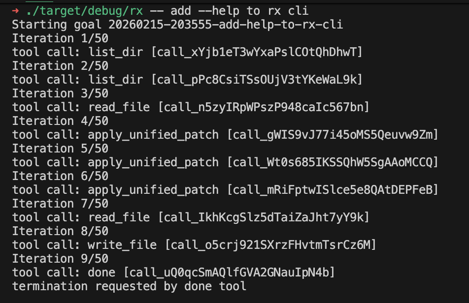
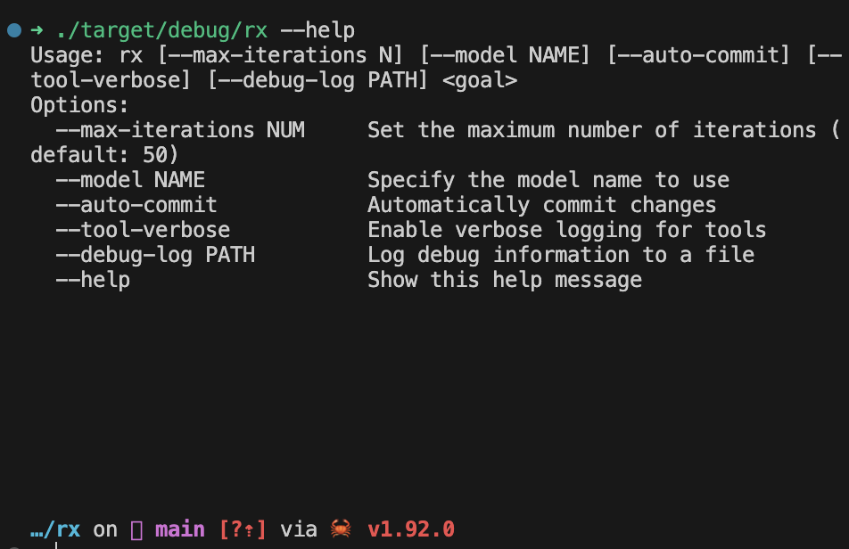

# rx: Why Lean Agent Kernels Beat General Coding Frameworks

## Abstract
Most coding-agent frameworks optimize for breadth: plugin ecosystems, dynamic tool registries, layered planners, and expanding default behaviors. That posture is often fine when agents are used occasionally. When agents become infrastructure—spawned frequently, run in parallel, audited, and costed—those layers become compounding overhead and a source of drift.

`rx` takes the opposite posture: a strict microkernel agent where the kernel owns the control loop, tools own side effects, state is persisted as structured events, and transport is replaceable. The goal is operational control (predictable behavior and cost) rather than feature completeness.

## Context & motivation
“Coding agents” have converged on a common platform shape: large system prompts, multi-layer orchestration, plugin systems, auto-discovered tools, telemetry hooks, and auto-updating behaviors. The platform approach is rational—users want broad capability out of the box—but it carries an assumption: the marginal cost of abstraction is small.

That assumption breaks at scale. When agents run as part of daily production workflows (CI, migrations, release engineering, incident response, batch refactors, repo hygiene), the cost of “invisible” layers becomes visible as:
- token overhead and prompt bloat,
- cold-start latency and memory pressure,
- behavioral drift from implicit defaults,
- audit gaps (“why did it do that?”),
- non-local failure modes (a feature added for one use case degrades another).

The motivation behind `rx` is operational: make the agent small enough to understand, stable enough to trust, and constrained enough to run repeatedly with predictable cost and behavior.

## Core thesis
General-purpose coding frameworks optimize for breadth; lean agent kernels optimize for control. If you intend to run agents as infrastructure, a minimal microkernel architecture outperforms feature-heavy frameworks on determinism (in the practical sense), scalability, debuggability, and total cost of ownership.

## Mechanism / model
`rx` is organized around four constraints:

- **Kernel decides.**
- **Tools act.**
- **State persists.**
- **Transport delivers.**

This is not an aesthetic separation; it is an operational one.

### Microkernel architecture
A microkernel agent keeps the kernel small and makes everything else a replaceable dependency:

```
+--------------------------+
|      Transport Layer     |  CLI | HTTP | Worker
+--------------------------+
|        Kernel Core       |  Loop | Dispatch | Control
+--------------------------+
|        Tool Runtime      |  exec | fs | net | custom
+--------------------------+
|      State Backend       |  memory | sqlite | future
+--------------------------+
```

### Example: goal → result
Here’s a concrete illustration of how a lean kernel treats the loop as the product:

**Goal definition (input):**


**After the goal is achieved (result):**


- **Kernel core**
  - Owns the autonomous loop and termination logic.
  - Dispatches tool calls and enforces explicit boundaries.
  - Enforces iteration limits and progress checks.
  - Persists structured events (inputs, decisions, tool results, errors).

- **Tool runtime**
  - Implements side effects (filesystem, shell, network, custom APIs).
  - Exposes a narrow, explicit interface—no implicit tool injection.

- **State backend**
  - Stores an append-only event log (memory, sqlite, etc.).
  - Enables auditability and replay-oriented debugging.

- **Transport**
  - Delivers requests and responses (CLI, HTTP, workers).
  - Does not change agent semantics.

### Execution model: the loop as the product
Each iteration is explicit:

1. Observe current state.
2. Decide next action (LLM).
3. Invoke tool.
4. Persist event.
5. Evaluate termination.

Termination occurs when:
- `done(reason)` is invoked,
- an iteration cap is reached,
- no progress is detected,
- a fatal error occurs.

The key design choice is negative space: no hidden planners, background tool injection, implicit retries, or “helpful” behaviors that bypass the loop. The loop is the control surface.

### Why this yields determinism (practically)
Determinism here is operational, not philosophical. The system is “deterministic by construction” in the sense that all meaningful transitions are forced through the same small set of explicit steps and captured as events.

You still have nondeterminism from the model, the environment, and tools—but you can bound it, observe it, and replay the decision/action sequence more reliably when:
- the kernel is small,
- side effects are explicit,
- state is an append-only event log.

## Concrete examples
### Example 1: mechanical refactoring at scale
Task: apply a repeated refactor across a large repo (rename an API, update call sites, adjust imports, fix formatting).

A general agent framework often brings along:
- large prompt scaffolding ("planner", "critic", "reflection"),
- dynamic tool selection and evolving tool schemas,
- convenience behaviors (implicit retries, “safe mode” fallbacks),
- extra context injection (analytics, memory summaries, plugin metadata).

At small scale, this can feel helpful. At scale, it can create:
- unpredictable token consumption per file,
- inconsistent decisions between runs,
- unclear attribution for why a change was made.

A lean kernel approach keeps the job mechanical:
- The kernel iterates: select file → propose patch → run checks → persist event.
- Tools provide only what’s needed (read file, apply patch, run targeted command).
- State records each attempted edit and its verification output.

When a run fails mid-way, you can resume from the event log with clear boundaries: which patches were applied, which checks failed, and which decision led to the next action.

### Example 2: narrow repeated goals ("agent as a service")
Task: daily hygiene workflow (update changelog links, regenerate sitemap, validate schema, fix broken references).

A platform agent’s breadth can be counterproductive: it may “improve” prose, refactor unrelated code, or activate tools that widen scope. A kernel-first agent can be configured as an execution engine:
- fixed tool surface (only the tasks needed),
- strict iteration cap and “no progress” termination,
- explicit `done(reason)` requirement with summarized deltas.

For this class of work, repeatability matters more than creativity; the kernel enforces that.

### Example 3: distill-and-deploy pattern
Strategic pattern:
1. Use frontier models to explore and design a workflow.
2. Distill the workflow into a small set of prompts, invariants, and tool contracts.
3. Deploy smaller (or cheaper) models inside a minimal kernel for routine execution.

The kernel makes this viable because it holds the invariants steady while swapping model capability and cost profiles over time.

## Trade-offs & failure modes
A microkernel posture is not free; it moves complexity from “defaults” into explicit design.

- **Trade-off: less out-of-the-box capability**
  - Failure mode: users expect a platform; the kernel feels like “missing features”.
  - Mitigation: treat tools as the extension point, but keep tool interfaces narrow and stable.

- **Trade-off: more responsibility on tool contracts**
  - Failure mode: a leaky tool (implicit retries, hidden state) reintroduces unpredictability.
  - Mitigation: enforce tool purity where possible, log side effects, and version tool schemas.

- **Trade-off: model nondeterminism remains**
  - Failure mode: repeated runs diverge even with the same code and tools.
  - Mitigation: constrain context, cap iterations, add progress checks, and persist the full event log to support replay and analysis.

- **Failure mode: kernel creep**
  - As new use cases arrive, the kernel is tempted to absorb convenience features (planners, memories, routing).
  - Mitigation: a hard rule—if a component grows large, it does not belong in the kernel.

- **Failure mode: false sense of determinism**
  - A tidy loop can hide environmental nondeterminism (filesystem timing, flaky tests, network variance).
  - Mitigation: make non-deterministic tools explicit, record inputs/outputs, and prefer deterministic verification steps.

Guiding constraint: “Simplicity is prerequisite for reliability.” — Edsger W. Dijkstra

## Practical takeaways (3–5)
- Prefer a small kernel with an explicit loop over layered orchestration when the agent will run repeatedly and be operationally owned.
- Keep tools responsible for side effects; keep the kernel responsible for control, limits, and persistence.
- Persist an append-only event log; treat auditability and resumability as first-class features.
- Enforce caps and progress checks; termination is part of the design, not an afterthought.
- Resist kernel creep; add capability via narrow tools and stable contracts, not by growing the core.

## Positioning note
This is not an argument that general coding-agent frameworks are “bad.” They are often the right choice for interactive, exploratory, or one-off work where breadth and convenience dominate.

The claim here is narrower: once agents become infrastructure, the operational properties of a lean microkernel (control, predictability, auditability, cost discipline) matter more than maximal capability.

## Status & scope disclaimer
This note describes an architectural stance and execution model for `rx` as a minimal autonomous systems agent. It intentionally omits product concerns (UI, embeddings/vector databases, orchestration meshes, complex plugin ecosystems) and treats them as non-goals unless forced by real operational constraints.

The focus is on control surfaces, determinism-by-construction in the loop, and the separation of kernel/tool/state/transport—principles meant to remain stable even as models and environments evolve.
