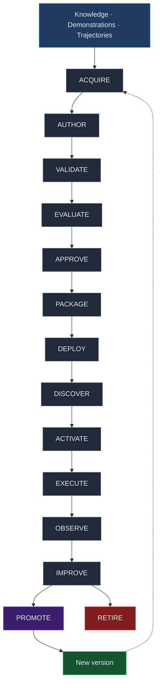
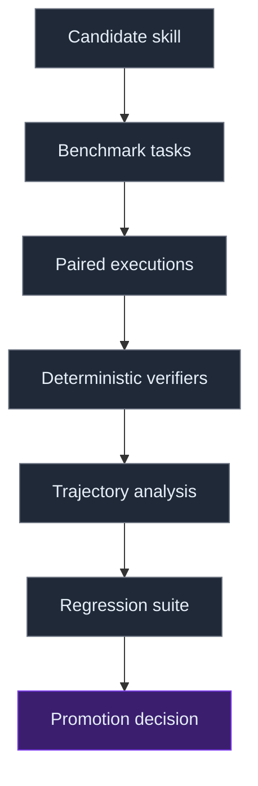
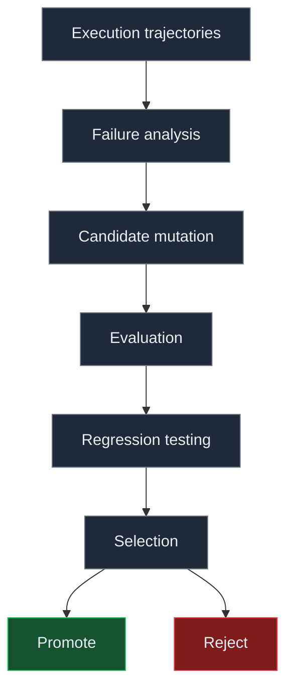
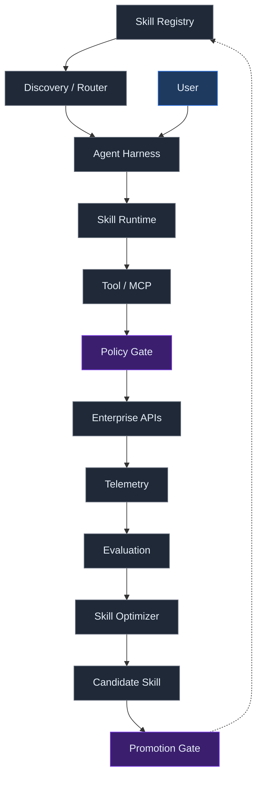

If a skill can influence how an agent interacts with customer data, infrastructure, financial systems, internal workflows, or production APIs, changing that skill is potentially a behavioral deployment.

Editing *"Before refunding the customer, request manager approval."* into *"Refund automatically when the amount is below €500."* is not merely documentation maintenance.

It changes agent behavior.

That suggests that production skills should eventually be treated as versioned behavioral artifacts.

Agent skills are rapidly becoming a standard way to package procedural knowledge for AI agents.

The emerging format is surprisingly simple: a directory containing a SKILL.md file, optionally accompanied by scripts, references, and assets. Instead of putting every instruction into an enormous system prompt, an agent can discover available skills and load the relevant procedural knowledge only when it needs it.

This solves an important problem.

It does not solve the harder one.

If skills become a serious mechanism for encoding how organizations perform work, enterprises will eventually need much more than a file format and a loading mechanism. They will need infrastructure for determining where skills came from, whether they work, what they are allowed to do, which version should be deployed, whether a new version is better than the previous one, and when a skill should be retired.

In other words, the important abstraction may not ultimately be the skill. It may be the skill lifecycle.

## From prompts to procedural infrastructure

Large language models contain enormous amounts of general knowledge, but enterprise work frequently depends on knowledge that is local, procedural, and organization-specific.

Knowing SQL is different from knowing how a particular company expects a production database migration to be performed.

Knowing what an incident is differs from knowing:

- which evidence must be collected
- how severity is determined
- which systems must be queried
- when approval is required
- who should be notified
- what must never be changed automatically
- and how completion is verified

This distinction helps separate several components that are often collapsed together:

```
Model       →  general reasoning capability
Knowledge   →  facts and organizational context
Skill       →  procedure for performing a class of tasks
Tool        →  capability for taking an action
Policy      →  constraints on which actions are permitted
```

Agent Skills provide an increasingly concrete representation for the procedural layer.

The open [Agent Skills specification](https://agentskills.io/specification) defines a skill as a directory containing at least a SKILL.md file with YAML metadata and Markdown instructions. Skills can additionally package executable scripts, reference documents, templates, schemas, and other resources.

Anthropic describes the mechanism using [progressive disclosure](https://www.anthropic.com/engineering/equipping-agents-for-the-real-world-with-agent-skills). At startup, an agent sees only compact metadata describing available skills. When a task appears relevant, it loads the corresponding SKILL.md. Additional references or scripts can then be accessed only when necessary.

Conceptually:

```
Discovery    →  name + description
Activation   →  SKILL.md
Execution    →  scripts / references / assets
```

This is an elegant answer to the context problem.

Hundreds of procedures do not need to occupy the model's context simultaneously.

But once skills become operational artifacts rather than personal prompt snippets, another problem appears.

Who manages their lifecycle?

## The missing lifecycle

A mature enterprise skill system might look something like this:



Different organizations will implement these stages differently. Some may collapse several together.

The important idea is that skill authoring is only one stage in a larger system.

And evidence from recent skill research suggests several of these stages already matter independently.

## Discovery is part of correctness

A skill cannot improve an agent if the agent never activates it.

Progressive disclosure therefore creates a routing problem.

The system must determine: does this task require one of the available skills, and if so, which one?

The Agent Skills specification makes the description field particularly important because agents use metadata to determine when a skill should be loaded.

This means skill performance is not merely `quality(skill)`.

A better conceptual model is:

```
P(success) = f(discovery, routing, skill quality, execution, tools, environment)
```

A perfectly written procedure with poor discovery metadata may never execute.

Conversely, indiscriminately loading many procedures can introduce competing instructions and unnecessary context.

[SkillsBench](https://arxiv.org/abs/2602.12670) provides evidence that this distinction matters. Across 86 tasks, 11 domains, seven agent-model configurations, and more than 7,300 trajectories, curated skills increased average pass rate by 16.2 percentage points.

But the effect was highly heterogeneous.

Software engineering improved only 4.5 percentage points, while healthcare improved by 51.9 points. Sixteen of the 84 comparable tasks actually experienced negative performance deltas.

More information was not automatically better either. The researchers found that focused skills containing two to three modules performed better than comprehensive documentation.

Procedural context therefore has an optimization problem:

```
too little         →  agent lacks procedure
focused procedure  →  useful guidance
too much           →  attention competition / irrelevant context
```

The implication is important.

Skill selection itself needs evaluation.

## Skills need CI/CD

Once skills affect runtime behavior, familiar software-engineering ideas become relevant.

| Software engineering | Skill infrastructure |
|---|---|
| Unit test | Procedural test case |
| Integration test | Agent + skill + tool execution |
| CI | Automated skill evaluation |
| Package registry | Skill registry |
| Dependency | Required tools/resources |
| Permission manifest | Required capabilities |
| Release | Skill deployment |
| Canary deployment | Limited skill rollout |
| Telemetry | Execution trajectories |
| Regression test | Previously solved tasks |
| Rollback | Previous skill version |

This is more than analogy.

Recent work is already moving in this direction.

## A skill is starting to look like software

Consider what might eventually be required of a production enterprise skill:

```
incident-response/
├── SKILL.md
├── scripts/
├── references/
├── tests/
├── evals/
├── permissions/
└── metadata/
```

The current Agent Skills specification does not require all of these components. That distinction matters.

The format currently standardizes the core packaging and discovery mechanism. The larger structure above is a proposal for what production lifecycle infrastructure may need to surround that format.

The analogy is software.

A source file is useful. But serious software engineering did not stop at source files. We accumulated: source control, dependency management, package registries, tests, CI/CD, code review, security scanning, deployment systems, observability, rollbacks.

Skills appear likely to follow a similar trajectory.

[Skilldex](https://arxiv.org/abs/2604.16911), for example, treats skills as packages distributed through hierarchical scopes and introduces compiler-style conformance checks for skill structure and metadata.

More importantly, [Agentic Continuous Evaluation of Skills (ACES)](https://arxiv.org/abs/2608.20614) argues that structural validation alone cannot answer the operational question that matters: does installing this skill actually make the agent better at its work?

ACES evaluates skills through paired executions with and without the target skill while holding the task, model, harness, workspace, and scoring policy fixed.

The resulting quantity is essentially a treatment effect:

```
Skill Lift =  performance(with skill)
            − performance(without skill)
```

Across 947 paired cases reported by ACES, the researchers measured positive composite Skill Lift in 72.8% of cases and a mean composite lift of 0.2134.

The broader implication is more important than the exact number.

A skill can be syntactically valid, beautifully documented, security-scanned, and still fail to improve the agent.

Production skill infrastructure therefore needs both:

```
STATIC VALIDATION       Does this artifact conform?
        +
BEHAVIORAL EVALUATION   Does this artifact actually help?
```

## Promotion should require evidence

Suppose an organization currently runs:

```
incident-response v17
```

Someone — or eventually another agent — creates:

```
incident-response v18
```

What makes v18 better?

The answer should not be:

```
The instructions look better.
```

Instead, treat the new skill as a candidate behavioral deployment.



Possible measurements include task success, tool accuracy, policy violations, steps to completion, invalid actions, latency, token consumption, cost, routing accuracy, and regressions.

A simple promotion policy might be:

```
PROMOTE iff
  candidate_success > parent_success
  AND regression_rate <= threshold
  AND policy_violations <= parent
  AND cost <= acceptable_budget
```

Real systems will require statistical treatment of noisy agent executions rather than single-run comparisons.

But the principle remains: skills should earn promotion through evidence.

## Self-generated skills expose the problem

The need for lifecycle infrastructure becomes even clearer when agents start creating their own skills.

At first glance, this seems like a natural path toward self-improving systems.

An agent encounters a difficult task, discovers a better strategy, writes that strategy into a reusable skill, and becomes better at future tasks.

Something like:

```
experience  →  reflection  →  new skill  →  better agent
```

SkillsBench provides a useful warning.

Curated skills improved average performance substantially, but self-generated skills provided no average benefit in the benchmark. The authors report that self-generated skills slightly underperformed the no-skill baseline overall.

That does not establish that autonomous skill improvement is impossible.

It establishes something more useful: generation is not improvement.

Writing a new procedure and proving that the procedure improves behavior are different operations.

A more defensible architecture is therefore:



This changes the meaning of self-improvement.

The agent is allowed to propose changes.

The evaluation system decides whether those changes survive.

## Self-improvement is a selection problem

This distinction connects agent skills to a much broader research question around recursive improvement.

Consider two systems.

System A: unconstrained self-modification

```
Agent
  ↓
writes better instructions
  ↓
replaces old instructions
  ↓
continues
```

System B: verified evolution

```
Agent
  ↓
proposes mutation
  ↓
independent evaluation
  ↓
selection
  ↓
promotion
```

Only the second system has an explicit mechanism preventing every mutation from becoming part of the next generation.

The interesting primitive is therefore not self-modification. It is selection under evidence.

This creates a concrete research program around agent skills: can an agent accumulate procedural capability over time if candidate skills must outperform their parents on held-out tasks before promotion?

That question is experimentally tractable.

It also connects skill engineering to ideas from automated program improvement, reinforcement learning, evolutionary optimization, and continuous evaluation.

## Skills should not become security boundaries

There is another reason to separate skill authoring from skill governance.

A skill might contain: *"Never modify production without explicit approval."*

But that instruction exists inside the same probabilistic reasoning process responsible for accomplishing the task.

It expresses desired behavior.

It does not enforce authority.

The 2026 survey [Agent Skills for Large Language Models](https://arxiv.org/abs/2602.12430) reports that 26.1% of analyzed community-contributed skills contained vulnerabilities and identifies capability-based permission models and lifecycle governance as open problems.

[Anthropic](https://platform.claude.com/docs/en/agents-and-tools/agent-skills/overview) similarly warns that malicious skills can direct agents to execute code or invoke tools in ways inconsistent with their apparent purpose, recommending that skills be installed only from trusted sources.

This suggests a fundamental architectural separation:

```
SKILL                              POLICY
"You must obtain approval           production.write =
 before changing production."         DENY unless
                                      approval_token exists
```

The skill describes how the agent should behave.

The runtime determines what the agent is capable of doing.

That means permissions, identity, approval gates, sandboxing, and capability boundaries should remain external to the natural-language procedure whenever they represent hard security requirements.

Skills can explain policy.

They should not be the mechanism enforcing it.

## The enterprise skill platform

Put these pieces together and a larger architecture appears.



Notice what has happened.

SKILL.md remains important, but it has become one component inside a larger control loop.

The enterprise platform now has responsibility for: discovery, distribution, provenance, evaluation, permissions, versioning, deployment, observability, regression detection, optimization, and retirement.

This is why the skill lifecycle, rather than the skill file itself, may become the more important enterprise abstraction.

## From execution traces to organizational learning

Once this lifecycle exists, another possibility emerges.

Every agent execution produces evidence.

Some executions succeed.

Some fail.

Some discover more efficient procedures.

Some reveal missing organizational knowledge.

Some expose procedures that no longer match reality.

Those trajectories can feed the skill lifecycle:

```
work
 ↓
execution evidence
 ↓
failure / success patterns
 ↓
candidate procedural knowledge
 ↓
evaluation
 ↓
validated skill
 ↓
deployment
 ↓
future work
```

The loop becomes:

```
WORK → EVIDENCE → PROCEDURAL KNOWLEDGE → EVALUATION → REUSABLE SKILL → BETTER WORK
  └───────────────────────────────↺───────────────────────────────┘
```

This is qualitatively different from giving employees access to a better chatbot.

The organization is building a reusable procedural layer from its accumulated interactions with AI.

A solved problem does not have to disappear into a conversation transcript.

It can leave behind an evaluated artifact.

Over time, those artifacts form something resembling organizational agent capital: reusable procedural assets that reduce the cost of future work.

## The research question

There is still a large gap between this architecture and what has been empirically demonstrated.

We know that curated skills can materially improve agent performance across some task distributions.

We have early evidence that paired runtime evaluation can measure the contribution of individual skills in enterprise repositories.

We have emerging package-management infrastructure.

And we have evidence that naive self-generation does not automatically produce useful procedural knowledge.

What we do not yet know is whether these pieces can form a reliable cumulative improvement loop.

The interesting experiment is therefore not: can an LLM write a SKILL.md file?

It obviously can.

The more consequential question is: can an agent system accumulate reliable procedural capability over time by generating candidate skills, evaluating them against held-out tasks, rejecting regressions, and promoting only demonstrated improvements?

That is the experiment worth running.

## Companion experiment: Skill Lifecycle Lab

I am building a small experimental harness around this question.

The system starts with a fixed model, deterministic simulated tools, a task distribution, and an imperfect human-authored skill.

It then performs repeated generations:

```
current skill
     ↓
execute tasks
     ↓
collect failures
     ↓
propose mutation
     ↓
candidate skill
     ↓
validation tasks
     ↓
regression evaluation
     ↓
promote / reject
```

Three systems can then be compared:

```
No Skill
Static Human Skill
Naive Self-Evolution       generate → replace
Verified Skill Evolution   generate → evaluate → select
```

The final comparison happens against an untouched held-out test set.

The important artifact is not the generated skill.

It is the lineage:

```
v1
├── v2 rejected
├── v3 promoted
│    ├── v4 rejected
│    └── v5 promoted
│         └── v6 promoted
```

Alongside that lineage should be the evidence: generation, skill lift, held-out success, regression rate, tool calls, policy violations, tokens, cost.

If performance compounds across generations, we have evidence for a primitive form of procedural accumulation.

If it plateaus, oscillates, overfits, or collapses, that result may be even more informative.

The point is not to demonstrate self-improvement.

The point is to make self-improvement falsifiable.

## The larger shift

Agent skills initially look like a convenient mechanism for keeping prompts modular.

That interpretation may be too small.

If agents increasingly perform operational work, skills become representations of how work should be done.

Once that happens, organizations need to know:

- Who created this procedure?
- What evidence supports it?
- Which version is deployed?
- What capabilities does it require?
- Where is it allowed to run?
- Did the new version improve anything?
- What regressed?
- What happened during execution?
- Should this skill still exist?

Those are lifecycle questions.

The progression may therefore look something like:

```
Prompt engineering
        ↓
Skill authoring
        ↓
Skill repositories
        ↓
Skill evaluation
        ↓
Skill lifecycle management
        ↓
Verified skill evolution
```

The SKILL.md specification gives agents a portable unit of procedural knowledge.

The next infrastructure problem is deciding which procedural knowledge deserves to survive.

That is where skill engineering starts becoming a platform discipline.

## Practical takeaways

- **Treat a skill edit as a behavioral deployment.** If the change can alter what an agent does with customer data, infrastructure, financial systems, or production APIs, it needs a version, an owner, and an evaluation gate — not a documentation review.
- **Gate promotion on held-out evidence.** Compare paired executions with and without the candidate skill, hold the task, model, harness, and scoring policy fixed, and require a measurable win over the parent with no regressions.
- **Measure lift, not prose.** Structural validation proves an artifact conforms; only paired runtime evaluation shows whether installing it actually makes the agent better.
- **Keep authority out of the procedure.** Permissions, identity, approval gates, sandboxing, and capability boundaries belong in the runtime. A skill may explain policy; it must not enforce it.
- **Treat discovery as a first-class problem.** A skill that never activates has zero lift, so description quality and routing accuracy deserve the same instrumentation as execution.

## Positioning note

This is an architecture note, not a research result. It is not academic research: no new experiments are reported here, and the cited quantitative evidence comes from external work — SkillsBench, ACES, Skilldex, and a 2026 survey of agent skills. It is not vendor documentation: no registry or platform is being sold, and the proposed architecture is a synthesis rather than a product specification. It is not a benchmark report: the lifecycle stages, promotion policy, and companion harness are proposals to be evaluated, not demonstrated results. The narrower claim is that production skills should be treated as versioned behavioral artifacts, and that the missing enterprise primitive is the lifecycle that determines which procedural knowledge deserves to survive.

## Status and scope disclaimer

This is exploratory personal lab work. The lifecycle model, promotion gates, and platform architecture are conceptual proposals, not validated guidance; terms such as "skill lift" and "behavioral deployment" are used in the sense defined in this note. The Skill Lifecycle Lab described here is an early research harness under active development, and its results — positive or negative — are not yet available. Quantitative figures are quoted from external research on that research's own terms and may age as the field moves.

## References and related work

**External**

1. Agent Skills — [Specification](https://agentskills.io/specification) — the portable SKILL.md directory format: metadata, bundled resources, validation rules, and the progressive-disclosure mechanism.
2. Anthropic — [Equipping agents for the real world with Agent Skills](https://www.anthropic.com/engineering/equipping-agents-for-the-real-world-with-agent-skills) — skills as composable procedural packages; the three-level progressive-disclosure architecture.
3. Li, X. et al. — [SkillsBench: Benchmarking How Well Agent Skills Work Across Diverse Tasks](https://arxiv.org/abs/2602.12670) — arXiv:2602.12670, 2026. Evaluation across 86 tasks, 11 domains, seven agent-model configurations, and 7,308 trajectories; curated skills improved average pass rate by 16.2 percentage points, while self-generated skills provided no average benefit.
4. Saha, S. and Hemanth, P. — [Skilldex: A Package Manager and Registry for Agent Skill Packages with Hierarchical Scope-Based Distribution](https://arxiv.org/abs/2604.16911) — arXiv:2604.16911, 2026. Package management, hierarchical skill scopes, conformance analysis, registries, and skillsets.
5. Kevin, C. et al. — [Evaluating Skills, Not Just Agents: Agentic Continuous Evaluation of Skills](https://arxiv.org/abs/2608.20614) — arXiv:2608.20614, 2026. Paired runtime evaluation, normalized execution trajectories, and Skill Lift as a measure of a skill's behavioral contribution.
6. Xu, R. and Yan, Y. — [Agent Skills for Large Language Models: Architecture, Acquisition, Security, and the Path Forward](https://arxiv.org/abs/2602.12430) — arXiv:2602.12430, 2026. Survey covering skill architecture, acquisition, deployment, and security; proposes lifecycle governance and capability-based permissions.
7. Anthropic — [Agent Skills — Claude Platform Documentation](https://platform.claude.com/docs/en/agents-and-tools/agent-skills/overview) — the filesystem-based skill runtime; warns that malicious skills can cause agents to execute code or invoke tools outside their stated purpose.

**rMax.ai**

8. [Agent-Optimized Docs vs Skills: What Actually Improves Coding Agent Performance](/notes/docs-vs-skills-agent-context-delivery/) — when passive context outperforms skills, and why activation reliability is the failure point.
9. [Personas, Skills, Agents, and Harnesses in AI System Design](/notes/personas-skills-agents-harnesses/) — distributing behavior across design layers, with skills as one layer among several.
10. [Stop Evaluating AI One Response at a Time](/notes/stop-evaluating-ai-one-response-at-a-time/) — the trajectory, not the response, as the unit of evaluation.
11. [Verification-First Software Engineering: Durable Specifications and Regenerable Code](/notes/verification-first-software-engineering/) — verification systems as the durable asset when implementation becomes cheap.
12. [Beyond Evals: A Practical Assurance Model for Agentic Systems](/notes/beyond-evals-assurance-model/) — evidence, controls, verification, validation, and recovery for production agent systems.
